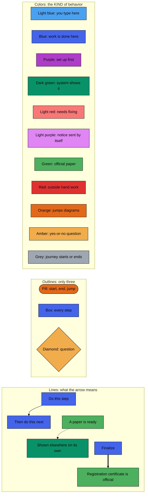
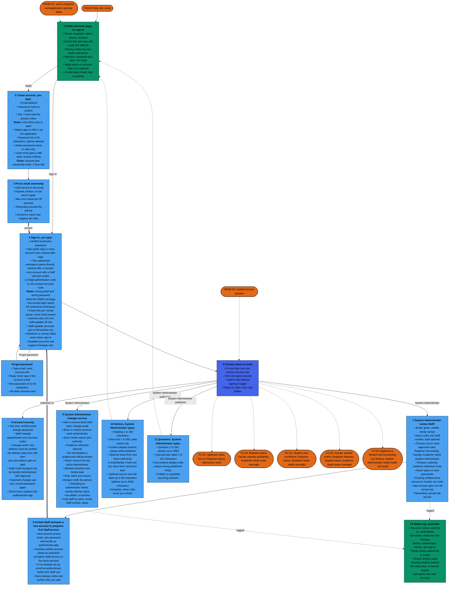

# TALA whole-system lifecycle flowchart

## How this is organized, and why

This reader contains a legend, one overview, and six connected lifecycle diagrams. The areas follow the approved PRDs: D1 Access, D2 Admissions, D3 Academic Setup, D4 Enrollment, D5 Grades and Completion, D6 Accounts and Outputs. PRDs own the detailed guards and recovery: optional sensitive-field consent is separate from notice acknowledgement (01/02); operational dates follow their approved consuming action (03); retained money is reconciled through the same Term Account (04/06); effective released attempts govern requirement satisfaction, graduation applications and office clearance remain external while Registrar records approved conferral, and transcript blockers retain the actual request clock (05). The diagrams summarize those contracts without supplying extra gates.

- **D0 Overview** fits on one screen: the six modules as boxes, every handoff as a labeled arrow. Start here.
- **D1 to D6** each show one area step by step, numbered in the order work must happen. Every box names who acts and what to type, pick, upload, or click in everyday words, plus the record or paper that comes out.
- **Connector boxes** (orange dashed pill shape) are the glue: each module diagram starts with orange `FROM` boxes showing what flows in, and ends with orange `TO` boxes showing where its outputs go. Match the labels to trace the lifecycle across diagrams.
- **One border everywhere. Color tells you the KIND of behavior.** All are explained in the legend below, with every outline, color, and line we use.

## Legend: every shape, line, and color, drawn for real

The boxes below are actual diagram shapes, not pictures. Whatever a box looks like here is exactly how it looks in D0 to D6. Three outlines only: pill, box, diamond. One thin black border everywhere. Color tells you the KIND of behavior, and each box still names who does it in words.

In words, for anyone who wants it spelled out. A solid arrow means a person does the next step, such as sending an application for review. A dotted arrow means information flows automatically, a screen only shows it, or a notice is sent. A thick arrow means the result becomes official: enrollment creates the Certificate of Registration, releasing a class list makes its marks official, and issuing creates the official Transcript of Records. Colors: light blue means you type here, blue means work is done here, purple means set up first, dark green means the system shows it, light red means something needs fixing, light purple means a notice the system sends by itself, green means an official paper, red means outside hand work, orange means a jump to another diagram, amber means a question, grey means the journey starts or ends here. FROM means information arrives from another diagram, TO means it leaves to one. All borders are one thin black line. All words and arrows print in black.

Every screen and paper leads with Servitech Institute Asia. TALA comes second. A hold blocks only ONE named action, never sign-in. An email or internet failure never cancels a saved academic or money fact.

## D0 — Overview: the whole lifecycle on one screen

Academic planning runs on its own track. The arrows show when the areas share program and term facts, application dates, enrollment status, class demand, grades, payment clearance, and timetable changes. Read the detailed journey in D1 to D6. Every handoff below has matching orange connectors in those diagrams.

```mermaid
---
config:
  flowchart:
    nodeSpacing: 30
    rankSpacing: 55
  themeVariables:
    primaryTextColor: '#000000'
    tertiaryTextColor: '#000000'
    textColor: '#000000'
    lineColor: '#000000'
---
flowchart LR
  O_START(["Open Servitech TALA site"]):::startBox
  O_PUB["<b>Public welcome page</b><br/>• programs, dates, notices, answers<br/>• Apply and Sign in buttons"]:::sysBox
  O_M1["<b>D1 Access</b><br/>• accounts, sign-in, Staff access<br/>• notices, answers<br/>• Head reads only<br/>• System Administrator: accounts, public content, health and audit"]:::workBox
  O_M2["<b>D2 Admissions</b><br/>• Applicant forms and status<br/>• Registrar intake, review and decisions<br/>• school papers, Ready for enrollment"]:::workBox
  O_M3["<b>D3 Academic Setup</b><br/>• courses, calendar, classes<br/>• timetable, publish"]:::workBox
  O_M4["<b>D4 Enrollment</b><br/>• proposed subjects, confirmation, seats<br/>• official enrollment, registration certificate"]:::workBox
  O_M5["<b>D5 Grades and completion</b><br/>• rosters, incomplete marks, progress<br/>• degree award and transcript"]:::workBox
  O_M6["<b>D6 Accounts and official papers</b><br/>• bill, payment, current amount due<br/>• account statement and payment paper<br/>• finance data downloads and records"]:::workBox
  O_NAD(["Not admitted: safe notice<br/>stays in history"]):::startBox
  O_ALUM(["Graduate: read-only history"]):::startBox
  O_START --> O_PUB --> O_M1
  O_M1 --> O_M2
  O_M1 --> O_M3
  O_M1 -->|authorized roles| O_M4
  O_M1 -->|authorized roles| O_M5
  O_M1 -->|authorized roles| O_M6
  O_M2 -->|programs and application dates| O_M1
  O_M2 -->|Ready applicant| O_M4
  O_M2 -->|demand counts| O_M3
  O_M3 -->|active program facts and approved academic terms| O_M2
  O_M4 -->|unmet class demand| O_M3
  O_M4 -->|timetable revision impacts resolved| O_M3
  O_M4 -->|registration started for this applicant| O_M2
  O_M2==>|Not admitted| O_NAD
  O_M3 -->|courses, curriculum, timetable and windows| O_M4
  O_M3 -->|classes, course facts, grade window and read-only exam-period dates| O_M5
  O_M4 -->|proposal and changes| O_M6
  O_M6 -->|due-now clearance| O_M4
  O_M4 -->|official class roster| O_M5
  O_M4 -->|full withdrawal result| O_M5
  O_M5 -->|released grade effects| O_M4
  O_M5 -->|transcript request for clearance| O_M6
  O_M5 -->|current-term life-event review| O_M6
  O_M6 -->|Transcript request clearance| O_M5
  O_M4 -->|Student access| O_M1
  O_M5 -->|degree awarded| O_ALUM
  classDef inputBox fill:#4BA1F1,stroke:#000000,stroke-width:1px,color:#000000;
  classDef workBox fill:#4465E9,stroke:#000000,stroke-width:1px,color:#000000;
  classDef setupBox fill:#AE3EC9,stroke:#000000,stroke-width:1px,color:#000000;
  classDef sysBox fill:#099268,stroke:#000000,stroke-width:1px,color:#000000;
  classDef outsideBox fill:#E03131,stroke:#000000,stroke-width:1px,color:#000000;
  classDef paperBox fill:#4CB05E,stroke:#000000,stroke-width:1px,color:#000000;
  classDef connBox fill:#E16919,stroke:#000000,stroke-width:1px,color:#000000;
  classDef askBox fill:#F1AC4B,stroke:#000000,stroke-width:1px,color:#000000;
  classDef startBox fill:#9FA8B2,stroke:#000000,stroke-width:1px,color:#000000;
  classDef noteBox fill:#E085F4,stroke:#000000,stroke-width:1px,color:#000000;
  classDef warnBox fill:#F87777,stroke:#000000,stroke-width:1px,color:#000000;
```

## D1 — Public entry, sign-in, accounts and Staff access

## D2 — Admissions: application, review, decision and readiness

```mermaid
---
config:
  flowchart:
    nodeSpacing: 22
    rankSpacing: 40
  themeVariables:
    primaryTextColor: '#000000'
    tertiaryTextColor: '#000000'
    textColor: '#000000'
    lineColor: '#000000'
---
flowchart TB
  F_D1([FROM D1: Applicant starts form or Registrar opens admissions work]):::connBox
  F_D3([FROM D3: active program facts and approved academic terms]):::connBox
  F_D4([FROM D4: registration started for this applicant]):::connBox
  CYC["<b>1 Registrar sets intake dates and details:</b><br/>• Short code, display name, school term<br/>• Responsible Registrar<br/>• Opening, public closing, last day for new fix requests<br/>dates and times; last day is on or after public closing<br/>• Closing dates are inclusive in Asia/Manila time;<br/>exact cutoff only when approved<br/>• How to apply, help contact, privacy notice<br/>• Allowed applicant kinds and offered programs<br/><b>States:</b> Draft, Published, Cancelled<br/>Scheduled, Open or Closed follows the dates<br/><b>Publish checks:</b> valid term and dates<br/>active program and requirement set for each enabled path<br/>instructions, support, privacy, private file storage<br/>and an assigned Registrar<br/>• Publish, extend, close, reopen or cancel with authority<br/>• Date changes record old and new dates, reason, actor and time<br/>• Never delete a published intake"]:::setupBox
  RSET["<b>2 Registrar publishes selected preliminary requirements:</b><br/>• Path, edition, approval source and effective date<br/>• Selected PSA birth certificate copy and 2x2 photo<br/>• Purpose, requiredness, allowed private file and order<br/>• One external paper-submission instruction<br/>• Other paper receipt, checking and custody stay outside TALA<br/>• Published edition stays fixed; a successor replaces it"]:::setupBox
  HOME2["<b>3 Applicant home shows:</b><br/>• Stable reference, plain current status and progress<br/>• One permitted next action, responsible office and relevant due date<br/>• Application period, program and path<br/>• Selected preliminary-copy review and compact history<br/>• Draft, Submitted, Needs action, Admitted, Not admitted, Withdrawn<br/>• Derived Awaiting Registrar clearance, Ready for enrollment<br/>or Registration started; no early Student identity"]:::sysBox
  SUP2{"First-year or transfer<br/>we support online?"}:::askBox
  OPEN2{"Is the intake open<br/>for new applications?"}:::askBox
  CLOSED2(["Closed: new applications and first submissions stop<br/>existing drafts are read-only until authorized extension<br/>Discard an unsubmitted draft remains available<br/>review and clearance work continue<br/>active fix requests remain open after due date or boundary<br/>overdue stays Action needed, never auto-refused<br/>Cancelled: new starts and first submissions stop<br/>existing cases resolve with their own authority<br/>safe reason, support and history remain"]):::startBox
  OUT2["Not handled by this online path:<br/>foreign-student, returning/readmission,<br/>cross-enrollment, second-degree, special/non-degree<br/>or refresher study; exam/interview/appeal,<br/>scholarship, medical, accommodation, courier,<br/>appointment or credit-evaluation request; collecting<br/>schedule, delivery-mode, preferred-time or Faculty<br/>arrangement choices<br/>Contact the Registrar"]:::outsideBox
  S1B["<b>4 Step 1 Choice, pick:</b><br/>• Application period, applicant kind, program<br/>• One application per account and period"]:::inputBox
  S2B["<b>5 Step 2 Identity and contact:</b><br/>• Required first/last name, birth date, citizenship and mobile<br/>• Verified email read-only; city/municipality and province<br/>• Optional middle/suffix, sex, civil status and bounded address detail<br/>• One guardian contact required below 18<br/>• One optional complete emergency contact for adults<br/>• LRN: Provided, Not issued or Not available<br/>Provided is exactly 12 digits; no invented identifier<br/>• No arbitrary minimum admission age"]:::inputBox
  S3B["<b>6 Step 3 Educational background:</b><br/>• Previous school, supported qualifying attainment<br/>• Exactly four-digit finish year, not after the current year<br/>• Trusted school assistance plus Other/manual name<br/>• Optional school location and source-supported transferee identifier<br/>• No repeated country entry on ordinary Philippine path<br/>• Foreign-issued credentials use existing Registrar referral"]:::inputBox
  S4B["<b>7 Step 4 Selected preliminary copies:</b><br/>• Read/acknowledge the current privacy notice before first upload<br/>• Required baseline PSA copy and 2x2 photo<br/>• One private PDF/JPEG/PNG up to 10 MiB per version<br/>• Photo is an image; multipage document is one PDF<br/>• Save draft / Save and continue actually persist<br/>• Other paper documents remain outside TALA"]:::inputBox
  S5B["<b>8 Step 5 Review and submit:</b><br/>• Review the current application and selected files<br/>• Confirm accuracy separately from the prior privacy acknowledgment<br/>• Submit only after required validation passes<br/>• Preserve truthful notice/submitted-version evidence"]:::inputBox
  SUBM["<b>9 Submit</b><br/><b>Gives:</b> tracking number e.g. APP-2026-NNNN<br/>• Frozen copy of this version<br/>• Submitted date and time"]:::workBox
  ACKB["<b>Acknowledgment paper, shows:</b><br/>• Servitech Institute Asia and applicant name<br/>• Tracking number, intake, program, kind<br/>• Submitted copy and rule-set edition used<br/>• What was submitted, which rules applied<br/>• How to hand in physical papers<br/>• Paper number plus print time<br/>• Older copy visibly marked historical<br/>• Failure makes no partial paper; retry safely<br/>• Proves applied, NOT admitted"]:::paperBox
  QUE2["<b>10 Registrar Admissions workbench:</b><br/>• Tabs: Needs review, Waiting for applicant, Clearance<br/>Ready for enrollment, History<br/>• Work queues are not additional stored decisions<br/>• Search reference/name/email; exact LRN only when authorized<br/>• Filter current source, path, status and overdue work<br/>• One main action plus contextual secondary actions"]:::workBox
  CORB["<b>11 Ask for fix, types:</b><br/>• Named items, one clear instruction, responsible person<br/>• Due date and time on or before the inclusive boundary<br/>• One active request at a time<br/>• New requests may be issued after public closing<br/>through the correction boundary<br/>• An active request remains actionable after its due date<br/>or the boundary; overdue stays Action needed<br/>• Never auto-refuse; after the boundary, a new request<br/>needs an authorized extension<br/>• Review, decisions and papers continue"]:::inputBox
  AFIX["<b>12 Applicant fixes named items only</b><br/>• Resubmits, older versions kept"]:::inputBox
  EREV["<b>13 Check files, types: file,<br/>result, explanation</b><br/>• Not submitted, under review<br/>accepted as early proof, or needs action<br/>• Accepted never means proven"]:::inputBox
  IDEN["<b>14 Identity check, types: check,<br/>result, proof reference, corrected learner number</b><br/>• Number clash or name warning never blocks submit<br/>• Blocks Admitted until recorded as:<br/>same person, different person, or fixed number<br/>• No scores or merging; number stays private"]:::inputBox
  DECB["<b>15 Decision, types: admit choice,<br/>reason, safe note to applicant</b><br/>• First routine decision uses recorded Registrar authority and time<br/>• Replacement or exceptional approval needs a separate approval reference<br/>• Admitted needs resolved identity and accepted preliminary copies<br/>• Not admitted needs a recorded decision basis and safe explanation<br/>• Head joins only rare academic exceptions<br/>• Appeals happen outside the system<br/>• No bulk admit<br/>• Wrong call fixed by a new decision on top<br/>history kept"]:::inputBox
  NADB(["Not admitted: safe notice<br/>plus support contact, history kept"]):::startBox
  ADB["Admitted: how plus where<br/>to bring official school papers"]:::workBox
  PAPEROUT["Applicant or prior school presents required papers outside TALA<br/>The school checks authenticity, receipt, custody and follow-up<br/>Registrar confirms the resulting enrollment permission"]:::outsideBox
  CRDB["<b>16 Record one Registrar enrollment clearance:</b><br/>• Cleared or Action needed, current submitted version and decision<br/>• Registrar actor/time; safe instruction when action is needed<br/>• Corrections append successor/reason; old results remain history<br/>• No individual paper-processing records<br/>• Missing/stale result is never Cleared<br/>• Legacy per-document history cannot fabricate the new clearance"]:::inputBox
  READYQ{"Current Admitted decision, resolved identity<br/>and matching current Cleared result?"}:::askBox
  RDYB["<b>17 Derived Ready for enrollment:</b><br/>• D4 reads the same identity/application reference<br/>current admitted decision, clearance and source versions<br/>• No copied handover, paper checklist or Student number<br/>• Missing clearance shows Awaiting Registrar clearance<br/>• Source/clearance change removes readiness and flags an active case<br/>before finalization; no silent reversal of official enrollment"]:::sysBox
  WDB["<b>Quit applying:</b> Applicant confirms while<br/>Submitted, Action needed, or Admitted<br/>before D4 registration starts; reason is optional<br/>• Registrar records offline withdrawal with reason<br/>and authority<br/>• Registrar may reopen before registration when the cycle permits<br/>same reference, submitted copy and history remain"]:::workBox
  ASSB2["<b>Registrar helps prepare a Draft:</b><br/>eligible Applicant and reason first<br/>• Same 5 steps; Registrar, owner and time recorded<br/>• Existing approval/office references optional<br/>• Applicant reviews declarations and submits"]:::inputBox
  MAILB["<b>Emails, automatic:</b> receipt, fix needed<br/>admitted, not admitted, ready, quit<br/>• No email for drafts or routine saves"]:::noteBox
  T_D4([TO D4: Ready applicant]):::connBox
  T_D3([TO D3: demand counts]):::connBox
  T_D1([TO D1: active programs and application opening dates]):::connBox
  F_D1-.-> HOME2 --> SUP2
  F_D1-.-> CYC
  F_D3-.-> CYC
  F_D4-.-> HOME2
  HOME2 -->|Needs help| ASSB2 --> S1B
  SUP2 -->|Yes| OPEN2
  OPEN2 -->|Yes| S1B --> S2B --> S3B --> S4B --> S5B
  OPEN2 -->|No| CLOSED2
  S5B==>|Submit| SUBM
  SUP2 -->|No| OUT2
  CYC --> RSET
  CYC -->|Cancelled with authority| CLOSED2
  CYC-.-> T_D1
  CYC-.-> OPEN2
  RSET-.-> S1B
  SUBM==>|prints| ACKB
  SUBM --> QUE2
  SUBM-.-> MAILB
  QUE2 --> CORB --> AFIX
  CORB-.-> MAILB
  AFIX==>|resubmits| QUE2
  QUE2 --> EREV --> QUE2
  QUE2 --> IDEN --> QUE2
  QUE2 --> DECB
  DECB-.-> MAILB
  DECB==>|Admitted| ADB --> PAPEROUT --> CRDB --> READYQ
  READYQ -->|Yes| RDYB
  READYQ -->|No, resolve the named current source| CRDB
  DECB==>|Not admitted| NADB
  HOME2 -->|Quit| WDB
  WDB -->|Registrar reopens when cycle permits| QUE2
  WDB-.-> MAILB
  RDYB-.-> T_D4
  RDYB-.-> T_D3
  RDYB-.-> MAILB
  RDYB -->|Current decision or clearance is superseded| CRDB
  classDef inputBox fill:#4BA1F1,stroke:#000000,stroke-width:1px,color:#000000;
  classDef workBox fill:#4465E9,stroke:#000000,stroke-width:1px,color:#000000;
  classDef setupBox fill:#AE3EC9,stroke:#000000,stroke-width:1px,color:#000000;
  classDef sysBox fill:#099268,stroke:#000000,stroke-width:1px,color:#000000;
  classDef outsideBox fill:#E03131,stroke:#000000,stroke-width:1px,color:#000000;
  classDef paperBox fill:#4CB05E,stroke:#000000,stroke-width:1px,color:#000000;
  classDef connBox fill:#E16919,stroke:#000000,stroke-width:1px,color:#000000;
  classDef askBox fill:#F1AC4B,stroke:#000000,stroke-width:1px,color:#000000;
  classDef startBox fill:#9FA8B2,stroke:#000000,stroke-width:1px,color:#000000;
  classDef noteBox fill:#E085F4,stroke:#000000,stroke-width:1px,color:#000000;
  classDef warnBox fill:#F87777,stroke:#000000,stroke-width:1px,color:#000000;
```

## D3 — Academic setup: catalog, calendar, classes and timetable

```mermaid
---
config:
  flowchart:
    nodeSpacing: 22
    rankSpacing: 40
  themeVariables:
    primaryTextColor: '#000000'
    tertiaryTextColor: '#000000'
    textColor: '#000000'
    lineColor: '#000000'
---
flowchart TB
  F_D2([FROM D2: demand counts]):::connBox
  F_D1([FROM D1: Registrar plans; Faculty submits availability; Academic Head reads oversight]):::connBox
  F_D4([FROM D4: unmet class demand]):::connBox
  F_D4R([FROM D4: timetable revision impacts resolved]):::connBox
  PAUTH["<b>1 Program approval, types:</b><br/>• Program, regulator, approval kind and reference<br/>• Valid from and until, current status<br/>• Which approved curriculum it allows, then switch on<br/>• Old approvals retired by new ones, never deleted"]:::setupBox
  COURSE["<b>2 Subject update, types:</b><br/>• Subject code, title, units, weekly class hours<br/>• Classification: ordinary, Physical Education<br/>or National Service Training Program equivalent<br/>• Allowed modes: on-campus, online<br/>• Courses required before or with this course<br/>approved equivalents, class schedule pattern<br/>• Usual room kind, needed room features<br/>• When this approved revision takes effect<br/>• Recurring meetings or externally arranged<br/>with no recurring timetable meeting; that course<br/>still appears in enrollment, the Certificate of<br/>Registration, grades and completion<br/>• Approval reference<br/>• Use simple course lists, not custom rules"]:::setupBox
  CURR["<b>3 Study plan edition, types:</b><br/>• Program, edition code, name, first intake term<br/>• Rows: subject, group, year, term kind<br/>term name, order<br/>• If approved: outside skill, required level<br/>plan position, approval, effective edition<br/>and whether tracked only or required to finish<br/>• Approving authority, source/reference and approval date<br/>• Live rows read-only, new edition replaces"]:::setupBox
  IMPB["<b>4 Optional curriculum CSV upload:</b><br/>• Fixed template, one file, max 5 MiB<br/>and 5,000 nonblank rows<br/>• Columns: template version, program code,<br/>curriculum version, name and year, term placement,<br/>course code and title, units, prerequisite courses,<br/>corequisite courses, equivalents, meeting treatment,<br/>source reference<br/>• Preview every row before import<br/>• Errors block; warnings need acknowledgement<br/>• Valid file creates all Draft rows together<br/>failure creates none; activation is separate<br/>• Findings file names each row, issue and recovery"]:::inputBox
  TERM2B["<b>5 Term calendar, types:</b><br/>• Academic year, First, Second or Special Term<br/>approved display name and exact term reference<br/>• Office start and end, class start and end<br/>• Academic Head approves outside TALA;<br/>Registrar records approval reference and date<br/>• Teacher reply due date<br/>• Special Term: approved schedule and class-hour<br/>or class-day basis, plus reason for its hours<br/>• Fixed 30-minute grid within approved hours<br/>• Enrollment, adjustment, drop and grade-entry<br/>windows: open, close, approved cutoff time<br/>• Close dates are inclusive in Asia/Manila time;<br/>an exact cutoff needs approved authority<br/>• Exam period: start and end, for information<br/>• Weekly rows: day, earliest start, latest end<br/>• Breaks plus dated exceptions<br/><b>States:</b> Draft, Active, Closed<br/>• Activate after Term/instruction dates, grid, breaks<br/>exceptions and authority pass readiness<br/>• Each operational action needs its own configured window<br/>• Missing dates disable that action with Registrar setup guidance<br/>• Create each term separately; activation does not open enrollment<br/>• More than one term can run at once<br/>• Exam period shown to roles for info only<br/>• Missing exam source shows unavailable"]:::setupBox
  COH2["<b>6 Student groups: confirmed group<br/>plus expected headcount</b><br/>• From current students, Ready applicants<br/>unmet demand from D4"]:::setupBox
  OFFR2["<b>7 Class offerings:</b><br/>• Build planned ones from term, program<br/>plan edition, year, with include ticks and counts<br/>• Or add a class with outside approval and reason<br/>• Planned versus added is about origin<br/>not about the student<br/>• Confirm, split, share, add, cancel sections:<br/>code, seat limit, linked groups and counts<br/>• Weekly meeting pattern and each block's<br/>on-campus or online mode, room needs<br/>• Share only same subject or equal subject<br/>• On-campus capacity cannot exceed its assigned room<br/>online uses separate institution-approved capacity<br/>• TALA never splits or merges a class by itself<br/>• Cancel needs reason plus approval"]:::setupBox
  ROOM2["<b>8 Rooms, types: code, name<br/>capacity, kind, features<br/>in use or not, blocked times</b><br/>• No travel maps, no booking market"]:::setupBox
  QUAL2["<b>9 Teacher setup: who may teach<br/>which subject, recorded by and when<br/>plus proof, valid dates</b><br/>• Each teacher's approved term teaching-unit<br/>and course-preparation limits, authority and dates<br/>• Exact teacher, room or time commitments<br/>need reason and outside approval<br/>• Extra load: approved extra units with approval<br/>reason, rare, outside OK"]:::setupBox
  AVAIL2["<b>10 Faculty term declaration:</b><br/>• One declaration: unavailable day and time blocks<br/>or No additional restrictions<br/>• Note the reason when correcting a prior reply<br/>• Requested by email with a due date<br/>• No preferred-time field or approval queue<br/>• Late correction rechecks the draft timetable<br/>or starts the published-change path"]:::inputBox
  DISP2["<b>11 Make and check the term timetable</b><br/>• Registrar reviews combined class, room<br/>and Faculty scheduling inputs<br/>• The scheduling service makes a full draft<br/>from one fixed copy of those inputs<br/>• TALA independently checks every rule<br/>• Result: best schedule proven; valid schedule<br/>but best not proven; no possible schedule; no answer yet<br/>invalid schedule model; or service failure<br/>• Priorities: fewer group mode changes, less cohort<br/>waiting, balanced teacher workload, less teacher idle<br/>time, fewer empty room seats, then earlier times<br/>• Scores describe schedule tradeoffs, not correctness<br/>• Failure names reason, information, owner and next step"]:::workBox
  GENQ{"Was a complete valid<br/>timetable made?"}:::askBox
  FIXGEN["No timetable published<br/>Named owner fixes the source or service<br/>Registrar retries when ready"]:::warnBox
  REVGEN["Registrar rejects or repairs the draft<br/>Shows all changed meetings and effects<br/>No change becomes official yet"]:::workBox
  CAND2["<b>12 Registrar reviews the draft timetable:</b><br/>week view, full table and warnings<br/>• Accept with review note, or reject<br/>• One-meeting fix picks day, time, teacher,<br/>delivery mode, and room or online location;<br/>all other meetings stay fixed<br/>• Invalid fix changes nothing<br/>• Whole timetable repair changes as few other meetings<br/>as possible; preview all changes before accepting<br/>• No rule can be skipped<br/>• Retry same information if no answer yet<br/>change the conflicting information if no timetable<br/>is possible; record a reason if best is unproven"]:::inputBox
  SIGNOFF["School signs off the academic timetable<br/>outside TALA; Registrar records approval reference"]:::outsideBox
  PUBB["<b>13 Registrar publishes after sign-off:</b><br/>types approval reference and optional note<br/><b>Gives:</b> fixed timetable version and classes<br/>• Faculty see only their own assignments<br/>and history of changes that affect them<br/>• Assigned teachers get one publication notice<br/>• Old versions stay readable, never mixed"]:::inputBox
  TIME["<b>Published timetable paper</b><br/>• One published version; print or save as PDF<br/>• Servitech Institute Asia, Academic Year, exact Term<br/>reference, approval reference, and version<br/>• Publication and generation times; role or filter scope<br/>program or cohort context<br/>• Ordered day, time, subject, class, teacher as allowed<br/>mode, room or online location<br/>• Repeat Term, version, and table headings on later pages<br/>• Older versions marked Superseded<br/>• Missing source or failure makes no partial paper"]:::paperBox
  REVB["<b>14 Change published plan:</b><br/>• Draft the change with same fields<br/>• Whole term rechecked, new edition<br/>old edition linked plus exact effect<br/>• Blocked while students sit in it<br/>resolve affected seats first in D4<br/>• Obtain outside sign-off before republishing<br/>• One notice to affected teachers, students"]:::workBox
  HEAD2["<b>Academic Head watches only:</b> calendar<br/>curriculums, readiness, draft proof<br/>published plan, exam weeks"]:::sysBox
  T_D2([TO D2: active program facts and approved academic terms]):::connBox
  T_D4B([TO D4: approved courses and curriculum, published timetable, and registration windows]):::connBox
  T_D5B([TO D5: published classes, approved course and curriculum facts, grade-entry window, and read-only exam-period dates]):::connBox
  F_D1-.-> PAUTH
  F_D1-.-> COURSE
  F_D1-.-> IMPB
  F_D1-.-> TERM2B
  F_D1-.-> ROOM2
  F_D1-.-> QUAL2
  F_D1-.-> AVAIL2
  F_D1-.-> HEAD2
  PAUTH --> CURR
  COURSE --> CURR
  IMPB --> CURR
  CURR --> COH2
  F_D2-.-> COH2
  F_D4-.-> COH2
  TERM2B --> OFFR2
  COH2 --> OFFR2
  ROOM2 --> OFFR2
  OFFR2 --> DISP2
  QUAL2 --> DISP2
  AVAIL2 --> DISP2
  DISP2 --> GENQ
  GENQ -->|Yes| CAND2
  GENQ -->|No| FIXGEN --> DISP2
  CAND2 -->|Reject or repair| REVGEN --> DISP2
  CAND2 -->|Accept valid full draft| SIGNOFF
  SIGNOFF==>|Registrar publishes| PUBB
  PUBB==>|freezes| TIME
  PUBB --> REVB
  PUBB-.-> HEAD2
  PUBB-.-> T_D4B
  TERM2B-.-> T_D4B
  PUBB-.-> T_D5B
  TERM2B-.-> T_D5B
  PAUTH-.-> T_D2
  TERM2B-.-> T_D2
  REVB-.-> F_D4R
  F_D4R-.-> SIGNOFF
  classDef inputBox fill:#4BA1F1,stroke:#000000,stroke-width:1px,color:#000000;
  classDef workBox fill:#4465E9,stroke:#000000,stroke-width:1px,color:#000000;
  classDef setupBox fill:#AE3EC9,stroke:#000000,stroke-width:1px,color:#000000;
  classDef sysBox fill:#099268,stroke:#000000,stroke-width:1px,color:#000000;
  classDef outsideBox fill:#E03131,stroke:#000000,stroke-width:1px,color:#000000;
  classDef paperBox fill:#4CB05E,stroke:#000000,stroke-width:1px,color:#000000;
  classDef connBox fill:#E16919,stroke:#000000,stroke-width:1px,color:#000000;
  classDef askBox fill:#F1AC4B,stroke:#000000,stroke-width:1px,color:#000000;
  classDef startBox fill:#9FA8B2,stroke:#000000,stroke-width:1px,color:#000000;
  classDef noteBox fill:#E085F4,stroke:#000000,stroke-width:1px,color:#000000;
  classDef warnBox fill:#F87777,stroke:#000000,stroke-width:1px,color:#000000;
```

## D4 — Enrollment: proposal, seats, finalize, Certificate of Registration and changes

```mermaid
---
config:
  flowchart:
    nodeSpacing: 20
    rankSpacing: 38
  themeVariables:
    primaryTextColor: '#000000'
    tertiaryTextColor: '#000000'
    textColor: '#000000'
    lineColor: '#000000'
---
flowchart TB
  F1_D1([FROM D1: Student uses enrollment; Registrar works; Academic Head reads oversight]):::connBox
  F2_D2([FROM D2: Ready applicant]):::connBox
  F3_D3([FROM D3: approved courses and curriculum, published timetable, and registration windows]):::connBox
  F6_D6([FROM D6: current due cleared]):::connBox
  F5_D5([FROM D5: released grade effects]):::connBox
  STARTB["<b>1 Start with the right term</b><br/>• Ready Applicant: Start enrollment<br/>• Continuing Student: Start registration<br/>from the existing account and Student profile<br/>• Reuse the existing Student number and contact facts<br/>• Official profile changes need Registrar authority<br/>• Returning Student uses this lifecycle after approval<br/>not a new Admissions application<br/>• Eligible continuing Students get one opening notice<br/>with term and deadline"]:::inputBox
  WINB{"<b>2 Sign-up window open</b><br/>or late permission recorded?<br/>• Close date inclusive in Asia/Manila time;<br/>exact cutoff only when approved<br/>• Open to: new Ready applicants, standard continuing<br/>Students, advised or exception cases, or all eligible learners"}:::askBox
  WAITB["Wait for window or authority<br/>Expired case never carries to another term<br/>Past the final cutoff: Not Enrolled"]:::workBox
  NENB(["Not Enrolled: no seat or registration certificate<br/>Registrar may reopen only with exact authority<br/>otherwise start again next term"]):::startBox
  CASEB["<b>3 Open registration case: pick</b><br/>• Ready application or student record, and Term<br/>• Registrar-assisted start records its authority<br/><b>Gives:</b> case reference<br/>• One case per learner per term"]:::inputBox
  GATEB{"<b>4 May this student continue?</b><br/>• Only finished published marks count<br/>• Allowed, Needs advice, Blocked, Waiting decision<br/>• A failed or missing first subject blocks<br/>only the subject that needs it<br/>• Blocked means: wait for the named source"}:::askBox
  GATEH["Named source owner corrects or records<br/>the decision; Registrar checks again<br/>No general override"]:::warnBox
  PROPB["<b>5 Registrar prepares the proposed subjects and class sections</b><br/>• Year-term slot asked only when advised<br/>• Standard: one valid full block proposed<br/>or Registrar picks among several valid blocks<br/>• Transfer credit, old plan, shift, retake<br/>or reduced load uses approved advice as needed<br/>• Return uses the continuing path after approval<br/>• Pending, failed or incomplete first subject<br/>excludes only the subjects that need it<br/>• Unrelated eligible subjects stay available<br/>• Send for confirmation<br/><b>Gives:</b> dated list edition<br/>plus Why these subjects<br/>• Material change asks the learner again<br/>• Learner gets one proposal-ready notice"]:::inputBox
  ASSB["<b>Helped confirm outside TALA, records:</b><br/>• Who confirmed, method, proof reference, time<br/>• The same exact proposal version"]:::inputBox
  CONFB{"<b>6 Student confirms<br/>this exact list?</b>"}:::askBox
  SEATB["<b>7 Check plus hold a seat:</b><br/>• First subjects done, no clashes<br/>room for one more, timetable fits<br/>• A hold is not enrollment yet<br/>• Holds end at the deadline, seats freed"]:::workBox
  EXPIRE["Seat hold expires at school deadline<br/>Seat is released; case and payment proof stay<br/>Learner gets one release notice with next step<br/>and replans"]:::warnBox
  SQB{"<b>Seat good<br/>plus free?</b>"}:::askBox
  SHRTB["<b>No seat: shows owner plus next step</b><br/>• Another valid class, seat count fixed<br/>within room size, or approved extra class<br/>• Outlook: On target, At risk, or<br/>Future opportunity not yet confirmed<br/>• Counts back to D3 as unmet demand<br/>• No waiting numbers, no promises"]:::warnBox
  OVLD["<b>Extra units for soon graduates:</b><br/>• Types: approval reference, approval date<br/>evidence reference, reason<br/>• Draft stage only, changes nothing alone"]:::setupBox
  FXB["<b>8 Final recheck, all five:</b><br/>• 1 allowed, 2 list confirmed<br/>• 3 seats good, 4 money cleared and current<br/>• 5 Registrar records now<br/>• A hold blocks only its named action<br/>not the whole account or sign-in<br/>• A failed check names the office plus next step<br/>• If money needs action, learner gets one notice<br/>• Clearance from D6 must be fresh"]:::workBox
  FINB["<b>9 Registrar selects Finalize</b><br/><b>Gives:</b> official subject sign-ups<br/>• Class lists plus student timetable<br/>• Registration certificate version 1<br/>money and study effects, one email<br/>• First time: confirm existing verified identity<br/>and contact; create minimal Student profile with<br/>permanent number, entry term, program and curriculum<br/>• Same account gains Student screens<br/>• Email failure never undoes enrollment<br/>• Retry makes no duplicate person or paper"]:::workBox
  CORB2["<b>Frozen Certificate of Registration</b><br/>• Servitech Institute Asia, version, issue time<br/>student number and full legal name<br/>• Program, curriculum version, term, selection basis<br/>and curriculum levels represented<br/>• Official subjects: codes, units, contact hours<br/>class references, schedules, modes, rooms, teachers<br/>and total units<br/>• Assessment snapshot, basis, source reference<br/>and recorded authorities when required<br/>• Older editions marked historical<br/>• Money review later never rewrites it<br/>• Failure makes no partial paper; retry safely"]:::paperBox
  ADJP["<b>10 Change step 1, propose, types:</b><br/>• Kind: add, swap, remove, or change class<br/>• Current subject, new class section<br/>• Outside approval, reference, evidence, reason<br/>• Use this term's adjustment window<br/>or a specific recorded late permission"]:::inputBox
  ADJF["<b>Step 2, money: no-extra-cost proof<br/>from Accounting, or a new bill<br/>plus fresh clearance for cost-plus</b>"]:::workBox
  ADJA["<b>Step 3, apply approved change together:</b><br/>seats, class lists, timetable, money view<br/>new registration certificate version<br/>• Learner gets one change or Course Drop notice<br/>a drop starts Accounting review"]:::workBox
  DROPB["<b>11 Drop a subject, types:</b><br/>• Which enrolled subject, reason<br/>approval reference, late permission if late<br/>• Only an enrolled subject without final result<br/>within its drop window or exact late authority<br/>• Academic removal starts Accounting review<br/>not an automatic refund or lower bill<br/>• Quitting all subjects becomes<br/>a recorded withdrawal in D5"]:::inputBox
  LATEB["<b>Late permission, types:</b><br/>• Action, old subject, new class<br/>• Approving office, approval reference plus date<br/>• Reason, start date, student consent proof<br/>• Source school decision<br/>• Allows the action, changes nothing alone"]:::setupBox
  CXB["<b>Quit the file:</b> student cancels<br/>before confirming; reason optional<br/>• After confirmation or seat hold, Registrar<br/>records cancellation with reason and approval<br/>• Seats freed, payment proof kept"]:::workBox
  REOPB["<b>Reopen the same file:</b> before the cutoff<br/>or after with exact late permission<br/>• Student cannot reopen alone, Registrar only<br/>• Rechecks proposal, seats, sources and clearance<br/>• Retains money history; Accounting reconciles once"]:::setupBox
  IMP2["<b>New mark hits an open file:</b><br/>• Before finalize: list goes stale, back to prep<br/>• After finalize: sign-up stands until<br/>a separately approved change<br/>• Settle with class outcome plus evidence reference<br/>or a recorded result"]:::workBox
  PCORR["<b>Fix a student profile:</b> old and corrected values<br/>reason, authority and optional evidence reference<br/>actor and effective time<br/>• Future screens updated<br/>• Issued papers never rewritten"]:::inputBox
  TIMP["<b>Class moved or cancelled:</b><br/>• No silent moves, ever<br/>• Registrar records new seats,<br/>approved cancel, or approved result<br/>• Republish only after affected seats are fixed<br/>• Send the resolved impact back to D3"]:::workBox
  HEAD4["Academic Head watches enrollment<br/>readiness, authority and outcomes only<br/>No proposal, seat or finalize action"]:::sysBox
  T6_D6([TO D6: proposal and approved changes]):::connBox
  T5_D5([TO D5: official class roster membership]):::connBox
  T5_LIFE([TO D5: full withdrawal result]):::connBox
  T1_D1([TO D1: Student access granted]):::connBox
  T3_D4([TO D3: unmet class demand]):::connBox
  T3_REV([TO D3: timetable revision impacts resolved]):::connBox
  T2_D2([TO D2: registration started for this applicant]):::connBox
  F1_D1-.-> STARTB
  F1_D1-.-> OVLD
  F1_D1-.-> LATEB
  F1_D1-.-> PCORR
  F1_D1-.-> HEAD4
  F2_D2-.-> STARTB --> WINB
  F3_D3-.-> WINB
  F3_D3-.-> SEATB
  F3_D3-.-> TIMP --> ADJP
  TIMP-.-> T3_REV
  WINB -->|Yes| CASEB --> GATEB
  CASEB-.-> T2_D2
  WINB -->|No| WAITB
  WAITB -->|Window opens or late permission recorded| STARTB
  WAITB -->|Final cutoff passes| NENB
  NENB -->|Registrar has exact reopen authority| REOPB --> CASEB
  GATEB -->|Allowed or Advising| PROPB
  GATEB -->|Blocked or pending decision| GATEH --> GATEB
  OVLD --> PROPB
  PROPB --> CONFB
  PROPB --> ASSB --> SEATB
  CONFB -->|Yes| SEATB --> SQB
  SEATB -->|Registrar cancels after confirmation| CXB
  SEATB -->|Deadline passes before finalization| EXPIRE --> PROPB
  CONFB -->|Change| PROPB
  CONFB -->|Quit| CXB --> NENB
  SQB -->|Yes| FXB
  SQB -->|No| SHRTB --> PROPB
  SHRTB-.-> T3_D4
  F6_D6-.-> FXB
  F5_D5-.-> IMP2 --> GATEB
  PCORR --> GATEB
  FXB==>|All clear| FINB
  FINB==>|freezes| CORB2
  FXB -->|Failed check: named owner fixes source| FXB
  FINB-.-> T5_D5
  FINB-.-> T1_D1
  PROPB-.-> T6_D6
  CORB2 --> ADJP --> ADJF --> ADJA
  CORB2 -->|Approved course drop| DROPB
  ADJA==>|new edition| CORB2
  ADJF-.-> T6_D6
  ADJA-.-> T6_D6
  LATEB --> ADJP
  LATEB --> DROPB --> ADJA
  DROPB==>|All subjects removed| T5_LIFE
  classDef inputBox fill:#4BA1F1,stroke:#000000,stroke-width:1px,color:#000000;
  classDef workBox fill:#4465E9,stroke:#000000,stroke-width:1px,color:#000000;
  classDef setupBox fill:#AE3EC9,stroke:#000000,stroke-width:1px,color:#000000;
  classDef sysBox fill:#099268,stroke:#000000,stroke-width:1px,color:#000000;
  classDef outsideBox fill:#E03131,stroke:#000000,stroke-width:1px,color:#000000;
  classDef paperBox fill:#4CB05E,stroke:#000000,stroke-width:1px,color:#000000;
  classDef connBox fill:#E16919,stroke:#000000,stroke-width:1px,color:#000000;
  classDef askBox fill:#F1AC4B,stroke:#000000,stroke-width:1px,color:#000000;
  classDef startBox fill:#9FA8B2,stroke:#000000,stroke-width:1px,color:#000000;
  classDef noteBox fill:#E085F4,stroke:#000000,stroke-width:1px,color:#000000;
  classDef warnBox fill:#F87777,stroke:#000000,stroke-width:1px,color:#000000;
```

## D5 — Grades, records, graduation, degree award

```mermaid
---
config:
  flowchart:
    nodeSpacing: 20
    rankSpacing: 38
  themeVariables:
    primaryTextColor: '#000000'
    tertiaryTextColor: '#000000'
    textColor: '#000000'
    lineColor: '#000000'
---
flowchart TB
  F1([FROM D1: Faculty submits marks; Registrar releases; Student reads; Academic Head reads oversight]):::connBox
  F4([FROM D4: official class roster membership]):::connBox
  F4L([FROM D4: full withdrawal result]):::connBox
  F3W([FROM D3: published classes, approved course and curriculum facts, grade-entry window, and read-only exam-period dates]):::connBox
  F6([FROM D6: request-specific clearance]):::connBox
  ROSTB["<b>1 Class list per official class</b><br/>• Includes hands-on courses with no fixed meeting<br/>• Shows only students signed up now:<br/>official number, full legal name, sign-up status"]:::sysBox
  ROWB["<b>2 Teacher types one final mark per row:</b><br/>• 1.00 to 3.00 in 0.25 steps; also 4.00<br/>• All those marks pass; 5.00 fails<br/>• INC means incomplete work, with a note<br/>• No other mark; letter P is not a final mark<br/>• Save draft<br/><b>Gives:</b> Draft list"]:::inputBox
  LGRADE["<b>Late typing permission, types:</b><br/>• Which class, responsible teacher<br/>approval, open-from and close-at dates, reason<br/>• Late is not a correction"]:::setupBox
  SUBB["<b>3 Send full list: every row filled</b><br/>• Teacher gets one due-date action notice<br/>• Checks this list has not changed<br/>• Only current members, blanks cannot send<br/>• Designated teacher sends; replacement first<br/>needs an authorized teaching-assignment change<br/>• Other assigned teachers read and print only<br/><b>Gives:</b> Sent list"]:::workBox
  RETB["<b>4 Registrar sends back named rows only</b><br/>• One explanation 10 to 1000 characters<br/>• Teacher gets one review notice, no mark values<br/>• Never edits the teacher marks"]:::inputBox
  RELB["<b>5 Release the whole list at once:</b><br/>• Recheck members, teacher, completeness, edition<br/>• Nothing partial, all or nothing<br/><b>Gives:</b> permanent official marks<br/>• New averages, plan check, study effects<br/>• One review per open D4 file, same if repeated<br/>• Release email carries no marks or attachments<br/>• A released INC sends its deadline to student<br/>and assigned teacher"]:::workBox
  AVGB["<b>Averages, worked out by the system:</b><br/>• Weighted by subject units; every try counts<br/>• Physical Education and service training excluded<br/>• Incomplete, dropped, withdrawn work excluded<br/>• Display rounds to 2 decimal places<br/>• Overall average uses all included attempts<br/>not the average of term averages<br/>• Grades not complete: no partial number<br/>• Open included INC with an unsatisfied requirement: average waits<br/>• Overdue no-credit INC or satisfied retake: excluded with explanation<br/>original mark retained; show calculation as-of time<br/>• Complete with included units: value available<br/>• No included units: Not applicable, never zero<br/>• Last complete overall value says Through term"]:::sysBox
  VIEWB["<b>6 Student Study screens: finished marks<br/>by term, averages or waits-with-reason</b><br/>• Plan position: required subjects, every try<br/>approved credits, earned and remaining units<br/>missing subjects and unresolved gaps<br/>• Exam period info from the school calendar"]:::sysBox
  UNOB["<b>Unofficial Student Record</b><br/>• Servitech Institute Asia, Student name/number<br/>program and curriculum version<br/>• Record reference and generated time; academic record<br/>as of date/time; year and term groups<br/>course code/title, units, released mark, remarks<br/>all attempts and approved credits<br/>• Term attempted/earned units and average or<br/>not complete, incomplete or not applicable state<br/>• Cumulative attempted/earned/remaining units and<br/>General Weighted Average (GWA), or readiness state;<br/>completion, INC and correction context<br/>• Every page says UNOFFICIAL — for student reference<br/>• Not an official transcript; stale source blocks printing<br/>and failure makes no partial paper"]:::sysBox
  ROSTOUT["<b>Class roster print or data file</b><br/>• Servitech Institute Asia, term, class reference<br/>• Subject code and title, group, teacher<br/>• Current student count and time made<br/>• Rows ordered by name then school number<br/>• Each: school number, legal name, enrollment state<br/>• Faculty and Registrar only; work reference<br/>• No marks, contact details, applicant files<br/>or money details; not a grade paper<br/>• Empty class offers no print or data file<br/>• Stale or failed source: no partial file; refresh"]:::sysBox
  INCQ{"Is a released mark<br/>an unresolved INC?"}:::askBox
  INCDATE{"Is its one-year<br/>deadline still open?"}:::askBox
  IOPB["<b>7 Finish an INC while open:</b><br/>• Deadline 1 calendar year from term end<br/>Feb 29 becomes Feb 28 when needed<br/>• Open through 11:59:59 p.m. deadline day<br/>using Manila time<br/>• Teacher records the authorized completion result<br/>for the row and adds a short note<br/>• Registrar releases the follow-up mark<br/>• Student gets a result-available notice<br/>with no mark value or attachment<br/>• The old INC stays in history"]:::workBox
  ILAB["<b>8 Overdue INC: stays INC, no credit</b><br/>• Never turns into fail by itself<br/>• Completion action disabled while overdue<br/>show deadline, Registrar extension path or retake guidance<br/>• Only an approved later date reopens it<br/>• Else the student retakes the subject"]:::warnBox
  AMEB["<b>Amend an INC deadline before resolution:</b><br/>• Can correct it even after it is overdue<br/>• Old and new dates, authority and date<br/>• Reason 10 to 1000 characters, who and when<br/>• Student and teacher get one new-deadline notice<br/>• History only grows, never rewritten"]:::setupBox
  GCRB["<b>Fix a released mark, types:</b><br/>• Corrected mark, authority, reason<br/>optional evidence reference, who and when<br/>• No final correction date<br/><b>Gives:</b> new mark, old mark kept<br/>• New averages; issued transcript marked older<br/>• Student gets one updated-record notice<br/>with no mark values or attachment"]:::inputBox
  EXTB["<b>9 Outside test result, types:</b><br/>• Student, required skill, test date<br/>• Outside testing body, proof reference<br/>• Competent or not yet competent<br/>certificate plus expiry if any<br/>• Safe notes and approval reference<br/>• No proof shows Not recorded<br/>• Reassessment adds a new result; old one stays<br/>• Usually watch-only; blocks completion only<br/>if the approved curriculum requires it<br/>• Creates no mark, money effect or transcript"]:::inputBox
  ADECB["<b>10 School decision, types:</b><br/>• Student, term, study effect<br/>• Approval reference plus date, reason<br/>safe explanation, active from and until<br/>• Recorder and time kept in history"]:::inputBox
  LIFB["<b>11 Life events, types: kind, handling<br/>date, reason, approval<br/>planned return term, new program and plan<br/>effect checked</b><br/>• Kinds: leave, full withdrawal, return<br/>transfer out, program shift<br/>• Resulting states: Active, On leave, Withdrawn,<br/>Transferred out or Completed<br/>• Released grades and prior history stay<br/>• A bad mark alone never warns or expels<br/>• Coming back gives no seat by itself<br/>• Current-term changes update seats, class lists,<br/>timetable and Certificate of Registration, and trigger<br/>Accounting review; no refund or penalty is inferred<br/>• Student gets one authorized-decision notice"]:::inputBox
  GRAB["<b>12 Graduation application and office clearance</b><br/>Student follows the school procedure outside TALA<br/>Student Academics shows outstanding outcomes,<br/>Registrar ownership and the next office step"]:::outsideBox
  GRQ{"Is each curriculum requirement satisfied<br/>or in its current final-term completion path?"}:::askBox
  GRWAIT["Show the missing subject, result<br/>or required outside test and who can fix it<br/>• One action-needed email names the source<br/>responsible office and next step"]:::warnBox
  CONQ{"Are released curriculum outcomes<br/>and outside conferral authority ready?"}:::askBox
  CONB["<b>13 Award the degree, types:</b><br/>• Degree title, graduation date<br/>approval reference<br/>• Optional honors only with recorded<br/>approval from the institution outside TALA<br/><b>Needs:</b> each curriculum requirement satisfied<br/>by a released attempt or approved credit<br/>one attributable outside conferral go-ahead with date<br/>• Historical INC stays recorded when a retake satisfies the requirement<br/><b>Gives:</b> permanent award plus snapshot, Completed<br/>• Student gets a conferral notice, not a diploma"]:::inputBox
  CORAPP["<b>Fix wrong degree-award details:</b><br/>• Registrar records old and corrected values<br/>approval, reason, optional evidence, actor and date<br/>• Earlier record stays; affected issued transcript<br/>is marked older, never rewritten"]:::inputBox
  ALUB(["Graduate: read-only history plus papers"]):::startBox
  HEAD5["<b>Academic Head watches only</b><br/>Released marks, progress, life events<br/>degree awards and their authority<br/>No entry or release buttons"]:::sysBox
  TOROUT["Transcript request arrives through<br/>Registrar office outside TALA"]:::outsideBox
  TORREC["<b>Registrar records transcript request:</b><br/>date received, request reference<br/>verified identity, signer name and title<br/>seal placement instruction<br/>• System shows the 30-day due date"]:::inputBox
  TORQ{"Releasable official history, verified identity, external request<br/>Accounting clearance, signatory/template and issuance authority ready?<br/>No blanket graduation prerequisite"}:::askBox
  TORWAIT["Show missing source and office<br/>Wait or correct it before preview"]:::warnBox
  TORPRE["Registrar previews the exact transcript<br/>Preview does not issue a paper"]:::workBox
  TORISS["Registrar confirms the exact student, request<br/>record, clearance, template and signer, then issues<br/>a frozen transcript snapshot<br/>Failed issue makes no issuance event<br/>Later void or replacement needs authority<br/>Earlier versions remain in history"]:::workBox
  TORPAPER["<b>Official Transcript of Records</b><br/>• Servitech Institute Asia, address, contact, logo<br/>• Student name, number, program, curriculum version<br/>admission basis and date, prior school or credit if applicable<br/>• Transcript reference, template version, issue date/time<br/>generation reference/time, Page x of y<br/>• Years, terms, subject codes and historical titles<br/>units, released marks, remarks and all attempts<br/>approved credits, term and total earned units<br/>• Degree award when applicable; grading legend<br/>issue number, version, date and issue status<br/>• Issued, Voided, Replaced or Superseded shown<br/>• Registrar certification, current signer and title, seal area<br/>• Repeat Student/transcript identity and table headings<br/>on continuation pages<br/>• Registrar prints the issued version<br/>• Failure makes no partial paper; retry safely<br/>• No averages, bills or unsigned seal claim"]:::paperBox
  TORHAND["School signs, seals and delivers<br/>the paper outside TALA"]:::outsideBox
  T4([TO D4: released grade effects]):::connBox
  T6([TO D6: transcript request for clearance]):::connBox
  T6L([TO D6: current-term life-event review]):::connBox
  F1-.-> ROSTB
  F1-.-> LGRADE
  F1-.-> AMEB
  F1-.-> EXTB
  F1-.-> ADECB
  F1-.-> LIFB
  F1-.-> CORAPP
  F1-.-> GRQ
  F1-.-> HEAD5
  F4-.-> ROSTB --> ROWB --> SUBB
  F4L-.-> LIFB
  F3W-.-> SUBB
  ROSTB-.-> ROSTOUT
  LGRADE --> SUBB
  SUBB -->|Registrar returns named rows| RETB --> ROWB
  SUBB==>|Registrar releases full roster| RELB
  RELB-.-> AVGB --> VIEWB
  RELB-.-> HEAD5
  VIEWB-.-> UNOB
  RELB-.-> INCQ
  INCQ -->|Yes| INCDATE
  INCQ -->|No| VIEWB
  INCDATE -->|Yes| IOPB
  INCDATE -->|No| ILAB
  IOPB==>|Registrar releases follow-up mark| VIEWB
  IOPB-.-> T4
  AMEB --> IOPB
  ILAB --> VIEWB
  RELB -->|Authorized correction requested| GCRB
  GCRB==>|records corrected result| VIEWB
  GCRB-.-> T4
  RELB-.-> T4
  EXTB-.-> VIEWB
  ADECB-.-> T4
  LIFB-.-> T4
  LIFB-.-> T6L
  LIFB-.-> HEAD5
  VIEWB --> GRQ
  GRQ -->|Yes| GRAB --> CONQ
  GRQ -->|No| GRWAIT --> VIEWB
  CONQ -->|No| GRWAIT
  CONQ -->|Yes| CONB --> ALUB
  CONB-.-> HEAD5
  CORAPP-.-> HEAD5
  F1-.-> TOROUT --> TORREC
  VIEWB-.-> TORQ
  CONB-.->|Recorded degree facts only when applicable| TORPAPER
  TORREC-.-> T6
  F6-.-> TORQ
  TORREC --> TORQ
  TORQ -->|No| TORWAIT --> TORQ
  TORQ -->|Yes| TORPRE --> TORISS
  TORISS==>|issues| TORPAPER --> TORHAND
  classDef inputBox fill:#4BA1F1,stroke:#000000,stroke-width:1px,color:#000000;
  classDef workBox fill:#4465E9,stroke:#000000,stroke-width:1px,color:#000000;
  classDef setupBox fill:#AE3EC9,stroke:#000000,stroke-width:1px,color:#000000;
  classDef sysBox fill:#099268,stroke:#000000,stroke-width:1px,color:#000000;
  classDef outsideBox fill:#E03131,stroke:#000000,stroke-width:1px,color:#000000;
  classDef paperBox fill:#4CB05E,stroke:#000000,stroke-width:1px,color:#000000;
  classDef connBox fill:#E16919,stroke:#000000,stroke-width:1px,color:#000000;
  classDef askBox fill:#F1AC4B,stroke:#000000,stroke-width:1px,color:#000000;
  classDef startBox fill:#9FA8B2,stroke:#000000,stroke-width:1px,color:#000000;
  classDef noteBox fill:#E085F4,stroke:#000000,stroke-width:1px,color:#000000;
  classDef warnBox fill:#F87777,stroke:#000000,stroke-width:1px,color:#000000;
```

## D6 — Accounts, payment, clearance, official outputs

```mermaid
---
config:
  flowchart:
    nodeSpacing: 20
    rankSpacing: 38
  themeVariables:
    primaryTextColor: '#000000'
    tertiaryTextColor: '#000000'
    textColor: '#000000'
    lineColor: '#000000'
---
flowchart TB
  F1B([FROM D1: Applicant or Student and Accounting use finance; System Administrator reads health and audit]):::connBox
  F4B([FROM D4: proposal and approved changes]):::connBox
  F5B([FROM D5: transcript request for clearance]):::connBox
  F5LB([FROM D5: current-term life-event review]):::connBox
  FEEB["<b>1 Price list draft, types: program, term</b><br/>• Ordered fee rows: short code, name<br/>group, price, display position<br/>• Ordered due rows: short code, name, use<br/>price, due date, needed-to-enroll tick<br/>• Pesos only; one or more due rows<br/>• Draft can be edited or thrown away<br/>• Publish needs approval reference plus date<br/>• Frozen after publish, new edition only<br/>• Totals and due rows must add up<br/>• Free-to-enter needs a recorded no-pay basis"]:::setupBox
  INDB["<b>2 Special bill, types: case and proposal/change<br/>Program, Term and exact course-and-unit snapshot<br/>reason category, authority reference and date<br/>ordered charge lines, due items and exact amounts<br/>reconciled total, amount due now, recorder and time<br/>prior version link when replacing</b><br/>• Cases: Special Term, reduced enrollment<br/>Individually Advised list, approved change<br/>or Course Drop<br/>• Accounting calculates the amounts outside TALA<br/>• Never zero as a fallback"]:::inputBox
  ASMB["<b>3 Term bill from price list or special bill</b><br/>• Same learner, case and term account throughout<br/>• Exact proposal or change and source edition<br/><b>Gives:</b> dated bill edition with basis recorded"]:::sysBox
  BASISQ{"Is a current approved<br/>price source available?"}:::askBox
  BASISWAIT["Accounting publishes a valid price list<br/>or records an authorized exact special bill<br/>No zero-price fallback"]:::warnBox
  COVB["<b>4 Approved funding cover, types: which due,<br/>kind: scholarship, sponsorship, government subsidy,<br/>or other authorized funding; source name<br/>positive amount in pesos to two decimal places,<br/>no more than the remaining named due<br/>authority reference and date, effective date,<br/>and safe explanation</b><br/>• Replaces older cover by number; history stays<br/>• No coverage email or payment posting<br/>• Cannot exceed or move between dues or terms<br/>• Taking it back may reopen a due<br/>but never cancels enrollment"]:::inputBox
  EVDB["<b>5 Applicant or Student submits pay proof:</b><br/>• Private proof image, positive amount in pesos<br/>to two decimal places; approved channel such as<br/>bank or GCash; paid time in Manila time, no more<br/>than five minutes ahead; outside reference<br/>• Target dues shown from the current account<br/>• Who filed plus when; file stored privately<br/>and checked for changes<br/>• States: sent, proven, refused, replaced<br/>• Bad file: keep safe typed fields, ask again<br/>• Wrong account or conflicting claim: review only<br/>• New proof replaces the old link<br/><b>Gives:</b> Sent, waiting. No posting, no email"]:::inputBox
  BANKOUT["Accounting checks the real bank, wallet,<br/>school cash or PayMongo record outside TALA"]:::outsideBox
  VERB["<b>6 Checker verifies it, types: proof,<br/>actual amount, external check reference</b><br/>• Review oldest or highest-risk evidence first<br/>• Match account, source, amount and reference<br/>• Preview named dues; apply oldest due first<br/>• Paid less posts what came; remaining amount stays due<br/>• Paid over target goes to exceptions<br/>• Unclear evidence stays under review<br/><b>Gives:</b> one posting and one email<br/>• A later matching event cannot post twice<br/>• Payment acknowledgment becomes available"]:::inputBox
  POSTB["Record verified payment once<br/>Apply the exact amount to named dues<br/>Queue one verified-payment email<br/>Keep source and correction history"]:::workBox
  REJB["<b>Refuse, types: proof, safe reason</b><br/>• Student sends a newer proof"]:::inputBox
  PMB["<b>7 Applicant or Student starts optional PayMongo-hosted checkout</b><br/>• Graduates read past finance records only<br/>• Checkout is only the positive amount due now<br/>• One pending attempt saves the exact due items<br/>• Browser return does not prove payment<br/>• Only a matching signed event posts once<br/>account, amount, currency, reference and due items match<br/>• Duplicate event changes nothing<br/>• Provider reports cancelled, expired or failed: retry allowed<br/>• Pending without an event: Accounting checks the source<br/>outside TALA and records verified payment<br/>• Mismatch, recovery, refund, chargeback or reversal needs review<br/>• Checkout unavailable: manual proof remains open"]:::workBox
  EXCP["<b>Pay problems desk:</b><br/>• Mismatch, recovery, refund, chargeback or reversal<br/>never posts automatically<br/>• Accounting reviews and records each outcome<br/>with event, attempt, reason and authority"]:::workBox
  REVP["<b>Undo a posting, types: payment,<br/>approval reference, safe reason<br/>outside correction evidence if applicable</b><br/>• Preview the exact effects being undone<br/>• Original posting stays in history<br/>• Acknowledgment is marked Reversed<br/>• Any refund happens outside TALA"]:::inputBox
  CLRB["<b>8 Amount due now:</b> required amount<br/>verified payment, approved funding, amount left<br/>• Basis: payment, funding, both or no payment needed<br/>• Cleared means due now met, not zero debt<br/>• Later dues and last update remain visible<br/>• Later dues never block sign-in, classes,<br/>examinations or marks; they never undo enrollment,<br/>Student access or the Certificate of Registration<br/>• D5 life events trigger Accounting review;<br/>no fee or refund is inferred<br/>• Missing authority shows Unavailable"]:::sysBox
  CLQ{"Is the current amount<br/>due now satisfied?"}:::askBox
  CLWAIT["Action needed or source unavailable<br/>Shows Accounting owner and exact next step<br/>Correct the source, then refresh clearance"]:::warnBox
  TCLB["<b>9 Accounting checks this transcript request:</b><br/>• Request reference, amount if required<br/>• Record Cleared or Not required with authority<br/>• Otherwise Action needed, with reason"]:::inputBox
  SOAB["<b>Statement of Account, not a tax invoice,<br/>receipt, or other official tax document</b><br/>• Servitech Institute Asia, person and account references<br/>program and Term<br/>• Assessment basis, Fee Plan or safe individual<br/>authority reference and version<br/>• Ordered charges, verified payments, approved funding<br/>adjustments, reversals and due dates<br/>• Current due and remaining Term balance as of generation<br/>• Output reference, copy context, generation time<br/>and source status<br/>• Missing source or failure makes no partial paper"]:::paperBox
  ACKPB["<b>Payment acknowledgment, not a tax invoice,<br/>receipt, or other official tax document</b><br/>• Servitech Institute Asia<br/>• One per verified payment: amount, date, channel<br/>• Payment, account and posting references<br/>masked outside reference, verification basis<br/>effect on named dues<br/>• Output reference, copy context, generation time<br/>and current state<br/>• Reversed ones remain marked Reversed<br/>• Missing source or failure makes no partial paper"]:::paperBox
  CSVB["<b>Two finance data downloads, show the fixed Accounting purpose:</b><br/>• Accounts: current authorized list and filters<br/>• Fields: account and person numbers, program, term<br/>bill total, required now, paid, aid, due now<br/>state, clearance basis, bill basis, source, time<br/>• Verified payments: one chosen account only<br/>• Fields: payment, account and person numbers<br/>term, amount, channel, masked outside reference<br/>posted time, check basis and current state<br/>• Fixed order and safe text, 10 thousand row cap<br/>• Too many: narrow filters; empty: no file<br/>• Stale or failed: no partial file; retry same scope<br/>• Only the requesting staff member can retrieve<br/>• Record who, scope, purpose, count and result<br/>• No download email"]:::sysBox
  HLTB["<b>Health board, read-only:</b><br/>• Email, online pay, timetable service<br/>background jobs, app, data, private files, backups<br/>• Each: Available, Needs attention<br/>Unavailable, or Not recently checked<br/>• Plus local proof, check time, owner next step<br/>• Refresh local only, no provider buttons"]:::sysBox
  AUDB["<b>Records and rules, read-only evidence:</b><br/>• School changes, system events, output access<br/>privacy and retention boundary<br/>• Privacy requests, legal holds and secure disposal<br/>are handled by the school outside TALA<br/>• Automatic record disposal is not available in TALA<br/>• Follow the approved school records procedure"]:::sysBox
  T4B([TO D4: current due cleared]):::connBox
  T5B([TO D5: request-specific clearance]):::connBox
  F1B-.-> FEEB
  F1B-.-> COVB
  F1B-.-> EVDB
  F1B-.-> PMB
  F1B-.-> REVP
  F4B-.-> BASISQ
  F4B-.->|Approved exception only| INDB
  FEEB --> ASMB
  INDB --> ASMB
  BASISQ -->|Yes| ASMB
  BASISQ -->|No| BASISWAIT
  BASISWAIT -->|Ordinary price list| FEEB
  BASISWAIT -->|Approved special bill| INDB
  ASMB-.-> CLRB
  EVDB --> BANKOUT --> VERB
  VERB -->|Verified| POSTB
  VERB -->|Cannot verify| REJB
  VERB -->|Needs more checking| EXCP
  PMB -->|Signed paid event checked| POSTB
  PMB -->|Mismatch or failure| EXCP
  PMB -->|Pending without signed event| BANKOUT
  EXCP -->|External source proven| VERB
  PMB -->|Checkout unavailable: use manual proof| EVDB
  EXCP-.-> CLRB
  POSTB-.-> CLRB
  POSTB --> SOAB
  POSTB==>|posts| ACKPB
  COVB-.-> CLRB
  COVB-.-> SOAB
  REVP==>|corrects| CLRB
  REVP-.-> SOAB
  REVP-.-> ACKPB
  ASMB-.-> SOAB
  ASMB-.-> CSVB
  CLRB --> CLQ
  CLQ -->|Yes, current sources| T4B
  CLQ -->|No or unavailable| CLWAIT --> CLRB
  F5B-.-> TCLB --> T5B
  F5LB-.-> CLRB
  F1B-.-> HLTB
  F1B-.-> AUDB
  REJB --> EVDB
  classDef inputBox fill:#4BA1F1,stroke:#000000,stroke-width:1px,color:#000000;
  classDef workBox fill:#4465E9,stroke:#000000,stroke-width:1px,color:#000000;
  classDef setupBox fill:#AE3EC9,stroke:#000000,stroke-width:1px,color:#000000;
  classDef sysBox fill:#099268,stroke:#000000,stroke-width:1px,color:#000000;
  classDef outsideBox fill:#E03131,stroke:#000000,stroke-width:1px,color:#000000;
  classDef paperBox fill:#4CB05E,stroke:#000000,stroke-width:1px,color:#000000;
  classDef connBox fill:#E16919,stroke:#000000,stroke-width:1px,color:#000000;
  classDef askBox fill:#F1AC4B,stroke:#000000,stroke-width:1px,color:#000000;
  classDef startBox fill:#9FA8B2,stroke:#000000,stroke-width:1px,color:#000000;
  classDef noteBox fill:#E085F4,stroke:#000000,stroke-width:1px,color:#000000;
  classDef warnBox fill:#F87777,stroke:#000000,stroke-width:1px,color:#000000;
```

## Authority and notation

This is a reader aid derived from the [system definition baseline](prd_modules/00_system_definition_baseline.md), [PRDs 01-06](prd_modules/README.md), the [UI Surface Blueprint](ui_surface_blueprint.md), and the [Architecture Specification](architecture_specification.md). The PRDs govern product behavior; the UI Blueprint governs what each role sees; the Architecture Specification governs integration boundaries. The [coordination record](https://github.com/yosoykyle/SIA-TALA/issues/48#issuecomment-5918342932) owns current source conformance findings and delivery evidence. Diagrams use Mermaid standard [flowchart syntax](https://mermaid.js.org/syntax/flowchart.html): D0 runs left to right, D1 to D6 run top down in prerequisite order, labels use bold headers with bullet lines, shape tells the kind of step, color tells who does it, and orange FROM and TO connectors carry every cross-module handoff.
