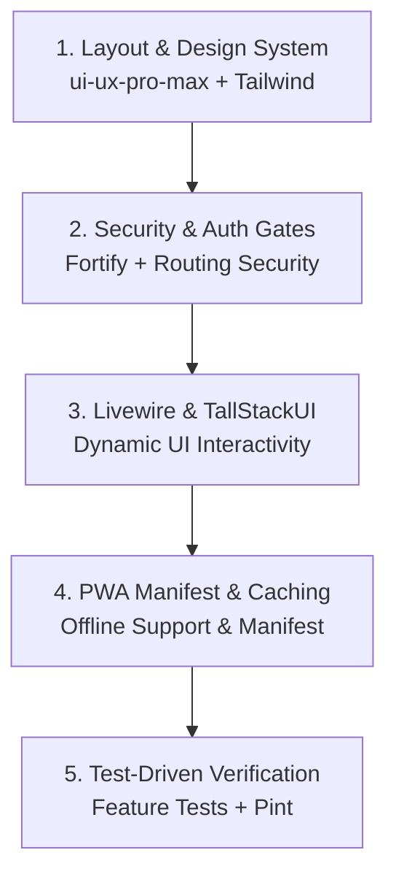

# T.A.L.A. System - Technical Specification

**Total Academic Lifecycle Automation System**

**Servitech Institute Asia (SIA)**

---

## Document Control

| Version | Date | Description |
| --- | --- | --- |
| 1.0 | 2026-04-02 | Consolidated Technical Specification |
| 1.1 | 2026-04-30 | Added hybrid document ingestion, private file storage, OCR metadata, and staff verification strategy |
| 1.2 | 2026-05-01 | Clarified local and production background job strategy, including Laravel Queue, Scheduler, Redis, Supervisor, and optional Horizon usage |
| 1.3-1.4 | 2026-05-02 | Set Student Hub SPA/PWA architecture; added database tables (programs, transactions, grade corrections, etc.); period-based grading model (Option A); updated grading service pseudocode. |
| 1.5-1.7 | 2026-05-03 | Implemented PrerequisiteValidator (INC blocking); modified sections schema for 3-modality enum; replaced CollegeGradingService with PUP transmutation; integrated PayMongo checkout webhooks; Google Cloud Vision OCR. |
| 1.8-2.1 | 2026-05-04 | Aligned testing to PHPUnit; added Term Close Job; removed classroom fields from schema; returnee status enum; student ID pessimistic locking; corrected widget records usage; updated Document Request state transitions. |
| 2.2-2.6 | 2026-05-05 | Added AcademicAdvisingStatus enum/service; LIS fields in enrollments; migrated Student Hub to TallStackUI; enforced system-super-admin vs academic-head middleware; resolved TermScope N+1. |
| 2.7-2.13 | 2026-05-12 | Curriculum Intake Excel template workflow; faculty self-service pre-scheduling and Registrar gates; standardized segregated role permissions (System Super Admin vs. Academic Head); replaced embedded schemas with migration log references. |
| 3.0 | 2026-05-13 | Refined Applicant database fields; hardened OCR confirmation pipeline; decoupled payment endpoints; formalized independent SHS/College calendar gates in terms table. |
| 3.1 | 2026-05-14 | Added System Maintenance service and middleware; expanded toast notification templates; added Laravel Excel import batches framework (Upload -> Preview -> Commit). |
| 3.2-3.5 | 2026-05-18 | Refined Student Records table queries; verified activity logs; added settings keys; structured profile generation; locked OCR thresholds and scheduled job limits; signed-token COR QR verification; 4-state grade correction. |
| 3.6-3.8 | 2026-05-20 | Added digital upload configurations/metadata tagging to Registrar Walk-In APIs; defined database contracts for installment milestones, 30-unit limits, and summer scheduling; applied Pre-Enrolled trigger, no-refund validation, promissory restrictions, pricing rules, and import role restrictions. |
| 4.0 | 2026-05-21 | Complexity Audit: Streamlined document payment flow, switched to Google Cloud Vision OCR, restructured calendar (7 gates), automated fee database logic, negative ledger, RateLimiter. |
| 4.1-4.2 | 2026-05-22 | Consolidated remaining findings (standardized Laravel Excel imports, pre-payment delivery, and GeneralSystemNotification class architecture) and appended Factual Alignment Addendum to standardize dual-track curriculum, grading engines, and fee terminologies. |
| 4.3 | 2026-05-22 | Implementation Readiness Audit: Added cost projection addendum (GCV and S3 budgets); added Laravel Fortify as Student Hub auth backend; resolved transmutation table conflict (SIA scale is ground truth). |
| 4.4 | 2026-05-22 | Expanded §3.17.1 curriculum template with SHS dual-track headers and conditional validation; added §3.21 DashboardMetricsService contract (Enrollment, Financial, Academic widgets). |
| 4.5 | 2026-05-23 | Deprecated the manual subsidized workflow in favor of Automated Freshmen Discounts (50% Tuition Fee for Grade 11/1st Year). Cleaned up obsolete OCR-based subsidy references. |
| 4.6 | 2026-05-24 | Locked per-level calendar cutover activation (SHS quarter boundary; College semester boundary), enforced no late enrollment edits after window close, and recorded approved F10 target policy (configurable installments up to 10 months, EOM due, 3-day grace, 5% penalty). |
| 4.7 | 2026-05-24 | Cross-document alignment audit pass: synchronized migration-readiness status with Foundation Migration Control Log, verified deferred/on-process table claims against Boost schema + migration inventory, and normalized implementation-basis wording. |
| 4.8 | 2026-05-24 | Clarified FAQ governance flow and permission boundary, recorded factual migration inventory counts, and explicitly documented that Fortify 2FA/passkeys are disabled in current configuration. |
| 4.9 | 2026-05-24 | Completed pending migration-file coverage for deferred schema domains, aligned F1 calendar migration to canonical field contract, and synchronized migration status language with the Foundation Migration Control Log. |
| 5.0 | 2026-05-24 | Document-control sync for DB-first execution wave: reflected migration-contract refinements for seeded cutover/runtime settings and F10 installment policy precision fields used by the next implementation layer. |
| 5.1 | 2026-05-24 | Resolved Iteration-1 gap-audit documentation drifts: updated migration-readiness wording in §1.2.0 and expanded §3.19.1 seeded-key contract to include SHS/College cutover runtime keys. |
| 5.2 | 2026-06-02 | Clarified admin-side Filament role contracts: fixed FAQ categories, fixed document request type options, and narrowed Academic Head finance visibility to read-only status/summary surfaces. |
| 5.3 | 2026-06-02 | Added canonical account-name contract: `users` stores split name parts and keeps `name` as composed display/search text for staff and student/account intake. |
| 5.4 | 2026-06-03 | Debloated TAL-12 settings scope: `system_settings` remains an internal runtime registry, generic Filament settings navigation/direct access is blocked, and typed Admission Requirements management is deferred until public/student admission workflow implementation. |
| 5.5 | 2026-06-03 | Added §5.11 Student Portal Development Workflow to guide AI/developers on implementation steps. |
| 5.6 | 2026-06-03 | Reconciled TAL-12 admin audit findings: explicitly registered vendor-backed Role/Activity policies, scoped ImportBatchResource as audit-only until dedicated import pages exist, clarified offline Academic Head approval recording for grade corrections, and documented larger Pre-UAT exclusions. |
| 5.7 | 2026-06-03 | Refined TAL-12 Filament surface contracts: schedule-change JSON is internal snapshot storage behind typed fields, document upload review has no generic create/edit form, and payment/payment-attempt resources are list/view service-owned surfaces only. |
| 5.8 | 2026-06-03 | Extended service-owned/list-view Filament contracts to COR verification tokens, schedule generation runs, and service requests; raw generated forms and direct create/edit routes are not TAL-12 admin workflows. |
| 5.9 | 2026-06-03 | Refined Accounting ledger-entry Filament contract: `LedgerEntryResource` is list/view immutable evidence only; raw ledger create/edit forms are removed and one-off adjustments require a typed service/action contract. |
| 5.10 | 2026-06-03 | Refined Grade Oversight Filament contract: `GradeResource` is list/view oversight plus typed Academic Head force-finalize/reopen actions; raw grade create/edit forms are removed. |
| 5.11 | 2026-06-03 | Refined Grade Correction Filament contract: `GradeCorrectionResource` is list/view lifecycle-action only; raw correction create/edit forms and server-derived field inputs are removed. |
| 5.12 | 2026-06-03 | Refined Official Schedule Filament contract: `SectionMeetingResource` supports typed Registrar manual assignment only, blocks direct edit/delete of committed rows, and routes conflict checks through `SectionMeetingAssignmentService`. |
| 5.13 | 2026-06-04 | Refined Faculty Class List / EnrollmentSubject Filament contract: `EnrollmentSubjectResource` is list/view plus typed grade actions only; raw enrollment-subject create/edit forms are removed and grade-entry modals are program-specific. |
| 5.14 | 2026-06-05 | Refined Document Request Filament contract: `DocumentRequestResource` is list/view plus role-scoped lifecycle actions only; raw create/edit request forms are removed while the fixed catalog remains enforced by the model/service contract. |
| 5.15 | 2026-06-05 | Refined Promissory Note Filament contract: `PromissoryNoteResource` records approved promise cases through typed create fields, removes generic edit/status mutation. |
| 5.16 | 2026-06-05 | Refined Enrollment Filament contract: `EnrollmentResource` is list/view plus typed Registrar/Accounting actions only; raw create/edit status, LIS, section, and timestamp mutation is removed. |
| 5.48 | 2026-06-09 | Clarified student-facing promissory note workflow as a digital form (no upload), confirmed GCP OR-Tools solver deployment, and locked Returnee Detection to a strict manual Registrar search (deferred self-service). |
| 5.49 | 2026-06-10 | Removed `yacoubalhaidari/filament-tour` and the Admin Nexus guided-tour plugin; staff onboarding is documentation/checklist-driven unless a future approved implementation reintroduces a tested tour surface. |
| 5.17 | 2026-06-05 | Refined Installment Policy Filament contract: milestone schedule rows are maintained as typed child rows inside `InstallmentPolicyResource`; `InstallmentPolicyMilestoneResource` is list/view only and exposes no standalone generic create/edit/status form. |
| 5.18 | 2026-06-05 | Refined System Settings Filament contract: `system_settings` remains an internal runtime registry with no generic edit route, edit action, or raw key/value/JSON form during TAL-12. |
| 5.19 | 2026-06-05 | Refined Schedule Change Filament contract: direct edit access is status-bounded to proposed typed requests; approved/applied/rejected changes remain lifecycle evidence. |
| 5.20 | 2026-06-05 | Refined System Super Admin RBAC/User Filament contract: `RoleResource` is list-only seeded permission matrix; `UserPolicy` blocks self/archived direct edits so archive/restore remains the lifecycle path. |
| 5.21 | 2026-06-05 | Refined Accounting configuration scope contract: `FeeTemplate` and `InstallmentPolicy` normalize education/program/year scope fields and reject duplicate active configs for the same scope. |
| 5.22 | 2026-06-05 | Refined Service Request lifecycle action contract: Resolve/Reject/Cancel use typed modal note/reason fields and store them as lifecycle activity/notification context without raw status forms. |
| 5.23 | 2026-06-05 | Refined RBAC matrix route contract: `RoleResource` explicitly blocks create and has no stale create page/action/route or permission editor. |
| 5.24 | 2026-06-05 | Refined Grade Correction official-change contract: `GradeCorrectionService` derives College/SHS official correction values from scheme-specific period inputs and rejects direct final-grade override payloads. |
| 5.25 | 2026-06-05 | Refined Document Request shipment evidence contract: Registrar shipment recording uses private `FileUpload` receipt evidence and `DocumentRequestLifecycleService` rejects arbitrary receipt paths outside the approved private directory. |
| 5.26 | 2026-06-05 | Refined Promissory Note Accounting form contract: dependent enrollment and ledger selects are scoped to the selected student/term and `PromissoryNote` rejects mismatched submitted IDs. |
| 5.27 | 2026-06-05 | Refined Staff User Management status/role contract: staff direct create/edit uses model-owned active/inactive status options with form validation, and archive/restore reuse the model-owned approved staff-role list instead of duplicated literals. |
| 5.28 | 2026-06-05 | Refined Import Batch lifecycle contract: `ImportBatchResource` remains audit-only, while commit/cancel transitions are delegated to `ImportBatchLifecycleService` and model-owned enum option helpers. |
| 5.29 | 2026-06-05 | Refined Schedule Draft commit contract: `ScheduleGenerationRunResource` delegates commit to `ScheduleCommitService`, which creates official meetings, synchronizes `section_teacher`, and rejects conflicted/non-eligible runs. |
| 5.30 | 2026-06-05 | Refined COR verification lifecycle contract: `CorVerificationResource` delegates supersede/revoke transitions to `CorVerificationLifecycleService` with model-owned status options and required revoke reasons. |
| 5.31 | 2026-06-05 | Reconciled FAQ implementation status: `FaqEntryResource` admin authoring is implemented with typed categories/publish toggle, while public `/faq` and Student Hub FAQ consumption remain separate unimplemented surfaces. |
| 5.32 | 2026-06-05 | Refined Schedule Change lifecycle contract: `ScheduleChangesTable` delegates approve/apply transitions to `ScheduleChangeLifecycleService`; status options/colors are model-owned and official meeting mutation remains behind assignment-service conflict validation. |
| 5.33 | 2026-06-06 | Refined Document Upload review lifecycle contract: `DocumentUploadsTable` delegates approve/needs-correction/reject transitions to `DocumentUploadReviewService`; review status options/colors are model-owned and terminal review states are service-guarded. |
| 5.34 | 2026-06-06 | Refined Enrollment hard-copy receipt lifecycle contract: `EnrollmentsTable` delegates hard-copy receipt confirmation to `EnrollmentHardCopyReceiptService`, which locks records, enforces policy authorization, prevents duplicate confirmation, and records lifecycle activity. |
| 5.35 | 2026-06-06 | Refined Staff User archive/restore lifecycle contract: `UsersTable` delegates archive/restore transitions to `UserAccountLifecycleService`; `UserPolicy` owns custom archive/restore abilities and the service validates reason/role/state before syncing roles and recording lifecycle activity. |
| 5.36 | 2026-06-06 | Refined Student Hub access/FAQ contract: `/student/*` routes use `auth` plus `student.active` middleware, the middleware persists across Livewire requests, and `pages::student-hub.help` reads published FAQ entries. |
| 5.37 | 2026-06-06 | Refined public FAQ contract: `/faq` is implemented as a guest-accessible Livewire page that renders only published FAQ entries grouped by model-owned category labels. |
| 5.38 | 2026-06-06 | Refined Document Request shipment receipt upload contract: the private Filament `FileUpload` prevents file-path tampering before `DocumentRequestLifecycleService` applies approved-directory validation. |
| 5.39 | 2026-06-06 | Refined Document Request receipt evidence display contract: `DocumentRequestInfolist` presents uploaded/not-uploaded proof status instead of raw private storage paths. |
| 5.40 | 2026-06-06 | Refined Promissory Note display contract: Accounting table/detail views reuse descriptive relationship labels and no longer show raw student, term, enrollment, ledger, or approver IDs. |
| 5.41 | 2026-06-06 | Refined Audit Log detail display contract: `ActivityInfolist` formats activity properties into labeled read-only evidence lines instead of exposing raw key-value/JSON payload UI. |
| 5.42 | 2026-06-06 | Refined COR verification detail display contract: `CorVerificationInfolist` uses relationship-backed student, term, and enrollment labels instead of raw internal foreign-key IDs. |
| 5.43 | 2026-06-06 | Refined Document Upload detail display contract: `DocumentUploadInfolist` groups relationship-backed student/uploader/term/reviewer context, source-file evidence, and status badges without exposing raw internal foreign-key IDs or private `file_path`. |
| 5.44 | 2026-06-06 | Closed the role-by-role raw-input audit as a technical planning deliverable: implemented hardening remains TAL-12A evidence, while remaining code work is split into prioritized follow-up contracts instead of continuing as unbounded audit refactoring. |
| 5.45 | 2026-06-07 | Approved Pre-TAL-12 rescue architecture: automatic scheduling uses GCP-hosted OR-Tools CP-SAT, not Vertex AI; added minimal `faculty_subject_eligibilities` contract; set >98% feasible-input auto-assignment coverage and 100% hard-constraint validity. |
| 5.46 | 2026-06-08 | Clarified scheduling constraints: every modality requires a faculty teacher/adviser assignment for committable rows; `sections.max_seats` remains editable but is bounded to a hard maximum of 30 heads and cannot be reduced below `enrolled_count`. |
| 5.47 | 2026-06-09 | Clarified automatic scheduling pipeline: term-scoped section/year-level planning and curriculum demand readiness are required before OR-Tools solves faculty, room, day, and time assignments. |

---

**Local Iteration Checklist:** See [TALA-Local-Iteration-Checklist.md](TALA-Local-Iteration-Checklist.md) for the DB-first execution checklist aligned with this specification.

## Table of Contents

1.  [Technical Architecture](#1-technical-architecture)
2.  [Database Implementation References](#2-database-implementation-references)
3.  [Module Implementation Details](#3-module-implementation-details)
4.  [Security Implementation](#4-security-implementation)
5.  [Frontend Implementation](#5-frontend-implementation)
6.  [Third-Party Integrations](#6-third-party-integrations)
7.  [Development Roadmap](#7-development-roadmap)
8.  [Deployment & Operations](#8-deployment--operations)

---

## 1. Technical Architecture

### 1.1 Architecture Philosophy

**“Dev-Quick” Hybrid Architecture** designed for Speed, Familiarity, and Unified Data.

### 1.2 Technology Stack

| Layer | Technology | Package | Version | Role in System |
| --- | --- | --- | --- | --- |
| **Backend Core** | **Laravel 12 (PHP)** | `laravel/framework` | 12.58.0 | **The Brain.** Monolithic backend handling Business Logic for **Enrollment, Grading, and Financial Record Keeping**. It serves as the single source of truth for all modules. |
| **Staff Operations UI** | **FilamentPHP v5** | `filament/filament` | 5.6.2 | **The Command Center.** Powering the **Registrar, Accounting/Cashier, Faculty, Academic Head, and System Super Admin** dashboards. It leverages “TALL Stack” (Tailwind, Alpine, Livewire, Laravel) to auto-generate 80% of the UI (Tables, Forms, Notifications, Modals), drastically reducing development time. |
| **Student Hub UI** | **Laravel + Livewire + TallStackUI + Tailwind CSS + Alpine.js** | `livewire/livewire`, `tallstackui/tallstackui`, `tailwindcss`, `alpinejs` | 4.3.0, 3.0.0, 4.1.18, 3.15.10 | **The Public Face.** Uses **Server-Side Rendering (Blade)** with **TallStackUI Components** for premium aesthetics and **Alpine.js** for client-side interactivity. It leverages **Multi-Route SPA routing with wire:navigate** for instantaneous transitions, PWA offline caching, and SEO. Includes **PWA Service Workers**. |
| **Database** | **MySQL** | \- | 8.0+ | **The Memory.** Relational source of truth for academic, financial, audit, document metadata, OCR text, and staff-verified extracted fields. Raw uploaded files are not stored as database BLOBs. |
| **File/Object Storage** | **Laravel Filesystem (Private Local/S3-Compatible Disk)** | Built-in / Flysystem | \- | **The Evidence Vault.** Stores original uploaded documents, payment proofs, certificates, receipts, and generated previews outside the database with private visibility and temporary signed access. |
| **Infrastructure** | **Cloud VPS (DigitalOcean/AWS)** | \- | \- | **The Environment.** Scalable cloud hosting to ensure 24/7 availability, queue worker support, and security (vs. local servers). |

---

**Panel Terminology Boundary**: "Admin Nexus," "Admin Panel," "Filament admin panel," and similar labels refer only to the shared staff operations UI. They do not define a generic `admin` role. Implementation must use the approved roles and permission slugs: `registrar`, `accounting`, `faculty`, `academic-head`, and `system-super-admin`.

### 1.2.0 Implementation Readiness Snapshot

The live project state verified through Laravel Boost on 2026-05-18 is authoritative for implementation planning. The active runtime is PHP 8.2, Laravel 12.58.0, MySQL, Filament 5.6.2, Livewire 4.3.0, Laravel Boost 2.4.6, Laravel Horizon 5.46.0, TailwindCSS 4.1.18, AlpineJS 3.15.10, and PHPUnit 11.5.55.

The package set already includes the intended core implementation tools: `spatie/laravel-permission`, `spatie/laravel-model-states`, `spatie/laravel-activitylog`, `spatie/laravel-webhook-client`, `google/cloud-vision`, `luigel/laravel-paymongo`, `tallstackui/tallstackui`, `erag/laravel-pwa`, `maatwebsite/excel`, `barryvdh/laravel-dompdf`, and `chillerlan/php-qrcode`.

The database now contains the baseline Laravel tables plus the stable account metadata, academic foundation, scheduling foundation, Spatie permission, and Spatie activity log tables. The next spec-ready, low-policy support-table migration group is `system_settings`, Laravel `notifications`, `import_batches`, and Spatie `webhook_calls` if the webhook package migration has not yet been published. Migration files for enrollment, ledger/payment, installment policy, shifting, summer scheduling, document/OCR/request, grade/correction, discount-policy automation, and service-request domains are now created in the repository as pending; their execution remains controlled by service-logic and acceptance-test gates.

The following runtime gaps must be resolved during implementation, not by this documentation cleanup:

| Runtime Area | Current State | Implementation Impact |
|--------------|---------------|-----------------------|
| Horizon | `laravel/horizon` is installed, but `config/horizon.php` is absent. | Local development must use the database queue. Production may use Redis + Horizon only after Horizon config is installed and queue workers are configured. |
| API Routes | `routes/api.php` is absent. | PayMongo and webhook endpoints must be registered deliberately before gateway integration work. |
| Webhook Client | `spatie/laravel-webhook-client` is installed, but `config/webhook-client.php` is absent. | Webhook signature validation, profiles, and model storage must be configured before accepting PayMongo webhooks. |
| File Storage | The `local` disk already roots to `storage/app/private`. | Uploaded student documents, receipts, and OCR source files must remain private by default. Public disks are only for intentionally public assets. |
| Domain Schema | Stable foundation migrations are implemented; business-policy-heavy domains remain deferred. | Use the migration files and `TALA-Foundation-Migration-Control-Log.md` as implementation references. Add future domain schema through new migrations paired with services and tests. |

### 1.2.1 Frontend Stack Details (TALL Stack + TallStackUI)

The Student Hub UI uses an enhanced **TALL Stack** with the following components:

| **Component** | **Technology** | **Purpose** |
| --- | --- | --- |
| **Tailwind CSS** | v4.0+ | Utility-first CSS framework for rapid UI development, configured to support TallStackUI components |
| **Alpine.js** | v3.x | Lightweight JavaScript framework for client-side interactivity (dropdowns, modals, toggles) without the complexity of larger frameworks |
| **Livewire** | v4.x | Full-stack framework for dynamic Laravel applications using server-side rendering |
| **TallStackUI** | v3.0 | Free, open-source Livewire component library for polished, production-ready UI elements (modals, badges, buttons, dropdowns, layouts, sidebars, tables, date pickers, and 50+ components) |
| **Heroicons** | v2.x | Hand-crafted SVG icons integrated via Blade components |

**Why Alpine.js?**  
Alpine.js provides lightweight JavaScript reactivity for UI patterns that don’t require Livewire’s server round-trip:

-   Dropdown menus and popovers
-   Modal open/close animations
-   Tab switching
-   Form validation feedback
-   Toggle switches and checkboxes
-   Client-side state management for instant UI updates

Example usage in Blade templates:


```blade
<!-- Dropdown with Alpine.js --><div x-data="{ open: false }" class="relative">    <button @click="open = !open" class="flex items-center gap-2">        Menu <span x-text="open ? '▲' : '▼'"></span>    </button>    <div x-show="open"          @click.outside="open = false"         x-transition         class="absolute right-0 mt-2 w-48 bg-white rounded-md shadow-lg">        <!-- Menu items -->    </div></div>
```

---

### 1.3 Additional Technical Components

| Component | Technology / Approach | Package | Purpose |
| --- | --- | --- | --- |
| **OCR Engine** | Google Cloud Vision API | `google/cloud-vision` ^2.1 | **Text extraction only** from uploaded documents across the academic lifecycle (Admissions, Credit Evaluation, Payment Proofs). Manual review by staff. |
| **Document Storage** | Hybrid file + relational metadata model | Laravel Filesystem + MySQL | Original files remain in private storage; OCR text, confidence scores, parsed payloads, and reviewed extracted fields are stored in MySQL. |
| **Document Fulfillment** | Manual courier workflow | Laravel + Filament | Supports two-phase document request payment without a paid logistics API. Registrar records courier details and actual shipping fees after shipment. |
| **Background Jobs** | Laravel Queue + Laravel Scheduler | Built-in; `laravel/horizon` installed but requires Redis queue configuration and `config/horizon.php` before use | Runs asynchronous OCR, notifications, webhook processing, and scheduled maintenance. Local development uses database queues; production may use Redis queues with Supervisor-managed workers and Horizon only after Horizon is installed/configured for the environment. |
| **Webhooks** | Spatie Webhook Client | `spatie/laravel-webhook-client` | Safely receives, verifies signatures, and prevents double processing (idempotency) of GCash webhooks. |
| **Audit Trails** | Spatie Activity Log | `spatie/laravel-activitylog` | Tracks all model changes and user actions for strict accountability on financial and grading overrides. |
| **Audit UI** | Filament Activity Log | `pxlrbt/filament-activity-log` | Provides a Filament staff-panel GUI to view the `spatie/laravel-activitylog` records. |
| **State Machine** | Spatie Model States | `spatie/laravel-model-states` | Enforces rigid transition rules for Enrollment and Document Request lifecycles (e.g., Pending -> Processing -> Shipped). |
| **Email** | Laravel Mail (SMTP) | Built-in | Account-related notifications |
| **Excel I/O** | Laravel Excel / PhpSpreadsheet | `maatwebsite/excel` ^3.1 | Final schedule exports, curriculum template import/export, report exports, and optional strict staff fallback imports. Faculty availability is collected in-app, not primarily by Excel. |
| **PDF Gen** | DomPDF | `barryvdh/laravel-dompdf` ^3.1 | COR and Report Card generation (Module 2) |
| **QR Code Gen** | chillerlan/php-qrcode | `chillerlan/php-qrcode` ^5.0 | COR QR image generation for an online verification URL. The payload is a signed/opaque-token route, not raw student/term/hash data. |
| **RBAC** | Spatie Laravel Permission | `spatie/laravel-permission` ^6.24 | Role-based access control for all user types (applicant, student, registrar, accounting, faculty, academic-head, system-super-admin) |
| **PWA** | Laravel PWA | `erag/laravel-pwa` ^2.1 | Progressive Web App support for offline COR access and mobile installation. Provides `@PwaHead` and `@RegisterServiceWorkerScript` Blade directives, Livewire-compatible, supports Laravel 8–13. |
| **Icons** | Blade Heroicons | Built-in (via `filament/filament`) | Filament v5 bundles `blade-ui-kit/blade-heroicons` as a transitive dependency. No separate install needed. |
| **Staff Onboarding** | External operations docs/checklists | No runtime package | The Admin Nexus does not load a guided-tour plugin. Staff onboarding is handled through maintained documentation, UAT scripts, and role checklists unless a future approved item reintroduces a tested tour surface. |
| **Student Onboarding** | Driver.js | `driver.js` (NPM) | Provides interactive guided tours for the Livewire/TallStackUI Student PWA. |

---

### 1.3.1 Document Ingestion & Storage Strategy

**Architecture Decision**: T.A.L.A. uses a **hybrid document storage model**.

Raw uploaded documents are preserved as the canonical evidence, while OCR output and reviewed fields are stored in structured database records. OCR is never treated as the official student record until a Registrar, Accounting user, or authorized Admin verifies the extracted values.

| Storage Layer | Stores | Purpose |
| --- | --- | --- |
| **Private File/Object Storage** | Original images/PDFs, payment screenshots, courier receipts, generated previews | Canonical evidence for review, audit, reprocessing, and dispute handling |
| **MySQL Metadata Tables** | Owner, document type, storage disk/path, MIME type, checksum, file size, upload status, review status | Fast workflow queries, RBAC filtering, audit joins, and lifecycle tracking |
| **MySQL OCR Tables** | Raw OCR text, confidence score, OCR engine, parser version, processing errors, parsed JSON payload | Search, registrar side-by-side review, retry/reprocess support, and confidence-based queues |
| **Domain Tables** | Verified profile fields, credited subjects, discount entries, payment references | Operational source of truth after staff verification |

**Processing Flow**:

1.  Validate the file type and size before accepting the upload.
2.  Store the original file on a private Laravel filesystem disk.
3.  Create a `document_uploads` row with file metadata, checksum, owner, selected document type, and initial status.
4.  Dispatch OCR/parsing to Laravel queue workers after the upload transaction commits. Local development uses the database queue; production may use Redis-backed workers, with Laravel Horizon enabled only after Redis queue configuration and `config/horizon.php` exist.
5.  Store OCR output in `document_ocr_results`; store candidate fields in `document_extracted_fields`.
6.  Show the original file, extracted text, candidate fields, confidence, and user-entered profile data side-by-side in Filament.
7.  Promote only staff-approved values into operational domain tables.

**Implementation Rules**:

-   Do not store full document binaries in MySQL.
-   Do not expose document files through public URLs.
-   Use private visibility and temporary signed URLs for previews/downloads.
-   OCR failures must not block manual review; they should create a `needs_manual_review` state.
-   Reprocessing must be possible without replacing the original upload.
-   Critical academic, financial, and identity fields require human verification before they affect enrollment, billing, grades, or credentials.

**Cost and Complexity Trade-Offs**:

-   **Storage Cost**: Higher than text-only storage because original files are retained, but object storage is cheaper and easier to scale than database BLOB storage.
-   **Compute Cost**: OCR API calls and fallback processing add cost; queue OCR asynchronously and reprocess only when the file checksum, OCR engine, or parser version changes.
-   **Maintenance Complexity**: The system must keep database rows and file storage synchronized. Add orphan-file reports and checksum checks instead of blind deletion.
-   **Retrieval Latency**: Raw files may load slower than DB rows. Keep workflow screens fast by querying metadata first and loading file previews through temporary URLs only when needed.

---

### 1.4 Architecture Rationale

#### 1.4.1 Unified Data (Monolith Strength)

By using a Monolithic Laravel core, the **Registrar** and **Accounting** modules share the *exact same* Database Models (`Student`, `Enrollment`, `Payment`). This makes the **“Unified Pipeline”** possible without complex API syncing.

#### 1.4.2 Decoupled Logic (EDA Strength)

“Internal Events” allow us to build an **Event-Driven System** without the complexity of external message brokers (Kafka/RabbitMQ). This satisfies the “Technical Complexity” constraint while keeping the code clean and scalable.

#### 1.4.3 Role-Based Views

`FilamentPHP` allows us to create one shared staff panel while strictly controlling visibility. A `Cashier` user simply sees a restricted menu compared to a `Registrar`, but they are in the same system.

---

### 1.5 Module-to-Tech Mapping

| Module | Primary Tech | Key Libraries | Key Features |
| --- | --- | --- | --- |
| Module 1 (Student) | **Laravel Livewire + TallStackUI + Tailwind + Alpine.js** | `tallstackui/tallstackui`, `alpinejs`, `erag/laravel-pwa` | PWA, Multi-Step Wizard, 3-Mode Section-Level Modality Selection (SHS: Modular/Online, College: On-Site/Online), LIS-Aligned Data Collection, and automated freshmen discount eligibility capture. **(Custom)** |
| Module 2 (Registrar) | FilamentPHP (Admin) | `filament/filament`, `google/cloud-vision` | Student Record Management (Filament Data Table), Scheduling (Curriculum Import, Modality-Aware Conflict Detection), Manual Credit Evaluation, Account Archiver, OCR Document Review, LIS Encoding View |
| Module 3 (Accounting) | FilamentPHP + Excel Export | `filament/filament`, `maatwebsite/excel`, `chillerlan/php-qrcode` | Payment Queues (E-Wallets, OTC, Screenshots), Promissory Notes, COR with QR Code, Export Reports |
| Module 4 (Faculty) | FilamentPHP | `filament/filament`, `maatwebsite/excel` | Grading Ecosystem, Manual INC Management, Grade Export, Modality-Aware Class Lists |
| Module 5 (Administration & Integration) | FilamentPHP + Laravel Mail + Audit Logs | `filament/filament`, `spatie/laravel-permission` | RBAC, User Mgmt, Dashboard, Email, Audit Trail, FAQ/Inquiry Management |

---

## 2\. Database Implementation References

### 2.1 Data Modeling Philosophy

**“Lean Relational” approach**. Use foreign keys for integrity, but keep high-traffic tables such as enrollments and transactions flat enough for speed.

The specifications remain the source of truth for business rules, role ownership, deadlines, locks, approvals, official-record behavior, and workflow boundaries. Migration files are the implementation source for table names, columns, indexes, foreign keys, and rollback behavior. Future schema changes must be added through new migrations and summarized in the implementation control log instead of duplicating table-by-table schema contracts here.

---

### 2.2 Implemented Foundation Schema References

| Area | Implementation File |
| --- | --- |
| Account metadata | `database/migrations/2026_05_12_055403_add_tala_account_fields_to_users_table.php` |
| Academic foundation | `database/migrations/2026_05_12_055403_create_academic_foundation_tables.php` |
| Faculty availability and assisted scheduling foundation | `database/migrations/2026_05_12_055403_create_scheduling_foundation_tables.php` |
| Activity log base table | `database/migrations/2026_05_12_055413_create_activity_log_table.php` |
| Activity log event column | `database/migrations/2026_05_12_055414_add_event_column_to_activity_log_table.php` |
| Activity log batch UUID column | `database/migrations/2026_05_12_055415_add_batch_uuid_column_to_activity_log_table.php` |
| Spatie permission package tables | `database/migrations/2026_01_27_015712_create_permission_tables.php` |
| Role and permission seed mapping | `database/seeders/DatabaseSeeder.php` |
| Migration decision and deferred scope | `00_Project_Documents/TALA-Foundation-Migration-Control-Log.md` |

Laravel baseline authentication, cache, session, queue, and job batch tables remain in the default `0001_01_01_*` migrations.

---

### 2.3 Migration Execution Gates

The following low-policy support tables now have migration files and are executable in the next migration wave:

- `system_settings` for maintenance mode and future runtime settings.
- Laravel `notifications` using Laravel's standard database notifications table.
- `import_batches` for legacy import preview/commit auditability.
- `webhook_calls` for PayMongo webhook payload/header storage.

The following domains already have migration files created, but their execution remains gated by service/policy/test completion:

- Enrollment/profile flow (`student_profiles`, `enrollments`, `enrollment_subjects`)
- Financial flow (`fee_templates`, `ledger_entries`, `payment_attempts`, `payments`, `promissory_notes`, installment tables)
- Document/OCR/request flow (`document_uploads`, `document_ocr_results`, `document_extracted_fields`, `document_requests`)
- Grade/correction flow (`grades`, `grade_corrections`)
- Service/shift/COR flow (`service_requests`, `shifting_requests`, `shifting_fee_assessments`, `cor_verifications`, `faq_entries`)

**v4.9 Factual Migration Status Snapshot**:
- Verification source: Laravel Boost `database_schema`, Boost query on `migrations` table, and repository migration inventory.
- Repository migration inventory currently has **38 migration files total**.
- Applied foundation migrations currently cover baseline Laravel tables, account metadata, academic foundation, scheduling foundation, Spatie permission tables, and Spatie activity log tables.
- Pending migrations in this checkout are currently **29 files** (10 applied / 39 total), including F1/F2/F10 and the newly-created deferred-domain migration set.
- `2026_05_21_104003_restructure_academic_calendar_tables.php` exists, is aligned to canonical fields, and is still not applied; live `terms` remains on legacy `start_date`, `end_date`, and `scheduling_starts_at`.
- Fortify migrations `2026_05_21_222158_add_two_factor_columns_to_users_table.php` and `2026_05_21_222159_create_passkeys_table.php` exist but are not applied.
- Current `config/fortify.php` does not enable `Features::twoFactorAuthentication(...)` or `Features::passkeys(...)`; therefore 2FA/passkey flows are **not active** in runtime behavior today.
- Low-policy support tables (`system_settings`, `notifications`, `import_batches`, `webhook_calls`) now have migration files and are pending execution.

---

### 2.4 Schema Boundary Rules

- Do not add table-by-table schema summaries back into this technical specification.
- Do not treat migration paths as business approval by themselves; business behavior remains governed by the Functional Specification and workflow sections of this Technical Specification.
- Use `decimal(12,2)` for money in future ledger/storage migrations and minor-unit integers only at payment gateway boundaries.
- Do not store online meeting URLs in scheduling tables unless the client later approves link tracking.
- `users.status` is account lifecycle/auth state only. Future student lifecycle state belongs on `student_profiles.operational_status`; `student_profiles.status_reason` is required only when `operational_status = 'Inactive'`.
- Use new migrations for future schema changes unless the project is intentionally reset locally before production.
- `users.first_name`, `users.middle_name`, `users.last_name`, and `users.suffix` are canonical person-name fields for staff, applicant, and student accounts. `users.name` remains a generated/composed display and search value for Filament tables, audit labels, exports, and legacy auth compatibility.

---

### 2.5 Detailed Business Data Dictionary

#### 2.5.1 Applicant Data Fields (LIS-Aligned)

| Field Group | Data Point | Type | Purpose / Validation |
| --- | --- | --- | --- |
| **Identity** | **LRN** | `string(12)` | **Primary Key** for LIS. Exactly 12 digits, unique check |
|  | **Last Name** | `string(50)` | Alphabetic + hyphen + apostrophe only |
|  | **First Name** | `string(50)` | Alphabetic + hyphen + apostrophe only |
|  | **Middle Name** | `string(50)` | Alphabetic + hyphen + apostrophe only |
|  | **Extended Name** | `string(10)` | Suffixes (Jr., Sr., II, III, IV) — optional |
|  | **Birthdate** | `date` | Valid past date, age >= 10 for Grade 11 |
|  | **Place of Birth** | `string(100)` | City/Municipality, Province — LIS requirement |
|  | **Gender** | `enum` | Male / Female — LIS profiling |
|  | **Civil Status** | `enum` | Single / Married / Widowed / Separated / Annulled — default: Single |
|  | **Mother’s Maiden Name** | `string(100)` | **Critical Security Question** & LIS Requirement |
| **Personal Contact** | **Home Address — Street** | `string(100)` | House/Unit No., Building, Street Name — LIS requirement |
|  | **Home Address — Barangay** | `string(50)` | Barangay name — LIS requirement |
|  | **Home Address — City/Municipality** | `string(50)` | City or Municipality — LIS requirement |
|  | **Home Address — Province** | `string(50)` | Province — LIS requirement |
|  | **Home Address — Region** | `string(50)` | Region (e.g., NCR, Region IV-A) — LIS requirement |
|  | **Home Address — Zip Code** | `string(4)` | 4-digit Philippine zip code |
|  | **Contact Number** | `string(13)` | Philippine mobile format (09XXXXXXXXX). Regex: `/^09\d{9}$/` |
|  | **Father’s Name** | `string(100)` | Full name — LIS requirement |
|  | **Father’s Occupation** | `string(50)` | Optional — LIS profiling |
|  | **Mother’s Occupation** | `string(50)` | Optional — LIS profiling |
|  | **Guardian’s Name** | `string(100)` | Required if applicant is a minor |
|  | **Guardian’s Contact Number** | `string(13)` | Same format as Contact Number |
|  | **Guardian’s Address** | `text` | Can be same as home address (checkbox to copy) |
| **Enrollment Context** | **School Year / Term** | `string` | Derived from system active configuration. Read-only for applicants; editable only by Registrar for backdated applications. |
| **Academic (SHS)** | **Grade Level** | `enum` | Grade 11, Grade 12 |
|  | **Strand** | `string(50)` | STEM, GAS, ICT, HE, ABM, HUMSS. Track is derived from strand. |
|  | **Applicant Type** | `enum` | New / Transferee / Returnee — OCR-assisted recommendation, Registrar confirmation required |
|  | **Assigned Class** | `string(50)` | Generated during queuing (e.g., “Grade 11-A”) |
| **Academic (College)** | **Course / Program** | `string(50)` | IT, BM, THM, etc. |
|  | **Year Level** | `enum` | 1st Year - 4th Year |
|  | **Admission Category** | `enum` | Freshman / Transferee / Returnee / Second Degree |
|  | **Credited Subjects** | `json` | Relevant only for transferees/irregular placement. Populated post-evaluation. |
| **Last School Attended** | **School Name** | `string(150)` | Required for Transferees — basis for F137 request |
|  | **School Address** | `text` | School location — LIS requirement for transferees |
|  | **Year Graduated / Last Year Attended** | `year` | e.g., 2024, 2023 — dropdown or text |
| **Modality** | **Learning Mode** | `enum` | **SHS**: `modular`, `online`. **College**: `on_site`, `online`. Defines the primary method of educational delivery for the student’s term. |
| **Account Name Storage** | **Canonical Name Parts** | `users.first_name`, `users.middle_name`, `users.last_name`, `users.suffix`; composed `users.name` | Intake forms store legal/display name parts separately. The model/service layer composes `users.name` for search/display compatibility. |
| **Discount Eligibility** | **Automated Freshmen Discount Flag** | `boolean` | Derived from intake data and validated by rules (`student_type = New` and year/grade level in scope) to trigger the 50% Tuition Fee discount. |

---

#### 2.5.2 Future `student_profiles` Schema Contract

Future student profile migrations must keep academic and financial context off the `users` table. `student_profiles` owns the student lifecycle and academic identity contract:

**Creation Timing**: A `student_profiles` row is created atomically during the Official Handover transaction (§3.3) when the applicant account transitions to an official student. Applicant data lives in the `users` table and applicant-specific staging columns until handover. The profile is never created for applicants who do not complete enrollment.

| Field Group | Required Contract |
| --- | --- |
| Identity | `user_id`, immutable `student_id`, unique `lrn` when applicable, legal name linkage through `users.first_name`, `users.middle_name`, `users.last_name`, `users.suffix`, and composed `users.name` |
| Academic context | `education_level`, `program_id` or strand/program equivalent, grade/year level, curriculum/version context, current term context when needed |
| Lifecycle status | `operational_status` enum-like string with only `Active`, `Inactive`, `Graduated`, and `Archived` |
| Status reason | `status_reason` nullable except required when `operational_status = 'Inactive'` |
| Financial summary | `current_balance decimal(12,2)` as a denormalized read model fed by ledger services, not by direct UI edits |
| Document flags | Hard-copy receipt flags and OCR review markers needed for grade/COR/request gating |
| Audit timestamps | `created_at`, `updated_at`, plus workflow-specific timestamps such as `graduated_at`, `archived_at`, or `last_status_changed_at` when introduced |

Do not add academic status, balances, hard-copy flags, LRN, student ID, program, strand, year level, or operational lifecycle fields to `users`. That table remains responsible for login identity, credentials, account availability, and authentication lifecycle.

#### 2.5.3 Financial Transaction Types (Enum)

| Type | Description |
| --- | --- |
| `assessment` | Initial Fee/Debit (Tuition, Lab Fees, Miscellaneous) |
| `payment` | OTC Payment, E-wallet (GCash Webhook validation) |
| `promissory_note` | Records Accounting-approved promise/expiry only; does not clear balance, enrollment, COR, class-list, or exam-permit restrictions |
| `discount` | Automated or authorized Discount/Credit ledger entry (including the Freshmen Tuition discount) |
| `shipping_fee` | Deferred post-fulfillment courier charge. Posted as standard debt only if unpaid after 3 calendar days from shipment. |
| `drop_fee` | ₱3,500 assessment triggered when officially withdrawing |
| `adjustment` | Manual Correction |
| `wallet_deposit` | Credit to `wallet_balance` from overpayment |
| `wallet_credit` | Debit from `wallet_balance` applied to fees |
| `legacy_balance_forward` | Initial balance imported from legacy SIA system via the Bulk Data Import Framework (§3.20). Posted during student seed (FS §8.8). |

**Display Logic**: Portal groups transactions by type to show “Tuition vs. Misc vs. Discounts”

**Current TAL-12 Filament Mapping**: `PromissoryNoteResource` is an Accounting promise-tracking surface and approval queue. It registers list/view pages, and a dedicated review action instead of a direct create form. Students submit a digital request via the Student Hub (amount, due date, reason) which creates a `pending` record. `PromissoryNote::validateAccountingScopeData()` is the backend trust boundary when Accounting approves a request: it must reject an enrollment that does not belong to the selected student/term and a ledger entry that does not belong to the selected student, optional term, and optional enrollment. The form must not expose unscoped raw ID relationship selects such as `relationship('enrollment', 'id')` or `relationship('ledgerEntry', 'id')`. List and detail views must show descriptive relationship labels for student, term, enrollment, ledger entry, and approver context instead of raw `student_profile_id`, `term_id`, `enrollment_id`, `ledger_entry_id`, or `approved_by` numeric values. The resource must not register a generic edit page, edit action, or status selector for arbitrary `approved`/`active`/`expired`/`settled`/`rejected` mutation. Update policy remains false until a dedicated lifecycle service/action contract exists.

---

#### 2.5.4 Document Flags

| Flag | Type | Purpose |
| --- | --- | --- |
| `hard_copy_received` | Boolean | If false by deadline → Block Grade View |
| `ocr_confidence` | `decimal(5,2)` nullable (0-100) | Google Vision API confidence score when returned by document OCR; `null` means confidence was unavailable and manual review is required when the document type needs verification |
| `ocr_review_status` | Enum | `uploaded`, `ocr_extracted`, `student_confirmed`, `pending_registrar_review`, `registrar_approved`, `needs_correction`, `rejected`, `needs_manual_review` |
| `document_extracted_fields` | JSON | Future schema requirement: Stores OCR-extracted, student-confirmed, and Registrar-approved values as distinct stages. |
| `student_confirmed_at` | Timestamp | Future schema requirement: When the applicant confirmed the OCR extraction. |
| `student_confirmed_payload` | JSON | Future schema requirement: Snapshot of data at the time of student confirmation. |
| `registrar_reviewed_by` | Foreign Key (Users) | Future schema requirement: The staff member who performed the review. |
| `registrar_reviewed_at` | Timestamp | Future schema requirement: When the staff review occurred. |
| `registrar_approved_payload` | JSON | Future schema requirement: Snapshot of official data promoted to the record. |
| `document_type` | Enum | PSA, Report Card, Diploma, F137, Good Moral, etc. |
| `checksum` | String | Detects duplicate uploads and supports safe OCR reprocessing |

---

### 2.6 Key Computed Logic

#### 2.6.1 Exam Permit Visibility


```php
use App\Models\Term;
use App\Models\User;

function canViewExamPermit(User $student, Term|int $term): bool
{
    $termId = $term instanceof Term ? $term->id : $term;

    $balance = $student->getCurrentBalance($termId) ?? '0.00';
    return DecimalMoney::fromString($balance)->isLessThanOrEqualTo('0.00');
}
```

**Balance Contract**: `getCurrentBalance()` returns a ledger-safe decimal string with exactly two decimal places, never a PHP `float`. If no ledger entries exist for the student and term, the default is `"0.00"`. All comparisons must use a decimal-safe money comparator or money value object; `DecimalMoney` in the pseudocode represents that project-local abstraction, not a required package. Promissory notes must not be included in exam-permit clearance.

#### 2.6.2 COR QR Code Verification Contract

**Official Mode**: Online verification is required for official authenticity checks. Offline/PWA COR copies are read-only convenience copies only; they cannot prove current validity because revocation, replacement, or supersession must be checked against the database.

**QR Payload Format**: The QR code encodes one absolute HTTPS verification URL generated from a named route, e.g. `cor.verify`. The URL contains an opaque random token as a path parameter and may also include Laravel's signed-route query parameters. It must not expose raw `Student_ID`, `Active_Term`, balances, ledger IDs, or a custom concatenated hash payload. There is no custom separator format.

**Route Contract**:

| Item | Contract |
| --- | --- |
| Route | `GET /verify/cor/{token}` |
| Route name | `cor.verify` |
| Auth | Public/guest route; protected by throttling and signed-route validation when a signed URL is used |
| Payload token | Opaque, random, database-backed COR verification token bound to one generated COR/version |
| Signing | Laravel signed URL validation using the application key; do not implement a separate exposed `Student_ID + Term + Hash` signature |
| Invalid signature | HTTP `403` with a user-facing invalid/expired verification page |
| Missing token/document | HTTP `404` with `status = not_found` |
| Valid lookup | HTTP `200` with one of `valid`, `superseded`, or `revoked` |

**Current TAL-12 Filament Mapping**: `CorVerificationResource` is a COR Controls evidence surface. It registers list/view pages only and exposes controlled lifecycle actions for superseding or revoking tokens. It must not register generic create/edit page routes, create/edit header actions, delete actions, or forms for direct `student_profile_id`, `token`, `status`, `issued_at`, `expires_at`, or `revoked_at` editing. COR tokens are generated by COR issuance services. Supersede/revoke transitions are delegated to `CorVerificationLifecycleService`, which validates `manage-lis`, allows only valid lifecycle transitions, requires a typed non-empty revoke reason before setting `revocation_reason` / `revoked_at`, and records lifecycle activity. `CorVerification` owns approved status labels and badge colors so Filament filters and columns do not duplicate raw status literals.

**Response Body**: The HTML page is canonical for scanners. When `Accept: application/json` is sent, return:

```json
{
  "status": "valid",
  "document_type": "cor",
  "student_number": "SIA-2026-0001",
  "student_name": "Student Display Name",
  "term": "AY 2026-2027 / 1st Semester",
  "issued_at": "2026-05-18T09:00:00+08:00",
  "verified_at": "2026-05-18T09:05:00+08:00"
}
```

The response must not expose balances, payment channels, transactions, promissory details, internal ledger references, birthdate, LRN, or private document paths.

---

## 3\. Module Implementation Details

### 3.1 Grading Calculation Engines (Logic Isolation)

To ensure consistency, grading calculations are isolated in dedicated **Service Classes**:

#### 3.1.1 SHS Engine


```php
class SHSGradingService
{
    /**
     * Compute the final subject grade from quarterly transmuted grades.
     *
     * Faculty enters the transmuted grade (60-100) per quarter directly.
     * Component-level computation (Written Work, Performance Tasks, Quarterly
     * Assessment with DepEd weights) is performed offline by the faculty.
     * TALA stores only the resulting transmuted grade per period.
     *
     * @param  array<string, int|float|string|null>  $quarterlyGrades  exactly ['q1' => 91, 'q2' => 94]
     * @return array{final_grade: float, remarks: string}
     * @throws \App\Exceptions\InvalidGradeException  if quarters are missing, extra, duplicated, null, blank, or outside 60-100
     */
    public function calculateFinalGrade(array $quarterlyGrades): array
    {
        $expectedPeriods = ['q1', 'q2'];
        $submittedPeriods = array_keys($quarterlyGrades);

        sort($submittedPeriods);

        if ($submittedPeriods !== $expectedPeriods) {
            throw new \App\Exceptions\InvalidGradeException(
                'SHS final grade requires exactly q1 and q2 for the active semester.'
            );
        }

        foreach ($quarterlyGrades as $period => $grade) {
            if ($grade === null || $grade === '' || ! is_numeric($grade)) {
                throw new \App\Exceptions\InvalidGradeException(
                    "Missing or non-numeric transmuted grade for period {$period}."
                );
            }

            $numericGrade = (float) $grade;

            if (!$this->isValidTransmutedGrade($numericGrade)) {
                throw new \App\Exceptions\InvalidGradeException(
                    "Invalid transmuted grade {$grade} for period {$period}. Must be 60-100."
                );
            }

            $quarterlyGrades[$period] = $numericGrade;
        }

        $finalGrade = collect($quarterlyGrades)->avg();

        return [
            'final_grade' => round($finalGrade, 2),
            'remarks' => $finalGrade >= 75 ? 'passed' : 'failed',
        ];
    }

    /**
     * Validate that a submitted quarterly grade falls within the DepEd transmuted range.
     * Per DepEd Order No. 8, s. 2015: transmuted grades range from 60 (lowest reportable) to 100.
     * Note: 75 is the minimum PASSING grade, but grades 60-74 are valid (they represent failure).
     */
    public function isValidTransmutedGrade(float $grade): bool
    {
        return $grade >= 60 && $grade <= 100;
    }
}
```

#### 3.1.2 College Engine

**Algorithm**: Average raw percentage scores first → round to nearest integer → transmute once at the end. The system **MUST NOT** average transmuted equivalents (see Deprecation Notice below).

```php
class CollegeGradingService
{
    /**
     * SIA Standard Transmutation Table.
     * Maps the minimum raw percentage to the equivalent grade (1.00-5.00).
     * Keys MUST be ordered descending for correct range matching.
     * Scores below 74 fall through the loop and return 5.00 (Failure).
     *
     * @var array<int, float>
     */
    protected array $transmutationTable = [
        98 => 1.00,
        93 => 1.25,
        90 => 1.50,
        87 => 1.75,
        84 => 2.00,
        82 => 2.25,
        80 => 2.50,
        78 => 2.75,
        75 => 3.00,
        74 => 4.00,
    ];

    /**
     * Step 3 (Terminal Transmutation): Convert a single rounded raw percentage
     * to the 1.00-5.00 equivalent scale via the SIA mapping table.
     */
    public function transmute(int $roundedRaw): float
    {
        foreach ($this->transmutationTable as $minScore => $equivalentGrade) {
            if ($roundedRaw >= $minScore) {
                return $equivalentGrade;
            }
        }

        return 5.00;
    }

    /**
     * Full lifecycle: Compute the final subject grade from period raw scores.
     *
     * Step 1: Validate raw percentage scores as numeric values from 0 to 100.
     * Step 2: Calculate weighted mean (Prelim 30%, Midterm 30%, Final 40%), round half-up.
     * Step 3: Pass rounded integer through the transmutation table.
     *
     * @param  array<string, int|float>  $periodScores  e.g. ['prelim' => 85.5, 'midterm' => 88.0, 'final' => 90.3]
     * @return array{final_raw_average: int, equivalent_grade: float, remarks: string}
     *
     * @throws \App\Exceptions\InvalidGradeException if any score is null, non-numeric, below 0, or above 100
     * @throws \App\Exceptions\MissingGradePeriodException if prelim, midterm, or final is missing
     */
    public function calculateFinalGrade(array $periodScores): array
    {
        $requiredPeriods = ['prelim', 'midterm', 'final'];
        foreach ($requiredPeriods as $period) {
            if (!isset($periodScores[$period])) {
                throw new \App\Exceptions\MissingGradePeriodException("Missing required grade period: {$period}");
            }
        }

        foreach ($periodScores as $period => $score) {
            if (! is_int($score) && ! is_float($score)) {
                throw new \App\Exceptions\InvalidGradeException(
                    "Invalid raw score for period {$period}. Must be numeric 0-100."
                );
            }

            if ($score < 0 || $score > 100) {
                throw new \App\Exceptions\InvalidGradeException(
                    "Invalid raw score {$score} for period {$period}. Must be 0-100."
                );
            }
        }

        // SIA Weighted Formula: 30% Prelim, 30% Midterm, 40% Final
        $rawAverage = ($periodScores['prelim'] * 0.30) + 
                      ($periodScores['midterm'] * 0.30) + 
                      ($periodScores['final'] * 0.40);
                      
        $roundedRaw = (int) round($rawAverage, 0, PHP_ROUND_HALF_UP);
        $equivalentGrade = $this->transmute($roundedRaw);

        return [
            'final_raw_average' => $roundedRaw,
            'equivalent_grade' => $equivalentGrade,
            'remarks' => $equivalentGrade <= 3.00 ? 'passed' : 'failed',
        ];
    }
}
```

**SHS Quarter Payload Contract**: For v1, SHS final-grade calculation accepts only two active-semester keys: `q1` and `q2`. The request/FormRequest layer must normalize labels to these canonical keys before calling the service and reject missing quarters, blank values, `null`, duplicate quarter submissions, or extra keys such as `q3`, `q4`, `prelim`, or `final`. The service must not average incomplete SHS grades.

**Deprecation Notice**: The system **MUST NOT** calculate the arithmetic mean of transmuted equivalents. Example: `(1.25 + 1.50) / 2 = 1.375` — this value cannot be resolved against the transmutation table without arbitrary secondary rounding, leading to data drift and registrar disputes. This legacy approach is **fully deprecated**.

#### 3.1.3 Grade Locking

```php
class GradeFinalizationService
{
    public function finalize(Grade $grade, User $actor): GradeFinalizationResult
    {
        if ($grade->is_finalized) {
            return GradeFinalizationResult::alreadyFinalized();
        }

        if (! $actor->isAssignedFacultyFor($grade)) {
            throw AuthorizationException::forUser($actor);
        }

        $grade->forceFill([
            'is_finalized' => true,
            'finalized_at' => now(),
            'finalized_by' => $actor->id,
        ])->save();

        return GradeFinalizationResult::finalized();
    }

    public function reopen(Grade $grade, User $actor, string $reason): void
    {
        if (! $actor->hasRole('academic-head')) {
            throw AuthorizationException::forUser($actor);
        }

        if (trim($reason) === '') {
            throw ValidationException::withMessages([
                'reason' => 'A reason is required to reopen a finalized grade.',
            ]);
        }

        $grade->forceFill([
            'is_finalized' => false,
            'reopened_at' => now(),
            'reopened_by' => $actor->id,
        ])->save();
    }
}
```

**Finalization Authority Contract**:

| Actor | Normal Finalize | Force Finalize / Reopen | Notes |
| --- | --- | --- | --- |
| Assigned Faculty | Yes | No | May finalize only their assigned section/subject grade sheet. |
| Academic Head | Yes, as audited override only | Yes | Requires non-empty reason and activity-log entry. |
| Registrar | No | No | Read-only official-record custodian and monitoring role. |
| System Super Admin | No | No | Technical/system role; no academic write authority. |

Already-finalized grades return a user-facing `Already finalized` notice, HTTP/API status `409` for API calls or an info notification in Filament/Livewire, and no database state change. The system must not treat repeated finalization as success.

**Finalization Endpoint/Action Contract**:

| Action | Required Input | Success Response | Failure Response |
| --- | --- | --- | --- |
| Finalize grade sheet | `grade_sheet_id` or section/subject assignment ID; authenticated assigned faculty | `200`, `status = finalized` | `403` unauthorized, `409 already_finalized`, `422` validation incomplete |
| Academic Head force-finalize | Target grade sheet and non-empty reason | `200`, `status = finalized_by_override` | `403` unauthorized, `422` missing reason |
| Academic Head reopen | Target finalized grade sheet and non-empty reason | `200`, `status = reopened` | `403` unauthorized, `422` missing reason |

**Current TAL-12 Filament Mapping**: `GradeResource` is the Academic Head Grade Oversight surface and must be list/view plus typed override actions only. It must not register generic create/edit page routes, delete actions, or raw forms for `prelim_grade`, `midterm_grade`, `final_grade`, `grade`, `is_finalized`, `finalized_by`, `finalized_at`, `reopened_by`, or `reopened_at`. Faculty grade encoding/finalization belongs to assigned class-list or enrollment-subject actions backed by `GradeEncodingService` and `GradeFinalizationService`. Academic Head force-finalize/reopen remains available only through action modals that require a non-empty reason and policy authorization.

**Current TAL-12 Faculty Class List Filament Mapping**: `EnrollmentSubjectResource` is the Faculty Class List / Academic Head submission-progress surface. It must register list/view pages only and must not expose generic create/edit page routes, delete actions, or raw forms for `enrollment_id`, `subject_id`, `section_meeting_id`, `units`, `lec_hours`, `status`, `is_dropped`, or `dropped_at`. Faculty mutation is limited to typed record actions backed by `GradeEncodingService` and `GradeFinalizationService`: `Encode Grade`, `Mark INC`, and `Finalize`. The encode modal must be program-specific: SHS records show required `q1` and `q2` transmuted-grade fields only, while College records show required `prelim`, `midterm`, and `final` raw-score fields only. Academic Head access to this resource remains read-only submission-progress oversight through `view-grade-submission-progress` or `view-global-records`; Academic Head grade mutation belongs to `GradeResource` override actions, not class-list row editing.

#### 3.1.4 Template Generation

Uses `maatwebsite/excel` to generate pre-populated `.xlsx` files with `readonly` student columns.

#### 3.1.5 Grade Correction Implementation (Technical Mapping)

**DB Table**: `grade_corrections`

-   `id` (PK), `user_id` (student), `grade_id` (nullable FK), `subject_id`, `term_id`, `assessment_component`, `current_grade`, `requested_action`, `reason`, `attachment_paths` (nullable JSON array of private disk paths, max 3), `status` (enum: submitted, under\_review, resolved, rejected), `assigned_to` (staff user\_id), `creator_id`, `resolved_at`, `created_at`, `updated_at`

**Enums**:


```php
namespace App\Enums;

enum GradeCorrectionStatus: string
{
    case Submitted = 'submitted';
    case UnderReview = 'under_review';
    case Resolved = 'resolved';
    case Rejected = 'rejected';
}
```

**Model & Relations**:

-   `GradeCorrection`: belongsTo User (student), Grade, Subject, Term, assignedTo (User).

**Student Request API Contract**:

`POST /api/grade-corrections`

| Field | Type | Required | Contract |
| --- | --- | --- | --- |
| `grade_id` | integer | No | Required when an existing grade row is visible to the student; nullable only when the correction is against a missing grade. |
| `subject_id` | integer | Yes | Must belong to a subject/class visible to the authenticated student for the term. |
| `term_id` | integer | Yes | Must match a term where the student has enrollment or grade visibility. |
| `assessment_component` | string | No | Optional period/component label when the correction is narrower than the final subject grade. |
| `requested_action` | string, max 500 | Yes | Student's requested correction or action. |
| `reason` | string, max 250 | Yes | Student explanation. |
| `attachments[]` | files | No | Max 3 files; each max 5 MB; allowed MIME/extensions: `jpg`, `jpeg`, `png`, `pdf`; stored on a private disk. |

Attachments are always optional for concern/issue resolution. Validation must enforce type, size, and storage rules only when files are present; no workflow transition may require a file upload.

`current_grade`, `user_id`, `creator_id`, and initial `status = submitted` are server-derived. The client must not be trusted to submit the current grade value.

**Response Contract**:

| Endpoint | Success | Body |
| --- | --- | --- |
| `POST /api/grade-corrections` | HTTP `201` | `id`, `status`, `submitted_at`, `subject_id`, `term_id`, `timeline[]` |
| `GET /api/grade-corrections/{id}` | HTTP `200` | `id`, `status`, `subject`, `term`, `current_grade`, `requested_action`, `reason`, `attachments[]`, `timeline[]`, `resolved_at` |

**Error Contract**:

| Code | Meaning |
| --- | --- |
| `401` | Not authenticated. |
| `403` | Student/staff user cannot access the correction record or requested transition. |
| `404` | Correction, grade, subject, or term is not visible/found. |
| `409` | Invalid transition, terminal correction already resolved/rejected, or duplicate active correction for the same grade/subject/term. |
| `413` | Attachment payload exceeds file count or size limits. |
| `422` | Request validation failed. |

**Controllers / Filament Resource**:

-   Student: POST `/api/grade-corrections` (create), GET `/api/grade-corrections/{id}` (view status/timeline).
-   Staff (Filament): `GradeCorrectionResource` with filters (status, term, subject) and actions to transition status.

**Role and Transition Contract**:

| From | To | Actor | Guard |
| --- | --- | --- | --- |
| `submitted` | `under_review` | Registrar | Request is complete enough for review. |
| `submitted` / `under_review` | `rejected` | Registrar | Invalid, incomplete, duplicate, out of scope, or unsupported by records/review notes; rejection reason required. |
| `under_review` | `resolved` | Registrar | No grade change is needed, or Academic Head override approval has already authorized the official grade change. |

Faculty raw-computation verification is handled as an internal Registrar review note, attachment, or timeline entry while the correction remains `under_review`. It must not create a separate student-visible `for_faculty` status. Any correction that changes an official/finalized grade must be approved by the **Academic Head** through the override policy in §3.1.3 before the Registrar records the correction as `resolved`. The Academic Head approval is an audited action linked to the correction ticket; it does not require adding a separate public status.

**Current TAL-12 Filament Mapping**: `GradeCorrectionResource` exposes the grade-change resolution action as "Resolve - Record Approved Grade Change". The action requires an `academic_head_id` and approval reason and records the already-approved Academic Head decision in the audit trail. The modal must be grading-scheme aware: College records collect `college_prelim`, `college_midterm`, and `college_final` raw scores; SHS records collect `shs_q1` and `shs_q2` transmuted grades. `GradeCorrectionService` then derives `prelim_grade`, `midterm_grade`, `final_grade`, `grade`, `remarks`, `is_inc`, and `inc_expires_at` through `CollegeGradingService` or `SHSGradingService`, and rejects direct `grade`, `final_grade`, or `remarks` override payloads. This implementation supports offline/previously-approved Academic Head authorization. It is not a separate authenticated Academic Head approval queue; if that queue is required, add a distinct status/action/service before including it in Pre-UAT.

`GradeCorrectionResource` must be registered as a list/view lifecycle surface only. It must not register generic create/edit page routes, create/edit/delete header actions, or a raw form for direct `user_id`, `current_grade`, `attachment_paths`, `status`, `assigned_to`, `creator_id`, or `resolved_at` mutation. The student request API and `GradeCorrectionService::submit()` own ticket creation and server-derived fields; Registrar table actions own the allowed transitions.

**SLA Enforcement (Background Jobs)**:

-   `SLAWatcherJob`: Scheduled nightly.
    -   Finds `submitted` requests > 3 working days: Escalates to **Academic Head** (Notification).
    -   Finds `under_review` requests > 10 working days: Escalates to **Academic Head** (Notification).

**Audit Integration**:

-   Final grade edits still require **Academic Head Override** per §3.1.3. When the **Academic Head** authorizes an override, the `GradeChange` audit record links to the `grade_correction_id` to maintain a complete paper trail.

#### 3.1.6 Faculty Academic Advising Status API & Service

**Purpose**: Provide a performant, privacy-preserving API used by the Faculty class list modal (Functional Spec §7.1.4) for student advising. Computes an advisory status from current-term grades without exposing GPA.

**Enum**:


```php
namespace App\Enums;enum AcademicAdvisingStatus: string{    case NotAvailable = 'not_available';    case Good = 'good';    case Watch = 'watch';    case Priority = 'priority';}
```

**Service**: `AcademicAdvisingStatusService`


```php
namespace App\Services;use App\Enums\AcademicAdvisingStatus;use App\Models\User;use App\Models\Grade;use Illuminate\Support\Collection;class AcademicAdvisingStatusService{    /**     * Compute the advising status from latest encoded current-term grades.     * Uses unfinalized grades for early advising.     *     * @return array{status: AcademicAdvisingStatus, reasons: string[]}     */    public function compute(User $student, int $termId): array    {        $grades = Grade::whereHas('enrollment', fn ($q) => $q            ->where('user_id', $student->id)            ->where('term_id', $termId)        )->get();        $hasActiveInc = $grades->contains('is_inc', true);        $isShs = $student->profile->program->department === 'shs';        $failedSubjects = [];        $lowPassSubjects = [];        foreach ($grades as $grade) {            if ($grade->grade === null) {                continue;            }            if ($isShs) {                // SHS: transmuted grade scale                if ($grade->grade < 75) {                    $failedSubjects[] = $grade->subject->code;                } elseif ($grade->grade >= 75 && $grade->grade <= 79) {                    $lowPassSubjects[] = [                        'subject' => $grade->subject->code,                        'grade' => $grade->grade,                    ];                }            } else {                // College: raw percentage scale                if ($grade->grade < 75) {                    $failedSubjects[] = $grade->subject->code;                } elseif ($grade->grade >= 75 && $grade->grade <= 79) {                    $lowPassSubjects[] = [                        'subject' => $grade->subject->code,                        'grade' => $grade->grade,                    ];                }            }        }        $reasons = [];        // Priority: any INC, any fail, or 2+ low-pass        if ($hasActiveInc || count($failedSubjects) > 0 || count($lowPassSubjects) >= 2) {            if ($hasActiveInc) {                $reasons[] = 'Active INC detected';            }            foreach ($failedSubjects as $code) {                $reasons[] = "Failed: {$code}";            }            foreach ($lowPassSubjects as $lp) {                $reasons[] = "Low-pass in {$lp['subject']} ({$lp['grade']})";            }            return ['status' => AcademicAdvisingStatus::Priority, 'reasons' => $reasons];        }        // Watch: exactly one low-pass subject        if (count($lowPassSubjects) === 1) {            $lp = $lowPassSubjects[0];            $reasons[] = "Low-pass in {$lp['subject']} ({$lp['grade']})";            return ['status' => AcademicAdvisingStatus::Watch, 'reasons' => $reasons];        }        // Good: has grades, no risk triggers        if ($grades->whereNotNull('grade')->isNotEmpty()) {            return ['status' => AcademicAdvisingStatus::Good, 'reasons' => []];        }        // Not Available: no grades yet        return ['status' => AcademicAdvisingStatus::NotAvailable, 'reasons' => []];    }}
```

**API**: `GET /api/faculty/students/{student_id}/advising-status`

**Request Contract**:

| Input | Type | Required | Notes |
| --- | --- | --- | --- |
| `student_id` | integer route parameter | Yes | Must resolve to a student visible to the requesting faculty. |
| `term_id` | integer query parameter | No | Passed when the modal opens from a specific class/section view. Must match a term taught by the requesting faculty. |

-   Returns: `advising_status`, `status_reasons`, `enrollment_status`, `current_term_subjects`, `prerequisite_status`, `year_grade_level`, `modality`, `enrollment_history`.
-   **Excluded**: GPA, LRN, birthdate, balances, transactions, discounts, promissory details.

**Term Selection Contract**:

1. If `term_id` is present from the viewed class/section context, compute against that viewed term.
2. Otherwise, compute against the configured active term for the student's education level.
3. If neither a viewed term nor an active term exists, return `advising_status = "not_available"` and do not silently fall back to the latest historical term.

**Response Contract**:

| Field | Type | Nullable | Notes |
| --- | --- | --- | --- |
| `advising_status` | string enum | No | `not_available`, `good`, `watch`, or `priority` |
| `status_reasons` | array<int, string> | No | Empty array when no risk reason exists |
| `enrollment_status` | string | Yes | Enrollment state class short name or legacy import status; `null` when no current enrollment exists |
| `current_term_subjects` | array<int, array{subject_code: string, subject_name: string, grade: int|float|null, is_inc: bool}> | No | Uses only subjects visible to the requesting faculty |
| `prerequisite_status` | string enum | No | `not_evaluated`, `complete`, `blocked`, or `missing_history` |
| `year_grade_level` | string | Yes | Display label from the student profile |
| `modality` | string enum | Yes | `modular`, `online`, or `on_site` |
| `enrollment_history` | array<int, array{term_id: int, term_name: string, status: string}> | No | Summary only; excludes GPA and financial data |
| `term_context` | array{term_id: int|null, source: string} | No | `source` is `viewed_class`, `active_term`, or `none` |

Successful responses return HTTP `200`. Unauthorized faculty receive `403`. Unknown students return `404`. A valid student without an advising term returns `advising_status = "not_available"` with empty arrays and `term_context.source = "none"`.

**Query Notes**:

-   Excludes sensitive fields at the query level (e.g., `current_balance`, `lrn`, `birthdate`).
-   Joins `student_profiles`, `enrollments`, and `grades` efficiently.

**Filament Implementation**:

-   `FacultyAdvisingStatus` Action (Infolist modal) calls the service.
-   **RBAC Policy**: `viewAdvisingStatus(User $faculty, User $student)` ensures the faculty member actively teaches the student this term.

---

### 3.2 Account Lifecycle & Security (Staff/HR)

#### 3.2.1 Status-Based Middleware


```php
class CheckUserStatus
{
    public function handle($request, Closure $next)
    {
        if (auth()->check() && auth()->user()->status !== 'active') {
            auth()->logout();
            $request->session()->invalidate();
            $request->session()->regenerateToken();

            return redirect('/access-denied')
                ->with('error', 'Your account is not active. Please contact the school office.');
        }

        return $next($request);
    }
}
```

**Protected Access Contract**: All authenticated protected-area routes require `users.status = 'active'`. This blocks `pending`, `action_required`, `for_evaluation`, `approved`, `unclaimed`, `inactive`, `dropped`, `archived`, and any future non-active account state from staff dashboards, staff panels, Student Hub pages, and protected API routes. Public application, applicant progress/status, claim-account, password reset, email verification, public FAQ, admission requirements, and PayMongo webhook routes are excluded because they are applicant/public/recovery or integration flows and expose only their scoped workflow.

#### 3.2.2 Audit Trait


```php
trait Auditable{    public static function bootAuditable()    {        static::creating(function ($model) {            $model->creator_id = auth()->id();        });                // Prevent ON DELETE CASCADE on user-linked history        // Historical records must persist even if user is archived    }}
```

Models like `Grade` and `Transaction` use a `creator_id` foreign key. To prevent “orphaned” records, database-level `ON DELETE CASCADE` is **STRICTLY PROHIBITED** on user-linked history.

#### 3.2.3 Role Flushing

The `ArchiveUser` service class uses `$user->syncRoles([])` to ensure no lingering permissions exist in the cache.


```php
class ArchiveUser
{
    public function execute(User $user, string $reasonDocument): void
    {
        DB::transaction(function () use ($user, $reasonDocument) {
            DatabaseSessionHandler::deleteByUserId($user->id);

            $user->syncRoles([]);

            $user->status = 'archived';
            $user->archived_reason = $reasonDocument;
            $user->archived_at = now();
            $user->save();
        });
    }

    public function restore(User $user): void
    {
        $user->status = 'active';
        $user->archived_at = null;
        $user->archived_reason = null;
        $user->save();
    }
}
```

**Archive Input Contract**: `$reasonDocument` is a required non-empty audit summary string stored in `users.archived_reason`. If HR uploads supporting evidence, the file is stored on a private disk and linked through activity-log context until a dedicated HR evidence table is approved. `restore()` reactivates the account only; roles are not restored automatically and must be manually reassigned by a System Super Admin.

**Staff User Edit Contract**: `UserPolicy::update()` authorizes only `manage-users` actors editing a different, non-archived staff record. Archived accounts are restored only through the audited Restore Account action, not through direct edit routes. The current actor's own account/role/status is not editable through Staff User Management to avoid self-lockout and unreviewed privilege changes. Direct staff create/edit status choices come from `User::staffEditableStatusOptions()` and are validated to `active` or `inactive` only; `archived`, applicant, student, and future workflow statuses must not be direct form options. Staff role choices for direct assignment and restore come from `User::staffRoleOptions()` so the UI, restore action, and panel-access rule share the same approved staff-role set. `UsersTable` must keep Archive/Restore as typed modal actions only and delegate persistence to `UserAccountLifecycleService`; the service locks the target account, authorizes `archiveStaffAccount` or `restoreStaffAccount`, validates archive reason length and approved restore role, blocks duplicate/invalid lifecycle states, clears roles on archive, assigns exactly one role on restore, and records `staff_account_archived` or `staff_account_restored` activity.

**RBAC Matrix Filament Contract**: `RoleResource` is list-only for TAL-12. It may show role names, guard, and seeded permission badges, but it must not register create/edit routes, `CreateAction`, `EditAction`, stale create/edit page classes, or a `Select::make('permissions')` relationship editor. `RoleResource::canCreate()` must return `false` even if the policy also denies creation, so the UI contract is explicit. Role/permission changes are release-controlled through seeders/config/code plus regression tests.

---

### 3.3 Atomic Enrollment & Account Handover


```php
class GenerateStudentAccount
{
    public function handle(Applicant $applicant, Enrollment $enrollment): void
    {
        DB::transaction(function () use ($applicant, $enrollment) {
            $studentId = $this->generateStudentId();
            $tempPassword = Str::random(12);

            $applicant->forceFill([
                // Legal-name parts are already captured during intake; users.name is composed from them.
                'username' => $studentId,
                'email_verified_at' => null,
                'status' => 'active',
                'password' => Hash::make($tempPassword),
            ])->save();

            StudentProfile::create([
                'user_id' => $applicant->id,
                'student_id' => $studentId,
                'lrn' => $applicant->lrn,
                'program_id' => $enrollment->section->program_id,
                'year_level' => $enrollment->year_level,
                'modality' => $enrollment->modality,
                'operational_status' => 'Active',
            ]);

            DatabaseSessionHandler::deleteByUserId($applicant->id);

            Mail::to($applicant->email)->send(
                new WelcomeStudentEmail($applicant, $studentId, $tempPassword)
            );
        });
    }

    private function generateStudentId(): string
    {
        $year = date('Y');
        $sequence = DB::table('student_profiles')
            ->whereYear('created_at', $year)
            ->lockForUpdate()
            ->count() + 1;

        $studentId = sprintf('%s-%04d', $year, $sequence);

        while (DB::table('student_profiles')->where('student_id', $studentId)->exists()) {
            $sequence++;
            $studentId = sprintf('%s-%04d', $year, $sequence);
        }

        return $studentId;
    }
}
```

**Trigger**: Documents Verified (Physical) == true AND Payment == Confirmed

**Output**:

1.  Generates `Student_ID`
2.  Creates one `student_profiles` row atomically with at minimum `user_id`, immutable `student_id`, `lrn` when applicable, `program_id`, `year_level`, `modality`, and `operational_status = 'Active'` (see §2.5.2 creation timing contract)
3.  Sets `users.status = 'active'` for account access. Student lifecycle state is stored separately on `student_profiles.operational_status`.
4.  Emails credentials to user
5.  Invalidates old “Applicant” session

---

### 3.4 FCFS Sectioning (Race Condition Prevention)


```php
class EnrollmentService
{
    public function enrollInSection(Student $student, Section $section): void
    {
        DB::transaction(function () use ($student, $section) {
            $lockedSection = Section::where('id', $section->id)
                ->lockForUpdate()
                ->first();

            if ($lockedSection->enrolled_count >= $lockedSection->max_seats) {
                throw new SectionFullException("Section {$lockedSection->name} is full");
            }

            Enrollment::create([
                'user_id' => $student->id,
                'section_id' => $section->id,
                'term_id' => Term::active()->id,
                'modality' => $student->profile->modality,
                'status' => PendingPayment::class,
            ]);
        });
    }
}
```

**Status Contract**: `enrollments.status` uses the `EnrollmentState` model-state classes defined in §3.12.1. Literal strings such as `'enrolled'`, `'approved'`, or `'pending'` are not authoritative state values for new enrollment records.

**Section Capacity Contract**: `sections.max_seats` is editable by authorized Registrar/setup staff, but the approved rescue hard maximum is **30 heads**. New sections default to 30. A section capacity edit must reject values above 30 and must reject decreases below `sections.enrolled_count`. The previous 10% overflow/PIN model is outside the rescue scope and must not be implemented unless a later exception policy is approved.

**Current TAL-12 Filament Mapping**: `EnrollmentResource` is the Registrar/Accounting/Academic Head enrollment visibility and lifecycle-action surface. It registers list/view pages only and must not register generic create/edit page routes, create/edit header actions, table edit actions, or a raw form for `student_profile_id`, `term_id`, `section_id`, `status`, `lis_status`, `is_late_enrollment`, `enrolled_at`, `pre_enrolled_at`, `officially_enrolled_at`, or `completed_at`. Existing allowed actions are typed and policy-scoped: Registrar hard-copy receipt confirmation, Accounting assessment posting, and Accounting manual payment confirmation. Hard-copy receipt confirmation is delegated to `EnrollmentHardCopyReceiptService`; the service locks the enrollment and linked student profile, authorizes the `markHardCopyReceived` policy ability, rejects duplicate receipt confirmation, sets `student_profiles.hard_copy_received` and `last_status_changed_at`, and records `hard_copy_received` lifecycle activity. Payment confirmation may transition `pending_payment` to `pre_enrolled` only through the finance service. Future approved-applicant enrollment creation, LIS mark-encoded/error actions, ineligible-state handling, term-close completion, and any manual repair workflow must be implemented as dedicated services/actions with invariant checks and activity logging before being exposed.

### 3.4.1 Prerequisite Validation (INC Block)


```php
class Grade extends Model
{
    /**
     * Derive department from the enrollment's section -> program chain.
     * Eager-load `enrollment.section.program` to avoid N+1 in loops.
     */
    public function getDepartmentAttribute(): string
    {
        return $this->enrollment->section->program->department;
    }

    public function isPassingFinalGrade(): bool
    {
        if ($this->is_inc) {
            return false;
        }

        return $this->department === 'college'
            ? $this->grade <= 3.0
            : $this->grade >= 75;
    }
}

class PrerequisiteValidator
{
    public function evaluate(Student $student, Subject $targetSubject): PrerequisiteValidationResult
    {
        foreach ($targetSubject->prerequisites as $prerequisite) {
            $grade = $student->latestFinalizedGradeForSubjectOrEquivalent($prerequisite);

            if (! $grade) {
                return PrerequisiteValidationResult::blocked('missing_history', $prerequisite);
            }

            if ($grade->is_inc) {
                return PrerequisiteValidationResult::blocked('active_inc', $prerequisite);
            }

            if (! $grade->isPassingFinalGrade()) {
                return PrerequisiteValidationResult::blocked('failed', $prerequisite);
            }
        }

        return PrerequisiteValidationResult::passed();
    }
}
```

**Prerequisite Edge-Case Contract**:

| Case | Required Behavior |
| --- | --- |
| Repeated subject | Use the latest finalized attempt for that subject. A later finalized passing attempt satisfies the prerequisite even if an older attempt failed. |
| Approved equivalent subject | Treat as satisfying the prerequisite only if the equivalency is configured by Registrar/Academic Head and the equivalent subject has a finalized passing grade. |
| Active INC | Blocks enrollment in downstream subjects until cleared or auto-failed. |
| Expired INC | The nightly INC auto-fail job converts it to failed; prerequisite validation then treats it as failed. |
| Missing historical grade | Blocks enrollment as `missing_history` unless the Registrar applies an audited prerequisite override. |
| Registrar override | Requires reason, target subject, prerequisite subject, actor ID, and activity-log entry; it does not change the historical grade itself. |

`canEnroll()` callers should consume the structured `PrerequisiteValidationResult` instead of a bare boolean so the UI can show `missing_history`, `active_inc`, `failed`, or `override_required` without guessing.

---

### 3.5 Automated Jobs (Queue)

| Job | Priority | Description |
| --- | --- | --- |
| **Document Review Queue** | High | OCR-extracted text flagged for Registrar review (confidence < 80%) |
| **Webhook Processing** | High | GCash payment asynchronous confirmation logic |
| **Payment Housekeeping** | Default | Nightly Job to auto-reject pending payments older than 72 hours |
| **Grace Period Enforcer** | Default | Nightly job checks inactive accounts, sends warnings, and archives if grace period expires |
| **INC Auto-Fail** | Low | Nightly batch job converts “INC” → “5.0 / Failed” after 365 days |
| **Term Close** | Low | End-of-semester batch job resets enrollment status |

**Queue Configuration**:


```php
// config/queue.php'queues' => [    'high' => ['document_review', 'ocr_processing'],    'default' => ['emails', 'notifications'],    'low' => ['maintenance', 'batch_jobs'],],
```

**Environment Policy**:

-   Local Windows development defaults to `QUEUE_CONNECTION=database` and may run `php artisan queue:listen` or `php artisan queue:work database` for simple local processing.
-   Production Ubuntu deployment may use `QUEUE_CONNECTION=redis` with Supervisor-managed `php artisan queue:work redis --queue=high,default,low`.
-   Laravel Horizon is optional and requires Redis, a published `config/horizon.php`, dashboard authorization, queue supervisors, and scheduled `horizon:snapshot` metrics before it is treated as the production queue monitor/worker dashboard.

---

### 3.6 Term Scoping & Performance

#### 3.6.1 Term Scoping

The `terms` table is the central backbone. All enrollments, payments, and schedules are strictly scoped to the `active_term_id` (Global Setting).

**Global Scope**:


```php
class TermScope implements Scope{    public function apply(Builder $builder, Model $model)    {        // Cached via once() to prevent N+1 — only one DB query per request lifecycle        $activeTermId = once(fn () => Term::active()->value('id'));        if ($activeTermId) {            $builder->where('term_id', $activeTermId);        }    }}
```

#### 3.6.2 Performance Optimizations

**Observer Caching**: `sections` table uses an `enrolled_count` column updated via Model Observers to prevent slow `count(*)` queries on the schedule view.


```php
class EnrollmentObserver{    public function created(Enrollment $enrollment)    {        $enrollment->section->increment('enrolled_count');    }        public function deleted(Enrollment $enrollment)    {        $enrollment->section->decrement('enrolled_count');    }}
```

#### 3.6.3 Digital Faculty Availability and Assisted Scheduling

**Purpose**: Replace brittle faculty availability Excel intake with authenticated, term-scoped faculty self-service availability and Registrar-controlled draft schedule generation.

**Current TAL-12 Implementation Status**: The rescue scheduling workflow is implemented through Laravel services, Filament/Livewire staff surfaces, and focused tests. The current completed path includes section planning, faculty-subject eligibility, Registrar availability periods, Faculty availability submission, Registrar locking, immutable solver snapshots, IAM-private Cloud Run OR-Tools dispatch, solver-result ingestion, draft-row review, schedule commit, and controlled post-lock/deadline faculty availability change requests.

**Approved Rescue Scheduling Architecture**: Automatic schedule generation is implemented as deterministic cloud optimization through an IAM-private Google Cloud Run service running Google OR-Tools CP-SAT. Vertex AI is explicitly not the primary scheduler for TAL-12 because schedule generation requires hard-constraint satisfaction, not ML prediction. Laravel remains the system of record, validator, review surface, and final committer.

**Cloud Solver Security Contract**: The Cloud Run solver service must be deployed with authentication required. It must not allow unauthenticated public invocation. Laravel must invoke the solver with a Google-signed ID token whose target audience is the Cloud Run service URL. The invoking principal must be a dedicated scheduling service account with only the Cloud Run Invoker role on the solver service. The OCR service account may prove the existing Google credential pattern, but it must not be reused for scheduling unless a later security review explicitly approves shared credentials.

**Section Planning Contract**:
- Automatic scheduling is section-driven. `sections` are created before solver dispatch and are treated as immutable input for that generation run.
- The rescue solver does not create, split, merge, or rebalance sections. It assigns faculty, room where required, day, and time to each planned section-subject demand.
- Each section scheduled by the solver must have `term_id`, `program_id`, `curriculum_id`, `year_level`, `curriculum_period`, `modality`, `max_seats`, `enrolled_count`, and room when the modality requires a room.
- Laravel derives curriculum demand by matching `sections.curriculum_id`, `sections.year_level`, and `sections.curriculum_period` to `curriculum_subjects`. It must not infer demand from section names.
- If a year level needs more capacity, Registrar/setup staff create another section first and rerun readiness. The solver only schedules the new section after it exists in the snapshot.

**Accuracy / Validity Contract**:
- Solver target: greater than 98% auto-assignment coverage for feasible inputs.
- Commit target: 100% hard-constraint validity.
- Rows with missing faculty assignment, faculty conflict, room conflict, section conflict, invalid time range, missing eligibility, missing required room, capacity overflow, or outside-availability violation must be stored as draft conflicts and must not be committed.

**Implementation Components**:
- `SectionPlanningReadinessService` or equivalent readiness branch inside `TermSchedulingReadinessService`: verifies target term sections exist for the intended program/year-level scope before generation, validates solver-scope columns, and reports missing section planning as a blocking readiness issue. In the current rescue implementation this may live inside `TermSchedulingReadinessService` rather than a separate class.
- `TermSchedulingReadinessService`: checks whether a selected term has `term_name`, `term_start_date`, `term_end_date`, and `scheduling_starts_at`; verifies each target section has explicit solver scope (`curriculum_id`, `year_level`, `curriculum_period`), curriculum demand rows, modality, bounded seat count (`1..30`, not below `enrolled_count`), and fixed-room input when required; returns `is_ready`, missing term fields, section issues, and room catalog mode for the UI/snapshot layer.
- `FacultySubjectEligibilityService`: maintains the approved faculty-subject eligibility input used before schedule generation; faculty cannot self-approve teaching subjects.
- `FacultyAvailabilityService`: opens/closes submission periods, validates available windows, submits records, locks records, and creates exception revisions from approved change requests.
- `FacultyAvailabilityChangeRequestService`: validates late/post-lock requested windows, records faculty reasons, routes Registrar approve/reject decisions, supersedes prior locked availability only for future solver snapshots, and preserves old/new audit evidence.
- `ScheduleSolverSnapshotService`: captures the immutable solver input payload for a schedule generation run before dispatch. It stores the normalized JSON in `schedule_generation_runs.solver_input_snapshot`, stores a SHA-256 hash in `solver_input_hash`, records `solver_snapshot_captured_at`, and must return the existing stored snapshot on later calls instead of rebuilding from changed source data.
- `ScheduleGenerationService`: creates a schedule generation run, calls `ScheduleSolverSnapshotService` for term, curriculum, section demand, faculty eligibility, locked availability, room/catalog data, existing commitments, and modality constraints, then dispatches `ScheduleSolverDispatchJob` after database commit.
- `ScheduleSolverDispatchJob`: runs on the `scheduling` queue after database commit, reuses the immutable input snapshot, invokes the configured `SchedulingSolverClient`, records success/failure metadata, and retries with backoff. When the `cloud_run` driver is enabled, the configured client obtains a Google ID token for the Cloud Run solver audience and triggers the IAM-private Cloud Run solver service.
- `ScheduleCloudResultIngestor`: receives or fetches solver result JSON, validates every proposed row, and writes `schedule_draft_rows`.
- `ScheduleConflictValidator`: detects missing teacher assignment, teacher double-booking, room double-booking, section overlap, section capacity overflow, teacher outside locked availability, missing teaching eligibility, invalid time ranges, and modality violations.
- `ScheduleCommitService`: commits one approved draft run into official `section_meetings` inside a Laravel `DB::transaction()`, then synchronizes `section_teacher`.
- `ScheduleExportService`: exports committed schedules through Laravel Excel. Exports may use headings and multiple sheets for department/program views; draft rows are not export-authoritative.

**Minimal Faculty-Subject Eligibility Contract**:

`faculty_subject_eligibilities` is the approved pre-scheduling contract for "who may teach what." It is distinct from `section_teacher`, which is a post-commit assignment output.

| Column | Type | Contract |
| --- | --- | --- |
| `id` | bigint unsigned | Primary key |
| `faculty_id` | foreignId to `users` | Must reference a user with the `faculty` role |
| `subject_id` | foreignId to `subjects` | Subject the faculty member may teach |
| `term_id` | nullable foreignId to `terms` | Null means reusable/default eligibility; non-null means term-specific eligibility |
| `status` | string | `active` or `inactive` |
| `priority` | nullable unsigned smallint | Optional solver preference; lower value may mean preferred |
| `max_weekly_hours` | nullable decimal(5,2) | Optional cap for this faculty/subject pairing |
| `approved_by` | nullable foreignId to `users` | Administrative approver |
| `approved_at` | nullable timestamp | Approval timestamp |
| timestamps | timestamps | Standard audit timestamps |

Recommended indexes:

- unique active guard for `faculty_id`, `subject_id`, and nullable `term_id` scope
- index `faculty_id, status`
- index `subject_id, status`
- index `term_id, status`

Ownership rule: System Super Admin may create the faculty account and assign the `faculty` role; Academic Head, Registrar, or another approved administrative owner assigns faculty-subject eligibility. Faculty may view their eligibility but cannot create, update, replace, remove, or self-approve it.

**Cloud Solver Input Snapshot**:

The solver must receive normalized JSON produced by Laravel, not live database credentials or direct database access.

`schedule_generation_runs` stores the immutable dispatch input:

| Column | Type | Contract |
| --- | --- | --- |
| `solver_input_snapshot` | nullable JSON | Normalized payload sent to the solver; written once before dispatch |
| `solver_input_hash` | nullable char(64) | SHA-256 hash of the JSON snapshot for audit/debug comparison |
| `solver_snapshot_captured_at` | nullable timestamp | Time the immutable snapshot was first captured |

Required groups:
- run metadata: run ID, term ID, timezone, term dates, allowed scheduling grid, requested actor
- curriculum/subject demand: curriculum subjects, required section/program/year scope, units/lecture hours, meeting split rules
- section planning: pre-created term sections by program/year level; the snapshot must never ask the solver to create missing sections
- sections: section ID, program ID, `curriculum_id`, `year_level`, `curriculum_period`, modality, editable `max_seats` bounded to 30, enrolled count, available seat count, fixed room if any
- faculty eligibility: eligible faculty IDs per subject, term-scoped eligibility, optional priority/max weekly hours
- faculty availability: locked/submitted availability windows
- rooms/catalog: rescue uses `sections.room` as a fixed-room/minimal room catalog input; capacity/type/availability table is deferred unless separately approved
- existing commitments: committed `section_meetings`
- policy constraints: modality rules, mandatory faculty assignment for every committable row, section capacity hard maximum of 30, lunch breaks, day start/end, slot granularity, max back-to-back limits

**Cloud Solver Output Contract**:

Each output row must map to one proposed `schedule_draft_rows` row:

- section_id
- subject_id
- faculty_id required for every `ok` draft row and every committed `section_meetings` row; null is allowed only on unresolved/conflict draft rows that cannot be committed
- room nullable according to modality
- day_of_week
- starts_at
- ends_at
- modality
- solver_status
- hard_violation_codes
- soft_warning_codes
- score contribution or penalty metadata

The result summary must include solver status, solve time, objective score, assigned count, unassigned count, hard violation count, warning count, and timeout flag.

**Service Contract Shapes**:

| Service | Method | Input Contract | Output / Failure Contract |
| --- | --- | --- | --- |
| `SectionPlanningReadinessService` or `TermSchedulingReadinessService` section branch | `evaluateTerm(Term $term): array` | Persisted term and pre-created target sections | Blocks generation if no planned sections exist, if section solver-scope fields are missing, or if curriculum demand cannot be derived |
| `TermSchedulingReadinessService` | `evaluateTerm(Term $term): array` | Persisted `Term` model and target sections | `{is_ready: bool, missing_term_fields: string[], section_issues: array[], room_catalog_mode: string}` |
| `FacultySubjectEligibilityService` | `syncForFaculty(User $faculty, array $subjectEligibility, User $actor): void` | Authorized admin actor and subject IDs/term scope | Writes eligibility records; rejects non-faculty users or invalid subjects |
| `FacultyAvailabilityService` | `submit(User $faculty, Term $term, array $windows): FacultyAvailabilitySubmission` | `windows[] = {day_of_week: 0-6, starts_at: HH:MM, ends_at: HH:MM, notes?: string}` | Throws validation error when outside period, overlapping, or `starts_at >= ends_at` |
| `FacultyAvailabilityChangeRequestService` | `requestChange(User $faculty, FacultyAvailabilitySubmission $submission, array $data): FacultyAvailabilityChangeRequest` | Faculty-owned submitted/locked availability, `requested_windows[]`, and required reason | Creates a pending request; rejects non-owner access, direct edits to locked records, stale source versions, duplicate pending requests, overlapping windows, invalid time ranges, and missing reason |
| `FacultyAvailabilityChangeRequestService` | `approve(FacultyAvailabilityChangeRequest $request, User $registrar, ?string $reviewNote = null): FacultyAvailabilityChangeRequest` | Authorized Registrar and pending request | Creates a new locked `faculty_availability_submissions` revision with `version + 1`, copies requested windows, links `parent_submission_id`, records review evidence, and blocks stale/invalid transitions |
| `FacultyAvailabilityChangeRequestService` | `reject(FacultyAvailabilityChangeRequest $request, User $registrar, ?string $reviewNote = null): FacultyAvailabilityChangeRequest` | Authorized Registrar and pending request | Rejects without creating a revision, records review evidence, and blocks invalid state transitions |
| `ScheduleSolverSnapshotService` | `captureForRun(ScheduleGenerationRun $run): array` | Schedule run for a ready term | Writes `solver_input_snapshot`, `solver_input_hash`, and `solver_snapshot_captured_at` once; rejects unready terms; later calls return the stored immutable snapshot |
| `ScheduleGenerationService` | `generate(Term $term, User $registrar): ScheduleGenerationRun` | Ready term, authorized Registrar, eligibility/availability/section inputs | Creates one draft run, snapshots inputs, records queued solver metadata, and dispatches `ScheduleSolverDispatchJob` after database commit |
| `ScheduleSolverDispatchJob` | `handle(ScheduleSolverSnapshotService $snapshotService, SchedulingSolverClient $solverClient): void` | Persisted schedule generation run ID with immutable snapshot or ready term | Invokes the configured solver client on the `scheduling` queue; records completed/failed solver dispatch summary; retries with backoff |
| `ScheduleConflictValidator` | `validate(ScheduleGenerationRun $run): ScheduleConflictReport` | Draft run | `{has_blocking_conflicts: bool, conflicts: array<int, ScheduleConflict>, warnings: array<int, ScheduleWarning>}` |
| `ScheduleCommitService` | `commit(ScheduleGenerationRun $run, User $registrar): void` | Run in `generated` or `under_review` with no blocking conflicts | Throws domain exception if already committed, superseded, abandoned, or still conflicting |
| `ScheduleExportService` | `exportCommitted(Term $term, string $view): string` | `view` is `department`, `program`, or `faculty` | Private temporary export path; draft rows are never exported as official schedules |

**Workflow Contract**:
1. Registrar configures the term before availability or scheduling actions are enabled. Required term fields are `term_name`, `term_start_date`, `term_end_date`, and `scheduling_starts_at`.
2. If term readiness fails, Filament actions for availability period creation, faculty availability editing, draft generation, and schedule commitment are disabled and display the missing fields.
3. Registrar/setup staff create planned term sections for the intended program/year-level scope. Each section must have `curriculum_id`, `year_level`, `curriculum_period`, modality, capacity, and room when required.
4. Laravel derives subject demand from the planned section's curriculum scope. If no section exists or no curriculum demand can be derived, generation is blocked; the solver must not create sections.
5. Registrar creates one availability period per term with `opens_at` and `closes_at`; validation enforces `opens_at < closes_at <= scheduling_starts_at`.
6. Faculty can submit availability only while the period is open. The current rescue implementation stores submitted windows as immutable scheduling input evidence until Registrar review.
7. Submitted/locked availability cannot be edited directly. Late or exceptional changes require a formal change-request workflow with reason and Registrar approval before they can replace solver input for a future generation/rerun.
8. Administrative staff define faculty-subject eligibility before generation. Faculty submission never self-approves teaching subjects.
9. Schedule generation is manually started by the Registrar. Faculty submission never auto-generates or auto-commits an official schedule.
10. Laravel creates a schedule generation run, captures an immutable input snapshot, and dispatches a queue job after database commit.
11. The queue job triggers the IAM-private Cloud Run solver service with a Google ID-token authenticated request.
12. OR-Tools CP-SAT solves within a strict timeout via the already deployed GCP Cloud Run service (`https://tala-scheduler-solver-783866300038.asia-southeast1.run.app`). The `ScheduleSolverSnapshotService` generates the immutable payload for this solver. The solver returns result JSON for Laravel ingestion. No local solver execution is permitted.
13. Laravel validates every row before inserting `schedule_draft_rows` as `ok`, `warning`, or `conflict`; an `ok` row must have a faculty assignment and must not exceed the section capacity contract.
14. Every generation is saved as a draft run. Multiple runs can exist as `generated`, `under_review`, `abandoned`, `superseded`, or `committed`.
15. Hard conflicts block commit. Registrar resolves conflicts by editing teacher, time, room, section schedule, or section capacity within the 30-head hard maximum; Faculty may be consulted but does not resolve conflicts in the system.
16. Official schedules come only from committed `section_meetings`. Approved availability change requests after schedule commitment do not mutate official schedules by themselves. Post-commit schedule changes require `schedule_changes` with old/new payloads, reason, approval, and audit trail. The Filament form must expose typed fields (`section_meeting_id`, requested `faculty_id`, `room`, `day_of_week`, `starts_at`, `ends_at`, `modality`, `reason`) and build the JSON payloads internally. Raw `old_payload` or `new_payload` textareas are not an admin UI. Direct edit access is allowed only while a request is `proposed`; `approved`, `applied`, and `rejected` records are lifecycle evidence and must not be editable through direct routes or header actions. Applying an approved change updates the linked `section_meetings` row from the normalized payload inside the same controlled service transition.

**Current TAL-12 Filament Mapping**: `ScheduleGenerationRunResource` is a Schedule Drafts evidence and lifecycle surface. It registers list/view pages only and may expose an authorized commit action for eligible generated or under-review runs. It must not register generic create/edit page routes, create/edit header actions, delete actions, or forms for direct `term_id`, `requested_by`, `status`, `constraint_summary`, or timestamp editing. Draft run creation belongs to `ScheduleGenerationService`; commit belongs to `ScheduleCommitService`, which validates `manage-schedules`, rejects non-committable/conflicted/incomplete runs, creates official `section_meetings`, synchronizes `section_teacher`, updates commit metadata, and records scheduling activity inside one transaction. Manual schedule assignment belongs to `SectionMeetingResource` and must use typed fields plus conflict validation.

`SectionMeetingResource` registers list/create/view pages only. The create page is the Registrar's manual official-schedule assignment path and must use typed fields (`term_id`, `section_id`, `subject_id`, `faculty_id`, `room`, `day_of_week`, `starts_at`, `ends_at`, `modality`). `faculty_id` is required for every committable official schedule row, including modular and online modalities. It must not expose raw text/numeric inputs for IDs, `schedule_generation_run_id`, `committed_by`, or `committed_at`. `SectionMeetingAssignmentService` owns normalization, server-derived commit metadata, invalid-time rejection, faculty-overlap rejection, and physical-room overlap rejection. Direct edit/delete of committed `section_meetings` rows is blocked; `ScheduleChangeLifecycleService` owns approve/apply authorization, state validation, lifecycle activity, and official meeting mutation for approved `schedule_changes`, while Apply still routes the normalized payload through `SectionMeetingAssignmentService` before saving the official meeting row. Faculty availability-window validation must use the locked/current approved availability input, including any approved post-lock availability revision when the change was approved before the solver snapshot.

**Online Link Boundary**: The scheduling schema stores modality and schedule time only. It must not add fields for Zoom, Google Meet, LMS, or platform URLs. Online link coordination stays outside TALA unless approved in a later specification.

**Financials**: Simple Ledger logic (encoded amounts). No complex real-time formula calculations.

---

### 3.7 Faculty-Facing Payment Status Indicator (Computed Property)

**Purpose**: Provide faculty with a high-level payment status pill in the class list WITHOUT exposing financial details (balance amounts, transaction history). This supports attendance and requirement enforcement while preserving student financial privacy (per RBAC §8.2.1).

**Implementation**: A computed property on the `Enrollment` model — NOT a stored column. Derived in real-time from the `transactions` ledger and financial hold service. Promissory notes do not create a separate faculty-visible clearance state.


```php
class Enrollment extends Model
{
    /**
     * Compute the faculty-visible payment status for this enrolled student.
     * Returns one of: 'paid', 'with_balance'.
     */
    public function getFacultyPaymentStatusAttribute(): string
    {
        $balance = $this->user->getCurrentBalance($this->term_id);

        if (
            DecimalMoney::lte($balance, '0.00')
            && ! $this->user->hasActiveFinancialHold($this->term_id)
        ) {
            return 'paid';
        }

        return 'with_balance';
    }
}
```

**FilamentPHP Rendering** (Faculty Class List Table Column):


```php
Tables\Columns\TextColumn::make('faculty_payment_status')
    ->label('Payment')
    ->badge()
    ->colors([
        'success' => 'paid',
        'warning' => 'with_balance',
    ])
    ->formatStateUsing(fn (string $state): string => match ($state) {
        'paid' => 'Paid/Cleared',
        'with_balance' => 'With Balance',
    })
    ->sortable(),
```

**Faculty Badge Contract**: Faculty-facing financial visibility is intentionally limited to two labels:

| Internal Value | Display Label | Meaning |
| --- | --- | --- |
| `paid` | `Paid/Cleared` | Current computed balance is `<= 0.00` and no active financial hold is present. |
| `with_balance` | `With Balance` | Any unresolved payable/hold exists, including active promissory notes because they do not clear finance or enrollment standing. |

Pending online payment, active/expired promissory, posted shipping debt, manual payment under review, and any positive balance collapse into `with_balance`. A missing ledger for an active enrollment is treated as `paid` only when the balance service resolves the current-term balance to `"0.00"` and no hold flags exist. Faculty must never see amount, payment channel, debt type, receipt, or promissory-document details.

**Privacy Constraint**: This is the **ONLY** financial information visible to faculty. They CANNOT access:

-   Actual balance amount
-   Transaction history
-   Payment receipts or proofs
-   Promissory note documents

**Sync Timing**: Computed in real-time on each page load. Reflects payment confirmations and financial hold changes within ~1 minute (per Atomic Trigger in §6.3).

---

### 3.8 Grade Submission Tracking Service (Administrative Widget)

**Purpose**: Track and display faculty grade submission progress across all sections for proactive **Academic Head** monitoring and bulk reminders.

#### 3.8.1 Service Class

**Implementation Note**: The atomic grading-access unit is a `section_teacher` row (a specific faculty × subject × section assignment), NOT a raw section. Committed `section_meetings` are the official schedule source; `section_teacher` is synchronized from committed meetings so the grading and class-list screens can continue to traverse the pivot. For correct tracking, eager-load `sections` with the pivot data.


```php
namespace App\Services;use App\Models\Section;use App\Models\Grade;use App\Models\User;use Illuminate\Support\Facades\DB;class GradeSubmissionTrackingService{    /**     * Get grade submission status for all faculty this term.     * Returns collection of faculty with their section assignments and grade progress.     */    public function getFacultySubmissionStatus(int $termId): \Illuminate\Support\Collection    {        $deadline = config('settings.grade_encoding_deadline');        return User::role('faculty')            ->with(['sections' => function ($q) use ($termId) {                $q->where('term_id', $termId)                  ->with(['subject', 'enrollments.grade']);            }])            ->get()            ->map(function (User $faculty) use ($deadline) {                $sectionsData = $faculty->sections->map(function (Section $section) use ($deadline) {                    $totalStudents = $section->enrollments->count();                    $finalizedCount = $section->enrollments->reduce(function ($carry, $enrollment) {                        return $carry + ($enrollment->grade?->is_finalized ? 1 : 0);                    }, 0);                    $percentage = $totalStudents > 0                        ? round(($finalizedCount / $totalStudents) * 100, 1)                        : 0;                    $status = $this->computeStatus($percentage, $finalizedCount, $deadline);                    return [                        'section_name'     => $section->name,                        'subject_code'     => $section->subject->code,                        'subject_name'     => $section->subject->description,                        'total_students'   => $totalStudents,                        'finalized_count'  => $finalizedCount,                        'completion_pct'   => $percentage,                        'status'           => $status,                    ];                });                // Aggregate faculty-level status                $totalSections = $sectionsData->count();                $submittedSections = $sectionsData->where('status', 'submitted')->count();                return [                    'faculty_id'         => $faculty->id,                    'faculty_name'       => $faculty->full_name,                    'total_sections'     => $totalSections,                    'submitted_sections' => $submittedSections,                    'overall_status'     => $submittedSections === $totalSections && $totalSections > 0                        ? 'submitted'                        : $sectionsData->pluck('status')->unique()->first(),                    'sections'           => $sectionsData,                ];            });    }    /**     * Compute submission status for a single section.     */    protected function computeStatus(float $percentage, int $finalizedCount, $deadline): string    {        $deadlinePassed = now()->gt($deadline);        if ($percentage >= 100) {            return 'submitted';  // Green        }        if ($deadlinePassed && $percentage < 100) {            return 'overdue';    // Red        }        if ($finalizedCount > 0) {            return 'in_progress'; // Amber        }        return 'not_started';    // Gray    }    /**     * Send grade submission reminder to selected faculty.     */    public function sendReminder(array $facultyIds, int $termId): void    {        $deadline = config('settings.grade_encoding_deadline');        User::whereIn('id', $facultyIds)->each(function (User $faculty) use ($deadline, $termId) {            $sections = $faculty->sections()                ->where('term_id', $termId)                ->with('subject')                ->get()                ->pluck('subject.code')                ->implode(', ');            \Illuminate\Support\Facades\Mail::to($faculty->email)->send(                new \App\Mail\GradeSubmissionReminder($faculty, $sections, $deadline)            );            // In-app notification            $faculty->notify(new \App\Notifications\GradeSubmissionReminder(                $sections, $deadline            ));        });    }}
```

**Return Contract**: `getFacultySubmissionStatus()` returns a collection of arrays with the faculty-level fields `faculty_id:int`, `faculty_name:string`, `total_sections:int`, `submitted_sections:int`, `overall_status:string`, and `sections:array`. Each section row contains `section_name:string`, `subject_code:string`, `subject_name:string`, `total_students:int`, `finalized_count:int`, `completion_pct:float`, and `status` as one of `submitted`, `in_progress`, `not_started`, or `overdue`. Rows are sorted by `overall_status` severity (`overdue`, `in_progress`, `not_started`, `submitted`) then by `faculty_name` and `section_name`. Supported filters are `status`, `faculty_id`, and `subject_code`; unsupported filters are ignored rather than changing the return shape.

#### 3.8.2 Filament v5 Widget


```php
namespace App\Filament\Widgets;use App\Services\GradeSubmissionTrackingService;use Filament\Tables;use Filament\Tables\Table;use Filament\Widgets\TableWidget;use Illuminate\Support\Facades\Config;class GradeSubmissionProgressWidget extends TableWidget{    protected static ?int $sort = 0; // Top of dashboard    protected int|string|array $columnSpan = 'full';    public function table(Table $table): Table    {        $service = app(GradeSubmissionTrackingService::class);        $termId = \App\Models\Term::active()->id;        $deadline = Config::get('settings.grade_encoding_deadline');        $data = $service->getFacultySubmissionStatus($termId);        // Flatten faculty→sections into rows        $rows = $data->flatMap(function ($faculty) {            return $faculty['sections']->map(function ($section) use ($faculty) {                return array_merge($section, [                    'faculty_id'   => $faculty['faculty_id'],                    'faculty_name' => $faculty['faculty_name'],                ]);            });        });        return $table            ->records(fn (): array => $rows->toArray())            ->columns([                Tables\Columns\TextColumn::make('faculty_name')                    ->label('Faculty')                    ->searchable()                    ->sortable(),                Tables\Columns\TextColumn::make('section_name')                    ->label('Section'),                Tables\Columns\TextColumn::make('subject_code')                    ->label('Subject')                    ->description(fn ($record) => $record['subject_name']),                Tables\Columns\TextColumn::make('total_students')                    ->label('Students')                    ->alignCenter(),                Tables\Columns\TextColumn::make('finalized_count')                    ->label('Grades Done')                    ->formatStateUsing(fn ($record) => "{$record['finalized_count']} / {$record['total_students']}")                    ->alignCenter(),                Tables\Columns\TextColumn::make('completion_pct')                    ->label('Progress')                    ->formatStateUsing(function ($state) {                        return "{$state}%";                    })                    ->color(fn (string $state): string => match (true) {                        $state >= 100 => 'success',                        $state >= 50  => 'warning',                        default       => 'gray',                    }),                Tables\Columns\TextColumn::make('status')                    ->label('Status')                    ->badge()                    ->color(fn (string $state): string => match ($state) {                        'submitted'     => 'success',                        'in_progress'   => 'warning',                        'not_started'   => 'gray',                        'overdue'       => 'danger',                    })                    ->formatStateUsing(fn (string $state): string => match ($state) {                        'submitted'   => 'Submitted',                        'in_progress' => 'In Progress',                        'not_started' => 'Not Started',                        'overdue'     => 'Overdue',                    })                    ->sortable(),            ])            ->actions([                Tables\Actions\Action::make('send_reminder')                    ->label('Send Reminder')                    ->icon('heroicon-o-bell')                    ->action(function ($record) use ($service, $termId) {                        $service->sendReminder([$record['faculty_id']], $termId);                    })                    ->requiresConfirmation()                    ->modalHeading('Send Grade Submission Reminder')                    ->modalDescription('This will send a reminder email and in-app notification to the selected faculty.'),            ])            ->bulkActions([                Tables\Actions\BulkAction::make('send_bulk_reminder')                    ->label('Send Reminders to Selected')                    ->icon('heroicon-o-bell-alert')                    ->action(function ($records) use ($service, $termId) {                        $facultyIds = $records->pluck('faculty_id')->unique()->toArray();                        $service->sendReminder($facultyIds, $termId);                    })                    ->requiresConfirmation(),            ])            ->filters([                Tables\Filters\SelectFilter::make('status')                    ->options([                        'submitted'   => 'Submitted',                        'in_progress' => 'In Progress',                        'not_started' => 'Not Started',                        'overdue'     => 'Overdue',                    ]),            ]);    }}
```

#### 3.8.3 Deadline Countdown Banner (Separate Widget)


```php
namespace App\Filament\Widgets;use Filament\Widgets\StatsOverviewWidget\Stat;use Filament\Widgets\StatsOverviewWidget as BaseWidget;use Illuminate\Support\Facades\Config;class GradeDeadlineWidget extends BaseWidget{    protected static ?int $sort = -1; // Above all other widgets    protected function getStats(): array    {        $deadline = Config::get('settings.grade_encoding_deadline');        $now = now();        if ($now->gt($deadline)) {            return [                Stat::make('⏰ Grade Encoding Deadline', 'EXPIRED')                    ->description("Deadline was {$deadline->format('M d, Y g:i A')}")                    ->color('danger'),            ];        }        $diff = $now->diff($deadline);        $days = $diff->days;        $hours = $diff->h;        $color = match (true) {            $days > 7  => 'success',            $days > 3  => 'warning',            default    => 'danger',        };        return [            Stat::make(                '⏰ Grade Encoding Deadline',                "{$days} days, {$hours} hours remaining"            )                ->description("Deadline: {$deadline->format('M d, Y g:i A')}")                ->color($color),        ];    }}
```

**Deadline Contract**: `settings.grade_encoding_deadline` must resolve to a nullable `CarbonImmutable` in `config('app.timezone')` (production default: `Asia/Manila`). A missing deadline means widgets show `not_configured`, no section is marked `overdue`, and reminder actions must display a blocking validation message until the Academic Head sets the deadline. Stored settings use ISO 8601 datetime strings with timezone offsets.

#### 3.8.4 `section_teacher` Pivot Schema Reference

The `section_teacher` pivot table is implemented in `database/migrations/2026_05_12_055403_create_academic_foundation_tables.php`. Do not duplicate the migration contract in this section; keep this section focused on service and relationship behavior.

#### 3.8.5 Model Relationships


```php
// User model (faculty)public function sections(){    return $this->belongsToMany(Section::class, 'section_teacher')        ->withPivot('subject_id')        ->withTimestamps();}// Section modelpublic function teachers(){    return $this->belongsToMany(User::class, 'section_teacher')        ->withPivot('subject_id')        ->withTimestamps();}public function subjects(){    return $this->belongsToMany(Subject::class, 'section_teacher')        ->withPivot('user_id')        ->withTimestamps();}
```

**Privacy Constraint**: This widget is restricted to the **Academic Head** and **System Super Admin** (read-only). Faculty cannot see other faculty's submission status. The widget uses the existing RBAC system (`spatie/laravel-permission`) to restrict access.

---


### 3.9 Unified General System Notification Service

**Purpose**: To handle all system-generated alerts (financial restrictions, profile updates, exam permits, etc.) using a single, unified `GeneralSystemNotification` architecture, eliminating class bloat.

#### 3.9.1 Notification Architecture

All system notifications are dispatched using a single class:

```php
namespace App\Notifications;

use Illuminate\Notifications\Notification;
use Illuminate\Notifications\Messages\DatabaseMessage;

class GeneralSystemNotification extends Notification
{
    public function __construct(
        public string $title,
        public string $message,
        public string $type,
        public ?string $actionUrl = null
    ) {}

    public function via(object $notifiable): array
    {
        return ['database']; // In-app notification only
    }

    public function toDatabase(object $notifiable): DatabaseMessage
    {
        return new DatabaseMessage([
            'title' => $this->title,
            'message' => $this->message,
            'type' => $this->type,
            'action_url' => $this->actionUrl,
            'created_at' => now(),
        ]);
    }
}
```

#### 3.9.2 Usage Examples

Instead of specialized classes like `FinancialHoldNotification` or `StudentInfoUpdatedNotification`, services dynamically pass the payload to the unified class:

```php
// Example 1: Financial Hold
$student->notify(new GeneralSystemNotification(
    title: 'Account Restricted',
    message: 'Action Required: Minimum downpayment required.',
    type: 'financial_hold',
    actionUrl: route('student.finance')
));

// Example 2: Faculty Notification (Profile Update)
$faculty->notify(new GeneralSystemNotification(
    title: "Student Info Updated: {$student->full_name}",
    message: "This student updated their contact details.",
    type: 'student_info_update'
));
```

### 3.11 Public Admission Requirements Portal & Faculty Sharing Link

**Purpose**: Provides a public-facing Livewire page for admission requirements, accessible to students before login, solving F1. Also provides a quick-share widget in the Faculty Dashboard.

#### 3.11.1 Public Livewire Component


```php
namespace App\Livewire\Public;

use App\Services\AdmissionRequirementsService;
use Livewire\Component;

class AdmissionRequirements extends Component
{
    public array $requirements = [];

    public function mount(AdmissionRequirementsService $service): void
    {
        $this->requirements = $service->publishedRequirements();
    }
}
```

**Settings Contract**: Admission requirements must not be hardcoded in Livewire components. Current TAL-12 stores the public checklist internally in `system_settings.admission_requirements` as seeded versioned JSON. Generic raw JSON editing is not exposed to admins; Registrar/System Super Admin typed editing is deferred until the public/student admission workflow receives a dedicated validated interface.

```json
{
  "version": 1,
  "updated_at": "2026-05-18T00:00:00+08:00",
  "updated_by": 1,
  "sections": [
    {
      "key": "shs_new_grade_11",
      "education_level": "shs",
      "applicant_type": "new",
      "title": "New Grade 11",
      "items": ["PSA Birth Certificate", "Grade 10 Card", "Good Moral"],
      "is_published": true
    }
  ]
}
```

| Field | Contract |
| --- | --- |
| `version` | Positive integer incremented on every settings save. |
| `sections[].key` | Stable unique string used for anchors and faculty share links. |
| `sections[].education_level` | `shs` or `college`. |
| `sections[].applicant_type` | `new`, `transferee`, `returnee`, or another approved intake type. |
| `sections[].items` | Non-empty array of display strings, trimmed and shown in configured order. |
| `sections[].is_published` | Boolean; unpublished sections are hidden from the public page. |

Seeders may provide default JSON, but the public page and faculty quick-link widget must read through `AdmissionRequirementsService`. Saving the setting clears the admission requirements cache immediately. If the setting is missing or invalid, the public page displays a standard "Requirements temporarily unavailable" message and logs the parse failure for System Super Admin review.

---

### 3.12 Enrollment & Financial State Machine

**Purpose**: Manage the complex transition from applicant to student, ensuring national LIS validation and accurate financial ledger handling.

**Architecture Note**: The full student lifecycle uses **two separate state machines** on different models:

1.  **Application State** — tracked on `users.status` (simple enum). Governs the document review pipeline managed by the Registrar.
    
    -   `pending` → applicant submitted docs
    -   `action_required` → documents rejected, needs re-upload
    -   `for_evaluation` → transferee needs credit evaluation
    -   `approved` → documents verified, ready for payment
    -   `active` → finance-cleared student account with Student Hub access; LIS status remains separate
    -   `dropped` / `inactive` → withdrawn or archived
2.  **Enrollment State** — tracked on `enrollments.status` via `spatie/laravel-model-states`. Governs the financial and LIS verification pipeline. Created when Application State reaches `approved`.
    

#### 3.12.1 Enrollment States (`spatie/laravel-model-states`)


```php
abstract class EnrollmentState extends State{    abstract public static function config(): StateConfig;}class PendingPayment extends EnrollmentState {}class PreEnrolled extends EnrollmentState {}     // Minimum downpayment/full payment received; COR-eligibleclass OfficiallyEnrolled extends EnrollmentState {} // LIS encoded (optional upgrade)class Ineligible extends EnrollmentState {}       // LIS encoding errorclass Completed extends EnrollmentState {}        // Set by TermCloseJobclass EnrollmentCancelled extends EnrollmentState {}// ConfigurationEnrollmentState::config()    ->default(PendingPayment::class)    ->allowTransition(PendingPayment::class, PreEnrolled::class)         // Via minimum downpayment or full payment only    ->allowTransition(PendingPayment::class, EnrollmentCancelled::class) // Via withdrawal    ->allowTransition(PreEnrolled::class, OfficiallyEnrolled::class)     // Via LIS Encode    ->allowTransition(PreEnrolled::class, Ineligible::class)             // Via LIS Error    ->allowTransition(PreEnrolled::class, Completed::class)              // Via Term Close (LIS still pending)    ->allowTransition(OfficiallyEnrolled::class, Completed::class)       // Via Term Close    ->allowTransition(OfficiallyEnrolled::class, Ineligible::class);     // Via post-lock LIS Error
```

**COR/LIS Decoupling**: Finance clearance triggers `PreEnrolled`, which makes the student COR-eligible and schedule-active. LIS encoding is tracked separately via `lis_status` on the enrollment record:


```php
enum LisStatus: string{    case NotEncoded = 'not_encoded';    case Encoded = 'encoded';    case Error = 'error';}
```

-   **`PreEnrolled` = institutionally enrolled**: Student can download COR, attend classes, and is fully schedule-active only after Accounting confirms the required minimum downpayment/initial installment milestone or full payment. `lis_status` defaults to `not_encoded`.
-   **LIS Encode**: Registrar successfully encodes student into DepEd LIS → `lis_status = 'encoded'`, `lis_encoded_at` timestamped. Enrollment state optionally transitions to `OfficiallyEnrolled`.
-   **LIS Error (pre-lock)**: Registrar encounters an encoding error (e.g., student enrolled elsewhere) and flags ineligibility → enrollment state → `Ineligible`. COR voided and class access revoked. No refund action exists in the current scope.
-   **LIS Error (post-lock)**: Same as above. COR marked as superseded, student removed from class lists.
-   **Term Close**: Both `PreEnrolled` (LIS still not_encoded) and `OfficiallyEnrolled` can transition to `Completed`.

**Bridge Between Phase 1 and Phase 2**: When the Registrar marks the application as approved (`ocr_review_status = 'registrar_approved'` and `users.status = 'approved'`), the system unlocks the payment portal allowing the applicant to view intake payment instructions or checkout links. Once the payment attempt is verified, the system creates an `Enrollment` record with `status = PendingPayment` (or straight to `PreEnrolled` only if the required minimum downpayment/initial installment milestone or full balance is already paid). After `PreEnrolled` is reached, the Account Handover (FS §4.1.2 Step 7) fires — credential rotation, student ID generation — and `users.status` changes to `active`. Promissory approval does not trigger this bridge. LIS encoding runs independently and does not gate account activation after finance clearance.

**Cross-State Invariant Contract**:

| Application / Account State (`users.status`) | Enrollment State (`enrollments.status`) | Allowed? | Notes |
| --- | --- | --- | --- |
| `pending`, `action_required`, `for_evaluation` | none | Yes | Applicant is still in document review; no enrollment record exists. |
| `approved` | none or `PendingPayment` | Yes | Payment portal is available; protected Student Hub remains blocked until account activation. |
| `active` | `PreEnrolled` or `OfficiallyEnrolled` | Yes | Finance-cleared account; COR and class access are available. |
| `active` | `PendingPayment` | No | Account must not be activated before finance clearance. |
| `approved` | `PreEnrolled` or `OfficiallyEnrolled` | No | Finance clearance must immediately trigger Account Handover and `users.status = active`. |
| any non-active status | `PreEnrolled` or `OfficiallyEnrolled` | No, except audited rollback | Payment-cleared-but-inactive is invalid and must be corrected by the same transaction or staff repair flow. |
| `dropped` or `inactive` | historical `Completed`, `EnrollmentCancelled`, or `Ineligible` | Yes | Re-enrollment requires the returnee reactivation flow before new protected access. |

`OfficiallyEnrolled` is an optional LIS-completion upgrade, not the first point of student access. `Completed` is historical and set by term close. System code must enforce the invariant inside the same transaction that applies payment clearance, account handover, or LIS transitions.

**Visibility**: `lis_status`, `lis_encoded_at`, and `lis_notes` are visible only to Registrar and **System Super Admin**. Students and Faculty cannot see LIS compliance data.

#### 3.12.2 Advance Payments (Negative Ledger Balance)

To handle overpayments flexibly, the system uses the ledger's natural math rather than a separate Wallet Engine.

**Implementation contract**:

-   Payments exceeding the current assessed debt simply drive the student's overall ledger balance below zero (a negative balance). The system does not maintain a separate "Student Wallet".
-   All ledger values are stored as `decimal(12,2)` and passed through services as decimal strings or value objects, never PHP `float`.
-   PayMongo payload amounts are accepted as integer centavos at the gateway boundary and converted once before ledger posting.
-   The ledger remains immutable: overpayments create standard `payment` transactions.
-   When a new fee is assessed, it simply adds to the ledger, automatically offsetting against any negative balance.

**Current TAL-12 Filament Mapping**: `LedgerEntryResource` is the Accounting Ledger Review surface and must be list/view only. It must not register generic create/edit page routes, create/edit header actions, delete actions, or raw forms for `entry_type`, `reference_type`, `reference_id`, `amount`, `running_balance`, `posted_at`, or `posted_by`. Ledger entries are written by domain services such as enrollment assessment, automated discounts, manual payment confirmation, PayMongo webhook processing, installment overdue processing, and document-request shipping/payment services. If Accounting needs one-off adjustments, implement a dedicated adjustment service/action with typed fields, authorization, balance recalculation, audit logging, and tests before exposing it.

#### 3.12.3 No-Refund Contract

**Purpose**: Enforce the stakeholder-approved no-refund policy across payment, enrollment, and PayMongo workflows.

**Rules**:

-   TALA must not expose a standard refund approval action for Accounting, Registrar, Academic Head, or System Super Admin.
-   LIS/system errors, cancelled enrollment, duplicate successful payments, and overpayments do not trigger PayMongo provider refunds or cash refund workflows.
-   Duplicate webhook retries are suppressed by idempotency and do not create duplicate ledger entries.
-   A separate second successful payment is treated as an overpayment and routed to `wallet_deposit`.
-   Cancelled or ineligible enrollment keeps immutable payment history for audit; access/COR/class-list state is changed separately from financial refund behavior.
-   Any future refund capability requires a new approved policy, authorization contract, audit trail, and tests before implementation.

#### 3.12.4 Downpayment Rule

**Purpose**: Define the active finance-clearance rule while full installment policy tables/services remain deferred.

**Data Contract**:
-   The `fee_templates` table includes a `minimum_downpayment_percentage` (e.g., 20.00).
-   `fee_templates.education_level`, `program_id`, and `year_level` define the assessment scope. `program_id = null` means all programs for the education level. `year_level = null` means all year/grade levels for the education level.
-   The Filament form must expose `year_level` as a canonical select matching the exact values used by enrollment records (`Grade 11`, `Grade 12`, `1st Year`, `2nd Year`, `3rd Year`, `4th Year`), not a loose numeric/free-text field.
-   `FeeTemplate` normalizes blank `program_id`/`year_level` values to `null`, lowercases `education_level`, and rejects saving a second active template for the same education/program/year scope. Inactive historical templates may share a scope.

**Service Boundary**:
-   Accounting configures the base fee templates and downpayment percentages.
-   Finance clearance to `PreEnrolled` is evaluated by checking if total payments for the term meet or exceed `(total_assessed * minimum_downpayment_percentage / 100)`.
-   Accounting-approved promissory notes do not grant finance clearance.
-   Policy calculations must use decimal strings/value objects, never PHP `float`.

**Approved F10 Target Policy (Deferred Until Migration + Service/Test Readiness)**:

-   Installment plans are configurable up to **10 months** total.
-   Installment due cadence is monthly with due date at **end of month**.
-   Missed installment enters **3-day grace** before overdue consequence.
-   `InstallmentPolicy` uses the same normalized education/program/year scope contract as `FeeTemplate` and rejects a second active policy for the same scope. Milestone rows remain child schedule rows inside the policy form.
-   Overdue installment applies **5% penalty** (aligned with SOA policy wording).
-   Promissory notes remain non-clearing records and do not satisfy installment clearance.
-   Accounting appeal-based grace/exception handling remains outside normal automated flow unless later formalized in service contracts.

**Current TAL-12 Filament Mapping**: `InstallmentPolicyResource` is the Accounting-owned installment policy configuration surface. It must expose typed fields for policy scope, maximum months, due rule, grace days, penalty rate/frequency, partial-payment behavior, promissory clearing behavior, and active status. Milestone schedule rows must be maintained through a `milestones` relationship repeater with typed `sequence`, `month_offset`, `required_percentage`, and active-toggle fields. `InstallmentPolicyMilestoneResource` is retained only as a list/view schedule reference surface and must not register standalone create/edit page routes, generic create/edit actions, or a raw `Select::make('status')` milestone form.

**Service Boundary**: Installment policy milestone rows describe reusable policy thresholds only. Per-student states such as `paid`, `in_grace`, `overdue`, penalties, balances, and clearance remain calculated by installment/payment services from ledger evidence, due dates, grace windows, and posted payments. Do not use inline mutable table columns such as `ToggleColumn`/`CheckboxColumn` for lifecycle or finance-state changes unless explicit authorization, service calls, audit logging, and tests are added.

**Database Impact**: No TAL-12 migration is required for the current policy-schedule UI refactor. The existing `installment_policies` and `installment_policy_milestones` tables already support the parent policy and child milestone relationship. If future work needs per-enrollment milestone state history, add a dedicated operational table instead of overloading policy milestone rows.

#### 3.12.5 Automated Freshmen Discounts

**Purpose**: Automatically apply the institution's 50% Tuition Fee discount policy for eligible incoming freshmen.

**Rules**:
- Triggered automatically during the enrollment assessment phase.
- **Eligibility**: `student_type == 'New'` AND (`year_level == '1st Year'` OR `year_level == 'Grade 11'`). Transferees are excluded.
- **Computation**: The system calculates exactly 50% of the assessed `Tuition Fee`. Miscellaneous, Laboratory, and Other Fees are not discounted.
- **Ledger Behavior**: The calculated discount is injected directly into the student's ledger as a **Negative Ledger Entry** (Credit), reducing their `current_balance` accordingly without requiring manual Accounting review.

#### 3.12.6 Shifting Request Contract (Deferred)

**Status**: Deferred business-policy module. Do not implement until shifting services, fee assessment behavior, audit links, and PHPUnit coverage are specified.

**Purpose**: Track student program/strand shifting without corrupting existing curriculum binding, grades, financial history, or enrollment records.

**Eligibility Rules**:

-   SHS Grade 12 shifting is blocked in the standard workflow.
-   College shifting is allowed only up to the approved 2nd-year limit.
-   Shifting preserves all prior grades, enrollments, payments, uploaded documents, and curriculum history.
-   The approved shift takes effect only for the approved effective term and does not rewrite historical enrollment records.

**Future Data Contract**:

-   `shifting_requests`: student, current program, requested program, current year level, requested effective term, status, reason, and audit metadata.
-   `shifting_credit_evaluations`: Registrar-reviewed subject equivalency and prerequisite notes for the requested program.
-   `shifting_fee_assessments`: Accounting-owned fee assessment linked to the shifting request and ledger transaction.

**Service Boundary**:

-   `ShiftingEligibilityService` evaluates Grade 12 and College 2nd-year eligibility before request submission is accepted.
-   `ShiftingRequestService` owns request transitions: `submitted`, `under_review`, `approved_pending_fee`, `approved`, and `rejected`.
-   Registrar owns academic review, curriculum fit, credited subjects, prerequisites, and effective-term recommendation.
-   Accounting owns shifting fee amount, due date, payment confirmation, waiver handling, and ledger posting.
-   Academic Head may authorize exceptions only if a later approved policy explicitly permits them.

---

### 3.13 Legacy Migration: Hybrid Seed & Claim Logic

**Purpose**: Securely onboard continuing students without an existing modern API.

**Framework Reference**: The student seed import described below uses **Template A (Student Data)** from the Bulk Data Import Framework (§3.20). The `ContinuingStudentsImport` class must implement the same `WithHeadingRow`, `WithValidation`, and `SkipsEmptyRows` concerns defined in §3.20.2, and the upload must pass through the mandatory 3-phase pipeline (Upload → Preview → Commit) defined in Functional Specification §8.10.4.

#### 3.13.1 The Seed (Filament Import Page)

The legacy Artisan command approach (`SeedContinuingStudents`) is superseded by the Filament-based Import Page defined in §3.20.4, which provides the mandatory preview/validation step. The import creates `User` records with `status: 'unclaimed'` and matching `StudentProfile` entries.

```php
// The ContinuingStudentsImport class is now governed by §3.20
// Template A headers: LRN, Last_Name, First_Name, Middle_Name, Email,
//   Contact_Number, Education_Level, Program_Code, Year_Level, Legacy_Financial_Balance
// Each imported row creates:
//   - User (status: 'unclaimed', source: 'legacy_import', import_batch_id: uuid)
//   - StudentProfile (linked via LRN)
//   - Ledger entry for Legacy_Financial_Balance (if > 0)
```

#### 3.13.2 The Claim (Controller Logic)


```php
class ClaimAccountController
{
    public function claim(Request $request)
    {
        $lrn = $request->lrn;
        $file = $request->file('proof'); // Report Card

        $user = User::whereHas('profile', fn($q) => $q->where('lrn', $lrn))
                    ->where('status', 'unclaimed')
                    ->firstOrFail();

        // OCR Verification Logic
        $ocrResult = GoogleCloudVision::detectText($file);

        if ($this->verifyIdentity($ocrResult, $user)) {
            $user->update([
                'status' => 'active',
                'password' => bcrypt($request->password),
            ]);

            return redirect('/student/dashboard');
        }
    }
}
```

**Claim Request Contract**:

| Field | Type / Validation | Notes |
| --- | --- | --- |
| `lrn` | required string, trimmed | Must match a `users.status = 'unclaimed'` record through `student_profiles.lrn`. |
| `proof` | required private upload, `jpg`, `jpeg`, `png`, or `pdf`, max 5 MB | Previous report card or school record used as claim evidence. |
| `password` | required string, confirmed, follows password policy | Set only after verification passes or Registrar approves manual review. |

**OCR Decision Contract**: OCR is a routing and prefill assistant, not final identity authority. Use Google Vision `DOCUMENT_TEXT_DETECTION` for dense report-card/school-record text. A self-service claim may proceed only when:

1. The OCR quality threshold in §6.1.1 passes (`average_confidence >= 80.00`).
2. At least two identity signals match the skeleton account, with LRN match required when the document contains an LRN.
3. No active claim lockout exists for the LRN, IP address, or user account.

If OCR confidence is low, identity signals conflict, or the extracted text is incomplete, create a Registrar manual-review item with the uploaded proof, OCR text, candidate fields, and mismatch reason. The student receives a user-facing `manual_review_required` response and may not activate the account until the Registrar approves.

**Claim Response Contract**:

| Outcome | HTTP / UI Result | State Change |
| --- | --- | --- |
| Self-service verified | `200` or redirect to Student Hub | `users.status` changes from `unclaimed` to `active`; password saved; claim audit logged. |
| Manual review required | `202` with `status = manual_review_required` | No account activation; review item created for Registrar. |
| Invalid LRN / no unclaimed account | `404` or neutral message | No state change; do not reveal whether the LRN belongs to another active account. |
| Rate limited / locked | `429` or blocking toast | No state change; show retry time. |

**Claim Lockout Contract**: Apply Laravel route throttling and domain lockouts together. Allow at most 5 claim attempts per LRN/IP pair per hour. Three OCR mismatch submissions for the same LRN within 24 hours create a 24-hour claim lock and a Registrar review task. Lockout records must be auditable and must not delete the uploaded evidence.

---

### 3.14 Webhooks & Third-Party Integrations

#### 3.14.1 Payment Gateway Webhooks (PayMongo - GCash/E-Wallet)

**Purpose**: Automate payment confirmations to remove bottlenecks in the Accounting queue.

-   **Integration**: Generates checkout sessions via PayMongo Checkout APIs (using `luigel/laravel-paymongo` or Laravel’s native Http client).
-   **Route**: `POST /api/webhooks/paymongo`, registered only after API routing is deliberately enabled for this Laravel 12 app because `routes/api.php` is not currently present.
-   **Webhook Client**: `spatie/laravel-webhook-client` must be published/configured first because `config/webhook-client.php` is not currently present.
-   **Signature Contract**: Verify the `Paymongo-Signature` header against the raw request body and webhook secret before processing. Invalid signatures are rejected without ledger effects.
-   **Storage Before Processing**: Store the webhook call in `webhook_calls` through Spatie Webhook Client before domain processing begins, including the payload and relevant headers needed for audit/replay.
-   **Response Contract**: Return an HTTP `2xx` JSON response quickly after signature validation and storage. Ledger mutations, enrollment transitions, wallet updates, and notifications run asynchronously from the stored webhook call.
-   **Logic**: Receives payloads from PayMongo, normalizes PayMongo integer minor-unit amounts to ledger-safe decimal strings, and creates immutable `payment` transactions from the queued processing job.
-   **Accepted Events**: Hosted Checkout success is driven by `checkout_session.payment.paid`. `payment.paid` is accepted only when its provider payment/payment-intent reference maps to an existing TALA payment attempt. Unknown events are stored for audit and return `2xx` without ledger effects.
-   **Redirect Boundary**: Return/success URLs from PayMongo are user-navigation hints only. The system must never mark a ledger payment as paid from the redirect URL alone.
-   **Idempotency**: The webhook logic uses both a cache lock and a database uniqueness guarantee on the composite idempotency key `{event_id}:{provider_checkout_session_id|provider_payment_id}` to prevent double-crediting if PayMongo retries the same event.
-   **Transactions**: Ledger writes, enrollment-state transitions, and wallet updates occur inside `DB::transaction()`; notifications and follow-up jobs dispatch with `afterCommit()`.
-   **Missed Event Reconciliation**: If webhook delivery is missed or the endpoint was unavailable, reconcile by retrieving the PayMongo payment intent, checkout session, or payment object by provider ID and applying the same idempotent processing path.

**Webhook Processing Contract**:

| Event | Process? | Required Mapping |
| --- | --- | --- |
| `checkout_session.payment.paid` | Yes | Checkout session ID or reference maps to a TALA payment attempt. |
| `payment.paid` | Conditional | Payment/payment-intent ID maps to a TALA provider reference. |
| Any other event | Store only | No ledger mutation; return quick `2xx` after verified storage. |

Manual reconciliation may mark a payment as paid only by retrieving the provider object through the PayMongo API and applying the same idempotent ledger-posting service used by webhooks.

**Current TAL-12 Filament Mapping**: `PaymentAttemptResource` is the Accounting Payment Queue and `PaymentResource` is Confirmed Payments evidence. Both resources are list/view only. They must not register generic create/edit page routes, create/edit header actions, delete actions, or raw `meta`/provider-reference forms. Payment attempts are created by checkout/manual-upload/service workflows, and payment records are created by webhook processing, manual confirmation, or reconciliation services. Any manual confirmation UI must be an authorized Accounting action that validates amount, reference, date, and eligible state before posting ledger effects.

#### 3.14.2 Document Request Fulfillment Service

**Purpose**: Support a zero-budget manual courier workflow with two separate payment events: document fee before fulfillment and actual shipping fee after shipment.

**Document Type Contract**:

`document_requests.document_type` is selected from the approved catalog below. Store the normalized value; show the label in Filament/public views.

| Stored Value | UI Label |
| --- | --- |
| `certificate_of_registration` | Certificate of Registration |
| `certificate_of_enrollment` | Certificate of Enrollment |
| `good_moral_character` | Certificate of Good Moral Character |
| `transcript_of_records` | Transcript of Records |
| `form_137` | Form 137 |
| `form_138` | Form 138 |
| `diploma` | Diploma |
| `other` | Other |

**State Machine (`spatie/laravel-model-states`)**:

**Paid Requests** (documents with `fee_mode = 'paid'`):

-   `pending_document_fee` → `processing` when Accounting confirms the document fee.
-   `processing` → `ready_for_pickup` when a pickup document is ready.
-   `ready_for_pickup` → `completed` when the student claims the document.

**Free Requests** (documents with `fee_mode = 'free'`):

-   Bypass `pending_document_fee` entirely. Initial state is `processing`.
-   `processing` → `ready_for_pickup` when a pickup document is ready.
-   `ready_for_pickup` → `completed` when the student claims the document.

**Delivery Requests** (either paid or free, with `fulfillment_type = 'delivery'`):

-   `processing` → `pending_shipping_payment` when the Registrar records courier details.
-   `pending_shipping_payment` → `completed` when Accounting confirms the shipping fee payment.
-   `pending_shipping_payment` → `completed_with_debt` when the shipping fee is unpaid after 3 calendar days from `shipped_at`.

**Cancellation** (any active state):

-   `pending_document_fee` and `processing` may transition to `cancelled` if the request is withdrawn or rejected before fulfillment.

**Initial State Logic**:


```php
public static function resolveInitialState(DocumentRequest $request): string
{
    return $request->documentType->fee_mode === 'free'
        ? 'processing'
        : 'pending_document_fee';
}
```

**Service**: `DocumentRequestLifecycleService`

-   `markReadyForPickup(DocumentRequest $request, User $registrar)`: validates `processing` state, transitions to `ready_for_pickup`, and logs the action.
-   `markShipped(DocumentRequest $request, array $data, User $registrar)`: validates `processing` state and delivery consent, requires `courier_name`, `shipping_fee`, a private `courier_receipt_path` created by the shipment receipt upload field, and `tracking_number` or `N/A`, then transitions to `pending_shipping_payment`.
-   `confirmShippingPayment(DocumentRequest $request, Transaction $payment, User $cashier)`: links the shipping payment transaction and transitions to `completed`.

**Current TAL-12 Filament Mapping**: `DocumentRequestResource` and `ServiceRequestResource` are list/view lifecycle-action surfaces. `DocumentRequestResource` must not register generic create/edit page routes, create/edit header actions, delete actions, or forms for direct `student_profile_id`, `term_id`, `document_type`, `status`, `is_free_request`, `delivery_mode`, or `delivery_consent` editing. Document request records are created by student/request intake or approved service workflows, and staff handle them through authorized actions such as document-fee confirmation, Registrar fulfillment, shipment recording, pickup completion, shipping-payment confirmation, and cancellation. The shipment recording action must collect courier receipt proof with a private, file-path-tamper-protected `FileUpload` control stored under `DocumentRequest::CourierReceiptDirectory`; it must not expose a raw text field for `courier_receipt_path`. The detail infolist must present courier receipt evidence as uploaded/not-uploaded proof status rather than exposing the private storage path. `ServiceRequestResource` must not register generic create/edit page routes, create/edit header actions, delete actions, or forms for direct `student_profile_id`, `attachment_paths`, `assigned_to`, `resolved_by`, or arbitrary status editing. Service requests are created by student/request intake or approved backend workflows; staff handle them through authorized actions such as review, resolve, reject, cancel, and fulfillment-specific transitions. The Resolve action must submit optional `resolution_note`; Reject must require `rejection_reason`; Registrar Cancel must require `cancellation_reason`. `ServiceRequestLifecycleService` normalizes those fields and stores them in lifecycle activity properties and `GeneralSystemNotification` metadata/body. No `service_requests` migration is required for this slice because the notes are transition evidence, not mutable request attributes.

**`markShipped()` Input Contract**:

| Field | Type / Validation | Notes |
| --- | --- | --- |
| `courier_name` | required string, max 100 characters | Name shown to the student notification |
| `shipping_fee` | required decimal string, `>= 0.01`, max two decimal places | Never accept PHP `float`; posts later as standard debt only after the 3-day grace period |
| `courier_receipt_path` | required private file path from shipment receipt upload validation | Upload accepts `jpg`, `jpeg`, `png`, `webp`, or `pdf`, max 5 MB, stored on the private `local` disk under `document-request-receipts/`; the Filament field prevents file-path tampering and the service rejects arbitrary paths outside that directory |
| `tracking_number` | required string, max 100 characters | Trimmed before save; blank is invalid |
| `tracking_number_normalized` | derived string | If tracking is unavailable, staff enter any case variant of `N/A`; the service stores uppercase `N/A` |

Validation failure returns a standard Filament validation error and leaves the request in `processing`. A successful shipment stores courier fields, `shipped_at`, and the Registrar actor inside the same transaction as the state transition.

**Atomicity**:

-   Shipment marking, courier fields, state transition, activity log context, and notification dispatch are wrapped in `DB::transaction()`.
-   `DocumentShippedNotification` uses queued Laravel notifications with `afterCommit()` so the student is notified only after courier details and state changes are committed.
-   The service records `shipping_fee_assessment_transaction_id` only when debt is posted and `shipping_fee_payment_transaction_id` only when payment is confirmed, preventing fee/payment ambiguity.

**Role Ownership**:

-   Registrar users can edit metadata, processing requirements, school-request evidence rules, and availability for the approved document type catalog.
-   Accounting users maintain the price list and can set `fee_mode` (`free_once_with_school_request` or `paid`) and `fee_amount` for approved document types.
-   A document type remains hidden from student requests until Accounting assigns the approved free/paid policy.
-   Adding a new selectable document type requires an approved FS/TS update before implementation.
-   Form 137 and Grade 12 Card are free only for the first qualifying request per student and document type, and only when a requesting-school basis is recorded.
-   Good Moral, Certificate of Enrollment (COE), Grade 11 Card, and Dismissal Certificate are paid document requests.
-   The system must track one-time free usage so the second Form 137 or Grade 12 Card request follows the paid policy.

**Current TAL-12 Implementation Status**: `DocumentRequest::documentTypeOptions()` and `DocumentRequestLifecycleService` enforce the fixed approved selectable catalog and valid lifecycle transitions. The Filament document request resource is intentionally list/view plus lifecycle actions only; a dedicated document-catalog CRUD/settings UI for Registrar metadata and Accounting fee-policy maintenance is not yet part of the implemented Pre-UAT scope; add it as a separate implementation item before testing catalog administration.

---

#### 3.14.3 OCR Queueing & Reliability

**Purpose**: Ensure high availability of Google Cloud Vision processing without maintaining a local fallback engine.

-   **Job Encapsulation**: All document uploads that require OCR dispatch a Laravel queue job (e.g., `ProcessDocumentOcrJob`) after the upload transaction commits. Horizon is a Redis monitoring/worker dashboard only after production Redis and `config/horizon.php` are installed.
-   **SDK Retries**: Configure Google Cloud Vision retries/backoff according to the supported SDK options for the installed client. Do not hard-code copy-only pseudocode options into services.
-   **Queue Resilience**: If the API becomes globally unreachable or the server loses internet access, the Laravel job uses explicit queue retry settings such as `$tries = 5` and `$backoff = [10, 30, 60]`. The system waits for connectivity to restore rather than failing the document ingestion process.

**OCR Job Contract**:

- `ProcessDocumentOcrJob::__construct(int $documentUploadId, string $parserVersion)` receives only the upload ID and parser version; it reloads the model at handle time.
- `parserVersion` uses `document-ocr/YYYY-MM-DD.N` format, e.g. `document-ocr/2026-05-18.1`.
- On success, the job writes `ocr_text`, `ocr_confidence`, `parser_version`, `ocr_processed_at`, and extracted candidate fields to the OCR result record.
- Output status is `ocr_extracted` when confidence meets §6.1.1; otherwise `needs_manual_review`. Failed or unavailable confidence also routes to `needs_manual_review`.
- Downstream consumers are the student confirmation screen, Registrar side-by-side review screen, and manual reprocess action. No downstream consumer may promote OCR values to official records without staff approval.

**Current TAL-12 Filament Mapping**: `DocumentUploadResource` is the Registrar Document Review queue. It registers list/view pages only and uses lifecycle actions for approve, needs correction, and reject. The resource must not expose generic create/edit routes or a generic form for `ocr_text`, `student_confirmed_payload`, or `registrar_approved_payload`. OCR text, confidence, parser metadata, and payload snapshots are internal evidence shown through review/infolist surfaces, not free-text admin inputs. `DocumentUpload` owns the review status options, badge colors, status-color helper, and reviewability predicates used by the table and detail view. `DocumentUploadInfolist` groups upload evidence into relationship-backed student, uploader, term, and reviewer labels plus source-file metadata; it must not present raw `student_profile_id`, `user_id`, `term_id`, `registrar_reviewed_by`, or private `file_path` entries as primary UI. `DocumentUploadReviewService` owns transition authorization, row locking, active-state validation, typed correction/rejection reason validation, Registrar review metadata, approved-payload capture, and `document_review` activity logging. Approved and rejected uploads are terminal lifecycle evidence for this surface and must not be re-transitioned through another generic table mutation.

---

### 3.15 Background Tasks & Automation

Scheduled tasks are registered through Laravel Scheduler. Local development may use `php artisan schedule:work`; production uses a server cron entry that runs `php artisan schedule:run` every minute. Scheduled tasks may dispatch queued jobs, and those jobs are processed by the configured queue worker.

**Global Scheduled Job Contract**:

- All school housekeeping schedules use `config('app.timezone')`; production default is `Asia/Manila`.
- Scheduler definitions use `withoutOverlapping()`. Production deployments with a shared cache store use `onOneServer()` and a unique schedule name for each job.
- Default chunk size is 100 records. A single scheduled run processes at most 1,000 records unless a job-specific stricter limit is documented.
- Default queued-job retry policy is 3 attempts with `$backoff = [60, 300, 900]`. External API jobs may use 5 attempts when the provider call is idempotent.
- Each job must use an idempotency key or locked row update before mutating financial, enrollment, grade, or access state. Failed jobs remain in Laravel's failed jobs table for staff review after final failure.

| Job | Scheduler Contract | Batch Limit | Idempotency / Failure Rule |
| --- | --- | --- | --- |
| `GracePeriodEnforcerJob` | Daily `00:15` Asia/Manila | 100 per chunk, 1,000 per run | Lock user row before archive; skip if already active/archived by staff. |
| `ShippingFeeEnforcerJob` | Daily `00:30` Asia/Manila | 100 per chunk, 1,000 per run | Lock document request; skip if assessment transaction already exists. |
| `CheckPromissoryNoteExpiry` | Daily `00:45` Asia/Manila | 100 per chunk, 1,000 per run | Notification dedupe keys from §3.9.2; deactivate only active notes. |
| `IncAutoFailJob` | Daily `01:00` Asia/Manila | 100 per chunk, 1,000 per run | Lock grade row; skip if INC was already cleared or failed. |
| `PaymentHousekeepingJob` | Daily `01:30` Asia/Manila | 100 per chunk, 1,000 per run | Skip if payment already confirmed/cancelled; no ledger reversal without Accounting action. |
| `TermCloseJob` | Manual Registrar action; queue for off-hours execution unless urgent | 100 per chunk, no more than one term per batch | Requires Registrar confirmation; cannot run twice for the same closed term. |

#### 3.15.1 Grace Period Enforcer

**Job**: `GracePeriodEnforcerJob` (scheduled daily at `00:15` Asia/Manila; see global contract above)  
**Logic**:

1.  Scans the database for students tagged as “Inactive” or “Dropped” without clearance.
2.  If `grace_period_end_date` is approaching (e.g., one week before expiry), the system sends a warning email.
3.  If `grace_period_end_date` is today, the system executes an automated `ArchiveUser` action, preserving their historical ledger but locking access.

#### 3.15.2 Shipping Fee Enforcer

**Job**: `ShippingFeeEnforcerJob` (scheduled daily at `00:30` Asia/Manila)

**Logic**:

1.  Finds `document_requests` in `pending_shipping_payment` where `shipped_at` is older than 3 calendar days.
2.  Opens a `DB::transaction()` and reloads each request with `lockForUpdate()` to prevent duplicate processing.
3.  Skips any request that already has `shipping_fee_assessment_transaction_id` or is no longer in `pending_shipping_payment`.
4.  Creates an immutable `shipping_fee` transaction for the unpaid shipping amount, links it to `shipping_fee_assessment_transaction_id`, and transitions the request to `completed_with_debt`.
5.  Existing financial hold logic then applies through the student’s current balance. Before this debt is posted, `pending_shipping_payment` blocks only future document requests.

#### 3.15.3 Term Close Job

**Job**: `TermCloseJob` (triggered manually by Registrar via “End Enrollment Period” action, dispatched as a queued batch job for off-hours execution unless urgent)

**Logic**:

1.  Marks the current `terms.is_active` as `false` and sets the new term (if pre-created) as active.
2.  Resets all student `enrollments.status` for the closing term to `completed` (preserving the record as historical data). Enrollment records are **never deleted** — they remain for transcript and audit purposes.
3.  **Balance Carry-Forward**: Financial balances on `student_profiles.current_balance` persist across terms. Unpaid balances from the previous term automatically apply to the next enrollment clearance check (FS §4.2.1).
4.  **INC Preservation**: Grades marked as `INC` are not affected by term close. The existing `INC Auto-Fail` nightly job (§3.5) handles their 365-day lifecycle independently.
5.  **Enrolled Count Reset**: Resets `sections.enrolled_count` to `0` for all sections in the closing term to prepare for the next term’s scheduling.
6.  Logs the term close action via `spatie/laravel-activitylog` with the Registrar’s user ID.

**Queue Priority**: `low` (runs as a batch during off-hours after the Registrar triggers it).

#### 3.15.4 INC Auto-Fail Job

**Job**: `IncAutoFailJob` (scheduled daily at `01:00` Asia/Manila)

**Logic**:

1.  Finds all `grades` where `is_inc = true` AND `inc_expires_at <= now()`.
2.  Updates each grade: `grade = 5.0`, `remarks = 'failed'`, `is_inc = false`.
3.  Logs each auto-conversion via `spatie/laravel-activitylog` with `causer = system`.

---

### 3.16 FAQ Module Implementation

**Purpose**: Technical mapping for FS §8.7. Provides a curated FAQ accessible via the public landing page and the Student Hub.

#### 3.16.1 FAQ Schema Reference

FAQ table migration exists as `2026_05_23_173901_create_faq_entries_table.php` and creates `faq_entries` with question, answer, fixed category key, sort order, publish flag, creator/updater audit links, and category/publish/order indexes.

#### 3.16.2 System Super Admin Interface (Filament)

-   **Resource**: `FaqEntryResource` in the Filament staff panel
-   **Features**: CRUD for FAQ entries using typed `question`, `answer`, fixed `category` select, numeric `sort_order`, and `is_published` toggle; table supports category filtering and sort-order display. Drag-and-drop reordering is not implemented in the current Filament surface.
-   **Access**: `system-super-admin` role only
-   **Category Contract**: `category` is a fixed select list, not arbitrary text. Allowed values are:
    -   `general` = General
    -   `admission_enrollment` = Admission / Enrollment
    -   `payments_fees` = Payments / Fees
    -   `documents_requests` = Documents / Requests
    -   `grades_academics` = Grades / Academics
    -   `account_login` = Account / Login
    -   `technical_support` = Technical Support

#### 3.16.3 Public & Student Views

-   **Public Implemented Route**: `GET /faq` (public, no auth required)
-   **Public Implemented Component**: `pages::faq`
-   **Public Implemented Features**: FAQ list filtered to `is_published = true`, grouped by model-owned `category` labels, ordered by `category`, `sort_order`, and `question`. Search is not implemented in the current public surface.
-   **Student Hub Implemented Route**: `GET /student/help`
-   **Student Hub Implemented Component**: `pages::student-hub.help`
-   **Student Hub Access Boundary**: All `/student/*` routes use `auth` plus `student.active`; the middleware requires `users.status = 'active'` and the `student` role, and is registered as persistent Livewire middleware for future component actions.
-   **Student Hub Features**: The Help page reads only `is_published = true` FAQ entries, groups them by model-owned category labels, and does not expose FAQ mutation to students.

#### 3.16.4 FAQ Governance Flow (Operational Contract)

-   **Authoring Role**: `system-super-admin` creates/updates FAQ entries and controls publication status.
-   **Publishing Rule**: Only entries marked published are visible in public/student views.
-   **Read Scope**: All non-admin users (students/public/staff roles) are read-only for FAQ content.
-   **Escalation Path**: If FAQ does not answer a concern, user proceeds to the specific module workflow (enrollment, registrar request, accounting process).

#### 3.16.5 Current TAL-12 Implementation Status

`FaqEntryResource`, `FaqEntry`, `FaqEntryPolicy`, and the `faq_entries` migration are implemented. FAQ authoring is System Super Admin owned through `manage-faqs`; categories are model-owned fixed options; author/updater fields are system-derived; public/staff read-only roles do not receive FAQ mutation rights. The public `/faq` route uses `pages::faq` and has only `web` middleware, so guests can read published entries without gaining any mutation capability. Student Hub routes are protected by `EnsureActiveStudentHubUser`, which accepts only authenticated active users with the `student` role, and `pages::student-hub.help` renders only published FAQ entries. Student dashboard, schedule, grades, financials, and documents pages remain TAL-13 placeholder surfaces until data-backed service contracts replace hardcoded/sample content.

---

### 3.17 Curriculum Intake & Versioning

**Purpose**: Defines the technical flow for importing, versioning, and modifying academic curricula to ensure data integrity across student enrollments. 

#### 3.17.1 Standardized Excel Import Workflow

To mitigate parsing errors from heterogeneous `.docx` and `.xlsx` evaluation forms, the system mandates a **Strict Standardized Template** approach.

- **Package**: `maatwebsite/excel` (Laravel Excel)
- **Export Template**: The `CurriculumTemplateExport` class generates a locked `.xlsx` file with strict headers: `Education_Level`, `Year Level`, `Semester`, `Subject Code`, `Subject Title`, `Units`, `Lec_Hours`, `Category`, `Pre-requisite`.
- **Import Parser**: The `CurriculumImport` class processes uploaded templates using the `ToCollection` concern, validating against existing `subjects` and `prerequisites`. Conditional column validation is applied based on the `Education_Level` column:

```php
// CurriculumImport conditional validation rules
$rules = [
    'education_level' => ['required', Rule::in(['SHS', 'College'])],
    'year_level'      => ['required', 'string'],
    'semester'        => ['required', 'string'],
    'subject_code'    => ['required', 'string', 'max:20'],
    'subject_title'   => ['required', 'string', 'max:255'],
    'units'           => ['required_if:education_level,College', 'nullable', 'numeric', 'min:0'],
    'lec_hours'       => ['required_if:education_level,SHS', 'nullable', 'numeric', 'min:0'],
    'category'        => ['required_if:education_level,SHS', 'nullable', Rule::in(['Core', 'Applied', 'Specialized'])],
    'pre_requisite'   => ['nullable', 'string', 'exists:subjects,code'],
];
```

**Import Behavior by Education Level:**
- `Education_Level = SHS`: `Lec_Hours` is required, `Units` is ignored, `Category` is required. The importer writes to `subjects.lec_hours` and `subjects.category`.
- `Education_Level = College`: `Units` is required, `Lec_Hours` is ignored, `Category` is ignored. The importer writes to `subjects.units`.
- Rows where both `Units` and `Lec_Hours` are blank are rejected with a validation error.

#### 3.17.2 Versioning as the Source of Truth

Curricula are not mutable "living documents" for active batches. They are versioned to preserve historical integrity.

- **New Versions**: When the institution adopts a new curriculum (e.g., due to a CHED memo), the Academic Head uploads a new template, which creates a new `Curriculum` record (e.g., "BSIT 2025-2026").
- **Student Binding**: Existing students remain bound to the `Curriculum` version active during their admission year. The system maps their progress strictly against their designated version.

#### 3.17.3 Mid-Year Edit Protocols

Major mid-year curriculum overhauls are restricted to prevent data corruption. However, clerical corrections are supported:

- **Clerical Edits**: The **Academic Head** can use the Filament UI (`CurriculumSubjectResource`) to directly edit a specific subject mapping (e.g., correcting a typo or prerequisite linkage) without re-uploading an entire Excel sheet.

### 3.18 Academic Calendar Setup Architecture

The academic calendar is separated into two hierarchical models to support divergent SHS and College rules: `academic_years` and `terms`.

**Hierarchy**:
1. **Academic Year** (`academic_years` table): Defines the top-level boundary.
   - `academic_year` (string, e.g., "2025-2026")
   - `education_level` (enum: `shs`, `college`)
   - `school_year_start_date` (date)
   - `school_year_end_date` (date)
   - `status` (enum: `draft`, `active`, `closed`, `archived`)
   - `reference_note` (string, nullable)
2. **Term** (`terms` table): Inherits from an Academic Year and uses the canonical calendar contract:
   - `academic_year_id` (foreign key)
   - `term_name`, `term_type` (quarter / semester / summer)
   - Date ranges: `term_start_date`, `term_end_date`, `class_start_date`, `class_end_date`
   - Operational Gates: `scheduling_starts_at`, `enrollment_starts_at`, `enrollment_ends_at`, `late_enrollment_ends_at`, `payment_deadline`, `adjustment_ends_at`

**Phase Locking Middleware / Service Rules**:
- **Enrollment Service**: Throws exceptions if current timestamp is outside `[enrollment_starts_at, enrollment_ends_at]` for the applicable `education_level`.
- **Scheduling Service**: Faculty availability and draft generation are blocked if `scheduling_starts_at` is null or if current time > `scheduling_starts_at`.
- **Adjustment Gate**: Enrollment-affecting edits (irregular placements, drop/adds, section transfers) are allowed only within configured term adjustment windows. Outside the window, the system hard-blocks edits in current scope (no late-edit override path).
- **Late Enrollment Gate**: If enabled, `late_enrollment_ends_at` is the final cutoff for any late-enrollment path; after this timestamp, no enrollment-affecting action is allowed.
- **Payment Deadline Gate**: `payment_deadline` controls the initial required payment cutoff for term activation/clearance workflows.

**Per-Level Cutover Activation (Approved)**:
- SHS migration cutover activates at the next SHS quarter boundary.
- College migration cutover activates at the next College semester boundary.
- Cutover is level-scoped and must not be executed mid-term for either level.

**Required Cutover Config Entries Before F1 De-Deferral**:
- `shs_cutover_effective_term` + `shs_cutover_effective_datetime`
- `college_cutover_effective_term` + `college_cutover_effective_datetime`

#### 3.18.1 Academic Load & Summer Scheduling Contracts (Deferred)

**Status**: Deferred business-policy module. The current foundation schema contains scheduling tables, but load splitting and summer scheduling services must wait for enrollment/payment services and PHPUnit coverage.

**30-Unit Load Cap**:

-   `AcademicLoadValidator` must reject any proposed regular-term enrollment load above **30 academic units**.
-   The validator must run for regular promotion, SHS irregular multi-section assignment, College irregular selection, transferee subject selection, Registrar manual assignment, and adjustment-period changes.
-   Registrar overrides cannot bypass the 30-unit cap in the current scope. Any overload exception requires a later Academic Head override policy and its own audit contract.
-   Unit totals must be calculated from the authoritative curriculum/subject records, not from client-provided totals.

**Automatic Summer Split**:

-   `SummerLoadSplitService` receives an eligible subject list and separates subjects into regular-term and proposed summer buckets when the 30-unit cap, failed/back subjects, or schedule conflicts prevent all subjects from fitting in the regular term.
-   The split is advisory until the Registrar confirms it.
-   The service must not create official enrollments, class sections, ledger entries, or faculty assignments by itself.
-   Summer split output must preserve prerequisite ordering and identify subjects that remain unscheduled because no valid summer term/class exists.

**Manual Summer Scheduling Panel**:

-   Registrar owns summer class opening, section assignment, schedule commitment, and conflict resolution.
-   Accounting owns tuition/installment milestone effects for summer loads and any shifting-related fees.
-   Faculty see summer assignments only after Registrar commitment.
-   Student-facing output must distinguish `proposed_summer`, `confirmed_summer`, and `unscheduled` subjects.

### 3.19 System Maintenance Service

Implements the two-layer maintenance mode architecture defined in Functional Specification §8.9. This service provides application-level maintenance gating independent of Laravel's built-in `php artisan down` infrastructure mode.

#### 3.19.1 `system_settings` Internal Runtime Registry

An internal key-value registry for application-level runtime settings. The table is not a general admin CRUD module in the current TAL-12 scope. Backend services may read these keys, and future dedicated typed workflows may write them, but generic raw key/value editing is not exposed during Pre-UAT.

| Column | Type | Constraints |
| --- | --- | --- |
| `id` | bigint unsigned | PK, auto-increment |
| `key` | varchar(255) | UNIQUE |
| `value` | text | nullable |
| `created_at` | timestamp | |
| `updated_at` | timestamp | |

**Seeded Keys**:

| Key | Default Value | Purpose |
| --- | --- | --- |
| `maintenance_mode` | `"false"` | Boolean flag; `"true"` activates application-level maintenance |
| `maintenance_message` | `null` | Custom message displayed to blocked users |
| `maintenance_eta` | `null` | ISO 8601 datetime string for estimated completion |
| `installment_policy_defaults` | Versioned JSON object | Internal read-only fallback defaults for Accounting-managed installment policy setup. Dedicated `installment_policies` records are the operational source once configured; this key must not be treated as the authoritative per-student ledger. Referenced by FS §6.2.3. |
| `admission_requirements` | Versioned JSON object | Internal seeded placeholder for the public admission checklist. Typed Registrar/System Super Admin editing is deferred until the public/student admission workflow receives a dedicated validated interface. Referenced by §3.11.1 and FS §7.1.3. |
| `shs_cutover_effective_term` | `null` | First SHS term that activates the new F1 calendar model (level-scoped cutover). |
| `shs_cutover_effective_datetime` | `null` | Timestamp when SHS cutover becomes enforceable in runtime gate checks. |
| `college_cutover_effective_term` | `null` | First College term that activates the new F1 calendar model (level-scoped cutover). |
| `college_cutover_effective_datetime` | `null` | Timestamp when College cutover becomes enforceable in runtime gate checks. |

**Parsing Contract**:

- Boolean settings store `"true"` or `"false"` strings and parse strictly; invalid values behave as the safe default and are reported to the application log.
- Money settings store decimal strings with exactly two decimal places.
- Datetime settings store ISO 8601 strings with timezone offsets and parse to `CarbonImmutable`; invalid or expired ETA values return `null`.
- JSON settings such as `admission_requirements` must validate against their documented shape before any internal save. Invalid JSON is rejected and does not replace the last valid published requirements. Raw JSON editing must not be exposed through a generic Filament settings screen during TAL-12.
- Setting writes must clear all affected cache keys, not only the primary flag.

#### 3.19.2 `MaintenanceService` Class

**Namespace**: `App\Services\MaintenanceService`

```php
class MaintenanceService
{
    /**
     * Activate application-level maintenance mode.
     *
     * @param  string  $message  Custom message for users
     * @param  ?Carbon  $eta  Optional estimated completion time
     */
    public function activate(string $message, ?Carbon $eta = null): void;

    /**
     * Deactivate application-level maintenance mode.
     * Clears the maintenance flag, message, and ETA.
     */
    public function deactivate(): void;

    /**
     * Check if application-level maintenance is active.
     * Uses Cache::remember() to avoid repeated DB queries.
     */
    public function isActive(): bool;

    /**
     * Get the current maintenance message.
     */
    public function getMessage(): ?string;

    /**
     * Get the estimated completion time.
     */
    public function getEta(): ?Carbon;
}
```

**Cache Strategy**: Reads use distinct keys for `system.maintenance_mode`, `system.maintenance_message`, and `system.maintenance_eta` with a 60-second TTL. The `activate()` and `deactivate()` methods clear all three keys after writing to the database to ensure immediate effect.

#### 3.19.3 `CheckMaintenanceMode` Middleware

**Namespace**: `App\Http\Middleware\CheckMaintenanceMode`

Registered in `bootstrap/app.php` via `->withMiddleware()`. Applied to all web routes **except**:
- `api/webhooks/*` and named PayMongo webhook routes (callbacks must always be accepted/stored; event processing follows §3.14.1)
- `login`, `logout`, password reset, and signed public verification routes
- `assets/*`, `build/*`, and health-check routes

```php
public function handle(Request $request, Closure $next): Response
{
    $maintenance = app(MaintenanceService::class);

    if (! $maintenance->isActive()) {
        return $next($request);
    }

    // System Super Admin bypasses completely
    if ($request->user()?->hasRole('system-super-admin')) {
        return $next($request);
    }

    // Staff roles (registrar, accounting, academic-head) get read-only
    // Write requests (POST, PUT, PATCH, DELETE) are blocked
    if ($request->user()?->hasAnyRole(['registrar', 'accounting', 'academic-head'])
        && $request->isMethod('GET')) {
        return $next($request);
    }

    // All others see the maintenance page
    if ($request->expectsJson() || $request->header('X-Livewire')) {
        abort(503, $maintenance->getMessage() ?? 'System under maintenance.');
    }

    return response()->view('errors.maintenance', [
        'message' => $maintenance->getMessage(),
        'eta' => $maintenance->getEta(),
    ], 503);
}
```

**Maintenance Response Contract**:

- JSON and Livewire requests return HTTP `503` with `{message: string, eta: string|null}`.
- Browser page requests return `errors.maintenance` with the same message and ETA.
- Staff read-only access permits only `GET`, `HEAD`, and `OPTIONS`; all `POST`, `PUT`, `PATCH`, and `DELETE` requests are blocked.
- Non-HTTP mutations are not blocked by this middleware and must check `MaintenanceService::isActive()` inside the command, job, or service if they can change user-visible state.

#### 3.19.4 TAL-12 Filament Exposure Decision

The generic `SystemSettingResource` is hidden from Filament navigation and direct generic resource access is denied during TAL-12 Pre-UAT. It must not register a generic edit route, edit table action, or raw `json_value`/key-value form. This prevents testers from seeing disabled/read-only infrastructure keys or raw JSON fields that are not part of an approved role workflow.

Dedicated typed settings pages may be added later only when the workflow is implementation-ready. Examples include a future Maintenance Settings page or a typed Admission Requirements page. Those pages must call service methods or validated form handlers instead of exposing arbitrary key/value editing.

#### 3.19.5 Custom Error Pages

Branded Blade templates in `resources/views/errors/`:

| Template | HTTP Code | Content |
| --- | --- | --- |
| `403.blade.php` | 403 | "Access Denied" — institutional branding, back link |
| `404.blade.php` | 404 | "Page Not Found" — institutional branding, home link |
| `500.blade.php` | 500 | "Something Went Wrong" — institutional branding, support contact |
| `503.blade.php` | 503 | Infrastructure maintenance page — institutional branding, "We'll be back shortly" message |
| `maintenance.blade.php` | 503 | Application-level maintenance page — dynamic message from `MaintenanceService`, ETA countdown timer (Alpine.js), institutional branding |

All error pages use a consistent layout with the SIA logo, school colors, and a link to the FAQ page (§3.16). The `maintenance.blade.php` template includes an Alpine.js countdown component that auto-refreshes the page when the ETA is reached.

#### 3.19.6 Horizon Configuration for Maintenance

This section applies only after production is intentionally moved from the local database queue to Redis plus Horizon. Before Horizon is enabled, the project must publish and review `config/horizon.php`, restrict dashboard access through the `viewHorizon` gate, define queue supervisors, and schedule `horizon:snapshot` for metrics.

In `config/horizon.php`, the `high` queue supervisor may set `'force' => true` so that critical payment webhook jobs continue processing during Laravel's infrastructure maintenance mode (`php artisan down`):

```php
'environments' => [
    'production' => [
        'supervisor-high' => [
            'connection' => 'redis',
            'queue' => ['high'],
            'force' => true, // Process during php artisan down
            // ...
        ],
        'supervisor-default' => [
            'connection' => 'redis',
            'queue' => ['default', 'low'],
            'force' => false, // Pause during php artisan down
            // ...
        ],
    ],
],
```

---

### 3.20 Bulk Data Import Service

**Purpose**: Provides a unified, auditable import pipeline for all legacy data migrations. Implements the Bulk Data Import Framework defined in Functional Specification §8.10.

**Package**: `maatwebsite/excel` (Laravel Excel) — already in use for Curriculum Import (§3.17)

#### 3.20.1 `import_batches` Table Schema

Audit trail for every import operation. Migration file is already created and tracked in the Foundation Migration Control Log; it is pending execution.

| Column | Type | Constraints |
| --- | --- | --- |
| `id` | uuid | PK |
| `import_type` | enum | `student_data`, `legacy_grades`, `legacy_financial`, `enrollment_records`, `curriculum` |
| `file_name` | varchar(255) | Original uploaded file name |
| `file_path` | varchar(500) | Private storage path (never public) |
| `total_rows` | int unsigned | Total rows parsed |
| `valid_rows` | int unsigned | Rows that passed validation |
| `error_rows` | int unsigned | Rows that failed validation |
| `skipped_rows` | int unsigned | Rows skipped (duplicates/warnings) |
| `status` | enum | `pending_review`, `committed`, `cancelled` |
| `imported_by` | FK → users.id | Staff who uploaded |
| `committed_by` | FK → users.id | Staff who approved commit (nullable) |
| `committed_at` | timestamp | When commit was executed (nullable) |
| `error_log` | json | Array of `{row, column, error, values}` objects |
| `created_at` | timestamp | |
| `updated_at` | timestamp | |

**Defaults and Limits**:

- `id` is a UUID generated before persistence.
- `status` defaults to `pending_review`.
- `total_rows`, `valid_rows`, `error_rows`, and `skipped_rows` default to `0`.
- `committed_by` and `committed_at` are nullable until commit.
- `error_log` defaults to an empty array and each item uses `{row:int, column:string|null, error:string, values:array<string, mixed>}`.
- Maximum upload size is 10 MB. Maximum synchronous preview is 499 rows; maximum queued import is 5,000 rows per batch unless a later implementation plan raises the limit.

#### 3.20.2 Import Class Conventions

All import classes follow the same pattern using Laravel Excel concerns:

```php
use Maatwebsite\Excel\Concerns\ToCollection;
use Maatwebsite\Excel\Concerns\WithHeadingRow;
use Maatwebsite\Excel\Concerns\WithValidation;
use Maatwebsite\Excel\Concerns\SkipsEmptyRows;
use Maatwebsite\Excel\Concerns\WithChunkReading;

class LegacyGradesImport implements ToCollection, WithHeadingRow, WithValidation, SkipsEmptyRows
{
    /**
     * Parse rows into a preview collection without persisting.
     * The commit step is handled separately by DataImportService.
     */
    public function collection(Collection $rows): void
    {
        // Rows are stored in memory for preview; no DB writes here.
        $this->parsedRows = $rows;
    }

    public function rules(): array
    {
        return [
            'lrn' => ['required', 'string', 'size:12', 'exists:student_profiles,lrn'],
            'school_year' => ['required', 'string', 'regex:/^\d{4}-\d{4}$/'],
            'term' => ['required', 'string'],
            'subject_code' => ['required', 'string', 'exists:subjects,code'],
            'raw_score' => ['required_if:education_level,college', 'prohibited_if:education_level,shs', 'nullable', 'numeric', 'between:0,100'],
            'transmuted_grade' => ['required_if:education_level,shs', 'prohibited_if:education_level,college', 'nullable', 'numeric', 'between:60,100'],
            'remarks' => ['nullable', 'in:Passed,Failed,INC'],
            'education_level' => ['required', 'in:shs,college'],
        ];
    }

    /**
     * @return array<string, string>
     */
    public function customValidationMessages(): array
    {
        return [
            'lrn.exists' => 'No student found with LRN :input.',
            'subject_code.exists' => 'Subject code :input does not exist in the curriculum.',
            'transmuted_grade.between' => 'Transmuted grade must be between 60 and 100 for SHS.',
        ];
    }
}
```

**Identity Lookup Contract**: LRN belongs to the future `student_profiles.lrn` field, not `users.lrn`. Legacy import code must query through `student_profiles`/`profile` relationships once that migration exists.

**Concrete Import Classes**:

| Class | Template | Key Validation Rules |
| --- | --- | --- |
| `StudentDataImport` | Template A | LRN unique, Education_Level enum, Program_Code exists (conditional) |
| `LegacyGradesImport` | Template B | LRN exists, Subject_Code exists, conditional Raw_Score/Transmuted_Grade by Education_Level |
| `LegacyFinancialImport` | Template C | LRN exists, Transaction_Type enum, Amount positive, Transaction_Date valid |
| `EnrollmentRecordsImport` | Template D | LRN exists, Program_Code exists, Enrollment_Status enum |

#### 3.20.3 Export Template Classes

Each import type has a corresponding export class that generates a downloadable `.xlsx` template with locked headers and an instruction sheet:

```php
use Maatwebsite\Excel\Concerns\WithHeadings;
use Maatwebsite\Excel\Concerns\WithStyles;
use PhpOffice\PhpSpreadsheet\Worksheet\Worksheet;

class LegacyGradesTemplateExport implements WithHeadings, WithStyles
{
    public function headings(): array
    {
        return [
            'LRN', 'School_Year', 'Term', 'Subject_Code',
            'Raw_Score', 'Transmuted_Grade', 'Remarks', 'Education_Level',
        ];
    }

    public function styles(Worksheet $sheet): array
    {
        // Lock header row, apply bold styling
        $sheet->getProtection()->setSheet(true);
        $sheet->getProtection()->setFormatCells(true);
        $sheet->getStyle('A1:H1')->getFont()->setBold(true);
        $sheet->getStyle('A1:H1')->getProtection()
            ->setLocked(Protection::PROTECTION_PROTECTED);

        return [];
    }
}
```

**Export Classes**:

| Class | Headers |
| --- | --- |
| `StudentDataTemplateExport` | LRN, Last_Name, First_Name, Middle_Name, Email, Contact_Number, Education_Level, Program_Code, Year_Level, Legacy_Financial_Balance |
| `LegacyGradesTemplateExport` | LRN, School_Year, Term, Subject_Code, Raw_Score, Transmuted_Grade, Remarks, Education_Level |
| `LegacyFinancialTemplateExport` | LRN, School_Year, Description, Transaction_Type, Amount, Reference_Number, Transaction_Date |
| `EnrollmentRecordsTemplateExport` | LRN, School_Year, Term, Section_Name, Program_Code, Year_Level, Enrollment_Status |

#### 3.20.4 `DataImportService` Base Class

**Namespace**: `App\Services\DataImportService`

Orchestrates the 3-phase pipeline for all import types:

```php
class DataImportService
{
    /**
     * Phase 1: Parse the uploaded file and validate all rows.
     * Returns a preview DTO with valid, warning, and error rows.
     *
     * @param  UploadedFile  $file
     * @param  string  $importType  One of: student_data, legacy_grades, legacy_financial, enrollment_records
     * @return ImportPreview  Contains: rows[], validCount, warningCount, errorCount, batchId
     */
    public function parseAndValidate(UploadedFile $file, string $importType): ImportPreview;

    /**
     * Phase 2: Augment preview with duplicate detection against existing DB records.
     * Marks rows as 'warning' if a matching record already exists.
     *
     * @param  ImportPreview  $preview
     * @return ImportPreview  Updated preview with duplicate flags
     */
    public function detectDuplicates(ImportPreview $preview): ImportPreview;

    /**
     * Phase 3: Commit all valid rows inside a DB::transaction().
     * Skips warning rows. Creates the import_batches audit record.
     * Tags each inserted record with source, import_batch_id, imported_by.
     *
     * @param  ImportPreview  $preview
     * @param  User  $committedBy  The staff member approving the commit
     * @return ImportResult  Contains: insertedCount, skippedCount, errorCount, batchId
     */
    public function commit(ImportPreview $preview, User $committedBy): ImportResult;

    /**
     * Generate an error report as a downloadable .xlsx file.
     *
     * @param  ImportPreview  $preview
     * @return string  File path to the generated error report
     */
    public function generateErrorReport(ImportPreview $preview): string;
}
```

**Sizing Strategy**:
- **< 500 rows**: Synchronous processing. Preview stored in session/cache.
- **≥ 500 rows**: Chunked processing via `WithChunkReading` (chunk size: 100). Preview stored in `import_batches.error_log` as JSON. Commit uses `ShouldQueue` job batching.

#### 3.20.5 Filament Import Pages

Each import type has a dedicated Filament page under the Admin Nexus, accessible only to the authorized roles defined in Functional Specification §8.10.2. System Super Admin has audit/system visibility only and must not be able to upload, preview, commit, or approve academic/enrollment/financial imports.

**Current TAL-12 Implementation Status**: `ImportBatchResource` is intentionally limited to an audit surface named **Import Batch Audit**. It has no generic create/edit resource routes, page actions, or form schema for direct `file_path` / `error_log` editing. It may view batches and expose approved commit/cancel state transitions for existing pending batches. `ImportBatch` owns the approved import type/status constants and Filament option helpers; `ImportBatchLifecycleService` owns commit/cancel authorization, pending-state validation, persistence, and activity logging. The dedicated upload, parse, preview, error-report, and commit pages listed below remain a separate implementation item.

- `App\Filament\Pages\ImportStudentData` (Registrar)
- `App\Filament\Pages\ImportLegacyGrades` (Registrar)
- `App\Filament\Pages\ImportLegacyFinancial` (Accounting)
- `App\Filament\Pages\ImportEnrollmentRecords` (Registrar)

**Page Layout**:

1. **Header**: Import type title, "Download Template" action button
2. **Upload Zone**: File input accepting `.xlsx` only, "Parse & Validate" submit button
3. **Preview Table** (visible after parsing):
    - Columns match the template headers + a `Status` column (green/amber/red badge)
    - Sortable by status to surface errors first
    - Summary banner: "{total} rows parsed. {valid} valid. {warnings} warnings. {errors} errors."
4. **Action Bar**:
    - "Download Error Report" (exports failed rows as `.xlsx`)
    - "Confirm Import" (commits valid rows)
    - "Cancel" (discards the preview)

#### 3.20.6 Commit Transaction Pattern

```php
DB::transaction(function () use ($validRows, $batchId, $importType, $user): void {
    foreach ($validRows as $row) {
        // Insert using the appropriate model factory
        // Each record receives:
        $record->source = 'legacy_import';
        $record->import_batch_id = $batchId;
        $record->imported_by = $user->id;
        $record->imported_at = now();
        $record->save();
    }

    // Update the import_batches audit record
    ImportBatch::where('id', $batchId)->update([
        'status' => 'committed',
        'committed_by' => $user->id,
        'committed_at' => now(),
    ]);

    // Activity log (spatie/laravel-activitylog)
    activity()
        ->causedBy($user)
        ->withProperties([
            'import_type' => $importType,
            'batch_id' => $batchId,
            'rows_inserted' => count($validRows),
        ])
        ->log('Bulk data import committed');
});
```

#### 3.20.7 Header Validation Guard

Before any row parsing begins, the import service validates that the uploaded file's headers exactly match the expected template:

```php
public function validateHeaders(Collection $rows, array $expectedHeaders): void
{
    $actualHeaders = $rows->first()?->keys()->toArray() ?? [];
    $missing = array_diff($expectedHeaders, $actualHeaders);
    $extra = array_diff($actualHeaders, $expectedHeaders);

    if (! empty($missing) || ! empty($extra)) {
        throw new InvalidTemplateException(
            'Template mismatch. Please download the official template. '
            . 'Missing: ' . implode(', ', $missing)
            . '. Extra: ' . implode(', ', $extra)
        );
    }
}
```

**Header Matching Contract**:

- Header order is significant and must match the official template exactly.
- Header labels are case-sensitive after trimming leading/trailing whitespace and removing any UTF-8 BOM.
- Blank trailing columns are ignored; hidden or extra non-empty columns are rejected.
- Localized Excel display names, translated labels, formula-generated labels, and renamed headers are rejected.
- Staff-facing error output must list missing headers, extra headers, and first mismatched position.

---

### 3.21 Administrative Dashboard Metrics Service

**Purpose**: Defines the aggregation service contract consumed by the Filament Administrative Dashboard widgets. All metrics are derived from existing domain tables and require no additional schema changes.

#### 3.21.1 Service Contract: `DashboardMetricsService`

**Namespace**: `App\Services\DashboardMetricsService`

| Method | Signature | Returns | Data Source |
| --- | --- | --- | --- |
| `getEnrollmentStats` | `(int $termId): array` | `{enrolled: int, pending: int, dropped: int, transferee: int}` | `enrollments` table, grouped by `status` |
| `getFinancialStats` | `(int $termId): array` | `{total_revenue: float, outstanding: float, collection_rate: float}` | `ledger_entries` + `payments` tables |
| `getAcademicStats` | `(int $termId): Collection` | `Collection<{subject_id, subject_code, teacher_name, pass_count, fail_count, pass_rate}>` | `grades` table joined with `subjects` + `users` |
| `getEnrollmentTrends` | `(int $limit = 5): Collection` | `Collection<{term_name, year, enrolled_count}>` | `enrollments` grouped by `term_id` |

**Return Contracts:**

- `getEnrollmentStats()`: Counts enrollments by status for the given term. Maps directly to FS §8.4 Enrollment row.
- `getFinancialStats()`: `collection_rate = (total_revenue / (total_revenue + outstanding)) * 100`. Revenue is sum of confirmed payments; outstanding is sum of unpaid ledger balances. Maps to FS §8.4 Financial row.
- `getAcademicStats()`: Pass threshold is grade ≤ 3.00 (College) or transmuted grade ≥ 75 (SHS). `pass_rate = (pass_count / (pass_count + fail_count)) * 100`. Grouped by subject and teacher. Maps to FS §8.4 Academic row.
- `getEnrollmentTrends()`: Returns the last N terms' enrollment counts for Year-over-Year comparison charts. Maps to FS §8.4 History feature.

#### 3.21.2 Filament Widget Architecture

| Widget Class | Base Class | Polling | `$columnSpan` | Data Method |
| --- | --- | --- | --- | --- |
| `EnrollmentStatsWidget` | `StatsOverviewWidget` | `60s` | `full` | `getEnrollmentStats()` |
| `FinancialStatsWidget` | `StatsOverviewWidget` | `60s` | `full` | `getFinancialStats()` |
| `AcademicPerformanceWidget` | `TableWidget` | `null` | `full` | `getAcademicStats()` |
| `EnrollmentTrendChart` | `ChartWidget` (Line) | `null` | `full` | `getEnrollmentTrends()` |

**Widget Sort Order**: `GradeDeadlineWidget` (§3.8.3, sort=-1) → `GradeSubmissionProgressWidget` (§3.8.2, sort=0) → `EnrollmentStatsWidget` (sort=1) → `FinancialStatsWidget` (sort=2) → `AcademicPerformanceWidget` (sort=3) → `EnrollmentTrendChart` (sort=4).

**EnrollmentStatsWidget** (pseudocode):

```php
namespace App\Filament\Widgets;

use App\Services\DashboardMetricsService;
use Filament\Widgets\StatsOverviewWidget as BaseWidget;
use Filament\Widgets\StatsOverviewWidget\Stat;

class EnrollmentStatsWidget extends BaseWidget
{
    protected static ?int $sort = 1;

    protected int | string | array $columnSpan = 'full';

    protected static ?string $pollingInterval = '60s';

    protected function getStats(): array
    {
        $service = app(DashboardMetricsService::class);
        $termId = \App\Models\Term::active()?->id;

        if (! $termId) {
            return [
                Stat::make('Enrollment', 'No active term')
                    ->color('gray'),
            ];
        }

        $stats = $service->getEnrollmentStats($termId);

        return [
            Stat::make('Enrolled', number_format($stats['enrolled']))
                ->color('success'),
            Stat::make('Pending', number_format($stats['pending']))
                ->color('warning'),
            Stat::make('Dropped', number_format($stats['dropped']))
                ->color('danger'),
            Stat::make('Transferee', number_format($stats['transferee']))
                ->color('info'),
        ];
    }
}
```

#### 3.21.3 Dashboard Filters

The Administrative Dashboard uses Filament's `HasFiltersForm` concern to allow term-scoped filtering:

```php
namespace App\Filament\Pages;

use App\Models\Term;
use Filament\Forms\Components\Select;
use Filament\Forms\Form;
use Filament\Pages\Dashboard as BaseDashboard;
use Filament\Pages\Dashboard\Concerns\HasFiltersForm;

class Dashboard extends BaseDashboard
{
    use HasFiltersForm;

    protected bool $persistsFiltersInSession = true;

    public function filtersForm(Form $form): Form
    {
        return $form->schema([
            Select::make('term_id')
                ->label('Term')
                ->options(Term::orderByDesc('created_at')->pluck('name', 'id'))
                ->default(Term::active()?->id),
        ]);
    }
}
```

All widgets receive the selected `term_id` from the dashboard filter and pass it to their respective `DashboardMetricsService` methods.

#### 3.21.4 Access Control

Dashboard widgets are restricted via `spatie/laravel-permission` role checks:

| Widget | Visible To |
| --- | --- |
| `EnrollmentStatsWidget` | `registrar`, `academic-head`, `system-super-admin` |
| `FinancialStatsWidget` | `accounting`, `system-super-admin` |
| `AcademicPerformanceWidget` | `academic-head`, `system-super-admin` |
| `EnrollmentTrendChart` | `registrar`, `academic-head`, `system-super-admin` |

Each widget implements `canView()` using `auth()->user()->hasAnyRole([...])` to enforce visibility.

#### 3.21.5 Dependency Note

The `DashboardMetricsService` depends on the enrollment, financial, and grades service modules. Until those modules are implemented and their tables populated, widgets display "No data available" placeholder stats with `gray` color coding. The service methods return zero-value arrays when their source tables are empty.

**Current TAL-12 Implementation Status**: Dashboard placeholder states are acceptable Pre-UAT evidence only for verifying visibility and privacy boundaries. Metric correctness must be retested once the source enrollment, finance, and grade workflows have populated data. A separate Filament "System Health" page is not required by the current FS/TS contract; operational readiness is validated through `/up`, queue tables, failed-job visibility, scheduler registration, monitoring evidence, and the go-live runbook.

---

## 4. Security Implementation

### 4.1 RBAC Stack

**Package**: `spatie/laravel-permission`

### 4.2 Audit Trails & Accountability

**Packages**: `spatie/laravel-activitylog` & `pxlrbt/filament-activity-log`

Given the presence of financial overrides (e.g., Cashier approving Promissory Notes, ₱3,500 Drop Fee assessments) and academic data mutations (Registrar overriding prerequisites, Faculty modifying grades), strict accountability is enforced.

-   **Model Tracking**: All mutations on `Ledger`, `Grade`, `Enrollment`, and `DocumentRequest` models are automatically logged.
-   **Log Contents**: Each log captures the `causer` (User ID who made the change), the `subject` (Model changed), and the exact `diff` (Old Value vs New Value).
-   **System Super Admin Visibility**: The **System Super Admin** can view these logs directly in the Filament Dashboard to investigate unauthorized adjustments.
-   **Current TAL-12 Filament Mapping**: `ActivityResource` is list/view only and is guarded by `ActivityPolicy::viewAny()` / `view()` through `view-audit-logs`. `ActivityInfolist` must show immutable activity metadata through formatted labeled evidence lines derived by `ActivityPropertiesFormatter`, not through editable fields, raw JSON textareas, or a generic key-value payload dump. Destructive actions remain unavailable.

**Vendor Model Policy Registration**: Laravel policy discovery does not automatically map project policies onto vendor models. `AppServiceProvider::boot()` must explicitly register `Spatie\Permission\Models\Role` with `RolePolicy` and `Spatie\Activitylog\Models\Activity` with `ActivityPolicy`. Without this registration, Filament may expose Roles or Audit Logs to roles that should not see them.

### 4.3 Role Definitions

Approved role definitions are implemented in `database/seeders/DatabaseSeeder.php`. The approved role set is: `applicant`, `student`, `registrar`, `accounting`, `faculty`, `academic-head`, and `system-super-admin`. Do not add a generic `admin` role or a separate scheduling officer role without an approved role-model change.

### 4.4 Permission Matrix

The current permission seed mapping is implemented in `database/seeders/DatabaseSeeder.php`. This specification defines the ownership rules and authority boundaries; the seeder file is the implementation reference for concrete permission slugs and role assignments.

**Scheduling Ownership Rule**: Do not create a separate Scheduling Officer role. The existing `registrar` role owns term academic setup, availability period management, draft generation, conflict resolution, final schedule commitment, and schedule export. The existing `academic-head` role may authorize exceptional overrides through `authorize-overrides`. The `system-super-admin` role remains limited to system/user/settings operations and does not receive academic schedule write access.

**Academic Head Finance Visibility Rule**: The `academic-head` role may view only read-only finance status surfaces, fee template/downpayment rules, installment policy summaries, and promissory note status/tag. It must not access Accounting payment queues, confirmed-payment ledgers, full ledger-entry review, or installment milestone maintenance screens. Academic Head has no finance mutation actions: no payment processing, no assessment creation, no discount application, no promissory approval, and no installment policy edits.

### 4.5 Middleware Implementation


```php
// app/Http/Middleware/CheckRole.php
public function handle($request, Closure $next, ...$roles)
{
    if (!$request->user() || !$request->user()->hasAnyRole($roles)) {
        abort(403, 'Unauthorized action.');
    }

    return $next($request);
}
```

**Usage in Routes**:


```php
Route::middleware(['auth', 'role:registrar'])->group(function () {
    Route::post('/documents/{id}/approve', [DocumentController::class, 'approve']);
});
```

---

### 4.6 Audit Trail Implementation

> **Superseded Pattern**: The custom `AuditLog::create()` observer pattern shown in earlier versions is replaced by `spatie/laravel-activitylog`. All model mutation auditing must use Spatie's `LogsActivity` trait and `activity()` helper. Do not create a separate `audit_logs` table.

**Grade Audit via Spatie**:

```php
use Spatie\Activitylog\Traits\LogsActivity;
use Spatie\Activitylog\LogOptions;

class Grade extends Model
{
    use LogsActivity;

    public function getActivitylogOptions(): LogOptions
    {
        return LogOptions::defaults()
            ->logOnly(['grade', 'remarks', 'is_finalized', 'is_inc'])
            ->logOnlyDirty()
            ->dontSubmitEmptyLogs();
    }
}
```

**Critical Actions Alert**:

```php
use Spatie\Activitylog\Models\Activity;
use App\Notifications\CriticalActionAlert;
use Illuminate\Support\Facades\Notification;

class AuditAlertServiceProvider extends ServiceProvider
{
    public function boot(): void
    {
        Activity::created(function (Activity $activity) {
            $criticalEvents = ['bulk_grade_change', 'historic_balance_clear'];

            if (in_array($activity->event, $criticalEvents)) {
                Notification::send(
                    User::role('system-super-admin')->get(),
                    new CriticalActionAlert($activity)
                );
            }
        });
    }
}
```

---

## 5\. Frontend Implementation

### 5.1 Design Philosophy

-   **Core Aesthetic**: **“Filament-like” with Default TallStackUI Components**. The design should mirror the clean, data-first, and functional aesthetic of the Filament staff panel. To achieve this predictably and maintainably, the frontend relies heavily on the **native styling of TallStackUI components**.
-   **Visual Style**: **Minimalist, Modern, & Robust**.
    -   Use generous whitespace (padding/margin provided by standard TallStackUI containers)
    -   Use subtle borders (`border-zinc-200` / `dark:border-zinc-700`) and soft shadows (`shadow-sm`) as defined by the default TallStackUI theme
    -   **Solid & Unified Interfaces**: We are pivoting *away* from custom Glassmorphism. Instead of using complex translucent backgrounds or manual UI blurs (`backdrop-blur-md`), we rely entirely on TallStackUI’s standard, accessible `<x-card>`, `<x-modal>`, and structured headers. These provide baked-in, polished Tailwind styles out-of-the-box, ensuring consistency without custom utility clutter.
-   **Mobile-First**: Design defaults to mobile layouts (stacked columns) and enhances for larger screens using TallStackUI’s responsive patterns

---

### 5.2 Color Palette

| Token | Value | Usage |
| --- | --- | --- |
| **Primary** | `#235EC7` (Deep Blue) | Primary Buttons, Active Tabs, Links, Headers |
| **Accent** | `#FFEB3C` (Yellow) | Critical Warnings, “Pay Now” actions, Highlighted Status badges |
| **Neutral** | Zinc / Slate Scale | Background: `bg-zinc-50`. Text: `text-zinc-900` (Headings), `text-zinc-500` (Body) |

---

### 5.3 Typography

-   **Font Family**: `Inter`
-   **Source**: Local File Path: `public/fonts/filament/filament/inter`
-   **Usage**:
    -   **Headings**: Semibold / Bold
    -   **Body**: Regular / Medium
    -   **Numbers/Data**: Tabular nums (for financial tables)

**CSS Configuration**:

css


```css
@font-face {    font-family: 'Inter';    src: url('/fonts/filament/filament/inter/Inter-Regular.woff2') format('woff2');    font-weight: 400;}@font-face {    font-family: 'Inter';    src: url('/fonts/filament/filament/inter/Inter-SemiBold.woff2') format('woff2');    font-weight: 600;}
```

---

### 5.4 Iconography

-   **Library**: **Heroicons**
-   **Style**:
    -   **Outline**: Default for navigation and UI elements
    -   **Solid**: Active states (e.g., Selected Tab)

---

### 5.5 Motion & Behavior

-   **Transitions**: Instant state changes only. Focus on raw performance and snap-responsiveness
-   **Loading States**:
    -   **Global**: Top-bar progress loader (NProgress-style) for all page transitions
    -   **Local**: Submit buttons must show a `Spinner` and become `Disabled` (`wire:loading.attr="disabled"`) to prevent double submission
    -   **Uploads**: “Uploading…” text with percentage for heavy file uploads (OCR)

---

### 5.6 Enrollment Portals (Dual-Stack Approach)

#### 5.6.1 The “Applicant Intake” Portal (Public)

-   **Tech Stack**: Laravel Livewire (Guest Layout)
-   **Auth Guard**: `applicant` (Separate session driver)
-   **Key Components**:
    -   **Orientation Modal**: “I Agree” checklist
    -   **Student Profiling**: Includes **Modality Selection** (On-Campus vs Modular) and intake fields used for automated freshmen discount eligibility
    -   **File Upload**: Standard `input type="file"` with **manual document type selection** (dropdown: PSA, Report Card, etc.)
    -   **Status Board**: Read-only view of application status
-   **Lifecycle**: Account transitions to `student` role upon enrollment approval (no migration needed)

---

#### 5.6.2 The “Student Hub” PWA (Private)

-   **Tech Stack**: Laravel Livewire + TallStackUI (Auth Layout)
-   **Auth Guard**: `web` (Standard User table)
-   **Key Components**:
    -   **Subject Cart**: Sticky footer for unit selection & Transcript-based Pre-requisite suggestions
    -   **Inquiries & Adjustments**: Direct form for Section Changes or system inquiries
    -   **Drop Request Form**: Ability to download an auto-filled drop/withdrawal form
    -   **Offline COR**: Service Worker caching
    -   **Grade Viewer**: Read-only grid
-   **Access**: Only accessible via Official Student Credentials (emailed upon acceptance)

---

### 5.7 Support & IT Automation

To minimize Super Admin operational overhead and eliminate the security risks of manual IT requests, the system enforces automated self-service.

-   **Password Resets (Staff/Admin)**: Enabled via Filament’s native `->passwordReset()` panel feature. Sends automated reset links. Manual resets are strictly prohibited.
-   **Password Resets (Students)**: Handled via standard Laravel Fortify/Breeze integration on the Student Hub login.
-   **General Inquiries (FAQ)**: Handled by a public `/faq` route using TallStackUI’s `<x-accordion>` to preemptively address common IT/Enrollment questions. No internal “Ticketing System” will be built to prevent scope creep and module duplication.

---

### 5.8 Navigation & Access (Student Portal)

#### 5.8.1 Global Navigation

-   **Type**: **Sticky Top Navbar** (Desktop & Mobile). No Sidebar.
-   **Branding**: School Logo + “Student Portal” on left. Profile Dropdown on right.

#### 5.8.2 The 5 Main Tabs (Logic & Ordering)

| Tab | Content | Goal |
| --- | --- | --- |
| **1\. HOME (Dashboard)** | Student Profile Summary (Name, ID, Program) + **Notification Center** (Latest on top). Displays system-triggered alerts (e.g., “Documents Approved”, “Payment Confirmed”) | Immediate “State of Affairs” check |
| **2\. ENROLLMENT** | **State A (Enrollment OPEN)**: Shows “One-Click Enroll” card (Regulars) or “Subject Selection” (Irregulars). **State B (Enrollment CLOSED/Enrolled)**: Shows **Downloadable COR** (PDF) and “You are officially enrolled” status | Never an empty state |
| **3\. ACCOUNTS (Financials)** | Accordion/List grouped by **Semester** (Latest first). Card Content: `Term Label`, `Total Assessment`, `Total Paid`, `Remaining Balance`. **“Pay Now” Button** visible only if `Balance > 0` | Historical view of all previous interactions |
| **4\. SCHEDULE** | Current Term’s Class Schedule (Subject, Time, Room, Instructor). List View (Mobile) / Table View (Desktop) | Class schedule reference |
| **5\. GRADES** | Latest Term to Oldest Term. Separate visual blocks (Divs) per Term. Content: Subject Code, Description, Grade, Remarks (Passed/Failed) | Academic history |

---

### 5.9 Mobile Responsiveness (Critical)

| Component | Desktop | Mobile |
| --- | --- | --- |
| **Menu System** | Sticky Top Navbar with labeled tabs | Sticky Top Navbar with **Hamburger Menu** (Or Bottom Nav) |
| **Tables** | Standard Data Table | “Card View” (Stacked). Row data transforms into Card component |
| **Modals** | Centered Modal | Bottom Sheet (Slide-up Panel) |

---

### 5.9 Special Frontend Workflows

#### 5.9.1 Transferee “Waiting Room”

-   **Status View**: When `For_Evaluation`, the student dashboard is **LOCKED**
-   **UI Layout**: A full-screen “Application Under Review” card
-   **Elements**:
    -   Timeline/Tracker: “Docs Submitted (Check) → Evaluation (Current) → Selection (Locked)”
    -   “Check Status” Button: simple refresh

---

#### 5.9.2 Registrar Walk-In Entry

-   **Tech Stack**: Filament (Staff Panel Feature)
-   **Definition**: A dedicated “Walk-In” form accessible only to Registrar staff
-   **Workflow**: Includes an optional Filament `FileUpload` field targeting the `private` disk for digital retention. Bypasses the automated OCR pipeline to save cloud compute costs, since the Registrar manually validates physical documents and inputs data directly. Metadata is stored in `document_uploads` with `ocr_review_status` set to `manual_entry`.
-   **Identity Contract**: The walk-in form captures `first_name`, `middle_name`, `last_name`, and `suffix` into the `users` account row and lets the model/service layer compose `users.name`; academic identifiers such as `student_id`, `lrn`, `program_id`, and `year_level` remain on `student_profiles`.

---

### 5.10 UI States & Feedback

#### 5.10.1 Loading States


```php
// Livewire component example
public function submit()
{
    $this->dispatch('show-spinner');

    // Prevent double submission
    $this->dispatch('disable-button');

    // Process...
}
```


```blade
<!-- Blade component -->
<button
    wire:click="submit"
    wire:loading.attr="disabled"
    class="btn-primary"
>
    <span wire:loading.remove>Submit</span>
    <span wire:loading>
        <x-spinner /> Processing...
    </span>
</button>
```

#### 5.10.2 Empty States


```blade
@forelse($grades as $grade)
    <x-grade-card :grade="$grade" />
@empty
    <div class="empty-state">
        <x-icon name="academic-cap" class="w-16 h-16 text-zinc-300" />
        <p class="text-zinc-500">No grades available yet.</p>
    </div>
@endforelse
```

#### 5.10.3 Error Handling & Standard Toast Templates

This section defines the implementation patterns for the Standard User-Facing Message Templates catalog established in Functional Specification §8.2.3. The system uses two distinct notification mechanisms depending on the UI surface:

**Admin Nexus (Filament Panel) — Filament Notifications**:

```php
use Filament\Notifications\Notification;

// Success toast
Notification::make()
    ->title('Saved Successfully')
    ->success()
    ->body('Your changes have been saved.')
    ->send();

// Blocking toast (maintenance mode, financial hold)
Notification::make()
    ->title('System Under Maintenance')
    ->danger()
    ->body('The system is currently undergoing scheduled maintenance. Please try again later.')
    ->persistent()
    ->send();

// Error toast (server error fallback)
Notification::make()
    ->title('Something Went Wrong')
    ->danger()
    ->body('An unexpected error occurred. Please try again. If the issue persists, contact support.')
    ->duration(8000)
    ->send();
```

**Student Hub (TallStackUI) — Toast Component**:

Requires `<x-toast />` in the layout and the `HasInteractions` trait on Livewire components.

```php
use TallStackUi\Traits\Interactions;

class StudentDashboard extends Component
{
    use Interactions;

    public function submitPayment(): void
    {
        // ... payment logic ...

        // Success toast
        $this->toast()
            ->success('Payment Submitted', 'Your payment reference #' . $ref . ' has been submitted for confirmation.')
            ->send();
    }
}
```

**Toast Template Registry (Implementation Mapping)**:

The full message catalog is defined in Functional Specification §8.2.3. Developers must use those exact titles and message templates. Below is the mapping to implementation concerns:

| Toast Title | Filament Method | TallStackUI Method | Auto-Dismiss |
| --- | --- | --- | --- |
| Saved Successfully | `->success()->send()` | `->success()->send()` | 5s |
| Payment Submitted | `->success()->send()` | `->success()->send()` | 5s |
| Document Uploaded | `->success()->send()` | `->success()->send()` | 5s |
| Grades Submitted | `->success()->send()` | N/A (Faculty uses Filament) | 5s |
| Missing Required Fields | `->warning()->send()` | `->warning()->send()` | 6s |
| Invalid File Format | `->warning()->send()` | `->warning()->send()` | 6s |
| Action Not Permitted | `->danger()->send()` | `->error()->send()` | 8s |
| System Under Maintenance | `->danger()->persistent()` | `->error()->send()` | 8s |
| Financial Hold Active | `->danger()->send()` | `->error()->send()` | 8s |
| Processing Request | `->info()->send()` | `->info()->send()` | 5s |
| Schedule In Progress | `->info()->send()` | N/A (Registrar uses Filament) | 5s |
| Something Went Wrong | `->danger()->duration(8000)` | `->error()->send()` | 8s |
| Service Temporarily Unavailable | `->danger()->duration(8000)` | `->error()->send()` | 8s |
| Session Expired | `->danger()->send()` | `->error()->send()` | 8s |

**Validation Errors**: Field-level validation errors are rendered as red text below the input field by default in both Filament form fields and TallStackUI form components. These are not toasts.

**Global Exception Handler** (`bootstrap/app.php`):

```php
use Illuminate\Foundation\Configuration\Exceptions;
use Symfony\Component\HttpKernel\Exception\HttpException;

->withExceptions(function (Exceptions $exceptions): void {
    $exceptions->render(function (HttpException $e, $request) {
        if ($request->expectsJson()) {
            return response()->json([
                'error' => match ($e->getStatusCode()) {
                    403 => 'You do not have permission to perform this action.',
                    404 => 'The requested resource was not found.',
                    419 => 'Your session has expired. Please log in again.',
                    503 => 'The system is currently undergoing scheduled maintenance. Please try again later.',
                    default => 'An unexpected error occurred. Please try again. If the issue persists, contact support.',
                },
            ], $e->getStatusCode());
        }
    });
})
```

**Custom Error Pages**: Branded Blade templates are defined in §3.19.5. All error pages follow SIA institutional branding.

---

### 5.11 Student Portal Development Workflow (AI/Developer Guide)

To ensure consistency, performance, and structure when developing the student-facing interfaces, developers and AI agents must follow this multi-layered implementation sequence:



1. **Layout & Design System (`ui-ux-pro-max` + `tailwindcss-development`)**:
   - Establish custom theme values (like `#235EC7` for Primary and zinc/slate palettes for Neutral colors).
   - Use `ui-ux-pro-max` styling rules for spacing, standard typography (Inter), and layout containers.
   - Restrict page structures to standard responsive grids and flex layouts, eliminating ad-hoc spacing utilities.

2. **Security & Authentication Gates (`fortify-development` + `laravel-security`)**:
   - Set up student-routing gates using the standard `web` guard.
   - Customize Laravel Fortify action redirects to target the Student Hub landing route dynamically.
   - Secure files and student uploads via temporary signed URLs targeting private disks.

3. **Livewire & TallStackUI Integration (`livewire-development` + `tallstackui`)**:
   - Query the `tallstackui` MCP tools for UI component specifications (modals, slide-overs, tables, accordion, date-picker).
   - Implement interactive modules as structured Livewire components, using server-side states for operations and Alpine.js client-side state for animations and instant micro-interactions.
   - Use dynamic button states (`wire:loading.attr="disabled"`) and standard toast notifications (`use Interactions`) for feedback.

4. **PWA & Offline Support (`laravel-pwa-setup`)**:
   - Register PWA configurations inside the manifest file (theme colors, branding, mobile orientation, background colors).
   - Configure service worker caching strategy to ensure the COR (Certificate of Registration) and schedule page can be accessed offline.

5. **Test-Driven Verification (`laravel-tdd` + `laravel-verification`)**:
   - Write standard Livewire feature tests asserting user states, forms validation, and component state changes.
   - Verify that all modified files pass the Laravel Pint code formatter check (`vendor/bin/pint --dirty --format agent`).

---

## 6\. Third-Party Integrations

### 6.1 OCR Verification Logic (Google Cloud Vision API)

The OCR engine is a **Text Extraction Assistant**, not a classifier.

All OCR work runs as an asynchronous document-processing job after the raw upload is stored. The original file remains the reviewable source of evidence; OCR text and parsed fields are stored as provisional data until staff verification. A low-confidence or failed OCR result must route the document to manual review instead of blocking the enrollment or service-request workflow.

**Storage Boundary**:

-   `document_uploads` stores file metadata and lifecycle status.
-   `document_ocr_results` stores extracted text, confidence, engine, parser version, and processing errors.
-   `document_extracted_fields` stores candidate normalized fields for registrar/accounting review.
-   Student profile, credit evaluation, discount, and financial records are updated only from staff-approved fields.

#### 6.1.1 Quality Check (Blur & Glare)

Use Google Vision `DOCUMENT_TEXT_DETECTION` for school records and IDs. The OCR job loads the source file from private storage, calls the document text detection API path supported by the installed `google/cloud-vision` client, and persists raw OCR/parsing metadata without promoting values into official records.

**Persisted OCR metadata**:

-   `engine`, `parser_version`, `extracted_text`, `parsed_payload`, `average_confidence`, `status`, and `error_message`.
-   Confidence is calculated from the returned Google Vision word confidence values. Compute `average_confidence` as a character-weighted average: sum each word's confidence multiplied by its character length, divide by the total character length, multiply by 100, and round to two decimal places.
-   Store `average_confidence` as `decimal(5,2)` normalized from `0.00` to `100.00`. If no supported word confidence values are returned, store `average_confidence = null`.
-   Low confidence, unreadable images, API failures, parser exceptions, or mismatched document type signals set the OCR result to `needs_manual_review`.

**Threshold**: If `average_confidence` is `null` or `< 80.00`, **FLAG FOR REVIEW** (Registrar manually reviews). Conversely, `average_confidence >= 80.00` passes the automated quality check.

---

#### 6.1.2 Transferee Auto-Detection


```php
class TransfereeDetectionService{    public function detectFromReportCard($ocrText, $selectedGradeLevel): bool    {        // Check if document contains "Grade 11" completion indicators        $grade11Keywords = [            'grade 11',            'eleventh grade',            'year 11',            'g11',        ];                $completedIndicators = [            'passed',            'completed',            'promoted',            'final grade',        ];                $textLower = strtolower($ocrText);                $hasGrade11 = collect($grade11Keywords)->contains(fn($kw) => str_contains($textLower, $kw));        $hasCompletion = collect($completedIndicators)->contains(fn($ind) => str_contains($textLower, $ind));                // Auto-detect transferee if:        // 1. Document shows Grade 11 completion        // 2. Applicant selected Grade 12 or College        if ($hasGrade11 && $hasCompletion) {            if (in_array($selectedGradeLevel, ['grade_12', 'college_year_1', 'college_year_2'])) {                return true; // Transferee detected            }        }                return false; // Not a transferee based on document    }}
```

**Note**: Manual override is available for Registrar if auto-detection fails.

---

#### 6.1.3 Manual Document Type Selection

User selects document type from dropdown before upload (PSA, Report Card, Diploma, etc.).

System does **NOT** auto-detect document type.


```blade
<select wire:model="documentType" class="form-input">    <option value="">Select Document Type</option>    <option value="psa">PSA Birth Certificate</option>    <option value="report_card">Report Card</option>    <option value="diploma">Diploma</option>    <option value="f137">Form 137</option>    <option value="good_moral">Good Moral Character</option>    <option value="af5">AF5 (Grade 11)</option></select>
```

---

#### 6.1.4 Data Triangularization (Manual Review UI)

Extracted text is displayed **side-by-side** with user-input data.

Registrar manually confirms if data matches (no fuzzy matching algorithms in MVP).

If mismatch found → **Request Re-upload** (manual decision).

```blade
<div class="grid grid-cols-2 gap-4">    <div>        <h4>OCR Extracted Text</h4>        <pre class="ocr-text">{{ $ocrResult['extracted_text'] }}</pre>    </div>    <div>        <h4>User Input Data</h4>        <dl>            <dt>Name:</dt>            <dd>{{ $applicant->full_name }}</dd>            <dt>Birthdate:</dt>            <dd>{{ $applicant->birthdate }}</dd>            <dt>LRN:</dt>            <dd>{{ $applicant->lrn }}</dd>        </dl>    </div></div>
```

---

### 6.2 Email Configuration

**Driver**: Laravel Mail (SMTP)

```php
// config/mail.php'mailers' => [    'smtp' => [        'transport' => 'smtp',        'host' => env('MAIL_HOST', 'smtp.gmail.com'),        'port' => env('MAIL_PORT', 587),        'encryption' => env('MAIL_ENCRYPTION', 'tls'),        'username' => env('MAIL_USERNAME'),        'password' => env('MAIL_PASSWORD'),    ],],
```

**Consolidated General System Notification**:

-   All fragmented notification classes have been removed to prevent system bloat.
-   `GeneralSystemNotification`: A single, unified notification class is used for all system triggers (Welcome Applicant, Document Rejection, Payment Confirmation, Financial Holds, Promissory Notes, Document Shipping, etc.).
-   This class accepts a `type` (enum/string), `subject`, and `body` payload to dynamically format both email and in-app notifications.

---

### 6.3 Payment Gateway Integration

**Primary**: PayMongo Checkout API for GCash/E-Wallet payments with webhook-based confirmation (see §3.14.1). Generates checkout session links that students complete via PayMongo’s hosted payment page.

**Fallback**: Manual screenshot upload with Cashier human-in-the-loop verification (Mode B in FS §6.2.1). Ensures payments can be processed even if the gateway is temporarily unavailable.

**Supported Payment Methods (MVP)**:

-   GCash/E-Wallet (via PayMongo Checkout — primary)
-   GCash/Bank Transfer (Screenshot upload — fallback)
-   Over-the-Counter (Manual encoding by Accounting)
-   Promissory Note (Document upload)

---

## 7\. Development Roadmap

### 7.1 Development Methodology: Hybrid AI-Assisted

| Phase | Activity |
| --- | --- |
| **Foundation Schema** | Use the implemented migration files and foundation migration control log as the schema implementation reference, then verify with Laravel Boost `database_schema` and migration tests. |
| **Domain Services & States** | Implement model states, ledger services, enrollment transitions, OCR metadata services, and authorization policies against the verified schema. |
| **Filament/Livewire UI** | Build Registrar, Accounting/Cashier, Faculty, Academic Head, System Super Admin, and Student Hub screens only after the underlying contracts and services exist. |
| **Integrations, Jobs, and Ops** | Add PayMongo webhooks, Google Vision OCR jobs, queued notifications, PWA acceptance, Horizon/Redis production config, and operational monitoring after core workflows pass tests. |

**Benefit**: Prevents UI-first implementation drift. CRUD screens are fast only after the schema, state transitions, and ownership rules are stable.

---

### 7.2 Testing Strategy

| Test Type | Scope | Tools |
| --- | --- | --- |
| **Unit Tests** | Service classes, Models | PHPUnit |
| **Feature Tests** | API endpoints, Form submissions, Livewire components | PHPUnit + Laravel HTTP Testing |
| **Integration Tests** | Module workflows | PHPUnit |
| **Browser Smoke / E2E Tests** | Student Hub routes, read-only PWA offline behavior, and critical enrollment/payment flows | Manual browser smoke tests now; Laravel Dusk or Playwright only after dependency approval |
| **Performance Tests** | Load testing | Apache Bench, k6 |

---

## 8\. Deployment & Operations

### 8.1 Infrastructure

**Recommended**: Cloud VPS (DigitalOcean/AWS)

**Minimum Requirements**:

-   **CPU**: 2 cores
-   **RAM**: 4 GB
-   **Storage**: 40 GB SSD
-   **OS**: Ubuntu 22.04 LTS

---

### 8.2 Server Configuration

#### 8.2.1 Required Services

| Service | Purpose |
| --- | --- |
| **PHP 8.2+** | Laravel runtime |
| **MySQL 8.0+** | Database |
| **Redis** | Production cache, session, and queue backend |
| **Nginx** | Web server |
| **Supervisor** | Keeps `queue:work` or `horizon` running in production |
| **SSL (Let’s Encrypt)** | HTTPS encryption |

#### 8.2.2 Environment Variables


```env
APP_ENV=production
APP_DEBUG=false
APP_URL=https://tala.servitech.edu.ph
DB_CONNECTION=mysql
DB_HOST=127.0.0.1
DB_DATABASE=tala_production
DB_USERNAME=tala_user
DB_PASSWORD=secure_password
QUEUE_CONNECTION=redis
REDIS_HOST=127.0.0.1
REDIS_PASSWORD=null
REDIS_PORT=6379
SESSION_DRIVER=redis
CACHE_STORE=redis
MAIL_MAILER=smtp
MAIL_HOST=smtp.gmail.com
MAIL_PORT=587
MAIL_USERNAME=noreply@servitech.edu.ph
MAIL_PASSWORD=app_password
GOOGLE_CLOUD_VISION_KEY_PATH=/etc/secrets/google-vision-key.json
```

---

### 8.3 CI/CD Pipeline


```yaml
# .github/workflows/deploy.ymlname: Deploy to Productionon: push: branches: [main]jobs: deploy: runs-on: ubuntu-latest steps: - uses: actions/checkout@v4 - name: Setup PHP uses: shivammathur/setup-php@v2 with: php-version: '8.2' - name: Install Dependencies run: | composer install --optimize-autoloader --no-dev npm install && npm run build - name: Run Migrations run: php artisan migrate --force - name: Clear Cache run: | php artisan config:cache php artisan route:cache php artisan view:cache - name: Deploy to Server uses: appleboy/ssh-action@master with: host: ${{ secrets.SERVER_HOST }} username: ${{ secrets.SERVER_USER }} key: ${{ secrets.SSH_PRIVATE_KEY }} script: | cd /var/www/tala git pull origin main composer install --optimize-autoloader --no-dev php artisan migrate --force php artisan config:cache php artisan route:cache php artisan view:cache sudo systemctl restart php-fpm sudo systemctl restart nginx
```

---

### 8.4 Monitoring & Logging

#### 8.4.1 Application Monitoring

| Tool | Purpose |
| --- | --- |
| **Laravel Telescope** | Local debugging |
| **Sentry** | Error tracking |
| **Laravel Horizon** | Optional Redis queue monitoring and worker dashboard when Horizon is enabled |

#### 8.4.2 Server Monitoring

| Metric | Tool | Alert Threshold |
| --- | --- | --- |
| CPU Usage | Prometheus/Grafana | \> 80% for 5 min |
| Memory Usage | Prometheus/Grafana | \> 85% for 5 min |
| Disk Space | Prometheus/Grafana | \> 90% |
| Response Time | Uptime Kuma | \> 2 seconds |

---

### 8.5 Backup Strategy

| Data Type | Frequency | Retention | Method |
| --- | --- | --- | --- |
| **Database** | Daily | 30 days | `mysqldump` + S3 |
| **File Uploads** | Daily | 30 days | `rsync` + S3 |
| **Audit Logs** | Weekly | Indefinite | Archive to cold storage |


```bash
#!/bin/bash# backup.shDATE=$(date +%Y%m%d_%H%M%S)mysqldump -u tala_user -p tala_production > /backups/db_$DATE.sqlaws s3 cp /backups/db_$DATE.sql s3://tala-backups/database/
```

---

### 8.6 Security Hardening

| Measure | Implementation |
| --- | --- |
| **HTTPS** | Let’s Encrypt SSL (auto-renewal) |
| **Firewall** | UFW (allow only 80, 443, 22) |
| **Rate Limiting** | Laravel throttle middleware |
| **SQL Injection** | Eloquent ORM (parameterized queries) |
| **XSS Protection** | Blade auto-escaping |
| **CSRF Protection** | Laravel CSRF tokens |
| **Password Hashing** | bcrypt (cost factor 12) |
| **Session Security** | HTTP-only, Secure cookies |

---

### 8.7 Variable-Cost Service Projections

Projections based on a school of ~500-1,000 students per academic year.

| Service | Free Tier | Projected Usage | Monthly Cost | Annual Cost | Budget Cap |
| --- | --- | --- | --- | --- | --- |
| **Google Cloud Vision** (DOCUMENT_TEXT_DETECTION) | 1,000 units/month | 250-500/month normal; up to 1,000+ during enrollment | $0 – $1.50 | $0 – $18 | **2,000 units/month** |
| **S3/Private Storage** (document uploads) | N/A | ~30 MB per student × 1,000 students = ~30 GB total | ~$0.69 | ~$8.28 | No cap needed |
| **PayMongo** (GCash transaction fees) | N/A | ~2.5% per transaction (pass-through) | Variable | Variable | N/A (student-absorbed) |
| **VPS Hosting** (2 cores / 4GB RAM / 40GB SSD) | N/A | Fixed | ~$24 | ~$288 | Fixed |

**Google Cloud Vision Circuit Breaker**: After 2,000 OCR calls in a calendar month, the system MUST auto-route remaining document uploads to the manual review queue instead of calling the API. This prevents unexpected billing spikes during enrollment surges.

**S3 Storage Alternative**: Local private disk storage on the VPS (40GB SSD) costs $0 additional. S3 is recommended only if backup automation or multi-region redundancy is required.

---

### 8.8 Admin UI Refactor Execution Matrix (2026-06-06)

This matrix is the technical counterpart to FS Appendix F. It separates implemented hardening from remaining follow-up work so future agents should not continue broad, open-ended raw-input refactoring under TAL-12A.

| Priority | Area | Current Technical Contract | Required Follow-Up |
| --- | --- | --- | --- |
| P1 | TAL-12 Pre-UAT QA | `TALA-Pre-UAT-Developer-QA-Checklist-2026-06-01.md` is the executable gate; TAL-12 remains open until developer/internal QA passes or failures are logged. | Execute the checklist; small/medium fixes stay under TAL-12, large missing surfaces become separate Linear issues. |
| P1 | Student Hub | `/student/*` is protected by `auth` and `student.active`; published FAQ consumption exists, but dashboard/schedule/grades/financials/payments/documents/grade-correction/PWA self-service remain TAL-13. | Keep out of TAL-12/TAL-12A except authenticated access and FAQ. Implement TAL-13 data-backed student modules using shared backend/admin contracts; do not count placeholders as rescue evidence. |
| P1 | System settings | `SystemSettingResource` is hidden/blocked and must not expose raw key/value/JSON editing. | Keep `system_settings` as an internal runtime registry. Add dedicated typed domain configuration only when a concrete workflow requires it, with validation/service handlers, authorization, audit, and cache invalidation. |
| P1 | Accounting adjustments | `LedgerEntryResource` is immutable list/view evidence. | If manual adjustments are required, add a typed adjustment action/service with policy checks, double-entry-safe posting, and activity logging; no generic ledger CRUD. |
| P1 | Promissory student lifecycle | Accounting-side approved-promise record creation is typed and scoped; student upload/pending/replacement/settlement is not part of the approved rescue scope. | Keep Accounting-only approved promise tracking in TAL-12. Defer student upload/pending/replacement/settlement to TAL-13 or a dedicated later workflow. |
| P1 | Automatic scheduling solver | Implemented rescue path: IAM-private GCP Cloud Run OR-Tools CP-SAT service, Google ID-token dispatch, immutable snapshots, solver-result ingestion, Laravel validation, draft review, and commit to `section_meetings` / `section_teacher`. | Keep TAL-12 open for Pre-UAT execution, live-environment smoke where needed, and any failures found. The `>98%` feasible-input auto-assignment coverage remains a target to validate against broader seeded/realistic datasets, while committed rows retain 100% hard-constraint validity. |
| P1 | Faculty subject eligibility | Implemented through `faculty_subject_eligibilities`; solver/commit validation rejects unapproved faculty-subject assignments. | Maintain as Registrar/Academic Head/System Super Admin managed input. Faculty may view own eligibility but cannot self-approve teaching subjects. |
| P2 | Service Request detail display | `ServiceRequestsTable` already uses relationship-backed table labels and typed lifecycle actions; `ServiceRequestInfolist` still needs the same descriptive-label treatment. | Replace raw `studentProfile.id`, `term.id`, `assigned_to`, and `resolved_by` detail entries with relationship-backed labels and model-owned status color/option helpers. |
| P2 | Academic Head approval | Grade correction can record prior Academic Head approval; a full in-system approval workflow is not currently part of completed TAL-12A. | Add a dedicated policy/action/service only if stakeholders require in-system approval before expanded UAT. |
| P1 | Post-lock faculty availability changes | Implemented through `faculty_availability_change_requests`, `FacultyAvailabilityChangeRequestService`, and Filament Faculty/Registrar surfaces. | Maintain the request/approve/reject lifecycle: faculty reason capture, requested-window validation, immutable old/new evidence, new locked availability revision for future solver runs, and no automatic mutation of committed schedules. |
| P2 | Document shipping automation | Document request shipment proof is hardened, but advanced courier/payment/SLA automation is not required for rescue. | Keep manual Registrar fulfillment; defer courier integrations, rich shipping UX, and advanced shipping fee automation unless already stable and specifically required. |

#### Verification Rules for Future Follow-Up Work

- Use Filament relationship dot notation for display fields instead of raw foreign-key IDs in staff detail views.
- Use typed Filament components for staff input: `Select`, `Toggle`, `Repeater`, `FileUpload`, and modal `Textarea` fields with explicit validation.
- Keep lifecycle transitions in services or model-owned helpers, not ad hoc table closures with duplicated enum literals.
- Use private `FileUpload` fields plus service-side path validation for staff-uploaded evidence; never expose private storage paths as editable text.
- Treat JSON payloads as internal snapshots or audit evidence unless a documented, typed, validated editing workflow exists.
- Run `vendor/bin/pint --dirty --format agent` after PHP edits and focused PHPUnit tests for the touched resource/service.

*End of Technical Specification*

