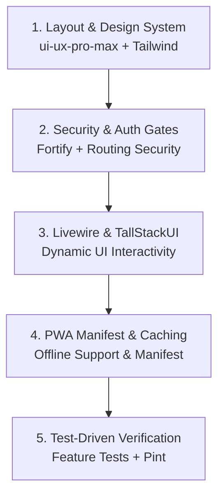

# T.A.L.A. System - Technical Specification

**Total Academic Lifecycle Automation System**

**Servitech Institute Asia (SIA)**

---

## Document Control

Versioning rule: major version increments once per update date; same-day updates are consolidated.

| Version | Date | Description |
| --- | --- | --- |
| 1.0 | 2026-04-02 | TS baseline consolidated. |
| 2.0 | 2026-04-30 | Hybrid ingestion; private storage; OCR metadata; staff verification. |
| 3.0 | 2026-05-01 | Queue, scheduler, Redis, Supervisor, Horizon job strategy. |
| 4.0 | 2026-05-02 | Student Hub/PWA architecture; baseline tables; period grading. |
| 5.0 | 2026-05-03 | Prerequisite validator; modality enum; PUP transmutation; PayMongo/GCV. |
| 6.0 | 2026-05-04 | PHPUnit alignment; Term Close job; returnee states; document transitions. |
| 7.0 | 2026-05-05 | Advising enum/service; LIS fields; TallStackUI; role middleware. |
| 8.0 | 2026-05-12 | Curriculum intake; faculty self-service scheduling; role segregation; migration refs. |
| 9.0 | 2026-05-13 | Applicant fields; OCR confirmation; payment endpoints; terms calendar gates. |
| 10.0 | 2026-05-14 | Maintenance service; toast templates; import batch framework. |
| 11.0 | 2026-05-18 | Student records queries; settings; OCR thresholds; COR QR; grade correction. |
| 12.0 | 2026-05-20 | Walk-in APIs; installment schema; enrollment/payment/import rule contracts. |
| 13.0 | 2026-05-21 | Complexity audit: payment delivery, GCV, calendar, fees, ledger, RateLimiter. |
| 14.0 | 2026-05-22 | Import/notification alignment; cost addendum; Fortify; curriculum/grading fixes. |
| 15.0 | 2026-05-23 | Subsidy workflow replaced by freshmen discount. |
| 16.0 | 2026-05-24 | Calendar/installment locks; migration inventory; Fortify/runtime settings. |
| 17.0 | 2026-06-02 | Filament role contracts; canonical split-name contract. |
| 18.0 | 2026-06-03 | Settings debloat; Student Hub guidance; admin CRUD/service-boundary contracts. |
| 19.0 | 2026-06-04 | Faculty class list and enrollment-subject Filament contract. |
| 20.0 | 2026-06-05 | Filament lifecycle contracts: documents, enrollment, installments, settings, schedules, COR, FAQ. |
| 21.0 | 2026-06-06 | Detail/display hardening; relationship labels; private uploads; Student Hub/FAQ access. |
| 22.0 | 2026-06-07 | Rescue architecture: GCP OR-Tools; faculty eligibility; coverage/validity targets. |
| 23.0 | 2026-06-08 | Scheduling constraints; teacher/adviser requirement; max-seat cap. |
| 24.0 | 2026-06-09 | Scheduling pipeline; solver deployment; promissory and returnee boundaries. |
| 25.0 | 2026-06-10 | Guided tour removed; Phase 1 boundary; foundation admin architecture. |
| 26.0 | 2026-06-11 | Controlled import architecture; Academic Head approval; PayMongo smoke command. |
| 27.0 | 2026-06-12 | Google Vision smoke; live OCR/PayMongo evidence; FAQ governance cleanup; TS cleanup. |
| 28.0 | 2026-06-14 | Backend services active; Student Hub UI pending; scheduling readiness hardened. |
| 29.0 | 2026-06-17 | Scheduling closure; delivery groups; curriculum readiness; publish lifecycle; workload overrides; PayMongo handover parity. |
| 30.0 | 2026-06-18 | Student services; assessment/payment/promissory/adjustment contracts; document lifecycle requirements. |
| 31.0 | 2026-06-19 | Workflow reconciliation; admission/retention/capacity requirements; UI test baseline. |
| 32.0 | 2026-06-21 | Submission baseline; benchmark/legal hardening; College-only correction; document-request removal. |

---

**Document Scope Boundary:** This document defines technical architecture, contracts, and implementation constraints only. Project execution status, QA progress, and implementation ownership live outside the TS in project management artifacts.

**Code Example Boundary:** Code blocks in this TS are contract examples or pseudocode unless they point to a concrete source file. The implementation source of truth is the checked-in Laravel code, migrations, policies, tests, and lockfiles. When an example conflicts with the codebase, update the example or replace it with a contract/interface description instead of copying it blindly.

**Technical Specification Scope Boundary:** This TS is the benchmark-grounded technical contract for the final-form TALA system. It is written so a developer can implement the approved FS baseline using Laravel services, policies, migrations, Filament staff resources, Livewire/TallStackUI student surfaces, queues/jobs, private files, audits, and focused tests. The TS must describe stable contracts and boundaries; implementation progress belongs in tracking artifacts.

**College-Only Technical Boundary:** The active implementation target is College-only. SHS must not remain as an active UI option, validation branch, seed/default offering, grading engine path, fee scope, schedule/calendar branch, or UAT path. Grade 12/Form 138/Form 137 references are permitted only as prior-education evidence for College admission or archived historical evidence.

**Document-Request Technical Boundary:** Remove the document-request domain end to end: model/table, lifecycle service, Filament resource, Student Hub route/page, permissions, scheduled shipping job, seed/factory data, ledger entry options, and dedicated tests. The institution's manual document-request process remains outside TALA. Admission-document review and artifacts generated directly by enrollment, grade, finance, transfer, or completion workflows remain independent in-scope capabilities.

### Submission Baseline Technical Contract Map

| Technical area | Baseline contract | Primary implementation pattern | Verification expectation |
| --- | --- | --- | --- |
| Identity and access | Fortify/authenticated sessions, active-account middleware, one-role operational access, policy-gated staff/student routes, logout/session expiry, and audit for account lifecycle actions. | Laravel auth, middleware, policies, Spatie Permission, Filament navigation policy checks. | Feature tests for login/logout, protected-route denial, role boundary, and lifecycle actions. |
| Admissions and documents | Published offerings, versioned requirement policies, materialized applicant checklist snapshots, per-item admission/retention state, private evidence storage, OCR derivative text, and Registrar verification. | Laravel services/actions, private filesystem, Google Vision OCR client/job, Filament actions for staff review. | Service/feature tests for intake, checklist resolution, review state changes, retention undertaking, and OCR fallback/manual review. |
| Enrollment and student records | Atomic handover from approved applicant to canonical student profile/enrollment, secured capacity, section/delivery placement, enrolled roster, and lifecycle audit. | Transactional services with row locking, model states/enums, capacity services, roster queries/export actions. | Tests for happy path, missing gate, full capacity, duplicate/idempotent handover, and roster authorization/export. |
| Scheduling | Curriculum readiness, section delivery groups, faculty eligibility/availability, schedule snapshots, OR-Tools CP-SAT solve, draft review, commit, publish, and controlled overrides. | Laravel scheduling services plus authenticated Cloud Run/OR-Tools solver or equivalent constraint service. | Unit/feature tests for constraints, solver result ingest, commit/publish permissions, conflict rejection, and manual override audit. |
| Finance and payments | Assessment, discount/installment policy, immutable ledger, PayMongo/manual channel parity, provider webhooks, idempotency, SOA/receipt artifacts, and computed clearance. | Accounting services, webhook storage/signature verification, queue jobs, ledger-entry invariants, PDF issuance. | Tests for assessment, payment confirmation, webhook retry/idempotency, overpayment, zero-balance edge, and finance privacy. |
| Grades and academic records | Faculty class-list scope, grade encoding/submission, Registrar verification, finalization, correction/override, grade history, and transcript/report-card source data. | Service-owned grading workflows, policy-gated Filament actions, immutable finalization/correction audit. | Tests for assigned-faculty access, invalid role denial, grade finalization, correction approval, and transcript source integrity. |
| Student Hub and public UI | Livewire/TallStackUI pages read from backend services; Student Hub is protected by active student status; offline/PWA behavior is read-only unless a mutation service is explicitly approved. No document-request route or page exists. | Livewire components, TallStackUI controls, service-returned view models, PWA cache for approved read-only data. | Browser/feature tests for access, dashboard data, validation/error states, read-only offline boundaries, and no cross-student leakage. |
| Official generated artifacts | COR, SOA/payment evidence, academic records, and completion credentials are derived directly from College source workflows and carry template, issuer, checksum, serial/reference, release, and revoke/supersede metadata. Form 137/Form 138 remain prior-school admission evidence. | DomPDF/Blade templates, private storage, QR token/signed URL verification, issuance services, lifecycle states. | Tests for source-state eligibility, private artifact access, QR verification, revocation/supersede, and no private data in QR payloads. |
| Imports, exports, and reporting | Controlled templates, private upload, validation preview, zero-error commit where required, audit, generic roster/report export, and external-boundary separation (no official DepEd School Forms, LIS submissions, or completion tracking generated). | Laravel Excel/PhpSpreadsheet services, import batch records, queueable processing, authorized export actions. | Tests for template headers, invalid rows, no partial unsafe commit, export authorization, and audit records. |
| Security, privacy, and audit (RA 10173 & NPC 2023-06) | Privacy-by-design access controls, private-by-default files, signed/temporary access, role-scoped evidence visibility, webhook signature checks, purpose-limited retention, breach protocol readiness, activity logs, and sensitive-support data minimization. | Laravel filesystem, signed URLs, policies, activitylog, validation/FormRequests, webhook verifier services. | Security tests for unauthorized access, private path leakage, webhook rejection, upload validation, and audit creation. |

### Submission Readiness Rule

This TS is submission-ready only when every final-form feature described in the FS has an implementable technical contract covering: source models/tables, service/action owner, policy/RBAC boundary, UI surface, integration/file/job behavior, validation and failure modes, audit/evidence output, and focused test expectation. A feature may be marked Supporting, Deferred, Phase 2, or External Boundary in execution artifacts, but its final-form technical boundary must still be clear enough that future implementation does not require guessing.

## Table of Contents

1.  [Technical Architecture](#1-technical-architecture)
2.  [Database Implementation References](#2-database-implementation-references)
3.  [Module Implementation Details](#3-module-implementation-details)
4.  [Security Implementation](#4-security-implementation)
5.  [Frontend Implementation](#5-frontend-implementation)
6.  [Third-Party Integrations](#6-third-party-integrations)
7.  [Implementation & Verification Strategy](#7-implementation--verification-strategy)
8.  [Deployment & Operations](#8-deployment--operations)

---

## 1. Technical Architecture

### 1.1 Architecture Philosophy

**“Dev-Quick” Hybrid Architecture** designed for Speed, Familiarity, and Unified Data.

### 1.1.1 Core Technical Boundary

System acceptance depends on the following technical requirements. These are acceptance boundaries, not an execution tracker:

- Academic foundation behavior must be staff-operable through typed Filament resources/pages and/or controlled imports for Programs, Subjects, Curricula/Curriculum Subjects, Terms, Sections, and the minimum safe room input required by scheduling. Local seeders remain QA fixtures only.
- Official/finalized grade corrections use an authenticated Academic Head approval action/queue before Registrar resolution applies corrected values. Registrar-only prior-approval recording is no longer an accepted workflow.
- PayMongo and Google Cloud Vision OCR must pass live sandbox/configured-environment smoke checks. Mock drivers remain for automated tests and local fallback only. The PayMongo and Google Vision code paths provide local operator commands for final evidence checks; dated execution results belong in acceptance readiness artifacts.
- Import must implement strict template download, upload, validation preview/error report, commit, and audit evidence. The Phase 1 implemented path covers curriculum/foundation import; student, grade, financial, and enrollment legacy imports require separate controlled services if they become required for acceptance.
- Backend contracts are active backend readiness dependencies before acceptance: applicant intake orchestration, student enrollment orchestration, prerequisite-aware subject suggestion, and student dashboard aggregation. Student Hub UI screens and PWA presentation remain deferred until those contracts are stable.

### 1.2 Technology Stack

| Layer | Technology | Package | Version | Role in System |
| --- | --- | --- | --- | --- |
| **Backend Core** | **Laravel 12 (PHP)** | `laravel/framework` | 12.58.0 | **The Brain.** Monolithic backend handling Business Logic for **Enrollment, Grading, and Financial Record Keeping**. It serves as the single source of truth for all modules. |
| **Staff Operations UI** | **FilamentPHP v5** | `filament/filament` | 5.6.2 | **The Command Center.** Powering the **Registrar, Accounting/Cashier, Faculty, Academic Head, and System Super Admin** dashboards. It leverages “TALL Stack” (Tailwind, Alpine, Livewire, Laravel) to auto-generate 80% of the UI (Tables, Forms, Notifications, Modals), drastically reducing development time. |
| **Student Hub UI** | **Laravel + Livewire + TallStackUI + Tailwind CSS + Alpine.js** | `livewire/livewire`, `tallstackui/tallstackui`, `tailwindcss`, `alpinejs` | 4.3.0, 3.0.0, 4.1.18, 3.15.10 | **The Public Face.** Uses **Server-Side Rendering (Blade)** with **TallStackUI Components** for premium aesthetics and **Alpine.js** for client-side interactivity. It leverages **Multi-Route SPA routing with wire:navigate** for instantaneous transitions, PWA offline caching, and SEO. Includes **PWA Service Workers**. |
| **Database** | **MySQL** | \- | 8.0+ | **The Memory.** Relational source of truth for academic, financial, audit, document metadata, OCR text, and staff-verified extracted fields. Raw uploaded files are not stored as database BLOBs. |
| **File/Object Storage** | **Laravel Filesystem (Private Local/S3-Compatible Disk)** | Built-in / Flysystem | \- | **The Evidence Vault.** Stores original uploaded documents, payment proofs, certificates, receipts, and generated previews outside the database with private visibility and temporary signed access. |
| **Infrastructure** | **Cloud VPS (DigitalOcean/AWS)** | \- | \- | **The Environment.** Scalable cloud hosting to ensure 24/7 availability, queue worker support, and security (vs. local servers). |

---

**Panel Terminology Boundary**: "Admin Nexus," "Admin Panel," "Filament admin panel," and similar labels refer only to the shared staff operations UI. They do not define a generic `admin` role. Implementation must use the approved roles and permission slugs: `registrar`, `accounting`, `faculty`, `academic-head`, and `system-super-admin`.

### 1.2.0 Implementation Readiness Snapshot

The lockfiles and local package manager output are authoritative for exact installed versions during implementation planning. This document records major-version contracts only: PHP 8.2, Laravel 12, MySQL, Filament 5, Livewire 4, Laravel Boost 2, Laravel Horizon 5, Tailwind CSS 4, Alpine.js 3, and PHPUnit 11. Re-check `composer.lock`, `package-lock.json`, or `composer show` / `npm list` before using version-sensitive APIs.

The package set already includes the intended core implementation tools: `spatie/laravel-permission`, `spatie/laravel-model-states`, `spatie/laravel-activitylog`, `spatie/laravel-webhook-client`, `google/cloud-vision`, `luigel/laravel-paymongo`, `tallstackui/tallstackui`, `erag/laravel-pwa`, `maatwebsite/excel`, `barryvdh/laravel-dompdf`, and `chillerlan/php-qrcode`.

The database contract is defined by the migration files, model/service boundaries in this TS, and `TALA-Foundation-Migration-Control-Log.md`. Live migration execution state is environment-specific and must be verified with `php artisan migrate:status --no-interaction`; this specification must not carry exact applied/pending migration counts.

The following runtime boundaries apply across environments:

| Runtime Area | Boundary | Implementation Impact |
|--------------|----------|-----------------------|
| Horizon | `laravel/horizon` is installed, but `config/horizon.php` is absent. | Local development must use the database queue. Production may use Redis + Horizon only after Horizon config is installed and queue workers are configured. |
| API Routes | `routes/api.php` exists for integration endpoints such as PayMongo webhooks. | New API endpoints must be registered deliberately, signed or authenticated where appropriate, and covered by focused feature tests. |
| Webhooks | PayMongo webhooks use the local `webhook_calls` storage table plus application signature verification and processing services. | Provider callbacks must be stored, signature-verified, idempotent, and covered by smoke evidence before acceptance. |
| File Storage | The `local` disk already roots to `storage/app/private`. | Uploaded student documents, receipts, and OCR source files must remain private by default. Public disks are only for intentionally public assets. |
| Domain Schema | Stable foundation migrations are implemented; business-policy-heavy domains remain deferred. | Use the migration files and `TALA-Foundation-Migration-Control-Log.md` as implementation references. Add future domain schema through new migrations paired with services and tests. |

### 1.2.1 Frontend Stack Details (TALL Stack + TallStackUI)

The Student Hub UI uses an enhanced **TALL Stack** with the following components:

| **Component** | **Technology** | **Purpose** |
| --- | --- | --- |
| **Tailwind CSS** | v4.0+ | Utility-first CSS framework for rapid UI development, configured to support TallStackUI components |
| **Alpine.js** | v3.x | Lightweight JavaScript framework for client-side interactivity (dropdowns, modals, toggles) without the complexity of larger frameworks |
| **Livewire** | v4.x | Full-stack framework for dynamic Laravel applications using server-side rendering |
| **TallStackUI** | v3.0 | Free, open-source Livewire component library for polished, production-ready UI elements (modals, badges, buttons, dropdowns, layouts, sidebars, tables, date pickers, and 50+ components) |
| **Heroicons** | v2.x | Hand-crafted SVG icons integrated via Blade components |

**Why Alpine.js?**  
Alpine.js provides lightweight JavaScript reactivity for UI patterns that don’t require Livewire’s server round-trip:

-   Dropdown menus and popovers
-   Modal open/close animations
-   Tab switching
-   Form validation feedback
-   Toggle switches and checkboxes
-   Client-side state management for instant UI updates

Example usage in Blade templates:


```blade
<!-- Dropdown with Alpine.js --><div x-data="{ open: false }" class="relative">    <button @click="open = !open" class="flex items-center gap-2">        Menu <span x-text="open ? '▲' : '▼'"></span>    </button>    <div x-show="open"          @click.outside="open = false"         x-transition         class="absolute right-0 mt-2 w-48 bg-white rounded-md shadow-lg">        <!-- Menu items -->    </div></div>
```

---

### 1.3 Additional Technical Components

| Component | Technology / Approach | Package | Purpose |
| --- | --- | --- | --- |
| **OCR Engine** | Google Cloud Vision API | `google/cloud-vision` ^2.1 | **Text extraction only** from uploaded documents across the academic lifecycle (Admissions, Credit Evaluation, Payment Proofs). Manual review by staff. |
| **Document Storage** | Hybrid file + relational metadata model | Laravel Filesystem + MySQL | Original files remain in private storage; OCR text, confidence scores, parsed payloads, and reviewed extracted fields are stored in MySQL. |
| **Background Jobs** | Laravel Queue + Laravel Scheduler | Built-in; `laravel/horizon` installed but requires Redis queue configuration and `config/horizon.php` before use | Runs asynchronous OCR, notifications, webhook processing, and scheduled maintenance. Local development uses database queues; production may use Redis queues with Supervisor-managed workers and Horizon only after Horizon is installed/configured for the environment. |
| **Webhooks** | Spatie Webhook Client | `spatie/laravel-webhook-client` | Safely receives, verifies signatures, and prevents double processing (idempotency) of GCash webhooks. |
| **Audit Trails** | Spatie Activity Log | `spatie/laravel-activitylog` | Tracks all model changes and user actions for strict accountability on financial and grading overrides. |
| **Audit UI** | Filament Activity Log | `pxlrbt/filament-activity-log` | Provides a Filament staff-panel GUI to view the `spatie/laravel-activitylog` records. |
| **State Machine** | Spatie Model States | `spatie/laravel-model-states` | Enforces approved lifecycle transitions where a domain requires explicit state control. |
| **Email** | Laravel Mail (SMTP) | Built-in | Account-related notifications |
| **Excel I/O** | Laravel Excel / PhpSpreadsheet | `maatwebsite/excel` ^3.1 | Final schedule exports, curriculum template import/export, report exports, and optional strict staff fallback imports. Faculty availability is collected in-app, not primarily by Excel. |
| **PDF Gen** | DomPDF | `barryvdh/laravel-dompdf` ^3.1 | COR and Report Card generation (Module 2) |
| **QR Code Gen** | chillerlan/php-qrcode | `chillerlan/php-qrcode` ^5.0 | COR QR image generation for an online verification URL. The payload is a signed/opaque-token route, not raw student/term/hash data. |
| **RBAC** | Spatie Laravel Permission | `spatie/laravel-permission` ^6.24 | Role-based access control for all user types (applicant, student, registrar, accounting, faculty, academic-head, system-super-admin) |
| **PWA** | Laravel PWA | `erag/laravel-pwa` ^2.1 | Progressive Web App support for offline COR access and mobile installation. Provides `@PwaHead` and `@RegisterServiceWorkerScript` Blade directives, Livewire-compatible, supports Laravel 8–13. |
| **Icons** | Blade Heroicons | Built-in (via `filament/filament`) | Filament v5 bundles `blade-ui-kit/blade-heroicons` as a transitive dependency. No separate install needed. |
| **Staff Onboarding** | External operations guidance | No runtime package | The Admin Nexus does not load a guided-tour plugin. Staff onboarding is handled through maintained operations guidance and acceptance scripts unless a future approved item reintroduces a tested tour surface. |
| **Student Onboarding** | Driver.js | `driver.js` (NPM) | Provides interactive guided tours for the Livewire/TallStackUI Student PWA. |

---

### 1.3.1 Document Ingestion & Storage Strategy

**Architecture Decision**: T.A.L.A. uses a **hybrid document storage model**.

> **Architecture Decision:** The generic College pipeline, Regular College Freshman and College Transfer public-offering contracts, Old Curriculum College pathway, inactive-by-default foreign compliance profile, purpose-limited IP/SEN support attributes, readiness-gated payment/enrollment handover, stacked College capacity-plan enforcement, returning/legacy boundary, inactive cross-enrollee behavior, composable admission dimensions, and deterministic fail-closed resolution are approved. Versioned requirements, per-item evidence, immutable history, capacity locking, and typed services are retained controls.

**Admissions and Document Review Technical Baseline**:
This section adopts the benchmark matrix rule for admissions, applicant intake, requirement policies, and OCR. The implementation must behave like a service-owned lifecycle, not a set of unrelated forms: a published admission offering opens intake; a deterministic resolver snapshots requirement policy into checklist rows; evidence enters through self-service, Registrar-assisted, official-transmission, or physical-custody channels; OCR may add provisional derivatives; Registrar review decides satisfaction; and only the enrollment/handover services may promote the applicant into official student/enrollment records.

| Contract area | Required technical behavior | Focused verification expectation |
| --- | --- | --- |
| Published offering resolution | `AdmissionRequirementResolver` resolves one active offering/policy for the selected term/scope and fails closed for no match, duplicate priority, unpublished offering, expired window, or unsupported dimension. | Tests cover published happy path plus no-match/ambiguous/unpublished denial without fallback to a hardcoded document list. |
| Applicant staging | Applicant intake creates a pending applicant user plus applicant-intake staging data only. It does not create `student_profiles`, official enrollments, ledger entries, CORs, or Student Hub access. | Tests assert applicant-only access and absence of official student records before approved handover. |
| Checklist snapshot | `applicant_document_requirements` stores the source offering, policy/rule/item versions, labels, gate type, evidence methods, OCR policy, due-date strategy, and current digital/physical/review states. | Tests prove later policy edits do not mutate existing applicant checklist rows. |
| Unified evidence lifecycle | Applicant uploads, Registrar scans, official transmissions, and physical custody events all satisfy the same materialized requirement model while preserving channel, actor, timestamp, checksum or custody evidence, and replacement history. | Tests cover self-service upload, Registrar-assisted physical receipt, replacement evidence, and official-transmission satisfaction. |
| OCR boundary | OCR is dispatched only after commit, only for attached digital files whose document type enables OCR, and stores text/confidence/candidate fields as `processing_derivative` evidence. Google Vision is the current text-extraction baseline; Document AI Form Parser remains Phase 2 for structured key-value/table/checkbox extraction. | Tests cover OCR dispatch/no-dispatch rules, low-confidence manual-review routing, provider failure fallback, and no automatic promotion to official values. |
| Review transitions | `DocumentUploadReviewService` or equivalent lifecycle service owns approve, needs-correction, reject, and reprocess transitions with row locking, active-state validation, typed reasons, reviewer metadata, notification context, and activity-log evidence. | Tests cover terminal-state protection, required rejection/correction reason, approved payload copy, and unauthorized-role denial. |
| Gate computation | `DocumentComplianceService` derives admission-gate completeness, retention obligations, missing labels, and hold reasons from checklist rows, not from `student_profiles.hard_copy_received` or free-text notes. | Tests cover gate-blocked payment/handover, retention-nonblocking handover, and checklist-driven hold labels. |
| Retention undertaking | `RetentionDocumentUndertakingService` creates itemized undertakings only for pending retention checklist rows, attaches student/enrollment context on handover, and scheduled jobs mark overdue items without cancelling enrollment. | Tests cover undertaking creation, resolution from later document approval, overdue marking, and no silent section/COR/class removal. |

**Versioned Admission Requirement Contract**:

- `admission_offerings` owns the term-scoped applicant-facing route. It records entry route, prior-credential pathway, citizenship/compliance profile, optional College program and year-level scope, publication window/state, capacity-plan reference, and active requirement-policy version. Unpublished offerings cannot receive public or Registrar-assisted intake.
- Initial seed data creates draft templates for approved College workflow profiles but publishes only Regular College Freshman and College Transfer for acceptance. Cross-enrollee remains inactive. Old curriculum is a controlled College prior-credential pathway; ALS/equivalency is inactive until institution-approved for College admission; foreign is a compliance profile; IP and disability/SEN are purpose-limited support attributes. None creates a separate service or state machine.
- Draft requirement templates reproduce the client-declared admission/retention rows in FS 4.1.2 with source/version provenance. Seeding is not publication: activation validates non-empty coverage, regulator-compatible evidence methods/deadlines, deterministic resolution, and authorized Registrar approval. A binding regulator rule may change the active method or deadline without deleting the traceable client baseline.
- `admission_requirement_policies` owns immutable Registrar-authored policy versions. `admission_requirement_rules` contains structured match criteria over approved dimensions plus explicit priority; publication validates that every offering resolves deterministically and rejects equal-priority conflicts, unknown dimensions, or missing coverage.
- `document_requirement_items` owns the ordered normalized document-type keys produced by a policy rule plus `gate_type` (`admission` or `retention`), permitted evidence methods, storage class, sensitivity class, OCR policy, verified-field mapping, deadline strategy, retention policy, and nullable policy parameters. Items are configuration records, not applicant submissions. Admission and retention classification is scope/version specific; no deployment-wide all-physical constant is permitted.
- `applicant_document_requirements` materializes the selected requirement-item snapshot for one applicant intake. It owns separate digital-review and physical-receipt states independently from whether a digital file currently exists, allowing a Registrar to record a walk-in physical inspection before an optional scan is attached.
- A requirement policy moves through typed draft/active/retired states. Activation rejects overlapping or incomplete rules that would make an offering's resolution ambiguous or impossible.
- `AdmissionRequirementResolver` resolves the published offering and composes its active base and conditional rules when an applicant intake starts. It stores the offering and source policy/rule versions plus an immutable requirement snapshot on the intake so later configuration changes do not rewrite historical applicant obligations.
- Missing or ambiguous resolution blocks intake for that scope and produces a staff-facing setup error. The service must not fall back silently to a hardcoded list.
- Registrar maintains requirement sets through a typed Filament workflow with version/activation actions and audit evidence. Arbitrary per-applicant requirement names and generic delete of activated history are forbidden.
- The existing hardcoded `ApplicantIntakeService::requiredDocumentsFor()` matrix must be replaced by the resolver In the final implementation.

**Unified Submission Channel Contract**:

- `self_service` and `registrar_assisted` are submission-channel values on one document lifecycle. They do not create separate applicant, requirement, or review models.
- Self-service requires an authenticated applicant-owned upload action. Registrar-assisted intake requires the authorized Registrar actor and may record physical inspection with no attachment or attach a scan to private storage.
- Every submitted file links to the applicable `applicant_document_requirements` row and records channel, submitting actor, and submission time. Replacement evidence remains historically linked instead of overwriting the prior file.
- OCR dispatch requires an attached digital file and an OCR-enabled requirement type. A Registrar-assisted physical inspection without a scan never dispatches OCR.
- Both channels use the same completeness, review, correction, rejection, and approval services. Channel-specific controller or Filament code must not duplicate state-transition rules.

**Per-Item Compliance Contract**:

- Each materialized requirement snapshots `gate_type`, permitted evidence methods, review state, due-date policy, and labels. Required items cannot be waived ad hoc.
- Evidence state distinguishes `not_required`, `pending`, `submitted`, `approved`, `needs_correction`, `rejected`, `overdue`, and `satisfied`, while the satisfaction record identifies the accepted method (for example physical original, certified copy, or regulator-permitted official transmission), actor, timestamp, and evidence reference.
- Applicant uploads, Registrar scans, and OCR output remain preliminary unless the snapshot explicitly permits that method as final evidence. OCR never establishes authenticity.
- Admission-gate completeness is an activation prerequisite. Retention items may remain pending after enrollment only through an itemized undertaking with issue date, due date, responsible party, reminders, extensions, receipt history, and resolution.
- `RetentionDocumentDeadlineResolver` derives the due date within the active deployment policy and term calendar. The current institution's ordinary target window is 30-to-60 days, selected per requirement/undertaking; no universal seven-day default is permitted.
- `document_requirement_extensions` preserves prior/new deadlines, reason, actor, and timestamp. Scheduled monitoring marks overdue items, sends deduplicated notifications, and applies only configured documentary/next-cycle holds. It never silently cancels an active enrollment or removes section/COR/class access.
- Runtime implementation currently materializes retention undertakings in `retention_document_undertakings` as one row per pending retention checklist item. Approval for payment creates active undertakings, handover attaches student/enrollment context, Registrar document approval resolves the undertaking, and `ProcessRetentionDocumentUndertakingsJob` marks due active undertakings overdue with `retention_document_overdue` hold evidence. Notification delivery and explicit extension workflow remain admin-surface follow-up work.
- `DocumentComplianceService` derives admission completeness, retention obligations, missing labels, and hold reasons from the checklist. `student_profiles.hard_copy_received` is transitional compatibility data and must not remain an independent source of truth.
- Official school-to-school delivery is an external channel with an internal receipt record. MVP uses Registrar-assisted entry of sender/school, channel, receipt timestamp, provenance, verification, and optional private artifact; it does not integrate with DepEd LIS, email servers, or previous-school systems. Undertakings, deadlines, reminders, and holds are TALA-owned records. Alternative identity evidence uses the ordinary private upload/verification lifecycle.
- For Regular College Freshman, admission outcomes are verified identity, verified Grade 12/prior-education completion or eligibility, and accepted Good Moral evidence for the active deployment. Diploma/Certificate of Graduation and one normalized ID-photo obligation default to retention/follow-up. Policy publication rejects duplicate photo items with the same purpose.
- College entrance-exam completion/result is stored as a structured admission assessment linked to the intake. No score threshold affects eligibility until a versioned admission-assessment policy defines the exam, scoring/version, passing or placement effect, effective scope, and approving authority. An uploaded screenshot is never the authoritative exam result.
- `official_transmission` records are Registrar-created receipt/provenance records, not external-system integrations. Electronic artifacts are retained privately and checksummed; physical-only receipt creates a custody/inspection event without fabricating a file. Both methods may satisfy only requirement items whose active policy permits that evidence method.
- For College Transfer, admission outcomes are verified identity, sufficient preliminary academic evidence for credit/eligibility evaluation, verified transfer-release eligibility, and accepted Good Moral evidence for the active deployment. Final TOR, remaining non-duplicate official transfer evidence, and one normalized ID-photo item default to retention/follow-up.
- `document_types` must distinguish `honorable_dismissal` as transfer-release evidence from `final_tor` as the authoritative academic record. A generic `official_transfer_credentials` label may group staff display but must not materialize a duplicate obligation when its purpose is already satisfied by a specific item.
- `old_curriculum` is a College prior-credential pathway, not an applicant type or separate state machine. It composes with Regular College Freshman and substitutes verified old-high-school eligibility evidence for Grade 12/prior-education completion evidence. Requirement materialization deduplicates Form 137 when it already served as the accepted admission evidence and does not add a generic Certificate of Completion unless an active rule identifies the credential and purpose.
- Deprecated SHS pathways are archived trace evidence only. They are not seeded as publishable offerings, have no public route, no resolver fallback, and no hardcoded requirement list. Any future SHS restoration requires a separate client-approved scenario, target offering, eligibility authority, non-conflicting requirement policy, code slice, and test baseline.
- ALS/equivalency for College admission is inactive until the institution approves a College pathway and evidence rule. If approved later, publication validation must require one authoritative eligibility outcome and deduplicate Certificate of Rating, Certificate of Completion, and equivalent evidence when they prove the same purpose.
- `foreign` is a citizenship/compliance profile, not an applicant type or separate state machine. Publication validation fails unless the base offering is published, institution acceptance of foreign applicants is recorded for the term/scope, and the active policy requires legal stay/study authorization evidence appropriate to the offering. College and other higher-than-high-school offerings must distinguish Student Visa 9(f) evidence; basic-education, short-term, exchange, and non-degree cases must use the configured legal-stay or Special Study Permit evidence method where applicable. Passport, visa, permit, immigration, medical, and English-proficiency files use `restricted_support_file` controls by default. TALA stores evidence, verification state, deadlines, and holds only; it has no external immigration/regulator integration or status mutation.
- IP and disability/SEN are optional support attributes, not applicant types, routes, or denial-producing dimensions. Requirement resolution must not add an admission gate solely because one of these attributes is present. Support evidence may be materialized only when a configured support purpose exists, such as scholarship/support program eligibility, culture-responsive coordination, accessibility accommodation, safety planning, or legally required inclusive-education service. IP/community, medical, psychological, functional, accessibility, and accommodation files use `restricted_support_file` controls, disable OCR by default, and require a purpose tag, role-scoped authorization, access audit, retention policy, and minimal verified-field promotion. These attributes must not be used for automated rejection, ranking, section assignment, billing, discipline, or public reporting unless a later approved rule explicitly permits the specific use.
- `admission_capacity_plans` owns effective-dated approved College intake limits by term and scope. Capacity scopes may be campus-wide, program-specific, year-level-specific, or delivery-setup-specific. The current campus value may be 100 active enrolled students, but scope and value are configuration, not platform constants.
- Capacity resolution returns every active matching plan as a stack. Payment may secure capacity only when every applicable plan has remaining room. Child caps may be stricter than the parent; the system must reject overlapping equal-scope plans that would make capacity resolution ambiguous.
- `admission_capacity_placements` distinguishes `tentative` pre-payment planning, `secured` OR-backed admission capacity, and `placed` final section/delivery assignment. Tentative placement grants no account/COR/class access, consumes no protected capacity, and expires at the earlier of the configured payment deadline, admission-window close, or manual Registrar cancellation with reason.
- Payment confirmation locks the resolved capacity-plan stack and atomically secures capacity with the immutable payment/ledger post. Idempotent retries cannot consume capacity twice. Section/group planning must cover the approved plan before payment opens, and final placement must respect section and delivery-group capacity separately from admission capacity.
- Runtime implementation currently enforces configured approved plans through `admission_capacity_plans` and `admission_capacity_reservations`. `AdmissionCapacityReservationService` resolves every matching approved plan, locks the stack during finance clearance, creates one `secured` reservation per enrollment/plan, increments `reserved_count` idempotently, and throws before handover when any configured plan is full. For legacy/local data with no approved plan rows, reservation is a no-op until the remaining readiness gate/admin setup makes capacity plans mandatory before payment opens.
- `EnrollmentReadinessService` must block payment clearance, OR-backed capacity security, and enrollment handover until the term has an active calendar/enrollment window, published admission offering and requirement policy, approved capacity plan, ready curriculum/subject-offering scope, planned sections and delivery groups, faculty-subject eligibility/availability or approved override, and a committed/published official schedule or documented institution-controlled scheduling exception.
- If an applicant pays and capacity is secured but no compatible final section/delivery placement remains because of institution-caused planning delay or scheduling failure, the system records `PendingInstitutionalPlacement` for Registrar resolution instead of reverting payment, rejecting the applicant, or marking the applicant noncompliant.
- `EnrollmentHandoverService` may activate only when admission, finance, secured-capacity, and compatible-placement gates are clear. It finalizes section/group assignment, writes canonical `enrolled`, updates counts once, activates the account, and enables COR/class-list eligibility in one transaction.
- If the institution cannot provide compatible placement after capacity was secured, the enrollment enters `pending_institutional_placement`; this is not applicant noncompliance and financial outcome is resolved by the effective disposition policy.
- Cancellation and withdrawal preserve applicant, checklist, upload, payment, and ledger history. They use typed causes and the financial disposition resolver; no service assumes blanket payment retention or refund.

Raw uploaded documents are preserved as the canonical evidence, while OCR output and reviewed fields are stored in structured database records. OCR is never treated as the official student record until a Registrar, Accounting user, or authorized Admin verifies the extracted values.

| Storage Layer | Stores | Purpose |
| --- | --- | --- |
| **Private File/Object Storage** | Original images/PDFs, payment screenshots, generated previews | Canonical evidence for review, audit, reprocessing, and dispute handling |
| **MySQL Metadata Tables** | Owner, document type, storage disk/path, MIME type, checksum, file size, upload status, review status | Fast workflow queries, RBAC filtering, audit joins, and lifecycle tracking |
| **MySQL OCR Tables** | Raw OCR text, confidence score, OCR engine, parser version, processing errors, parsed JSON payload | Search, registrar side-by-side review, retry/reprocess support, and confidence-based queues |
| **Domain Tables** | Verified profile fields, credited subjects, discount entries, payment references | Operational source of truth after staff verification |

**Normative Document-Class Matrix**:

| Storage class | Included evidence | Canonical record | OCR/default derivatives | Required controls |
| --- | --- | --- | --- | --- |
| `credential_file` | PSA/birth certificate, Form 138, Form 137, TOR/grades, Good Moral, diploma/completion, Honorable Dismissal, ALS records, passport/visa | Versioned private source file plus metadata/checksum; accepted facts are copied only into verified domain fields | Allowed when useful; always provisional | Replacement history, source/provenance, staff review, temporary authorized preview |
| `official_transmission` | School-to-school Form 137/TOR/transfer credential or other regulator-permitted official transmission | Received artifact plus sender, channel, received time, provenance/signature evidence, and verification state | Optional | Requirement satisfaction references the transmission; applicant upload is not fabricated or required when this method is accepted |
| `identity_photo` | 2x2/recent ID photo | Private source image and versioned approved derivative | Disabled | Image access remains private; public use requires a separately generated purpose-bound artifact |
| `restricted_support_file` | Medical/psychological, disability/SEN, IP/community, immigration, and medical-clearance evidence | Versioned private source file | Disabled by default; explicit purpose approval required | Separate restricted permission, purpose limitation, access audit, minimal field promotion, retention/disposal schedule |
| `transaction_evidence` | Payment proof, promissory attachment, receipt image | Private source file linked to an immutable transaction or approval record | Optional reference extraction only | OCR cannot confirm payment or lifecycle state; Accounting service remains authoritative |
| `generated_official_artifact` | COR, report card, assessment, requested official document, system-issued receipt | Immutable issuance snapshot and/or PDF with template version, issuer, issued time, checksum, subject/term/request, token, and lifecycle state | Search text may be derived; no review OCR | Supersede/revoke instead of overwrite; verification and re-render reproducibility where applicable |
| `structured_record` | Applicant, requirement status, enrollment, schedule, grades, ledger, holds | Authorized normalized database row plus audit evidence | Not applicable | A screenshot/PDF/export is never the operational source of truth |
| `import_source` | Curriculum, roster, fee, grade, enrollment, or legacy CSV/XLSX | Private source file plus checksum, uploader, template/parser version, validation report, and batch state | Parser output is provisional until commit | Zero-error/approved commit rules; normalized accepted rows become operational records |
| `processing_derivative` | OCR text, candidate fields, parser payload, thumbnail/preview | Exact source-version-linked derivative | Regenerable | No independent authority; track engine/parser/attempt; purge independently when policy permits |
| `physical_custody_record` | Original/certified evidence received or inspected without a scan | Structured custody/inspection event | None unless a separate scan is attached | Record method, actor, time, custody location/status, and return/transfer event; scan possession and physical possession are distinct |

`document_types` (or the equivalent normalized catalog) owns the default storage class, sensitivity, allowed MIME/extensions, maximum size, OCR policy, and verified-field schema. A versioned admission requirement may narrow accepted evidence methods or disable OCR, but it cannot weaken the class's security controls. `document_uploads` must reference the applicable document type, owner/context, source channel, source version, checksum, storage disk/key, detected MIME type, size, lifecycle state, and superseded upload when present. Restricted support files require a distinct permission boundary from ordinary document review.

Institutional forms and clearances use the class determined by their source: externally issued evidence is `credential_file`, a decision captured inside TALA is `structured_record`, and an official PDF/signature package issued by TALA is `generated_official_artifact`. One business concept may therefore have a structured decision plus an immutable issued artifact without duplicating authority.

**Processing Flow**:

1.  Validate the file type and size before accepting the upload.
2.  Store the original file on a private Laravel filesystem disk.
3.  Create a `document_uploads` row with file metadata, checksum, owner, selected document type, and initial status.
4.  Dispatch OCR/parsing to Laravel queue workers after the upload transaction commits. Local development uses the database queue; production may use Redis-backed workers, with Laravel Horizon enabled only after Redis queue configuration and `config/horizon.php` exist.
5.  Store OCR output in `document_ocr_results`; store candidate fields in `document_extracted_fields`.
6.  Show the original file, extracted text, candidate fields, confidence, and user-entered profile data side-by-side in Filament.
7.  Promote only staff-approved values into operational domain tables.

**Implementation Rules**:

-   Do not store full document binaries in MySQL.
-   Do not expose document files through public URLs.
-   Use private visibility and temporary signed URLs for previews/downloads.
-   Validate an allowlisted extension plus detected MIME/file signature; never trust the client `Content-Type` alone. Generate storage names, enforce size limits, and scan files for malware where the deployed infrastructure supports it.
-   OCR failures must not block manual review; they should create a `needs_manual_review` state.
-   Reprocessing must be possible without replacing the original upload.
-   Critical academic, financial, and identity fields require human verification before they affect enrollment, billing, grades, or credentials.
-   Retention and disposal are driven by document class, active institutional/regulatory policy, unresolved holds, and audit requirements. Disposal removes both the object and non-required derivatives while preserving the minimum non-sensitive tombstone/audit evidence needed to explain the lifecycle.

**Cost and Complexity Trade-Offs**:

-   **Storage Cost**: Higher than text-only storage because original files are retained, but object storage is cheaper and easier to scale than database BLOB storage.
-   **Compute Cost**: OCR API calls and fallback processing add cost; queue OCR asynchronously and reprocess only when the file checksum, OCR engine, or parser version changes.
-   **Maintenance Complexity**: The system must keep database rows and file storage synchronized. Add orphan-file reports and checksum checks instead of blind deletion.
-   **Retrieval Latency**: Raw files may load slower than DB rows. Keep workflow screens fast by querying metadata first and loading file previews through temporary URLs only when needed.

---

### 1.4 Architecture Rationale

#### 1.4.1 Unified Data (Monolith Strength)

By using a Monolithic Laravel core, the **Registrar** and **Accounting** modules share the *exact same* Database Models (`Student`, `Enrollment`, `Payment`). This makes the **“Unified Pipeline”** possible without complex API syncing.

#### 1.4.2 Decoupled Logic (EDA Strength)

“Internal Events” allow us to build an **Event-Driven System** without the complexity of external message brokers (Kafka/RabbitMQ). This satisfies the “Technical Complexity” constraint while keeping the code clean and scalable.

#### 1.4.3 Role-Based Views

`FilamentPHP` allows us to create one shared staff panel while strictly controlling visibility. A `Cashier` user simply sees a restricted menu compared to a `Registrar`, but they are in the same system.

---

### 1.5 Module-to-Tech Mapping

| Module | Primary Tech | Key Libraries | Key Features |
| --- | --- | --- | --- |
| Module 1 (Student) | **Laravel Livewire + TallStackUI + Tailwind + Alpine.js** | `tallstackui/tallstackui`, `alpinejs`, `erag/laravel-pwa` | PWA, Multi-Step Wizard, College modality selection (On-Site/Blended/Online), external-reporting-ready data collection, and automated College freshmen discount eligibility capture. **(Custom)** |
| Module 2 (Registrar) | FilamentPHP (Admin) | `filament/filament`, `google/cloud-vision` | Student Record Management (Filament Data Table), Scheduling (Curriculum Import, Modality-Aware Conflict Detection), Manual Credit Evaluation, Account Archiver, OCR Document Review, and filterable Enrolled Student Roster/export |
| Module 3 (Accounting) | FilamentPHP + Excel Export | `filament/filament`, `maatwebsite/excel`, `chillerlan/php-qrcode` | Payment Queues (E-Wallets, OTC, Screenshots), Promissory Notes, COR with QR Code, Export Reports |
| Module 4 (Faculty) | FilamentPHP | `filament/filament`, `maatwebsite/excel` | Grading Ecosystem, Manual INC Management, Grade Export, Modality-Aware Class Lists |
| Module 5 (Administration & Integration) | FilamentPHP + Laravel Mail + Audit Logs | `filament/filament`, `spatie/laravel-permission` | RBAC, User Mgmt, Dashboard, Email, Audit Trail, FAQ/Inquiry Management |

---

### 1.4 Benchmark-Hardened Technical Contracts for Feature Groups 3-11

These contracts summarize mandatory implementation boundaries across the remaining benchmark queue. Existing detailed contracts later in this TS remain authoritative where they are stricter. A documented contract is not proof of runtime completion; implementation requires migrations/models, service-owned behavior, policies, UI integration, and focused PHPUnit/Livewire/Filament tests.

| Feature group | Required technical contract | Minimum focused verification |
| --- | --- | --- |
| Enrollment, sectioning, finance clearance, inventory, and COR | One handover application service owns duplicate-safe person/student matching, prerequisite evaluation, row-locked capacity reservation, enrollment creation, section/delivery assignment, account activation, and post-commit events. The transaction is idempotent by applicant/term and fails closed on missing readiness. Roster queries are policy-scoped and generic exports are audited. COR generation reads canonical enrolled state and creates a versioned issuance snapshot. | Happy handover, each blocked prerequisite, duplicate retry, concurrent last-seat attempt, rollback after failure, role denial, roster filter/export field boundary, and COR unavailable before enrollment. |
| Scheduling and CP-SAT generation | A scheduling input builder creates an immutable versioned snapshot of term, sections/delivery groups, subjects, meeting requirements, rooms, faculty eligibility/availability/workload, and policies. An after-commit queued adapter invokes OR-Tools CP-SAT with hard constraints, weighted soft objectives, a time limit, and deterministic metadata. Raw CP-SAT outcomes are normalized to `optimal`, `feasible`, `infeasible`, `model_invalid`, or `unknown`; TALA may return `partial` when a feasible/optimal solve leaves demand unassigned. Timeout is separate boolean/diagnostic evidence, not a sixth solver status. Proposal review, commit, approval, publication, and later change are distinct service transitions. | Constraint-unit tests; infeasible/unknown/model-invalid/timeout/no-publish tests; partial-demand non-commit proof; snapshot reproducibility; after-commit dispatch/retry proof; concurrent commit protection; hard-conflict denial for manual changes; authorized override reason/audit; published visibility only. |
| Finance, payments, ledger, SOA, and receipts | Assessment services resolve effective-dated fee and accommodation policy into immutable charge projections. All confirmed payment channels call one ledger-posting service with unique provider/reference idempotency, database transaction, row locking, and auditable actor/channel evidence. Webhooks are signature-verified, stored, replay-safe, and processed asynchronously after commit. Balance/clearance are projections over immutable entries. PDFs use issuance snapshots and void/supersede state. | Assessment derivation, manual and webhook parity, invalid signature, duplicate callback/reference, pending/failed outcome, overpayment credit, reversal/adjustment, concurrent post, clearance recomputation, private authorization, PDF snapshot/void. |
| Faculty classes and grades | Published schedule/enrollment assignments scope faculty queries. A grade lifecycle service validates period/profile/range/completeness, locks submission/finalization, stores immutable grade history, and emits post-commit notifications. Correction requests snapshot old/new values and evidence; Academic Head decision and Registrar application are separately authorized transitions. | Assigned/unassigned access, unpublished exclusion, valid/invalid grade entry, incomplete submission, duplicate/concurrent finalization, finalized mutation denial, correction approve/reject/apply, old/new audit preservation. |
| Official documents and verification | A document issuance service resolves eligibility/holds, renders from authoritative read models, stores immutable issuance metadata and checksum, and owns issued/void/revoked/superseded transitions. Files remain private unless intentionally public. QR payloads contain only opaque tokens or signed verification URLs; verification responses disclose minimal status metadata and are rate limited/audited where appropriate. | Eligibility and hold denial, deterministic source snapshot, private file access, token tamper/expiry/revocation, minimal disclosure, supersede history, unauthorized issue/release, and source-record change behavior. |
| Student Hub/PWA | Student-facing read models aggregate authoritative services under student ownership policies; Livewire components do not reproduce domain calculations. PWA caches only an approved read-only subset with version/freshness metadata, removes protected caches on logout/account denial, and disables mutations offline. Loading/error responses use safe messages and prevent duplicate submission. | Cross-student denial, applicant/inactive denial, unpublished data exclusion, balance/grade/COR service parity, offline read-only behavior, cache clearing, stale indicator, loading/duplicate-action protection, responsive accessibility smoke. |
| Student status and completion | Typed transition services validate allowed source/target states, effective dates, reasons, evidence, notices, and role authority while preserving history. Readmission performs duplicate/provenance review. Graduation evaluation stores a reproducible snapshot of curriculum, finalized grades, deficiencies, and clearance results; completion and credential eligibility are separate transitions. | Allowed/invalid transitions, rollback/reactivation rules, duplicate legacy match, unauthorized action, missing reason/evidence, incomplete curriculum/hold denial, reproducible evaluation, concurrent status update, external-submission boundary. |
| Imports, exports, and reports | Import batches store private source, template/schema version, checksum, uploader, scope, parsed rows, validation results, preview state, commit state, and audit. Commit services use normalized identifiers, row-level validation, transaction/idempotency rules, and queued chunks only where atomicity semantics remain explicit. Export/report queries apply policies, field allowlists, filters, and audit; generated files are temporary or lifecycle-managed artifacts. | Wrong template/version, invalid headers/types/references, duplicate upload/commit, zero-error atomic rollback, authorized partial policy where explicitly allowed, large chunk behavior, export field leakage denial, external-format absence. |
| Attendance, behavior, discipline, and guidance | No enrollment/clearance gate may consume these domains until typed schemas, case/evidence ownership, privacy policy, resolution/appeal transitions, effective-dated rules, and authorized services exist. Sensitive records require least-privilege policies, private attachments, purpose-limited retention, and audit. | Until promoted, tests assert no hidden dependency blocks enrollment/progression. After promotion: role/privacy denial, evidence lifecycle, notice/response/appeal, policy versioning, resolution effects, retention/deletion, and no free-text-only automated sanction. |

Cross-cutting rule: lifecycle mutations must use service/action boundaries with authorization at entry, validation before mutation, transactions and row locks where shared capacity or money is affected, idempotency for retries/integrations, post-commit jobs/events, safe user errors, and immutable audit evidence. The detailed SDD slice owns concrete class/schema names when implementation begins.

## 2. Database Implementation References

### 2.1 Data Modeling Philosophy

**“Lean Relational” approach**. Use foreign keys for integrity, but keep high-traffic tables such as enrollments and transactions flat enough for speed.

The specifications remain the source of truth for business rules, role ownership, deadlines, locks, approvals, official-record behavior, and workflow boundaries. Migration files are the implementation source for table names, columns, indexes, foreign keys, and rollback behavior. Future schema changes must be added through new migrations and summarized in the implementation control log instead of duplicating table-by-table schema contracts here.

---

### 2.2 Implemented Foundation Schema References

| Area | Implementation File |
| --- | --- |
| Account metadata | `database/migrations/2026_05_12_055403_add_tala_account_fields_to_users_table.php` |
| Academic foundation | `database/migrations/2026_05_12_055403_create_academic_foundation_tables.php` |
| Faculty availability and assisted scheduling foundation | `database/migrations/2026_05_12_055403_create_scheduling_foundation_tables.php` |
| Activity log base table | `database/migrations/2026_05_12_055413_create_activity_log_table.php` |
| Activity log event column | `database/migrations/2026_05_12_055414_add_event_column_to_activity_log_table.php` |
| Activity log batch UUID column | `database/migrations/2026_05_12_055415_add_batch_uuid_column_to_activity_log_table.php` |
| Spatie permission package tables | `database/migrations/2026_01_27_015712_create_permission_tables.php` |
| Role and permission seed mapping | `database/seeders/DatabaseSeeder.php` |
| Migration decision and deferred scope | `00_Project_Documents/TALA-Foundation-Migration-Control-Log.md` |

Laravel baseline authentication, cache, session, queue, and job batch tables remain in the default `0001_01_01_*` migrations.

---

### 2.3 Migration Execution Gates

The following low-policy support tables now have migration files and are executable in the next migration wave:

- `system_settings` for maintenance mode and future runtime settings.
- Laravel `notifications` using Laravel's standard database notifications table.
- `import_batches` for legacy import preview/commit auditability.
- `webhook_calls` for PayMongo webhook payload/header storage.

The following domains are covered by schema and service contracts in this TS. Whether a given local database has applied every migration is verified through `migrate:status`, not by hardcoded documentation counts:

- Enrollment/profile flow (`student_profiles`, `enrollments`, `enrollment_subjects`)
- Applicant intake staging (`applicant_intakes` plus applicant-linked `document_uploads` before handover)
- Financial flow (`fee_templates`, `ledger_entries`, `payment_attempts`, `payments`, `promissory_notes`, installment tables)
- Admission document/OCR flow (`document_uploads`, `document_ocr_results`, `document_extracted_fields`)
- Grade/correction flow (`grades`, `grade_corrections`)
- Service/shift/COR flow (`service_requests`, `shifting_requests`, `shifting_fee_assessments`, `cor_verifications`, `faq_entries`)

**Migration Status Boundary**:
- This TS defines the required schema contracts and relationships, not a live migration-status ledger.
- Current migration execution must be checked with `php artisan migrate:status --no-interaction` in the target environment.
- Fortify two-factor and passkey tables may exist in the schema, but `config/fortify.php` remains the runtime authority for whether those features are enabled.

---

### 2.4 Schema Boundary Rules

- Do not add table-by-table schema summaries back into this technical specification.
- Do not treat migration paths as business approval by themselves; business behavior remains governed by the Functional Specification and workflow sections of this Technical Specification.
- Use `decimal(12,2)` for money in future ledger/storage migrations and minor-unit integers only at payment gateway boundaries.
- Do not store online meeting URLs in scheduling tables unless the client later approves link tracking.
- `users.status` is account lifecycle/auth state only. Future student lifecycle state belongs on `student_profiles.operational_status`; `student_profiles.status_reason` is required only when `operational_status = 'Inactive'`.
- Use new migrations for future schema changes unless the project is intentionally reset locally before production.
- `users.first_name`, `users.middle_name`, `users.last_name`, and `users.suffix` are canonical person-name fields for staff, applicant, and student accounts. `users.name` remains a generated/composed display and search value for Filament tables, audit labels, exports, and legacy auth compatibility.

---

### 2.5 Detailed Business Data Dictionary

#### 2.5.1 Applicant Data Fields (Student Record and External Reporting Aligned)

| Field Group | Data Point | Type | Purpose / Validation |
| --- | --- | --- | --- |
| **Identity** | **LRN** | `string(12)` | External learner identifier where applicable. Exactly 12 digits, unique check |
|  | **Last Name** | `string(50)` | Alphabetic + hyphen + apostrophe only |
|  | **First Name** | `string(50)` | Alphabetic + hyphen + apostrophe only |
|  | **Middle Name** | `string(50)` | Alphabetic + hyphen + apostrophe only |
|  | **Extended Name** | `string(10)` | Suffixes (Jr., Sr., II, III, IV) — optional |
|  | **Birthdate** | `date` | Valid past date; age rules are governed by active College admission policy |
|  | **Place of Birth** | `string(100)` | City/Municipality, Province — student record/external reporting field |
|  | **Gender** | `enum` | Male / Female — student record/external reporting field |
|  | **Civil Status** | `enum` | Single / Married / Widowed / Separated / Annulled — default: Single |
|  | **Mother’s Maiden Name** | `string(100)` | Student identity/external reporting field |
| **Personal Contact** | **Home Address — Street** | `string(100)` | House/Unit No., Building, Street Name — student record/external reporting field |
|  | **Home Address — Barangay** | `string(50)` | Barangay name — student record/external reporting field |
|  | **Home Address — City/Municipality** | `string(50)` | City or Municipality — student record/external reporting field |
|  | **Home Address — Province** | `string(50)` | Province — student record/external reporting field |
|  | **Home Address — Region** | `string(50)` | Region (e.g., NCR, Region IV-A) — student record/external reporting field |
|  | **Home Address — Zip Code** | `string(4)` | 4-digit Philippine zip code |
|  | **Contact Number** | `string(13)` | Philippine mobile format (09XXXXXXXXX). Regex: `/^09\d{9}$/` |
|  | **Father’s Name** | `string(100)` | Full name — student record/external reporting field |
|  | **Father’s Occupation** | `string(50)` | Optional student record field |
|  | **Mother’s Occupation** | `string(50)` | Optional student record field |
|  | **Guardian’s Name** | `string(100)` | Required if applicant is a minor |
|  | **Guardian’s Contact Number** | `string(13)` | Same format as Contact Number |
|  | **Guardian’s Address** | `text` | Can be same as home address (checkbox to copy) |
| **Enrollment Context** | **School Year / Term** | `string` | Derived from system active configuration. Read-only for applicants; editable only by Registrar for backdated applications. |
| **Academic (College)** | **Course / Program** | `string(50)` | IT, BM, THM, etc. |
|  | **Year Level** | `enum` | 1st Year - 4th Year |
|  | **Admission Category** | `enum` | Freshman / Transferee / Returnee / Second Degree |
|  | **Credited Subjects** | `json` | Relevant only for transferees/irregular placement. Populated post-evaluation. |
| **Last School Attended** | **School Name** | `string(150)` | Required for Transferees — basis for F137 request |
|  | **School Address** | `text` | School location — transferee record/external reporting field |
|  | **Year Graduated / Last Year Attended** | `year` | e.g., 2024, 2023 — dropdown or text |
| **Modality** | **Learning Mode** | `enum` | **College**: `on_site`, `blended`, `online`. `blended` remains active in Phase 1 as a room-required schedule modality that uses on-site-style room, delivery-group, and faculty conflict checks; online meeting/link tracking and alternating online/on-site pattern modeling are out of scope. Modality is captured as a declared enrollment preference and finalized through Registrar assignment to a section delivery group. |
| **Account Name Storage** | **Canonical Name Parts** | `users.first_name`, `users.middle_name`, `users.last_name`, `users.suffix`; composed `users.name` | Intake forms store legal/display name parts separately. The model/service layer composes `users.name` for search/display compatibility. |
| **Discount Eligibility** | **Automated Freshmen Discount Flag** | `boolean` | Derived from intake data and validated by rules (`student_type = New` and College `year_level = 1st Year`) to trigger the 50% Tuition Fee discount. |

---

#### 2.5.2 Future `student_profiles` Schema Contract

Future student profile migrations must keep academic and financial context off the `users` table. `student_profiles` owns the student lifecycle and academic identity contract:

**Creation Timing**: A `student_profiles` row is created atomically during the Official Handover transaction (§3.3) when the applicant account transitions to an enrolled student. Applicant data lives in `users` for authentication/name fields and in `applicant_intakes` for student-profile/external-reporting data, duplicate-check evidence, applicant status, required-document lists, and Registrar review metadata until handover. The profile is never created for applicants who do not complete enrollment.

| Field Group | Required Contract |
| --- | --- |
| Identity | `user_id`, immutable `student_id`, unique `lrn` when applicable, legal name linkage through `users.first_name`, `users.middle_name`, `users.last_name`, `users.suffix`, and composed `users.name` |
| Academic context | `program_id`, College year level, curriculum/version context, current term context when needed |
| Lifecycle status | `operational_status` enum-like string with only `Active`, `Inactive`, `Graduated`, and `Archived` |
| Status reason | `status_reason` nullable except required when `operational_status = 'Inactive'` |
| Financial summary | `current_balance decimal(12,2)` as a denormalized read model fed by ledger services, not by direct UI edits |
| Document flags | Hard-copy receipt flags and OCR review markers needed for grade/COR/request gating |
| Audit timestamps | `created_at`, `updated_at`, plus workflow-specific timestamps such as `graduated_at`, `archived_at`, or `last_status_changed_at` when introduced |

Do not add academic status, balances, hard-copy flags, LRN, student ID, program, year level, or operational lifecycle fields to `users`. That table remains responsible for login identity, credentials, account availability, and authentication lifecycle.

#### 2.5.3 Financial Transaction Types (Enum)

| Type | Description |
| --- | --- |
| `assessment` | Initial Fee/Debit (Tuition, Lab Fees, Miscellaneous) |
| `payment` | OTC Payment, E-wallet (GCash Webhook validation) |
| `promissory_note` | Records Accounting-reviewed promise/expiry/settlement evidence only; does not clear balance, enrollment, COR, class-list, or exam access by itself |
| `discount` | Automated or authorized Discount/Credit ledger entry (including the Freshmen Tuition discount) |
| `drop_fee` | Effective-dated assessment triggered when officially withdrawing, based on approved institutional policy |
| `adjustment` | Manual Correction |
| `legacy_balance_forward` | Initial balance imported from legacy SIA system via the Bulk Data Import Framework (§3.20). Posted during student seed (FS §8.8). |

**Display Logic**: Portal groups transactions by type to show “Tuition vs. Misc vs. Discounts”

**Implementation Contract**: `PromissoryNoteResource` is an Accounting promise-tracking surface and approval queue. It registers list/create/view pages, where create means staff-assisted pending request creation, not direct approval. Applicant-owner or active-student-owner submission is supported at the backend service layer while Student Hub UI remains deferred. `PromissoryNote::validateAccountingScopeData()` and `PromissoryNoteLifecycleService` are the backend trust boundary: they reject cross-student, cross-term, or cross-enrollment submissions, require one open request per enrollment, and transition only through typed `pending -> approved/rejected/cancelled/expired/settled` lifecycle methods. The form must not expose unscoped raw ID relationship selects such as `relationship('enrollment', 'id')` or `relationship('ledgerEntry', 'id')`. List and detail views must show descriptive relationship labels for student, term, enrollment, ledger entry, requester, reviewer, and settlement context instead of raw numeric foreign keys. The resource must not register a generic edit page, edit action, delete action, or status selector for arbitrary lifecycle mutation.

**Exam Access Accommodation Contract**: `exam_access_accommodations` is a separate private Accounting workflow for exam access exceptions. It stores student, term scope, optional enrollment/promissory linkage, basis (`ra11984_certification` or `institutional_discretion`), status, validity dates, reviewer audit fields, and private certification evidence metadata. `ExamAccessDecisionService` returns only `{allowed, basis, accommodation_id}` and must never expose evidence paths, certification references, balances, payment channels, or promissory amounts. College accommodations are term-scoped by default. Promissory-note approval is not a substitute for an approved accommodation.

---

#### 2.5.4 Document Flags

| Flag | Type | Purpose |
| --- | --- | --- |
| `hard_copy_received` | Derived compatibility Boolean | Mirrors whether every required physical applicant-document item is received; per-item compliance rows are authoritative. |
| `ocr_confidence` | `decimal(5,2)` nullable (0-100) | Google Vision API confidence score when returned by document OCR; `null` means confidence was unavailable and manual review is required when the document type needs verification |
| `ocr_review_status` | Enum | `uploaded`, `ocr_extracted`, `student_confirmed`, `pending_registrar_review`, `registrar_approved`, `needs_correction`, `rejected`, `needs_manual_review` |
| `document_extracted_fields` | Related rows | Stores OCR-extracted, student-confirmed, and Registrar-approved values as distinct field stages. |
| `student_confirmed_at` | Timestamp | When the applicant confirmed the provisional extraction. |
| `student_confirmed_payload` | JSON | Snapshot of data at the time of student confirmation. |
| `registrar_reviewed_by` | Foreign Key (Users) | The staff member who performed the review. |
| `registrar_reviewed_at` | Timestamp | When the staff review occurred. |
| `registrar_approved_payload` | JSON | Snapshot of data explicitly approved during document review. |
| `document_type` | Catalog key | Normalized requirement-item type such as PSA, prior-school report card/Form 138, Diploma, F137, Good Moral, or another approved College admission evidence type. |
| `checksum` | String | Detects duplicate uploads and supports safe OCR reprocessing |

---

### 2.6 Key Computed Logic

#### 2.6.1 Examination Access Decision


```php
use App\Models\Term;
use App\Models\User;

function canAccessScheduledExamination(User $student, Term $term, ExamAccessDecisionService $examAccess): bool
{
    return $examAccess->decideForUser($student, $term)['allowed'];
}
```

**Decision Contract**: Outstanding balance and promissory status do not deny an enrolled student's scheduled examination access. `ExamAccessDecisionService` treats the current institution's no-debt-based-exam-block policy as the default and may retain accommodation/certification evidence for Republic Act No. 11984 compliance. Finance collection, next-cycle enrollment clearance, and lawful record-release holds remain separate services. Faculty and class-facing UI must not expose delinquent lists or balance amounts.

#### 2.6.2 COR QR Code Verification Contract

**Official Mode**: Online verification is required for official authenticity checks. Offline/PWA COR copies are read-only convenience copies only; they cannot prove current validity because revocation, replacement, or supersession must be checked against the database.

**QR Payload Format**: The QR code encodes one absolute HTTPS verification URL generated from a named route, e.g. `cor.verify`. The URL contains an opaque random token as a path parameter and may also include Laravel's signed-route query parameters. It must not expose raw `Student_ID`, `Active_Term`, balances, ledger IDs, or a custom concatenated hash payload. There is no custom separator format.

**Route Contract**:

| Item | Contract |
| --- | --- |
| Route | `GET /verify/cor/{token}` |
| Route name | `cor.verify` |
| Auth | Public/guest route; protected by throttling and signed-route validation when a signed URL is used |
| Payload token | Opaque, random, database-backed COR verification token bound to one generated COR/version |
| Signing | Laravel signed URL validation using the application key; do not implement a separate exposed `Student_ID + Term + Hash` signature |
| Invalid signature | HTTP `403` with a user-facing invalid/expired verification page |
| Missing token/document | HTTP `404` with `status = not_found` |
| Valid lookup | HTTP `200` with one of `valid`, `superseded`, or `revoked` |

**Issuance Source Contract**: A COR token must be created only by the COR issuance service after the enrollment is canonical `enrolled` and the source snapshot is built from authoritative enrollment, student, term, section/delivery-group, schedule, and finance-clearance data. Token creation may happen in the same transaction as artifact issuance or in an after-commit job that writes one issuance record and one token idempotently.

**Artifact Metadata Contract**: The goal-state issuance record stores `document_type`, `student_profile_id`, `term_id`, `enrollment_id`, optional `document_request_id`, `template_version`, `source_snapshot_json`, `source_snapshot_checksum`, `file_disk`, `file_path`, `mime_type`, `reference_number`, `serial_number`, `issued_by`, `issued_at`, `state`, `revoked_at`, `revoked_by`, `revocation_reason`, and `supersedes_id`/`superseded_by_id` where applicable. Files use private storage by default; downloads stream through policy-checked controllers and must never expose raw storage paths.

**QR Generation Contract**: The QR renderer uses `chillerlan/php-qrcode` to render the verification URL as SVG or PNG for the PDF/template. The encoded value is the verification URL only. Do not encode JSON payloads containing student, grade, balance, ledger, or checksum values.

**Filament Resource Mapping**: `CorVerificationResource` is a COR Controls evidence surface. It registers list/view pages only and exposes controlled lifecycle actions for superseding or revoking tokens. It must not register generic create/edit page routes, create/edit header actions, delete actions, or forms for direct `student_profile_id`, `token`, `status`, `issued_at`, `expires_at`, or `revoked_at` editing. COR tokens are generated by COR issuance services. The final implementation replaces the unrelated legacy `manage-lis` check with a dedicated `manage-cor-verifications` permission. Supersede/revoke transitions are delegated to `CorVerificationLifecycleService`, which allows only valid lifecycle transitions, requires a typed non-empty revoke reason before setting `revocation_reason` / `revoked_at`, and records lifecycle activity. `CorVerification` owns approved status labels and badge colors so Filament filters and columns do not duplicate raw status literals.

**Response Body**: The HTML page is canonical for scanners. When `Accept: application/json` is sent, return:

```json
{
  "status": "valid",
  "document_type": "cor",
  "student_number": "SIA-2026-0001",
  "student_name": "Student Display Name",
  "term": "AY 2026-2027 / 1st Semester",
  "issued_at": "2026-05-18T09:00:00+08:00",
  "verified_at": "2026-05-18T09:05:00+08:00"
}
```

The response must not expose balances, payment channels, transactions, promissory details, internal ledger references, birthdate, LRN, or private document paths.


---

## 3. Module Implementation Details

### 3.1 Grading Calculation Engines (Logic Isolation)

To ensure consistency, grading calculations are isolated in dedicated **Service Classes**:

#### 3.1.1 Deprecated SHS Engine Boundary

SHS grading is no longer an active technical contract for the current deployment. `SHSGradingService`, SHS Q1/Q2 payloads, SHS grade validation, and SHS UI actions are cleanup targets under SDD-00C. They must not remain reachable from active Filament forms, validators, factories, seeders, or tests after the code cleanup slice.

#### 3.1.2 College Engine

**Algorithm**: Average raw percentage scores first → round to nearest integer → transmute once at the end. The system **MUST NOT** average transmuted equivalents (see Deprecation Notice below).

> **Architecture Decision:** The code block below documents the raw-evidence grading profile used as the default contract example. The consolidated workflow describes a conflicting lecture/laboratory calculation and transmutation scale. Replace hardcoded policy with an effective-dated `grading_profiles` contract scoped by education level and optionally program/subject/term before changing calculations. Every grade sheet/import must snapshot its profile. No runtime or historical-grade migration is approved until the client selects the active College profile.

```php
class CollegeGradingService
{
    /**
     * SIA Standard Transmutation Table.
     * Maps the minimum raw percentage to the equivalent grade (1.00-5.00).
     * Keys MUST be ordered descending for correct range matching.
     * Scores below 74 fall through the loop and return 5.00 (Failure).
     *
     * @var array<int, float>
     */
    protected array $transmutationTable = [
        98 => 1.00,
        93 => 1.25,
        90 => 1.50,
        87 => 1.75,
        84 => 2.00,
        82 => 2.25,
        80 => 2.50,
        78 => 2.75,
        75 => 3.00,
        74 => 4.00,
    ];

    /**
     * Step 3 (Terminal Transmutation): Convert a single rounded raw percentage
     * to the 1.00-5.00 equivalent scale via the SIA mapping table.
     */
    public function transmute(int $roundedRaw): float
    {
        foreach ($this->transmutationTable as $minScore => $equivalentGrade) {
            if ($roundedRaw >= $minScore) {
                return $equivalentGrade;
            }
        }

        return 5.00;
    }

    /**
     * Full lifecycle: Compute the final subject grade from period raw scores.
     *
     * Step 1: Validate raw percentage scores as numeric values from 0 to 100.
     * Step 2: Calculate weighted mean (Prelim 30%, Midterm 30%, Final 40%), round half-up.
     * Step 3: Pass rounded integer through the transmutation table.
     *
     * @param  array<string, int|float>  $periodScores  e.g. ['prelim' => 85.5, 'midterm' => 88.0, 'final' => 90.3]
     * @return array{final_raw_average: int, equivalent_grade: float, remarks: string}
     *
     * @throws \App\Exceptions\InvalidGradeException if any score is null, non-numeric, below 0, or above 100
     * @throws \App\Exceptions\MissingGradePeriodException if prelim, midterm, or final is missing
     */
    public function calculateFinalGrade(array $periodScores): array
    {
        $requiredPeriods = ['prelim', 'midterm', 'final'];
        foreach ($requiredPeriods as $period) {
            if (!isset($periodScores[$period])) {
                throw new \App\Exceptions\MissingGradePeriodException("Missing required grade period: {$period}");
            }
        }

        foreach ($periodScores as $period => $score) {
            if (! is_int($score) && ! is_float($score)) {
                throw new \App\Exceptions\InvalidGradeException(
                    "Invalid raw score for period {$period}. Must be numeric 0-100."
                );
            }

            if ($score < 0 || $score > 100) {
                throw new \App\Exceptions\InvalidGradeException(
                    "Invalid raw score {$score} for period {$period}. Must be 0-100."
                );
            }
        }

        // SIA Weighted Formula: 30% Prelim, 30% Midterm, 40% Final
        $rawAverage = ($periodScores['prelim'] * 0.30) + 
                      ($periodScores['midterm'] * 0.30) + 
                      ($periodScores['final'] * 0.40);
                      
        $roundedRaw = (int) round($rawAverage, 0, PHP_ROUND_HALF_UP);
        $equivalentGrade = $this->transmute($roundedRaw);

        return [
            'final_raw_average' => $roundedRaw,
            'equivalent_grade' => $equivalentGrade,
            'remarks' => $equivalentGrade <= 3.00 ? 'passed' : 'failed',
        ];
    }
}
```

**College Period Payload Contract**: For the active College deployment, grade calculation accepts only the published grading-profile periods for the resolved class and term. The request/FormRequest layer must normalize labels to canonical College period keys before calling the service and reject missing periods, blank values, `null`, duplicate submissions, or unsupported period keys. The service must not average incomplete grade payloads.

**Deprecation Notice**: The system **MUST NOT** calculate the arithmetic mean of transmuted equivalents. Example: `(1.25 + 1.50) / 2 = 1.375` — this value cannot be resolved against the transmutation table without arbitrary secondary rounding, leading to data drift and registrar disputes. This legacy approach is **fully deprecated**.

#### 3.1.3 Grade Locking

```php
class GradeFinalizationService
{
    public function finalize(Grade $grade, User $actor): GradeFinalizationResult
    {
        if ($grade->is_finalized) {
            return GradeFinalizationResult::alreadyFinalized();
        }

        if (! $actor->isAssignedFacultyFor($grade)) {
            throw AuthorizationException::forUser($actor);
        }

        $grade->forceFill([
            'is_finalized' => true,
            'finalized_at' => now(),
            'finalized_by' => $actor->id,
        ])->save();

        return GradeFinalizationResult::finalized();
    }

    public function reopen(Grade $grade, User $actor, string $reason): void
    {
        if (! $actor->hasRole('academic-head')) {
            throw AuthorizationException::forUser($actor);
        }

        if (trim($reason) === '') {
            throw ValidationException::withMessages([
                'reason' => 'A reason is required to reopen a finalized grade.',
            ]);
        }

        $grade->forceFill([
            'is_finalized' => false,
            'reopened_at' => now(),
            'reopened_by' => $actor->id,
        ])->save();
    }
}
```

**Finalization Authority**:

| Actor | Normal Finalize | Force Finalize / Reopen | Notes |
| --- | --- | --- | --- |
| Assigned Faculty | Yes | No | May finalize only their assigned section/subject grade sheet. |
| Academic Head | Yes, as audited override only | Yes | Requires non-empty reason and activity-log entry. |
| Registrar | No | No | Requirement: the institution workflow requires Registrar verification/return and official-record finalization. |
| System Super Admin | No | No | Technical/system role; no academic write authority. |

Already-finalized grades return a user-facing `Already finalized` notice, HTTP/API status `409` for API calls or an info notification in Filament/Livewire, and no database state change. The package lifecycle below is the target finalization architecture.

**Finalization Endpoint/Action Contract**:

| Action | Required Input | Success Response | Failure Response |
| --- | --- | --- | --- |
| Finalize grade sheet | `grade_sheet_id` or section/subject assignment ID; authenticated assigned faculty | `200`, `status = finalized` | `403` unauthorized, `409 already_finalized`, `422` validation incomplete |
| Academic Head force-finalize | Target grade sheet and non-empty reason | `200`, `status = finalized_by_override` | `403` unauthorized, `422` missing reason |
| Academic Head reopen | Target finalized grade sheet and non-empty reason | `200`, `status = reopened` | `403` unauthorized, `422` missing reason |

**Filament Resource Mapping**: `GradeResource` is the Academic Head Grade Oversight surface and must be list/view plus typed override actions only. It must not register generic create/edit page routes, delete actions, or raw forms for `prelim_grade`, `midterm_grade`, `final_grade`, `grade`, `is_finalized`, `finalized_by`, `finalized_at`, `reopened_by`, or `reopened_at`. Faculty grade encoding/finalization belongs to assigned class-list or enrollment-subject actions backed by `GradeEncodingService` and `GradeFinalizationService`. Academic Head force-finalize/reopen remains available only through action modals that require a non-empty reason and policy authorization.

**Faculty Class List Filament Mapping**: `EnrollmentSubjectResource` is the Faculty Class List / Academic Head submission-progress surface. It must register list/view pages only and must not expose generic create/edit page routes, delete actions, or raw forms for `enrollment_id`, `subject_id`, `section_meeting_id`, `units`, `lec_hours`, `status`, `is_dropped`, or `dropped_at`. Faculty mutation is limited to typed record actions backed by `GradeEncodingService` and `GradeFinalizationService`: `Encode Grade`, `Mark INC`, and `Finalize`. The encode modal must be College grading-profile aware and collect only the required College period fields for the resolved class and term, such as `prelim`, `midterm`, and `final` when that profile is active. Academic Head access to this resource remains read-only submission-progress oversight through `view-grade-submission-progress` or `view-global-records`; Academic Head grade mutation belongs to `GradeResource` override actions, not class-list row editing.

#### 3.1.4 Goal-State Grade Profile and Submission Contract

**Profile model**: `grading_profiles` stores a stable profile key/version, education level, effective dates/term scope, optional program/subject/delivery scope, period definitions, score ranges, weights, rounding, transmutation bands, remarks/pass rules, publication state, approver, and checksum. Resolution must produce exactly one published profile. New grade sheets fail closed on zero or multiple matches.

**Submission model**: `grade_submission_packages` identifies one term, section/delivery group, subject, faculty assignment, grading period/final submission type, roster snapshot checksum, grading-profile snapshot/checksum, state, submitter/time, Registrar reviewer/time, return reason, and finalization time. Package items snapshot each enrollment-subject, entered values, derived result, remarks, and source/evidence reference. Historical snapshots are immutable.

| State | Owner/action | Allowed transition | Record effect |
| --- | --- | --- | --- |
| `draft` | Assigned Faculty encodes against the published assignment/profile | `submitted` | Working values only; no official release. |
| `submitted` | Faculty submits a complete package | `returned` or `verified_finalized` | Faculty editing locked; immutable submission snapshot retained. |
| `returned` | Registrar records reason and affected rows | revised `draft`, then a new `submitted` snapshot | Prior rejected snapshot remains auditable. |
| `verified_finalized` | Registrar verifies the package | terminal except correction/supersession | Included grades become official and releasable atomically. |
| `superseded` | Authorized correction is applied | terminal | Original official values remain linked to replacement evidence. |

**Transactional boundary**: Submission locks the package and snapshots roster/profile/items in one transaction. Registrar verification locks the package and included grade rows, revalidates roster/profile/item completeness, records reviewer evidence, and finalizes all items atomically. Partial package finalization is prohibited. Idempotency keys prevent duplicate submit, verify, return, and correction application.

**Release boundary**: Student Hub, prerequisite/progression, TOR/Form 137/report-card generation, and official exports read only `verified_finalized` grade history. Draft, submitted, and returned values may support authorized early-advising views only when clearly labeled non-official and never exported as final records.

**Correction boundary**: A pre-final `returned` package is not a grade correction. After finalization, a correction records original and proposed period values, derived old/new result, reason, optional evidence, Academic Head approval/rejection, Registrar application, actor/time, source package, and supersession link. Direct update/delete of official history is forbidden.

**Migration Rule**: No historical-grade recalculation is allowed without an approved profile and migration rule.

#### 3.1.5 Template Generation

Uses `maatwebsite/excel` to generate pre-populated `.xlsx` files with `readonly` student columns.

#### 3.1.6 Grade Correction Implementation (Technical Mapping)

**DB Table**: `grade_corrections`

-   `id` (PK), `user_id` (student), `grade_id` (nullable FK), `subject_id`, `term_id`, `assessment_component`, `current_grade`, `requested_action`, `reason`, `attachment_paths` (nullable JSON array of private disk paths, max 3), `status` (enum: submitted, under\_review, resolved, rejected), `assigned_to` (staff user\_id), `creator_id`, `resolved_at`, `created_at`, `updated_at`

**Enums**:


```php
namespace App\Enums;

enum GradeCorrectionStatus: string
{
    case Submitted = 'submitted';
    case UnderReview = 'under_review';
    case Resolved = 'resolved';
    case Rejected = 'rejected';
}
```

**Model & Relations**:

-   `GradeCorrection`: belongsTo User (student), Grade, Subject, Term, assignedTo (User).

**Student Request API Contract**:

`POST /api/grade-corrections`

| Field | Type | Required | Contract |
| --- | --- | --- | --- |
| `grade_id` | integer | No | Required when an existing grade row is visible to the student; nullable only when the correction is against a missing grade. |
| `subject_id` | integer | Yes | Must belong to a subject/class visible to the authenticated student for the term. |
| `term_id` | integer | Yes | Must match a term where the student has enrollment or grade visibility. |
| `assessment_component` | string | No | Optional period/component label when the correction is narrower than the final subject grade. |
| `requested_action` | string, max 500 | Yes | Student's requested correction or action. |
| `reason` | string, max 250 | Yes | Student explanation. |
| `attachments[]` | files | No | Max 3 files; each max 5 MB; allowed MIME/extensions: `jpg`, `jpeg`, `png`, `pdf`; stored on a private disk. |

Attachments are always optional for concern/issue resolution. Validation must enforce type, size, and storage rules only when files are present; no workflow transition may require a file upload.

`current_grade`, `user_id`, `creator_id`, and initial `status = submitted` are server-derived. The client must not be trusted to submit the current grade value.

**Response Contract**:

| Endpoint | Success | Body |
| --- | --- | --- |
| `POST /api/grade-corrections` | HTTP `201` | `id`, `status`, `submitted_at`, `subject_id`, `term_id`, `timeline[]` |
| `GET /api/grade-corrections/{id}` | HTTP `200` | `id`, `status`, `subject`, `term`, `current_grade`, `requested_action`, `reason`, `attachments[]`, `timeline[]`, `resolved_at` |

**Error Contract**:

| Code | Meaning |
| --- | --- |
| `401` | Not authenticated. |
| `403` | Student/staff user cannot access the correction record or requested transition. |
| `404` | Correction, grade, subject, or term is not visible/found. |
| `409` | Invalid transition, terminal correction already resolved/rejected, or duplicate active correction for the same grade/subject/term. |
| `413` | Attachment payload exceeds file count or size limits. |
| `422` | Request validation failed. |

**Controllers / Filament Resource**:

-   Student: POST `/api/grade-corrections` (create), GET `/api/grade-corrections/{id}` (view status/timeline).
-   Staff (Filament): `GradeCorrectionResource` with filters (status, term, subject) and actions to transition status.

**Role and Transition Contract**:

| From | To | Actor | Guard |
| --- | --- | --- | --- |
| `submitted` | `under_review` | Registrar | Request is complete enough for review. |
| `submitted` / `under_review` | `rejected` | Registrar | Invalid, incomplete, duplicate, out of scope, or unsupported by records/review notes; rejection reason required. |
| `under_review` | `resolved` | Registrar | No grade change is needed, or Academic Head override approval has already authorized the official grade change. |

Faculty raw-computation verification is handled as an internal Registrar review note, attachment, or timeline entry while the correction remains `under_review`. It must not create a separate student-visible `for_faculty` status. Any correction that changes an official/finalized grade must be approved by the **Academic Head** through the override policy in §3.1.3 before the Registrar records the correction as `resolved`. The Academic Head approval is an audited action linked to the correction ticket; it does not require adding a separate public status.

**The system Hardening Mapping**: `GradeCorrectionResource` implements the in-system approval path and must not treat Registrar-recorded offline approval as valid. `grade_corrections` stores `academic_head_review_status`, `academic_head_reviewed_by`, `academic_head_reviewed_at`, and `academic_head_review_note`. Official/finalized grade changes require `GradeCorrectionService::approveOfficialGradeChange()` before `GradeCorrectionService::resolveWithGradeChange()` can apply corrected values. Academic Head rejection uses `GradeCorrectionService::rejectOfficialGradeChange()` and rejects the correction without mutating the grade. The Registrar resolution modal remains College grading-profile aware after approval and collects only the permitted College period inputs for the resolved profile, such as `college_prelim`, `college_midterm`, and `college_final` when that profile is active. `GradeCorrectionService` then derives `prelim_grade`, `midterm_grade`, `final_grade`, `grade`, `remarks`, `is_inc`, and `inc_expires_at` through the College grading service and rejects direct `grade`, `final_grade`, or `remarks` override payloads.

`GradeCorrectionResource` must be registered as a list/view lifecycle surface only. It must not register generic create/edit page routes, create/edit/delete header actions, or a raw form for direct `user_id`, `current_grade`, `attachment_paths`, `status`, `assigned_to`, Academic Head review metadata, `creator_id`, or `resolved_at` mutation. The student request API and `GradeCorrectionService::submit()` own ticket creation and server-derived fields; Registrar and Academic Head table actions own the allowed transitions.

**SLA Enforcement (Background Jobs)**:

-   `SLAWatcherJob`: Scheduled nightly.
    -   Finds `submitted` requests > 3 working days: Escalates to **Academic Head** (Notification).
    -   Finds `under_review` requests > 10 working days: Escalates to **Academic Head** (Notification).

**Audit Integration**:

-   Final grade edits still require **Academic Head Override** per §3.1.3. When the **Academic Head** authorizes an override, the `GradeChange` audit record links to the `grade_correction_id` to maintain a complete paper trail.

#### 3.1.6 Faculty Academic Advising Status API & Service

**Purpose**: Provide a performant, privacy-preserving API used by the Faculty class list modal (Functional Spec §7.1.4) for student advising. Computes an advisory status from current-term grades without exposing GPA.

**Enum**:


```php
namespace App\Enums;enum AcademicAdvisingStatus: string{    case NotAvailable = 'not_available';    case Good = 'good';    case Watch = 'watch';    case Priority = 'priority';}
```

**Service**: `AcademicAdvisingStatusService`


```php
namespace App\Services;

use App\Enums\AcademicAdvisingStatus;
use App\Models\Grade;
use App\Models\User;

class AcademicAdvisingStatusService
{
    /**
     * @return array{status: AcademicAdvisingStatus, reasons: string[]}
     */
    public function compute(User $student, int $termId): array
    {
        $grades = Grade::query()
            ->whereHas('enrollment', fn ($query) => $query
                ->where('user_id', $student->id)
                ->where('term_id', $termId))
            ->get();

        $hasActiveInc = $grades->contains('is_inc', true);
        $failedSubjects = [];
        $lowPassSubjects = [];

        foreach ($grades as $grade) {
            if ($grade->grade === null) {
                continue;
            }

            if ($grade->grade < 75) {
                $failedSubjects[] = $grade->subject->code;
            } elseif ($grade->grade <= 79) {
                $lowPassSubjects[] = [
                    'subject' => $grade->subject->code,
                    'grade' => $grade->grade,
                ];
            }
        }

        if ($hasActiveInc || count($failedSubjects) > 0 || count($lowPassSubjects) >= 2) {
            return ['status' => AcademicAdvisingStatus::Priority, 'reasons' => []];
        }

        if (count($lowPassSubjects) === 1) {
            return ['status' => AcademicAdvisingStatus::Watch, 'reasons' => []];
        }

        return $grades->whereNotNull('grade')->isNotEmpty()
            ? ['status' => AcademicAdvisingStatus::Good, 'reasons' => []]
            : ['status' => AcademicAdvisingStatus::NotAvailable, 'reasons' => []];
    }
}
```

**API**: `GET /api/faculty/students/{student_id}/advising-status`

**Request Contract**:

| Input | Type | Required | Notes |
| --- | --- | --- | --- |
| `student_id` | integer route parameter | Yes | Must resolve to a student visible to the requesting faculty. |
| `term_id` | integer query parameter | No | Passed when the modal opens from a specific class/section view. Must match a term taught by the requesting faculty. |

-   Returns: `advising_status`, `status_reasons`, `enrollment_status`, `current_term_subjects`, `prerequisite_status`, `year_grade_level`, `modality`, `enrollment_history`.
-   **Excluded**: GPA, LRN, birthdate, balances, transactions, discounts, promissory details.

**Term Selection Contract**:

1. If `term_id` is present from the viewed class/section context, compute against that viewed term.
2. Otherwise, compute against the configured active term for the student's education level.
3. If neither a viewed term nor an active term exists, return `advising_status = "not_available"` and do not silently fall back to the latest historical term.

**Response Contract**:

| Field | Type | Nullable | Notes |
| --- | --- | --- | --- |
| `advising_status` | string enum | No | `not_available`, `good`, `watch`, or `priority` |
| `status_reasons` | array<int, string> | No | Empty array when no risk reason exists |
| `enrollment_status` | string | Yes | Enrollment state class short name or legacy import status; `null` when no current enrollment exists |
| `current_term_subjects` | array<int, array{subject_code: string, subject_name: string, grade: int|float|null, is_inc: bool}> | No | Uses only subjects visible to the requesting faculty |
| `prerequisite_status` | string enum | No | `not_evaluated`, `complete`, `blocked`, or `missing_history` |
| `year_grade_level` | string | Yes | Display label from the student profile |
| `modality` | string enum | Yes | `modular`, `online`, or `on_site` |
| `enrollment_history` | array<int, array{term_id: int, term_name: string, status: string}> | No | Summary only; excludes GPA and financial data |
| `term_context` | array{term_id: int|null, source: string} | No | `source` is `viewed_class`, `active_term`, or `none` |

Successful responses return HTTP `200`. Unauthorized faculty receive `403`. Unknown students return `404`. A valid student without an advising term returns `advising_status = "not_available"` with empty arrays and `term_context.source = "none"`.

**Query Notes**:

-   Excludes sensitive fields at the query level (e.g., `current_balance`, `lrn`, `birthdate`).
-   Joins `student_profiles`, `enrollments`, and `grades` efficiently.

**Filament Implementation**:

-   `FacultyAdvisingStatus` Action (Infolist modal) calls the service.
-   **RBAC Policy**: `viewAdvisingStatus(User $faculty, User $student)` ensures the faculty member actively teaches the student this term.

---

### 3.2 Account Lifecycle & Security (Staff/HR)

#### 3.2.1 Status-Based Middleware


```php
class CheckUserStatus
{
    public function handle($request, Closure $next)
    {
        if (auth()->check() && auth()->user()->status !== 'active') {
            auth()->logout();
            $request->session()->invalidate();
            $request->session()->regenerateToken();

            return redirect('/access-denied')
                ->with('error', 'Your account is not active. Please contact the school office.');
        }

        return $next($request);
    }
}
```

**Protected Access Contract**: All authenticated protected-area routes require `users.status = 'active'`. This blocks `pending`, `action_required`, `for_evaluation`, `approved`, `unclaimed`, `inactive`, `dropped`, `archived`, and any future non-active account state from staff dashboards, staff panels, Student Hub pages, and protected API routes. Public application, applicant progress/status, claim-account, password reset, email verification, public FAQ, admission requirements, and PayMongo webhook routes are excluded because they are applicant/public/recovery or integration flows and expose only their scoped workflow.

#### 3.2.2 Audit Trait


```php
trait Auditable{    public static function bootAuditable()    {        static::creating(function ($model) {            $model->creator_id = auth()->id();        });                // Prevent ON DELETE CASCADE on user-linked history        // Historical records must persist even if user is archived    }}
```

Models like `Grade` and `Transaction` use a `creator_id` foreign key. To prevent “orphaned” records, database-level `ON DELETE CASCADE` is **STRICTLY PROHIBITED** on user-linked history.

#### 3.2.3 Role Flushing

The `ArchiveUser` service class uses `$user->syncRoles([])` to ensure no lingering permissions exist in the cache.


```php
class ArchiveUser
{
    public function execute(User $user, string $reasonDocument): void
    {
        DB::transaction(function () use ($user, $reasonDocument) {
            DatabaseSessionHandler::deleteByUserId($user->id);

            $user->syncRoles([]);

            $user->status = 'archived';
            $user->archived_reason = $reasonDocument;
            $user->archived_at = now();
            $user->save();
        });
    }

    public function restore(User $user): void
    {
        $user->status = 'active';
        $user->archived_at = null;
        $user->archived_reason = null;
        $user->save();
    }
}
```

**Archive Input Contract**: `$reasonDocument` is a required non-empty audit summary string stored in `users.archived_reason`. If HR uploads supporting evidence, the file is stored on a private disk and linked through activity-log context until a dedicated HR evidence table is approved. `restore()` reactivates the account only; roles are not restored automatically and must be manually reassigned by a System Super Admin.

**Staff User Edit Contract**: `UserPolicy::update()` authorizes only `manage-users` actors editing a different, non-archived staff record. Archived accounts are restored only through the audited Restore Account action, not through direct edit routes. The current actor's own account/role/status is not editable through Staff User Management to avoid self-lockout and unreviewed privilege changes. Direct staff create/edit status choices come from `User::staffEditableStatusOptions()` and are validated to `active` or `inactive` only; `archived`, applicant, student, and future workflow statuses must not be direct form options. Staff role choices for direct assignment and restore come from `User::staffRoleOptions()` so the UI, restore action, and panel-access rule share the same approved staff-role set. `UsersTable` must keep Archive/Restore as typed modal actions only and delegate persistence to `UserAccountLifecycleService`; the service locks the target account, authorizes `archiveStaffAccount` or `restoreStaffAccount`, validates archive reason length and approved restore role, blocks duplicate/invalid lifecycle states, clears roles on archive, assigns exactly one role on restore, and records `staff_account_archived` or `staff_account_restored` activity.

**RBAC Matrix Filament Contract**: `RoleResource` is list-only for Phase 1. It may show role names, guard, and seeded permission badges, but it must not register create/edit routes, `CreateAction`, `EditAction`, stale create/edit page classes, or a `Select::make('permissions')` relationship editor. `RoleResource::canCreate()` must return `false` even if the policy also denies creation, so the UI contract is explicit. Role/permission changes are release-controlled through seeders/config/code plus regression tests.

---

### 3.3 Atomic Enrollment & Account Handover


```php
class GenerateStudentAccount
{
    public function handle(Applicant $applicant, Enrollment $enrollment): void
    {
        DB::transaction(function () use ($applicant, $enrollment) {
            $studentId = $this->generateStudentId();
            $tempPassword = Str::random(12);

            $applicant->forceFill([
                // Legal-name parts are already captured during intake; users.name is composed from them.
                'username' => $studentId,
                'email_verified_at' => null,
                'status' => 'active',
                'password' => Hash::make($tempPassword),
            ])->save();

            StudentProfile::create([
                'user_id' => $applicant->id,
                'student_id' => $studentId,
                'lrn' => $applicant->lrn,
                'program_id' => $enrollment->section->program_id,
                'year_level' => $enrollment->year_level,
                'modality' => $enrollment->modality,
                'operational_status' => 'Active',
            ]);

            DatabaseSessionHandler::deleteByUserId($applicant->id);

            Mail::to($applicant->email)->send(
                new WelcomeStudentEmail($applicant, $studentId, $tempPassword)
            );
        });
    }

    private function generateStudentId(): string
    {
        $year = date('Y');
        $sequence = DB::table('student_profiles')
            ->whereYear('created_at', $year)
            ->lockForUpdate()
            ->count() + 1;

        $studentId = sprintf('%s-%04d', $year, $sequence);

        while (DB::table('student_profiles')->where('student_id', $studentId)->exists()) {
            $sequence++;
            $studentId = sprintf('%s-%04d', $year, $sequence);
        }

        return $studentId;
    }
}
```

**Trigger**: Documents Verified (Physical) == true AND Payment == Confirmed

**Output**:

1.  Generates `Student_ID`
2.  Creates one `student_profiles` row atomically with at minimum `user_id`, immutable `student_id`, `lrn` when applicable, `program_id`, `year_level`, `modality`, and `operational_status = 'Active'` (see §2.5.2 creation timing contract)
3.  Sets `users.status = 'active'` for account access. Student lifecycle state is stored separately on `student_profiles.operational_status`.
4.  Emails credentials to user
5.  Invalidates old “Applicant” session

---

### 3.4 FCFS Sectioning (Race Condition Prevention)


```php
class EnrollmentService
{
    public function enrollInSection(Student $student, Section $section): void
    {
        DB::transaction(function () use ($student, $section) {
            $lockedSection = Section::where('id', $section->id)
                ->lockForUpdate()
                ->first();

            if ($lockedSection->enrolled_count >= $lockedSection->max_seats) {
                throw new SectionFullException("Section {$lockedSection->name} is full");
            }

            Enrollment::create([
                'user_id' => $student->id,
                'section_id' => $section->id,
                'term_id' => Term::active()->id,
                'modality' => $student->profile->modality,
                'status' => PendingPayment::class,
            ]);
        });
    }
}
```

**Status Contract**: `enrollments.status` uses the `EnrollmentState` model-state classes defined in §3.12.1. Literal strings such as `'enrolled'`, `'approved'`, or `'pending'` are not authoritative state values for new enrollment records.

**Section Capacity Contract**: `sections.max_seats` is editable by authorized Registrar/setup staff, but the approved hard maximum is **30 heads**. New sections default to 30. A section capacity edit must reject values above 30 and must reject decreases below `sections.enrolled_count`. The previous 10% overflow/PIN model is outside the approved capacity policy and must not be implemented unless a later exception policy is approved.

**Student Section Assignment Contract**: Student-to-section assignment is an admin-owned operation for Phase 1. `StudentEnrollmentService` or any future enrollment finalization service must assign only to an existing term-scoped section and must lock the selected section and delivery-group rows before checking actual assigned capacity. It must reject full sections instead of auto-overflowing, auto-balancing across alternate sections, or creating a new section. An admission-capacity reservation is a plan-level institutional commitment, not a section hold, and remains absent from COR, schedules, class lists, and enrollment assignment columns until actual placement. If compatible section capacity is missing for a valid reservation, the backend records `pending_institutional_placement`; it must not silently create a section or blame the applicant.

**Filament Configuration Target**: `EnrollmentResource` remains list/view with typed actions only. The profile-wide hard-copy receipt action must be replaced by per-requirement evidence/receipt actions backed by the applicant checklist and admission/retention services. Accounting payment confirmation secures capacity but must not activate the applicant while an admission gate or placement remains unresolved. Retention undertakings appear as itemized obligations and do not become a raw status-edit control. Generic create/edit/status/compliance mutation remains forbidden. A separate read-only `EnrolledStudentRosterResource` (or purpose-built list page) exposes required term plus optional College program, year level, section, modality, and student-type filters, with an audited Filament v5 `ExportAction` limited to CSV and XLSX; it has no create/edit/delete or external-status mutation action.

### 3.4.1 Prerequisite Validation (INC Block)


```php
class Grade extends Model
{
    /**
     * Derive department from the enrollment's section -> program chain.
     * Eager-load `enrollment.section.program` to avoid N+1 in loops.
     */
    public function getDepartmentAttribute(): string
    {
        return $this->enrollment->section->program->department;
    }

    public function isPassingFinalGrade(): bool
    {
        if ($this->is_inc) {
            return false;
        }

        return $this->department === 'college'
            ? $this->grade <= 3.0
            : $this->grade >= 75;
    }
}

class PrerequisiteValidator
{
    public function evaluate(Student $student, Subject $targetSubject): PrerequisiteValidationResult
    {
        foreach ($targetSubject->prerequisites as $prerequisite) {
            $grade = $student->latestFinalizedGradeForSubjectOrEquivalent($prerequisite);

            if (! $grade) {
                return PrerequisiteValidationResult::blocked('missing_history', $prerequisite);
            }

            if ($grade->is_inc) {
                return PrerequisiteValidationResult::blocked('active_inc', $prerequisite);
            }

            if (! $grade->isPassingFinalGrade()) {
                return PrerequisiteValidationResult::blocked('failed', $prerequisite);
            }
        }

        return PrerequisiteValidationResult::passed();
    }
}
```

**Prerequisite Edge-Case Contract**:

| Case | Required Behavior |
| --- | --- |
| Repeated subject | Use the latest finalized attempt for that subject. A later finalized passing attempt satisfies the prerequisite even if an older attempt failed. |
| Approved equivalent subject | Treat as satisfying the prerequisite only if the equivalency is configured by Registrar/Academic Head and the equivalent subject has a finalized passing grade. |
| Active INC | Blocks enrollment in downstream subjects until cleared or auto-failed. |
| Expired INC | The nightly INC auto-fail job converts it to failed; prerequisite validation then treats it as failed. |
| Missing historical grade | Blocks enrollment as `missing_history` unless the Registrar applies an audited prerequisite override. |
| Registrar override | Requires reason, target subject, prerequisite subject, actor ID, and activity-log entry; it does not change the historical grade itself. |

**Subject Suggestion Backend Contract**: `App\Actions\Enrollment\SubjectSuggestionService` is the current prerequisite-aware suggestion contract for irregular/transferee enrollment assistance. It accepts an `Enrollment`, resolves the applicable curriculum from the assigned section or active program curriculum, scopes current subjects by `year_level` and `curriculum_period`, and returns structured `suggested`, `back_subjects`, `blocked`, `already_passed`, `setup_blockers`, and `summary` arrays. It consumes finalized grade rows from the student's enrollment history plus active INC rows, uses the latest relevant attempt per subject, and emits blocker reasons `missing_history`, `failed`, or `active_inc`.

**Limitation**: Direct prerequisite relationships are enforced through the `prerequisites` table and `Subject::prerequisites()` relationship. Approved equivalent or credited-subject satisfaction must remain blocked as `missing_history` until controlled Registrar/Academic Head equivalency or credit-evaluation records exist. The service does not create `enrollment_subjects`, perform 30-unit load/summer splitting, or bypass Registrar approval; those remain enrollment finalization concerns.

`canEnroll()` callers should consume the structured `PrerequisiteValidationResult` instead of a bare boolean so the UI can show `missing_history`, `active_inc`, `failed`, or `override_required` without guessing.

---

### 3.5 Automated Jobs (Queue)

| Job | Priority | Description |
| --- | --- | --- |
| **Document Review Queue** | High | OCR-extracted text flagged for Registrar review (confidence < 80%) |
| **Webhook Processing** | High | GCash payment asynchronous confirmation logic |
| **Payment Housekeeping** | Default | Nightly Job to auto-reject pending payments older than 72 hours |
| **Grace Period Enforcer** | Default | Nightly job checks inactive accounts, sends warnings, and archives if grace period expires |
| **INC Auto-Fail** | Low | Nightly batch job converts “INC” → “5.0 / Failed” after 365 days |
| **Term Close** | Low | End-of-semester batch job resets enrollment status |

**Queue Configuration**:


```php
// config/queue.php'queues' => [    'high' => ['document_review', 'ocr_processing'],    'default' => ['emails', 'notifications'],    'low' => ['maintenance', 'batch_jobs'],],
```

**Environment Policy**:

-   Local Windows development defaults to `QUEUE_CONNECTION=database` and may run `php artisan queue:listen` or `php artisan queue:work database` for simple local processing.
-   Production Ubuntu deployment may use `QUEUE_CONNECTION=redis` with Supervisor-managed `php artisan queue:work redis --queue=high,default,low`.
-   Laravel Horizon is optional and requires Redis, a published `config/horizon.php`, dashboard authorization, queue supervisors, and scheduled `horizon:snapshot` metrics before it is treated as the production queue monitor/worker dashboard.

---

### 3.6 Term Scoping & Performance

#### 3.6.1 Term Scoping

The `terms` table is the central backbone. All enrollments, payments, and schedules are strictly scoped to the `active_term_id` (Global Setting).

**Global Scope**:


```php
class TermScope implements Scope{    public function apply(Builder $builder, Model $model)    {        // Cached via once() to prevent N+1 — only one DB query per request lifecycle        $activeTermId = once(fn () => Term::active()->value('id'));        if ($activeTermId) {            $builder->where('term_id', $activeTermId);        }    }}
```

#### 3.6.2 Performance Optimizations

**Observer Caching**: `sections` table uses an `enrolled_count` column updated via Model Observers to prevent slow `count(*)` queries on the schedule view.


```php
class EnrollmentObserver{    public function created(Enrollment $enrollment)    {        $enrollment->section->increment('enrolled_count');    }        public function deleted(Enrollment $enrollment)    {        $enrollment->section->decrement('enrolled_count');    }}
```

#### 3.6.3 Digital Faculty Availability and Assisted Scheduling

**Purpose**: Replace brittle faculty availability Excel intake with authenticated, term-scoped faculty self-service availability and Registrar-controlled draft schedule generation.


**Faculty Availability Cadence Contract**: Availability is collected once per faculty per configured College scheduling term. The Academic Year is not the availability submission scope. A College faculty member normally submits per semester, plus summer if a summer term is opened. The backend must reject duplicate submitted/locked availability for the same `faculty_id` and `term_id`; approved late revisions must use versioned change-request records rather than mutating the original locked submission.


**Constraint Boundary**: The scheduling architecture extends solver snapshots, solver runtime, Laravel ingestion, commit validation, Filament review actions, and tests for section delivery groups, delivery patterns, delivery-group capacity, scoped curriculum readiness, and weekly contact hours. The approved MVP hard constraints are: faculty time overlap, section/delivery-group time overlap, room conflict, missing faculty eligibility, invalid school calendar day/time, missing required curriculum scope, missing required delivery group, and invalid room requirement. Missing/outside faculty availability and faculty workload overload are soft constraints only where an approved reason and audit payload are captured. Lunch-break blocking, max back-to-back load, exact daily/weekly workload caps, and lecture/laboratory split rules remain configurable policy inputs until exact values and executable tests are added.

**Feature Group 4 runtime audit boundary (2026-06-21)**: The repository contains the Python OR-Tools CP-SAT package and tests, Laravel immutable snapshots, after-commit queued dispatch with retry/backoff, IAM-authenticated Cloud Run client, result ingestion, review, hard-conflict commit validation, and Academic Head publication. The runtime currently emits `partial` and `model_invalid` in addition to CP-SAT feasibility outcomes; `model_invalid` is also incorrectly folded into the timeout boolean and needs a focused correction. The controlled schedule-change lifecycle exists, but `SectionMeetingAssignmentService::prepareForScheduleChange()` calls the normal published-term creation guard, so approved changes cannot currently be applied after publication. These are implementation/test gaps; the normative post-publication revision contract remains request -> approval -> conflict revalidation -> apply -> audit/notification.

**Approved Rescue Scheduling Architecture**: Automatic schedule generation is implemented as deterministic cloud optimization through an IAM-private Google Cloud Run service running Google OR-Tools CP-SAT. Vertex AI is explicitly not the primary scheduler for Phase 1 because schedule generation requires hard-constraint satisfaction, not ML prediction. Laravel remains the system of record, validator, review surface, and final committer.

**Cloud Solver Security Contract**: The Cloud Run solver service must be deployed with authentication required. It must not allow unauthenticated public invocation. Laravel must invoke the solver with a Google-signed ID token whose target audience is the Cloud Run service URL. The invoking principal must be a dedicated scheduling service account with only the Cloud Run Invoker role on the solver service. The OCR service account may prove the existing Google credential pattern, but it must not be reused for scheduling unless a later security review explicitly approves shared credentials.

**Section and Delivery-Group Planning Contract**:
- Automatic scheduling is section/delivery-group driven. `sections` and `section_delivery_groups` are created before solver dispatch and are treated as immutable input for that generation run.
- `sections` are academic parent records: term, program, curriculum, College year level, curriculum period, name, and total section capacity.
- `section_delivery_groups` are operational scheduling/enrollment records: parent section, delivery pattern/version, modality, delivery setup name, capacity, room requirement, optional fixed room, and status.
- The solver does not create, split, merge, or rebalance sections or delivery groups. It assigns faculty, room where required, day, and time to each planned section-delivery-group-subject demand.
- Each schedulable demand must have `section_id`, `section_delivery_group_id`, `term_id`, `program_id`, `curriculum_id`, `year_level`, `curriculum_period`, delivery pattern, modality, capacity data, and room when required.
- Laravel derives curriculum demand by matching `sections.curriculum_id`, `sections.year_level`, and `sections.curriculum_period` to curriculum scopes marked `ready_for_scheduling`. It must not infer demand from section names.
- If a year level or delivery setup needs more capacity, Registrar/setup staff create or adjust another section/delivery group first and rerun readiness. The solver only schedules records that already exist in the snapshot.

**New Scheduling Data Contracts**:

| Table / Concept | Required Contract |
| --- | --- |
| `delivery_patterns` | Versioned reusable rules for days, modality, subject routing, enforcement level, and default scheduling behavior. Used records are frozen; changes require cloning a new version. |
| `section_delivery_groups` | Belongs to a section; stores modality/delivery pattern, delivery setup label, capacity, assigned count, optional fixed room, status, and audit metadata. |
| `enrollments.section_delivery_group_id` | Nullable until sectioning; required once a student is assigned to a section/delivery group for the term. |
| `schedule_draft_rows.section_delivery_group_id` | Required for every draft row tied to a delivery group. |
| `section_meetings.section_delivery_group_id` | Required for every official schedule row tied to a delivery group. |
| `curriculum_readiness_scopes` | Explicit current-state table keyed by `curriculum_id + year_level + curriculum_period`; `program_id` is derived through `curriculums.program_id`. Statuses are `needs_review`, `ready_for_scheduling`, and service-derived `blocked`. Scheduling can use only `ready_for_scheduling` scopes. Transition history is written to `activity_log`. |
| `curriculum_subjects` scheduling fields | Stores scheduler-facing offering fields: `weekly_contact_hours`, `academic_subject_type`, `scheduling_group`, and nullable constrained `delivery_rule_override`. `subjects.lec_hours` may remain for backward compatibility/display, but solver demand must use `curriculum_subjects.weekly_contact_hours`. |

**Accuracy / Validity Contract**:
- Solver target: greater than 98% auto-assignment coverage for feasible inputs.
- Commit target: 100% hard-constraint validity.
- Rows with missing faculty assignment, faculty conflict, room conflict, section/delivery-group conflict, invalid calendar day/time, missing eligibility, missing required room, fixed-room mismatch, section capacity overflow, delivery-group capacity overflow, or missing curriculum readiness must be stored as draft conflicts and must not be committed.
- Pre-dispatch readiness is enforced by `TermSchedulingReadinessService`: every section-delivery-group-subject demand must come from a `ready_for_scheduling` curriculum scope and have at least one schedulable faculty member before solver dispatch. "Schedulable" means active faculty-subject eligibility for that subject plus submitted or locked availability with at least one availability window for the target term. A demand with zero schedulable faculty blocks generation rather than producing a known-impossible solver run. Missing availability for non-required alternative faculty may be surfaced as a warning when at least one schedulable faculty remains.
- Manual official-schedule assignment may use an availability override path. `SectionMeetingAssignmentService` still blocks ineligible faculty and hard section/faculty/delivery-group/room/time conflicts. When the selected faculty has no submitted/locked availability for the term or the meeting is outside their submitted/locked windows, Registrar must provide an availability override reason; `section_meetings` stores the reason, actor, timestamp, and normalized availability evidence payload.
- Faculty workload overload is a soft constraint requiring Academic Head approval, reason, and audit payload showing the exceeded limit. It must not bypass hard conflicts.

**Implementation Components**:
- `CurriculumScopeReadinessService`: reports and transitions curriculum coverage scopes by `curriculum_id + year_level + curriculum_period`, displaying the derived `program + curriculum version + College year level + curriculum period` review label. It computes blockers live and stores transition snapshots when state changes. It blocks `ready_for_scheduling` when the scope has zero valid subject rows, unresolved classification, missing/invalid weekly contact hours, invalid delivery override, unresolved import errors, or all rows excluded from automatic scheduling without an explicit reviewer reason. It derives `blocked` from hard blockers; staff may mark clear scopes ready or return scopes to `needs_review`, but may not manually select `blocked`.
- `DeliveryPatternService`: owns delivery-pattern creation, cloning/versioning, rule validation, and freeze-on-use behavior. It must reject direct mutation of a pattern version already used by enrollments or committed schedules.
- `SectionDeliveryGroupService`: owns create/update/close behavior for delivery groups, section/delivery-group capacity validation, inherited delivery-pattern defaults, and delivery-group assignment suggestions.
- `EnrollmentSectioningService`: records `section_id` and `section_delivery_group_id` together, ranks compatible delivery groups, rejects over-capacity assignments transactionally, and keeps Registrar confirmation authoritative.
- `SectionPlanningReadinessService` or equivalent readiness branch inside `TermSchedulingReadinessService`: verifies target term sections exist for the intended program/year-level scope before generation, validates solver-scope columns, and reports missing section planning as a blocking readiness issue. This responsibility may live inside `TermSchedulingReadinessService` rather than a separate class when the behavior remains explicit and tested.
- `TermSchedulingReadinessService`: checks whether a selected term has `term_name`, `term_start_date`, `term_end_date`, and `scheduling_starts_at`; verifies each target section has explicit solver scope (`curriculum_id`, `year_level`, `curriculum_period`), a ready curriculum scope, at least one delivery group, section/delivery-group capacity, modality/delivery pattern, fixed-room input when required, weekly contact hours for every auto-schedulable subject, and at least one schedulable faculty for every section-delivery-group-subject demand; returns `is_ready`, missing term fields, section issues, delivery-group issues, faculty-input issues, and room/catalog mode for the UI/snapshot layer. Section planning may create sections against a `needs_review` scope, but this service must block generation until the scope is ready.
- `FacultySubjectEligibilityService`: maintains the approved faculty-subject eligibility input used before schedule generation; faculty cannot self-approve teaching subjects.
- `FacultyAvailabilityService`: opens/closes one submission period per term, validates available windows, submits records, rejects duplicate submitted/locked submissions for the same faculty/term, locks records, and creates exception revisions from approved change requests.
- `FacultyAvailabilitySubmissionResource`: provides the Faculty-facing availability submission UI. It exposes only list/create/view pages. The create form uses an `availability_period_id` select scoped to currently open periods and a `windows` repeater with `day_of_week`, `starts_at`, `ends_at`, and optional `notes`. It must not expose direct `faculty_id`, `term_id`, status, lock fields, or raw solver payload fields.
- `FacultyAvailabilityChangeRequestService`: validates late/post-lock requested windows, records faculty reasons, routes Registrar approve/reject decisions, supersedes prior locked availability only for future solver snapshots, and preserves old/new audit evidence.
- `ScheduleSolverSnapshotService`: captures the immutable solver input payload for a schedule generation run before dispatch. It stores the normalized JSON in `schedule_generation_runs.solver_input_snapshot`, stores a SHA-256 hash in `solver_input_hash`, records `solver_snapshot_captured_at`, and must return the existing stored snapshot on later calls instead of rebuilding from changed source data. The Laravel snapshot must include section delivery groups, `weekly_contact_hours`, and curriculum-scope readiness evidence including scope ID/status, reviewer/timestamp where present, blocker snapshot/hash, and exception reason where required. In the final implementation, the legacy `lec_hours` payload key may remain as a solver-compatibility alias, but it must be sourced from `curriculum_subjects.weekly_contact_hours`, not `subjects.lec_hours`. Adding audit-only readiness evidence or a compatibility alias to Laravel snapshots does not by itself require Cloud Run redeploy; Cloud Run redeploy is required when the solver runtime starts parsing or enforcing new fields such as `weekly_contact_hours` or `section_delivery_group_id`.
- `ScheduleGenerationService`: creates a schedule generation run, calls `ScheduleSolverSnapshotService` for term, ready curriculum scopes, section delivery-group demand, delivery patterns, faculty eligibility, locked availability, room/catalog data, existing commitments, and modality constraints, then dispatches `ScheduleSolverDispatchJob` after database commit.
- `ScheduleSolverDispatchJob`: runs on the `scheduling` queue after database commit, reuses the immutable input snapshot, invokes the configured `SchedulingSolverClient`, records success/failure metadata, and retries with backoff. When the `cloud_run` driver is enabled, the configured client obtains a Google ID token for the Cloud Run solver audience and triggers the IAM-private Cloud Run solver service.
- `ScheduleCloudResultIngestor`: receives or fetches solver result JSON, validates every proposed row against the immutable solver snapshot, and writes `schedule_draft_rows`.
- `ScheduleConflictValidator`: detects missing teacher assignment, teacher double-booking, room double-booking, section/delivery-group overlap, section capacity overflow, delivery-group capacity overflow, fixed-room mismatch, teacher outside locked availability, missing teaching eligibility, invalid calendar day/time, and modality/delivery-rule violations.
- `ScheduleCommitService`: commits one approved draft run into official `section_meetings` inside a Laravel `DB::transaction()`, then synchronizes `section_teacher`.
- `SchedulePublishService`: transitions committed official schedules to `published` after Academic Head approval, records publish actor/timestamp/reason where applicable, blocks direct edits after publish, and permits System Super Admin emergency publish only with required reason.
- `ScheduleExportService`: exports committed schedules through Laravel Excel. Exports may use headings and multiple sheets for department/program views; draft rows are not export-authoritative.

**Minimal Faculty-Subject Eligibility Contract**:

`faculty_subject_eligibilities` is the approved pre-scheduling contract for "who may teach what." It is distinct from `section_teacher`, which is a post-commit assignment output.

| Column | Type | Contract |
| --- | --- | --- |
| `id` | bigint unsigned | Primary key |
| `faculty_id` | foreignId to `users` | Must reference a user with the `faculty` role |
| `subject_id` | foreignId to `subjects` | Subject the faculty member may teach |
| `term_id` | nullable foreignId to `terms` | Null means reusable/default eligibility; non-null means term-specific eligibility |
| `status` | string | `active` or `inactive` |
| `priority` | nullable unsigned smallint | Optional solver preference; lower value may mean preferred |
| `max_weekly_hours` | nullable decimal(5,2) | Optional cap for this faculty/subject pairing |
| `approved_by` | nullable foreignId to `users` | Administrative approver |
| `approved_at` | nullable timestamp | Approval timestamp |
| timestamps | timestamps | Standard audit timestamps |

Recommended indexes:

- unique active guard for `faculty_id`, `subject_id`, and nullable `term_id` scope
- index `faculty_id, status`
- index `subject_id, status`
- index `term_id, status`

Ownership rule: System Super Admin may create the faculty account and assign the `faculty` role; Academic Head, Registrar, or another approved administrative owner assigns faculty-subject eligibility. Faculty may view their eligibility but cannot create, update, replace, remove, or self-approve it.

**Cloud Solver Input Snapshot**:

The solver must receive normalized JSON produced by Laravel, not live database credentials or direct database access.

`schedule_generation_runs` stores the immutable dispatch input:

| Column | Type | Contract |
| --- | --- | --- |
| `solver_input_snapshot` | nullable JSON | Normalized payload sent to the solver; written once before dispatch |
| `solver_input_hash` | nullable char(64) | SHA-256 hash of the JSON snapshot for audit/debug comparison |
| `solver_snapshot_captured_at` | nullable timestamp | Time the immutable snapshot was first captured |

Required groups:
- run metadata: run ID, term ID, timezone, term dates, allowed scheduling grid, requested actor
- curriculum/subject demand: ready curriculum scopes, curriculum subjects, required section/program/year scope, units, weekly contact hours, academic subject type, scheduling group, delivery rule override, and meeting split rules when implemented
- delivery patterns: active pattern version, rules, hard/soft enforcement level, inherited defaults, and per-subject overrides
- section planning: pre-created term sections by program/year level; the snapshot must never ask the solver to create missing sections
- delivery-group planning: pre-created section delivery groups; the snapshot must never ask the solver to create missing delivery groups
- sections: section ID, program ID, `curriculum_id`, `year_level`, `curriculum_period`, section capacity, assigned count, and available seat count
- section delivery groups: delivery group ID, parent section ID, modality, delivery pattern version, capacity, assigned count, available seats, room requirement, and fixed room if any
- faculty eligibility: eligible faculty IDs per subject, term-scoped eligibility, optional priority/max weekly hours
- faculty availability: locked/submitted availability windows
- rooms/catalog: room rows or fixed-room inputs for room-required delivery groups
- existing commitments: committed `section_meetings`
- policy constraints: modality rules, mandatory faculty assignment for every committable row, section and delivery-group capacity guards, slot granularity, official campus day rules, availability override behavior, workload soft caps, and future policy hooks for lunch breaks, max back-to-back limits, optional faculty max-weekly-hours caps, and meeting split rules. Future hooks must not be marked implemented until exact values and executable tests exist.

**Cloud Solver Output Contract**:

Each output row must map to one proposed `schedule_draft_rows` row:

- section_id
- section_delivery_group_id
- subject_id
- faculty_id required for every `ok` draft row and every committed `section_meetings` row; null is allowed only on unresolved/conflict draft rows that cannot be committed
- room nullable according to modality; for fixed-room rows, the proposed room must match the delivery group's fixed room in the immutable solver snapshot
- day_of_week
- starts_at
- ends_at
- modality
- solver_status
- hard_violation_codes
- soft_warning_codes
- override_required_codes where a Registrar or Academic Head reason is required before commit/publish
- score contribution or penalty metadata

The result summary must include solver status, solve time, objective score, assigned count, unassigned count, hard violation count, warning count, and timeout flag.

**Service Contract Shapes**:

| Service | Method | Input Contract | Output / Failure Contract |
| --- | --- | --- | --- |
| `CurriculumScopeReadinessService` | `markReady(CurriculumReadinessScope $scope, User $actor, ?string $reason = null): CurriculumReadinessScope` | Authorized Registrar/Academic Head, at least one valid subject row, confirmed classification, valid weekly contact hours, valid constrained delivery override, no unresolved import errors, and required exception reason when all rows are excluded from automatic scheduling or the scope was manually repaired from legacy data | Marks scope `ready_for_scheduling`, stores actor/timestamp/current blocker snapshot, and writes a transition entry to `activity_log`; otherwise returns field-level readiness blockers and leaves/derives status as `blocked` or `needs_review` |
| `CurriculumScopeReadinessService` | `markNeedsReview(CurriculumReadinessScope $scope, User $actor, string $reason): CurriculumReadinessScope` | Authorized Registrar/Academic Head or service-triggered scheduler-facing curriculum change | Returns a ready scope to `needs_review`, stores actor/timestamp/reason/blocker snapshot, and writes a transition entry to `activity_log` |
| `DeliveryPatternService` | `cloneVersion(DeliveryPattern $pattern, array $data, User $actor): DeliveryPattern` | Existing pattern and approved rule updates | Creates a new version; refuses mutation of in-use pattern versions |
| `SectionDeliveryGroupService` | `prepareForSave(Section $section, array $data, User $actor): array` | Parent section, delivery pattern, modality, capacity, room requirement, status | Rejects capacity below assigned count, invalid modality/room combination, or inactive pattern version |
| `EnrollmentSectioningService` | `assign(Enrollment $enrollment, Section $section, SectionDeliveryGroup $group, User $registrar): Enrollment` | Staff-confirmed section/group assignment | Stores `section_id` and `section_delivery_group_id` together; rejects subject-set mismatch or section/group capacity overflow |
| `SectionPlanningReadinessService` or `TermSchedulingReadinessService` section branch | `evaluateTerm(Term $term): array` | Persisted term and pre-created target sections | Blocks generation if no planned sections exist, if section solver-scope fields are missing, or if curriculum demand cannot be derived |
| `TermSchedulingReadinessService` | `evaluateTerm(Term $term): array` | Persisted `Term` model, target sections, delivery groups, ready curriculum demand, active faculty eligibility, and submitted/locked availability with windows | `{is_ready: bool, missing_term_fields: string[], section_issues: array[], delivery_group_issues: array[], faculty_input_issues: array[], room_catalog_mode: string}`. Blocks generation when any section-delivery-group-subject demand has zero schedulable faculty. |
| `FacultySubjectEligibilityService` | `syncForFaculty(User $faculty, array $subjectEligibility, User $actor): void` | Authorized admin actor and subject IDs/term scope | Writes eligibility records; rejects non-faculty users or invalid subjects |
| `FacultyAvailabilityService` | `submit(User $faculty, Term $term, array $windows): FacultyAvailabilitySubmission` | `windows[] = {day_of_week: 1-7, starts_at: HH:MM, ends_at: HH:MM, notes?: string}` where `1 = Monday` and `7 = Sunday` | Throws validation error when outside period, overlapping, or `starts_at >= ends_at` |
| `FacultyAvailabilityChangeRequestService` | `requestChange(User $faculty, FacultyAvailabilitySubmission $submission, array $data): FacultyAvailabilityChangeRequest` | Faculty-owned submitted/locked availability, `requested_windows[]`, and required reason | Creates a pending request; rejects non-owner access, direct edits to locked records, stale source versions, duplicate pending requests, overlapping windows, invalid time ranges, and missing reason |
| `FacultyAvailabilityChangeRequestService` | `approve(FacultyAvailabilityChangeRequest $request, User $registrar, ?string $reviewNote = null): FacultyAvailabilityChangeRequest` | Authorized Registrar and pending request | Creates a new locked `faculty_availability_submissions` revision with `version + 1`, copies requested windows, links `parent_submission_id`, records review evidence, and blocks stale/invalid transitions |
| `FacultyAvailabilityChangeRequestService` | `reject(FacultyAvailabilityChangeRequest $request, User $registrar, ?string $reviewNote = null): FacultyAvailabilityChangeRequest` | Authorized Registrar and pending request | Rejects without creating a revision, records review evidence, and blocks invalid state transitions |
| `ScheduleSolverSnapshotService` | `captureForRun(ScheduleGenerationRun $run): array` | Schedule run for a ready term | Writes `solver_input_snapshot`, `solver_input_hash`, and `solver_snapshot_captured_at` once; rejects unready terms; later calls return the stored immutable snapshot. The local scheduling snapshot contract is schema version 3 and includes readiness evidence, delivery groups, `section_delivery_group_id`, delivery pattern fields, `weekly_contact_hours`, delivery-group capacity, room requirement, and fixed-room data. Any legacy `lec_hours` alias must come from weekly contact hours. |
| `ScheduleGenerationService` | `generate(Term $term, User $registrar): ScheduleGenerationRun` | Ready term, authorized Registrar, eligibility/availability/section/delivery-group inputs | Creates one draft run, snapshots inputs, records queued solver metadata, and dispatches `ScheduleSolverDispatchJob` after database commit |
| `ScheduleSolverDispatchJob` | `handle(ScheduleSolverSnapshotService $snapshotService, SchedulingSolverClient $solverClient): void` | Persisted schedule generation run ID with immutable snapshot or ready term | Invokes the configured solver client on the `scheduling` queue; records completed/failed solver dispatch summary; retries with backoff |
| `SectionMeetingAssignmentService` | `prepareForCreate(array $data, User $registrar): array` | Manual assignment payload with typed term, section, section delivery group, subject, faculty, room when required, day, start, end, modality, and optional availability override reason | Rejects ineligible faculty, invalid time ranges, hard faculty/room/section/delivery-group conflicts, missing required room, and capacity violations. If selected time is outside submitted/locked availability or availability is missing, requires an override reason and records the override as audit evidence. |
| `ScheduleConflictValidator` | `validate(ScheduleGenerationRun $run): ScheduleConflictReport` | Draft run | `{has_blocking_conflicts: bool, conflicts: array<int, ScheduleConflict>, warnings: array<int, ScheduleWarning>}` |
| `ScheduleCommitService` | `commit(ScheduleGenerationRun $run, User $registrar): void` | Run in `generated` or `under_review` with no blocking conflicts | Throws domain exception if already committed, superseded, abandoned, or still conflicting |
| `SchedulePublishService` | `publish(ScheduleGenerationRun $run, User $academicHead, ?string $note = null): ScheduleGenerationRun` | Committed run with official meetings and authorized Academic Head | Marks run/meetings published, records approver/timestamp, and blocks direct post-publish edits |
| `ScheduleExportService` | `exportCommitted(Term $term, string $view): string` | `view` is `department`, `program`, or `faculty` | Private temporary export path; draft rows are never exported as official schedules |

**Workflow Contract**:
1. Registrar configures the term before availability or scheduling actions are enabled. Required term fields are `term_name`, `term_start_date`, `term_end_date`, and `scheduling_starts_at`.
2. If term readiness fails, Filament actions for availability period creation, faculty availability editing, draft generation, and schedule commitment are disabled and display the missing fields.
3. Registrar/setup staff create planned term sections for the intended program/year-level scope. Each section must have `curriculum_id`, `year_level`, `curriculum_period`, and total capacity. Sections may be created while the curriculum scope is still `needs_review`, but the UI must surface the readiness state and generation remains blocked until the scope is `ready_for_scheduling`.
4. Registrar/setup staff create one or more section delivery groups with delivery pattern, modality, capacity, and room when required.
5. Laravel derives subject demand from the planned section's curriculum scope only when that scope is marked `ready_for_scheduling`. If no section exists, no delivery group exists, no ready curriculum demand can be derived, or the scope is `blocked`/`needs_review`, generation is blocked; the solver must not create sections or delivery groups.
6. Registrar creates one availability period per term with `opens_at` and `closes_at`; validation enforces `opens_at < closes_at <= scheduling_starts_at`.
7. Faculty can submit availability only while the period is open. Submitted windows become immutable scheduling input evidence after submission/lock.
8. Submitted/locked availability cannot be edited directly. Late or exceptional changes require a formal change-request workflow with reason and Registrar approval before they can replace solver input for a future generation/rerun.
9. Administrative staff define faculty-subject eligibility before generation. Faculty submission never self-approves teaching subjects.
10. Laravel computes schedulable faculty coverage for every section-delivery-group-subject demand. Zero schedulable faculty blocks generation and tells Registrar which demand lacks coverage; missing availability from non-required alternative faculty may appear as a warning.
11. Schedule generation is manually started by the Registrar. Faculty submission never auto-generates or auto-commits an official schedule.
12. Laravel creates a schedule generation run, captures an immutable input snapshot, and dispatches a queue job after database commit.
13. The queue job triggers the IAM-private Cloud Run solver service with a Google ID-token authenticated request.
14. OR-Tools CP-SAT solves within a strict timeout via the deployed GCP Cloud Run service. Local package-level solver tests are allowed as development verification and do not change deployed Cloud Run behavior until redeploy.
15. Laravel validates every row before inserting `schedule_draft_rows` as `ok`, `warning`, or `conflict`; an `ok` row must have a faculty assignment, `section_delivery_group_id`, valid capacity, and valid room/modality.
16. Every generation is saved as a draft run. Multiple runs can exist as `generated`, `under_review`, `abandoned`, `superseded`, `committed`, or `published`.
17. Hard conflicts block commit. Registrar resolves conflicts by editing teacher, time, room, delivery group, section schedule, or capacity; Faculty may be consulted but does not resolve conflicts in the system.
18. Official schedules come from committed `section_meetings`. Academic Head publishes the official schedule before stakeholder release. System Super Admin emergency publish requires a reason and audit trail.
19. Approved availability change requests after schedule commitment/publication do not mutate official schedules by themselves. Post-commit or post-publish schedule changes require `schedule_changes` with old/new payloads, reason, approval, and audit trail. The Filament form must expose typed fields (`section_meeting_id`, requested `faculty_id`, `section_delivery_group_id`, `room`, `day_of_week`, `starts_at`, `ends_at`, `modality`, `reason`) and build the JSON payloads internally. Raw `old_payload` or `new_payload` textareas are not an admin UI. Applying an approved change updates the linked `section_meetings` row from the normalized payload inside the same controlled service transition.

**Cloud Run Redeploy Boundary**: `cloud/scheduler-solver` changes are not complete until the agent provides an explicit step-by-step Google Cloud Console or Cloud Shell redeployment checklist when the Scheduling slice is activated and the user asks for it. Do not assume local Python changes affect the deployed solver until a new image is built, deployed, and smoke-tested through `/health` and `/solve`.

**Filament Resource Mapping**: `ScheduleGenerationRunResource` is a Schedule Drafts evidence and lifecycle surface. It registers list/view pages only and may expose authorized lifecycle actions for generate/review/commit/publish according to policy. It must not register generic create/edit page routes, create/edit header actions, delete actions, or forms for direct `term_id`, `requested_by`, `status`, `constraint_summary`, publish metadata, or timestamp editing. Draft run creation belongs to `ScheduleGenerationService`; commit belongs to `ScheduleCommitService`, which validates `manage-schedules`, rejects non-committable/conflicted/incomplete runs, creates official `section_meetings`, synchronizes `section_teacher`, updates commit metadata, and records scheduling activity inside one transaction. Publish belongs to `SchedulePublishService` and requires Academic Head approval, with System Super Admin emergency publish permitted only through a reasoned/audited action.

`SectionMeetingResource` registers list/create/view pages only. The create page is the Registrar's manual official-schedule assignment path and must use typed fields (`term_id`, `section_id`, `section_delivery_group_id`, `subject_id`, `faculty_id`, `room`, `day_of_week`, `starts_at`, `ends_at`, `modality`, and `availability_override_reason`). `faculty_id` is required for every committable official schedule row, including modular ownership and online modalities. It must not expose raw text/numeric inputs for IDs, `schedule_generation_run_id`, `committed_by`, `committed_at`, publish metadata, or override audit actor/timestamp fields. `SectionMeetingAssignmentService` owns normalization, server-derived commit metadata, invalid-time rejection, section/delivery-group overlap rejection, faculty-overlap rejection, physical-room overlap rejection, eligibility validation, capacity validation, and availability override reason enforcement. Direct edit/delete of committed or published `section_meetings` rows is blocked; `ScheduleChangeLifecycleService` owns approve/apply authorization, state validation, lifecycle activity, and official meeting mutation for approved `schedule_changes`, while Apply still routes the normalized payload and schedule-change reason through `SectionMeetingAssignmentService` before saving the official meeting row. Faculty availability-window validation must use the submitted/locked availability input, including any approved post-lock availability revision when applicable.

`DeliveryPatternResource` and `SectionDeliveryGroupResource` (or a Section relation manager) must be typed Filament admin surfaces using v5 Resources, forms, tables, filters, relation managers, and lifecycle actions. Delivery patterns expose clone/version actions instead of raw mutation after use. Section delivery groups are edited under the parent section or as a scoped resource with descriptive labels, capacity badges, modality filters, and no unsafe bulk delete. Business rules stay in services, not in resource callbacks.

Manual assignment may override missing/outside faculty availability only with a required Registrar reason. This is an audited fallback for late or uncaptured availability, not a bypass of faculty eligibility, section capacity, room conflict, faculty double-booking, or schedule-change lifecycle rules. The form must surface the override as a reason field only when availability is missing or outside the selected time window.

**Online Link Boundary**: The scheduling schema stores modality and schedule time only. It must not add fields for Zoom, Google Meet, LMS, or platform URLs. Online link coordination stays outside TALA unless approved in a later specification.

**Financials**: Simple Ledger logic (encoded amounts). No complex real-time formula calculations.

---

### 3.7 Faculty Class-List Privacy Boundary

Faculty class-list queries are derived from active canonical enrollment-subject rows plus the committed/published faculty assignment. They expose only the student identity and academic context required to teach, advise, and encode grades.

The query and Filament table must not join, compute, or render current balance, payment state, payment attempts, ledger entries, promissory notes, receipt/proof data, financial holds, or finance-derived attendance/exam/grade restrictions. Accounting services may use those records as upstream enrollment or next-cycle clearance gates, but Faculty receives only the resulting active academic roster.

**Migration Requirement**: `FacultyClassListService::facultyPaymentStatusFor()` and any Finance badge in `EnrollmentSubjectsTable` violate this goal-state boundary. The final implementation removes that field from the row DTO/query/table and updates privacy tests. Faculty class-list acceptance must be measured against the privacy boundary above, not against legacy finance-derived UI evidence.

---

### 3.8 Grade Submission Tracking Service (Administrative Widget)

**Purpose**: Track and display faculty grade submission progress across all sections for proactive **Academic Head** monitoring and bulk reminders.

#### 3.8.1 Service Class

**Implementation Note**: The atomic grading-access unit is a `section_teacher` row (a specific faculty × subject × section assignment), NOT a raw section. Committed `section_meetings` are the official schedule source; `section_teacher` is synchronized from committed meetings so the grading and class-list screens can continue to traverse the pivot. For correct tracking, eager-load `sections` with the pivot data.


```php
namespace App\Services;use App\Models\Section;use App\Models\Grade;use App\Models\User;use Illuminate\Support\Facades\DB;class GradeSubmissionTrackingService{    /**     * Get grade submission status for all faculty this term.     * Returns collection of faculty with their section assignments and grade progress.     */    public function getFacultySubmissionStatus(int $termId): \Illuminate\Support\Collection    {        $deadline = config('settings.grade_encoding_deadline');        return User::role('faculty')            ->with(['sections' => function ($q) use ($termId) {                $q->where('term_id', $termId)                  ->with(['subject', 'enrollments.grade']);            }])            ->get()            ->map(function (User $faculty) use ($deadline) {                $sectionsData = $faculty->sections->map(function (Section $section) use ($deadline) {                    $totalStudents = $section->enrollments->count();                    $finalizedCount = $section->enrollments->reduce(function ($carry, $enrollment) {                        return $carry + ($enrollment->grade?->is_finalized ? 1 : 0);                    }, 0);                    $percentage = $totalStudents > 0                        ? round(($finalizedCount / $totalStudents) * 100, 1)                        : 0;                    $status = $this->computeStatus($percentage, $finalizedCount, $deadline);                    return [                        'section_name'     => $section->name,                        'subject_code'     => $section->subject->code,                        'subject_name'     => $section->subject->description,                        'total_students'   => $totalStudents,                        'finalized_count'  => $finalizedCount,                        'completion_pct'   => $percentage,                        'status'           => $status,                    ];                });                // Aggregate faculty-level status                $totalSections = $sectionsData->count();                $submittedSections = $sectionsData->where('status', 'submitted')->count();                return [                    'faculty_id'         => $faculty->id,                    'faculty_name'       => $faculty->full_name,                    'total_sections'     => $totalSections,                    'submitted_sections' => $submittedSections,                    'overall_status'     => $submittedSections === $totalSections && $totalSections > 0                        ? 'submitted'                        : $sectionsData->pluck('status')->unique()->first(),                    'sections'           => $sectionsData,                ];            });    }    /**     * Compute submission status for a single section.     */    protected function computeStatus(float $percentage, int $finalizedCount, $deadline): string    {        $deadlinePassed = now()->gt($deadline);        if ($percentage >= 100) {            return 'submitted';  // Green        }        if ($deadlinePassed && $percentage < 100) {            return 'overdue';    // Red        }        if ($finalizedCount > 0) {            return 'in_progress'; // Amber        }        return 'not_started';    // Gray    }    /**     * Send grade submission reminder to selected faculty.     */    public function sendReminder(array $facultyIds, int $termId): void    {        $deadline = config('settings.grade_encoding_deadline');        User::whereIn('id', $facultyIds)->each(function (User $faculty) use ($deadline, $termId) {            $sections = $faculty->sections()                ->where('term_id', $termId)                ->with('subject')                ->get()                ->pluck('subject.code')                ->implode(', ');            \Illuminate\Support\Facades\Mail::to($faculty->email)->send(                new \App\Mail\GradeSubmissionReminder($faculty, $sections, $deadline)            );            // In-app notification            $faculty->notify(new \App\Notifications\GradeSubmissionReminder(                $sections, $deadline            ));        });    }}
```

**Return Contract**: `getFacultySubmissionStatus()` returns a collection of arrays with the faculty-level fields `faculty_id:int`, `faculty_name:string`, `total_sections:int`, `submitted_sections:int`, `overall_status:string`, and `sections:array`. Each section row contains `section_name:string`, `subject_code:string`, `subject_name:string`, `total_students:int`, `finalized_count:int`, `completion_pct:float`, and `status` as one of `submitted`, `in_progress`, `not_started`, or `overdue`. Rows are sorted by `overall_status` severity (`overdue`, `in_progress`, `not_started`, `submitted`) then by `faculty_name` and `section_name`. Supported filters are `status`, `faculty_id`, and `subject_code`; unsupported filters are ignored rather than changing the return shape.

#### 3.8.2 Filament v5 Widget


```php
namespace App\Filament\Widgets;use App\Services\GradeSubmissionTrackingService;use Filament\Tables;use Filament\Tables\Table;use Filament\Widgets\TableWidget;use Illuminate\Support\Facades\Config;class GradeSubmissionProgressWidget extends TableWidget{    protected static ?int $sort = 0; // Top of dashboard    protected int|string|array $columnSpan = 'full';    public function table(Table $table): Table    {        $service = app(GradeSubmissionTrackingService::class);        $termId = \App\Models\Term::active()->id;        $deadline = Config::get('settings.grade_encoding_deadline');        $data = $service->getFacultySubmissionStatus($termId);        // Flatten faculty→sections into rows        $rows = $data->flatMap(function ($faculty) {            return $faculty['sections']->map(function ($section) use ($faculty) {                return array_merge($section, [                    'faculty_id'   => $faculty['faculty_id'],                    'faculty_name' => $faculty['faculty_name'],                ]);            });        });        return $table            ->records(fn (): array => $rows->toArray())            ->columns([                Tables\Columns\TextColumn::make('faculty_name')                    ->label('Faculty')                    ->searchable()                    ->sortable(),                Tables\Columns\TextColumn::make('section_name')                    ->label('Section'),                Tables\Columns\TextColumn::make('subject_code')                    ->label('Subject')                    ->description(fn ($record) => $record['subject_name']),                Tables\Columns\TextColumn::make('total_students')                    ->label('Students')                    ->alignCenter(),                Tables\Columns\TextColumn::make('finalized_count')                    ->label('Grades Done')                    ->formatStateUsing(fn ($record) => "{$record['finalized_count']} / {$record['total_students']}")                    ->alignCenter(),                Tables\Columns\TextColumn::make('completion_pct')                    ->label('Progress')                    ->formatStateUsing(function ($state) {                        return "{$state}%";                    })                    ->color(fn (string $state): string => match (true) {                        $state >= 100 => 'success',                        $state >= 50  => 'warning',                        default       => 'gray',                    }),                Tables\Columns\TextColumn::make('status')                    ->label('Status')                    ->badge()                    ->color(fn (string $state): string => match ($state) {                        'submitted'     => 'success',                        'in_progress'   => 'warning',                        'not_started'   => 'gray',                        'overdue'       => 'danger',                    })                    ->formatStateUsing(fn (string $state): string => match ($state) {                        'submitted'   => 'Submitted',                        'in_progress' => 'In Progress',                        'not_started' => 'Not Started',                        'overdue'     => 'Overdue',                    })                    ->sortable(),            ])            ->actions([                Tables\Actions\Action::make('send_reminder')                    ->label('Send Reminder')                    ->icon('heroicon-o-bell')                    ->action(function ($record) use ($service, $termId) {                        $service->sendReminder([$record['faculty_id']], $termId);                    })                    ->requiresConfirmation()                    ->modalHeading('Send Grade Submission Reminder')                    ->modalDescription('This will send a reminder email and in-app notification to the selected faculty.'),            ])            ->bulkActions([                Tables\Actions\BulkAction::make('send_bulk_reminder')                    ->label('Send Reminders to Selected')                    ->icon('heroicon-o-bell-alert')                    ->action(function ($records) use ($service, $termId) {                        $facultyIds = $records->pluck('faculty_id')->unique()->toArray();                        $service->sendReminder($facultyIds, $termId);                    })                    ->requiresConfirmation(),            ])            ->filters([                Tables\Filters\SelectFilter::make('status')                    ->options([                        'submitted'   => 'Submitted',                        'in_progress' => 'In Progress',                        'not_started' => 'Not Started',                        'overdue'     => 'Overdue',                    ]),            ]);    }}
```

#### 3.8.3 Deadline Countdown Banner (Separate Widget)


```php
namespace App\Filament\Widgets;use Filament\Widgets\StatsOverviewWidget\Stat;use Filament\Widgets\StatsOverviewWidget as BaseWidget;use Illuminate\Support\Facades\Config;class GradeDeadlineWidget extends BaseWidget{    protected static ?int $sort = -1; // Above all other widgets    protected function getStats(): array    {        $deadline = Config::get('settings.grade_encoding_deadline');        $now = now();        if ($now->gt($deadline)) {            return [                Stat::make('⏰ Grade Encoding Deadline', 'EXPIRED')                    ->description("Deadline was {$deadline->format('M d, Y g:i A')}")                    ->color('danger'),            ];        }        $diff = $now->diff($deadline);        $days = $diff->days;        $hours = $diff->h;        $color = match (true) {            $days > 7  => 'success',            $days > 3  => 'warning',            default    => 'danger',        };        return [            Stat::make(                '⏰ Grade Encoding Deadline',                "{$days} days, {$hours} hours remaining"            )                ->description("Deadline: {$deadline->format('M d, Y g:i A')}")                ->color($color),        ];    }}
```

**Deadline Contract**: `settings.grade_encoding_deadline` must resolve to a nullable `CarbonImmutable` in `config('app.timezone')` (production default: `Asia/Manila`). A missing deadline means widgets show `not_configured`, no section is marked `overdue`, and reminder actions must display a blocking validation message until the Academic Head sets the deadline. Stored settings use ISO 8601 datetime strings with timezone offsets.

#### 3.8.4 `section_teacher` Pivot Schema Reference

The `section_teacher` pivot table is implemented in `database/migrations/2026_05_12_055403_create_academic_foundation_tables.php`. Do not duplicate the migration contract in this section; keep this section focused on service and relationship behavior.

#### 3.8.5 Model Relationships


```php
// User model (faculty)public function sections(){    return $this->belongsToMany(Section::class, 'section_teacher')        ->withPivot('subject_id')        ->withTimestamps();}// Section modelpublic function teachers(){    return $this->belongsToMany(User::class, 'section_teacher')        ->withPivot('subject_id')        ->withTimestamps();}public function subjects(){    return $this->belongsToMany(Subject::class, 'section_teacher')        ->withPivot('user_id')        ->withTimestamps();}
```

**Privacy Constraint**: This widget is restricted to the **Academic Head** and **System Super Admin** (read-only). Faculty cannot see other faculty's submission status. The widget uses the existing RBAC system (`spatie/laravel-permission`) to restrict access.

---


### 3.9 Unified General System Notification Service

**Purpose**: To handle all system-generated alerts (financial restrictions, profile updates, exam permits, etc.) using a single, unified `GeneralSystemNotification` architecture, eliminating class bloat.

#### 3.9.1 Notification Architecture

All system notifications are dispatched using a single class:

```php
namespace App\Notifications;

use Illuminate\Notifications\Notification;
use Illuminate\Notifications\Messages\DatabaseMessage;

class GeneralSystemNotification extends Notification
{
    public function __construct(
        public string $title,
        public string $message,
        public string $type,
        public ?string $actionUrl = null
    ) {}

    public function via(object $notifiable): array
    {
        return ['database']; // In-app notification only
    }

    public function toDatabase(object $notifiable): DatabaseMessage
    {
        return new DatabaseMessage([
            'title' => $this->title,
            'message' => $this->message,
            'type' => $this->type,
            'action_url' => $this->actionUrl,
            'created_at' => now(),
        ]);
    }
}
```

#### 3.9.2 Usage Examples

Instead of specialized classes like `FinancialHoldNotification` or `StudentInfoUpdatedNotification`, services dynamically pass the payload to the unified class:

```php
// Example 1: Financial Hold
$student->notify(new GeneralSystemNotification(
    title: 'Account Restricted',
    message: 'Action Required: Minimum downpayment required.',
    type: 'financial_hold',
    actionUrl: route('student.finance')
));

// Example 2: Faculty Notification (Profile Update)
$faculty->notify(new GeneralSystemNotification(
    title: "Student Info Updated: {$student->full_name}",
    message: "This student updated their contact details.",
    type: 'student_info_update'
));
```

### 3.11 Public Admission Requirements Portal & Faculty Sharing Link

**Purpose**: Provides a public-facing Livewire page for admission requirements, accessible to students before login, solving F1. Also provides a quick-share widget in the Faculty Dashboard.

#### 3.11.1 Public Livewire Component


```php
namespace App\Livewire\Public;

use App\Services\AdmissionRequirementsService;
use Livewire\Component;

class AdmissionRequirements extends Component
{
    public array $requirements = [];

    public function mount(AdmissionRequirementsService $service): void
    {
        $this->requirements = $service->publishedRequirements();
    }
}
```

**Settings Contract**: Admission requirements must not be hardcoded in Livewire components. The system stores the public requirements matrix internally in `system_settings.admission_requirements` as seeded versioned JSON. In the final implementation this key becomes a cached/read projection generated from published `admission_offerings` and their resolved policy versions; it must not remain an independently editable requirements source. Generic raw JSON editing is not exposed to admins. Registrar/System Super Admin maintenance uses the dedicated typed offering and policy workflow.

```json
{
  "version": 2,
  "updated_at": "2026-05-18T00:00:00+08:00",
  "updated_by": 1,
  "offerings": [
    {
      "key": "college_freshman_bsit",
      "academic_term_id": 12,
      "entry_route": "regular",
      "prior_credential_pathway": "grade_12",
      "citizenship_profile": "domestic",
      "program_id": 3,
      "year_level": "1st Year",
      "title": "College Freshman - BSIT",
      "source_requirement_policy_version": 3,
      "items": ["PSA Birth Certificate", "Grade 12 Form 138", "Good Moral"],
      "is_published": true
    }
  ]
}
```

| Field | Contract |
| --- | --- |
| `version` | Positive integer incremented on every settings save. |
| `offerings[].key` | Stable unique string used for applicant selection, public anchors, and faculty share links. |
| `offerings[].academic_term_id` | Required term owning the admission window and offering. |
| `offerings[].entry_route` | Controlled route such as `regular`, `transfer`, `returning`, or `cross_enrollee`; this is not a demographic/support category. |
| `offerings[].prior_credential_pathway` | Prior-schooling basis such as `grade_12`, `old_curriculum`, `transfer_record`, or another approved College prior-credential catalog value. |
| `offerings[].citizenship_profile` | Compliance profile such as `domestic` or `foreign`; it is independently combinable with entry route and support attributes. |
| `offerings[].program_id`, `year_level` | Optional narrowing dimensions when requirements or eligibility differ by College program or year level. |
| `offerings[].source_requirement_policy_version` | Published immutable policy version from which this public projection was generated. |
| `offerings[].items` | Resolved, ordered public display labels only; compliance metadata remains in normalized policy and requirement tables. |
| `offerings[].is_published` | Boolean; unpublished offerings cannot receive public or Registrar-assisted intake. |

Seeders may provide draft offering/policy templates, but the public page and faculty quick-link widget must read through `AdmissionRequirementsService`. Publishing or retiring an offering/policy invalidates and rebuilds the projection cache. If no valid published offering resolves, the public page hides that intake route; if the projection itself fails, it displays a standard "Requirements temporarily unavailable" message and logs the failure for System Super Admin review.

---

### 3.12 Enrollment & Financial State Machine

**Purpose**: Manage the transition from applicant to institutionally enrolled student while enforcing document, finance, placement, account-access, and ledger invariants. External regulator encoding is not part of this state machine.

**Architecture Note**: The full student lifecycle uses **two separate state machines** on different models:

1.  **Application State** — tracked on `users.status` (simple enum). Governs the document review pipeline managed by the Registrar.
    
    -   `pending` → applicant submitted docs
    -   `action_required` → documents rejected, needs re-upload
    -   `for_evaluation` → transferee needs credit evaluation
    -   `approved` → documents verified, ready for payment
    -   `active` → fully enrolled student account with Student Hub access
    -   `dropped` / `inactive` → withdrawn or archived
2.  **Enrollment State** — tracked on `enrollments.status` via `spatie/laravel-model-states`. Governs document, finance, placement, active enrollment, ineligibility, and term-close transitions. Created when Application State reaches `approved`. External regulator encoding is not part of this state machine.

**Regulatory Boundary**: TALA acts as a subsidiary ledger for student accounts. It is not a BIR-accredited electronic invoicing or official receipting system. Generated SOA and payment-acknowledgement documents are internal tracking artifacts, not official BIR receipts.


#### 3.12.1 Enrollment States (`spatie/laravel-model-states`)

> **Enrollment State Architecture Decision:** The state table below is approved for implementation. Tentative placement expires at the earliest configured payment deadline, admission-window close, or authorized Registrar cancellation and consumes no secured seat. Confirmed qualifying payment secures every matching capacity-plan scope atomically. Account activation, canonical `Enrolled` state, COR/class-list eligibility, and roster inclusion occur only when admission gates, finance, secured capacity, and compatible final placement all pass in the same handover transaction. Otherwise the institution-owned case remains `PendingInstitutionalPlacement`; applicant noncompliance is not inferred.


| Enrollment State | Meaning | Permitted Next States |
| --- | --- | --- |
| `PendingPayment` | Assessment exists but minimum required payment is not confirmed. | `PendingAdmissionGate`, `PendingInstitutionalPlacement`, `Enrolled`, `EnrollmentCancelled` |
| `PendingAdmissionGate` | Payment may exist, but one or more configured admission-gate requirements remain unresolved. Tentative placement does not grant protected access. | `PendingPayment`, `PendingInstitutionalPlacement`, `Enrolled`, `EnrollmentCancelled` |
| `PendingInstitutionalPlacement` | Admission and finance gates are clear and capacity is secured, but the institution has not completed compatible section/delivery-group placement. The account remains inactive; this is institution responsibility, not applicant noncompliance. | `Enrolled`, controlled institution-caused resolution |
| `Enrolled` | Admission, finance, secured-capacity, and placement gates are clear; account handover completed; COR and class access available. Retention undertakings may remain active as separate holds. | `Ineligible`, `Completed` |
| `Ineligible` | Registrar resolved a disqualifying institutional enrollment conflict through an audited workflow. | Controlled repair only |
| `Completed` | Historical enrollment after term close. | None |
| `EnrollmentCancelled` | Enrollment stopped before institutional activation through an authorized typed cause and financial disposition. Retention-document delinquency alone does not silently cancel an active enrollment. | Controlled restart only |

**Canonical Enrollment Boundary**: Accepted admission-gate evidence plus finance clearance, secured capacity, and compatible placement triggers `Enrolled`. This is the only active institutional enrollment state: the student can download COR, attend classes, and appears in class lists and the Registrar Enrolled Student Roster. Retention undertakings remain separate itemized obligations. External regulator encoding neither upgrades nor downgrades this state. A later discovered institutional conflict uses a typed resolution workflow, and term close transitions `Enrolled` to `Completed`.

**Bridge Between Phase 1 and Phase 2**: An approved scoped capacity plan may create a tentative placement before payment, but that placement consumes no secured seat and grants no protected access. Accepted admission-gate evidence unlocks the approved payment path. Confirmed minimum/full payment atomically secures capacity against the plan. When a compatible final placement is available, the system completes Account Handover to `Enrolled`; otherwise it records `PendingInstitutionalPlacement` without blaming the applicant. Non-critical retention documents use a separate undertaking/hold lifecycle. Promissory approval does not trigger finance clearance. External regulator encoding occurs outside TALA and does not mutate enrollment.

**Applicant Intake Backend Contract**: `ApplicantIntakeService` is the application-layer authority for public applicant creation, applicant status updates, duplicate checks, required-document derivation, applicant-owned `document_uploads`, OCR job dispatch, and approval-for-payment prerequisites. It creates a pending applicant `users` row with the `applicant` role, creates one `applicant_intakes` staging record, and does not create `student_profiles`, `enrollments`, ledger entries, or official student credentials. Applicant document uploads may have `document_uploads.applicant_intake_id` with `student_profile_id = null` until Official Handover links official student records.

**Admission Offering and Requirement Resolution Contract**: Replace hardcoded document derivation and flat `applicant_type` branching with an `AdmissionOffering` plus versioned `AdmissionRequirementPolicy`. The normalized intake dimensions are College entry route, prior-credential pathway, citizenship profile, target program, target year level, and purpose-limited support attributes. IP and disability/SEN attributes must not be exposed as public applicant categories or used as eligibility denials; they may select lawful evidence alternatives, accessibility accommodations, or authorized support workflows only. `AdmissionRequirementResolver` validates that the selected offering is published for the term, composes its base and conditional rules deterministically, rejects unknown dimensions or conflicting matches, and materializes an immutable checklist snapshot containing source rule IDs/versions. Applicant approval decisions and later student creation continue through the shared state machine; no category-specific service may bypass verification, finance, capacity, or audit contracts.

**Returning/Legacy Intake Contract**: Returning students bypass public applicant-account creation and enter through an authenticated Registrar-assisted lookup. Matching order is immutable student ID when known, then LRN and verified identity attributes, then a guarded manual review; weak name-only matches never auto-merge. If no reliable pre-TALA record exists, `LegacyStudentOnboardingService` creates one provenance-tagged student/profile baseline from verified institutional evidence, records source references and unknown historical fields, and runs the same duplicate guard before readmission begins. This service does not approve readmission, fabricate grades/documents, clear balances/holds, or activate access. It may invoke `AdmissionRequirementResolver` for itemized missing legacy/readmission evidence. The readmission service remains responsible for eligibility, curriculum alignment, finance/document/discipline holds, capacity, lifecycle transition, and account reactivation.

**Student Enrollment Backend Contract**: `StudentEnrollmentService` is the application-layer authority for the approved-applicant-to-student bridge and regular enrollment backend contract before Student Hub UI is enabled. It creates or reuses exactly one `student_profiles` row for an approved applicant, creates or reuses one term-scoped sectionless `enrollments` row with `status = 'pending_payment'`, and links applicant-owned documents to the official profile. Applicant-origin section assignment is deferred until finance and required physical-document clearance are both satisfied, then uses the locked-capacity `EnrollmentSectioningService`. Regular/returning enrollment keeps its separate eligibility, balance, returnee, and compatible-section rules. The final implementation migrates the transitional `pre_enrolled` and `officially_enrolled` values to the canonical `enrolled` value and removes LIS-only columns after all code references are migrated.

**Legacy Enrollment Migration Contract**:

- Stop `EnrollmentAssessmentService` from setting `enrolled_at`; assessment creation is not enrollment. Only the successful atomic document/finance/placement handover writes `enrolled_at`.
- Before dropping legacy columns, map both `pre_enrolled` and `officially_enrolled` status values to `enrolled` and set `enrolled_at = COALESCE(pre_enrolled_at, officially_enrolled_at, enrolled_at)` for those rows. Other lifecycle states retain their existing timestamps.
- Migrate all services, policies, queries, Filament resources, dashboard projections, exports, factories, seeders, and tests to `enrolled` before dropping `pre_enrolled_at`, `officially_enrolled_at`, and `lis_status`.
- The local/system acceptance rollback recreates legacy nullable columns, maps `enrolled` back to `pre_enrolled`, copies `enrolled_at` into `pre_enrolled_at`, and defaults restored `lis_status` to `not_encoded`; it cannot reconstruct historical external LIS completion. Production with real data uses backup plus forward-fix migration rather than relying on this lossy rollback.

`EnrollmentFinanceClearanceService` is the shared application-layer rule for payment-driven finance clearance. Manual Accounting confirmation and PayMongo webhook-confirmed payments both evaluate the same minimum-downpayment/full-payment rule and atomically secure the approved capacity reservation while ignoring promissory notes as payment. It may delegate to account handover only when admission and placement gates are clear. Retention undertakings do not block that delegation. Regular/returning enrollment keeps its approved finance-clearance behavior. PayMongo attempts without an enrollment link remain payment/ledger evidence only until a controlled reconciliation path links them to an enrollment.

**Cross-State Invariant Contract**:

| Application / Account State (`users.status`) | Enrollment State (`enrollments.status`) | Allowed? | Notes |
| --- | --- | --- | --- |
| `pending`, `action_required`, `for_evaluation` | none | Yes | Applicant is still in document review; no enrollment record exists. |
| `approved` | none or `PendingPayment` | Yes | Payment portal is available; protected Student Hub remains blocked until account activation. |
| `approved` | `PendingAdmissionGate` | Yes | Payment evidence may exist, but an admission blocker remains; tentative placement grants no protected access. |
| `approved` | `PendingInstitutionalPlacement` | Yes | Applicant gates are clear, but the institution still owes a compatible placement; no protected student access exists. |
| `active` | `Enrolled` | Yes | Finance-, document-, and placement-cleared account; COR and class access are available. |
| `active` | `PendingPayment`, `PendingAdmissionGate`, or `PendingInstitutionalPlacement` | No | Account must not activate before finance, admission, secured-capacity, and institutional-placement clearance. |
| `approved` | `Enrolled` | No | Successful admission/finance/placement handover must activate `users.status` in the same transaction. |
| any non-active status | `Enrolled` | No, except audited rollback | Enrolled-but-inactive is invalid and must be corrected by the same transaction or staff repair flow. |
| `inactive` | `EnrollmentCancelled` | Yes | A temporary applicant enrollment was closed before activation; no protected student access exists. |
| `dropped` or `inactive` | historical `Completed` or `Ineligible` | Yes | Re-enrollment requires the returnee reactivation flow before new protected access. |

`Completed` is historical and set by term close. System code must enforce the invariant inside the same transaction that applies payment clearance and account handover. The final implementation removes `lis_status`, `officially_enrolled_at`, and any LIS-only notes/timestamps from the target schema and all Student Hub/Admin projections; it preserves ordinary `enrolled_at` and `completed_at` evidence.

**External Reporting Support**: `EnrollmentRosterQuery` is the read authority for the Registrar roster and export. It requires a term and includes only `status = enrolled`. Optional filters are College program, year level, section, delivery modality, and student type. `EnrollmentRosterExporter` consumes that query and emits the same generic authorized column schema as CSV or XLSX; it does not contain regulator-specific layout branches. Export authorization is separate from record mutation, and every export records actor, format, filters, timestamp, row count, and generated-file audit evidence. No export action writes enrollment or external-system status.

#### 3.12.2 Advance Payments (Negative Ledger Balance)

To handle overpayments flexibly, the system uses the ledger's natural math rather than a separate Wallet Engine.

**Implementation contract**:

-   Payments exceeding the current assessed debt simply drive the student's overall ledger balance below zero (a negative balance). The system does not maintain a separate "Student Wallet".
-   All ledger values are stored as `decimal(12,2)` and passed through services as decimal strings or value objects, never PHP `float`.
-   PayMongo payload amounts are accepted as integer centavos at the gateway boundary and converted once before ledger posting.
-   The ledger remains immutable: overpayments create standard `payment` transactions.
-   When a new fee is assessed, it simply adds to the ledger, automatically offsetting against any negative balance.

**Filament Resource Mapping**: `LedgerEntryResource` is the Accounting Ledger Review surface and must be list/view only. It must not register generic create/edit page routes, create/edit header actions, delete actions, or raw forms for `entry_type`, `reference_type`, `reference_id`, `amount`, `running_balance`, `posted_at`, or `posted_by`. Ledger entries are written by domain services such as enrollment assessment, automated discounts, manual payment confirmation, PayMongo webhook processing, installment overdue processing, refunds, and the typed Accounting adjustment workflow.


#### 3.12.3 Financial Disposition Policy Contract

**Purpose**: Apply institution-approved, effective-dated financial outcomes to typed payment and enrollment events, including the current 15-day admission/enrollment-fee refund window and non-refundable tuition after official enrollment.

**Rules**:

-   `financial_disposition_policies` stores a versioned policy name, scope (deployment plus optional education level, term, and program), typed event cause, disposition (`retain_payment`, `percentage_schedule`, `account_credit`, `transfer_to_term`, `manual_review`, or `provider_refund`), effective dates, state (`draft`, `active`, or `retired`), and approval evidence. Overlapping active scopes are rejected.
-   `financial_disposition_schedule_rows` stores ordered effective windows or relative day ranges, refundable percentage, and fixed retained fee for policies that use a dated percentage schedule.
-   `FinancialDispositionResolver` resolves exactly one active policy for the event date and cause. Missing or ambiguous policy blocks automatic closure and routes the case to authorized Accounting review; no payment code may guess a disposition.
-   The active institution policy profile must distinguish admission/enrollment-fee and tuition components, Official Receipt date, official-enrollment effective time, payment channel, and prior disposition. A blanket `retain_payment` profile must be replaced before refund/cancellation implementation.
-   External-regulatory/system discrepancies, cancelled enrollment, duplicate successful payments, and overpayments do not trigger PayMongo provider refunds or cash refund workflows unless the resolved policy explicitly enables an implemented refund channel.
-   Duplicate webhook retries are suppressed by idempotency and do not create duplicate ledger entries.
-   A separate second successful payment remains a standard immutable `payment` credit and may drive the ledger balance below zero until its resolved disposition is applied; no separate wallet transaction is created.
-   Cancelled or ineligible enrollment keeps immutable payment history for audit; access/COR/class-list state is changed separately from financial refund behavior.
-   No document-related cancellation may assume automatic payment retention. The resolver applies the effective policy to each fee component and preserves the original payment evidence.
-   The physical-document closure rule is not a generic cancellation rule. Other cancellation causes require an explicitly approved financial disposition.
-   Institution-caused placement failure uses cause `institutional_placement_unavailable`; it must never be recorded as applicant document noncompliance. Its financial outcome is resolved through the active policy after placement resolution is exhausted.
-   A deployment may enable provider/cash refund only after an approved policy, role authorization, channel-specific idempotency, immutable audit trail, reconciliation behavior, and tests are implemented. Raw ledger mutation is never a refund mechanism.

#### 3.12.4 Downpayment Rule

**Purpose**: Define the active finance-clearance rule while full installment policy tables/services remain deferred.

**Data Contract**:
-   The `fee_templates` table includes a `minimum_downpayment_percentage` (e.g., 20.00).
-   `fee_templates.program_id` and `year_level` define the College assessment scope. `program_id = null` means all College programs. `year_level = null` means all College year levels.
-   The Filament form must expose `year_level` as a canonical select matching the exact values used by College enrollment records (`1st Year`, `2nd Year`, `3rd Year`, `4th Year`), not a loose numeric/free-text field.
-   `FeeTemplate` normalizes blank `program_id`/`year_level` values to `null` and rejects saving a second active template for the same College program/year scope. Inactive historical templates may share a scope.

**Service Boundary**:
-   Accounting configures the base fee templates and downpayment percentages.
-   Finance clearance is evaluated by checking if total payments for the term meet or exceed `(total_assessed * minimum_downpayment_percentage / 100)`. Applicant-origin enrollment reaches `Enrolled` only after admission gates, secured capacity, and sectioning also succeed. Retention undertakings remain separate holds.
-   Accounting-approved promissory notes do not grant finance clearance; only confirmed payment evidence can clear finance.
-   Policy calculations must use decimal strings/value objects, never PHP `float`.


**Approved F10 Target Policy (Deferred Until Migration + Service/Test Readiness)**:

-   Installment plans are configurable up to **10 months** total.
-   Installment due cadence is monthly with due date at **end of month**.
-   Missed installment enters **3-day grace** before overdue consequence.
-   `InstallmentPolicy` uses the same normalized College program/year scope contract as `FeeTemplate` and rejects a second active policy for the same scope. Milestone rows remain child schedule rows inside the policy form.
-   Overdue installment applies **5% penalty** (aligned with SOA policy wording).
-   Promissory notes remain non-payment records and do not satisfy installment clearance. They may be reported as active hold context, but a confirmed payment that satisfies the required installment/assessment threshold must still clear finance.
-   Accounting appeal-based grace/exception handling remains outside normal automated flow unless later formalized in service contracts.

**Filament Resource Mapping**: `InstallmentPolicyResource` is the Accounting-owned installment policy configuration surface. It must expose typed fields for policy scope, maximum months, due rule, grace days, penalty rate/frequency, partial-payment behavior, promissory clearing behavior, and active status. Milestone schedule rows must be maintained through a `milestones` relationship repeater with typed `sequence`, `month_offset`, `required_percentage`, and active-toggle fields. `InstallmentPolicyMilestoneResource` is retained only as a list/view schedule reference surface and must not register standalone create/edit page routes, generic create/edit actions, or a raw `Select::make('status')` milestone form.

**Service Boundary**: Installment policy milestone rows describe reusable policy thresholds only. Per-student states such as `paid`, `in_grace`, `overdue`, penalties, balances, and clearance remain calculated by installment/payment services from ledger evidence, due dates, grace windows, and posted payments. Do not use inline mutable table columns such as `ToggleColumn`/`CheckboxColumn` for lifecycle or finance-state changes unless explicit authorization, service calls, audit logging, and tests are added.

**Database Impact**: No Phase 1 migration is required for the current policy-schedule UI refactor. The existing `installment_policies` and `installment_policy_milestones` tables already support the parent policy and child milestone relationship. If future work needs per-enrollment milestone state history, add a dedicated operational table instead of overloading policy milestone rows.

#### 3.12.5 Automated Freshmen Discounts

**Purpose**: Automatically apply the institution's 50% Tuition Fee discount policy for eligible incoming freshmen.

**Rules**:
- Triggered automatically during the enrollment assessment phase.
- **Eligibility**: `student_type == 'New'` AND `year_level == '1st Year'`. Transferees are excluded.
- **Computation**: The system calculates exactly 50% of the assessed `Tuition Fee`. Miscellaneous, Laboratory, and Other Fees are not discounted.
- **Ledger Behavior**: The calculated discount is injected directly into the student's ledger as a **Negative Ledger Entry** (Credit), reducing their `current_balance` accordingly without requiring manual Accounting review.

#### 3.12.6 Shifting Request Contract (Deferred)

**Status**: Deferred business-policy module. Do not implement until shifting services, fee assessment behavior, audit links, and PHPUnit coverage are specified.

**Purpose**: Track College program shifting without corrupting existing curriculum binding, grades, financial history, or enrollment records.

**Eligibility Rules**:

-   College shifting is allowed only up to the approved 2nd-year limit.
-   Shifting preserves all prior grades, enrollments, payments, uploaded documents, and curriculum history.
-   The approved shift takes effect only for the approved effective term and does not rewrite historical enrollment records.

**Future Data Contract**:

-   `shifting_requests`: student, current program, requested program, current year level, requested effective term, status, reason, and audit metadata.
-   `shifting_credit_evaluations`: Registrar-reviewed subject equivalency and prerequisite notes for the requested program.
-   `shifting_fee_assessments`: Accounting-owned fee assessment linked to the shifting request and ledger transaction.

**Service Boundary**:

-   `ShiftingEligibilityService` evaluates the approved College 2nd-year eligibility limit before request submission is accepted.
-   `ShiftingRequestService` owns request transitions: `submitted`, `under_review`, `approved_pending_fee`, `approved`, and `rejected`.
-   Registrar owns academic review, curriculum fit, credited subjects, prerequisites, and effective-term recommendation.
-   Accounting owns shifting fee amount, due date, payment confirmation, waiver handling, and ledger posting.
-   Academic Head may authorize exceptions only if a later approved policy explicitly permits them.

---

#### 3.12.7 Finance Assessment, Artifact, and Reconciliation Contract

**Fee structure and assessment ownership**:

- Evolve the transitional `fee_templates` design into approved versioned fee structures with effective dates, academic-year/term and College program/year-level scope, lifecycle state, and non-overlapping active resolution. Component lines are child records, not new fixed amount columns for every fee type.
- A per-enrollment assessment header and assessment-line snapshot records the resolved structure/version, scope, quantities or units where applicable, component amounts, discount/scholarship/installment/downpayment policy versions, gross/net totals, actor, and assessment time. Ledger charge/discount entries reference this immutable assessment evidence.
- Reassessment after a legitimate enrollment/schedule/policy change creates a superseding assessment or typed adjustment entries. It never edits the original assessment or ledger rows.
- Assessment does not set `enrollments.enrolled_at`; official admission/finance/placement handover owns that timestamp.

**Unified posting boundary**:

- Manual cash/GCash/bank confirmation and provider-confirmed PayMongo outcomes call one transactional posting boundary that locks the student/enrollment projection, requires prior assessment, enforces unique normalized channel/provider references, writes payment plus ledger credit plus audit evidence, recomputes the materialized balance, evaluates clearance, and commits capacity/handover effects atomically where eligible.
- `student_profiles.current_balance` is a materialized projection for efficient reads. Ledger history is authoritative; a reconciliation/rebuild service must detect and repair projection drift through audited correction rather than editing ledger history.
- Pending, failed, unknown, invalid-signature, or redirect-only provider states create no payment credit or clearance. Duplicate webhook/provider/reference delivery returns the existing effect without posting twice.

**Official Receipt and SOA artifacts**:

- A confirmed collection may issue one official-receipt record with unique series/number, payment links, channel, payer, amount, issued/recorded actors and times, source evidence, template version, checksum, and state (`issued`, `voided`, `superseded`). Voiding or correction preserves the original and posts the approved financial correction; it does not delete payment history.
- An SOA issuance snapshots the authorized ledger cutoff, opening/closing balance, charge/payment/credit lines, due/installment context, template version, issuer/time, checksum, and state. Regeneration after new transactions creates a new issuance rather than altering a previously issued statement.
- Generated PDFs are private derived artifacts. Authorization is owner/accounting scoped; raw storage paths are never exposed.

**Daily reconciliation and segregation**:

- A daily/shift close groups collections by office/cashier, business date, and channel. It stores expected ledger/payment totals, issued-receipt totals, actual cash count or deposit/provider settlement totals, variance, evidence, preparer, verifier, and lifecycle (`open`, `submitted`, `approved`, `reopened`).
- A non-zero variance requires reason and evidence. Approval requires the reconciliation permission and, where maker-checker applies, a verifier different from the collector/recorder/preparer. Approved batches are immutable; later correction uses reopen/supersede history.
- Provider reconciliation compares TALA attempts/payments with PayMongo provider identifiers and settlement evidence through replay-safe retrieval. It must not invent a manual PayMongo payment channel.
- Private reminder/due-list generation uses owner-scoped notifications. Faculty and public surfaces never receive balances or delinquent lists.


### 3.13 Legacy Migration: Hybrid Seed & Claim Logic

**Purpose**: Securely onboard continuing students without an existing modern API.

**Framework Reference**: The student seed import described below uses **Template A (Student Data)** from the Bulk Data Import Framework (§3.20). The `ContinuingStudentsImport` class must implement the same `WithHeadingRow`, `WithValidation`, and `SkipsEmptyRows` concerns defined in §3.20.2, and the upload must pass through the mandatory 3-phase pipeline (Upload → Preview → Commit) defined in Functional Specification §8.10.4.

#### 3.13.1 The Seed (Filament Import Page)

The legacy Artisan command approach (`SeedContinuingStudents`) is superseded by the Filament-based Import Page defined in §3.20.4, which provides the mandatory preview/validation step. The import creates `User` records with `status: 'unclaimed'` and matching `StudentProfile` entries.

```php
// The ContinuingStudentsImport class is now governed by §3.20
// Template A headers: LRN, Last_Name, First_Name, Middle_Name, Email,
//   Contact_Number, Education_Level, Program_Code, Year_Level, Legacy_Financial_Balance
// Each imported row creates:
//   - User (status: 'unclaimed', source: 'legacy_import', import_batch_id: uuid)
//   - StudentProfile (linked via LRN)
//   - Ledger entry for Legacy_Financial_Balance (if > 0)
```

#### 3.13.2 The Claim (Controller Logic)


```php
class ClaimAccountController
{
    public function claim(Request $request)
    {
        $lrn = $request->lrn;
        $file = $request->file('proof'); // Report Card

        $user = User::whereHas('profile', fn($q) => $q->where('lrn', $lrn))
                    ->where('status', 'unclaimed')
                    ->firstOrFail();

        // OCR Verification Logic
        $ocrResult = GoogleCloudVision::detectText($file);

        if ($this->verifyIdentity($ocrResult, $user)) {
            $user->update([
                'status' => 'active',
                'password' => bcrypt($request->password),
            ]);

            return redirect('/student/dashboard');
        }
    }
}
```

**Claim Request Contract**:

| Field | Type / Validation | Notes |
| --- | --- | --- |
| `lrn` | required string, trimmed | Must match a `users.status = 'unclaimed'` record through `student_profiles.lrn`. |
| `proof` | required private upload, `jpg`, `jpeg`, `png`, or `pdf`, max 5 MB | Previous report card or school record used as claim evidence. |
| `password` | required string, confirmed, follows password policy | Set only after verification passes or Registrar approves manual review. |

**OCR Decision Contract**: OCR is a routing and prefill assistant, not final identity authority. Use Google Vision `DOCUMENT_TEXT_DETECTION` for dense report-card/school-record text. A self-service claim may proceed only when:

1. The OCR quality threshold in §6.1.1 passes (`average_confidence >= 80.00`).
2. At least two identity signals match the skeleton account, with LRN match required when the document contains an LRN.
3. No active claim lockout exists for the LRN, IP address, or user account.

If OCR confidence is low, identity signals conflict, or the extracted text is incomplete, create a Registrar manual-review item with the uploaded proof, OCR text, candidate fields, and mismatch reason. The student receives a user-facing `manual_review_required` response and may not activate the account until the Registrar approves.

**Claim Response Contract**:

| Outcome | HTTP / UI Result | State Change |
| --- | --- | --- |
| Self-service verified | `200` or redirect to Student Hub | `users.status` changes from `unclaimed` to `active`; password saved; claim audit logged. |
| Manual review required | `202` with `status = manual_review_required` | No account activation; review item created for Registrar. |
| Invalid LRN / no unclaimed account | `404` or neutral message | No state change; do not reveal whether the LRN belongs to another active account. |
| Rate limited / locked | `429` or blocking toast | No state change; show retry time. |

**Claim Lockout Contract**: Apply Laravel route throttling and domain lockouts together. Allow at most 5 claim attempts per LRN/IP pair per hour. Three OCR mismatch submissions for the same LRN within 24 hours create a 24-hour claim lock and a Registrar review task. Lockout records must be auditable and must not delete the uploaded evidence.

---

### 3.14 Webhooks & Third-Party Integrations

#### 3.14.1 Payment Gateway Webhooks (PayMongo - GCash/E-Wallet)

**Purpose**: Automate payment confirmations to remove bottlenecks in the Accounting queue.

-   **Integration**: Generates checkout sessions via PayMongo Checkout APIs (using `luigel/laravel-paymongo` or Laravel’s native Http client).
-   **Route**: `POST /api/webhooks/paymongo`, registered only after API routing is deliberately enabled for this Laravel 12 app because `routes/api.php` is not currently present.
-   **Webhook Client**: `spatie/laravel-webhook-client` must be published/configured first because `config/webhook-client.php` is not currently present.
-   **Signature Contract**: Verify the `Paymongo-Signature` header against the raw request body and webhook secret before processing. Invalid signatures are rejected without ledger effects.
-   **Storage Before Processing**: After signature validation, store the webhook call in `webhook_calls` before dispatching domain processing, including the payload and relevant headers needed for audit/replay.
-   **Response Contract**: Return an HTTP `2xx` JSON response quickly after signature validation and storage. Attempt, payment, ledger, student-balance, and eligible enrollment transitions run asynchronously from the stored webhook call.
-   **Logic**: Receives payloads from PayMongo, normalizes PayMongo integer minor-unit amounts to ledger-safe decimal strings, creates immutable `payment` transactions from the queued processing job, and runs shared finance-clearance/account-handover evaluation when the payment attempt is linked to a real enrollment.
-   **Accepted Events**: Hosted Checkout success is driven by `checkout_session.payment.paid`. `payment.paid` is accepted only when its provider payment/payment-intent reference maps to an existing TALA payment attempt. Unknown events are stored for audit and return `2xx` without ledger effects.
-   **Redirect Boundary**: Return/success URLs from PayMongo are user-navigation hints only. The system must never mark a ledger payment as paid from the redirect URL alone.
-   **Idempotency**: The webhook processor locks the matched payment-attempt row inside the transaction and uses database uniqueness on the provider-derived payment reference and generated composite key `{event_id}:{provider_checkout_session_id|provider_payment_id}`. A paid attempt or existing provider payment reference is ignored without another ledger credit.
-   **Transactions and Retry**: Attempt status, payment evidence, linked ledger credit, student balance, and finance-clearance/account-handover effects occur inside `DB::transaction()`. Processing failures are recorded on `webhook_calls` and rethrown so the queued job's configured retry/backoff policy remains effective.
-   **Missed Event Reconciliation**: If webhook delivery is missed or the endpoint was unavailable, reconcile by retrieving the PayMongo payment intent, checkout session, or payment object by provider ID and applying the same idempotent processing path.
-   **Diagnostic Command**: `php artisan integrations:paymongo-sandbox-webhook-smoke --attempt-id=<id>` or `--checkout-session-id=<cs_test_id>` verifies the stored PayMongo webhook evidence after a sandbox checkout is completed. The command fails unless the selected attempt is `paid`, a provider event/reference is recorded, a PayMongo `webhook_calls` row is present, exactly one confirmed PayMongo `payments` row exists, and the linked `ledger_entries` row is a negative `payment` credit for the same amount. `--process-pending` may be used only for local smoke testing when the callback was stored but no queue worker processed it yet.

**Webhook Processing Contract**:

| Event | Process? | Required Mapping |
| --- | --- | --- |
| `checkout_session.payment.paid` | Yes | Checkout session ID or reference maps to a TALA payment attempt. |
| `payment.paid` | Conditional | Payment/payment-intent ID maps to a TALA provider reference. |
| Any other event | Store only | No ledger mutation; return quick `2xx` after verified storage. |

Manual reconciliation may mark a payment as paid only by retrieving the provider object through the PayMongo API and applying the same idempotent ledger-posting service used by webhooks.

**Filament Resource Mapping**: `PaymentAttemptResource` is the Accounting Payment Queue and `PaymentResource` is Confirmed Payments evidence. Both resources are list/view only. They must not register generic create/edit page routes, create/edit header actions, delete actions, or raw `meta`/provider-reference forms. Payment attempts are created by checkout/manual-upload/service workflows, and payment records are created by webhook processing, manual confirmation, or reconciliation services. Any manual confirmation UI must be an authorized Accounting action that validates amount, reference, date, and eligible state before posting ledger effects.

**Payment Confirmation Implementation Contract**: `PaymentConfirmationService` accepts only Cash, GCash Manual, and Bank Transfer, requires a normalized unique reference and non-future payment date, rejects unassessed enrollments, and posts payment, negative ledger credit, running balance, clearance/handover, promissory settlement check, and audit evidence atomically. `PayMongoWebhookProcessor` links each paid attempt to its resulting ledger entry and shares `EnrollmentFinanceClearanceService`; an enrollment without positive assessment evidence cannot finance-clear even if its balance is zero or negative. PayMongo reconciliation is not exposed as a free-form manual channel and must use a verified provider retrieval path. Payment, Payment Attempt, and Ledger Entry Filament resources remain list/view-only evidence surfaces.

#### 3.14.2 Official Generated Artifact Issuance Service Contract

**Purpose**: Convert an authorized source-workflow event into a controlled issued artifact without making the artifact the source of truth or introducing a document-request lifecycle.

**Service ownership**:

- `OfficialDocumentIssuanceService` resolves document type, eligibility, release holds, source read model, template version, and issuance state.
- COR issuance is called from the enrollment handover/COR flow. Other academic, transfer, completion, SOA, and payment artifacts are called only by their owning authorized workflow after prerequisites pass.
- Finance artifacts remain owned by Accounting services; academic/student-record artifacts remain owned by Registrar/student-record services.

**Eligibility sources**:

| Document family | Required authoritative source |
| --- | --- |
| COR / COE | Canonical enrolled student, active/requested term, section/delivery assignment where needed |
| COG / report card / Form 138 | Registrar-verified finalized grades and applicable grading/reporting profile |
| TOR / Form 137 copy / transfer credential | Permanent academic record, transfer basis, finalized grade history, release holds, and recipient authority |
| Diploma / certificate | Approved graduation/completion evaluation and credential release authorization |
| SOA / receipt | Immutable ledger/payment/assessment data and Accounting issuance lifecycle |

**State machine**:

`draft` -> `issued` -> `released` is the normal path. `issued` or `released` may transition to `revoked` or `superseded` with reason, actor, timestamp, and source linkage. Reissuing after correction creates a new issuance linked to the prior one; it never updates the previous artifact in place.

**Release evidence**:

- In-person credential release stores recipient name, relationship/authority, ID/evidence note when required by policy, releasing staff, release time, and acknowledgement marker.
- School-to-school record transfer stores requesting school, transfer basis, receiving contact/channel, release channel, released artifact/evidence, and Registrar actor. TALA does not submit to DepEd LIS or a receiving school's external portal.

**Testing expectation**: Focused tests must cover eligible issuance, missing eligibility, hold denial, private artifact authorization, checksum/source snapshot immutability, QR token minimal disclosure, revoked/superseded verification response, release evidence validation, and unauthorized issue/release denial.


---

#### 3.14.3 OCR Queueing & Reliability

**Purpose**: Ensure high availability of Google Cloud Vision processing without maintaining a local fallback engine.

-   **Job Encapsulation**: All document uploads that require OCR dispatch a Laravel queue job (e.g., `ProcessDocumentOcrJob`) after the upload transaction commits. Horizon is a Redis monitoring/worker dashboard only after production Redis and `config/horizon.php` are installed.
-   **SDK Retries**: Configure Google Cloud Vision retries/backoff according to the supported SDK options for the installed client. Do not hard-code copy-only pseudocode options into services.
-   **Queue Resilience**: If the API becomes globally unreachable or the server loses internet access, the Laravel job uses explicit queue retry settings such as `$tries = 5` and `$backoff = [10, 30, 60]`. The system waits for connectivity to restore rather than failing the document ingestion process.

**OCR Job Contract**:

- `ProcessDocumentOcrJob::__construct(int $documentUploadId, string $parserVersion)` receives only the upload ID and parser version; it reloads the model at handle time.
- `parserVersion` uses `document-ocr/YYYY-MM-DD.N` format, e.g. `document-ocr/2026-05-18.1`.
- On success, the job writes `ocr_text`, `ocr_confidence`, `parser_version`, `ocr_processed_at`, and extracted candidate fields to the OCR result record.
- Output status is `ocr_extracted` when confidence meets §6.1.1; otherwise `needs_manual_review`. Failed or unavailable confidence also routes to `needs_manual_review`.
- Downstream consumers are the student confirmation screen, Registrar side-by-side review screen, and manual reprocess action. No downstream consumer may promote OCR values to official records without staff approval.
- `php artisan integrations:google-vision-ocr-smoke --file=<local-sample-file>` is the operator evidence command for live configured OCR. It refuses non-`google_vision` drivers, copies the sample to Laravel private storage, creates a smoke `document_uploads` row, calls `ProcessDocumentOcr`, and fails unless `document_ocr_results` plus `document_uploads` show the configured Google Vision engine, persisted OCR evidence, updated upload state, and the expected result status. Use `--document-upload-id=<id>` to verify an existing private upload and `--expect=needs_manual_review` only for intentionally low-confidence or fallback evidence.

**Filament Resource Mapping**: `DocumentUploadResource` is the Registrar Document Review queue. It registers list/view pages only and uses lifecycle actions for approve, needs correction, and reject. The resource must not expose generic create/edit routes or a generic form for `ocr_text`, `student_confirmed_payload`, or `registrar_approved_payload`. OCR text, confidence, parser metadata, and payload snapshots are internal evidence shown through review/infolist surfaces, not free-text admin inputs. `DocumentUpload` owns the review status options, badge colors, status-color helper, and reviewability predicates used by the table and detail view. `DocumentUploadInfolist` groups upload evidence into relationship-backed student, uploader, term, and reviewer labels plus source-file metadata; it must not present raw `student_profile_id`, `user_id`, `term_id`, `registrar_reviewed_by`, or private `file_path` entries as primary UI. `DocumentUploadReviewService` owns transition authorization, row locking, active-state validation, typed correction/rejection reason validation, Registrar review metadata, approved-payload capture, and `document_review` activity logging. Approved and rejected uploads are terminal lifecycle evidence for this surface and must not be re-transitioned through another generic table mutation.

---

### 3.15 Background Tasks & Automation

Scheduled tasks are registered through Laravel Scheduler. Local development may use `php artisan schedule:work`; production uses a server cron entry that runs `php artisan schedule:run` every minute. Scheduled tasks may dispatch queued jobs, and those jobs are processed by the configured queue worker.

**Global Scheduled Job Contract**:

- All school housekeeping schedules use `config('app.timezone')`; production default is `Asia/Manila`.
- Scheduler definitions use `withoutOverlapping()`. Production deployments with a shared cache store use `onOneServer()` and a unique schedule name for each job.
- Default chunk size is 100 records. A single scheduled run processes at most 1,000 records unless a job-specific stricter limit is documented.
- Default queued-job retry policy is 3 attempts with `$backoff = [60, 300, 900]`. External API jobs may use 5 attempts when the provider call is idempotent.
- Each job must use an idempotency key or locked row update before mutating financial, enrollment, grade, or access state. Failed jobs remain in Laravel's failed jobs table for staff review after final failure.

| Job | Scheduler Contract | Batch Limit | Idempotency / Failure Rule |
| --- | --- | --- | --- |
| `GracePeriodEnforcerJob` | Daily `00:15` Asia/Manila | 100 per chunk, 1,000 per run | Lock user row before archive; skip if already active/archived by staff. |
| `ProcessPromissoryNoteDeadlinesJob` | Daily `00:45` Asia/Manila | Pending/approved rows, idempotent by timestamp field | Sends one expiring-soon notification per approved note, expires overdue approved/active notes, and never treats expiry as payment or refund evidence. |
| `IncAutoFailJob` | Daily `01:00` Asia/Manila | 100 per chunk, 1,000 per run | Lock grade row; skip if INC was already cleared or failed. |
| `PaymentHousekeepingJob` | Daily `01:30` Asia/Manila | 100 per chunk, 1,000 per run | Skip if payment already confirmed/cancelled; no ledger reversal without Accounting action. |
| `TermCloseJob` | Manual Registrar action; queue for off-hours execution unless urgent | 100 per chunk, no more than one term per batch | Requires Registrar confirmation; cannot run twice for the same closed term. |

#### 3.15.1 Grace Period Enforcer

**Job**: `GracePeriodEnforcerJob` (scheduled daily at `00:15` Asia/Manila; see global contract above)  
**Logic**:

1.  Scans the database for students tagged as “Inactive” or “Dropped” without clearance.
2.  If `grace_period_end_date` is approaching (e.g., one week before expiry), the system sends a warning email.
3.  If `grace_period_end_date` is today, the system executes an automated `ArchiveUser` action, preserving their historical ledger but locking access.

#### 3.15.2 Term Close Job

**Job**: `TermCloseJob` (triggered manually by Registrar via “End Enrollment Period” action, dispatched as a queued batch job for off-hours execution unless urgent)

**Logic**:

1.  Marks the current `terms.is_active` as `false` and sets the new term (if pre-created) as active.
2.  Resets all student `enrollments.status` for the closing term to `completed` (preserving the record as historical data). Enrollment records are **never deleted** — they remain for transcript and audit purposes.
3.  **Balance Carry-Forward**: Financial balances on `student_profiles.current_balance` persist across terms. Unpaid balances from the previous term automatically apply to the next enrollment clearance check defined in the FS finance-clearance and ledger-balance rules.
4.  **INC Preservation**: Grades marked as `INC` are not affected by term close. The existing `INC Auto-Fail` nightly job (§3.5) handles their 365-day lifecycle independently.
5.  **Enrolled Count Reset**: Resets `sections.enrolled_count` to `0` for all sections in the closing term to prepare for the next term’s scheduling.
6.  Logs the term close action via `spatie/laravel-activitylog` with the Registrar’s user ID.

**Queue Priority**: `low` (runs as a batch during off-hours after the Registrar triggers it).

#### 3.15.3 INC Auto-Fail Job

**Job**: `IncAutoFailJob` (scheduled daily at `01:00` Asia/Manila)

**Logic**:

1.  Finds all `grades` where `is_inc = true` AND `inc_expires_at <= now()`.
2.  Updates each grade: `grade = 5.0`, `remarks = 'failed'`, `is_inc = false`.
3.  Logs each auto-conversion via `spatie/laravel-activitylog` with `causer = system`.

---

### 3.16 FAQ Module Implementation

**Purpose**: Technical mapping for FS §8.7. Provides a curated FAQ accessible via the public landing page and the Student Hub.

#### 3.16.1 FAQ Schema Reference

FAQ table migration exists as `2026_05_23_173901_create_faq_entries_table.php` and creates `faq_entries` with question, answer, fixed category key, sort order, publish flag, creator/updater audit links, and category/publish/order indexes.

#### 3.16.2 Admin Mutation Boundary

-   **Resource**: `App\Filament\Resources\FaqEntries\FaqEntryResource`
-   **Features**: System Super Admin can create, edit, publish/unpublish, sort, categorize, and delete FAQ entries through the Admin Nexus. The resource delegates content fields to `FaqEntryForm` and table behavior to `FaqEntriesTable`.
-   **Access**: `/admin/faq-entries*` routes are registered and permission-gated by `FaqEntryPolicy` using `manage-faqs`.
-   **Form Boundary**: Admin users may edit only `question`, `answer`, `category`, `sort_order`, and `is_published`. `created_by`, `updated_by`, and timestamps are system-derived audit fields.
-   **Category Contract**: `category` is a fixed select list, not arbitrary text. Allowed values are:
    -   `general` = General
    -   `admission_enrollment` = Admission / Enrollment
    -   `payments_fees` = Payments / Fees
    -   `documents_requests` = Documents / Requests
    -   `grades_academics` = Grades / Academics
    -   `account_login` = Account / Login
    -   `technical_support` = Technical Support

#### 3.16.3 Public & Student Views

-   **Public Route**: `GET /faq` (public, no auth required)
-   **Public Component**: `pages::faq`
-   **Public Features**: FAQ list filtered to `is_published = true`, grouped by model-owned `category` labels, ordered by `category`, `sort_order`, and `question`. Search requires a separate approved enhancement.
-   **Student Hub Route**: `GET /student/help`
-   **Student Hub Component**: `pages::student-hub.help`
-   **Student Hub Access Boundary**: All `/student/*` routes use `auth` plus `student.active`; the middleware requires `users.status = 'active'` and the `student` role, and is registered as persistent Livewire middleware for future component actions.
-   **Student Hub Features**: The Help page reads only `is_published = true` FAQ entries, groups them by model-owned category labels, and does not expose FAQ mutation to students.

#### 3.16.4 FAQ Governance Flow (Operational Contract)

-   **Authoring Role**: System Super Admin receives FAQ authoring rights through `manage-faqs`. No separate FAQ manager role is required.
-   **Publishing Rule**: Only entries marked published are visible in public/student views.
-   **Read Scope**: All non-admin users (students/public/staff roles) are read-only for FAQ content.
-   **Escalation Path**: If FAQ does not answer a concern, user proceeds to the specific module workflow (enrollment, registrar request, accounting process).

#### 3.16.5 FAQ and Student Help Implementation Contract

`FaqEntry`, the `faq_entries` migration, `FaqEntryResource`, Filament pages, and `FaqEntryPolicy` keep FAQ content maintainable without hardcoding. Categories are model-owned fixed options; author/updater fields remain system-derived. The public `/faq` route uses `pages::faq` and has only `web` middleware, so guests can read published entries without gaining mutation capability. Student Hub routes are protected by `EnsureActiveStudentHubUser`, which accepts only authenticated active users with the `student` role, and `pages::student-hub.help` renders only published FAQ entries. Student dashboard, schedule, grades, financials, requests, holds, notifications, and help links are covered by `StudentDashboardService`; Student Hub pages must wire to that service contract before acceptance.

---

### 3.17 Curriculum Intake & Versioning

**Purpose**: Defines the technical flow for importing, versioning, and modifying academic curricula to ensure data integrity across student enrollments. 

#### 3.17.1 Standardized Curriculum Import Workflow

To mitigate parsing errors from heterogeneous `.docx` and `.xlsx` evaluation forms, the system mandates a **Strict Standardized Template** approach.

- **Package**: `maatwebsite/excel` (Laravel Excel)
- **Template Generation Contract**: The import workflow generates a CSV template and accepts CSV/XLSX uploads through `CurriculumImportService`. A styled XLSX template with locked headers, dropdowns, and instructions may be added later using the same PhpSpreadsheet/Laravel Excel dependency.
- **Unified Template Headers**: `Education Level`, `Program Code`, `Program Name`, `Curriculum Version`, `Effective Year`, `Is Active`, `Year/Grade`, `Curriculum Period`, `Subject Code`, `Subject Title`, `Units`, `Weekly Contact Hours`, `Academic Subject Type`, `Scheduling Group`, `Delivery Rule Override`, `Category`, `Sort Order`.
- **Import Parser**: The import service validates exact headers, rejects unsupported file types, rejects formula-like unsafe cells in text identifiers, and creates a preview batch before commit. Files with zero valid subject rows may create non-committable preview/audit evidence, but they must not be committed.
- **Commit Behavior**: Commit requires `error_rows = 0` and `valid_rows > 0`. It creates or updates programs, subjects, curricula, curriculum subjects, and curriculum-subject scheduling fields, then creates or updates affected readiness scopes as `needs_review`. Commit does not automatically make the curriculum usable for scheduling.

**Scheduling Classification Contract:**

| Field | Storage Target | Contract |
| --- | --- | --- |
| `Weekly Contact Hours` | `curriculum_subjects.weekly_contact_hours` | Scheduler-facing load/duration field; do not use `subjects.lec_hours` or College `Units` as meeting duration. `0.00` is allowed only for modular/no-recurring-meeting rows with `Scheduling Group = modular`; synchronous demand requires a positive value. |
| `Academic Subject Type` | `curriculum_subjects.academic_subject_type` | Academic meaning such as `general_education`, `professional_tesda`, `core`, `applied`, `specialized`, or `tvl`. |
| `Scheduling Group` | `curriculum_subjects.scheduling_group` | Operational bucket such as `minor`, `major`, `modular`, or `online_only`. |
| `Delivery Rule Override` | `curriculum_subjects.delivery_rule_override` | Nullable constrained code: blank, `force_online`, `force_on_site`, `force_modular`, or `exclude_from_auto_schedule`. Free text is not allowed. |

**Readiness Behavior:**

- Curriculum imports may be partial by College program, curriculum version, and term. Scheduling readiness is scoped; a missing or incomplete College curriculum blocks only the affected College scheduling scope.
- A committed curriculum scope starts as `needs_review`.
- `CurriculumScopeReadinessService` marks a scope `ready_for_scheduling` only when the scope has at least one valid subject row, required weekly contact hours, confirmed classification, valid delivery override, no unresolved import errors, and any required exception reason.
- Existing legacy curriculum/subject rows stay in the database, but their scheduling readiness becomes `needs_review` until the new scheduling fields are confirmed.

#### 3.17.2 Versioning as the Source of Truth

Curricula are not mutable "living documents" for active batches. They are versioned to preserve historical integrity.

- **New Versions**: When the institution adopts a new curriculum (e.g., due to a CHED memo), the Academic Head uploads a new template, which creates a new `Curriculum` record (e.g., "BSIT 2025-2026").
- **Student Binding**: Existing students remain bound to the `Curriculum` version active during their admission year. The system maps their progress strictly against their designated version.

#### 3.17.3 Mid-Year Edit Protocols

Major mid-year curriculum overhauls are restricted to prevent data corruption. However, clerical corrections are supported:

- **Clerical Edits**: The **Academic Head** can use the Filament UI (`CurriculumSubjectResource`) to directly edit a specific subject mapping (e.g., correcting a typo or prerequisite linkage) without re-uploading an entire Excel sheet.

### 3.18 Academic Calendar Setup Architecture

The academic calendar is separated into two hierarchical models for College operations: `academic_years` and `terms`. `academic_years` define the school-year umbrella, while `terms` define the actual operational windows used by enrollment, scheduling, faculty availability, billing, class lists, and grade workflows.

**Hierarchy**:
1. **Academic Year** (`academic_years` table): Defines the top-level boundary.
   - `academic_year` (string, e.g., "2025-2026")
   - `school_year_start_date` (date)
   - `school_year_end_date` (date)
   - `status` (enum: `draft`, `active`, `closed`, `archived`)
   - `reference_note` (string, nullable)
2. **Term** (`terms` table): Inherits from an Academic Year and uses the canonical calendar contract:
   - `academic_year_id` (foreign key)
   - `term_name`, `term_type` (quarter / semester / summer)
   - Date ranges: `term_start_date`, `term_end_date`, `class_start_date`, `class_end_date`
   - Operational Gates: `scheduling_starts_at`, `enrollment_starts_at`, `enrollment_ends_at`, `late_enrollment_ends_at`, `credential_submission_cutoff`, `payment_deadline`, `adjustment_ends_at`

**Admin Interface Contract**:
- Target staff workflow is two-level College calendar setup: create/select the Academic Year, then create Terms under it. Terms remain the operational records used by services.
- `AcademicYearResource` provides Registrar/Academic Head create/view/edit for parent Academic Year rows and blocks delete/bulk-delete. `TermResource` provides Registrar/Academic Head create/view/edit for child operational terms and requires Academic Year selection through the `academicYear` relationship.
- `AcademicYearPolicy` reuses `manage-terms` for create/update and `view-global-records` for read-only visibility. Delete, restore, and force-delete are always denied to preserve calendar history.
- The Academic Year interface must not expose SHS/College branching in the active deployment; College is the only offered level.
- The Term interface must remain the place for operational dates and gates: class dates, enrollment dates, late-enrollment cutoff, credential-submission cutoff, payment deadline, adjustment cutoff, and scheduling start.

**Phase Locking Middleware / Service Rules**:
- **Enrollment Service**: Throws exceptions if current timestamp is outside `[enrollment_starts_at, enrollment_ends_at]` for the applicable College term, if no approved admission-capacity plan resolves, or if required document grace cannot fit the configured credential cutoff.
- **Scheduling Service**: Faculty availability and draft generation are blocked if `scheduling_starts_at` is null or if current time > `scheduling_starts_at`.
- **Adjustment Gate**: Enrollment-affecting edits (irregular placements, drop/adds, section transfers) are allowed only within configured term adjustment windows. Outside the window, the system hard-blocks edits unless an approved late-edit override path exists.
- **Late Enrollment Gate**: If enabled, `late_enrollment_ends_at` is the final cutoff for any late-enrollment path; after this timestamp, no enrollment-affecting action is allowed.
- **Credential Gate**: `credential_submission_cutoff` is the ordinary finalization boundary. A requirement-specific regulator strategy may resolve a different deadline, but a generic Registrar extension cannot silently exceed the applicable authorized boundary.
- **Payment Deadline Gate**: `payment_deadline` controls the initial required payment cutoff for term activation/clearance workflows.

**College Cutover Activation (Approved)**:
- College migration cutover activates at the next College semester boundary.
- Cutover must not be executed mid-term.

**Required Cutover Config Entries Before F1 De-Deferral**:
- `college_cutover_effective_term` + `college_cutover_effective_datetime`

#### 3.18.1 Academic Load & Summer Scheduling Contracts (Deferred)

**Status**: Deferred business-policy module. The foundation schema contains scheduling tables, but load splitting and summer scheduling services require enrollment/payment services and PHPUnit coverage.

**30-Unit Load Cap**:

-   `AcademicLoadValidator` must reject any proposed regular-term enrollment load above **30 academic units**.
-   The validator must run for regular promotion, College irregular selection, transferee subject selection, Registrar manual assignment, and adjustment-period changes.
-   Registrar overrides cannot bypass the 30-unit cap under the approved policy. Any overload exception requires an Academic Head override policy and its own audit contract.
-   Unit totals must be calculated from the authoritative curriculum/subject records, not from client-provided totals.

**Automatic Summer Split**:

-   `SummerLoadSplitService` receives an eligible subject list and separates subjects into regular-term and proposed summer buckets when the 30-unit cap, failed/back subjects, or schedule conflicts prevent all subjects from fitting in the regular term.
-   The split is advisory until the Registrar confirms it.
-   The service must not create official enrollments, class sections, ledger entries, or faculty assignments by itself.
-   Summer split output must preserve prerequisite ordering and identify subjects that remain unscheduled because no valid summer term/class exists.

**Manual Summer Scheduling Panel**:

-   Registrar owns summer class opening, section assignment, schedule commitment, and conflict resolution.
-   Accounting owns tuition/installment milestone effects for summer loads and any shifting-related fees.
-   Faculty see summer assignments only after Registrar commitment.
-   Student-facing output must distinguish `proposed_summer`, `confirmed_summer`, and `unscheduled` subjects.

### 3.19 System Maintenance Service

Implements the two-layer maintenance mode architecture defined in Functional Specification §8.9. This service provides application-level maintenance gating independent of Laravel's built-in `php artisan down` infrastructure mode.

#### 3.19.1 `system_settings` Internal Runtime Registry

An internal key-value registry for application-level runtime settings. The table is not a general admin CRUD module in the approved operating scope. Backend services may read these keys, and future dedicated typed workflows may write them, but generic raw key/value editing is not exposed through staff workflows.

| Column | Type | Constraints |
| --- | --- | --- |
| `id` | bigint unsigned | PK, auto-increment |
| `key` | varchar(255) | UNIQUE |
| `value` | text | nullable |
| `created_at` | timestamp | |
| `updated_at` | timestamp | |

**Seeded Keys**:

| Key | Default Value | Purpose |
| --- | --- | --- |
| `maintenance_mode` | `"false"` | Boolean flag; `"true"` activates application-level maintenance |
| `maintenance_message` | `null` | Custom message displayed to blocked users |
| `maintenance_eta` | `null` | ISO 8601 datetime string for estimated completion |
| `installment_policy_defaults` | Versioned JSON object | Internal read-only fallback defaults for Accounting-managed installment policy setup. Dedicated `installment_policies` records are the operational source once configured; this key must not be treated as the authoritative per-student ledger. Referenced by FS §6.2.3. |
| `admission_requirements` | Versioned JSON object | Transitional seeded draft only. The final-form contract is the typed Registrar-owned admission offering, requirement policy, document item, and publication workflow described in §1.3.1. Generic key/value editing must not become the policy-management UI. |
| `college_cutover_effective_term` | `null` | First College term that activates the new F1 calendar model (level-scoped cutover). |
| `college_cutover_effective_datetime` | `null` | Timestamp when College cutover becomes enforceable in runtime gate checks. |

**Parsing Contract**:

- Boolean settings store `"true"` or `"false"` strings and parse strictly; invalid values behave as the safe default and are reported to the application log.
- Money settings store decimal strings with exactly two decimal places.
- Datetime settings store ISO 8601 strings with timezone offsets and parse to `CarbonImmutable`; invalid or expired ETA values return `null`.
- JSON settings such as `admission_requirements` must validate against their documented shape before any internal save. Invalid JSON is rejected and does not replace the last valid published requirements. Raw JSON editing must not be exposed through a generic Filament settings screen during Phase 1.
- Setting writes must clear all affected cache keys, not only the primary flag.

#### 3.19.2 `MaintenanceService` Class

**Namespace**: `App\Services\MaintenanceService`

```php
class MaintenanceService
{
    /**
     * Activate application-level maintenance mode.
     *
     * @param  string  $message  Custom message for users
     * @param  ?Carbon  $eta  Optional estimated completion time
     */
    public function activate(string $message, ?Carbon $eta = null): void;

    /**
     * Deactivate application-level maintenance mode.
     * Clears the maintenance flag, message, and ETA.
     */
    public function deactivate(): void;

    /**
     * Check if application-level maintenance is active.
     * Uses Cache::remember() to avoid repeated DB queries.
     */
    public function isActive(): bool;

    /**
     * Get the current maintenance message.
     */
    public function getMessage(): ?string;

    /**
     * Get the estimated completion time.
     */
    public function getEta(): ?Carbon;
}
```

**Cache Strategy**: Reads use distinct keys for `system.maintenance_mode`, `system.maintenance_message`, and `system.maintenance_eta` with a 60-second TTL. The `activate()` and `deactivate()` methods clear all three keys after writing to the database to ensure immediate effect.

#### 3.19.3 `CheckMaintenanceMode` Middleware

**Namespace**: `App\Http\Middleware\CheckMaintenanceMode`

Registered in `bootstrap/app.php` via `->withMiddleware()`. Applied to all web routes **except**:
- `api/webhooks/*` and named PayMongo webhook routes (callbacks must always be accepted/stored; event processing follows §3.14.1)
- `login`, `logout`, password reset, and signed public verification routes
- `assets/*`, `build/*`, and health-check routes

```php
public function handle(Request $request, Closure $next): Response
{
    $maintenance = app(MaintenanceService::class);

    if (! $maintenance->isActive()) {
        return $next($request);
    }

    // System Super Admin bypasses completely
    if ($request->user()?->hasRole('system-super-admin')) {
        return $next($request);
    }

    // Staff roles (registrar, accounting, academic-head) get read-only
    // Write requests (POST, PUT, PATCH, DELETE) are blocked
    if ($request->user()?->hasAnyRole(['registrar', 'accounting', 'academic-head'])
        && $request->isMethod('GET')) {
        return $next($request);
    }

    // All others see the maintenance page
    if ($request->expectsJson() || $request->header('X-Livewire')) {
        abort(503, $maintenance->getMessage() ?? 'System under maintenance.');
    }

    return response()->view('errors.maintenance', [
        'message' => $maintenance->getMessage(),
        'eta' => $maintenance->getEta(),
    ], 503);
}
```

**Maintenance Response Contract**:

- JSON and Livewire requests return HTTP `503` with `{message: string, eta: string|null}`.
- Browser page requests return `errors.maintenance` with the same message and ETA.
- Staff read-only access permits only `GET`, `HEAD`, and `OPTIONS`; all `POST`, `PUT`, `PATCH`, and `DELETE` requests are blocked.
- Non-HTTP mutations are not blocked by this middleware and must check `MaintenanceService::isActive()` inside the command, job, or service if they can change user-visible state.

#### 3.19.4 Phase 1 Filament Exposure Decision

The generic `SystemSettingResource` is hidden from Filament navigation and direct generic resource access is denied during Phase 1 Phase 1. It must not register a generic edit route, edit table action, or raw `json_value`/key-value form. This prevents testers from seeing disabled/read-only infrastructure keys or raw JSON fields that are not part of an approved role workflow.

Dedicated typed settings pages may be added later only when the workflow is implementation-ready. Examples include a future Maintenance Settings page or a typed Admission Requirements page. Those pages must call service methods or validated form handlers instead of exposing arbitrary key/value editing.

#### 3.19.5 Custom Error Pages

Branded Blade templates in `resources/views/errors/`:

| Template | HTTP Code | Content |
| --- | --- | --- |
| `403.blade.php` | 403 | "Access Denied" — institutional branding, back link |
| `404.blade.php` | 404 | "Page Not Found" — institutional branding, home link |
| `500.blade.php` | 500 | "Something Went Wrong" — institutional branding, support contact |
| `503.blade.php` | 503 | Infrastructure maintenance page — institutional branding, "We'll be back shortly" message |
| `maintenance.blade.php` | 503 | Application-level maintenance page — dynamic message from `MaintenanceService`, ETA countdown timer (Alpine.js), institutional branding |

All error pages use a consistent layout with the SIA logo, school colors, and a link to the FAQ page (§3.16). The `maintenance.blade.php` template includes an Alpine.js countdown component that auto-refreshes the page when the ETA is reached.

#### 3.19.6 Horizon Configuration for Maintenance

This section applies only after production is intentionally moved from the local database queue to Redis plus Horizon. Before Horizon is enabled, the project must publish and review `config/horizon.php`, restrict dashboard access through the `viewHorizon` gate, define queue supervisors, and schedule `horizon:snapshot` for metrics.

In `config/horizon.php`, the `high` queue supervisor may set `'force' => true` so that critical payment webhook jobs continue processing during Laravel's infrastructure maintenance mode (`php artisan down`):

```php
'environments' => [
    'production' => [
        'supervisor-high' => [
            'connection' => 'redis',
            'queue' => ['high'],
            'force' => true, // Process during php artisan down
            // ...
        ],
        'supervisor-default' => [
            'connection' => 'redis',
            'queue' => ['default', 'low'],
            'force' => false, // Pause during php artisan down
            // ...
        ],
    ],
],
```

---

### 3.20 Bulk Data Import Service

**Purpose**: Provides a unified, auditable import pipeline for all legacy data migrations. Implements the Bulk Data Import Framework defined in Functional Specification §8.10.

**Package**: `maatwebsite/excel` (Laravel Excel) — already in use for Curriculum Import (§3.17)

#### 3.20.1 `import_batches` Table Schema

Audit trail for every import operation. Migration execution state is environment-specific and must be verified with `php artisan migrate:status --no-interaction`; the schema contract is tracked in the Foundation Migration Control Log.

| Column | Type | Constraints |
| --- | --- | --- |
| `id` | uuid | PK |
| `import_type` | enum | `student_data`, `legacy_grades`, `legacy_financial`, `enrollment_records`, `curriculum` |
| `file_name` | varchar(255) | Original uploaded file name |
| `file_path` | varchar(500) | Private storage path (never public) |
| `total_rows` | int unsigned | Total rows parsed |
| `valid_rows` | int unsigned | Rows that passed validation |
| `error_rows` | int unsigned | Rows that failed validation |
| `skipped_rows` | int unsigned | Rows skipped (duplicates/warnings) |
| `status` | enum | `pending_review`, `committed`, `cancelled` |
| `imported_by` | FK → users.id | Staff who uploaded |
| `committed_by` | FK → users.id | Staff who approved commit (nullable) |
| `committed_at` | timestamp | When commit was executed (nullable) |
| `error_log` | json | Array of `{row, column, error, values}` objects |
| `created_at` | timestamp | |
| `updated_at` | timestamp | |

**Defaults and Limits**:

- `id` is a UUID generated before persistence.
- `status` defaults to `pending_review`.
- `total_rows`, `valid_rows`, `error_rows`, and `skipped_rows` default to `0`.
- `committed_by` and `committed_at` are nullable until commit.
- `error_log` defaults to an empty array and each item uses `{row:int, column:string|null, error:string, values:array<string, mixed>}`.
- Maximum upload size is 10 MB. Maximum synchronous preview is 499 rows; maximum queued import is 5,000 rows per batch unless a later implementation plan raises the limit.

#### 3.20.2 Import Class Conventions

All import classes follow the same pattern using Laravel Excel concerns:

```php
use Maatwebsite\Excel\Concerns\ToCollection;
use Maatwebsite\Excel\Concerns\WithHeadingRow;
use Maatwebsite\Excel\Concerns\WithValidation;
use Maatwebsite\Excel\Concerns\SkipsEmptyRows;
use Maatwebsite\Excel\Concerns\WithChunkReading;

class LegacyGradesImport implements ToCollection, WithHeadingRow, WithValidation, SkipsEmptyRows
{
    /**
     * Parse rows into a preview collection without persisting.
     * The commit step is handled separately by DataImportService.
     */
    public function collection(Collection $rows): void
    {
        // Rows are stored in memory for preview; no DB writes here.
        $this->parsedRows = $rows;
    }

    public function rules(): array
    {
        return [
            'lrn' => ['required', 'string', 'size:12', 'exists:student_profiles,lrn'],
            'school_year' => ['required', 'string', 'regex:/^\d{4}-\d{4}$/'],
            'term' => ['required', 'string'],
            'subject_code' => ['required', 'string', 'exists:subjects,code'],
            'raw_score' => ['required', 'numeric', 'between:0,100'],
            'remarks' => ['nullable', 'in:Passed,Failed,INC'],
        ];
    }

    /**
     * @return array<string, string>
     */
    public function customValidationMessages(): array
    {
        return [
            'lrn.exists' => 'No student found with LRN :input.',
            'subject_code.exists' => 'Subject code :input does not exist in the curriculum.',
            'raw_score.between' => 'Raw score must be between 0 and 100 for College grade imports.',
        ];
    }
}
```

**Identity Lookup Contract**: LRN belongs to the future `student_profiles.lrn` field, not `users.lrn`. Legacy import code must query through `student_profiles`/`profile` relationships once that migration exists.

**Concrete Import Classes**:

| Class | Template | Key Validation Rules |
| --- | --- | --- |
| `StudentDataImport` | Template A | LRN unique, Education_Level enum, Program_Code exists (conditional) |
| `LegacyGradesImport` | Template B | LRN exists, Subject_Code exists, conditional Raw_Score/Transmuted_Grade by Education_Level |
| `LegacyFinancialImport` | Template C | LRN exists, Transaction_Type enum, Amount positive, Transaction_Date valid |
| `EnrollmentRecordsImport` | Template D | LRN exists, Program_Code exists, Enrollment_Status enum |

#### 3.20.3 Export Template Classes

Each import type has a corresponding export class that generates a downloadable `.xlsx` template with locked headers and an instruction sheet:

```php
use Maatwebsite\Excel\Concerns\WithHeadings;
use Maatwebsite\Excel\Concerns\WithStyles;
use PhpOffice\PhpSpreadsheet\Worksheet\Worksheet;

class LegacyGradesTemplateExport implements WithHeadings, WithStyles
{
    public function headings(): array
    {
        return [
            'LRN', 'School_Year', 'Term', 'Subject_Code',
            'Raw_Score', 'Transmuted_Grade', 'Remarks', 'Education_Level',
        ];
    }

    public function styles(Worksheet $sheet): array
    {
        // Lock header row, apply bold styling
        $sheet->getProtection()->setSheet(true);
        $sheet->getProtection()->setFormatCells(true);
        $sheet->getStyle('A1:H1')->getFont()->setBold(true);
        $sheet->getStyle('A1:H1')->getProtection()
            ->setLocked(Protection::PROTECTION_PROTECTED);

        return [];
    }
}
```

**Export Classes**:

| Class | Headers |
| --- | --- |
| `StudentDataTemplateExport` | LRN, Last_Name, First_Name, Middle_Name, Email, Contact_Number, Education_Level, Program_Code, Year_Level, Legacy_Financial_Balance |
| `LegacyGradesTemplateExport` | LRN, School_Year, Term, Subject_Code, Raw_Score, Transmuted_Grade, Remarks, Education_Level |
| `LegacyFinancialTemplateExport` | LRN, School_Year, Description, Transaction_Type, Amount, Reference_Number, Transaction_Date |
| `EnrollmentRecordsTemplateExport` | LRN, School_Year, Term, Section_Name, Program_Code, Year_Level, Enrollment_Status |

#### 3.20.4 `DataImportService` Base Class

**Namespace**: `App\Services\DataImportService`

Orchestrates the 3-phase pipeline for all import types:

```php
class DataImportService
{
    /**
     * Phase 1: Parse the uploaded file and validate all rows.
     * Returns a preview DTO with valid, warning, and error rows.
     *
     * @param  UploadedFile  $file
     * @param  string  $importType  One of: student_data, legacy_grades, legacy_financial, enrollment_records
     * @return ImportPreview  Contains: rows[], validCount, warningCount, errorCount, batchId
     */
    public function parseAndValidate(UploadedFile $file, string $importType): ImportPreview;

    /**
     * Phase 2: Augment preview with duplicate detection against existing DB records.
     * Marks rows as 'warning' if a matching record already exists.
     *
     * @param  ImportPreview  $preview
     * @return ImportPreview  Updated preview with duplicate flags
     */
    public function detectDuplicates(ImportPreview $preview): ImportPreview;

    /**
     * Phase 3: Commit all valid rows inside a DB::transaction().
     * Skips warning rows. Creates the import_batches audit record.
     * Tags each inserted record with source, import_batch_id, imported_by.
     *
     * @param  ImportPreview  $preview
     * @param  User  $committedBy  The staff member approving the commit
     * @return ImportResult  Contains: insertedCount, skippedCount, errorCount, batchId
     */
    public function commit(ImportPreview $preview, User $committedBy): ImportResult;

    /**
     * Generate an error report as a downloadable .xlsx file.
     *
     * @param  ImportPreview  $preview
     * @return string  File path to the generated error report
     */
    public function generateErrorReport(ImportPreview $preview): string;
}
```

**Sizing Strategy**:
- **< 500 rows**: Synchronous processing. Preview stored in session/cache.
- **≥ 500 rows**: Chunked processing via `WithChunkReading` (chunk size: 100). Preview stored in `import_batches.error_log` as JSON. Commit uses `ShouldQueue` job batching.

#### 3.20.5 Filament Import Pages

Each import type has a dedicated Filament page under the Admin Nexus, accessible only to the authorized roles defined in Functional Specification §8.10.2. System Super Admin has audit/system visibility only and must not be able to upload, preview, commit, or approve academic/enrollment/financial imports.

**Hardening Requirement**: The controlled curriculum/foundation import pipeline is implemented. `ImportBatchResource` remains non-CRUD and provides typed header/table actions for curriculum template download, private CSV/XLSX upload, strict parse/validation preview, zero-error commit, and audit evidence. `ImportBatchLifecycleService` delegates curriculum commits to `CurriculumImportService`; unsupported import types are rejected instead of fake-committed. Raw `file_path` / `error_log` editing and in-browser freeform spreadsheet repair remain forbidden. Student, grade, financial, and enrollment-history imports require separate controlled services before they can be claimed as implemented.

- `App\Filament\Pages\ImportStudentData` (Registrar)
- `App\Filament\Pages\ImportLegacyGrades` (Registrar)
- `App\Filament\Pages\ImportLegacyFinancial` (Accounting)
- `App\Filament\Pages\ImportEnrollmentRecords` (Registrar)

**Page Layout**:

1. **Header**: Import type title, "Download Template" action button
2. **Upload Zone**: File input accepting `.xlsx` only, "Parse & Validate" submit button
3. **Preview Table** (visible after parsing):
    - Columns match the template headers + a `Status` column (green/amber/red badge)
    - Sortable by status to surface errors first
    - Summary banner: "{total} rows parsed. {valid} valid. {warnings} warnings. {errors} errors."
4. **Action Bar**:
    - "Download Error Report" (exports failed rows as `.xlsx`)
    - "Confirm Import" (commits valid rows)
    - "Cancel" (discards the preview)

#### 3.20.6 Commit Transaction Pattern

```php
DB::transaction(function () use ($validRows, $batchId, $importType, $user): void {
    foreach ($validRows as $row) {
        // Insert using the appropriate model factory
        // Each record receives:
        $record->source = 'legacy_import';
        $record->import_batch_id = $batchId;
        $record->imported_by = $user->id;
        $record->imported_at = now();
        $record->save();
    }

    // Update the import_batches audit record
    ImportBatch::where('id', $batchId)->update([
        'status' => 'committed',
        'committed_by' => $user->id,
        'committed_at' => now(),
    ]);

    // Activity log (spatie/laravel-activitylog)
    activity()
        ->causedBy($user)
        ->withProperties([
            'import_type' => $importType,
            'batch_id' => $batchId,
            'rows_inserted' => count($validRows),
        ])
        ->log('Bulk data import committed');
});
```

#### 3.20.7 Header Validation Guard

Before any row parsing begins, the import service validates that the uploaded file's headers exactly match the expected template:

```php
public function validateHeaders(Collection $rows, array $expectedHeaders): void
{
    $actualHeaders = $rows->first()?->keys()->toArray() ?? [];
    $missing = array_diff($expectedHeaders, $actualHeaders);
    $extra = array_diff($actualHeaders, $expectedHeaders);

    if (! empty($missing) || ! empty($extra)) {
        throw new InvalidTemplateException(
            'Template mismatch. Please download the official template. '
            . 'Missing: ' . implode(', ', $missing)
            . '. Extra: ' . implode(', ', $extra)
        );
    }
}
```

**Header Matching Contract**:

- Header order is significant and must match the official template exactly.
- Header labels are case-sensitive after trimming leading/trailing whitespace and removing any UTF-8 BOM.
- Blank trailing columns are ignored; hidden or extra non-empty columns are rejected.
- Localized Excel display names, translated labels, formula-generated labels, and renamed headers are rejected.
- Staff-facing error output must list missing headers, extra headers, and first mismatched position.

---

### 3.21 Administrative Dashboard Metrics Service

**Purpose**: Defines the aggregation service contract consumed by the Filament Administrative Dashboard widgets. All metrics are derived from existing domain tables and require no additional schema changes.

#### 3.21.1 Service Contract: `DashboardMetricsService`

**Namespace**: `App\Services\DashboardMetricsService`

| Method | Signature | Returns | Data Source |
| --- | --- | --- | --- |
| `getEnrollmentStats` | `(int $termId): array` | `{enrolled: int, pending: int, dropped: int, transferee: int}` | `enrollments` table, grouped by `status` |
| `getFinancialStats` | `(int $termId): array` | `{total_revenue: float, outstanding: float, collection_rate: float}` | `ledger_entries` + `payments` tables |
| `getAcademicStats` | `(int $termId): Collection` | `Collection<{subject_id, subject_code, teacher_name, pass_count, fail_count, pass_rate}>` | `grades` table joined with `subjects` + `users` |
| `getEnrollmentTrends` | `(int $limit = 5): Collection` | `Collection<{term_name, year, enrolled_count}>` | `enrollments` grouped by `term_id` |

**Return Contracts:**

- `getEnrollmentStats()`: Counts enrollments by status for the given term. Maps directly to FS §8.4 Enrollment row.
- `getFinancialStats()`: `collection_rate = (total_revenue / (total_revenue + outstanding)) * 100`. Revenue is sum of confirmed payments; outstanding is sum of unpaid ledger balances. Maps to FS §8.4 Financial row.
- `getAcademicStats()`: Pass/fail counts use the resolved College grading-profile remarks or equivalent-grade threshold. `pass_rate = (pass_count / (pass_count + fail_count)) * 100`. Grouped by subject and teacher. Maps to FS §8.4 Academic row.
- `getEnrollmentTrends()`: Returns the last N terms' enrollment counts for Year-over-Year comparison charts. Maps to FS §8.4 History feature.

#### 3.21.2 Filament Widget Architecture

| Widget Class | Base Class | Polling | `$columnSpan` | Data Method |
| --- | --- | --- | --- | --- |
| `EnrollmentStatsWidget` | `StatsOverviewWidget` | `60s` | `full` | `getEnrollmentStats()` |
| `FinancialStatsWidget` | `StatsOverviewWidget` | `60s` | `full` | `getFinancialStats()` |
| `AcademicPerformanceWidget` | `TableWidget` | `null` | `full` | `getAcademicStats()` |
| `EnrollmentTrendChart` | `ChartWidget` (Line) | `null` | `full` | `getEnrollmentTrends()` |

**Widget Sort Order**: `GradeDeadlineWidget` (§3.8.3, sort=-1) → `GradeSubmissionProgressWidget` (§3.8.2, sort=0) → `EnrollmentStatsWidget` (sort=1) → `FinancialStatsWidget` (sort=2) → `AcademicPerformanceWidget` (sort=3) → `EnrollmentTrendChart` (sort=4).

**EnrollmentStatsWidget** (pseudocode):

```php
namespace App\Filament\Widgets;

use App\Services\DashboardMetricsService;
use Filament\Widgets\StatsOverviewWidget as BaseWidget;
use Filament\Widgets\StatsOverviewWidget\Stat;

class EnrollmentStatsWidget extends BaseWidget
{
    protected static ?int $sort = 1;

    protected int | string | array $columnSpan = 'full';

    protected static ?string $pollingInterval = '60s';

    protected function getStats(): array
    {
        $service = app(DashboardMetricsService::class);
        $termId = \App\Models\Term::active()?->id;

        if (! $termId) {
            return [
                Stat::make('Enrollment', 'No active term')
                    ->color('gray'),
            ];
        }

        $stats = $service->getEnrollmentStats($termId);

        return [
            Stat::make('Enrolled', number_format($stats['enrolled']))
                ->color('success'),
            Stat::make('Pending', number_format($stats['pending']))
                ->color('warning'),
            Stat::make('Dropped', number_format($stats['dropped']))
                ->color('danger'),
            Stat::make('Transferee', number_format($stats['transferee']))
                ->color('info'),
        ];
    }
}
```

#### 3.21.3 Dashboard Filters

The Administrative Dashboard uses Filament's `HasFiltersForm` concern to allow term-scoped filtering:

```php
namespace App\Filament\Pages;

use App\Models\Term;
use Filament\Forms\Components\Select;
use Filament\Forms\Form;
use Filament\Pages\Dashboard as BaseDashboard;
use Filament\Pages\Dashboard\Concerns\HasFiltersForm;

class Dashboard extends BaseDashboard
{
    use HasFiltersForm;

    protected bool $persistsFiltersInSession = true;

    public function filtersForm(Form $form): Form
    {
        return $form->schema([
            Select::make('term_id')
                ->label('Term')
                ->options(Term::orderByDesc('created_at')->pluck('name', 'id'))
                ->default(Term::active()?->id),
        ]);
    }
}
```

All widgets receive the selected `term_id` from the dashboard filter and pass it to their respective `DashboardMetricsService` methods.

#### 3.21.4 Access Control

Dashboard widgets are restricted via `spatie/laravel-permission` role checks:

| Widget | Visible To |
| --- | --- |
| `EnrollmentStatsWidget` | `registrar`, `academic-head`, `system-super-admin` |
| `FinancialStatsWidget` | `accounting`, `system-super-admin` |
| `AcademicPerformanceWidget` | `academic-head`, `system-super-admin` |
| `EnrollmentTrendChart` | `registrar`, `academic-head`, `system-super-admin` |

Each widget implements `canView()` using `auth()->user()->hasAnyRole([...])` to enforce visibility.

#### 3.21.5 Dependency Note

The `DashboardMetricsService` depends on the enrollment, financial, and grades service modules. Until those modules are implemented and their tables populated, widgets display "No data available" draft stats with `gray` color coding. The service methods return zero-value arrays when their source tables are empty.


---

## 4. Security Implementation

### 4.1 Identity and Access Baseline Contract

This section applies the benchmark matrix identity/access rule to the technical baseline. Authentication is implemented through Laravel/Fortify-compatible backend behavior, role and permission ownership is implemented through Spatie Permission plus Laravel policies, and staff UI authorization is enforced through Filament policy/navigation checks. Login throttling, password reset, email verification, and optional two-factor/passkey behavior must follow the active Laravel/Fortify configuration rather than undocumented hardcoded UI rules.

| Contract area | Technical baseline |
| --- | --- |
| Public access | Public routes are allowlisted: landing page, FAQ/help, admission requirements, applicant intake, applicant status/recovery, password reset, email verification, public verification pages, static assets, health checks, and signed/externally-called integration callbacks where explicitly defined. |
| Protected staff access | Admin Nexus routes require authentication, active account status, a supported staff role, and resource/action policy authorization. Navigation hiding is not sufficient; direct URL access must return a safe denial. |
| Protected Student Hub access | Student Hub routes require authentication, `users.status = active`, the `student` role, and an owned student profile context. Livewire persistent middleware must preserve this boundary across component actions. |
| Applicant boundary | Applicant accounts may access applicant intake/progress only. Official handover invalidates the applicant session and requires the active student login path before Student Hub access. |
| One-role staff model | Staff accounts receive exactly one approved operational staff role unless a later approved role model changes this. Composite access must be expressed as reviewed permissions, not by assigning conflicting operational roles ad hoc. |
| Login throttling | Repeated invalid login attempts are throttled by the configured Laravel/Fortify rate limiter keyed by identity and request context. The implementation must not promise a custom lockout duration in FS/system acceptance unless `config/fortify.php` and tests prove it. |
| Password recovery | Password-reset routes use the configured Laravel/Fortify broker and safe responses. Reset, verification, and recovery flows must not reveal protected account existence through different user-facing messages. |
| Logout and session expiry | Logout invalidates the authenticated session. Archived/inactive account transitions must invalidate existing sessions or make the next request fail the active-account middleware. |
| Account lifecycle | Staff archive/restore actions use service-backed transactions, clear roles on archive, require an official reason, block self-archive, and write activity-log evidence. Student/applicant lifecycle transitions are separate academic/admission workflows and must not reuse staff archive as academic status. |
| Audit and error handling | Role/permission changes, account archive/restore, critical data access/export, generated verification state changes, payment/grade/document lifecycle actions, and failed authorization attempts where useful must create audit evidence. Safe 403/419/429/503 responses must not expose stack traces, SQL errors, private paths, or raw provider secrets. |

### 4.2 RBAC Stack

**Package**: `spatie/laravel-permission`

### 4.3 Audit Trails & Accountability

**Packages**: `spatie/laravel-activitylog` & `pxlrbt/filament-activity-log`

Given the presence of financial overrides (e.g., Cashier approving Promissory Notes, policy-driven Drop/Withdrawal Fee assessments) and academic data mutations (Registrar overriding prerequisites, Faculty modifying grades), strict accountability is enforced.

-   **Model Tracking**: All mutations on ledger, grade, enrollment, student-record, and generated-artifact lifecycle records are automatically logged.
-   **Log Contents**: Each log captures the `causer` (User ID who made the change), the `subject` (Model changed), and the exact `diff` (Old Value vs New Value).
-   **System Super Admin Visibility**: The **System Super Admin** can view these logs directly in the Filament Dashboard to investigate unauthorized adjustments.
-   **Filament Resource Mapping**: `ActivityResource` is list/view only and is guarded by `ActivityPolicy::viewAny()` / `view()` through `view-audit-logs`. `ActivityInfolist` must show immutable activity metadata through formatted labeled evidence lines derived by `ActivityPropertiesFormatter`, not through editable fields, raw JSON textareas, or a generic key-value payload dump. Destructive actions remain unavailable.

**Vendor Model Policy Registration**: Laravel policy discovery does not automatically map project policies onto vendor models. `AppServiceProvider::boot()` must explicitly register `Spatie\Permission\Models\Role` with `RolePolicy` and `Spatie\Activitylog\Models\Activity` with `ActivityPolicy`. Without this registration, Filament may expose Roles or Audit Logs to roles that should not see them.

### 4.4 Role Definitions

Approved role definitions are implemented in `database/seeders/DatabaseSeeder.php`. The approved role set is: `applicant`, `student`, `registrar`, `accounting`, `faculty`, `academic-head`, and `system-super-admin`. Do not add a generic `admin` role or a separate scheduling officer role without an approved role-model change.

### 4.5 Permission Matrix

The permission seed mapping is implemented in `database/seeders/DatabaseSeeder.php`. This specification defines the ownership rules and authority boundaries; the seeder file is the implementation reference for concrete permission slugs and role assignments.

**Scheduling Ownership Rule**: Do not create a separate Scheduling Officer role. The existing `registrar` role owns term academic setup, availability period management, draft generation, conflict resolution, final schedule commitment, and schedule export. The existing `academic-head` role may authorize exceptional overrides through `authorize-overrides`. The `system-super-admin` role remains limited to system/user/settings operations and does not receive academic schedule write access.

**Academic Head Finance Visibility Rule**: The `academic-head` role may view only read-only finance status surfaces, fee template/downpayment rules, installment policy summaries, and promissory note status/tag. It must not access Accounting payment queues, confirmed-payment ledgers, full ledger-entry review, or installment milestone maintenance screens. Academic Head has no finance mutation actions: no payment processing, no assessment creation, no discount application, no promissory approval, and no installment policy edits.

### 4.6 Middleware Implementation


```php
// app/Http/Middleware/CheckRole.php
public function handle($request, Closure $next, ...$roles)
{
    if (!$request->user() || !$request->user()->hasAnyRole($roles)) {
        abort(403, 'Unauthorized action.');
    }

    return $next($request);
}
```

**Usage in Routes**:


```php
Route::middleware(['auth', 'role:registrar'])->group(function () {
    Route::post('/documents/{id}/approve', [DocumentController::class, 'approve']);
});
```

---

### 4.7 Audit Trail Implementation

> **Superseded Pattern**: The custom `AuditLog::create()` observer pattern shown in earlier versions is replaced by `spatie/laravel-activitylog`. All model mutation auditing must use Spatie's `LogsActivity` trait and `activity()` helper. Do not create a separate `audit_logs` table.

**Grade Audit via Spatie**:

```php
use Spatie\Activitylog\Traits\LogsActivity;
use Spatie\Activitylog\LogOptions;

class Grade extends Model
{
    use LogsActivity;

    public function getActivitylogOptions(): LogOptions
    {
        return LogOptions::defaults()
            ->logOnly(['grade', 'remarks', 'is_finalized', 'is_inc'])
            ->logOnlyDirty()
            ->dontSubmitEmptyLogs();
    }
}
```

**Critical Actions Alert**:

```php
use Spatie\Activitylog\Models\Activity;
use App\Notifications\CriticalActionAlert;
use Illuminate\Support\Facades\Notification;

class AuditAlertServiceProvider extends ServiceProvider
{
    public function boot(): void
    {
        Activity::created(function (Activity $activity) {
            $criticalEvents = ['bulk_grade_change', 'historic_balance_clear'];

            if (in_array($activity->event, $criticalEvents)) {
                Notification::send(
                    User::role('system-super-admin')->get(),
                    new CriticalActionAlert($activity)
                );
            }
        });
    }
}
```

---

## 5. Frontend Implementation

### 5.1 Design Philosophy

-   **Core Aesthetic**: **“Filament-like” with Default TallStackUI Components**. The design should mirror the clean, data-first, and functional aesthetic of the Filament staff panel. To achieve this predictably and maintainably, the frontend relies heavily on the **native styling of TallStackUI components**.
-   **Visual Style**: **Minimalist, Modern, & Robust**.
    -   Use generous whitespace (padding/margin provided by standard TallStackUI containers)
    -   Use subtle borders (`border-zinc-200` / `dark:border-zinc-700`) and soft shadows (`shadow-sm`) as defined by the default TallStackUI theme
    -   **Solid & Unified Interfaces**: We are pivoting *away* from custom Glassmorphism. Instead of using complex translucent backgrounds or manual UI blurs (`backdrop-blur-md`), we rely entirely on TallStackUI’s standard, accessible `<x-card>`, `<x-modal>`, and structured headers. These provide baked-in, polished Tailwind styles out-of-the-box, ensuring consistency without custom utility clutter.
-   **Mobile-First**: Design defaults to mobile layouts (stacked columns) and enhances for larger screens using TallStackUI’s responsive patterns

---

### 5.1.1 Goal-State UI Acceptance Contract

The UI goal state must be testable without requiring pixel-perfect design assertions. Every screen or workflow named in the FS must define the actor, entry route, authorized component surface, validation/feedback behavior, business-state effect, and failure behavior.

| Surface | Approved Component Pattern | Acceptance-Test Expectations |
| --- | --- | --- |
| Public/applicant forms | Blade/Livewire pages using TallStackUI-compatible cards, inputs, selects, file-upload controls, alerts, and toasts | Required fields show inline validation errors; file inputs enforce type/size policy; duplicate or unavailable-offering cases fail closed with user-safe messages; successful submissions create auditable applicant/intake records. |
| Student Hub dashboard and tabs | Livewire components with TallStackUI cards, badges, tabs/navigation, tables or stacked mobile cards, notification list, and PWA read-only cache | Dashboard data comes from service contracts such as `StudentDashboardService`; mutation buttons call dedicated backend services; offline mode shows cached read-only COR/schedule/grades and disables submit buttons. |
| Student Hub PWA launch/loading layer | `erag/laravel-pwa` directives in the Student Hub layout, `public/manifest.json`, service worker/offline fallback files, generated icon/splash assets, TallStackUI `Button` loading/`Progress`/`Alert` components, Livewire `wire:loading` and `wire:offline`, and Tailwind `motion-safe`/`motion-reduce` variants | Installed app launch shows branded splash behavior where the platform supports it; route changes and slow service-backed sections show stable skeleton/progress feedback; forms/uploads disable duplicate submits; progress indicators are labelled; offline states block mutation and show safe fallback messaging. |
| Staff Admin Nexus lists | Filament v5 `Resource`/`Page` table surfaces with filters, searchable relationship labels, badges, infolists, and widgets | Tables must show human-readable labels instead of raw IDs; filters map to approved business states; empty states are allowed; navigation visibility follows policies/permissions. |
| Staff lifecycle actions | Filament v5 actions with modal forms, typed `Select`, `Toggle`, `Repeater`, `FileUpload`, `Textarea`, confirmation prompts, and notifications | Lifecycle actions call service/model-owned transitions, require reasons/evidence where documented, block invalid transitions, and emit success/error notifications using the FS message catalog. |
| Staff dashboards/readiness views | Filament widgets/pages with scoped filters, cards/stats, tables, and drilldown links | Widgets/pages may show zero/empty states until data exists, but must not fabricate readiness; blocker lists and drilldowns must reflect service output and role visibility. |
| Security and access feedback | Laravel/Fortify auth, Filament auth redirects, policy denials, TallStackUI/Filament notifications, branded error pages | Unauthorized users are redirected or receive safe 403/validation messages; inactive or wrong-role accounts cannot enter protected areas; rate limiting follows the implemented Laravel/Fortify configuration rather than an undocumented hardcoded attempt count. |

The master test-case file must use the professor-required columns exactly. Because that format has no separate Expected Result or Execution State columns, expected behavior belongs in the scenario/action text, while execution state belongs in `Comments/Suggestion`.

---

### 5.2 Color Palette

| Token | Value | Usage |
| --- | --- | --- |
| **Primary** | `#235EC7` (Deep Blue) | Primary Buttons, Active Tabs, Links, Headers |
| **Accent** | `#FFEB3C` (Yellow) | Critical Warnings, “Pay Now” actions, Highlighted Status badges |
| **Neutral** | Zinc / Slate Scale | Background: `bg-zinc-50`. Text: `text-zinc-900` (Headings), `text-zinc-500` (Body) |

---

### 5.3 Typography

-   **Font Family**: `Inter`
-   **Source**: Local File Path: `public/fonts/filament/filament/inter`
-   **Usage**:
    -   **Headings**: Semibold / Bold
    -   **Body**: Regular / Medium
    -   **Numbers/Data**: Tabular nums (for financial tables)

**CSS Configuration**:

css


```css
@font-face {    font-family: 'Inter';    src: url('/fonts/filament/filament/inter/Inter-Regular.woff2') format('woff2');    font-weight: 400;}@font-face {    font-family: 'Inter';    src: url('/fonts/filament/filament/inter/Inter-SemiBold.woff2') format('woff2');    font-weight: 600;}
```

---

### 5.4 Iconography

-   **Library**: **Heroicons**
-   **Style**:
    -   **Outline**: Default for navigation and UI elements
    -   **Solid**: Active states (e.g., Selected Tab)

---

### 5.5 Motion & Behavior

-   **Transitions**: Keep state changes fast and purposeful. Avoid decorative animation; any movement must support orientation, feedback, or perceived progress.
-   **Loading States**:
    -   **PWA launch/splash**: Student Hub installability uses the existing `erag/laravel-pwa` package, `@PwaHead`, `@RegisterServiceWorkerScript`, `config/pwa.php`, `public/manifest.json`, service worker files, and icon/splash assets. No new PWA dependency is approved for this baseline. After changing `config/pwa.php`, run `php artisan erag:update-manifest`.
    -   **Platform behavior**: Android splash behavior is generated from manifest `name`, `background_color`, `theme_color`, and `icons`; iOS/iPadOS requires explicit `apple-touch-startup-image` links or package-generated equivalents for device-specific startup images. Acceptance tests must treat unsupported platform behavior as a documented compatibility note, not a Laravel failure.
    -   **Global navigation**: Page transitions use a top-bar progress loader or Livewire navigation loading state. The loader must not cover validation errors, field focus, or critical action buttons after the request completes.
    -   **Local actions**: Submit buttons use TallStackUI button `loading` behavior or Livewire `wire:loading.attr="disabled"` with a clear spinner/text state to prevent double submission.
    -   **Uploads**: Heavy file uploads, OCR handoff, and import previews show labelled progress using TallStackUI `Progress` or a native `<progress>` element with an accessible label. Upload success/failure then moves to the normal status/toast layer.
    -   **Offline states**: Mutation controls use `wire:offline.attr="disabled"` or equivalent Livewire/Alpine state. Offline warnings must be visible near the affected action and must not queue hidden payments, uploads, grade corrections, or enrollment changes.
    -   **Accessibility and reduced motion**: Loading regions set `aria-busy` or status text where appropriate. Tailwind animation utilities must use `motion-safe:`/`motion-reduce:` variants for spinners, shimmer, and transitions.

---

### 5.6 Enrollment Portals (Dual-Stack Approach)

#### 5.6.1 The “Applicant Intake” Portal (Public)

-   **Tech Stack**: Laravel Livewire (Guest Layout)
-   **Auth Guard**: `applicant` (Separate session driver)
-   **Key Components**:
    -   **Orientation Modal**: Required “I Agree” acknowledgements
    -   **Student Profiling**: Includes **Modality Selection** (On-Campus vs Modular) and intake fields used for automated freshmen discount eligibility
    -   **File Upload**: Standard `input type="file"` with **manual document type selection** (dropdown: PSA, Report Card, etc.)
    -   **Status Board**: Read-only view of application status
-   **Lifecycle**: Account transitions to `student` role upon enrollment approval (no migration needed)

---

#### 5.6.2 The “Student Hub” PWA (Private)

-   **Tech Stack**: Laravel Livewire + TallStackUI (Auth Layout)
-   **Auth Guard**: `web` (Standard User table)
-   **Key Components**:
    -   **Subject Cart**: Sticky footer for unit selection & Transcript-based Pre-requisite suggestions
    -   **Inquiries & Adjustments**: Direct form for Section Changes or system inquiries
    -   **Drop Request Form**: Ability to download an auto-filled drop/withdrawal form
    -   **Offline COR**: Service Worker caching
    -   **Grade Viewer**: Read-only grid
-   **Access**: Only accessible via Official Student Credentials (emailed upon acceptance)
-   **Implementation Boundary**: Student Hub routes and SFC pages live under `resources/views/pages/student-hub/`, the Student layout includes PWA directives, and access control is covered by feature tests. `StudentDashboardService` is the backend aggregate source for owned profile, enrollment, schedule, financial, grade, request, hold, notification, and FAQ/help data. Dashboard, Schedule, Grades, Financials, and Documents must wire to the service contract, loading states, empty/error states, offline guards, and PWA acceptance before they can be marked passed.

---

### 5.7 Support & IT Automation

To minimize Super Admin operational overhead and eliminate the security risks of manual IT requests, the system enforces automated self-service.

-   **Password Resets (Staff/Admin)**: Enabled via Filament’s native `->passwordReset()` panel feature. Sends automated reset links. Manual resets are strictly prohibited.
-   **Password Resets (Students)**: Handled via standard Laravel Fortify/Breeze integration on the Student Hub login.
-   **General Inquiries (FAQ)**: Handled by a public `/faq` route using TallStackUI’s `<x-accordion>` to preemptively address common IT/Enrollment questions. No internal “Ticketing System” will be built to prevent scope creep and module duplication.

---

### 5.8 Navigation & Access (Student Portal)

#### 5.8.1 Global Navigation

-   **Type**: **Sticky Top Navbar** (Desktop & Mobile). No Sidebar.
-   **Branding**: School Logo + “Student Portal” on left. Profile Dropdown on right.

#### 5.8.2 The 5 Main Tabs (Logic & Ordering)

| Tab | Content | Goal |
| --- | --- | --- |
| **1\. HOME (Dashboard)** | Student Profile Summary (Name, ID, Program) + **Notification Center** (Latest on top). Displays system-triggered alerts (e.g., “Documents Approved”, “Payment Confirmed”) | Immediate “State of Affairs” check |
| **2\. ENROLLMENT** | **State A (Enrollment OPEN)**: Shows “One-Click Enroll” card (Regulars) or “Subject Selection” (Irregulars). **State B (Enrollment CLOSED/Enrolled)**: Shows **Downloadable COR** (PDF) and “You are officially enrolled” status | Never an empty state |
| **3\. ACCOUNTS (Financials)** | Accordion/List grouped by **Semester** (Latest first). Card Content: `Term Label`, `Total Assessment`, `Total Paid`, `Remaining Balance`. **“Pay Now” Button** visible only if `Balance > 0` | Historical view of all previous interactions |
| **4\. SCHEDULE** | Current Term’s Class Schedule (Subject, Time, Room, Instructor). List View (Mobile) / Table View (Desktop) | Class schedule reference |
| **5\. GRADES** | Latest Term to Oldest Term. Separate visual blocks (Divs) per Term. Content: Subject Code, Description, Grade, Remarks (Passed/Failed) | Academic history |

**Student Dashboard Backend Contract**: `App\Actions\StudentHub\StudentDashboardService` is the read-only data contract for the Student Hub dashboard and tab UI. It accepts a `StudentProfile` resolved by the authenticated active student boundary and returns profile context, current enrollment/history, current schedule, financial balance and term summaries, latest confirmed payments, finalized grade history, recent approved service requests, recent grade-correction requests, holds, latest notifications, and published FAQ/help links.

**Data Scope Rules**:
- Schedule rows come from the current enrollment's section/term and, when present, its section delivery group.
- Grades are limited to finalized grade records attached to the student's enrollments.
- Financial summaries are limited to the student's ledger/payment records and do not treat promissory notes as clearance.
- Request summaries are limited to the student's profile or student user account.
- FAQ/help output includes only published FAQ entries.
- The service does not submit enrollment, payment, document, or grade-correction mutations; any Student Hub mutation UI must call the appropriate backend services rather than writing directly to domain records.
- PWA caching of protected Student Hub data must be opt-in by data family. A generic offline fallback does not prove safe cached COR/schedule/grade pages, freshness labels, clear-on-logout behavior, or offline mutation denial.

---

### 5.9 Mobile Responsiveness (Critical)

| Component | Desktop | Mobile |
| --- | --- | --- |
| **Menu System** | Sticky Top Navbar with labeled tabs | Sticky Top Navbar with **Hamburger Menu** (Or Bottom Nav) |
| **Tables** | Standard Data Table | “Card View” (Stacked). Row data transforms into Card component |
| **Modals** | Centered Modal | Bottom Sheet (Slide-up Panel) |

---

### 5.10 Special Frontend Workflows

#### 5.9.1 Transferee “Waiting Room”

-   **Status View**: When `For_Evaluation`, the student dashboard is **LOCKED**
-   **UI Layout**: A full-screen “Application Under Review” card
-   **Elements**:
    -   Timeline/Tracker: “Docs Submitted (Check) → Evaluation (Current) → Selection (Locked)”
    -   “Check Status” Button: simple refresh

---

#### 5.9.2 Registrar Walk-In Entry

-   **Tech Stack**: Filament (Staff Panel Feature)
-   **Definition**: A dedicated “Walk-In” form accessible only to Registrar staff
-   **Workflow**: Resolves the same active requirement set used by self-service intake and materializes the same applicant checklist. Registrar may record a physical inspection without an attachment or use an optional Filament `FileUpload` targeting the private disk. A scan dispatches OCR only when the requirement type enables OCR; otherwise the review remains manual. Walk-in evidence and later scans stay in the same versioned requirement history.
-   **Identity Contract**: The walk-in form captures `first_name`, `middle_name`, `last_name`, and `suffix` into the `users` account row and lets the model/service layer compose `users.name`; academic identifiers such as `student_id`, `lrn`, `program_id`, and `year_level` remain on `student_profiles`.

---

### 5.11 UI States & Feedback

#### 5.10.1 Loading States


```php
// Livewire component example
public function submit()
{
    $this->dispatch('show-spinner');

    // Prevent double submission
    $this->dispatch('disable-button');

    // Process...
}
```


```blade
<!-- Blade component -->
<button
    wire:click="submit"
    wire:loading.attr="disabled"
    class="btn-primary"
>
    <span wire:loading.remove>Submit</span>
    <span wire:loading>
        <x-spinner /> Processing...
    </span>
</button>
```

#### 5.10.2 Empty States


```blade
@forelse($grades as $grade)
    <x-grade-card :grade="$grade" />
@empty
    <div class="empty-state">
        <x-icon name="academic-cap" class="w-16 h-16 text-zinc-300" />
        <p class="text-zinc-500">No grades available yet.</p>
    </div>
@endforelse
```

#### 5.10.3 Error Handling & Standard Toast Templates

This section defines the implementation patterns for the Standard User-Facing Message Templates catalog established in Functional Specification §8.2.3. The system uses two distinct notification mechanisms depending on the UI surface:

**Admin Nexus (Filament Panel) — Filament Notifications**:

```php
use Filament\Notifications\Notification;

// Success toast
Notification::make()
    ->title('Saved Successfully')
    ->success()
    ->body('Your changes have been saved.')
    ->send();

// Blocking toast (maintenance mode, financial hold)
Notification::make()
    ->title('System Under Maintenance')
    ->danger()
    ->body('The system is currently undergoing scheduled maintenance. Please try again later.')
    ->persistent()
    ->send();

// Error toast (server error fallback)
Notification::make()
    ->title('Something Went Wrong')
    ->danger()
    ->body('An unexpected error occurred. Please try again. If the issue persists, contact support.')
    ->duration(8000)
    ->send();
```

**Student Hub (TallStackUI) — Toast Component**:

Requires `<x-toast />` in the layout and the `HasInteractions` trait on Livewire components.

```php
use TallStackUi\Traits\Interactions;

class StudentDashboard extends Component
{
    use Interactions;

    public function submitPayment(): void
    {
        // ... payment logic ...

        // Success toast
        $this->toast()
            ->success('Payment Submitted', 'Your payment reference #' . $ref . ' has been submitted for confirmation.')
            ->send();
    }
}
```

**Toast Template Registry (Implementation Mapping)**:

The full message catalog is defined in Functional Specification §8.2.3. Developers must use those exact titles and message templates. Below is the mapping to implementation concerns:

| Toast Title | Filament Method | TallStackUI Method | Auto-Dismiss |
| --- | --- | --- | --- |
| Saved Successfully | `->success()->send()` | `->success()->send()` | 5s |
| Payment Submitted | `->success()->send()` | `->success()->send()` | 5s |
| Document Uploaded | `->success()->send()` | `->success()->send()` | 5s |
| Grades Submitted | `->success()->send()` | N/A (Faculty uses Filament) | 5s |
| Missing Required Fields | `->warning()->send()` | `->warning()->send()` | 6s |
| Invalid File Format | `->warning()->send()` | `->warning()->send()` | 6s |
| Action Not Permitted | `->danger()->send()` | `->error()->send()` | 8s |
| System Under Maintenance | `->danger()->persistent()` | `->error()->send()` | 8s |
| Financial Hold Active | `->danger()->send()` | `->error()->send()` | 8s |
| Processing Request | `->info()->send()` | `->info()->send()` | 5s |
| Schedule In Progress | `->info()->send()` | N/A (Registrar uses Filament) | 5s |
| Something Went Wrong | `->danger()->duration(8000)` | `->error()->send()` | 8s |
| Service Temporarily Unavailable | `->danger()->duration(8000)` | `->error()->send()` | 8s |
| Session Expired | `->danger()->send()` | `->error()->send()` | 8s |

**Validation Errors**: Field-level validation errors are rendered as red text below the input field by default in both Filament form fields and TallStackUI form components. These are not toasts.

**Global Exception Handler** (`bootstrap/app.php`):

```php
use Illuminate\Foundation\Configuration\Exceptions;
use Symfony\Component\HttpKernel\Exception\HttpException;

->withExceptions(function (Exceptions $exceptions): void {
    $exceptions->render(function (HttpException $e, $request) {
        if ($request->expectsJson()) {
            return response()->json([
                'error' => match ($e->getStatusCode()) {
                    403 => 'You do not have permission to perform this action.',
                    404 => 'The requested resource was not found.',
                    419 => 'Your session has expired. Please log in again.',
                    503 => 'The system is currently undergoing scheduled maintenance. Please try again later.',
                    default => 'An unexpected error occurred. Please try again. If the issue persists, contact support.',
                },
            ], $e->getStatusCode());
        }
    });
})
```

**Custom Error Pages**: Branded Blade templates are defined in §3.19.5. All error pages follow SIA institutional branding.

---

### 5.12 Student Portal Development Workflow (AI/Developer Guide)

To ensure consistency, performance, and structure when developing the student-facing interfaces, developers and AI agents must follow this multi-layered implementation sequence:



1. **Layout & Design System (`ui-ux-pro-max` + `tailwindcss-development`)**:
   - Establish custom theme values (like `#235EC7` for Primary and zinc/slate palettes for Neutral colors).
   - Use `ui-ux-pro-max` styling rules for spacing, standard typography (Inter), and layout containers.
   - Restrict page structures to standard responsive grids and flex layouts, eliminating ad-hoc spacing utilities.

2. **Security & Authentication Gates (`fortify-development` + `laravel-security`)**:
   - Set up student-routing gates using the standard `web` guard.
   - Customize Laravel Fortify action redirects to target the Student Hub landing route dynamically.
   - Secure files and student uploads via temporary signed URLs targeting private disks.

3. **Livewire & TallStackUI Integration (`livewire-development` + `tallstackui`)**:
   - Query the `tallstackui` MCP tools for UI component specifications (modals, slide-overs, tables, accordion, date-picker).
   - Implement interactive modules as structured Livewire components, using server-side states for operations and Alpine.js client-side state for animations and instant micro-interactions.
   - Use dynamic button states (`wire:loading.attr="disabled"`) and standard toast notifications (`use Interactions`) for feedback.

4. **PWA & Offline Support (`laravel-pwa-setup`)**:
   - Register PWA configurations inside `config/pwa.php` and regenerate `public/manifest.json` with `php artisan erag:update-manifest`.
   - Keep `@PwaHead` in the Student Hub layout head and `@RegisterServiceWorkerScript` before `</body>`.
   - Configure service worker caching strategy to ensure the COR (Certificate of Registration), schedule page, and approved read-only dashboard data can be accessed offline.
   - Verify installability over HTTPS or localhost; service workers and install prompts are not reliable on ordinary insecure HTTP.

5. **Test-Driven Verification (`laravel-tdd` + `laravel-verification`)**:
   - Write standard Livewire feature tests asserting user states, forms validation, and component state changes.
   - Verify that all modified files pass the Laravel Pint code formatter check (`vendor/bin/pint --dirty --format agent`).

---

## 6. Third-Party Integrations

### 6.1 OCR Verification Logic (Google Cloud Vision API)

The OCR engine is a **Text Extraction Assistant**, not a classifier.

All OCR work runs as an asynchronous document-processing job after the raw upload is stored. The original file remains the reviewable source of evidence; OCR text and parsed fields are stored as provisional data until staff verification. A low-confidence or failed OCR result must route the document to manual review instead of blocking the enrollment or service-request workflow.

**Storage Boundary**:

-   `document_uploads` stores file metadata and lifecycle status.
-   `document_ocr_results` stores extracted text, confidence, engine, parser version, and processing errors.
-   `document_extracted_fields` stores candidate normalized fields for registrar/accounting review.
-   Student profile, credit evaluation, discount, and financial records are updated only from staff-approved fields.

#### 6.1.1 Quality Check (Blur & Glare)

Use Google Vision `DOCUMENT_TEXT_DETECTION` for school records and IDs. The OCR job loads the source file from private storage, calls the document text detection API path supported by the installed `google/cloud-vision` client, and persists raw OCR/parsing metadata without promoting values into official records.

**Persisted OCR metadata**:

-   `engine`, `parser_version`, `extracted_text`, `parsed_payload`, `average_confidence`, `status`, and `error_message`.
-   Confidence is calculated from the returned Google Vision word confidence values. Compute `average_confidence` as a character-weighted average: sum each word's confidence multiplied by its character length, divide by the total character length, multiply by 100, and round to two decimal places.
-   Store `average_confidence` as `decimal(5,2)` normalized from `0.00` to `100.00`. If no supported word confidence values are returned, store `average_confidence = null`.
-   Low confidence, unreadable images, API failures, parser exceptions, or mismatched document type signals set the OCR result to `needs_manual_review`.

**Threshold**: If `average_confidence` is `null` or `< 80.00`, **FLAG FOR REVIEW** (Registrar manually reviews). Conversely, `average_confidence >= 80.00` passes the automated quality check.

---

#### 6.1.2 Transferee Auto-Detection


```php
class TransfereeDetectionService
{
    public function detectFromPriorRecord(string $ocrText, string $selectedCollegeRoute): bool
    {
        $text = strtolower($ocrText);

        $collegeTransferSignals = ['transcript of records', 'tor', 'units earned', 'credited units'];
        $hasTransferSignal = collect($collegeTransferSignals)
            ->contains(fn (string $keyword): bool => str_contains($text, $keyword));

        return $selectedCollegeRoute === 'transfer' && $hasTransferSignal;
    }
}
```

**Note**: Manual override is available for Registrar if auto-detection fails.

---

#### 6.1.3 Manual Document Type Selection

User selects document type from dropdown before upload (PSA, Report Card, Diploma, etc.).

System does **NOT** auto-detect document type.


```blade
<select wire:model="documentType" class="form-input">    <option value="">Select Document Type</option>    <option value="psa">PSA Birth Certificate</option>    <option value="form_138">Form 138 / Prior-School Report Card</option>    <option value="diploma">Diploma / Certificate of Graduation</option>    <option value="f137">Form 137 / SF10</option>    <option value="tor">Transcript of Records</option>    <option value="good_moral">Good Moral Character</option></select>
```

---

#### 6.1.4 Data Triangularization (Manual Review UI)

Extracted text is displayed **side-by-side** with user-input data.

Registrar manually confirms if data matches (no fuzzy matching algorithms in MVP).

If mismatch found → **Request Re-upload** (manual decision).

```blade
<div class="grid grid-cols-2 gap-4">    <div>        <h4>OCR Extracted Text</h4>        <pre class="ocr-text">{{ $ocrResult['extracted_text'] }}</pre>    </div>    <div>        <h4>User Input Data</h4>        <dl>            <dt>Name:</dt>            <dd>{{ $applicant->full_name }}</dd>            <dt>Birthdate:</dt>            <dd>{{ $applicant->birthdate }}</dd>            <dt>LRN:</dt>            <dd>{{ $applicant->lrn }}</dd>        </dl>    </div></div>
```

---

### 6.2 Email Configuration

**Driver**: Laravel Mail (SMTP)

```php
// config/mail.php'mailers' => [    'smtp' => [        'transport' => 'smtp',        'host' => env('MAIL_HOST', 'smtp.gmail.com'),        'port' => env('MAIL_PORT', 587),        'encryption' => env('MAIL_ENCRYPTION', 'tls'),        'username' => env('MAIL_USERNAME'),        'password' => env('MAIL_PASSWORD'),    ],],
```

**Consolidated General System Notification**:

-   All fragmented notification classes have been removed to prevent system bloat.
-   `GeneralSystemNotification`: A single, unified notification class is used for all system triggers (Welcome Applicant, Document Rejection, Payment Confirmation, Financial Holds, Promissory Notes, Document Shipping, etc.).
-   This class accepts a `type` (enum/string), `subject`, and `body` payload to dynamically format both email and in-app notifications.

---

### 6.3 Payment Gateway Integration

**Primary**: PayMongo Checkout API for GCash/E-Wallet payments with webhook-based confirmation (see §3.14.1). Generates checkout session links that students complete via PayMongo’s hosted payment page.

**Fallback**: Manual screenshot upload with Cashier human-in-the-loop verification (Mode B in FS §6.2.1). Ensures payments can be processed even if the gateway is temporarily unavailable.

**Supported Payment Methods (MVP)**:

-   GCash/E-Wallet (via PayMongo Checkout — primary)
-   GCash/Bank Transfer (Screenshot upload — fallback)
-   Over-the-Counter (Manual encoding by Accounting)
-   Promissory Note (digital promise request / Accounting review; not a payment method and not a document upload)

---

## 7. Implementation & Verification Strategy

### 7.1 Implementation Methodology: Contract-First, Evidence-Backed

| Phase | Activity |
| --- | --- |
| **Foundation Schema** | Use the implemented migration files and foundation migration control log as the schema implementation reference, then verify with Laravel Boost `database_schema` and migration tests. |
| **Domain Services & States** | Implement model states, ledger services, enrollment transitions, OCR metadata services, and authorization policies against the verified schema. |
| **Filament/Livewire UI** | Build Registrar, Accounting/Cashier, Faculty, Academic Head, System Super Admin, and Student Hub screens only after the underlying contracts and services exist. |
| **Integrations, Jobs, and Ops** | Add PayMongo webhooks, Google Vision OCR jobs, queued notifications, PWA acceptance, Horizon/Redis production config, and operational monitoring after core workflows pass tests. |

**Benefit**: Prevents UI-first implementation drift. CRUD screens are fast only after the schema, state transitions, and ownership rules are stable.

---

### 7.2 Testing Strategy

| Test Type | Scope | Tools |
| --- | --- | --- |
| **Unit Tests** | Service classes, Models | PHPUnit |
| **Feature Tests** | API endpoints, Form submissions, Livewire components | PHPUnit + Laravel HTTP Testing |
| **Integration Tests** | Module workflows | PHPUnit |
| **Browser Smoke / E2E Tests** | Student Hub routes, read-only PWA offline behavior, and critical enrollment/payment flows | Manual browser smoke tests now; Laravel Dusk or Playwright only after dependency approval |
| **PWA / Loading Acceptance** | Manifest metadata, install prompt/splash behavior where platform-supported, service-worker offline fallback, Livewire loading/offline button states, upload progress labels, and reduced-motion handling | Manual browser/device smoke tests now; Playwright/Lighthouse or device-specific checks only after dependency approval |
| **Performance Tests** | Load testing | Apache Bench, k6 |

---

## 8. Deployment & Operations

### 8.1 Infrastructure

**Recommended**: Cloud VPS (DigitalOcean/AWS)

**Minimum Requirements**:

-   **CPU**: 2 cores
-   **RAM**: 4 GB
-   **Storage**: 40 GB SSD
-   **OS**: Ubuntu 22.04 LTS

---

### 8.2 Server Configuration

#### 8.2.1 Required Services

| Service | Purpose |
| --- | --- |
| **PHP 8.2+** | Laravel runtime |
| **MySQL 8.0+** | Database |
| **Redis** | Production cache, session, and queue backend |
| **Nginx** | Web server |
| **Supervisor** | Keeps `queue:work` or `horizon` running in production |
| **SSL (Let’s Encrypt)** | HTTPS encryption |

#### 8.2.2 Environment Variables


```env
APP_ENV=production
APP_DEBUG=false
APP_URL=https://tala.servitech.edu.ph
DB_CONNECTION=mysql
DB_HOST=127.0.0.1
DB_DATABASE=tala_production
DB_USERNAME=tala_user
DB_PASSWORD=secure_password
QUEUE_CONNECTION=redis
REDIS_HOST=127.0.0.1
REDIS_PASSWORD=null
REDIS_PORT=6379
SESSION_DRIVER=redis
CACHE_STORE=redis
MAIL_MAILER=smtp
MAIL_HOST=smtp.gmail.com
MAIL_PORT=587
MAIL_USERNAME=noreply@servitech.edu.ph
MAIL_PASSWORD=app_password
GOOGLE_CLOUD_VISION_KEY_PATH=/etc/secrets/google-vision-key.json
```

---

### 8.3 CI/CD Pipeline


Deployment automation must live in `.github/workflows/` and be reviewed as executable CI/CD code, not copied from this document. The technical contract is:

- install PHP and Node dependencies from lockfiles
- run focused tests and build assets before deployment
- run `php artisan migrate --force` only in the approved deployment phase
- cache config/routes/views after environment variables are present
- restart PHP-FPM, queue workers/Horizon, and Nginx through the production process manager

---

### 8.4 Monitoring & Logging

#### 8.4.1 Application Monitoring

| Tool | Purpose |
| --- | --- |
| **Laravel Telescope** | Local debugging |
| **Sentry** | Error tracking |
| **Laravel Horizon** | Optional Redis queue monitoring and worker dashboard when Horizon is enabled |

#### 8.4.2 Server Monitoring

| Metric | Tool | Alert Threshold |
| --- | --- | --- |
| CPU Usage | Prometheus/Grafana | \> 80% for 5 min |
| Memory Usage | Prometheus/Grafana | \> 85% for 5 min |
| Disk Space | Prometheus/Grafana | \> 90% |
| Response Time | Uptime Kuma | \> 2 seconds |

---

### 8.5 Backup Strategy

| Data Type | Frequency | Retention | Method |
| --- | --- | --- | --- |
| **Database** | Daily | 30 days | `mysqldump` + S3 |
| **File Uploads** | Daily | 30 days | `rsync` + S3 |
| **Audit Logs** | Weekly | Indefinite | Archive to cold storage |


```bash
#!/bin/bash# backup.shDATE=$(date +%Y%m%d_%H%M%S)mysqldump -u tala_user -p tala_production > /backups/db_$DATE.sqlaws s3 cp /backups/db_$DATE.sql s3://tala-backups/database/
```

---

### 8.6 Security Hardening

| Measure | Implementation |
| --- | --- |
| **HTTPS** | Let’s Encrypt SSL (auto-renewal) |
| **Firewall** | UFW (allow only 80, 443, 22) |
| **Rate Limiting** | Laravel throttle middleware |
| **SQL Injection** | Eloquent ORM (parameterized queries) |
| **XSS Protection** | Blade auto-escaping |
| **CSRF Protection** | Laravel CSRF tokens |
| **Password Hashing** | bcrypt (cost factor 12) |
| **Session Security** | HTTP-only, Secure cookies |

---

### 8.7 Variable-Cost Service Projections

Projections based on a school of ~500-1,000 students per academic year.

| Service | Free Tier | Projected Usage | Monthly Cost | Annual Cost | Budget Cap |
| --- | --- | --- | --- | --- | --- |
| **Google Cloud Vision** (DOCUMENT_TEXT_DETECTION) | 1,000 units/month | 250-500/month normal; up to 1,000+ during enrollment | $0 – $1.50 | $0 – $18 | **2,000 units/month** |
| **S3/Private Storage** (document uploads) | N/A | ~30 MB per student × 1,000 students = ~30 GB total | ~$0.69 | ~$8.28 | No cap needed |
| **PayMongo** (GCash transaction fees) | N/A | ~2.5% per transaction (pass-through) | Variable | Variable | N/A (student-absorbed) |
| **VPS Hosting** (2 cores / 4GB RAM / 40GB SSD) | N/A | Fixed | ~$24 | ~$288 | Fixed |

**Google Cloud Vision Circuit Breaker**: After 2,000 OCR calls in a calendar month, the system MUST auto-route remaining document uploads to the manual review queue instead of calling the API. This prevents unexpected billing spikes during enrollment surges.

**S3 Storage Alternative**: Local private disk storage on the VPS (40GB SSD) costs $0 additional. S3 is recommended only if backup automation or multi-region redundancy is required.

---

### 8.8 Admin UI Boundary Rules

These rules define stable staff-facing admin boundaries. They are not an execution ledger; QA status and implementation ownership belong in project management artifacts.

| Area | Technical Contract | Deferred / Non-Goal Boundary |
| --- | --- | --- |
| Phase 1 readiness evidence | FS/TS define the required technical boundaries for academic foundation behavior, controlled import, Academic Head grade-change approval, PayMongo sandbox evidence, Google Vision OCR evidence, and hidden/internal direct URL denial. | QA execution status and implementation ownership are not maintained in this TS. |
| Academic foundation behavior | Programs, Subjects, Curricula/Curriculum Subjects, Terms, Sections, and Rooms use typed Filament resources/pages with policy guards. Section Planning uses active room catalog selection for physical modalities, and service validation rejects missing, unknown, or inactive rooms. | Bulk setup uses controlled import. Generic bulk delete and unsafe dependent-record deletion remain outside the admin contract. |
| Controlled curriculum/foundation import | `ImportBatchResource` supports curriculum template download, private CSV/XLSX upload, strict row validation, validation preview/error report, zero-error commit, and audit evidence. It exposes no generic create/edit routes and no freeform in-browser spreadsheet repair. | Student, grade, financial, and enrollment legacy imports require separate controlled services before being treated as implemented. |
| PayMongo payment evidence | Payment confirmation is provider/service-owned. `PaymentAttemptResource` and `PaymentResource` are list/view evidence surfaces; webhook processing must be signed, idempotent, and ledger-posting safe. | Generic payment CRUD, raw gateway payload editing, and redirect-only paid status are forbidden. |
| Google Vision OCR evidence | OCR is a routing/prefill assistant. Document review stores private source evidence, OCR metadata, confidence, parser output, and manual-review routing without promoting OCR output directly into official records. | Raw OCR payload editing and private path editing are forbidden. Manual review remains available when confidence is unavailable or below threshold. |
| Student Hub boundary | `/student/*` is protected by `auth` and `student.active`; published FAQ consumption exists for Help. `StudentDashboardService` provides the read-only dashboard aggregate for profile, enrollment, schedule, financials, finalized grades, requests, holds, notifications, and help links. Future student-side payment, document, enrollment, and grade-correction mutation UI must call the appropriate dedicated backend services. | draft or sample Student Hub screens do not count as backend/admin readiness evidence. Student Hub UI remains deferred until the UI phase is explicitly activated. |
| FAQ content management | `FaqEntryResource` provides System Super Admin CRUD for question, answer, category, sort order, and publish state, guarded by `manage-faqs`. Public `/faq` and Student Hub Help consume only published entries. | Registrar, Accounting, Faculty, Academic Head, Student, and public users cannot mutate FAQ content. FAQ categories remain model-owned fixed options, not arbitrary text. |
| System settings | `SystemSettingResource` is hidden/blocked, exposes no raw key/value/JSON editing, and direct `/admin/system-settings` returns 403 even for System Super Admin. | `system_settings` remains an internal runtime registry. Dedicated typed domain settings pages require validated service handlers, authorization, audit, and cache invalidation. |
| Accounting adjustments | `AccountingAdjustmentService` and `AccountingAdjustmentResource` provide typed debit, credit, and ledger-entry reversal posts with policy checks, immutable ledger posting, balance recalculation, duplicate-reversal blocking, and activity logging. | Generic ledger CRUD, refund shortcuts, raw balance editing, and silent account-handover reversal are forbidden. |
| Promissory notes | Applicant/student-owner backend request, Accounting staff-assisted pending creation, approve/reject/cancel, deadline processing, payment-driven settlement, and scoped relationship labels are implemented through typed lifecycle services/actions. | Student Hub UI remains deferred; generic status editing and amount/private-detail exposure remain forbidden. |
| Automatic scheduling solver | Scheduling uses IAM-private GCP Cloud Run OR-Tools CP-SAT, Google ID-token dispatch, immutable snapshots, solver-result ingestion, Laravel validation, draft review, and commit to `section_meetings` / `section_teacher`. Committed rows require 100% hard-constraint validity. | The solver does not create academic sections by itself; section/year-level planning and curriculum demand readiness precede solving. |
| Faculty subject eligibility and availability | Faculty-subject eligibility is Registrar/Academic Head/System Super Admin managed; faculty cannot self-approve teaching subjects. Locked availability and approved post-lock revisions are solver inputs. | Direct faculty edits to locked availability are forbidden. Post-commit schedule changes use official schedule-change workflows. |
| Service request detail labels | Staff-facing service request tables and detail views should use relationship-backed labels and model-owned status helpers rather than raw IDs as primary labels. | Raw FK/payload display is only acceptable as internal audit evidence when no staff decision depends on it. |

#### Verification Rules for Admin UI Changes

- Use Filament relationship dot notation for display fields instead of raw foreign-key IDs in staff detail views.
- Use typed Filament components for staff input: `Select`, `Toggle`, `Repeater`, `FileUpload`, and modal `Textarea` fields with explicit validation.
- Keep lifecycle transitions in services or model-owned helpers, not ad hoc table closures with duplicated enum literals.
- Use private `FileUpload` fields plus service-side path validation for staff-uploaded evidence; never expose private storage paths as editable text.
- Treat JSON payloads as internal snapshots or audit evidence unless a documented, typed, validated editing workflow exists.
- Run `vendor/bin/pint --dirty --format agent` after PHP edits and focused PHPUnit tests for the touched resource/service.

*End of Technical Specification*
