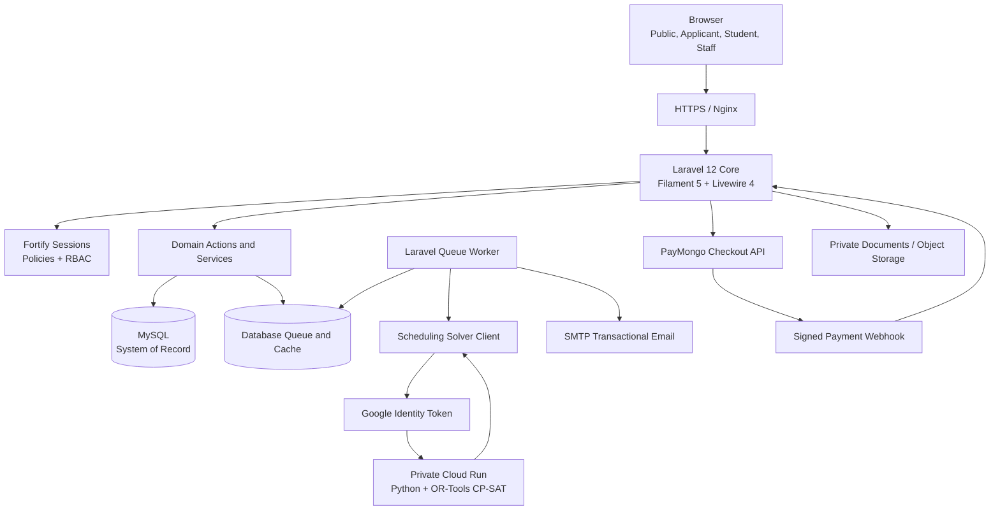
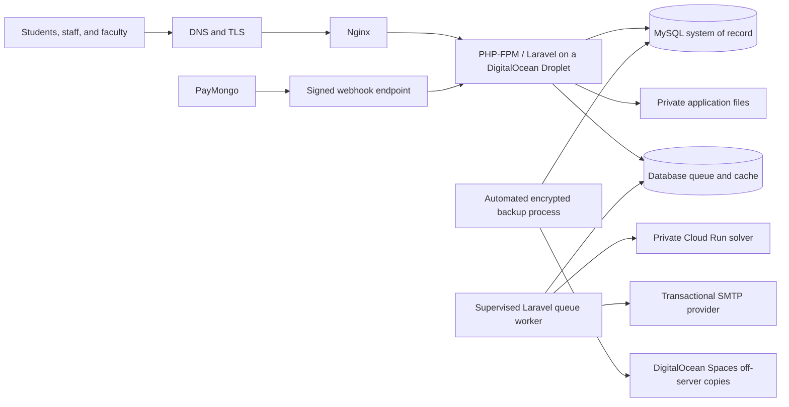

# TALA System Architecture Specification

## Table of Contents

1. [Purpose, Scope, and Evidence Basis](#1-purpose-scope-and-evidence-basis)
    - [Evidence Language](#11-evidence-language)
2. [System Responsibility and Institutional Boundary](#2-system-responsibility-and-institutional-boundary)
3. [Architectural Classification](#3-architectural-classification)
    - [Application Architecture: Domain-Organized Layered Monolith](#31-application-architecture-domain-organized-layered-monolith)
    - [System Topology: Hybrid Service-Integrated System](#32-system-topology-hybrid-service-integrated-system)
    - [Integration Style: Request/Response with Asynchronous Supporting Workflows](#33-integration-style-requestresponse-with-asynchronous-supporting-workflows)
    - [Data Architecture: Centralized Relational System of Record](#34-data-architecture-centralized-relational-system-of-record)
    - [Why This Shape Was Selected](#35-why-this-shape-was-selected)
    - [Why Microservices Were Not Selected](#36-why-microservices-were-not-selected)
4. [Logical Domain Structure](#4-logical-domain-structure)
5. [Runtime Component Architecture](#5-runtime-component-architecture)
    - [Primary Request Flow](#51-primary-request-flow)
    - [Queue Operations](#52-queue-operations)
    - [Academic Timetabling Is Not Laravel Task Scheduling](#53-academic-timetabling-is-not-laravel-task-scheduling)
6. [Data Architecture and Integrity](#6-data-architecture-and-integrity)
    - [Why MySQL Fits the Domain](#61-why-mysql-fits-the-domain)
    - [Transaction and Concurrency Rules](#62-transaction-and-concurrency-rules)
    - [Auditability](#63-auditability)
7. [User Interface Architecture](#7-user-interface-architecture)
    - [Why Filament and Livewire Were Selected](#71-why-filament-and-livewire-were-selected)
    - [Why a Separate SPA Was Not Selected](#72-why-a-separate-spa-was-not-selected)
    - [Authorization Rule](#73-authorization-rule)
    - [Browser Failure Presentation Boundary](#74-browser-failure-presentation-boundary)
8. [Security and Trust Boundaries](#8-security-and-trust-boundaries)
9. [External Integrations](#9-external-integrations)
    - [Constraint Programming–Satisfiability (CP-SAT) Scheduling Service](#91-cp-sat-scheduling-service)
    - [PayMongo](#92-paymongo)
    - [Transactional Email](#93-transactional-email)
10. [Automatic Scheduling: Research and Product Justification](#10-automatic-scheduling-research-and-product-justification)
    - [Comparison with Existing Approaches](#101-comparison-with-existing-approaches)
    - [Why OR-Tools CP-SAT Was Selected](#102-why-or-tools-cp-sat-was-selected)
11. [Dependency Architecture](#11-dependency-architecture)
    - [Active PHP Runtime](#111-active-php-runtime)
    - [Declared Packages Requiring Deliberate Disposition](#112-declared-packages-requiring-deliberate-disposition)
    - [Frontend Runtime](#113-frontend-runtime)
    - [Solver and Engineering Tooling](#114-solver-and-engineering-tooling)
    - [Compatibility and Minimum Requirements](#115-compatibility-and-minimum-requirements)
12. [Deployment and Operational Architecture](#12-deployment-and-operational-architecture)
    - [Degraded and Failure Behavior](#121-degraded-and-failure-behavior)
13. [Estimated Operating Costs in Philippine Peso](#13-estimated-operating-costs-in-philippine-peso)
    - [Pricing Basis and Assumptions](#131-pricing-basis-and-assumptions)
    - [Lean Fixed-Cost Baseline](#132-lean-fixed-cost-baseline)
    - [Operating Scenarios](#133-operating-scenarios)
    - [Variable and Conditional Charges](#134-variable-and-conditional-charges)
14. [Traditional and Commercial SIS Cost Comparison](#14-traditional-and-commercial-sis-cost-comparison)
15. [How the Client Saves Money: The Value Proposition](#15-how-the-client-saves-money-the-value-proposition)
    - [How Savings Must Be Measured](#151-how-savings-must-be-measured)
16. [SDLC and Architecture Governance](#16-sdlc-and-architecture-governance)
    - [Refined SDLC Classification](#161-refined-sdlc-classification)
    - [Evidence and Academic Integrity](#162-evidence-and-academic-integrity)
17. [Risks and Decision Summary](#17-risks-and-decision-summary)
    - [Principal Risks](#171-principal-risks)
    - [Final Architecture Decisions](#172-final-architecture-decisions)
18. [Sources and References](#18-sources-and-references)
    - [Internal System Evidence](#181-internal-system-evidence)
    - [Framework, Data, and Architecture Sources](#182-framework-data-and-architecture-sources)
    - [Timetabling and Solver Sources](#183-timetabling-and-solver-sources)
    - [Cost and Local-Market Sources](#184-cost-and-local-market-sources)
    - [SDLC Sources](#185-sdlc-sources)

## 1. Purpose, Scope, and Evidence Basis

**T.A.L.A.** (Tertiary Academic Lifecycle Administration) is a college-focused student information and academic operations system designed for Servitech Institute Asia (SIA). It provides one governed digital record across applicant intake, student handover, academic setup, scheduling, enrollment, assessment and payment evidence, official outputs, grades, learner self-service, reporting, and audit.

This specification describes TALA as an operationally complete system. It explains:

- what architectural style the system uses;
- how its components, data, users, and external services interact;
- why its framework, structure, database, dependencies, and deployment model were selected;
- how its automated academic scheduling differs from a conventional SIS and a mature university timetabling product;
- how the system behaves when a dependency is unavailable;
- what the operating-cost estimate includes and excludes; and
- how the architecture can create measurable institutional value without overstating unproven savings.

The evidence basis is the product requirements in `prd_modules/`, the UI surface blueprint, the current application and solver source, package manifests, configuration, automated tests, Laravel Boost version-specific documentation, the qualified Academico reference, and the dated external sources in Section 18.

### 1.1 Evidence Language

The following terms prevent design intent from being confused with operational proof:

- **System requirement** — behavior or infrastructure required for the completed system.
- **Implemented mechanism** — a mechanism represented in the application source and tests.
- **Configured service** — an external service for which the application has a supported configuration boundary.
- **Operational evidence** — deployment records, provider invoices, monitoring, restore tests, or institution-signed acceptance evidence.
- **Planning estimate** — a recalculable cost scenario, not a quotation, invoice, service-level agreement, or guarantee.

Vendor feature and price statements are cited as vendor-published information. They do not prove equal scope, quality, availability, or institutional fit.

---

## 2. System Responsibility and Institutional Boundary

TALA is the system of record for approved in-scope academic lifecycle records and recorded office results. It does not replace the authority of the Registrar, Accounting Office, Academic Head, Faculty, or System Super Administrator.

| Responsibility | TALA performs | Human authority retained |
| --- | --- | --- |
| Applicant intake | Captures applications, documents, review evidence, and decisions | Registrar evaluates authenticity, completeness, and eligibility |
| Student handover | Creates a controlled link from the accepted applicant to the student record | Authorized staff confirm identity and institutional admission |
| Academic setup | Stores terms, calendars, curricula, courses, offerings, rooms, and faculty eligibility | Academic and Registrar staff approve institutional rules and source records |
| Timetabling | Produces and validates candidate schedules from explicit constraints | Authorized academic staff review, correct, approve, publish, and revise |
| Enrollment | Applies recorded eligibility, capacity, schedule, and finance gates | Registrar resolves exceptions and approves official enrollment decisions |
| Finance | Computes assessments and records payment evidence and ledger results | Accounting verifies exceptions, adjustments, refunds, and manual evidence |
| Grades | Stores draft, submitted, reviewed, and released grade records | Faculty submit; authorized academic or Registrar staff return or release |
| Official outputs | Generates COR, SOA, schedules, and authorized reports from approved records | The owning office controls issuance and correction |
| Audit and reporting | Records material actions and produces role-scoped operational views | Institutional policy determines review, retention, and response |

External providers supply computation, communication, or payment evidence. They never become the authoritative academic or financial record.

---

## 3. Architectural Classification

TALA is best described across four complementary architectural dimensions.

### 3.1 Application Architecture: Domain-Organized Layered Monolith

The Laravel core is one deployable application with one configuration surface and one relational database. Its source is organized by institutional domain and technical responsibility:

- Filament pages and resources provide role-scoped presentation;
- actions and services coordinate application use cases;
- models and policies represent data, relationships, state, and authorization;
- jobs and notifications handle durable asynchronous work; and
- integration clients isolate external provider contracts.

This is a **domain-organized layered monolith**, not a strict modular monolith. Logical domains are visible in namespaces and service boundaries, but the application does not enforce independently deployable modules, isolated schemas, or package-level module APIs.

### 3.2 System Topology: Hybrid Service-Integrated System

The completed system combines:

1. the Laravel/MySQL core;
2. a separately deployable Python CP-SAT scheduling service;
3. PayMongo for external payment acceptance and signed event evidence; and
4. an SMTP provider for transactional email.

The solver is separated because optimization has a different CPU, memory, runtime, and deployment profile from ordinary SIS requests. Payments and email remain external because TALA should not implement card processing, e-wallet networks, or mail delivery infrastructure.

### 3.3 Integration Style: Request/Response with Asynchronous Supporting Workflows

Most user actions use ordinary browser-to-Laravel request/response processing and database transactions. Slow or externally triggered work uses queues and webhooks:

- schedule-solver dispatch is queued;
- payment webhook processing is queued;
- schedule release and revision messages are queued; and
- provider failures are recorded for controlled retry or review.

TALA is therefore not primarily event-driven. Queues, notifications, and framework events are supporting execution patterns inside a transaction-centered application.

### 3.4 Data Architecture: Centralized Relational System of Record

MySQL stores institutional source records, workflow state, ledgers, candidate and published schedule records, audit evidence, and queue/cache tables. Downstream views such as the Student Hub, COR, SOA, and staff reports read from approved records in this shared relational source.

### 3.5 Why This Shape Was Selected

| Decision | Selected design | Main benefit | Accepted tradeoff |
| --- | --- | --- | --- |
| Core deployment | One Laravel application | Simple deployment, shared authorization, and atomic cross-domain transactions | A core application failure affects all workspaces |
| Domain organization | Actions, services, policies, and domain-oriented folders | Keeps business rules discoverable without distributed-system overhead | Boundaries require convention and review rather than independent deployment enforcement |
| Data ownership | One MySQL system of record | Referential integrity and consistent official outputs | Database availability is a central dependency |
| Long-running work | Database-backed queues | Durable asynchronous processing without a separate queue service at initial scale | Queue traffic competes with application database capacity |
| Optimization | Separate CP-SAT container | Isolates compute-heavy scheduling from web and database workloads | Adds a network and cloud-service dependency |
| User interface | Server-driven Filament/Livewire panels | Reuses PHP validation, policies, sessions, and domain services | Less client-side independence than a separate SPA |

### 3.6 Why Microservices Were Not Selected

Admissions, academic setup, scheduling, enrollment, finance, grades, and official outputs share tightly related records and institutional transactions. Splitting each domain into a network service would introduce API versioning, distributed authorization, data duplication, service discovery, observability, and cross-service consistency work without evidence that SIA requires independent scaling or release cycles.

The selected design preserves a service boundary only where the runtime characteristics are materially different: the CP-SAT optimizer. This is a purposeful boundary, not a partial migration to microservices.

---

## 4. Logical Domain Structure

| Domain | Principal records and responsibilities | Important consumers |
| --- | --- | --- |
| Platform foundation | Users, roles, permissions, settings, audit and operational events | Every authenticated workspace |
| Identity and access | Login, verification, password recovery, panel access, policy enforcement | Applicants, students, staff |
| Admissions and handover | Applications, requirements, document evidence, decisions, student creation | Registrar, Applicant Workspace, Student Hub |
| Academic setup | Terms, calendars, programs, curricula, courses, components, rooms, faculty eligibility | Scheduling, enrollment, grades, reports |
| Term offerings | Offered subjects, sections, delivery groups, capacity, faculty and room requirements | Scheduling and enrollment |
| Scheduling | Demand snapshots, solver runs, candidates, validation, approval, publication, revision | Registrar, Academic Head, Faculty, Student Hub, COR |
| Enrollment | Enrollment records, subject registrations, gates, exceptions, roster membership | Registrar, Accounting, Faculty, Student Hub |
| Finance and ledger | Fee rules, assessments, payment attempts/evidence, payments, ledger entries | Accounting, Enrollment Gate, SOA, Student Hub |
| Grades and lifecycle | Grade rosters, entries, review/release states, lifecycle and completion results | Faculty, Registrar, Student Hub, reports |
| Learner workspaces | Applicant progress, student schedule, COR/SOA, grades, requests, notices | Applicants and students |
| Outputs, reports, and audit | Authorized exports, access logs, operational reports, activity history | Office owners and System Super Administrator |

Domain rules belong in actions, services, policies, and models. Filament resources and pages orchestrate user interaction but are not the sole location of business rules. This keeps the same institutional rule reusable across staff actions, learner projections, jobs, commands, and tests.

---

## 5. Runtime Component Architecture



### 5.1 Primary Request Flow

1. The user enters through the public site or an authenticated Filament panel.
2. Laravel authenticates the session and authorizes both panel access and the requested record/action.
3. The relevant action or service validates the institutional rule.
4. Related writes are committed in a database transaction.
5. Slow external work is dispatched only after the authoritative local state is recorded.
6. Learner and staff projections read from approved records rather than directly from provider responses.

### 5.2 Queue Operations

The database queue is appropriate while workload remains within the capacity of the primary database. The solver job owns a 360-second job timeout, while the database queue's `retry_after` is 420 seconds so a running job is not made available to a second worker prematurely. Solver attempts and backoff are bounded and failures are recorded as operational evidence.

A production process supervisor must keep the queue worker running and restart it after failure or deployment. Redis and Laravel Horizon are an upgrade path when measured queue throughput, latency, or operations visibility justifies a dedicated queue/cache service; they are not prerequisites for the selected baseline.

### 5.3 Academic Timetabling Is Not Laravel Task Scheduling

Laravel's task scheduler is a cron replacement for executing commands at particular times. TALA's academic scheduler is an optimization model that assigns academic demands to faculty, rooms, days, and time blocks subject to constraints. They solve different problems:

| Term | Meaning in TALA |
| --- | --- |
| Laravel task scheduling | Infrastructure for running recurring commands; not the timetable generator |
| Queue scheduling | Delayed or retried processing of jobs |
| Academic timetabling | CP-SAT constraint optimization producing candidate class meetings |
| Student scheduling/sectioning | Assignment of individual students to already timetabled sections; outside TALA's optimizer scope |

---

## 6. Data Architecture and Integrity

### 6.1 Why MySQL Fits the Domain

TALA records are strongly relational: a student belongs to a program and curriculum; sections belong to term offerings; enrollments connect students to sections; published meetings depend on offerings, faculty, rooms, and schedules; assessments and ledger entries depend on recorded academic and finance events.

MySQL was selected because it provides:

- foreign keys and unique constraints for referential integrity;
- transactions for multi-record institutional actions;
- row locking for concurrent enrollment, finance, and publication operations;
- `DECIMAL` storage for Philippine peso values;
- indexed relational queries for rosters, ledgers, curricula, reports, and official outputs; and
- direct, mature Laravel and Eloquent support.

MongoDB can support transactions, but its document model would not remove the need to model these relationships and institutional constraints. TALA's workload benefits more from relational integrity and joins than from schema-flexible aggregate documents. Selecting MySQL is therefore a domain-fit decision, not a claim that document databases lack transactional capability.

### 6.2 Transaction and Concurrency Rules

- Assessment and ledger postings commit atomically.
- Enrollment and capacity-sensitive actions use transactions and appropriate row locks.
- Schedule publication validates candidate ownership, revision state, and downstream impact before replacing official meetings.
- Payment webhooks use provider identifiers and idempotency checks so duplicate delivery cannot post the same payment twice.
- External calls do not silently convert an unverified provider response into an official academic or finance record.

### 6.3 Auditability

Material changes retain actor, timestamp, affected record, and relevant before/after or operational context. Audit records support review; they do not replace database backups, security monitoring, or institution-approved records-retention policy.

---

## 7. User Interface Architecture

TALA uses two deliberately different presentation surfaces:

1. an isolated Blade/Bootstrap public landing page; and
2. server-driven Filament/Livewire workspaces for applicants, students, and staff.

### 7.1 Why Filament and Livewire Were Selected

Institutional workspaces are dominated by authenticated tables, forms, filters, actions, status transitions, and record-level permissions. Filament and Livewire allow these surfaces to share:

- Laravel validation and authorization;
- Eloquent relationships and transactions;
- server-managed session cookies and CSRF protection;
- domain actions and policy checks;
- consistent tables, forms, notifications, and responsive layouts; and
- one PHP-centered implementation model for the capstone team.

### 7.2 Why a Separate SPA Was Not Selected

A React or Vue SPA would be valid if TALA required an independently deployed frontend, public third-party API, extensive offline behavior, or highly client-driven interaction. It would also require a stable API contract, separate client state, duplicated validation concerns, and an additional release surface.

The selected server-driven UI reduces those boundaries. It is not inherently more secure or faster than every SPA; its advantage is architectural fit and a smaller coordination surface for TALA's form- and workflow-heavy operations.

### 7.3 Authorization Rule

Navigation visibility is a usability control, not authorization. Panel access, resource operations, custom pages, actions, queries, downloads, and output access must be protected by policies or explicit authorization. Filament rechecks authorization during Livewire requests, while TALA's actions and services still enforce domain-specific rules.

### 7.4 Browser Failure Presentation Boundary

Laravel's exception pipeline remains the response authority. TALA supplies status-specific Blade views for `403`, `404`, `419`, `429`, `500`, and `503`, together with `4xx` and `5xx` fallbacks. The templates share one dependency-light layout and static stylesheet so a failure page does not depend on the Vite or Livewire runtime that may itself be unavailable. They state what happened and the safe next action without rendering exception details.

This is a presentation boundary, not a global exception transformation. Laravel content negotiation continues to produce JSON for API or JSON-expecting requests, Livewire retains its framework response lifecycle, and domain validation remains on the relevant Filament form or action. The browser pages do not change status codes, authorization, sessions, transactions, logging, or retry policy.

---

## 8. Security and Trust Boundaries

| Boundary | Control |
| --- | --- |
| Browser to Laravel | HTTPS, session authentication, CSRF protection, validation, rate limiting where appropriate |
| User to panel | Panel-access rules and role/permission checks |
| User to record/action | Laravel policies and action-level authorization |
| Laravel to MySQL | Private credentials, least-privilege database account, transactions, and constrained schema |
| Laravel to Cloud Run | HTTPS and audience-bound Google identity token; private service invocation |
| PayMongo to Laravel | Signature verification, provider-event persistence, idempotent queued processing |
| Laravel to SMTP | Provider credentials stored outside source control; queued delivery and failure evidence |
| Documents and exports | Private-by-default storage, authorized retrieval, logged output access |

Secrets must be injected through protected runtime configuration and must never be committed, rendered in administrative diagnostics, or included in logs. Integration status pages may report whether a credential is configured but must not reveal its value.

TALA supports institutional compliance work through access control, audit, retention-aware records, and privacy-oriented boundaries. Compliance with the Philippine Data Privacy Act remains an organizational responsibility involving policy, lawful processing, security operations, staff practice, and data-subject procedures; a software feature list alone cannot establish compliance.

---

## 9. External Integrations

### 9.1 CP-SAT Scheduling Service

The scheduling service is a Python 3.12 container running Flask behind Gunicorn and Google OR-Tools CP-SAT. The private Cloud Run deployment accepts a versioned JSON snapshot and returns structured solver results.

In this boundary, a **Scheduling Demand** is one required course component for one cohort, the **snapshot** is the immutable request captured by Laravel, and a **candidate schedule** is an untrusted proposal awaiting Laravel validation and human review. `feasible` means every hard scheduling rule passes but optimality was not proved within the search limit; `optimal` additionally proves that no better objective value exists for the tested model. The objective and relative optimality gap are solution-quality evidence, not an accuracy score.

#### Controlled Scheduling Flow

1. TALA assembles an immutable snapshot from approved terms, offerings, generated scheduling demands, eligible faculty, rooms, availability, existing commitments, calendar blocks, and constraint profile.
2. A queued Laravel job sends the snapshot to the private solver service.
3. CP-SAT validates the contract and attempts an assignment.
4. The service returns `optimal`, `feasible`, `infeasible`, `model_invalid`, or `unknown` with assignments and diagnostics.
5. Laravel validates every returned assignment against the saved snapshot and current institutional invariants.
6. Authorized staff review and, where allowed, correct candidates.
7. Approval and publication create official section meetings.
8. Faculty schedules, Student Hub schedules, COR views, and related outputs read only from published meetings.

#### Implemented Hard Constraints

- assign every ready scheduling demand exactly once;
- prevent faculty overlap;
- prevent room overlap;
- prevent logical-cohort overlap across course-specific delivery-group records;
- respect fixed assignments;
- respect calendar blocks;
- respect room capacity, type, and required features; and
- respect faculty qualification and load.

#### Implemented Soft Objectives

- prefer earlier time blocks;
- reduce faculty idle gaps;
- balance faculty load; and
- use rooms efficiently.

The `balanced_v1` profile uses fixed equal weights. Staff do not freely tune the objective in the completed baseline, which protects repeatability and avoids presenting arbitrary preference weights as institutional policy.

#### Scheduling Limitations

- Each generated scheduling demand represents one contiguous meeting block.
- TALA must prepare valid demand decomposition before optimization.
- The solver does not repair incomplete curricula, rooms, qualifications, or calendar data.
- It does not perform exam timetabling, event management, or individual student sectioning.
- `feasible` does not mean mathematically optimal.
- `unknown` means the solver stopped without proving feasibility or infeasibility within its limit.
- The solver never publishes directly and cannot override institutional approval.

### 9.2 PayMongo

TALA creates a checkout session only from an authoritative local assessment or payable item. The browser redirect is informational; it is not payment proof. A signed PayMongo webhook is persisted and processed idempotently before TALA records verified payment evidence and posts the corresponding ledger result.

PayMongo is selected because it provides locally relevant payment channels without TALA storing card or wallet credentials. The tradeoffs are transaction fees, provider availability, settlement rules, account verification, webhook operations, and vendor contract dependence.

### 9.3 Transactional Email

SMTP carries verification, recovery, schedule, finance, and workflow messages. Email is a communication channel, not the source of truth. A failed email must not roll back an already valid institutional decision; it remains queued or recorded for operational follow-up.

---

## 10. Automatic Scheduling: Research and Product Justification

University course timetabling is a constrained optimization problem, commonly described in research as the university course timetabling problem (UCTP). “UTC” is not one standardized product against which TALA can be compared. For a defensible comparison, TALA distinguishes the UCTP research problem from products such as UniTime and from conventional SIS implementations that primarily record or display schedules.

Research and product basis: [OR-Tools constraint optimization](https://developers.google.com/optimization/cp/), [UniTime course timetabling](https://help.unitime.org/course-timetabling), and [Gu, Li, and Chen's 2025 UCTP review](https://doi.org/10.3390/computation13010010).

### 10.1 Comparison with Existing Approaches

| Dimension | TALA | UniTime | Conventional SIS / qualified Academico reference |
| --- | --- | --- | --- |
| Primary scope | Integrated institutional SIS with controlled course-timetable generation | Comprehensive academic scheduling platform | Institutional record management; scheduling commonly centers on encoded course times and events |
| Optimization scope | Section meeting assignment for rooms, faculty, delivery groups, availability, and fixed institutional constraints | Course and examination timetabling, student sectioning, event management, and related scheduling functions | Product-dependent; an optimizer must not be assumed merely because schedule records exist |
| Input ownership | Approved TALA records are snapshotted and versioned before generation | UniTime's own scheduling model and integrations | SIS records and administrator input |
| Output control | Solver returns candidates; Laravel revalidates; authorized staff review, approve, and publish | Scheduling workflows are managed within UniTime | Staff encode, import, or generate records according to product capability |
| Downstream effect | Published meetings directly drive faculty, student, COR, room, and operational views | UniTime can integrate with external student-information systems | Schedule data is displayed or exported within the system's available modules |
| Institutional fit | Narrow, locally governed baseline designed around TALA's own academic and administrative rules | Broader mature scheduling platform with greater implementation and integration scope | Broadly configurable commercial or institutional workflow |

TALA's defensible contribution is not a claim that it invented CP-SAT, solved UCTP in general, or is algorithmically superior to mature timetabling systems. Its contribution is the governed integration of optimization into one institutional record:

- the exact approved inputs are preserved as an immutable scheduling snapshot;
- hard constraints and objective policy are explicit and versioned;
- solver output is treated as a candidate, not automatically as institutional truth;
- Laravel independently validates returned assignments;
- a human approval gate controls publication;
- published meetings become the single source for student, faculty, room, and document projections; and
- attempts, diagnostics, overrides, approvals, publication, and output access leave operational evidence.

This narrower boundary is beneficial when the institution needs an integrated SIS and an explainable timetable workflow without adopting a separate enterprise scheduling platform. It is also an honest limitation: institutions needing examination scheduling, individual student sectioning, or large-scale multi-campus optimization may require a broader product or a later extension.

### 10.2 Why OR-Tools CP-SAT Was Selected

| Approach | Decision and justification |
| --- | --- |
| Google OR-Tools CP-SAT | Selected. It is open source, suited to integer and Boolean constraint models, supports hard constraints and weighted objectives, returns useful statuses, and can run in a separately scalable container. |
| IBM CPLEX or Gurobi | Technically capable commercial alternatives. They were not selected for the baseline because license terms and recurring cost would weaken the low-cost deployment objective, while TALA's present model does not establish a need for their commercial feature sets. |
| Genetic algorithms, simulated annealing, or other metaheuristics | Useful research alternatives, especially for very large or specialized formulations. They were not selected because constraint satisfaction, infeasibility behavior, and repeatable validation are more direct in the present CP-SAT model. |
| Fully manual scheduling | Retained only as controlled correction and contingency. It has low software complexity but high staff effort, inconsistency risk, and limited ability to check many interacting constraints at once. |
| Adopt UniTime as the scheduling core | A credible option for institutions needing UniTime's broader scheduling scope. It was not selected because TALA requires a bounded, native workflow tied directly to its own academic, finance, access, and publication rules. |

Recent UCTP literature shows that exact solvers, commercial mathematical programming tools, constraint programming, metaheuristics, and hybrids are all used. That evidence supports CP-SAT as a reasonable engineering choice; it does not prove that TALA's current formulation outperforms other algorithms. Such a claim would require a disclosed benchmark dataset, common constraints, repeated runs, hardware and time limits, solution-quality measures, and statistical analysis.

---

## 11. Dependency Architecture

Versions in this section were verified from the installed dependency graph on **Tuesday, July 14, 2026 (Philippine Time)**. A dependency is justified only when its active responsibility is clear; presence in a manifest does not prove architectural use.

### 11.1 Active PHP Runtime

| Dependency | Verified version | Architectural responsibility and benefit |
| --- | ---: | --- |
| PHP | 8.2 | Supported runtime for the selected Laravel ecosystem |
| Laravel Framework | 12.63.0 | HTTP lifecycle, routing, validation, ORM, transactions, queues, policies, notifications, storage, and testing conventions |
| Filament | 5.6.7 | Role-oriented administrative workspaces built from server-defined resources and actions |
| Livewire | 4.3.1 | Stateful, reactive server-driven interactions without a separate SPA/API application |
| Laravel Fortify | 1.37.2 | Headless authentication actions including login, recovery, verification, and two-factor foundations |
| Caresome Filament Auth Designer | 3.1.0 | Presentation layer for branded Filament authentication pages; it does not replace the authentication authority |
| Spatie Laravel Permission | 6.25.0 | Persisted roles and permissions integrated with Laravel authorization |
| Spatie Activitylog | 4.12.3 | Auditable model and workflow activity where explicitly configured |
| Google Auth | 1.52.0 | Service-account credentials and identity-token creation for authenticated Cloud Run invocation |
| TallStackUI | 3.0.0 | Limited reusable presentation components where TALA has deliberately adopted them |

Laravel, Filament, and Livewire are selected together because TALA is a form-, table-, policy-, and workflow-heavy institutional application. They keep UI behavior, validation, authorization, and transactions in one PHP system. A separate JavaScript SPA would add an API contract, duplicated validation and authorization concerns, client-state complexity, and another deployment surface without a demonstrated baseline requirement for disconnected clients or independent frontend teams.

### 11.2 Declared Packages Requiring Deliberate Disposition

| Declared package | Verified version | Current architectural interpretation |
| --- | ---: | --- |
| Laravel MCP | 0.8.2 | Available to expose governed AI tools or resources, but it is not a production integration boundary while its application route is disabled. |
| Laravel Tinker | 2.11.1 | Developer diagnostic utility, not a production subsystem. |
| chillerlan/php-qrcode | 5.0.5 | Declared, but no active application reference establishes a current production responsibility. |
| Spatie Model States | 2.12.1 | Declared, but no active application reference establishes state-machine ownership. |

These packages must be either connected to an approved responsibility or considered for removal in a separate dependency review. Keeping unused runtime packages increases upgrade work and supply-chain exposure. Removal is intentionally not performed as part of this architecture document.

The PayMongo transport and signed webhook pipeline are application-owned. Previously declared Luigel PayMongo and Spatie Webhook Client dependencies were removed after live-reference and dependency audits proved that neither package owned an active runtime responsibility.

### 11.3 Frontend Runtime

| Dependency | Verified version | Architectural responsibility |
| --- | ---: | --- |
| Tailwind CSS | 4.1.18 | Utility-based styling and responsive layout, including Filament-aligned styling |
| `@tailwindcss/vite` | 4.1.18 | Tailwind compilation through Vite |
| Vite | 7.3.6 | Asset bundling and development build pipeline |
| Laravel Vite Plugin | 2.1.0 | Laravel-aware asset entry points and development integration |
| Alpine.js | 3.15.10 | Declared client-side interaction dependency; Filament/Livewire also provide their expected runtime behavior |
| Axios | 1.16.1 | Present in the default bootstrap layer, but not an architectural API client while the application entry point does not load that layer |
| Bootstrap assets | local landing-page assets | Isolated public-facing landing presentation, not the administrative component system |

Driver.js 1.4.0 and the npm Heroicons package 2.2.0 are declared but have no active application import establishing a current production responsibility. Filament's PHP icon abstractions are the active administrative icon surface.

### 11.4 Solver and Engineering Tooling

The scheduling container uses Python 3.12 slim, Google OR-Tools 9.15.6755, Flask 3.1.3, and Gunicorn 26. Flask provides a small HTTP contract, Gunicorn provides the production process boundary, and OR-Tools owns optimization. The separation prevents Python solver dependencies from expanding the PHP web runtime.

| Engineering dependency | Verified version | Responsibility |
| --- | ---: | --- |
| Laravel Boost | 2.4.12 | Version-aware application inspection and framework-documentation retrieval for AI-assisted development |
| PHPUnit | 11.5.55 | Automated unit and feature behavior checks |
| Larastan | 3.10.0 | Laravel-aware static analysis |
| Laravel Pint | 1.29.1 | Consistent PHP formatting |
| Laravel Pail | 1.2.7 | Local log inspection |
| Laravel Sail | 1.62.0 | Containerized local-development option |
| FakerPHP | 1.24.1 | Deterministic-shape test data generation through factories |
| Mockery | 1.6.12 | Test doubles where an isolated collaborator is appropriate |
| Collision | 8.9.4 | Readable command-line errors and test output |
| Concurrently | 9.2.3 | Coordinates the local web, queue, log, and asset-development processes |

These are engineering controls, not user-facing production modules.

### 11.5 Compatibility and Minimum Requirements

The minimum requirements for TALA are not determined by Laravel alone. They are derived in the following order:

1. the product requirement identifies which users, workflows, devices, and institutional conditions must be served;
2. the strictest active client or server dependency establishes a theoretical technical floor;
3. application code and enabled framework features may raise that floor; and
4. TALA-specific browser, device, and load tests determine what the project may honestly claim as supported.

A dependency floor means that older software is outside the supported design. It does not prove that every TALA workflow works on every device above that floor. Conversely, a selected deployment size is an initial operating baseline, not a guaranteed minimum capacity. These distinctions prevent framework documentation, project policy, and measured system evidence from being presented as if they were interchangeable.

#### Browser compatibility basis

Tailwind CSS 4 is the controlling general browser dependency for TALA's authenticated workspaces. Its core requires Chrome 111, Safari 16.4, or Firefox 128. Vite 7's default production targets are lower than those limits, while the isolated Bootstrap landing page supports a broader range. The system-wide floor therefore follows Tailwind rather than allowing a user to reach the public page and then encounter an unsupported authenticated workspace.

| Browser family | Technical floor or TALA qualification baseline | Status and rationale |
| --- | ---: | --- |
| Google Chrome | 111 or later | Dependency-derived floor from Tailwind CSS 4 |
| Microsoft Edge | 111 or later | TALA qualification baseline aligned with Chromium 111; direct TALA testing is still required because Tailwind names Chrome rather than Edge |
| Mozilla Firefox | 128 or later | Dependency-derived floor from Tailwind CSS 4 |
| Apple Safari | 16.4 or later | Dependency-derived floor from Tailwind CSS 4 |
| Internet Explorer | Not supported | Does not satisfy the active frontend dependency floor |
| Other browsers, embedded webviews, and proxy or mini browsers | Not claimed | May work, but require explicit qualification before being described as supported |

For operational support, TALA should qualify the current stable and immediately preceding major releases of Chrome, Edge, Firefox, and Safari available on vendor-supported operating systems, never below the technical floors above. Browser security updates remain the responsibility of the institution and user; a browser meeting only the historical floor but no longer receiving vendor security support is not an acceptable managed-client baseline.

On phones and tablets, compatibility follows the browser engine rather than a separately invented device specification: Android access requires a qualifying Chrome release, while iPhone and iPad access requires a qualifying Safari release on a vendor-supported operating system. Embedded in-app browsers and unmanaged webviews remain outside the support claim until tested.

As of **Tuesday, July 14, 2026, Philippine Time**, targeted source inspection found no active `wire:transition`, Livewire scoped component styles, service worker, or web-app manifest that raises the current floor or establishes offline capability. Introducing any of those features, or upgrading Tailwind, Vite, Filament, Livewire, Alpine.js, or Bootstrap, requires this matrix to be reassessed.

#### End-user device and browser requirements

| Requirement | Minimum supported condition | Basis |
| --- | --- | --- |
| Browser execution | A qualified browser above with JavaScript enabled | Filament, Livewire, Alpine.js, and interactive validation/actions require client-side JavaScript |
| Session capability | First-party cookies enabled | Laravel session authentication and CSRF protection depend on the browser returning the session cookie |
| Network | Stable HTTPS connectivity while using TALA | TALA is centralized and not offline-first; no arbitrary Mbps claim is made without measured payload and latency tests |
| Files | Browser file selection, upload, and download support where the user's workflow requires documents | Applicant, records, and output workflows exchange files through authenticated server requests |
| Printing | Browser print and save-as-PDF capability | COR, SOA, billing slip, and payment acknowledgement use authenticated HTML/CSS print views in the MVP |
| Device hardware | Any device capable of running a qualified browser and the required workflow | A fixed end-user CPU or RAM value is not justified by the framework and must not be invented without device testing |

Responsive support is role- and workflow-specific. The following dimensions are **qualification targets**, not yet proof that every screen has passed compatibility review:

| User surface | Required qualification viewport | Intended use |
| --- | ---: | --- |
| Public, applicant, and student-facing workflows | 360 × 800 CSS pixels or larger | Modern phone access, including mobile display of the digital billing slip |
| Learner-facing and selected review workflows | 768 × 1024 CSS pixels or larger | Tablet access and intermediate responsive layout |
| Registrar, finance, administrator, reporting, and timetabling workspaces | 1366 × 768 CSS pixels or larger | Desktop operational baseline for dense forms, tables, comparisons, and scheduling controls |

Mobile-responsive styling does not by itself prove mobile usability. Before publication or production acceptance, representative users must complete the relevant workflows at the target sizes without hidden actions, inaccessible controls, unreadable tables, or dependence on hover-only behavior. A learner-facing mobile commitment does not automatically make every staff administration surface a phone-supported workflow.

#### Production runtime and capacity baseline

| Layer | Required runtime or selected baseline | Evidence classification |
| --- | --- | --- |
| PHP application | PHP 8.2 or later with Ctype, cURL, DOM, Fileinfo, Filter, Hash, Mbstring, OpenSSL, PCRE, PDO, Session, Tokenizer, and XML extensions | Laravel 12 framework minimum |
| Operating system and web server | Supported 64-bit Linux environment with Nginx and PHP-FPM, or a documented equivalent; only the Laravel `public/` directory is web-accessible | TALA deployment design and Laravel security requirement |
| Database | MySQL 8.4 baseline with InnoDB, transactional storage, and tested migrations | Project-selected and documented database baseline, not merely Laravel's lowest theoretical database version |
| Stateful infrastructure | Database-backed session, queue, and cache tables; private writable application storage; writable `storage/` and `bootstrap/cache` directories | Current application configuration and Laravel runtime requirement |
| Long-running work | A supervised queue worker for the `scheduling` and `default` queues, with deployment-safe restart and monitoring | Current asynchronous execution contract |
| Initial web host | 1 vCPU, 2 GiB RAM, 50 GiB SSD, and 2,000 GiB transfer | Selected DigitalOcean starting topology; not a load-tested universal minimum |
| Scheduling service | Python 3.12 container. Current serving revision: 2 vCPU, 4 GiB, concurrency 1, two solver workers, 300-second request timeout, and 30-second client-production solver limit | TAL-96B4 corrected live Cloud Run state and dated empirical evidence: 10/10 Profile B client-scale comparison runs plus tagged and post-promotion Laravel acceptance; larger research workloads require separately disclosed 120/240-second profiles |
| Network and trust | Valid TLS, DNS, firewall controls, private credentials, and outbound HTTPS/SMTP access for approved integrations | Security and integration requirement |

For the scheduling row, a **solver worker** is one CP-SAT search thread inside a request, while **concurrency 1** means one HTTP solver request at a time per Cloud Run instance. The two settings are not interchangeable. The 300-second value is the complete HTTP request limit; the 30-second value is the current production search budget. vCPU is virtual processor allocation and GiB is memory allocation in gibibytes.

The 2 GiB web host co-locates Nginx, PHP-FPM, Laravel, MySQL, and an initial queue worker. It is therefore the lowest selected production scenario in this specification, but its sufficiency must be established against expected concurrent users, database size, document-upload volume, queue depth, response-time objectives, and backup activity. Sustained memory pressure, swapping, disk pressure, slow database queries, queue delay, or missed response objectives must trigger resizing or separation of the database and workers. Node.js and Python are not required on the web host when frontend assets are prebuilt and the solver remains externally deployed.

#### Development and build requirements

| Tool or service | Minimum or project baseline | Why it is required |
| --- | --- | --- |
| PHP | 8.2 or later | Matches Laravel 12 and the Composer platform contract |
| Composer | Current supported Composer 2 release | Installs and validates PHP dependencies |
| Node.js | `^20.19.0` or `>=22.12.0` | Exact installed Vite 7 engine requirement; this excludes Node 21 and Node 22.0–22.11 rather than implying that every intermediate release is compatible |
| npm | A release supported by the selected Node.js version | Installs and builds the locked frontend dependency graph |
| MySQL | 8.4 project baseline | Matches the documented data-platform target for migrations and tests |
| Python | 3.12 with the pinned solver requirements | Required only when developing or testing the external scheduling service locally |
| Supported browsers | The qualification matrix above | Required for visual, interaction, print, upload, and responsive verification |
| Docker or Laravel Sail | Optional | Reproducible local environment option, not a mandatory production dependency |

The development operating system is not fixed by the architecture. Windows and supported Linux environments are acceptable when they can run the required versions and reproduce the same application, database, asset-build, test, and solver contracts.

#### Compatibility and capacity verification rule

The browser support statement must be backed by recorded manual or automated real-browser evidence for critical flows, including public navigation, authentication and session behavior, applicant document handling, student finance and printable outputs, Filament tables/forms/modals, staff authorization failures, and scheduling submission and result review. PHPUnit component and feature tests remain necessary but do not prove browser layout, JavaScript interaction, printing, or viewport usability. Any automated browser-test dependency requires its own approved dependency change; until then, a dated manual compatibility matrix is acceptable evidence.

Production sizing must similarly be qualified with realistic data and concurrency rather than inferred from a successful local run. The institution must record the tested dataset, concurrent-user model, request mix, queue workload, solver invocation pattern, response-time objective, error rate, and resource measurements. Compatibility and sizing evidence must be refreshed before production acceptance and after a material dependency, topology, or workload change.

---

## 12. Deployment and Operational Architecture



A single 2 GiB Droplet is a lean starting topology, not a highly available one. Nginx terminates web traffic, PHP-FPM runs Laravel, MySQL holds authoritative data, and a supervised queue worker processes asynchronous work. This design minimizes fixed cost and operational surfaces for the initial institutional scale, but the application and database share a failure domain.

The minimum production operating controls are:

- automated Droplet backups;
- automated, encrypted, off-server MySQL dumps with stated retention;
- documented and tested restore procedures;
- TLS renewal, host patching, least-privilege credentials, and firewall controls;
- queue, disk, database, HTTP, and solver-integration monitoring;
- log rotation and alerting;
- recovery ownership and escalation procedures; and
- a measured trigger for resizing the Droplet or separating the database and workers.

DigitalOcean Spaces is object storage, not a complete backup system. TALA's operations process must create a consistent export, encrypt it, transfer it, retain versions, monitor failures, and regularly prove restoration. Cloud Run is selected for the solver because optimization is intermittent and independently resource-intensive; it can scale separately from PHP. The tradeoffs are cold-start latency, usage-based cost, provider dependence, identity configuration, and the need for retry-safe requests.

### 12.1 Degraded and Failure Behavior

| Unavailable component | Required safe behavior |
| --- | --- |
| Cloud Run solver | A generation attempt fails visibly and may be retried; already published schedules remain authoritative and available. Authorized staff retain controlled manual scheduling as continuity. |
| Queue worker | Queued solver, webhook, and email work waits durably while ordinary synchronous pages continue where safe. Monitoring alerts operations, and the worker can be restarted without duplicating idempotent effects. |
| PayMongo | New hosted checkout or confirmation may be unavailable. TALA must not infer payment from a redirect; verified prior records remain intact, and controlled manual evidence procedures provide continuity. |
| SMTP provider | The underlying institutional transaction remains valid. Delivery is retried or recorded as failed for operational follow-up. |
| Droplet or MySQL | Web workspaces are unavailable. Recovery uses infrastructure backup and the latest valid off-server database copy according to the recovery procedure. |
| Spaces | The application may continue temporarily, but off-server backup transfer and any objects served from that store are impaired; operations must restore redundancy promptly. |

TALA is a centralized web system, not an offline-first application. Loss of campus internet, the application host, or the primary database therefore requires institutional contingency procedures. The system must never portray cached, redirected, emailed, or solver-produced information as authoritative when the corresponding server-side transaction was not completed.

---

## 13. Estimated Operating Costs in Philippine Peso

### 13.1 Pricing Basis and Assumptions

This estimate is a procurement snapshot **as of Tuesday, July 14, 2026, Philippine Time**. USD prices are converted at **US$1 = ₱61.55**, the reference rate in the latest independently retrieved Bangko Sentral ng Pilipinas bulletin used for this revision, dated July 3, 2026. The exchange rate is an estimate input, not a guaranteed bank or card settlement rate.

Exchange-rate source: [Bangko Sentral ng Pilipinas, Financial Markets Reference Exchange Rate Bulletin, July 3, 2026](https://www.bsp.gov.ph/Lists/RERB/Attachments/2306/03Jul2026.pdf).

The baseline assumes one production institution, one 2 GiB DigitalOcean Basic Droplet, weekly automated Droplet backup, one DigitalOcean Spaces subscription for off-server copies, an eligible `.edu.ph` domain renewed through PHNET, database-backed queue/cache, a transactional-email free allowance that is sufficient for measured use, and Cloud Run use within available allowance. Taxes, payment-processor fees, overages, and foreign-exchange spreads are added when incurred.

### 13.2 Lean Fixed-Cost Baseline

| Cost item | Published basis | Estimated monthly PHP | Estimated annual PHP | Why it is included |
| --- | ---: | ---: | ---: | --- |
| DigitalOcean Basic Droplet, 2 GiB | US$12/month | ₱738.60 | ₱8,863.20 | Hosts Nginx, PHP-FPM, Laravel, MySQL, and the initial queue worker |
| Weekly Droplet backup | 20% of Droplet price = US$2.40/month | ₱147.72 | ₱1,772.64 | Provides infrastructure-level recovery points |
| DigitalOcean Spaces | US$5/month | ₱307.75 | ₱3,693.00 | Holds off-server backup copies and object-storage needs within allowance |
| `.edu.ph` domain | ₱2,500/year | ₱208.33 monthly equivalent | ₱2,500.00 | Provides the institution's eligible Philippine education namespace |
| **Lean fixed-cost total** |  | **₱1,402.40** | **₱16,828.84** | Fixed infrastructure and domain baseline |

The monthly total is the annual total divided by 12 and is not a promise that every item is billed monthly. The domain is an annual charge.

Fixed-price sources: [DigitalOcean Droplets and backup percentages](https://www.digitalocean.com/pricing/droplets), [DigitalOcean Spaces](https://docs.digitalocean.com/products/spaces/details/pricing/), and [PHNET education-domain fees](https://services.ph.net/payment.html).

### 13.3 Operating Scenarios

| Scenario | Estimated monthly equivalent | Estimated annual total | Change and rationale |
| --- | ---: | ---: | --- |
| Lean baseline: weekly backup, free email allowance, usage-based solver | ₱1,402.40 | ₱16,828.84 | Lowest defensible fixed-cost starting point |
| Daily Droplet backup | ₱1,476.26 | ₱17,715.16 | Uses DigitalOcean's 30% daily-backup rate for a tighter infrastructure recovery window |
| Lean baseline plus Brevo Starter | ₱1,956.35 | ₱23,476.24 | Adds US$9/month when email volume or service requirements exceed the free allowance |
| Daily backup plus Brevo Starter | ₱2,030.21 | ₱24,362.56 | Stronger backup frequency plus paid email entry tier |
| Lean baseline plus entry managed MySQL | ₱2,334.89 | ₱28,018.63 | Adds the published US$15.15/month entry MySQL plan; reduces self-managed DB work but is not multi-node high availability by itself |

The managed-database scenario is an alternative topology, not part of the lean baseline. It should be selected when measured database risk and maintenance effort justify the additional fixed cost. A larger Droplet, separated workers, or a highly available database must be budgeted when concurrent workload and recovery objectives require them.

Scenario sources: [DigitalOcean managed database pricing](https://www.digitalocean.com/pricing/managed-databases) and [Brevo plan documentation](https://help.brevo.com/hc/en-us/articles/208589409-About-Brevo-s-pricing-plans).

### 13.4 Variable and Conditional Charges

| Service | Published basis used | Treatment in estimate |
| --- | --- | --- |
| Google Cloud Run | Request, CPU, memory, and networking are usage-based, with published free-tier allowances subject to eligibility and region | Modelled at ₱0 fixed baseline only while actual metering remains within allowance; billing alerts and monthly review are required |
| Brevo Free | Up to 300 emails per day; unused daily allowance does not carry forward | No fixed charge in the lean baseline |
| Brevo Starter | Starts at US$9/month | Shown as a scenario, not silently included |
| PayMongo GCash | 2.23% per successful transaction, exclusive of VAT | Variable; apply to measured channel volume |
| PayMongo Maya | 1.79% per successful transaction, exclusive of VAT | Variable; apply to measured channel volume |
| PayMongo domestic cards | 3.125% + ₱13.39 per successful transaction, exclusive of VAT | Variable; apply to measured card volume |
| DigitalOcean Spaces overage | US$0.02 per additional GiB-month beyond included storage | Variable; monitor stored backups and retention |

Variable-price sources: [Google Cloud Run](https://cloud.google.com/run/pricing), [Brevo](https://help.brevo.com/hc/en-us/articles/208589409-About-Brevo-s-pricing-plans), [PayMongo](https://www.paymongo.com/pricing), and [DigitalOcean Spaces](https://docs.digitalocean.com/products/spaces/details/pricing/).

For request-based Cloud Run solver execution, the bounded compute estimate is

```text
Estimated solver request cost =
    billable instance seconds × ((configured vCPU × regional CPU rate)
    + (configured GiB × regional memory rate))
    + request count × regional request rate
```

The corrected TAL-96B4 replacement experiment used the dated Singapore request-based list rates of US$0.000011244 per vCPU-second, US$0.000001235 per GiB-second, and US$0.40 per million requests. Across 59 retained corrected requests, using client elapsed time as the billable-time proxy, the estimate was approximately US$0.196810 before free-tier credits and excluding billing-rounding differences, networking, image storage, build charges, taxes, discounts, invalid deployment attempts, and unrelated project use. Profile B (`2 vCPU / 4 GiB / 2 workers`) was promoted for the 54-demand client baseline. Proportional 2× was repeatably accepted on Profile C with a 120-second research window; Profile B accepted two of three before one 4-GiB memory termination. All three proportional 4× confirmations exhausted the approved 8 GiB limit and are not a supported capacity promise. Detailed reproducibility evidence is retained in [`TAL-96B3-Cloud-Run-Capacity-Benchmark.md`](TAL-96B3-Cloud-Run-Capacity-Benchmark.md); the standalone research narrative is consolidated in [`TALA_CP-SAT_Technical_Formulation.md`](research%20paper/TALA_CP-SAT_Technical_Formulation.md).

An illustrative payment-fee estimate must use the actual channel mix:

```text
Annual payment fee =
    (GCash volume × 2.23%)
  + (Maya volume × 1.79%)
  + (card volume × 3.125%)
  + (successful card transactions × ₱13.39)
  + applicable VAT
```

The fixed-cost total deliberately excludes implementation labor, ongoing maintenance and support, data cleaning and migration, user training, institutional devices and connectivity, disaster-recovery labor, security review, monitoring products beyond the stated services, SMS, taxes, foreign-exchange spreads, storage/egress overages, payment disputes or refunds, and future capacity upgrades. These are real total-cost-of-ownership items and must be priced from the institution's staffing and procurement evidence before adoption.

---

## 14. Traditional and Commercial SIS Cost Comparison

Public Philippine SIS prices are commonly quoted per learner, while TALA's lean infrastructure is primarily per institution. The table below normalizes published offers to **500 active learners** for illustration. It is a price benchmark, not a claim that the products have identical modules, service levels, implementation work, ownership terms, or availability guarantees.

Comparator sources: [ADAL Education Management System](https://www.adal-edu.com/), [Academe](https://academe.ph/), and the dated [ISMS D22 brochure](https://isms.ph/downloads/D22.pdf).

| System / public offer | Published pricing basis | Monthly equivalent at 500 learners | Annual amount at 500 learners | Important qualification |
| --- | ---: | ---: | ---: | --- |
| **TALA lean fixed infrastructure** | Per-institution baseline | **₱1,402.40** | **₱16,828.84** | Excludes labor, support contract, migration, training, transaction fees, taxes, and risk contingency |
| ADAL SIS annual plan | ₱650 per learner/year | ₱27,083.33 | ₱325,000.00 | Vendor-hosted offer; verify included modules, minimums, implementation, support, and current quotation |
| ADAL SIS monthly plan | ₱85 per learner/month | ₱42,500.00 | ₱510,000.00 annualized | Month-to-month basis; verify contractual terms and current quotation |
| Academe SIS annual billing | ₱76 per learner/month equivalent | ₱38,000.00 | ₱456,000.00 | Public price presentation; verify scope, minimums, setup, and support |
| Academe SIS monthly billing | ₱95 per learner/month | ₱47,500.00 | ₱570,000.00 annualized | Public price presentation; verify scope, minimums, setup, and support |
| ISMS D22 on-premises license | ₱550 per learner/year for five years | ₱22,916.67 | ₱275,000.00 per year | Dated public brochure; school supplies and operates its own server/network, and a current quotation is essential |

At that illustrative enrollment, the gross annual price difference against TALA's lean fixed infrastructure is ₱308,171.16 for the ADAL annual plan, ₱439,171.16 for Academe's annual-billing price, and ₱258,171.16 for the dated ISMS D22 on-premises license. These are **not net savings** because TALA's institutional labor and implementation obligations are not included in its fixed hosting bill.

A defensible procurement comparison uses:

```text
Net annual cost advantage =
    comparator annual price
  − (TALA fixed infrastructure
     + variable provider charges
     + annual maintenance and support
     + migration and training amortization
     + risk contingency)
```

Commercial SIS products may justify a higher subscription through established support, implementation services, hosting operations, contractual service levels, mature integrations, and reduced local technical ownership. TALA is preferable only if the institution values local control and integration enough to operate and maintain it responsibly. If the client cannot fund that ownership, the lowest infrastructure bill is not the lowest-risk choice.

---

## 15. How the Client Saves Money: The Value Proposition

TALA's economic proposition is **lower recurring license exposure plus locally governed integration**, not “almost free software.” Its fixed hosting baseline does not grow directly with every enrolled learner, its principal frameworks and solver are open source, and intermittent optimization can use metered compute instead of a permanently provisioned solver server.

The architecture can reduce cost through:

- **avoided per-learner subscription charges:** one institutional deployment replaces overlapping license surfaces where TALA meets the required scope;
- **one shared record:** admissions, enrollment, schedules, assessment, payment evidence, and outputs do not require repeated re-encoding across disconnected tools;
- **constraint-assisted scheduling:** staff review candidate schedules rather than manually testing every room, faculty, and section conflict;
- **exception-focused work:** queues, validations, and workflow states direct staff toward unresolved cases;
- **lower reconciliation and rework:** controlled state transitions and published projections reduce contradictory lists, schedules, and balances;
- **digital self-service:** applicants, students, and faculty can retrieve authorized status and outputs without routine counter transactions;
- **local adaptation:** approved institutional rules can be changed in the owned application without waiting for a generic vendor roadmap; and
- **bounded compute cost:** the Python optimizer scales separately and is used only for generation work.

### 15.1 How Savings Must Be Measured

Research claims should compare a documented baseline period with a post-adoption period using the same transaction definitions.

```text
Annual processing-labor value =
    (baseline minutes − TALA minutes)
  × annual transactions
  × loaded staff hourly cost
  ÷ 60

Annual scheduling-labor value =
    (baseline scheduling hours − TALA scheduling hours)
  × scheduling cycles per year
  × loaded scheduler hourly cost

Annual rework value =
    (baseline corrected cases − TALA corrected cases)
  × average correction cost

Avoided subscription value =
    displaced annual subscription and support charges
  − replacement services still required

Net annual benefit =
    measured labor, rework, printing, travel, and avoided-subscription value
  − TALA total annual cost of ownership

Payback period =
    one-time implementation, migration, and training cost
  ÷ net monthly benefit
```

The client should establish, before deployment:

- staff minutes per application, enrollment, assessment, payment verification, schedule revision, and document request;
- number and cost of duplicate entries, corrections, conflicts, and reconciliation cases;
- annual paper, printing, storage, and counter-service costs;
- student trips or queue time for transactions that become self-service;
- existing license, hosting, support, and integration charges;
- scheduling cycles, staff-hours, infeasible attempts, and manual overrides;
- TALA maintenance, support, training, provider, and recovery costs; and
- a signed measurement period, sample definition, owner, and approval record.

Nonfinancial benefits include traceability, consistent authorization, faster visibility, institutional ownership of data and rules, and clearer continuity evidence. These are important but should be reported separately unless the study defines a valid monetary conversion.

The strongest defensible proposition is therefore: **TALA provides a lower-license, locally governed, integrated institutional system whose savings can be measured against the client's real processing, rework, and subscription baseline.** It does not guarantee savings merely because its software dependencies are open source.

---

## 16. SDLC and Architecture Governance

### 16.1 Refined SDLC Classification

TALA follows **Iterative and Incremental Development (IID), tailored to use Incremental Development–Single Delivery**. IID is the recognized lifecycle model; “tailored” describes how that model was applied to this capstone project rather than naming a separate or newly invented model.

The classification is supported by the project's repeated requirements, architecture, and implementation revisions and by its construction of separately identifiable vertical capabilities. Significant Functional and Technical Specification work occurred before the later construction waves, but that does not make the process Waterfall: the specifications, architecture, and system were revised after construction began, including a major rebaseline from optical character recognition to OR-Tools CP-SAT scheduling and a later decomposition into bounded Product Requirements Document modules. Up-front specification can coexist with IID when the work is subsequently refined rather than executed as a single-pass sequence.

The lifecycle is aligned as follows:

1. **Requirements and problem discovery:** identify the institutional problem, users, workflows, constraints, intended records, and research basis.
2. **Requirements and specification iteration:** refine the Functional and Technical Specifications, user flows, diagrams, data design, and evaluation method.
3. **Initial implementation baseline:** establish the database, access, administrative, service, and integration foundations.
4. **Requirements and architecture rebaseline:** replace or reduce ambiguous scope and reorganize the retained system around the modular PRD and CP-SAT scheduling direction.
5. **Vertical incremental construction:** implement admissions, student records, enrollment, curriculum, finance, grades, Student Hub, reporting, scheduling, and payment capabilities as bounded end-to-end increments.
6. **System integration and developer verification:** combine the increments and verify authorization, rules, failure handling, outputs, and external-service behavior through developer-led checks.
7. **Stakeholder validation and single integrated delivery:** conduct the planned cross-role regression, demonstration rehearsal, and client/panel review before the integrated system is described as validated or delivered.

The record does not establish recurring client acceptance of each increment. Developer testing is therefore classified as **verification**, while the planned client and panel review remains **stakeholder validation pending**. Because the separately constructed increments accumulate into one integrated system for a later stakeholder-facing release, the delivery strategy is Incremental Development–Single Delivery rather than incremental delivery.

This is not classified as Rapid Application Development because the project record does not show sustained short prototype cycles with representative users repeatedly evaluating working increments. It is not presented as Scrum or a fully Agile process because the evidence does not establish Scrum accountabilities, prescribed events, or frequent stakeholder delivery. It is not Rational Unified Process because the project was not governed through its formal Inception, Elaboration, Construction, and Transition phases. It is not Waterfall because requirements, design, construction, and verification overlapped and were rebaselined after implementation had begun.

TOGAF's Architecture Development Method is retained strictly as guidance for architecture views, baseline-to-target analysis, tradeoffs, and governance. It is not TALA's software-delivery lifecycle. ISO/IEC/IEEE 12207:2026 is likewise used as lifecycle-process vocabulary rather than as a claim of certification or full conformance.

Method sources: [Larman and Basili's history of IID](https://www.cs.umd.edu/~basili/publications/journals/J90.pdf), [NASA Incremental Development–Single Delivery guidance](https://standards.nasa.gov/sites/default/files/standards/NASA/Baseline/0/nasa-gb-871913.pdf), [ISO/IEC/IEEE 12207:2026](https://www.iso.org/standard/90219.html), [IBM's definition of RAD](https://www.ibm.com/think/topics/rapid-application-development), [Agile Manifesto principles](https://agilemanifesto.org/principles.html), [IBM's RUP phase definition](https://www.ibm.com/docs/en/rational-clearquest/10.0.9?topic=settings-project-planning), and [The Open Group TOGAF overview](https://www.opengroup.org/togaf).

### 16.2 Evidence and Academic Integrity

Different claims require different evidence:

| Claim | Acceptable evidence |
| --- | --- |
| A dependency is installed | Lockfile or installed-package graph |
| A route, schema, policy, service, or constraint exists | Reviewed source, configuration, migration/schema, and focused automated test |
| An external integration works in the application | Contract test plus authenticated provider sandbox or controlled end-to-end evidence |
| The system is deployable | Reproducible build, environment configuration, migration, worker, health, and restore evidence |
| The workflow is accepted by users | Dated participant list, scenario, instrument, results, findings, decision, and sign-off |
| The system is usable | Defined usability method, representative participants, task results, and analysis |
| The system saves time or money | Approved before/after baseline, consistent measurement, total-cost calculation, and stated limitations |
| The system complies with law or institutional policy | Qualified legal/policy assessment plus implemented and operated organizational controls |

Repository evidence can establish implemented behavior. It cannot, by itself, establish stakeholder approval, production availability, legal compliance, usability, migration success, or economic benefit. Those claims remain conditional until the corresponding signed and dated evidence exists.

---

## 17. Risks and Decision Summary

### 17.1 Principal Risks

| Risk | Architectural response |
| --- | --- |
| Single Droplet and co-located MySQL form one failure domain | Automated infrastructure backup, off-server database copies, restore testing, monitoring, and explicit scale/separation triggers |
| Database queue/cache can contend with transactional workload | Index and monitor queue tables, bound retries and payloads, keep jobs idempotent, and move queue/cache to dedicated services when measurements justify it |
| Solver service is externally hosted and may time out or be unreachable | Immutable request snapshot, authenticated calls, bounded timeout, visible failure, safe retry, Laravel revalidation, and no automatic publication |
| Payment events can be duplicated, delayed, forged, or reordered | Verify signatures, persist provider identifiers, process idempotently, lock authoritative records, and never trust browser redirects |
| Email can be delayed or rejected | Queue delivery, record failures, retry safely, and keep institutional state independent of delivery |
| Incomplete curriculum, room, faculty, or calendar data can make schedules infeasible | Readiness validation, explicit diagnostics, correction workflow, and human review |
| Declared but unused dependencies increase maintenance and supply-chain surface | Periodically prove responsibility, update deliberately, and remove only through a separately reviewed dependency change |
| Provider prices, tax treatment, and exchange rates change | Date the estimate, retain formulas, monitor billing, and refresh quotations before procurement |
| Capstone claims may outrun the available evidence | Separate implemented, tested, demonstrated, accepted, deployed, and measured claims |

### 17.2 Final Architecture Decisions

- Use one Laravel 12 application and one centralized MySQL record for cross-domain integrity.
- Organize the code by business responsibility while acknowledging that the current structure is a layered monolith, not a strictly isolated modular monolith.
- Use synchronous requests for immediate workflows and queues for slow or externally dependent supporting work.
- Keep domain state changes transactional; use events for notification and extension, not as the authoritative transaction.
- Use Filament and Livewire for role-based institutional workspaces instead of introducing a separate SPA without a demonstrated requirement.
- Isolate OR-Tools in a private Python service because its runtime and scaling needs differ from the web application.
- Treat solver output and payment redirects as untrusted inputs until Laravel validates authoritative evidence.
- Use a lean single-node topology only with explicit recovery controls and measured upgrade triggers.
- Measure value against total ownership cost and client baseline evidence, not infrastructure price alone.

This architecture is suitable for a bounded institutional deployment that prioritizes integrated records, local control, transparent business rules, and low fixed infrastructure cost. It is not presented as a high-availability enterprise platform, a general-purpose timetabling suite, an offline-first application, or a substitute for operational governance.

---

## 18. Sources and References

Sources were checked for this revision on **July 14, 2026**, unless a separate publication or bulletin date is stated.

### 18.1 Internal System Evidence

- [Product requirements by module](./prd_modules/) — authoritative system behavior and institutional boundaries.
- [UI surface blueprint](./ui_surface_blueprint.md) — role-workspace and navigation mapping.
- [Comprehensive execution log](./TALA-Comprehensive-Execution-Log.md) — historical SDLC narrative used only to refine the methodology classification.
- [Composer manifest](../composer.json), [Composer lockfile](../composer.lock), [npm manifest](../package.json), and [npm lockfile](../package-lock.json) — declared and resolved dependencies.
- [Application source](../app/), [routes](../routes/), [configuration](../config/), and [database definitions](../database/) — architectural implementation evidence.
- [Scheduling service source and contract](../cloud/scheduler-solver/) — Python runtime, solver model, container, and API evidence.
- [Automated tests](../tests/) — behavior and integration-contract evidence.
- Qualified implementation reference: the [canonical Academico repository](https://github.com/academico-sis/academico), inspected through a read-only local checkout. It is used to compare implemented SIS surfaces, not to infer features that its source does not establish.

### 18.2 Framework, Data, and Architecture Sources

- Laravel 12 documentation: [deployment and server requirements](https://laravel.com/docs/12.x/deployment), [authentication](https://laravel.com/docs/12.x/authentication), [authorization](https://laravel.com/docs/12.x/authorization), [queues](https://laravel.com/docs/12.x/queues), [events](https://laravel.com/docs/12.x/events), [task scheduling](https://laravel.com/docs/12.x/scheduling), and [Fortify](https://laravel.com/docs/12.x/fortify).
- [Filament 5 security guidance](https://github.com/filamentphp/filament/blob/5.x/docs/09-advanced/06-security.md), [Livewire 4 documentation](https://livewire.laravel.com/docs/4.x/quickstart), and [Livewire browser-testing guidance](https://livewire.laravel.com/docs/4.x/testing#browser-testing).
- Frontend compatibility sources: [Tailwind CSS 4 compatibility](https://tailwindcss.com/docs/compatibility), [Vite 7 production browser targets](https://v7.vite.dev/guide/build#browser-compatibility), [Vite 7 Node.js requirements](https://v7.vite.dev/guide/migration#node-js-support), and [Bootstrap 5.3 browser and device support](https://getbootstrap.com/docs/5.3/getting-started/browsers-devices/).
- MySQL 8.4 Reference Manual: [InnoDB transaction model](https://dev.mysql.com/doc/refman/8.4/en/innodb-transaction-model.html).
- MongoDB Manual: [transactions](https://www.mongodb.com/docs/manual/core/transactions/) — evidence for the correction that MongoDB does support transactions, subject to deployment and modeling considerations.
- The Open Group: [TOGAF Standard, 10th Edition](https://www.opengroup.org/togaf) — architecture-development and governance context, not the asserted SDLC.

### 18.3 Timetabling and Solver Sources

- Google OR-Tools: [constraint optimization and CP-SAT](https://developers.google.com/optimization/cp/) and [optimization overview](https://developers.google.com/optimization).
- UniTime: [official project overview](https://www.unitime.org/overview.php), [course timetabling](https://help.unitime.org/course-timetabling), and [student scheduling manual](https://help.unitime.org/manuals/student-scheduling).
- Gu, X., Li, J., and Chen, Z. (2025), [“A Comprehensive Review of University Course Timetabling Problem: Perspectives, Trends and Opportunities,” `Computation`, 13(1), 10](https://doi.org/10.3390/computation13010010).

### 18.4 Cost and Local-Market Sources

- Bangko Sentral ng Pilipinas, [Financial Markets Reference Exchange Rate Bulletin, July 3, 2026](https://www.bsp.gov.ph/Lists/RERB/Attachments/2306/03Jul2026.pdf) — BSP reference rate of ₱61.550 per US dollar.
- DigitalOcean: [Droplet pricing and backup percentages](https://www.digitalocean.com/pricing/droplets), [Spaces pricing](https://docs.digitalocean.com/products/spaces/details/pricing/), and [managed database pricing](https://www.digitalocean.com/pricing/managed-databases).
- Google Cloud: [Cloud Run pricing and free-tier treatment](https://cloud.google.com/run/pricing).
- Brevo: [plan and email-limit documentation](https://help.brevo.com/hc/en-us/articles/208589409-About-Brevo-s-pricing-plans).
- PayMongo: [standard pricing](https://www.paymongo.com/pricing), explicitly stated by the provider as exclusive of VAT.
- Philippine Network Foundation: [`.edu.ph` registration and renewal fee](https://services.ph.net/payment.html).
- ADAL Education Management System: [public module and plan pricing](https://www.adal-edu.com/).
- Academe: [public SIS feature and pricing page](https://academe.ph/).
- ISMS Philippines: [D22 School Management System brochure](https://isms.ph/downloads/D22.pdf). This is dated comparison evidence and requires a current vendor quotation.

### 18.5 SDLC Sources

- Hong Kong Digital Policy Office: [Rapid Application Development overview](https://www.digitalpolicy.gov.hk/en/our_work/digital_infrastructure/methodology/system_development/past_documents/rad/index.html) and [RAD Procedures Guide](https://www.digitalpolicy.gov.hk/en/our_work/digital_infrastructure/methodology/system_development/past_documents/rad/procedures_guide.html).
- [Manifesto for Agile Software Development](https://agilemanifesto.org/) and its [principles](https://agilemanifesto.org/principles).
- Schwaber, K. and Sutherland, J. (2020), [The Scrum Guide](https://scrumguides.org/scrum-guide.html).
- ISO, IEC, and IEEE (2026), [ISO/IEC/IEEE 12207:2026 — Systems and software engineering: Software life cycle processes](https://www.iso.org/standard/90219.html).

---

**Cost refresh rule:** Before procurement, deployment, or publication of a final financial claim, recheck every provider price, tax treatment, exchange rate, expected workload, storage/egress volume, payment-channel mix, email volume, enrollment assumption, support requirement, and recovery objective. Recalculate from the formulas above and retain the dated source evidence used.
