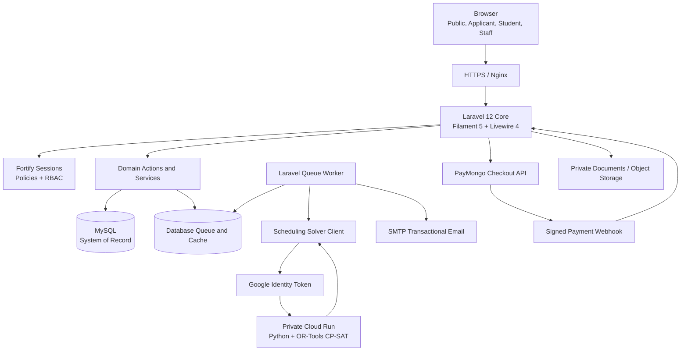
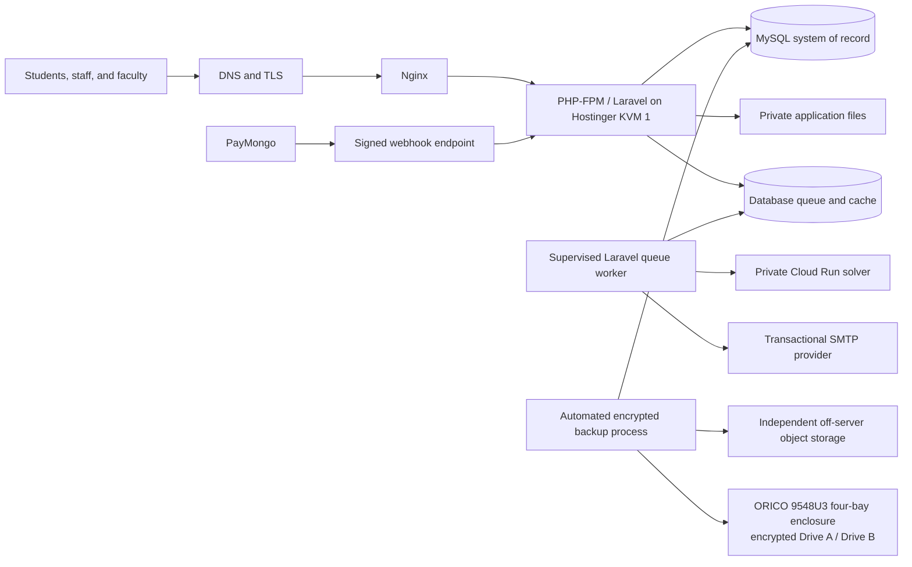

# TALA System Architecture Specification

## Table of Contents

1. [Purpose, Scope, and Evidence Basis](#1-purpose-scope-and-evidence-basis)
    - [Evidence Language](#11-evidence-language)
2. [System Responsibility and Institutional Boundary](#2-system-responsibility-and-institutional-boundary)
3. [Architectural Classification](#3-architectural-classification)
    - [Application Architecture: Domain-Organized Layered Monolith](#31-application-architecture-domain-organized-layered-monolith)
    - [System Topology: Hybrid Service-Integrated System](#32-system-topology-hybrid-service-integrated-system)
    - [Integration Style: Request/Response with Asynchronous Supporting Workflows](#33-integration-style-requestresponse-with-asynchronous-supporting-workflows)
    - [Data Architecture: Centralized Relational System of Record](#34-data-architecture-centralized-relational-system-of-record)
    - [Why This Shape Was Selected](#35-why-this-shape-was-selected)
    - [Why Microservices Were Not Selected](#36-why-microservices-were-not-selected)
4. [Logical Domain Structure](#4-logical-domain-structure)
    - [Admissions-to-Enrollment Boundary](#41-admissions-to-enrollment-boundary)
    - [Academic-Authority-to-Enrollment Boundary](#42-academic-authority-to-enrollment-boundary)
    - [Registration-to-Official-Enrollment Boundary](#43-registration-to-official-enrollment-boundary)
    - [Official-Enrollment-to-Academic-Record Boundary](#44-official-enrollment-to-academic-record-boundary)
5. [Runtime Component Architecture](#5-runtime-component-architecture)
    - [Primary Request Flow](#51-primary-request-flow)
    - [Queue Operations](#52-queue-operations)
    - [Academic Timetabling Is Not Laravel Task Scheduling](#53-academic-timetabling-is-not-laravel-task-scheduling)
6. [Data Architecture and Integrity](#6-data-architecture-and-integrity)
    - [Why MySQL Fits the Domain](#61-why-mysql-fits-the-domain)
    - [Transaction and Concurrency Rules](#62-transaction-and-concurrency-rules)
    - [Auditability](#63-auditability)
7. [User Interface Architecture](#7-user-interface-architecture)
    - [Why Filament and Livewire Were Selected](#71-why-filament-and-livewire-were-selected)
    - [Why a Separate SPA Was Not Selected](#72-why-a-separate-spa-was-not-selected)
    - [Authorization Rule](#73-authorization-rule)
    - [Browser Failure Presentation Boundary](#74-browser-failure-presentation-boundary)
8. [Security and Trust Boundaries](#8-security-and-trust-boundaries)
9. [External Integrations](#9-external-integrations)
    - [Constraint Programming–Satisfiability (CP-SAT) Scheduling Service](#91-cp-sat-scheduling-service)
    - [PayMongo](#92-paymongo)
    - [Transactional Email](#93-transactional-email)
10. [Automatic Scheduling: Research and Product Justification](#10-automatic-scheduling-research-and-product-justification)
    - [Comparison with Existing Approaches](#101-comparison-with-existing-approaches)
    - [Why OR-Tools CP-SAT Was Selected](#102-why-or-tools-cp-sat-was-selected)
11. [Dependency Architecture](#11-dependency-architecture)
    - [Active PHP Runtime](#111-active-php-runtime)
    - [Declared Packages Requiring Deliberate Disposition](#112-declared-packages-requiring-deliberate-disposition)
    - [Frontend Runtime](#113-frontend-runtime)
    - [Solver and Engineering Tooling](#114-solver-and-engineering-tooling)
    - [Compatibility and Minimum Requirements](#115-compatibility-and-minimum-requirements)
12. [Deployment and Operational Architecture](#12-deployment-and-operational-architecture)
    - [Degraded and Failure Behavior](#121-degraded-and-failure-behavior)
13. [Estimated Operating Costs in Philippine Peso](#13-estimated-operating-costs-in-philippine-peso)
    - [Pricing Basis and Assumptions](#131-pricing-basis-and-assumptions)
    - [Lean Fixed-Cost Baseline](#132-lean-fixed-cost-baseline)
    - [Operating Scenarios](#133-operating-scenarios)
    - [Variable and Conditional Charges](#134-variable-and-conditional-charges)
14. [Traditional and Commercial SIS Cost Comparison](#14-traditional-and-commercial-sis-cost-comparison)
15. [How the Client Saves Money: The Value Proposition](#15-how-the-client-saves-money-the-value-proposition)
    - [How Savings Must Be Measured](#151-how-savings-must-be-measured)
16. [SDLC and Architecture Governance](#16-sdlc-and-architecture-governance)
    - [Refined SDLC Classification](#161-refined-sdlc-classification)
    - [Evidence and Academic Integrity](#162-evidence-and-academic-integrity)
17. [Risks and Decision Summary](#17-risks-and-decision-summary)
    - [Principal Risks](#171-principal-risks)
    - [Final Architecture Decisions](#172-final-architecture-decisions)
18. [Sources and References](#18-sources-and-references)
    - [Internal System Evidence](#181-internal-system-evidence)
    - [Framework, Data, and Architecture Sources](#182-framework-data-and-architecture-sources)
    - [Academic Record and Policy Sources](#183-academic-record-and-policy-sources)
    - [Timetabling and Solver Sources](#184-timetabling-and-solver-sources)
    - [Cost and Local-Market Sources](#185-cost-and-local-market-sources)
    - [SDLC Sources](#186-sdlc-sources)

## 1. Purpose, Scope, and Evidence Basis

**T.A.L.A.** (Tertiary Academic Lifecycle Administration) is a college-focused student information and academic operations system designed for Servitech Institute Asia (SIA). It provides one governed digital record across applicant intake, admission decision, enrollment readiness, academic setup, scheduling, registration and official enrollment, assessment and payment evidence, official outputs, grades, learner self-service, contextual operational views/exports, and audit.

This specification describes TALA's target architecture after Clinic 0 and Clinics 1–6, canonical `00`–`06` consolidation, and the final cross-module contradiction and omission review were approved. Complete-authority approval permits later implementation-task derivation only; the specification itself does not authorize application or schema changes. It explains:

- what architectural style the system uses;
- how its components, data, users, and external services interact;
- why its framework, structure, database, dependencies, and deployment model were selected;
- how its automated academic scheduling differs from a conventional SIS and a mature university timetabling product;
- how the system behaves when a dependency is unavailable;
- what the operating-cost estimate includes and excludes; and
- how the architecture can create measurable institutional value without overstating unproven savings.

The authority basis is the product requirements in `prd_modules/` and the UI surface blueprint. The current application and solver source, package manifests, configuration, automated tests, qualified references, and historical measurements are salvage or implementation evidence only; they cannot prove that a target contract is implemented until the later bounded code-reconciliation stage. Laravel Boost version-specific documentation and the dated external sources in Section 18 support technical and policy claims within their stated scope.

### 1.1 Evidence Language

The following terms prevent design intent from being confused with operational proof:

- **System requirement** — behavior or infrastructure required for the completed system.
- **Implemented mechanism** — a mechanism represented in the application source and tests.
- **Configured service** — an external service for which the application has a supported configuration boundary.
- **Operational evidence** — deployment records, provider invoices, monitoring, restore tests, or institution-signed acceptance evidence.
- **Planning estimate** — a recalculable cost scenario, not a quotation, invoice, service-level agreement, or guarantee.

Vendor feature and price statements are cited as vendor-published information. They do not prove equal scope, quality, availability, or institutional fit.

---

## 2. System Responsibility and Institutional Boundary

TALA is the system of record for approved in-scope academic lifecycle records and recorded office results. It does not replace the authority of the Registrar, Accounting Office, Academic Head, Faculty, or System Administrator.

| Responsibility | TALA performs | Human authority retained |
| --- | --- | --- |
| Applicant intake and admission | Captures the minimum application, versioned preliminary evidence, scoped corrections, decisions, official-credential outcomes, and derived enrollment readiness | Registrar evaluates identity evidence, completeness, admissibility, and credential outcomes |
| Enrollment-ready admissions projection | Makes the same ready application visible to registration without copying it or creating a Student | Registrar and Clinic 4 perform registration, placement, finance clearance, and official-enrollment finalization |
| Academic setup | Stores terms, calendars, curricula, courses, offerings, rooms, and faculty eligibility | Academic and Registrar staff approve institutional rules and source records |
| Timetabling | Produces and validates candidate schedules from explicit constraints | Authorized academic staff review, correct, approve, publish, and revise |
| Current-term registration and enrollment | Derives or records bounded proposals, validates five checkpoints, reserves capacity, and atomically publishes official registration/COR effects | Learner confirms the proposal; Registrar owns academic placement/finalization; Accounting owns clearance evidence |
| Accounts and payment evidence | Derives one continuous Term Account, current-due position, bounded Clinic 4/5 projections, verified postings, and non-tax account outputs from an ordinary published plan or an exact authorized individual result | Accounting publishes fixed Fee Plans, externally calculates and authorizes eligible individual assessments, checks external/manual evidence, resolves exceptions and corrections, and issues any required tax document outside TALA |
| Grades | Stores draft, submitted, reviewed, and released grade records | Faculty submit; authorized academic or Registrar staff return or release |
| Official outputs | Generates COR, schedules, unofficial academic record, proposed/approved-template transcript snapshots, non-tax Account Statement/SOA and Payment Acknowledgment, and approved contextual exports from authoritative records | The owning office controls issuance, correction, template approval, and any external registered invoice, signature, seal, or certification |
| Audit and operational views | Records material actions and produces role-scoped owning-workflow views; Clinic 6 alone provides the two approved contextual CSVs | Institutional policy determines review, retention, and response |

External providers supply computation, communication, or payment evidence. They never become the authoritative academic or financial record.

---

## 3. Architectural Classification

TALA is best described across four complementary architectural dimensions.

### 3.1 Application Architecture: Domain-Organized Layered Monolith

The Laravel core is one deployable application with one configuration surface and one relational database. Its source is organized by institutional domain and technical responsibility:

- Filament pages and resources provide role-scoped presentation;
- actions and services coordinate application use cases;
- models and policies represent data, relationships, state, and authorization;
- jobs and notifications handle durable asynchronous work; and
- integration clients isolate external provider contracts.

This is a **domain-organized layered monolith**, not a strict modular monolith. Logical domains are visible in namespaces and service boundaries, but the application does not enforce independently deployable modules, isolated schemas, or package-level module APIs.

### 3.2 System Topology: Hybrid Service-Integrated System

The completed system combines:

1. the Laravel/MySQL core;
2. a separately deployable Python CP-SAT scheduling service;
3. PayMongo for external payment acceptance and signed event evidence; and
4. an SMTP provider for transactional email.

The solver is separated because optimization has a different CPU, memory, runtime, and deployment profile from ordinary SIS requests. Payments and email remain external because TALA should not implement card processing, e-wallet networks, or mail delivery infrastructure.

### 3.3 Integration Style: Request/Response with Asynchronous Supporting Workflows

Most user actions use ordinary browser-to-Laravel request/response processing and database transactions. Slow or externally triggered work uses queues and webhooks:

- schedule-solver dispatch is queued;
- payment webhook processing is queued;
- admissions submission, correction, decision, readiness, and withdrawal messages are queued;
- schedule release and revision messages are queued; and
- provider failures are recorded for controlled retry or review.

TALA is therefore not primarily event-driven. Queues, notifications, and framework events are supporting execution patterns inside a transaction-centered application.

Admissions submission, decisions, credential results, withdrawal, and readiness commit locally before their email is dispatched. A mail failure cannot undo the authoritative admissions action.

### 3.4 Data Architecture: Centralized Relational System of Record

MySQL stores institutional source records, workflow state, append-only Term Account events, candidate and published schedule records, audit evidence, and queue/cache tables. Downstream views such as Student Finance, COR, SOA, and contextual staff exports read from approved records in this shared relational source.

### 3.5 Why This Shape Was Selected

| Decision | Selected design | Main benefit | Accepted tradeoff |
| --- | --- | --- | --- |
| Core deployment | One Laravel application | Simple deployment, shared authorization, and atomic cross-domain transactions | A core application failure affects all workspaces |
| Domain organization | Actions, services, policies, and domain-oriented folders | Keeps business rules discoverable without distributed-system overhead | Boundaries require convention and review rather than independent deployment enforcement |
| Data ownership | One MySQL system of record | Referential integrity and consistent official outputs | Database availability is a central dependency |
| Long-running work | Database-backed queues | Durable asynchronous processing without a separate queue service at initial scale | Queue traffic competes with application database capacity |
| Optimization | Separate CP-SAT container | Isolates compute-heavy scheduling from web and database workloads | Adds a network and cloud-service dependency |
| User interface | Server-driven Filament/Livewire panels | Reuses PHP validation, policies, sessions, and domain services | Less client-side independence than a separate SPA |

### 3.6 Why Microservices Were Not Selected

Admissions, academic setup, scheduling, enrollment, finance, grades, and official outputs share tightly related records and institutional transactions. Splitting each domain into a network service would introduce API versioning, distributed authorization, data duplication, service discovery, observability, and cross-service consistency work without evidence that SIA requires independent scaling or release cycles.

The selected design preserves a service boundary only where the runtime characteristics are materially different: the CP-SAT optimizer. This is a purposeful boundary, not a partial migration to microservices.

---

## 4. Logical Domain Structure

| Domain | Principal records and responsibilities | Important consumers |
| --- | --- | --- |
| Platform foundation | Credential accounts, code-owned roles/permissions, typed domain or environment configuration, audit and operational events | Every authenticated workspace |
| Identity and access | Registration, invitation/activation, verified-email login, password recovery, Staff MFA, workspace resolution, panel access, and policy enforcement | Applicants, students, staff |
| Admissions and enrollment readiness | Admission Cycles, versioned requirement sets, applicant profiles, applications and snapshots, scoped corrections, preliminary evidence, decisions, identity-match reviews, official-credential results, and derived readiness | Registrar, Applicant Workspace, Clinic 4 registration queue |
| Academic setup, class planning, and timetable publication | Program authority, immutable Course Revisions and Curriculum Versions, typed Term Calendar Packages, Term Cohorts, Class Offerings, Faculty/room readiness, whole-term solver snapshots, candidates, Laravel validation, immutable Published Timetable Versions, and revisions | Registrar, Academic Head, Faculty, Clinic 4 enrollment and Student schedule/COR projections |
| Current-term registration and enrollment | Registration Cases, proposal versions, eligibility effects, confirmations, reservations, shortages, official term/course registrations, adjustments, Course Drops, conditional Student activation, minimal Student profile/correction history, and COR versions | Registrar, Accounting, Faculty roster, Student Hub, Clinic 3 demand |
| Accounts and payment evidence | Versioned fixed Program-and-Term Fee Plans, Assessment versions based on `PublishedFeePlan` or `AuthorizedIndividualAssessment`, continuous Term Accounts, private/manual evidence, exact-due payment attempts, verified postings, append-only adjustments/reversals, and bounded Clinic 4/5 projections | Accounting, Clinic 4 Enrollment Clearance, Clinic 5 output issuance, Student Finance, non-tax SOA |
| Teaching, academic record, lifecycle, and completion | Official Class Offering rosters, final-result events, GWA/evaluation projections, progress decisions, lifecycle events, completion/conferral, and transcript snapshots/issuance | Faculty, Registrar, Academic Head, Student Academics, Clinic 4 registration, Clinic 6 output clearance |
| Learner workspaces | Applicant progress, student schedule, COR, Student Finance/SOA, grades, and contextual notices | Applicants, students, and read-only alumni |
| Outputs, health, governance, and audit | Authorized contextual exports, output access, local integration/backup evidence, institutional changes, operational events, and retention readiness | Office owners and System Administrator |

Domain rules belong in actions, services, policies, and models. Filament resources and pages orchestrate user interaction but are not the sole location of business rules. This keeps the same institutional rule reusable across staff actions, learner projections, jobs, commands, and tests.

### 4.1 Admissions-to-Enrollment Boundary

Clinic 2's conceptual boundary consists of `AdmissionCycle`, immutable `AdmissionRequirementSet` versions, `AdmissionRequirement`, `ApplicantProfile`, `AdmissionApplication`, `ApplicationCorrectionRequest`, `ApplicantRequirementResult`, `PreliminaryEvidenceVersion`, `OfficialCredentialResult`, `AdmissionDecision`, `IdentityMatchReview`, and derived `EnrollmentReadiness`. These names describe responsibilities, not approved physical tables.

Clinic 4 receives a read-only `ReadyApplicantProjection` carrying the same application reference, applicant identity, admitted program and path, current decision, verified identifiers, requirement version, credential results, readiness date, and unresolved post-enrollment follow-ups. Registrar and Clinic 2 retain ownership of `PostEnrollmentFollowUp` credential results; Clinic 4 preserves and may surface their references but does not reinterpret them as enrollment blockers. It does not receive a copied application and Clinic 2 does not create the Student profile, student number, Student role, registration proposal, enrollment, assessment, or class placement.

Admission-cycle dates and requirement versions are admissions-owned source records. A general calendar may display their dates but cannot edit them, and System Administrator may report storage or mail health without gaining admissions-policy or decision authority. No public HTTP API, generic policy DSL, configurable state machine, universal override, or generic Settings record is introduced for this boundary.

### 4.2 Academic-Authority-to-Enrollment Boundary

Clinic 3 is one logical domain journey rather than three peer subsystems. Its conceptual boundary contains `ProgramAuthority`, stable `Course` plus immutable `CourseRevision`, simple `CourseRequisite` and `CourseEquivalency`, `WeeklyMeetingRequirement`, immutable `CurriculumVersion` and `CurriculumEntry`, typed `TermCalendarPackage` records, `TermCohort`, `ClassOffering`, Faculty and room readiness records, immutable solver runs/snapshots/candidates, and immutable published timetable versions and revisions. These names describe responsibilities, not approved physical tables.

Externally approved academic decisions are recorded with authority evidence. TALA does not reproduce regulator, committee, HR, workload-approval, practicum-placement, or timetable-sign-off workflows. Courses without a genuine recurring class meeting remain curriculum records and are excluded from CP-SAT rather than receiving fabricated timetable hours.

First, Second, and approved Special Terms share the same `TermCalendarPackage`, `ClassOffering`, solver, publication, registration, account, and academic-record boundaries. A Special Term must carry its approved particular schedule and attributable class-hour/class-day basis. `Additional` may identify an externally approved retake/catch-up class, but no separate Summer scheduler, tutorial aggregate, universal Special Term unit default, or learner classification is introduced.

Clinic 4 receives one read-only `PublishedClassAvailabilityProjection` containing the applicable curriculum term totals, requisites, approved equivalencies, published Class Offerings, capacities, and official meeting times. Clinic 4 returns bounded aggregate `UnmetClassDemandProjection` evidence. Clinic 3 may generate Draft Class Offerings from active curricula, confirmed standard-curriculum cohorts, forecasts, and that demand evidence; Registrar alone confirms, splits, shares, adds, or cancels them, and CP-SAT never creates or merges them. Clinic 4 alone owns current-term eligibility, proposed course registrations within the current Registration Case, learner confirmation, placements, reservations, finance clearance, official enrollment, conditional first Student activation, and COR. Clinic 5 owns full curriculum evaluation and official academic-history outcomes. Clinic 3 never creates a seat reservation or edits an enrolled Student's schedule directly.

Candidate and published timetables are separate. Only Registrar publication creates an official immutable version. A targeted change creates a Draft revision, revalidates the complete timetable, publishes a new version, and preserves the superseded version and exact impact. No public HTTP API, generic constraint profile, editable weight set, universal override, or generic academic Settings record is introduced.

### 4.3 Registration-to-Official-Enrollment Boundary

Clinic 4 contains no standalone Study Plan aggregate and no policy-driving Regular/Irregular Student status. One `RegistrationCase` owns immutable proposal versions under `EnrollmentSelectionBasis` (`StandardCurriculum` or `IndividuallyAdvised`). Its stored outcome is `Active`, `OfficiallyEnrolled`, `CancelledByLearner`, `CancelledByRegistrar`, or `NotEnrolled`; current stage and responsible owner derive from eligibility, confirmed proposal, valid placement, Accounting clearance/coverage, and Registrar finalization.

The Term Calendar Package owns the neutral `Enrollment` window's approved opening and closing dates. Clinic 4 owns only its fixed applicability: Ready Applicants, Standard continuing Students, Individually Advised or exception cases, or all otherwise eligible learners. No arbitrary audience or programmable window-policy engine is introduced.

Clinic 4 consumes:

- Clinic 2 `ReadyApplicantProjection` without copying the application;
- Clinic 3 `PublishedClassAvailabilityProjection` and publishes bounded `UnmetClassDemandProjection` evidence back to class planning;
- Clinic 5 `OfficialCourseResultProjection`, `AcademicEnrollmentEffect`, approved-credit/equivalency mappings, and effective lifecycle outcomes; and
- Clinic 6 `EnrollmentPaymentRequirementProjection`, whose source identifies `PublishedFeePlan` or `AuthorizedIndividualAssessment`, separates verified payment from Applied Approved Coverage, and identifies `VerifiedPayment`, `ApprovedCoverage`, `Mixed`, `NoPaymentRequired`, or `None`; clearance means the amount currently required is satisfied rather than requiring a universal zero balance.

It publishes official term/course registrations, Faculty-roster and Student-schedule projections, immutable COR versions, and account/academic effects. First-ever official enrollment conditionally creates the minimal Student profile, permanent number, and Student access on the existing credential account; later terms reuse them. Registrar-owned official-profile correction records authority/evidence and append-only history, updates future projections, and never rewrites issued COR/TOR snapshots. Credential email/password/MFA remain Clinic 1. Finalization queues one official-enrollment/COR message, which also announces Student access only on first enrollment.

Reservations are deadline-bound capacity evidence, not enrollment. Published Class Offering changes cannot silently move a learner or finalize cancellation while dependent placements are unresolved. Adjustment and Course Drop are separately authorized outcomes that atomically update placement, roster, schedule, account-review evidence, and COR version. No generic override record, configurable workflow engine, ranked waitlist, global hold, public API, or duplicate enrollment ledger is introduced.

The fixed `PublishedFeePlan` basis governs ordinary registration. `AuthorizedIndividualAssessment` is available only for an approved Special Term, reduced enrollment whose approved charges differ from the fixed plan, an Individually Advised selection-specific result, or an authorized adjustment/Course Drop financial effect. It stores Accounting's exact externally calculated authority result and course/unit evidence but executes no formula. If neither basis is current, reconciled, and authorized, the projection is `Unavailable`, never zero or a fallback. A cost-increasing change waits for a successor Assessment and newly required clearance; a no-additional-cost change requires authoritative Assessment confirmation; and an authorized removal or Course Drop may take academic effect with Accounting review pending but no inferred refund, credit, penalty, or forfeiture. The COR preserves its assessment-at-finalization snapshot and may identify later review, while Student Finance/SOA alone owns the current position.

`ApprovedCoverage` records only an externally approved scholarship, sponsorship, government-subsidy, or other authorized-funding effect against an exact Term Account, Assessment, and obligation. Applied, superseded, and reversed events are append-only. TALA does not determine eligibility, administer applications or renewals, disburse funds, silently cap excess authority, reallocate coverage, infer refunds, or recreate a financial-accommodation module. Post-enrollment reversal may update current due but cannot revoke enrollment or create a global hold.

### 4.4 Official-Enrollment-to-Academic-Record Boundary

Clinic 4 publishes official term/course registrations and roster membership. Clinic 3 supplies the official `ClassOffering`, designated submitting-Faculty assignment, course units/classification, Grade Entry window, and term-end date. Clinic 5 creates one `GradeRoster` per official Class Offering—including externally arranged courses without a recurring timetable meeting—and accepts only one controlled final result per officially enrolled learner.

Faculty calculates period grades and raw scores outside TALA. Clinic 5 stores no Preliminary/Midterm/Final values, formula engine, attendance gradebook, or released `P`. A complete roster moves through `Draft`, `Submitted`, `Returned`, and `Released`; only Registrar release creates immutable `OfficialGradeEvent` records. `INC` is accepted vocabulary, but a deadline and automatic lapse require an applicable immutable institutionally approved policy version. Without one, TALA shows no deadline, countdown, deadline email, or lapse action; completion remains available while GWA, prerequisites, and consequential progress remain pending. The one-academic-year/automatic-`5.00` profile is a non-operative proposal until Servitech records adoption. `INC`, authorized correction, progress consequence, lifecycle change, approved credit/equivalency, honor, and conferral remain typed recorded outcomes rather than a generic policy or approval engine.

Clinic 5 derives `AcademicAverageReadiness`, `TermWeightedAverageProjection`, `CumulativeGwaProjection`, `CurriculumEvaluation`, academic-progress recommendation, `CompletionReadiness`, and immutable transcript snapshots. The neutral one-term label is **Term weighted average**; an alternative such as **Term GPA** requires recorded Servitech terminology authority and an effective term. A partially released term is `GradesNotComplete` and produces no partial term or new cumulative value; a grade-complete term with no included units is `NotApplicable`, never zero. Cumulative GWA uses all included attempts and units rather than averaging term values. Clinic 5 exposes only released `OfficialCourseResultProjection`, confirmed `AcademicEnrollmentEffect`, approved credit/equivalency, and effective lifecycle facts to Clinic 4. An affected active Registration Case enters Registrar review after correction; no academic-record change silently modifies a registration.

Clinic 6 supplies bounded `OfficialOutputPaymentClearance` to transcript preview/issuance. Because the client format is unavailable for reuse, TALA's demonstration layout is labelled **Proposed institutional format — Not for official issuance**. Issuance requires an institution-approved code-owned template version plus external certification. Request intake, payment collection, certification, signature, seal, CAV, claiming, courier, diploma, and ceremony work remain external. No public HTTP API, academic-policy DSL, GWA editor, transcript-template editor, global hold, or duplicate academic-record store is introduced.

---

## 5. Runtime Component Architecture



### 5.1 Primary Request Flow

1. The user enters through the public site or an authenticated Filament panel.
2. Laravel authenticates the session and authorizes both panel access and the requested record/action.
3. The relevant action or service validates the institutional rule.
4. Related writes are committed in a database transaction.
5. Slow external work is dispatched only after the authoritative local state is recorded.
6. Learner and staff projections read from approved records rather than directly from provider responses.

### 5.2 Queue Operations

The database queue is appropriate while workload remains within the capacity of the primary database. The solver job owns a 360-second job timeout, while the database queue's `retry_after` is 420 seconds so a running job is not made available to a second worker prematurely. Solver attempts and backoff are bounded and failures are recorded as operational evidence.

A production process supervisor must keep the queue worker running and restart it after failure or deployment. Redis and Laravel Horizon are an upgrade path when measured queue throughput, latency, or operations visibility justifies a dedicated queue/cache service; they are not prerequisites for the selected baseline.

### 5.3 Academic Timetabling Is Not Laravel Task Scheduling

Laravel's task scheduler is a cron replacement for executing commands at particular times. TALA's academic scheduler is an optimization model that assigns academic demands to faculty, rooms, days, and time blocks subject to constraints. They solve different problems:

| Term | Meaning in TALA |
| --- | --- |
| Laravel task scheduling | Infrastructure for running recurring commands; not the timetable generator |
| Queue scheduling | Delayed or retried processing of jobs |
| Academic timetabling | CP-SAT constraint optimization producing candidate class meetings |
| Student scheduling/sectioning | Assignment of individual students to already timetabled sections; outside TALA's optimizer scope |

---

## 6. Data Architecture and Integrity

### 6.1 Why MySQL Fits the Domain

TALA records are strongly relational: a Student belongs to a program and curriculum; official course registrations connect Students to Class Offerings; published meetings depend on Class Offerings, Faculty, rooms, and timetable versions; released results depend on official registrations and rosters; and a pre-enrollment or Student Term Account depends on the same human-subject identity continuity, RegistrationCase, Term, an Assessment version sourced from a fixed Fee Plan or exact authorized individual result, and immutable payment/account events.

MySQL was selected because it provides:

- foreign keys and unique constraints for referential integrity;
- transactions for multi-record institutional actions;
- row locking for concurrent enrollment, finance, and publication operations;
- `DECIMAL` storage for Philippine peso values;
- indexed relational queries for rosters, academic attempts, Term Account activity, curricula, contextual exports, and official outputs; and
- direct, mature Laravel and Eloquent support.

MongoDB can support transactions, but its document model would not remove the need to model these relationships and institutional constraints. TALA's workload benefits more from relational integrity and joins than from schema-flexible aggregate documents. Selecting MySQL is therefore a domain-fit decision, not a claim that document databases lack transactional capability.

### 6.2 Transaction and Concurrency Rules

- verified Payment Posting, account activity, and affected projections commit atomically.
- Enrollment and capacity-sensitive actions use transactions and appropriate row locks.
- First application submission assigns one stable reference and freezes the submitted snapshot atomically.
- One account is constrained to one application per Admission Cycle; admission decisions recheck cycle, correction, identity-match, requirement-version, and prior-decision facts server-side.
- Admission-decision corrections append a superseding decision rather than overwriting the earlier decision.
- Enrollment readiness is derived from the current admitted decision and required credential results. Clinic 4 consumes the same application projection and creates no duplicate admissions record.
- Proposal confirmation locks and validates the current proposal version and Class Offering capacity before creating deadline-bound reservations. Expiry releases seats without deleting the case or payment evidence.
- Every-term official-enrollment finalization locks and revalidates all five checkpoints, converts reservations, records official term/course registrations, activates schedule/roster projections, creates immutable COR version 1, and publishes account/academic effects in one idempotent transaction.
- First-ever finalization conditionally creates the minimal Student profile, permanent `SIA-YYYY-NNNN`, and Student access; continuing finalization cannot create duplicates.
- A cost-increasing adjustment locks its exact change version and successor Assessment, then waits for the newly required clearance before atomically synchronizing official placement, roster, schedule, account projection, and a new COR version. A no-additional-cost change requires an authoritative Assessment confirmation. An authorized removal or Course Drop may synchronize its academic effects and a new COR version while appending Accounting-review evidence; it never infers a refund, credit, penalty, forfeiture, or changed balance. Timetable impact is resolved before Clinic 3 finalizes an affected class cancellation.
- Schedule publication validates candidate ownership, revision state, and downstream impact before replacing official meetings.
- Grade-roster submission locks the current roster version and validates designated-Faculty authority, official membership, completeness, and final-result vocabulary. Registrar release is all-or-nothing and appends immutable official result events.
- INC completion and authorized grade correction append superseding result events. An INC lapse does so only under an applicable approved policy after its inclusive Asia/Manila deadline; transactional revalidation makes an already recorded completion win, and the lapse event is idempotent. These events recalculate affected GWA, curriculum-evaluation, progress, and completion projections while retaining history; affected active registrations are flagged for review rather than silently changed.
- A current-term full withdrawal or other lifecycle result synchronizes its authorized enrollment, seat, schedule, roster, COR, and Accounting-review effects without deleting released grades or inferring a financial outcome.
- Degree conferral atomically records the immutable degree result, final curriculum-evaluation snapshot, and `Completed` lifecycle event after all authoritative readiness facts are revalidated.
- Transcript snapshots are immutable. Issuance mistakes produce void/replacement links, while later legitimate academic corrections supersede rather than mutate an issued snapshot.
- Payment webhooks use provider identifiers and idempotency checks so duplicate delivery cannot post the same payment twice.
- External calls do not silently convert an unverified provider response into an official academic or finance record.

### 6.3 Auditability

Material changes retain actor, timestamp, affected record, and relevant before/after or operational context. Audit records support review; they do not replace database backups, security monitoring, or institution-approved records-retention policy.

---

## 7. User Interface Architecture

TALA uses two deliberately different presentation surfaces:

1. an isolated Blade/Bootstrap public landing page; and
2. server-driven Filament/Livewire workspaces for applicants, students, and staff.

### 7.1 Why Filament and Livewire Were Selected

Institutional workspaces are dominated by authenticated tables, forms, filters, actions, status transitions, and record-level permissions. Filament and Livewire allow these surfaces to share:

- Laravel validation and authorization;
- Eloquent relationships and transactions;
- server-managed session cookies and CSRF protection;
- domain actions and policy checks;
- consistent tables, forms, notifications, and responsive layouts; and
- one PHP-centered implementation model for the capstone team.

### 7.2 Why a Separate SPA Was Not Selected

A React or Vue SPA would be valid if TALA required an independently deployed frontend, public third-party API, extensive offline behavior, or highly client-driven interaction. It would also require a stable API contract, separate client state, duplicated validation concerns, and an additional release surface.

The selected server-driven UI reduces those boundaries. It is not inherently more secure or faster than every SPA; its advantage is architectural fit and a smaller coordination surface for TALA's form- and workflow-heavy operations.

The final shared shell exposes only the PRD-owned destinations: Applicant Home/Application; Student Home/Enrollment/Academics/Finance/Profile; Registrar Admissions, Catalog & Curricula, Term Planning, Students & Enrollment, and Grades & Completion; Accounting Fee Plans and Student Accounts; Faculty My Availability/My Schedule/Grade Rosters; Academic Head read-only Academic Oversight; and System Administrator Users & Access/Public Content/System Health/Governance & Audit. There is no top-level Reports, Settings, Approvals, Readiness Center, duplicate integration-status, notification-center, or report-hub destination.

Student Home composes source-labelled priority summaries without creating a global learner state. Student Profile is a read-only projection of Clinic 4 official identity/program/curriculum/entry/contact facts with correction guidance; Account Security remains Clinic 1. Academic Oversight is a read-only set of links to source-owned academic evidence and grants no universal approve, publish, release, or correction action. Readiness stays contextual to the consuming action.

Clinic 4 uses one Student guided status Page, one Registrar Students & Enrollment workbench, one Accounting Enrollment Clearance queue, and authenticated read-only COR views. Native Tables own queues and filtering; Infolists and Sections own evidence; Forms own actual input; Action Groups own secondary actions. The page derives checkpoint state and exposes one valid primary action rather than reproducing a generic workflow or gate editor.

Clinic 5 uses Faculty Grade Rosters, one Registrar Grades & Completion workbench, one Student Academics Page, and authenticated unofficial-record/TOR print views. Native Tables own roster and review queues; controlled Forms own final-result and contextual policy-authority input; Infolists/Sections own released academic and INC-policy evidence; Tabs organize Registrar decisions; and Action Groups contain secondary actions. A missing applicable policy produces an explicit no-deadline/no-lapse state on Faculty, Registrar, Student, and read-only Academic Oversight projections. No custom gradebook, period-grade form, attendance surface, graduation batch, standalone policy editor, transcript-template editor, or Student official-TOR action is part of the target architecture.

Clinic 6 uses Accounting **Fee Plans** and one **Student Accounts** workbench with Accounts, Payment Exceptions, and TOR Clearance tabs; one summary-first Student Finance Page with read-only alumni history; and System Administrator **System Health** and **Governance & Audit** Pages. Native Tables and filters own queues, including `Assessment required`; Sections and Infolists own current position and assessment-source evidence; private File Upload handles learner proof; focused Actions own publication, exact authorized-individual-assessment recording, verification, correction, and request-specific clearance; authenticated print views own the non-tax SOA and Payment Acknowledgment. No calculation builder, peer-resource finance navigation, Billing Slip, Official Receipt mapping, general ledger, report hub, provider operations console, or automatic-disposal UI is part of the target architecture.

### 7.3 Authorization Rule

Navigation visibility is a usability control, not authorization. Panel access, resource operations, custom pages, actions, queries, downloads, and output access must be protected by policies or explicit authorization. Filament rechecks authorization during Livewire requests, while TALA's actions and services still enforce domain-specific rules.

### 7.4 Browser Failure Presentation Boundary

Laravel's exception pipeline remains the response authority. TALA supplies status-specific Blade views for `403`, `404`, `419`, `429`, `500`, and `503`, together with `4xx` and `5xx` fallbacks. The templates share one dependency-light layout and static stylesheet so a failure page does not depend on the Vite or Livewire runtime that may itself be unavailable. They state what happened and the safe next action without rendering exception details.

This is a presentation boundary, not a global exception transformation. Laravel content negotiation continues to produce JSON for API or JSON-expecting requests, Livewire retains its framework response lifecycle, and domain validation remains on the relevant Filament form or action. The browser pages do not change status codes, authorization, sessions, transactions, logging, or retry policy.

---

## 8. Security and Trust Boundaries

| Boundary | Control |
| --- | --- |
| Browser to Laravel | HTTPS, session authentication, CSRF protection, validation, rate limiting where appropriate |
| User to panel | Panel-access rules and role/permission checks |
| User to record/action | Laravel policies and action-level authorization |
| Laravel to MySQL | Private credentials, least-privilege database account, transactions, and constrained schema |
| Laravel to Cloud Run | HTTPS and audience-bound Google identity token; private service invocation |
| PayMongo to Laravel | Signature verification, provider-event persistence, idempotent queued processing |
| Laravel to SMTP | Provider credentials stored outside source control; queued delivery and failure evidence |
| Documents and exports | Private-by-default storage, authorized retrieval, logged output access |

Admissions evidence is private and versioned. Each retained upload records its authorized owner, requirement, content metadata, checksum, replacement relationship, and review result. Preliminary acceptance never becomes official-credential verification through a file-state shortcut. LRN is masked outside authorized detail, cannot authenticate an account, and cannot be disclosed through candidate-match feedback.

Payment evidence is likewise private and versioned. Learner submission is a claim, not a payment. Only authorized Accounting review of the actual external source or an exact valid signed provider event may create an immutable verified posting. Proof files, bank details, raw provider payloads, credentials, signatures, and internal review notes never appear in exports or broad audit views.

Secrets must be injected through protected runtime configuration and must never be committed, rendered in administrative diagnostics, or included in logs. Integration status pages may report whether a credential is configured but must not reveal its value.

TALA supports institutional compliance work through access control, audit, retention-aware records, and privacy-oriented boundaries. Compliance with the Philippine Data Privacy Act remains an organizational responsibility involving policy, lawful processing, security operations, staff practice, and data-subject procedures; a software feature list alone cannot establish compliance.

---

## 9. External Integrations

### 9.1 CP-SAT Scheduling Service

The scheduling service remains an isolated Python/OR-Tools CP-SAT adapter. A future implementation reconciliation decides whether the current Flask, Gunicorn, and private Cloud Run deployment are retained. The product contract is a versioned immutable whole-term snapshot in and a typed solver result out.

One solver demand represents one required recurring meeting block for one confirmed Class Offering. Courses without a genuine recurring master-timetable meeting create no demand. A candidate is untrusted integration output until Laravel revalidates whole-term completeness and every hard rule, and Registrar completes human review.

#### Controlled Scheduling Flow

1. TALA assembles one immutable whole-term snapshot from the active Term Calendar Package, every confirmed and scheduling-ready Class Offering, required meeting blocks, linked cohorts, eligible Faculty, Faculty term capacity and declared hard unavailability, rooms, room hard unavailability, and authorized exact commitments.
2. A queued Laravel job sends the snapshot to the private solver service.
3. CP-SAT first finds complete hard feasibility and then applies the fixed lexicographic quality hierarchy: cohort mode switches, cohort idle time, Faculty load imbalance, Faculty idle time, room-seat waste, and stable earlier placement.
4. The adapter returns `Optimal`, `Feasible`, `Infeasible`, `Unknown`, `ModelInvalid`, or `TechnicalFailure` with typed evidence. It never publishes.
5. Laravel independently validates every returned assignment against the saved snapshot and institutional invariants.
6. Registrar reviews the complete candidate and may apply only bounded corrections that revalidate the whole candidate and waive no hard rule.
7. Registrar records any externally made sign-off and publishes an immutable `PublishedTimetableVersion`.
8. Faculty and Clinic 4-owned Student schedule/COR projections read only from the applicable published version.

#### Required Hard Constraints

- assign every included meeting block exactly once;
- prevent Faculty, room, and cohort overlap;
- respect the approved calendar grid, breaks, dated effects, and hard unavailability;
- respect room capacity, type, and required features;
- respect Faculty teaching eligibility, term load, and applicable preparation limits;
- respect required meeting patterns and linkage;
- provide at least 30 minutes for a cohort transition between Online and On-campus meetings;
- respect authorized exact commitments; and
- prove whole-term completeness again in Laravel before review or publication.

#### Required Soft Objectives

- minimize cohort mode switches;
- minimize cohort idle time;
- minimize Faculty load imbalance;
- minimize Faculty idle time;
- minimize room-seat waste; and
- use stable earlier day/time placement only as the final tie-breaker.

These objectives are lexicographic: a lower priority may not worsen a higher priority. The target contract is fixed and non-configurable. Later code reconciliation must prove conformance before they may be called implemented. Staff see the individual quality measures, not editable weights, one opaque score, or an “accuracy” percentage.

#### Scheduling Limitations

- The solver does not repair incomplete curricula, classes, rooms, Faculty eligibility, calendar facts, or authority records.
- It does not perform exam timetabling, event management, practicum operations, or individual student placement.
- `Feasible` is complete and hard-valid but not proven best; publication requires review and a recorded reason.
- `Infeasible` is a proof of impossibility; `Unknown` makes no feasibility or infeasibility claim.
- `ModelInvalid` identifies a model/contract defect; `TechnicalFailure` identifies service or integration failure.
- Failure evidence is deterministic and source-linked; it does not promise a mathematically minimal conflict set.
- Only one run is active per term. Equivalent reruns follow the result-specific source-change or recovery rules in PRD 03.
- The solver never publishes directly and cannot override institutional authority.

#### Verified Population Operating Envelope

> **Historical implementation evidence, not the Clinic 3 product contract.** The measurements below remain useful salvage evidence for later deployment and solver reconciliation. Their legacy demand construction, objective profile, fixture counts, and deployment settings do not override PRD 03's accepted whole-term source model or lexicographic quality hierarchy.

The TAL-96D5D study preserved the production solver contract and evaluated private zero-traffic candidates against complete `MIN`, `MIDDLE`, and corrected `MAX` fixtures. `TARGET-CFG-01` uses 4 vCPU, 8 GiB, four CP-SAT workers, concurrency one, a 120-second solver limit, and a 300-second HTTP timeout. It returned accepted feasible schedules in all three `MIN` runs (54 demands) and all three `MIDDLE` runs (80 demands), with full coverage and zero solver or Laravel hard violations. It is therefore the evidence-backed candidate if operational workload grows toward the verified MIDDLE model of 56,112 candidates, 169,043 variables, and 337,725 constraints. It remains private and unpromoted.

The final corrected MAX fixture has 178 demands, 192,492 candidates, 579,437 variables, and 1,157,585 constraints. A private non-optimizing witness was independently accepted by Python candidate enumeration and Laravel validation for all 178 demands, proving fixture feasibility without claiming CP-SAT optimality. The earlier time-extension `infeasible` result belongs to a superseded pre-correction construction and is not evidence against this corrected fixture. Corrected-MAX exploratory runs returned `UNKNOWN`; the 8-vCPU/8-GiB run terminated at the memory limit; and an earlier 8-vCPU/16-GiB image removed that memory failure but returned `UNKNOWN` without an incumbent after the unchanged 300-second solver limit.

The final staged-search image retained 8 vCPU, 16 GiB, eight workers, concurrency one, the 300-second solver limit, and the 360-second HTTP limit. Its one authorized corrected-MAX request returned `FEASIBLE` with 178/178 assignments, zero hard-constraint violations in Python and Laravel, objective 1,115,910, best bound 0, a 100% relative gap, 307.819849 seconds reported runtime, and 314.471862 seconds client elapsed time. This establishes an observed operational point through the disclosed MAX fixture; it does not prove optimality, repeatability, or an absolute population ceiling. Scaling decisions must consider scheduling-demand and model scale, repeated accepted status, duration, relative gap, memory/OOM, transport health, and queue pressure—not student count alone. Changes to scheduling rules, operating time, rooms, qualifications, faculty load, or cohort construction require fresh evidence even when headcount is unchanged.

The staged-search implementation changes only search control. The hard model is searched first, its complete assignment is supplied to the unchanged optimization model as a solution hint, and Laravel accepts the hard-valid schedule even when the optimization proof does not finish. No scheduling equation, hard rule, objective term, fixture, schema, or publication authority changed. A bounded report correction now preserves validated stage-source and stage-result telemetry in future evidence files; the immutable accepted MAX report predates that correction, so its missing nested stage values are not reconstructed.

The later TAL-96D5E1B1 curriculum-authority reconciliation establishes a corrected current fixture generation: 77 distinct `MIDDLE` offerings/demands and 172 `MAX` section demands, derived from the 23 actual Third Year / Second Semester source rows. It records the DBM 25-versus-28 and DTHM 29-versus-23 source subtotal discrepancies and does not invent a course to make either subtotal match. This is a fixture-input correction, not a solver-contract change. The 80-demand and 178-demand TAL-96D5D measurements above remain explicitly historical synthetic V1 evidence and must not be attributed to the corrected fixture without a new authorized study.

### 9.2 PayMongo

TALA creates checkout only for the exact positive current due of an authoritative Term Account in PHP. The browser redirect is informational; it is not payment proof. An exact signed PayMongo event is persisted and processed idempotently before TALA creates one immutable verified posting. Account, amount, currency, institutional/provider reference, and idempotency must match; mismatch, recovery, refund, chargeback, or reversal evidence enters Accounting review and never exposes the raw provider payload.

If no signed event arrives, the local attempt remains `Pending`; elapsed time and browser return cannot confirm it. Accounting may check the actual provider/external source and use the same verified-external-payment path already authorized for manual evidence. The posting retains the attempt and external reference so a later matching signed event is an idempotent no-op and cannot create a second posting or email. TALA does not expose provider replay, settlement, refund, or control-panel operations.

PayMongo is selected because it provides locally relevant payment channels without TALA storing card or wallet credentials. The tradeoffs are transaction fees, provider availability, settlement rules, account verification, webhook operations, and vendor contract dependence.

Provider contract reference: [PayMongo webhook resource](https://docs.paymongo.com/reference/webhook-resource).

### 9.3 Transactional Email

SMTP carries verification, recovery, admissions, schedule, finance, and workflow messages. Clinic 1 owns verification/resend, password recovery, Staff invitation, email-change verification/alerts, account disable/reactivate, and Staff-role-change messages. Clinic 2 limits admissions email to submission confirmation, one consolidated Action Needed request, Admitted, Not Admitted, Ready for Enrollment, and withdrawal. Clinic 3 limits timetable email to a Faculty availability action request, first official publication to assigned Faculty, and one published-revision event. Clinic 3 owns the revision trigger and affected Faculty; Clinic 4 supplies affected officially enrolled Students and updated schedule/COR context. Clinic 4 separately limits email to the continuing-Student enrollment-window notice, proposal ready or materially revised, payment/coverage action required, official enrollment/COR ready, reservation release/case expiry, and official adjustment/Course Drop. On first enrollment, the official-enrollment/COR message also announces Student access. Neither first activation nor timetable revision creates a duplicate message. Clinic 5 limits email to Faculty grade-submission action, returned roster, grade release without values or attachment, policy-bound INC action/deadline, INC resolution or authorized lapse, authorized correction, consequential progress/lifecycle, completion action-required, and conferral notices. No applicable approved INC policy means no deadline message. Clinic 6 sends only one idempotent **Verified payment posted** message keyed to the posting reference; proof submission/rejection, checkout return, exceptions, TOR clearance, reversals, health, and exports send no email. Routine saves, validation/readiness/capacity checks, candidate generation/correction, academic calculations, queue movement, navigation, and recurring reminders send no email. Email is a communication channel, not the source of truth. A failed email must not roll back an already valid institutional decision; it remains queued or recorded for authorized resend and operational follow-up.

---

## 10. Automatic Scheduling: Research and Product Justification

University course timetabling is a constrained optimization problem, commonly described in research as the university course timetabling problem (UCTP). “UTC” is not one standardized product against which TALA can be compared. For a defensible comparison, TALA distinguishes the UCTP research problem from products such as UniTime and from conventional SIS implementations that primarily record or display schedules.

Research and product basis: [OR-Tools constraint optimization](https://developers.google.com/optimization/cp/), [UniTime course timetabling](https://help.unitime.org/course-timetabling), and [Gu, Li, and Chen's 2025 UCTP review](https://doi.org/10.3390/computation13010010).

### 10.1 Comparison with Existing Approaches

| Dimension | TALA | UniTime | Conventional SIS / qualified Academico reference |
| --- | --- | --- | --- |
| Primary scope | Integrated institutional SIS with controlled course-timetable generation | Comprehensive academic scheduling platform | Institutional record management; scheduling commonly centers on encoded course times and events |
| Optimization scope | Section meeting assignment for rooms, faculty, delivery groups, availability, and fixed institutional constraints | Course and examination timetabling, student sectioning, event management, and related scheduling functions | Product-dependent; an optimizer must not be assumed merely because schedule records exist |
| Input ownership | Approved TALA records are snapshotted and versioned before generation | UniTime's own scheduling model and integrations | SIS records and administrator input |
| Output control | Solver returns candidates; Laravel revalidates; authorized staff review, approve, and publish | Scheduling workflows are managed within UniTime | Staff encode, import, or generate records according to product capability |
| Downstream effect | Published meetings directly drive faculty, student, COR, room, and operational views | UniTime can integrate with external student-information systems | Schedule data is displayed or exported within the system's available modules |
| Institutional fit | Narrow, locally governed baseline designed around TALA's own academic and administrative rules | Broader mature scheduling platform with greater implementation and integration scope | Broadly configurable commercial or institutional workflow |

TALA's defensible contribution is not a claim that it invented CP-SAT, solved UCTP in general, or is algorithmically superior to mature timetabling systems. Its contribution is the governed integration of optimization into one institutional record:

- the exact approved inputs are preserved as an immutable scheduling snapshot;
- hard constraints and objective policy are explicit and versioned;
- solver output is treated as a candidate, not automatically as institutional truth;
- Laravel independently validates returned assignments;
- a human approval gate controls publication;
- published meetings become the single source for student, faculty, room, and document projections; and
- attempts, diagnostics, overrides, approvals, publication, and output access leave operational evidence.

This narrower boundary is beneficial when the institution needs an integrated SIS and an explainable timetable workflow without adopting a separate enterprise scheduling platform. It is also an honest limitation: institutions needing examination scheduling, individual student sectioning, or large-scale multi-campus optimization may require a broader product or a later extension.

### 10.2 Why OR-Tools CP-SAT Was Selected

| Approach | Decision and justification |
| --- | --- |
| Google OR-Tools CP-SAT | Selected. It is open source, suited to integer and Boolean constraint models, supports hard constraints and weighted objectives, returns useful statuses, and can run in a separately scalable container. |
| IBM CPLEX or Gurobi | Technically capable commercial alternatives. They were not selected for the baseline because license terms and recurring cost would weaken the low-cost deployment objective, while TALA's present model does not establish a need for their commercial feature sets. |
| Genetic algorithms, simulated annealing, or other metaheuristics | Useful research alternatives, especially for very large or specialized formulations. They were not selected because constraint satisfaction, infeasibility behavior, and repeatable validation are more direct in the present CP-SAT model. |
| Fully manual scheduling | Retained only as controlled correction and contingency. It has low software complexity but high staff effort, inconsistency risk, and limited ability to check many interacting constraints at once. |
| Adopt UniTime as the scheduling core | A credible option for institutions needing UniTime's broader scheduling scope. It was not selected because TALA requires a bounded, native workflow tied directly to its own academic, finance, access, and publication rules. |

Recent UCTP literature shows that exact solvers, commercial mathematical programming tools, constraint programming, metaheuristics, and hybrids are all used. That evidence supports CP-SAT as a reasonable engineering choice; it does not prove that TALA's current formulation outperforms other algorithms. Such a claim would require a disclosed benchmark dataset, common constraints, repeated runs, hardware and time limits, solution-quality measures, and statistical analysis.

---

## 11. Dependency Architecture

Versions in this section were verified from the installed dependency graph on **July 27, 2026 (Philippine Time)**. A dependency is justified only when its active responsibility is clear; presence in a manifest does not prove architectural use.

### 11.1 Active PHP Runtime

| Dependency | Verified version | Architectural responsibility and benefit |
| --- | ---: | --- |
| PHP | 8.2 | Supported runtime for the selected Laravel ecosystem |
| Laravel Framework | 12.63.0 | HTTP lifecycle, routing, validation, ORM, transactions, queues, policies, notifications, storage, and testing conventions |
| Filament | 5.6.7 | Role-oriented administrative workspaces built from server-defined resources and actions |
| Livewire | 4.3.1 | Stateful, reactive server-driven interactions without a separate SPA/API application |
| Laravel Fortify | 1.37.2 | Headless authentication actions including login, recovery, verification, and two-factor foundations |
| Caresome Filament Auth Designer | 3.1.0 | Presentation layer for branded Filament authentication pages; it does not replace the authentication authority |
| Spatie Laravel Permission | 6.25.0 | Persisted roles and permissions integrated with Laravel authorization |
| Spatie Activitylog | 4.12.3 | Auditable model and workflow activity where explicitly configured |
| Google Auth | 1.52.0 | Service-account credentials and identity-token creation for authenticated Cloud Run invocation |
| Guzzle | 7.15.2 | HTTP transport used by Laravel's outbound integration clients |
| Guzzle PSR-7 | 2.13.0 | PSR-7 request, response, stream, and URI implementation used by the HTTP transport |
| TallStackUI | 3.0.0 | Limited reusable presentation components where TALA has deliberately adopted them |

Laravel, Filament, and Livewire are selected together because TALA is a form-, table-, policy-, and workflow-heavy institutional application. They keep UI behavior, validation, authorization, and transactions in one PHP system. A separate JavaScript SPA would add an API contract, duplicated validation and authorization concerns, client-state complexity, and another deployment surface without a demonstrated baseline requirement for disconnected clients or independent frontend teams.

### 11.2 Declared Packages Requiring Deliberate Disposition

| Declared package | Verified version | Current architectural interpretation |
| --- | ---: | --- |
| Laravel MCP | 0.8.2 | Available to expose governed AI tools or resources, but it is not a production integration boundary while its application route is disabled. |
| Laravel Tinker | 2.11.1 | Developer diagnostic utility, not a production subsystem. |
| chillerlan/php-qrcode | 5.0.5 | Declared, but no active application reference establishes a current production responsibility. |
| Spatie Model States | 2.12.1 | Declared, but no active application reference establishes state-machine ownership. |

These packages must be either connected to an approved responsibility or considered for removal in a separate dependency review. Keeping unused runtime packages increases upgrade work and supply-chain exposure. Removal is intentionally not performed as part of this architecture document.

The PayMongo transport and signed webhook pipeline are application-owned. Previously declared Luigel PayMongo and Spatie Webhook Client dependencies were removed after live-reference and dependency audits proved that neither package owned an active runtime responsibility.

### 11.3 Frontend Runtime

| Dependency | Verified version | Architectural responsibility |
| --- | ---: | --- |
| Tailwind CSS | 4.1.18 | Utility-based styling and responsive layout, including Filament-aligned styling |
| `@tailwindcss/vite` | 4.1.18 | Tailwind compilation through Vite |
| Vite | 7.3.6 | Asset bundling and development build pipeline |
| Laravel Vite Plugin | 2.1.0 | Laravel-aware asset entry points and development integration |
| Alpine.js | 3.15.10 | Declared client-side interaction dependency; Filament/Livewire also provide their expected runtime behavior |
| Axios | 1.18.1 | Present in the default bootstrap layer, but not an architectural API client while the application entry point does not load that layer |
| Bootstrap assets | local landing-page assets | Isolated public-facing landing presentation, not the administrative component system |

Driver.js 1.4.0 and the npm Heroicons package 2.2.0 are declared but have no active application import establishing a current production responsibility. Filament's PHP icon abstractions are the active administrative icon surface.

### 11.4 Solver and Engineering Tooling

The scheduling container uses Python 3.12 slim, Google OR-Tools 9.15.6755, Flask 3.1.3, and Gunicorn 26. Flask provides a small HTTP contract, Gunicorn provides the production process boundary, and OR-Tools owns optimization. The separation prevents Python solver dependencies from expanding the PHP web runtime.

| Engineering dependency | Verified version | Responsibility |
| --- | ---: | --- |
| Laravel Boost | 2.4.12 | Version-aware application inspection and framework-documentation retrieval for AI-assisted development |
| PHPUnit | 11.5.55 | Automated unit and feature behavior checks |
| Larastan | 3.10.0 | Laravel-aware static analysis |
| Laravel Pint | 1.29.1 | Consistent PHP formatting |
| Laravel Pail | 1.2.7 | Local log inspection |
| Laravel Sail | 1.62.0 | Containerized local-development option |
| FakerPHP | 1.24.1 | Deterministic-shape test data generation through factories |
| Mockery | 1.6.12 | Test doubles where an isolated collaborator is appropriate |
| Collision | 8.9.4 | Readable command-line errors and test output |
| Concurrently | 9.2.4 | Coordinates the local web, queue, log, and asset-development processes |

These are engineering controls, not user-facing production modules.

### 11.5 Compatibility and Minimum Requirements

The minimum requirements for TALA are not determined by Laravel alone. They are derived in the following order:

1. the product requirement identifies which users, workflows, devices, and institutional conditions must be served;
2. the strictest active client or server dependency establishes a theoretical technical floor;
3. application code and enabled framework features may raise that floor; and
4. TALA-specific browser, device, and load tests determine what the project may honestly claim as supported.

A dependency floor means that older software is outside the supported design. It does not prove that every TALA workflow works on every device above that floor. Conversely, a selected deployment size is an initial operating baseline, not a guaranteed minimum capacity. These distinctions prevent framework documentation, project policy, and measured system evidence from being presented as if they were interchangeable.

#### Browser compatibility basis

Tailwind CSS 4 is the controlling general browser dependency for TALA's authenticated workspaces. Its core requires Chrome 111, Safari 16.4, or Firefox 128. Vite 7's default production targets are lower than those limits, while the isolated Bootstrap landing page supports a broader range. The system-wide floor therefore follows Tailwind rather than allowing a user to reach the public page and then encounter an unsupported authenticated workspace.

| Browser family | Technical floor or TALA qualification baseline | Status and rationale |
| --- | ---: | --- |
| Google Chrome | 111 or later | Dependency-derived floor from Tailwind CSS 4 |
| Microsoft Edge | 111 or later | TALA qualification baseline aligned with Chromium 111; direct TALA testing is still required because Tailwind names Chrome rather than Edge |
| Mozilla Firefox | 128 or later | Dependency-derived floor from Tailwind CSS 4 |
| Apple Safari | 16.4 or later | Dependency-derived floor from Tailwind CSS 4 |
| Internet Explorer | Not supported | Does not satisfy the active frontend dependency floor |
| Other browsers, embedded webviews, and proxy or mini browsers | Not claimed | May work, but require explicit qualification before being described as supported |

For operational support, TALA should qualify the current stable and immediately preceding major releases of Chrome, Edge, Firefox, and Safari available on vendor-supported operating systems, never below the technical floors above. Browser security updates remain the responsibility of the institution and user; a browser meeting only the historical floor but no longer receiving vendor security support is not an acceptable managed-client baseline.

On phones and tablets, compatibility follows the browser engine rather than a separately invented device specification: Android access requires a qualifying Chrome release, while iPhone and iPad access requires a qualifying Safari release on a vendor-supported operating system. Embedded in-app browsers and unmanaged webviews remain outside the support claim until tested.

As of **Tuesday, July 14, 2026, Philippine Time**, targeted source inspection found no active `wire:transition`, Livewire scoped component styles, service worker, or web-app manifest that raises the current floor or establishes offline capability. Introducing any of those features, or upgrading Tailwind, Vite, Filament, Livewire, Alpine.js, or Bootstrap, requires this matrix to be reassessed.

#### End-user device and browser requirements

| Requirement | Minimum supported condition | Basis |
| --- | --- | --- |
| Browser execution | A qualified browser above with JavaScript enabled | Filament, Livewire, Alpine.js, and interactive validation/actions require client-side JavaScript |
| Session capability | First-party cookies enabled | Laravel session authentication and CSRF protection depend on the browser returning the session cookie |
| Network | Stable HTTPS connectivity while using TALA | TALA is centralized and not offline-first; no arbitrary Mbps claim is made without measured payload and latency tests |
| Files | Browser file selection, upload, and download support where the user's workflow requires documents | Applicant, records, and output workflows exchange files through authenticated server requests |
| Printing | Browser print and save-as-PDF capability | COR, Account Statement/SOA, and Payment Acknowledgment use authenticated HTML/CSS print views in the MVP |
| Device hardware | Any device capable of running a qualified browser and the required workflow | A fixed end-user CPU or RAM value is not justified by the framework and must not be invented without device testing |

Responsive support is role- and workflow-specific. The following dimensions are **qualification targets**, not yet proof that every screen has passed compatibility review:

| User surface | Required qualification viewport | Intended use |
| --- | ---: | --- |
| Public, applicant, and student-facing workflows | 360 × 800 CSS pixels or larger | Modern phone access, including Clinic 6 account status and non-tax outputs |
| Learner-facing and selected review workflows | 768 × 1024 CSS pixels or larger | Tablet access and intermediate responsive layout |
| Registrar, finance, administrator, reporting, and timetabling workspaces | 1366 × 768 CSS pixels or larger | Desktop operational baseline for dense forms, tables, comparisons, and scheduling controls |

Mobile-responsive styling does not by itself prove mobile usability. Before publication or production acceptance, representative users must complete the relevant workflows at the target sizes without hidden actions, inaccessible controls, unreadable tables, or dependence on hover-only behavior. A learner-facing mobile commitment does not automatically make every staff administration surface a phone-supported workflow.

#### Production runtime and capacity baseline

| Layer | Required runtime or selected baseline | Evidence classification |
| --- | --- | --- |
| PHP application | PHP 8.2 or later with Ctype, cURL, DOM, Fileinfo, Filter, Hash, Mbstring, OpenSSL, PCRE, PDO, Session, Tokenizer, and XML extensions | Laravel 12 framework minimum |
| Operating system and web server | Supported 64-bit Linux environment with Nginx and PHP-FPM, or a documented equivalent; only the Laravel `public/` directory is web-accessible | TALA deployment design and Laravel security requirement |
| Database | MySQL 8.4 baseline with InnoDB, transactional storage, and tested migrations | Project-selected and documented database baseline, not merely Laravel's lowest theoretical database version |
| Stateful infrastructure | Database-backed session, queue, and cache tables; private writable application storage; writable `storage/` and `bootstrap/cache` directories; client-owned four-bay ORICO 9548U3 enclosure initially populated with two independent 4 TB CMR NAS HDDs for encrypted offline backup rotation | Current application configuration, Laravel runtime requirement, and client-confirmed physical-backup choice |
| Long-running work | A supervised queue worker for the `scheduling` and `default` queues, with deployment-safe restart and monitoring | Current asynchronous execution contract |
| Initial web host | Hostinger KVM 1: 1 vCPU, 4 GB RAM, 50 GB NVMe storage, and 4 TB published bandwidth | Selected self-managed starting topology based on the provider's August 6, 2026 Philippine plan page; not a load-tested universal minimum or service guarantee |
| Scheduling service | Python 3.12 container. Current serving revision: 2 vCPU, 4 GiB, concurrency 1, two solver workers, 300-second request timeout, and 30-second client-production solver limit. Verified unpromoted MIDDLE candidate: 4 vCPU, 8 GiB, concurrency 1, four workers, and a 120-second solver limit. Verified one-run MAX research configuration: 8 vCPU, 16 GiB, concurrency 1, eight workers, 300-second solver limit, and staged search | TAL-96B4 corrected live production evidence plus TAL-96D5D: `MIN` and `MIDDLE` each accepted 3/3 on the smaller private candidate; corrected `MAX` returned one complete hard-valid `FEASIBLE` schedule on the higher research configuration; neither private candidate was promoted |
| Network and trust | Valid TLS, DNS, firewall controls, private credentials, and outbound HTTPS/SMTP access for approved integrations | Security and integration requirement |

For the scheduling row, a **solver worker** is one CP-SAT search thread inside a request, while **concurrency 1** means one HTTP solver request at a time per Cloud Run instance. The two settings are not interchangeable. The 300-second value is the complete HTTP request limit; the 30-second value is the current production search budget. vCPU is virtual processor allocation and GiB is memory allocation in gibibytes.

The 4 GB KVM 1 VPS co-locates Nginx, PHP-FPM, Laravel, MySQL, and an initial queue worker. It is the selected starting scenario, but its sufficiency must be established against expected concurrent users, database size, document-upload volume, queue depth, response-time objectives, and backup activity. Sustained memory pressure, swapping, disk pressure, slow database queries, queue delay, or missed response/recovery objectives must trigger resizing or separation of the database and workers. Node.js and Python are not required on the web host when frontend assets are prebuilt and the solver remains externally deployed.

#### Development and build requirements

| Tool or service | Minimum or project baseline | Why it is required |
| --- | --- | --- |
| PHP | 8.2 or later | Matches Laravel 12 and the Composer platform contract |
| Composer | Current supported Composer 2 release | Installs and validates PHP dependencies |
| Node.js | `^20.19.0` or `>=22.12.0` | Exact installed Vite 7 engine requirement; this excludes Node 21 and Node 22.0–22.11 rather than implying that every intermediate release is compatible |
| npm | A release supported by the selected Node.js version | Installs and builds the locked frontend dependency graph |
| MySQL | 8.4 project baseline | Matches the documented data-platform target for migrations and tests |
| Python | 3.12 with the pinned solver requirements | Required only when developing or testing the external scheduling service locally |
| Supported browsers | The qualification matrix above | Required for visual, interaction, print, upload, and responsive verification |
| Docker or Laravel Sail | Optional | Reproducible local environment option, not a mandatory production dependency |

The development operating system is not fixed by the architecture. Windows and supported Linux environments are acceptable when they can run the required versions and reproduce the same application, database, asset-build, test, and solver contracts.

#### Compatibility and capacity verification rule

The browser support statement must be backed by recorded manual or automated real-browser evidence for critical flows, including public navigation, authentication and session behavior, applicant document handling, student finance and printable outputs, Filament tables/forms/modals, staff authorization failures, and scheduling submission and result review. PHPUnit component and feature tests remain necessary but do not prove browser layout, JavaScript interaction, printing, or viewport usability. Any automated browser-test dependency requires its own approved dependency change; until then, a dated manual compatibility matrix is acceptable evidence.

Production sizing must similarly be qualified with realistic data and concurrency rather than inferred from a successful local run. The institution must record the tested dataset, concurrent-user model, request mix, queue workload, solver invocation pattern, response-time objective, error rate, and resource measurements. For CP-SAT, the record must also include demand, candidate, variable, and constraint counts; solver status; coverage; hard-constraint validation; objective bound and relative gap when a solution exists; and OOM or timeout evidence. Compatibility and sizing evidence must be refreshed before production acceptance and after a material dependency, topology, scheduling-rule, or workload change.

---

## 12. Deployment and Operational Architecture



A single Hostinger KVM 1 VPS is a lean self-managed starting topology, not a highly available one. Nginx terminates web traffic, PHP-FPM runs Laravel, MySQL holds authoritative data, and a supervised queue worker processes asynchronous work. This design minimizes fixed cost and operational surfaces for the initial institutional scale, but the application and database share one failure domain. Hostinger's published weekly VPS backup and manual snapshot are supplemental recovery layers; weekly recovery points alone cannot satisfy TALA's accepted six-hour RPO.

The minimum production operating controls are:

- provider weekly VPS backup and a controlled pre-change snapshot as supplemental infrastructure recovery;
- automated, encrypted, off-server database and private-file backup generations created at least every six hours;
- two independently recoverable 4 TB CMR NAS HDDs, labeled Drive A and Drive B, initially installed in Bays 1 and 2 of the client-owned ORICO 9548U3; Bays 3 and 4 remain reserved for measured capacity growth or additional approved backup generations;
- independent-disk operation for the initial backup pair, without combining their capacities or assuming RAID; after each backup window, the drives must be safely unmounted, the enclosure powered off and disconnected, and at least one verified drive stored separately from the enclosure;
- encryption before personal data is written to either removable drive, checksum verification after every copy, separate recovery-key custody, and a recorded restore test at least quarterly;
- documented restore procedures designed for a six-hour RPO and eight-hour RTO;
- TLS renewal, host patching, least-privilege credentials, and firewall controls;
- queue, disk, database, HTTP, and solver-integration monitoring;
- log rotation and alerting;
- recovery ownership and escalation procedures; and
- a recorded business-day encrypted ORICO rotation as additional offline defense;
- at least quarterly end-to-end restore evidence; and
- a measured trigger for resizing the VPS or separating the database and workers.

Independent object storage is not a complete backup system. TALA's operations process must create a consistent export, encrypt it, transfer it outside the VPS provider failure domain, retain recoverable generations, monitor failures, and regularly prove restoration. The storage vendor remains a procurement-time decision; existing DigitalOcean Spaces evidence may be reconsidered without making DigitalOcean the application host. The ORICO-attached HDDs are additional offline disaster-recovery copies of the database and private application files, including permanent graduation and academic records; they do not replace the live MySQL system of record, make the application offline-first, or remove retained records from authorized system access. Each 4 TB drive holds its own complete backup set, so the initial two-drive configuration provides two media copies rather than one combined 8 TB volume.

The **RPO target is six hours**: after a qualifying failure, no more than six hours of authoritative database/private-file changes should be lost when the most recent valid backup is used. The **RTO target is eight hours**: priority authenticated service should be restored within eight hours after recovery is declared and required provider access, keys, media, and personnel are available. These are requirements to test, not claims of achieved production performance.

The client-supplied enclosure is the **ORICO 9548U3** four-bay 3.5-inch hard-drive enclosure. Its host connection is USB 3.0 Type-B with a maximum interface rate of 5 Gbps; internally it uses a SATA 3.0 bridging scheme for compatible SATA HDDs. ORICO specifies push-pull installation, Windows/macOS/Linux compatibility, a built-in 150 W power supply for the four-bay version, and a maximum supported capacity of 64 TB. The starting deployment uses only two 4 TB drives. The remaining two bays are expansion positions and do not authorize unmeasured capacity purchases or an undocumented RAID conversion. Sources: [ORICO 9548U3 product specification](https://www.orico.cc/index/product/detail/2056.html?mtpl=1) and [ORICO 95U3 series manual](https://orico.cc/storage/attachments/20250415/f593f8ef0bbef6c65c90e7a9b049dc36.pdf).

Removable-media use, encryption, custody, and disposal must follow the institution's privacy and security policy and [NPC Circular No. 2023-06](https://privacy.gov.ph/wp-content/uploads/2024/03/NPC-Circular-Repeal-16-01-Signed.pdf).

Cloud Run is selected for the solver because optimization is intermittent and independently resource-intensive; it can scale separately from PHP. The tradeoffs are cold-start latency, usage-based cost, provider dependence, identity configuration, and the need for retry-safe requests.

### 12.1 Degraded and Failure Behavior

| Unavailable component | Required safe behavior |
| --- | --- |
| Cloud Run solver | A generation attempt fails visibly and may be retried; already published schedules remain authoritative and available. Authorized staff retain controlled manual scheduling as continuity. |
| Queue worker | Queued solver, webhook, and email work waits durably while ordinary synchronous pages continue where safe. Monitoring alerts operations, and the worker can be restarted without duplicating idempotent effects. |
| PayMongo | New hosted checkout or confirmation may be unavailable. TALA must not infer payment from a redirect; verified prior records remain intact, and controlled manual evidence procedures provide continuity. |
| SMTP provider | The underlying institutional transaction remains valid. Delivery is retried or recorded as failed for operational follow-up. |
| Hostinger VPS or MySQL | Web workspaces are unavailable. Recovery uses the latest valid independent off-server generation, with provider backup/snapshot only as a supplemental option, under the six-hour RPO/eight-hour RTO procedure. |
| Independent object storage | The application may continue temporarily, but off-server backup transfer and any deliberately stored private objects are impaired; operations must restore redundancy promptly. |
| ORICO enclosure or one rotation HDD | The live system and independent off-server copy remain authoritative and available. Quarantine the failed component, keep the other verified rotation drive offline, procure a compatible replacement, recreate the encrypted copy, verify its checksum, and record a restore test before returning to normal rotation. |

TALA is a centralized web system, not an offline-first application. Loss of campus internet, the application host, or the primary database therefore requires institutional contingency procedures. The system must never portray cached, redirected, emailed, or solver-produced information as authoritative when the corresponding server-side transaction was not completed.

---

## 13. Estimated Deployment and Operating Costs in Philippine Peso

### 13.1 Pricing Basis and Assumptions

This estimate combines the original **July 14, 2026** cost evidence with the Clinic 6 Hostinger host decision checked on **August 6, 2026, Philippine Time**. USD prices are converted at **US$1 = ₱61.55**, the reference rate in the independently retrieved Bangko Sentral ng Pilipinas bulletin used for this revision, dated July 3, 2026. The exchange rate is an estimate input, not a guaranteed bank or card settlement rate.

Exchange-rate source: [Bangko Sentral ng Pilipinas, Financial Markets Reference Exchange Rate Bulletin, July 3, 2026](https://www.bsp.gov.ph/Lists/RERB/Attachments/2306/03Jul2026.pdf).

The baseline assumes one production institution, one self-managed Hostinger KVM 1 VPS, the provider's included weekly backup as a supplemental copy, separately procured independent object storage for encrypted six-hour backup generations, the client-owned four-bay ORICO 9548U3 with two independently encrypted 4 TB CMR NAS HDDs, an eligible `.edu.ph` domain renewed through PHNET, database-backed queue/cache, a transactional-email free allowance sufficient for measured use, and Cloud Run use within available allowance. Taxes, object-storage price, payment-processor fees, overages, foreign-exchange spreads, shipping, and future replacement or expansion media are added when known.

### 13.2 Lean Fixed-Cost Baseline

| Cost item | Published basis | Estimated monthly PHP | Estimated annual PHP | Why it is included |
| --- | ---: | ---: | ---: | --- |
| Hostinger KVM 1 renewal basis | ₱679/month equivalent when renewing for two years; provider page showed ₱409/month promotional entry | ₱679.00 | ₱8,148.00 | Hosts Nginx, PHP-FPM, Laravel, MySQL, and the initial queue worker; renewal basis avoids treating a promotion as the steady-state price |
| Hostinger weekly VPS backup | Included in the published KVM plan | ₱0.00 incremental | ₱0.00 incremental | Supplemental infrastructure recovery only; does not satisfy the six-hour RPO |
| Independent encrypted object storage | Required; vendor and quotation not yet approved | **TBD** | **TBD** | Holds off-provider six-hour database/private-file backup generations |
| `.edu.ph` domain | ₱2,500/year | ₱208.33 monthly equivalent | ₱2,500.00 | Provides the institution's eligible Philippine education namespace |
| **Known fixed baseline before object storage** |  | **₱887.33** | **₱10,648.00** | Honest known host-and-domain floor; not the complete production cost |

Hostinger states that VPS plans are paid upfront and displays the monthly equivalent. The promotional entry price is not used for the steady-state total. The independent-storage line prevents the known subtotal from being misrepresented as a complete RPO-compliant deployment quotation.

Fixed-price sources: [Hostinger Philippine VPS plans](https://www.hostinger.com/ph/vps-hosting) and [PHNET education-domain fees](https://services.ph.net/payment.html).

### 13.3 One-Time Client Backup Hardware

The physical-backup estimate below is a Philippine procurement snapshot checked on **Tuesday, July 28, 2026, Philippine Time**. The four-bay ORICO 9548U3 is already owned by the client and therefore adds no new enclosure cash requirement, but its current Philippine reference price is retained as replacement-value and total-system-cost evidence. The selected starting capacity is two independent 4 TB drives in Bays 1 and 2: one Drive A copy and one Drive B copy, not a combined 8 TB array. Bays 3 and 4 remain empty until measured growth justifies another matched pair or an approved additional-generation design.

| Cost item | Quantity | Published Philippine unit price | Replacement / acquisition value | New project cash requirement | Why it is included |
| --- | ---: | ---: | ---: | ---: | --- |
| Client-owned ORICO 9548U3 four-bay 3.5-inch SATA enclosure | 1 | ₱6,999 | ₱6,999 | **₱0** | Already supplied by the client; provides four push-pull SATA HDD bays, USB 3.0 Type-B output at up to 5 Gbps, and up to 64 TB manufacturer-specified total capacity |
| 4 TB 3.5-inch CMR NAS HDDs | 2 | ₱6,250–₱7,280 each | ₱12,500–₱14,560 | **₱12,500–₱14,560** | New procurement providing separately encrypted Drive A and Drive B copies so one verified backup remains offline while the other is refreshed |
| **Initial physical-backup hardware total** |  |  | **₱19,499–₱21,559** | **₱12,500–₱14,560** | Distinguishes the complete hardware value from the remaining cash needed because the enclosure is already client-owned |

The ORICO enclosure reference is the exact 9548U3 Philippine listing from Asianic at ₱6,999. This is recorded as replacement value because the client already owns the unit. For the new drives, the lower reference is the listed Philippine price for a Seagate IronWolf 4 TB NAS HDD; the upper reference is the listed Philippine price for a WD Red Plus 4 TB CMR NAS HDD. Both cited drive listings showed limited or unavailable stock when checked, so the range is a budget basis rather than a supplier commitment. Procurement must confirm a brand-new 3.5-inch SATA **CMR** model, warranty, stock, shipping, and final tax-inclusive price. Sources: [Asianic — ORICO 9548U3 at ₱6,999](https://asianic.com.ph/product/orico-aluminum-4-bay-35-inch-sata-drive-enclosure-9548u3), [Bermor Techzone — Seagate IronWolf 4 TB](https://bermorzone.com.ph/shop/storage-devices/hard-drives/seagate-ironwolf-4tb-nas-hard-drive-5900-rpm-64mb-cache-sata-6-0gbs-3-5/), [DynaQuest PC — WD Red Plus 4 TB](https://dynaquestpc.com/products/western-digital-wd-red-plus-4tb-256mb-5400rpm-wd40efpx-hard-drive-for-nas), [Seagate IronWolf CMR specification](https://www.seagate.com/content/dam/seagate/en_as/content-fragments/products/datasheets/ironwolf-12tb/ironwolf-16tb-DS1904-22-2404US-en_AS.pdf), [ORICO 9548U3 product specification](https://www.orico.cc/index/product/detail/2056.html?mtpl=1), and [ORICO 95U3 series manual](https://orico.cc/storage/attachments/20250415/f593f8ef0bbef6c65c90e7a9b049dc36.pdf).

The 4 TB selection is the starting deployment capacity, not an unmeasured lifetime ceiling. Before purchase and at each annual capacity review, the institution must measure the full encrypted database-and-private-file backup, retained generations, monthly growth, and restore-test workspace. Each drive must retain at least 25% free capacity after the required backup generations are written; otherwise both rotation drives must be replaced with a verified higher-capacity pair.

### 13.4 Operating Scenarios

| Scenario | Estimated monthly equivalent | Estimated annual total | Change and rationale |
| --- | ---: | ---: | --- |
| Hostinger renewal baseline before object storage | ₱887.33 + storage | ₱10,648.00 + storage | Selected steady-state host/domain floor; production cannot omit independent storage |
| Hostinger promotional entry before object storage | ₱617.33 + storage | ₱7,408.00 + storage | Dated entry-price illustration only; paid-upfront term and renewal price control procurement |
| Renewal baseline plus Brevo Starter | ₱1,441.28 + storage | ₱17,295.40 + storage | Adds US$9/month when measured email requirements exceed the free allowance |
| Separated database/workers | **TBD** | **TBD** | Procure only when measured workload, recovery, or maintenance risk justifies topology expansion |

Independent object storage is mandatory in every production scenario because the weekly provider backup cannot meet the accepted RPO. A larger VPS, separated workers, or managed/high-availability database must be budgeted when concurrent workload, maintenance, and recovery evidence justify them.

Scenario source: [Brevo plan documentation](https://help.brevo.com/hc/en-us/articles/208589409-About-Brevo-s-pricing-plans).

### 13.5 Variable and Conditional Charges

| Service | Published basis used | Treatment in estimate |
| --- | --- | --- |
| Google Cloud Run | Request, CPU, memory, and networking are usage-based, with published free-tier allowances subject to eligibility and region | Modelled at ₱0 fixed baseline only while actual metering remains within allowance; billing alerts and monthly review are required |
| Brevo Free | Up to 300 emails per day; unused daily allowance does not carry forward | No fixed charge in the lean baseline |
| Brevo Starter | Starts at US$9/month | Shown as a scenario, not silently included |
| PayMongo GCash | 2.23% per successful transaction, exclusive of VAT | Variable; apply to measured channel volume |
| PayMongo Maya | 1.79% per successful transaction, exclusive of VAT | Variable; apply to measured channel volume |
| PayMongo domestic cards | 3.125% + ₱13.39 per successful transaction, exclusive of VAT | Variable; apply to measured card volume |
| Independent object storage | Vendor quotation, stored generations, retrieval, and egress | Required but unpriced until procurement; monitor encrypted backup size, recovery workspace, and transfer cost |

Variable-price sources: [Google Cloud Run](https://cloud.google.com/run/pricing), [Brevo](https://help.brevo.com/hc/en-us/articles/208589409-About-Brevo-s-pricing-plans), and [PayMongo](https://www.paymongo.com/pricing). Independent object-storage cost remains an explicit procurement gap rather than an invented estimate.

For request-based Cloud Run solver execution, the bounded compute estimate is

```text
Estimated solver request cost =
    billable instance seconds × ((configured vCPU × regional CPU rate)
    + (configured GiB × regional memory rate))
    + request count × regional request rate
```

The corrected TAL-96B4 replacement experiment used the dated Singapore request-based list rates of US$0.000011244 per vCPU-second, US$0.000001235 per GiB-second, and US$0.40 per million requests. Across 59 retained corrected requests, using client elapsed time as the billable-time proxy, the estimate was approximately US$0.196810 before free-tier credits and excluding billing-rounding differences, networking, image storage, build charges, taxes, discounts, invalid deployment attempts, and unrelated project use. Profile B (`2 vCPU / 4 GiB / 2 workers`) was promoted for the 54-demand client baseline. Proportional 2× was repeatably accepted on Profile C with a 120-second research window; Profile B accepted two of three before one 4-GiB memory termination. All three proportional 4× confirmations exhausted the approved 8 GiB limit and are not a supported capacity promise. Detailed reproducibility evidence is retained in the archived [`TAL-96B3-Cloud-Run-Capacity-Benchmark.md`](archive/project-progress/TAL-96B3-Cloud-Run-Capacity-Benchmark.md).

The later TAL-96D5D study used the same request-based rates and 100-millisecond rounding. Corrected per-request proxies were US$0.0067038032–US$0.0067367168 for `MIN`, US$0.0070000256–US$0.0070987664 for `MIDDLE`, US$0.0068628856 for the 120-second MAX screen, and US$0.0141971328 for the 240-second MAX diagnostic. The eight retained exploratory requests total US$0.0624073856 before free tier and exclusions. Later probe-plus-request proxies were US$0.0203565448 for the 8-vCPU/8-GiB infrastructure failure, US$0.0378624112 for the earlier 8-vCPU/16-GiB `UNKNOWN` result, and US$0.03593148 for the accepted 8-vCPU/16-GiB staged-search MAX result. These figures supersede dollar fields in earlier private reports that used the wrong rate class; statuses, timings, hashes, validation, and resource observations were unaffected. These estimates are neither invoices nor monthly forecasts. The standalone research narrative is consolidated in [`TALA_CP-SAT_Technical_Formulation.md`](research%20paper/TALA_CP-SAT_Technical_Formulation.md).

An illustrative payment-fee estimate must use the actual channel mix:

```text
Annual payment fee =
    (GCash volume × 2.23%)
  + (Maya volume × 1.79%)
  + (card volume × 3.125%)
  + (successful card transactions × ₱13.39)
  + applicable VAT
```

The fixed-cost total deliberately excludes implementation labor, ongoing maintenance and support, data cleaning and migration, user training, institutional devices and connectivity, disaster-recovery labor, security review, monitoring products beyond the stated services, SMS, taxes, foreign-exchange spreads, storage/egress overages, payment disputes or refunds, and future capacity upgrades. These are real total-cost-of-ownership items and must be priced from the institution's staffing and procurement evidence before adoption.

---

## 14. Traditional and Commercial SIS Cost Comparison

Public Philippine SIS prices are commonly quoted per learner, while TALA's lean infrastructure is primarily per institution. The table below normalizes published offers to **500 active learners** for illustration. It is a price benchmark, not a claim that the products have identical modules, service levels, implementation work, ownership terms, or availability guarantees.

Comparator sources: [ADAL Education Management System](https://www.adal-edu.com/), [Academe](https://academe.ph/), and the dated [ISMS D22 brochure](https://isms.ph/downloads/D22.pdf).

| System / public offer | Published pricing basis | Monthly equivalent at 500 learners | Annual amount at 500 learners | Important qualification |
| --- | ---: | ---: | ---: | --- |
| **TALA lean fixed infrastructure** | Per-institution baseline | **₱1,402.40** | **₱16,828.84** | Excludes labor, support contract, migration, training, transaction fees, taxes, and risk contingency |
| ADAL SIS annual plan | ₱650 per learner/year | ₱27,083.33 | ₱325,000.00 | Vendor-hosted offer; verify included modules, minimums, implementation, support, and current quotation |
| ADAL SIS monthly plan | ₱85 per learner/month | ₱42,500.00 | ₱510,000.00 annualized | Month-to-month basis; verify contractual terms and current quotation |
| Academe SIS annual billing | ₱76 per learner/month equivalent | ₱38,000.00 | ₱456,000.00 | Public price presentation; verify scope, minimums, setup, and support |
| Academe SIS monthly billing | ₱95 per learner/month | ₱47,500.00 | ₱570,000.00 annualized | Public price presentation; verify scope, minimums, setup, and support |
| ISMS D22 on-premises license | ₱550 per learner/year for five years | ₱22,916.67 | ₱275,000.00 per year | Dated public brochure; school supplies and operates its own server/network, and a current quotation is essential |

At that illustrative enrollment, the gross annual price difference against TALA's lean fixed infrastructure is ₱308,171.16 for the ADAL annual plan, ₱439,171.16 for Academe's annual-billing price, and ₱258,171.16 for the dated ISMS D22 on-premises license. These are **not net savings** because TALA's institutional labor and implementation obligations are not included in its fixed hosting bill.

A defensible procurement comparison uses:

```text
Net annual cost advantage =
    comparator annual price
  − (TALA fixed infrastructure
     + variable provider charges
     + annual maintenance and support
     + migration and training amortization
     + risk contingency)
```

Commercial SIS products may justify a higher subscription through established support, implementation services, hosting operations, contractual service levels, mature integrations, and reduced local technical ownership. TALA is preferable only if the institution values local control and integration enough to operate and maintain it responsibly. If the client cannot fund that ownership, the lowest infrastructure bill is not the lowest-risk choice.

---

## 15. How the Client Saves Money: The Value Proposition

TALA's economic proposition is **lower recurring license exposure plus locally governed integration**, not “almost free software.” Its fixed hosting baseline does not grow directly with every enrolled learner, its principal frameworks and solver are open source, and intermittent optimization can use metered compute instead of a permanently provisioned solver server.

The architecture can reduce cost through:

- **avoided per-learner subscription charges:** one institutional deployment replaces overlapping license surfaces where TALA meets the required scope;
- **one shared record:** admissions, enrollment, schedules, assessment, payment evidence, and outputs do not require repeated re-encoding across disconnected tools;
- **constraint-assisted scheduling:** staff review candidate schedules rather than manually testing every room, faculty, and section conflict;
- **exception-focused work:** queues, validations, and workflow states direct staff toward unresolved cases;
- **lower reconciliation and rework:** controlled state transitions and published projections reduce contradictory lists, schedules, and balances;
- **digital self-service:** applicants, students, and faculty can retrieve authorized status and outputs without routine counter transactions;
- **local adaptation:** approved institutional rules can be changed in the owned application without waiting for a generic vendor roadmap; and
- **bounded compute cost:** the Python optimizer scales separately and is used only for generation work.

### 15.1 How Savings Must Be Measured

Research claims should compare a documented baseline period with a post-adoption period using the same transaction definitions.

```text
Annual processing-labor value =
    (baseline minutes − TALA minutes)
  × annual transactions
  × loaded staff hourly cost
  ÷ 60

Annual scheduling-labor value =
    (baseline scheduling hours − TALA scheduling hours)
  × scheduling cycles per year
  × loaded scheduler hourly cost

Annual rework value =
    (baseline corrected cases − TALA corrected cases)
  × average correction cost

Avoided subscription value =
    displaced annual subscription and support charges
  − replacement services still required

Net annual benefit =
    measured labor, rework, printing, travel, and avoided-subscription value
  − TALA total annual cost of ownership

Payback period =
    one-time implementation, migration, and training cost
  ÷ net monthly benefit
```

The client should establish, before deployment:

- staff minutes per application, enrollment, assessment, payment verification, schedule revision, and document request;
- number and cost of duplicate entries, corrections, conflicts, and reconciliation cases;
- annual paper, printing, storage, and counter-service costs;
- student trips or queue time for transactions that become self-service;
- existing license, hosting, support, and integration charges;
- scheduling cycles, staff-hours, infeasible attempts, and bounded candidate corrections;
- TALA maintenance, support, training, provider, and recovery costs; and
- a signed measurement period, sample definition, owner, and approval record.

Nonfinancial benefits include traceability, consistent authorization, faster visibility, institutional ownership of data and rules, and clearer continuity evidence. These are important but should be reported separately unless the study defines a valid monetary conversion.

The strongest defensible proposition is therefore: **TALA provides a lower-license, locally governed, integrated institutional system whose savings can be measured against the client's real processing, rework, and subscription baseline.** It does not guarantee savings merely because its software dependencies are open source.

---

## 16. SDLC and Architecture Governance

### 16.1 Refined SDLC Classification

TALA follows **Iterative and Incremental Development (IID), tailored to use Incremental Development–Single Delivery**. IID is the recognized lifecycle model; “tailored” describes how that model was applied to this capstone project rather than naming a separate or newly invented model.

The classification is supported by the project's repeated requirements, architecture, and implementation revisions and by its construction of separately identifiable vertical capabilities. Significant Functional and Technical Specification work occurred before the later construction waves, but that does not make the process Waterfall: the specifications, architecture, and system were revised after construction began, including a major rebaseline from optical character recognition to OR-Tools CP-SAT scheduling and a later decomposition into bounded Product Requirements Document modules. Up-front specification can coexist with IID when the work is subsequently refined rather than executed as a single-pass sequence.

The lifecycle is aligned as follows:

1. **Requirements and problem discovery:** identify the institutional problem, users, workflows, constraints, intended records, and research basis.
2. **Requirements and specification iteration:** refine the Functional and Technical Specifications, user flows, diagrams, data design, and evaluation method.
3. **Initial implementation baseline:** establish the database, access, administrative, service, and integration foundations.
4. **Requirements and architecture rebaseline:** replace or reduce ambiguous scope and reorganize the retained system around the modular PRD and CP-SAT scheduling direction.
5. **Vertical incremental construction:** implement admissions, student records, enrollment, curriculum, finance, grades, Student Hub, reporting, scheduling, and payment capabilities as bounded end-to-end increments.
6. **System integration and developer verification:** combine the increments and verify authorization, rules, failure handling, outputs, and external-service behavior through developer-led checks.
7. **Stakeholder validation and single integrated delivery:** conduct the planned cross-role regression, demonstration rehearsal, and client/panel review before the integrated system is described as validated or delivered.

The record does not establish recurring client acceptance of each increment. Developer testing is therefore classified as **verification**, while the planned client and panel review remains **stakeholder validation pending**. Because the separately constructed increments accumulate into one integrated system for a later stakeholder-facing release, the delivery strategy is Incremental Development–Single Delivery rather than incremental delivery.

This is not classified as Rapid Application Development because the project record does not show sustained short prototype cycles with representative users repeatedly evaluating working increments. It is not presented as Scrum or a fully Agile process because the evidence does not establish Scrum accountabilities, prescribed events, or frequent stakeholder delivery. It is not Rational Unified Process because the project was not governed through its formal Inception, Elaboration, Construction, and Transition phases. It is not Waterfall because requirements, design, construction, and verification overlapped and were rebaselined after implementation had begun.

TOGAF's Architecture Development Method is retained strictly as guidance for architecture views, baseline-to-target analysis, tradeoffs, and governance. It is not TALA's software-delivery lifecycle. ISO/IEC/IEEE 12207:2026 is likewise used as lifecycle-process vocabulary rather than as a claim of certification or full conformance.

Method sources: [Larman and Basili's history of IID](https://www.cs.umd.edu/~basili/publications/journals/J90.pdf), [NASA Incremental Development–Single Delivery guidance](https://standards.nasa.gov/sites/default/files/standards/NASA/Baseline/0/nasa-gb-871913.pdf), [ISO/IEC/IEEE 12207:2026](https://www.iso.org/standard/90219.html), [IBM's definition of RAD](https://www.ibm.com/think/topics/rapid-application-development), [Agile Manifesto principles](https://agilemanifesto.org/principles.html), [IBM's RUP phase definition](https://www.ibm.com/docs/en/rational-clearquest/10.0.9?topic=settings-project-planning), and [The Open Group TOGAF overview](https://www.opengroup.org/togaf).

### 16.2 Evidence and Academic Integrity

Different claims require different evidence:

| Claim | Acceptable evidence |
| --- | --- |
| A dependency is installed | Lockfile or installed-package graph |
| A route, schema, policy, service, or constraint exists | Reviewed source, configuration, migration/schema, and focused automated test |
| An external integration works in the application | Contract test plus authenticated provider sandbox or controlled end-to-end evidence |
| The system is deployable | Reproducible build, environment configuration, migration, worker, health, and restore evidence |
| The workflow is accepted by users | Dated participant list, scenario, instrument, results, findings, decision, and sign-off |
| The system is usable | Defined usability method, representative participants, task results, and analysis |
| The system saves time or money | Approved before/after baseline, consistent measurement, total-cost calculation, and stated limitations |
| The system complies with law or institutional policy | Qualified legal/policy assessment plus implemented and operated organizational controls |

Repository evidence can establish implemented behavior. It cannot, by itself, establish stakeholder approval, production availability, legal compliance, usability, migration success, or economic benefit. Those claims remain conditional until the corresponding signed and dated evidence exists.

---

## 17. Risks and Decision Summary

### 17.1 Principal Risks

| Risk | Architectural response |
| --- | --- |
| Single Hostinger VPS and co-located MySQL form one failure domain | Six-hour encrypted off-provider copies, supplemental provider backup, ORICO offline copies, restore testing, monitoring, and explicit scale/separation triggers |
| Database queue/cache can contend with transactional workload | Index and monitor queue tables, bound retries and payloads, keep jobs idempotent, and move queue/cache to dedicated services when measurements justify it |
| Solver service is externally hosted and may time out or be unreachable | Immutable request snapshot, authenticated calls, bounded timeout, visible failure, safe retry, Laravel revalidation, and no automatic publication |
| Payment events can be duplicated, delayed, forged, or reordered | Verify signatures, persist provider identifiers, process idempotently, lock authoritative records, and never trust browser redirects |
| Email can be delayed or rejected | Queue delivery, record failures, retry safely, and keep institutional state independent of delivery |
| Incomplete curriculum, room, faculty, or calendar data can make schedules infeasible | Readiness validation, explicit diagnostics, correction workflow, and human review |
| Declared but unused dependencies increase maintenance and supply-chain surface | Periodically prove responsibility, update deliberately, and remove only through a separately reviewed dependency change |
| Provider prices, tax treatment, and exchange rates change | Date the estimate, retain formulas, monitor billing, and refresh quotations before procurement |
| Capstone claims may outrun the available evidence | Separate implemented, tested, demonstrated, accepted, deployed, and measured claims |

### 17.2 Final Architecture Decisions

- Use one Laravel 12 application and one centralized MySQL record for cross-domain integrity.
- Organize the code by business responsibility while acknowledging that the current structure is a layered monolith, not a strictly isolated modular monolith.
- Use synchronous requests for immediate workflows and queues for slow or externally dependent supporting work.
- Keep domain state changes transactional; use events for notification and extension, not as the authoritative transaction.
- Use Filament and Livewire for role-based institutional workspaces instead of introducing a separate SPA without a demonstrated requirement.
- Isolate OR-Tools in a private Python service because its runtime and scaling needs differ from the web application.
- Treat solver output and payment redirects as untrusted inputs until Laravel validates authoritative evidence.
- Keep admission, official-credential verification, enrollment readiness, and official-Student creation as distinct facts. Clinic 2 publishes one shared Ready Applicant projection; Clinic 4 alone creates the Student identity during official-enrollment finalization.
- Keep academic authority, curriculum, calendar, Class Offerings, candidates, and published timetable versions as distinct facts. Clinic 3 prepares Draft Class Offerings from authoritative demand inputs and publishes one whole-term immutable timetable; Registrar confirms offerings, CP-SAT never creates or merges them, and Clinic 4 alone applies released academic facts to current-term eligibility, places students, reserves capacity, and produces the enrolled schedule/COR projection. Special Terms reuse this architecture with approved schedule/hour evidence and no Summer/tutorial subsystem or universal load default.
- Keep curriculum evaluation distinct from current-term registration. Clinic 4 stores versioned proposed course registrations inside one Registration Case, uses five accountable checkpoints, and has no standalone Study Plan, policy-driving Regular/Irregular status, generic override engine, or global financial hold.
- Keep every-term finalization generic and atomic; first Student-profile/number/access creation is a conditional idempotent effect of the person's first official enrollment, not an admissions handover.
- Keep final-grade calculation outside TALA and the official academic record inside it. Clinic 5 accepts one controlled final result per official roster row, releases complete rosters through Registrar, preserves immutable result/lifecycle/transcript history, and derives term weighted average, cumulative GWA, curriculum evaluation, progress, and completion without a gradebook, policy DSL, what-if audit, or transcript-template editor. Partial release produces **Grades not complete**, and institution-specific term-average labels require recorded authority. `INC` remains valid, but its deadline and lapse automation remain unavailable until an applicable institutionally approved policy version supplies them. Existing hard-coded `365`/`5.00` configuration and current-time-based deadline calculation remain quarantined implementation evidence.
- Keep Accounting authority outside a general finance platform. Clinic 6 uses a fixed versioned Program-and-Term Fee Plan for ordinary cases, an exact externally calculated `AuthorizedIndividualAssessment` for the four bounded exceptions, one continuous same-human-subject/RegistrationCase Term Account, append-only Approved Coverage, exact current-due payment evidence, append-only corrections, and bounded Clinic 4/5 projections without Fee Rule precedence, automated per-unit calculation, a silent percentage fallback, scholarship/accommodation management, prior-debt allocation, Billing Slip/OR mapping, global holds, or a report hub. `Person` is a documentation label for identity continuity, not a universal master record.
- Use an original proposed TOR demonstration layout because the client format is unavailable for reuse. Keep **Record issuance** unavailable until the institution approves the exact code-owned template version and external certification is recorded.
- Treat Account Statement/SOA and Payment Acknowledgment as authenticated non-tax outputs. Accounting remains responsible for any registered invoice or other BIR-required document outside TALA.
- Show only locally recorded evidence in System Health; label provider and physical-backup facts `Not checked by TALA`. Keep Governance & Audit read-only and disable automatic disposal until an approved institutional retention schedule exists.
- Select Hostinger KVM 1 as the self-managed MVP host direction, with independent encrypted six-hour off-server copies, additional business-day ORICO rotation, six-hour RPO, and eight-hour RTO. Treat provider backups and all recovery objectives as requirements requiring external operational proof.
- Use a fixed lexicographic scheduling-quality hierarchy after hard feasibility; do not retain equal weights, editable constraint profiles, preferred times, generic overrides, or an accuracy percentage as product behavior.
- Preserve the historical Profile B and private scaling measurements as deployment salvage evidence only; select and promote a runtime profile later against PRD 03's reconciled whole-term model rather than claiming a universal maximum.
- Use a lean single-node topology only with explicit recovery controls and measured upgrade triggers.
- Measure value against total ownership cost and client baseline evidence, not infrastructure price alone.

This architecture is suitable for a bounded institutional deployment that prioritizes integrated records, local control, transparent business rules, and low fixed infrastructure cost. It is not presented as a high-availability enterprise platform, a general-purpose timetabling suite, an offline-first application, or a substitute for operational governance.

The architecture has passed the final cross-module authority review and the bounded INC-policy, assessment, academic-average, Approved-Coverage, and Special-Term correction checks. These conceptual alternatives do not prescribe tables, classes, APIs, migrations, or implementation structure. It may now inform separately planned journey-complete implementation tasks; it does not itself authorize code, schema, dependency, deployment, or external-system changes.

---

## 18. Sources and References

Architecture-wide sources were checked on **July 14, 2026**; Clinic 5 academic-record sources were checked on **August 8, 2026**; and Clinic 6 policy, fee-authority, tax-document, privacy, and Hostinger sources were checked through **August 8, 2026**, unless a separate publication or bulletin date is stated.

### 18.1 Internal System Evidence

- [Product requirements by module](./prd_modules/) — authoritative system behavior and institutional boundaries.
- [UI surface blueprint](./ui_surface_blueprint.md) — role-workspace and navigation mapping.
- [Comprehensive execution log](./archive/project-progress/TALA-Comprehensive-Execution-Log.md) — archived historical SDLC narrative used only to refine the methodology classification.
- [Composer manifest](../composer.json), [Composer lockfile](../composer.lock), [npm manifest](../package.json), and [npm lockfile](../package-lock.json) — declared and resolved dependencies.
- [Application source](../app/), [routes](../routes/), [configuration](../config/), and [database definitions](../database/) — architectural implementation evidence.
- [Scheduling service source and contract](../cloud/scheduler-solver/) — Python runtime, solver model, container, and API evidence.
- [Automated tests](../tests/) — behavior and integration-contract evidence.
- Qualified implementation reference: the [canonical Academico repository](https://github.com/academico-sis/academico), inspected through a read-only local checkout. It is used to compare implemented SIS surfaces, not to infer features that its source does not establish.

### 18.2 Framework, Data, and Architecture Sources

- Laravel 12 documentation: [deployment and server requirements](https://laravel.com/docs/12.x/deployment), [authentication](https://laravel.com/docs/12.x/authentication), [authorization](https://laravel.com/docs/12.x/authorization), [queues](https://laravel.com/docs/12.x/queues), [events](https://laravel.com/docs/12.x/events), [task scheduling](https://laravel.com/docs/12.x/scheduling), and [Fortify](https://laravel.com/docs/12.x/fortify).
- [Filament 5 security guidance](https://github.com/filamentphp/filament/blob/5.x/docs/09-advanced/06-security.md), [Livewire 4 documentation](https://livewire.laravel.com/docs/4.x/quickstart), and [Livewire browser-testing guidance](https://livewire.laravel.com/docs/4.x/testing#browser-testing).
- Frontend compatibility sources: [Tailwind CSS 4 compatibility](https://tailwindcss.com/docs/compatibility), [Vite 7 production browser targets](https://v7.vite.dev/guide/build#browser-compatibility), [Vite 7 Node.js requirements](https://v7.vite.dev/guide/migration#node-js-support), and [Bootstrap 5.3 browser and device support](https://getbootstrap.com/docs/5.3/getting-started/browsers-devices/).
- MySQL 8.4 Reference Manual: [InnoDB transaction model](https://dev.mysql.com/doc/refman/8.4/en/innodb-transaction-model.html).
- MongoDB Manual: [transactions](https://www.mongodb.com/docs/manual/core/transactions/) — evidence for the correction that MongoDB does support transactions, subject to deployment and modeling considerations.
- The Open Group: [TOGAF Standard, 10th Edition](https://www.opengroup.org/togaf) — architecture-development and governance context, not the asserted SDLC.

### 18.3 Academic Record and Policy Sources

- [Batas Pambansa Blg. 232](https://lawphil.net/statutes/bataspam/bp1982/bp_232_1982.html) — access to school records and the thirty-day official-record delivery requirement.
- [PUP Student Handbook](https://www.pup.edu.ph/studentservices/files/ThePUPStudentHandbook.pdf) — institution-specific Philippine reference for a one-academic-year INC deadline and automatic `5.00`; retained only as a proposed profile, not Servitech or CHED-wide policy.
- [CHED statement on institutional grading systems](https://legacy.ched.gov.ph/424-scholars-may-lose-scholarship-due-to-pass-all-policy-of-17-heis/) — GPA/GWA terminology in a bounded scholarship context and explicit HEI responsibility for grading-system decisions; it does not establish Servitech's term-average display label.
- [UP academic-policy reference](https://osu.up.edu.ph/wp-content/uploads/2022/04/1309.FINALE.pdf) — mature Philippine example for PE/NSTP GWA exclusion; the active Servitech rule remains client-confirmed.
- [PeopleSoft grade-roster self-service](https://docs.oracle.com/en/applications/peoplesoft/campus-solutions/9.2.038/campus-self-service/entering-grades-through-self-service.html) — mature-system comparison for roster submission and controlled release.
- [Republic Act No. 11984](https://lawphil.net/statutes/repacts/ra2024/ra_11984_2024.html) — examination access for covered disadvantaged students and the bounded institutional-remedy context; supports rejecting a generic TALA examination hold.
- [Presidential Decree No. 451](https://lawphil.net/statutes/presdecs/pd1974/pd_451_1974.html) — institutionally approved tuition may be charged by term, school year, or unit; it does not establish a universal Servitech formula.
- [UniFAST Tertiary Education Subsidy](https://unifast.gov.ph/tes.html) — official evidence that authorized assistance may cover full or partial tertiary costs, not authority for Servitech eligibility or scholarship administration.
- [BIR Revenue Regulations No. 7-2024](https://bir-cdn.bir.gov.ph/BIR/pdf/RR%207-2024.pdf) — invoice as the principal tax document and statement/acknowledgment as supplementary, supporting Clinic 6's non-tax-output disclaimer.
- [NPC Circular No. 2023-06](https://privacy.gov.ph/wp-content/uploads/2024/05/2023-compendium-2.pdf) and the [Data Privacy Act IRR](https://privacy.gov.ph/implementing-rules-regulations-data-privacy-act-2012/) — personal-data security, continuity, backup/restoration, and policy-governed retention context.

### 18.4 Timetabling and Solver Sources

- [CHED Regional Office I collegiate-calendar guidance](https://region1.ched.gov.ph/wp-content/uploads/2024/05/CRMO-NO.-03-S.-2024-GUIDELINES-FOR-COLLEGIATE-AND-GRADUATE-SCHOOL-CALENDARS-AY-2024-2025.pdf) — particular schedule and minimum class-hour/day evidence for non-semestral terms; no separate Summer SIS workflow is prescribed.
- Google OR-Tools: [constraint optimization and CP-SAT](https://developers.google.com/optimization/cp/) and [optimization overview](https://developers.google.com/optimization).
- UniTime: [official project overview](https://www.unitime.org/overview.php), [course timetabling](https://help.unitime.org/course-timetabling), and [student scheduling manual](https://help.unitime.org/manuals/student-scheduling).
- Gu, X., Li, J., and Chen, Z. (2025), [“A Comprehensive Review of University Course Timetabling Problem: Perspectives, Trends and Opportunities,” `Computation`, 13(1), 10](https://doi.org/10.3390/computation13010010).

### 18.5 Cost and Local-Market Sources

- Bangko Sentral ng Pilipinas, [Financial Markets Reference Exchange Rate Bulletin, July 3, 2026](https://www.bsp.gov.ph/Lists/RERB/Attachments/2306/03Jul2026.pdf) — BSP reference rate of ₱61.550 per US dollar.
- Hostinger: [Philippine VPS plans](https://www.hostinger.com/ph/vps-hosting) — dated KVM 1 capacity, promotional/renewal price, weekly backup, and paid-upfront basis. Provider claims do not prove TALA recovery performance.
- Google Cloud: [Cloud Run pricing and free-tier treatment](https://cloud.google.com/run/pricing).
- Brevo: [plan and email-limit documentation](https://help.brevo.com/hc/en-us/articles/208589409-About-Brevo-s-pricing-plans).
- PayMongo: [standard pricing](https://www.paymongo.com/pricing), explicitly stated by the provider as exclusive of VAT.
- Philippine Network Foundation: [`.edu.ph` registration and renewal fee](https://services.ph.net/payment.html).
- ADAL Education Management System: [public module and plan pricing](https://www.adal-edu.com/).
- Academe: [public SIS feature and pricing page](https://academe.ph/).
- ISMS Philippines: [D22 School Management System brochure](https://isms.ph/downloads/D22.pdf). This is dated comparison evidence and requires a current vendor quotation.

### 18.6 SDLC Sources

- Hong Kong Digital Policy Office: [Rapid Application Development overview](https://www.digitalpolicy.gov.hk/en/our_work/digital_infrastructure/methodology/system_development/past_documents/rad/index.html) and [RAD Procedures Guide](https://www.digitalpolicy.gov.hk/en/our_work/digital_infrastructure/methodology/system_development/past_documents/rad/procedures_guide.html).
- [Manifesto for Agile Software Development](https://agilemanifesto.org/) and its [principles](https://agilemanifesto.org/principles).
- Schwaber, K. and Sutherland, J. (2020), [The Scrum Guide](https://scrumguides.org/scrum-guide.html).
- ISO, IEC, and IEEE (2026), [ISO/IEC/IEEE 12207:2026 — Systems and software engineering: Software life cycle processes](https://www.iso.org/standard/90219.html).

---

**Cost refresh rule:** Before procurement, deployment, or publication of a final financial claim, recheck every provider price, tax treatment, exchange rate, expected workload, storage/egress volume, backup-media model and capacity, Philippine stock and warranty quotation, payment-channel mix, email volume, enrollment assumption, support requirement, and recovery objective. Recalculate from the formulas above and retain the dated source evidence used.
