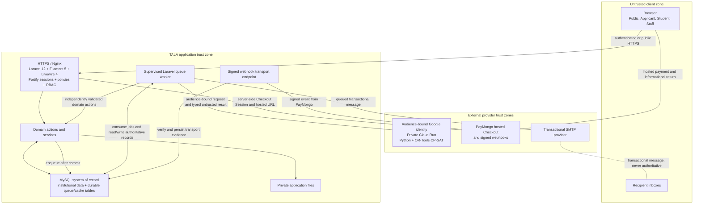
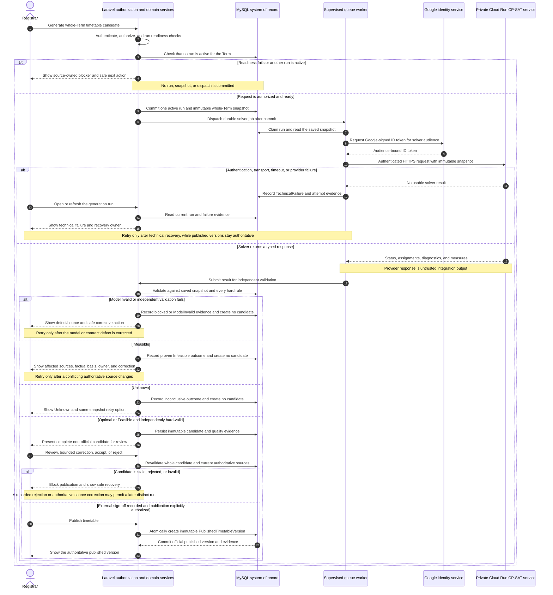
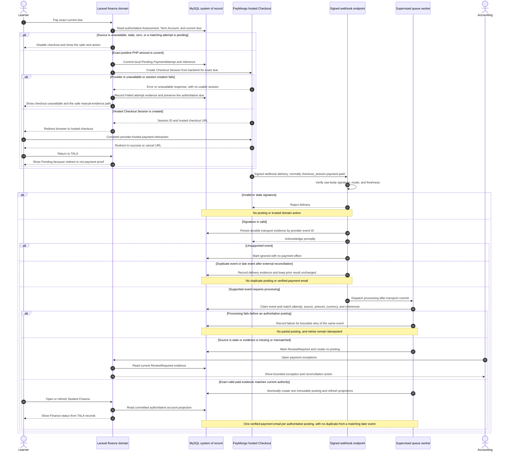
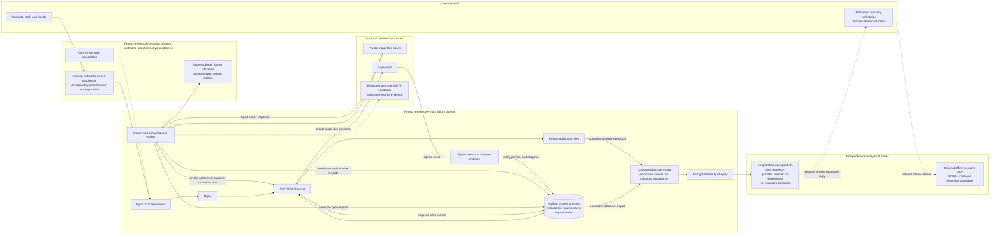

# TALA System Architecture Specification

## Table of Contents

1. [Purpose, Scope, and Evidence Basis](#1-purpose-scope-and-evidence-basis)
    - [Evidence Language](#11-evidence-language)
2. [System Responsibility and Institutional Boundary](#2-system-responsibility-and-institutional-boundary)
3. [Architectural Classification](#3-architectural-classification)
    - [Application Architecture: Domain-Organized Layered Monolith](#31-application-architecture-domain-organized-layered-monolith)
    - [System Topology: Hybrid Service-Integrated System](#32-system-topology-hybrid-service-integrated-system)
    - [Integration Style: Request/Response with Asynchronous Supporting Workflows](#33-integration-style-requestresponse-with-asynchronous-supporting-workflows)
    - [Data Architecture: Centralized Relational System of Record](#34-data-architecture-centralized-relational-system-of-record)
    - [Why This Shape Was Selected](#35-why-this-shape-was-selected)
    - [Why Microservices Were Not Selected](#36-why-microservices-were-not-selected)
4. [Logical Domain Structure](#4-logical-domain-structure)
    - [Admissions-to-Enrollment Boundary](#41-admissions-to-enrollment-boundary)
    - [Academic-Authority-to-Enrollment Boundary](#42-academic-authority-to-enrollment-boundary)
    - [Registration-to-Official-Enrollment Boundary](#43-registration-to-official-enrollment-boundary)
    - [Official-Enrollment-to-Academic-Record Boundary](#44-official-enrollment-to-academic-record-boundary)
5. [Runtime Component Architecture](#5-runtime-component-architecture)
    - [Primary Request Flow](#51-primary-request-flow)
    - [Queue Operations](#52-queue-operations)
    - [Academic Timetabling Is Not Laravel Task Scheduling](#53-academic-timetabling-is-not-laravel-task-scheduling)
6. [Data Architecture and Integrity](#6-data-architecture-and-integrity)
    - [Why MySQL Fits the Domain](#61-why-mysql-fits-the-domain)
    - [Transaction and Concurrency Rules](#62-transaction-and-concurrency-rules)
    - [Auditability](#63-auditability)
    - [Authority-Hardening Implementation Boundaries](#64-authority-hardening-implementation-boundaries)
7. [User Interface Architecture](#7-user-interface-architecture)
    - [Why Filament and Livewire Were Selected](#71-why-filament-and-livewire-were-selected)
    - [Why a Separate SPA Was Not Selected](#72-why-a-separate-spa-was-not-selected)
    - [Authorization Rule](#73-authorization-rule)
    - [Browser Failure Presentation Boundary](#74-browser-failure-presentation-boundary)
8. [Security and Trust Boundaries](#8-security-and-trust-boundaries)
9. [External Integrations](#9-external-integrations)
    - [CP-SAT Scheduling Service](#91-cp-sat-scheduling-service)
    - [PayMongo](#92-paymongo)
    - [Transactional Email](#93-transactional-email)
10. [Automatic Scheduling: Research and Product Justification](#10-automatic-scheduling-research-and-product-justification)
    - [Comparison with Existing Approaches](#101-comparison-with-existing-approaches)
    - [Why OR-Tools CP-SAT Was Selected](#102-why-or-tools-cp-sat-was-selected)
11. [Dependency Architecture](#11-dependency-architecture)
    - [Active PHP Runtime](#111-active-php-runtime)
    - [Declared Packages Requiring Deliberate Disposition](#112-declared-packages-requiring-deliberate-disposition)
    - [Frontend Runtime](#113-frontend-runtime)
    - [Solver and Engineering Tooling](#114-solver-and-engineering-tooling)
    - [Compatibility and Minimum Requirements](#115-compatibility-and-minimum-requirements)
12. [Deployment and Operational Architecture](#12-deployment-and-operational-architecture)
    - [Degraded and Failure Behavior](#121-degraded-and-failure-behavior)
    - [Capstone Acceptance versus Prospective Production](#122-capstone-acceptance-versus-prospective-production)
13. [Estimated Deployment and Operating Costs in Philippine Peso](#13-estimated-deployment-and-operating-costs-in-philippine-peso)
    - [Pricing Basis and Assumptions](#131-pricing-basis-and-assumptions)
    - [Project Reference Fixed-Cost Baseline](#132-project-reference-fixed-cost-baseline)
    - [One-Time Client Backup Hardware](#133-one-time-client-backup-hardware)
    - [Operating Scenarios](#134-operating-scenarios)
    - [Variable and Conditional Charges](#135-variable-and-conditional-charges)
14. [Traditional and Commercial SIS Cost Comparison](#14-traditional-and-commercial-sis-cost-comparison)
15. [How the Client Saves Money: The Value Proposition](#15-how-the-client-saves-money-the-value-proposition)
    - [How Savings Must Be Measured](#151-how-savings-must-be-measured)
16. [SDLC and Architecture Governance](#16-sdlc-and-architecture-governance)
    - [Refined SDLC Classification](#161-refined-sdlc-classification)
    - [Evidence and Academic Integrity](#162-evidence-and-academic-integrity)
17. [Risks and Decision Summary](#17-risks-and-decision-summary)
    - [Principal Risks](#171-principal-risks)
    - [Final Architecture Decisions](#172-final-architecture-decisions)
18. [Sources and References](#18-sources-and-references)
    - [Internal System Evidence](#181-internal-system-evidence)
    - [Framework, Data, and Architecture Sources](#182-framework-data-and-architecture-sources)
    - [Academic Record and Policy Sources](#183-academic-record-and-policy-sources)
    - [Timetabling and Solver Sources](#184-timetabling-and-solver-sources)
    - [Cost and Local-Market Sources](#185-cost-and-local-market-sources)
    - [SDLC Sources](#186-sdlc-sources)

## 1. Purpose, Scope, and Evidence Basis

**T.A.L.A.** (Tertiary Academic Lifecycle Administration) is a college-focused student information and academic operations system designed for Servitech Institute Asia (SIA). It provides one governed digital record across applicant intake, admission decision, enrollment readiness, academic setup, scheduling, registration and official enrollment, assessment and payment evidence, official outputs, grades, learner self-service, contextual operational views/exports, and audit.

This specification describes TALA's target architecture after Clinic 0 and Clinics 1–6, canonical `00`–`06` consolidation, cross-module resolution, essential-capability review, and authority hardening were approved. The complete authority set is ready for separately planned journey-complete vertical delivery. This specification does not authorize application or schema changes. It explains:

- what architectural style the system uses;
- how its components, data, users, and external services interact;
- why its framework, structure, database, dependencies, and deployment model were selected;
- how its automated academic scheduling differs from a conventional SIS and a mature university timetabling product;
- how the system behaves when a dependency is unavailable;
- what the operating-cost estimate includes and excludes; and
- how the architecture can create measurable institutional value without overstating unproven savings.

The authority basis is the product requirements in `prd_modules/` and the UI surface blueprint. The current application and solver source, package manifests, configuration, automated tests, qualified references, and historical measurements are implementation or supporting evidence only; they cannot prove that a target contract is implemented until the later bounded code-reconciliation stage. Laravel Boost version-specific documentation and the dated external sources in Section 18 support technical and policy claims within their stated scope.

### 1.1 Evidence Language

The following terms prevent design intent from being confused with operational proof:

- **System requirement** — behavior or infrastructure required for the completed system.
- **Current implementation evidence** — a mechanism represented in application source or tests; it is conformance evidence, not proof that the target requirement is accepted or operational.
- **Current configuration evidence** — a repository or provider setting observed at a stated time; it may drift and does not by itself prove a working end-to-end capability.
- **Operational evidence** — deployment records, provider invoices, monitoring, restore tests, or institution-signed acceptance evidence.
- **Planning selection** — a chosen direction or recalculable scenario that still requires implementation, procurement, or operational proof.
- **Project-authorized engineering target** — a bounded technical objective approved for TALA because it is proportionate to the product risk and operating context; it is not a law, regulator rule, Servitech policy, SLA, current configuration, or achieved result.
- **Capstone acceptance evidence** — bounded proof of the approved new-system journeys using authorized synthetic data; it is not a production-capacity, migration, backup, or service-level claim.
- **Prospective production claim** — a future production requirement or procurement gate. It must not be written as achieved until current operational evidence proves it.

Vendor feature and price statements are cited as vendor-published information. They do not prove equal scope, quality, availability, or institutional fit.

---

## 2. System Responsibility and Institutional Boundary

TALA is the system of record for approved in-scope academic lifecycle records and recorded office results. It does not replace the authority of the Registrar, Accounting Office, Academic Head, Faculty, or System Administrator.

| Responsibility | TALA performs | Human authority retained |
| --- | --- | --- |
| Applicant intake and admission | Captures the minimum application, versioned preliminary evidence, scoped corrections, decisions, official-credential outcomes, and derived enrollment readiness | Registrar evaluates identity evidence, completeness, admissibility, and credential outcomes |
| Enrollment-ready admissions projection | Makes the same ready application visible to registration without copying it or creating a Student | Registrar and Clinic 4 perform registration, placement, finance clearance, and official-enrollment finalization |
| Academic setup | Stores terms, calendars, curricula, courses, offerings, rooms, and faculty eligibility | Academic and Registrar staff approve institutional rules and source records |
| Timetabling | Produces and validates candidate schedules from explicit constraints | Authorized academic staff review, correct, approve, publish, and revise |
| Current-term registration and enrollment | Derives or records bounded proposals, validates five checkpoints, reserves capacity, and atomically publishes official registration/COR effects | Learner confirms the proposal; Registrar owns academic placement/finalization; Accounting owns clearance evidence |
| Accounts and payment evidence | Derives one continuous Term Account, current-due position, bounded Clinic 4/5 projections, verified postings, and non-tax account outputs from an ordinary published plan or an exact authorized individual result | Accounting publishes fixed Fee Plans, externally calculates and authorizes eligible individual assessments, checks external/manual evidence, resolves exceptions and corrections, and issues any required tax document outside TALA |
| Grades | Stores draft, submitted, reviewed, and released grade records | Faculty submit; authorized academic or Registrar staff return or release |
| Official outputs and contextual extracts | Generates the seven canonical outputs and the fixed roster/finance contextual extracts from authoritative records | The owning office controls official issuance/correction; the current roster extract creates no issuance event; physical signature, seal, delivery, CAV, and any external registered invoice remain external |
| Audit and operational views | Records material actions and produces role-scoped owning-workflow views; Clinics 4–5 provide one current per-Class-Offering roster CSV and Clinic 6 provides the two approved contextual finance CSVs | Institutional policy determines review, retention, and response |
| Regulatory submissions | Retains authoritative in-scope program, enrollment, academic-record, and completion sources that may later support an exact approved return | Servitech's authorized regulatory officers prepare, reconcile, certify, and submit HEMIS, Enrollment List, Promotional Report, List of Graduates, Special Order, CAV-supporting, and other regulator-prescribed returns outside TALA until an exact approved contract exists |

External providers supply computation, communication, or payment evidence. They never become the authoritative academic or financial record.

---

## 3. Architectural Classification

TALA is best described across four complementary architectural dimensions.

### 3.1 Application Architecture: Domain-Organized Layered Monolith

The Laravel core is one deployable application with one configuration surface and one relational database. Its source is organized by institutional domain and technical responsibility:

- Filament pages and resources provide role-scoped presentation;
- actions and services coordinate application use cases;
- models and policies represent data, relationships, state, and authorization;
- jobs and notifications handle durable asynchronous work; and
- integration clients isolate external provider contracts.

This is a **domain-organized layered monolith**, not a strict modular monolith. Logical domains are visible in namespaces and service boundaries, but the application does not enforce independently deployable modules, isolated schemas, or package-level module APIs.

### 3.2 System Topology: Hybrid Service-Integrated System

The completed system combines:

1. the Laravel/MySQL core;
2. a separately deployable Python CP-SAT scheduling service;
3. PayMongo for external payment acceptance and signed event evidence; and
4. an SMTP provider for transactional email.

The solver is separated because optimization has a different CPU, memory, runtime, and deployment profile from ordinary SIS requests. Payments and email remain external because TALA should not implement card processing, e-wallet networks, or mail delivery infrastructure.

### 3.3 Integration Style: Request/Response with Asynchronous Supporting Workflows

Most user actions use ordinary browser-to-Laravel request/response processing and database transactions. Slow or externally triggered work uses queues and webhooks:

- schedule-solver dispatch is queued;
- payment webhook processing is queued;
- admissions submission, correction, decision, readiness, and withdrawal messages are queued;
- schedule release and revision messages are queued; and
- provider failures are recorded for controlled retry or review.

TALA is therefore not primarily event-driven. Queues, notifications, and framework events are supporting execution patterns inside a transaction-centered application.

Admissions submission, decisions, credential results, withdrawal, and readiness commit locally before their email is dispatched. A mail failure cannot undo the authoritative admissions action.

### 3.4 Data Architecture: Centralized Relational System of Record

MySQL stores institutional source records, workflow state, append-only Term Account events, candidate and published schedule records, audit evidence, and queue/cache tables. Downstream views such as Student Finance, COR, SOA, and contextual staff exports read from approved records in this shared relational source.

### 3.5 Why This Shape Was Selected

| Decision | Selected design | Main benefit | Accepted tradeoff |
| --- | --- | --- | --- |
| Core deployment | One Laravel application | Simple deployment, shared authorization, and atomic cross-domain transactions | A core application failure affects all workspaces |
| Domain organization | Actions, services, policies, and domain-oriented folders | Keeps business rules discoverable without distributed-system overhead | Boundaries require convention and review rather than independent deployment enforcement |
| Data ownership | One MySQL system of record | Referential integrity and consistent official outputs | Database availability is a central dependency |
| Long-running work | Database-backed queues | Durable asynchronous processing without a separate queue service at initial scale | Queue traffic competes with application database capacity |
| Optimization | Separate CP-SAT container | Isolates compute-heavy scheduling from web and database workloads | Adds a network and cloud-service dependency |
| User interface | Server-driven Filament/Livewire panels | Reuses PHP validation, policies, sessions, and domain services | Less client-side independence than a separate SPA |

### 3.6 Why Microservices Were Not Selected

Admissions, academic setup, scheduling, enrollment, finance, grades, and official outputs share tightly related records and institutional transactions. Splitting each domain into a network service would introduce API versioning, distributed authorization, data duplication, service discovery, observability, and cross-service consistency work without evidence that SIA requires independent scaling or release cycles.

The selected design preserves a service boundary only where the runtime characteristics are materially different: the CP-SAT optimizer. This is a purposeful boundary, not a partial migration to microservices.

---

## 4. Logical Domain Structure

| Domain | Principal records and responsibilities | Important consumers |
| --- | --- | --- |
| Platform foundation | Credential accounts, code-owned roles/permissions, typed domain or environment configuration, audit and operational events | Every authenticated workspace |
| Identity and access | Registration, invitation/activation, verified-email login, password recovery, Staff MFA, workspace resolution, panel access, and policy enforcement | Applicants, students, staff |
| Admissions and enrollment readiness | Admission Cycles, versioned requirement sets, applicant profiles, applications and snapshots, scoped corrections, preliminary evidence, decisions, identity-match reviews, official-credential results, and derived readiness | Registrar, Applicant Workspace, Clinic 4 registration queue |
| Academic setup, class planning, and timetable publication | Program authority, immutable Course Revisions and Curriculum Versions with explicit `Recurring` or `ExternallyArranged` scheduling treatment and bounded external-competency requirements, typed Term Calendar Packages with informational Examination Period, Term Cohorts, Class Offerings, Faculty/room readiness, whole-term solver snapshots, candidates, Laravel validation, immutable Published Timetable Versions, and revisions | Registrar, Academic Head, Faculty, Clinic 4 enrollment and Student schedule/COR projections |
| Current-term registration and enrollment | Registration Cases, proposal versions, eligibility effects, confirmations, reservations, shortages, official term/course registrations, adjustments, Course Drops, conditional Student activation, minimal Student profile/correction history, and COR versions | Registrar, Accounting, Faculty roster, Student Hub, Clinic 3 demand |
| Accounts and payment evidence | Versioned fixed Program-and-Term Fee Plans, Assessment versions based on `PublishedFeePlan` or `AuthorizedIndividualAssessment`, continuous Term Accounts, private/manual evidence, exact-due payment attempts, verified postings, append-only adjustments/reversals, and bounded Clinic 4/5 projections | Accounting, Clinic 4 Enrollment Clearance, Clinic 5 output issuance, Student Finance, non-tax SOA |
| Teaching, academic record, lifecycle, and completion | Official Class Offering rosters, final-result events, append-only externally verified competency results, GWA/evaluation projections, factual curriculum position and authorized academic decisions, lifecycle events, completion/conferral, and transcript snapshots/issuance | Faculty, Registrar, Academic Head, Student Academics, Clinic 4 registration, Clinic 6 output clearance |
| Learner workspaces | Applicant progress, student schedule, COR, Student Finance/SOA, grades, and contextual notices | Applicants, students, and read-only alumni |
| Outputs, health, governance, and audit | Authorized contextual exports, output access, local integration/backup evidence, institutional changes, operational events, and retention readiness | Office owners and System Administrator |

Domain rules belong in actions, services, policies, and models. Filament resources and pages orchestrate user interaction but are not the sole location of business rules. This keeps the same institutional rule reusable across staff actions, learner projections, jobs, commands, and tests.

### 4.1 Admissions-to-Enrollment Boundary

Clinic 2's conceptual boundary consists of `AdmissionCycle`, immutable `AdmissionRequirementSet` versions, `AdmissionRequirement`, `ApplicantProfile`, `AdmissionApplication`, `ApplicationCorrectionRequest`, `ApplicantRequirementResult`, `PreliminaryEvidenceVersion`, `OfficialCredentialResult`, `AdmissionDecision`, `IdentityMatchReview`, and derived `EnrollmentReadiness`. These names describe responsibilities, not approved physical tables.

Clinic 4 receives a read-only `ReadyApplicantProjection` carrying the same application reference, applicant identity, admitted program and path, current decision, verified identifiers, requirement version, credential results, readiness date, and unresolved post-enrollment follow-ups. Registrar and Clinic 2 retain ownership of `PostEnrollmentFollowUp` credential results; Clinic 4 preserves and may surface their references but does not reinterpret them as enrollment blockers. It does not receive a copied application and Clinic 2 does not create the Student profile, student number, Student role, registration proposal, enrollment, assessment, or class placement.

Admission-cycle opening, public closing, correction boundary, and requirement versions are admissions-owned source records. Public closing stops new applications and first submissions; the separate correction boundary governs issuance of new scoped requests, while an active correction, review, decision, and credential work continue. A general calendar may display these dates but cannot edit them, and System Administrator may report storage or mail health without gaining admissions-policy or decision authority. No public HTTP API, generic policy DSL, configurable state machine, universal override, or generic Settings record is introduced for this boundary.

### 4.2 Academic-Authority-to-Enrollment Boundary

Clinic 3 is one logical domain journey rather than three peer subsystems. Its conceptual boundary contains `ProgramAuthority`, stable `Course` plus immutable `CourseRevision`, simple `CourseRequisite` and `CourseEquivalency`, `WeeklyMeetingRequirement`, immutable `CurriculumVersion` and `CurriculumEntry`, bounded external-competency requirements, typed `TermCalendarPackage` records with an informational Examination Period, `TermCohort`, `ClassOffering`, Faculty and room readiness records, immutable solver runs/snapshots/candidates, and immutable published timetable versions and revisions. These names describe responsibilities, not approved physical tables.

Externally approved academic decisions are recorded with authority evidence. TALA does not reproduce regulator, committee, HR, workload-approval, practicum-placement, or timetable-sign-off workflows. Courses without a genuine recurring class meeting remain curriculum records and are excluded from CP-SAT rather than receiving fabricated timetable hours.

First, Second, and approved Special Terms share the same `TermCalendarPackage`, `ClassOffering`, solver, publication, registration, account, and academic-record boundaries. A Special Term must carry its approved particular schedule and attributable class-hour/class-day basis. `Additional` may identify an externally approved retake/catch-up class, but no separate Summer scheduler, tutorial aggregate, universal Special Term unit default, or learner classification is introduced.

The Term Calendar Package projects one institution-approved Examination Period with inclusive Asia/Manila dates, authority, effective package version, owner, and as-of evidence to Registrar, Academic Head, Faculty, and Student contexts. Exact class arrangements remain Faculty-owned. Missing or stale evidence produces a named unavailable state and no inferred date. TALA adds no class-level examination record, exam timetable, rooms/proctors/seating/permits, assessment content, email, output, generic event system, or financial examination hold.

An external-competency requirement exists only inside an exact approved Curriculum Version and is `TrackedOnly` unless the curriculum authority expressly makes it `CompletionRequired`. Supplied evaluation sheets cannot create a completion rule. TESDA/accredited entities own assessment and certification; TALA records no application, schedule, venue, assessor, fee, issuance, renewal, or registry operation.

Clinic 4 receives one read-only `PublishedClassAvailabilityProjection` containing the applicable curriculum term totals, requisites, approved equivalencies, published Class Offerings, capacities, and official meeting times. Clinic 4 returns bounded aggregate `UnmetClassDemandProjection` evidence. Clinic 3 may generate Draft Class Offerings from active curricula, confirmed standard-curriculum cohorts, forecasts, and that demand evidence; Registrar alone confirms, splits, shares, adds, or cancels them, and CP-SAT never creates or merges them. Clinic 4 alone owns current-term eligibility, proposed course registrations within the current Registration Case, learner confirmation, placements, reservations, finance clearance, official enrollment, conditional first Student activation, and COR. Clinic 5 owns full curriculum evaluation and official academic-history outcomes. Clinic 3 never creates a seat reservation or edits an enrolled Student's schedule directly.

First, Second, and Special Terms share these boundaries but remain exact-Term aggregates. More than one Term may be `Active` concurrently, including prior-term teaching or grade work during next-term registration or adjustment. Every package, projection, command, lock, idempotency key, event, account, timetable, roster, Registration Case, COR, and output includes the exact Term reference. No query, action, worker, or UI context may rely on one implicit institution-wide current term or let one Term's window, closure, failure, or source version control another.

Candidate and published timetables are separate. A local candidate adjustment fixes all other meetings and either creates a one-meeting immutable successor or changes nothing. An explicit repair fixes the requested meeting, solves the whole Term, minimizes the number of changed non-requested meeting assignments before applying ordinary quality, and exposes every change for whole-successor acceptance; hints alone are insufficient and no move is silent. Only Registrar publication creates an official immutable version. A targeted published change creates a Draft revision, revalidates the complete timetable, publishes a new version, and preserves the superseded version and exact impact. No public HTTP API, generic constraint profile, editable weight set, universal override, or generic academic Settings record is introduced.

### 4.3 Registration-to-Official-Enrollment Boundary

Clinic 4 contains no standalone Study Plan aggregate and no policy-driving Regular/Irregular Student status. One `RegistrationCase` owns immutable proposal versions under `EnrollmentSelectionBasis` (`StandardCurriculum` or `IndividuallyAdvised`). Its stored outcome is `Active`, `OfficiallyEnrolled`, `CancelledByLearner`, `CancelledByRegistrar`, or `NotEnrolled`; current stage and responsible owner derive from eligibility, confirmed proposal, valid placement, Accounting clearance/coverage, and Registrar finalization.

A terminal same-Term case returns to `Active` only through a Registrar action before the final authorized cutoff or, afterward, with exact late-enrollment authority. The transaction appends a reopen event to the same case/reference and recalculates all source versions and checkpoints; it restores no proposal, confirmation, seat, Assessment, clearance, or eligibility fact and never creates a duplicate case.

The Term Calendar Package owns the neutral `Enrollment` window's approved opening and closing dates. Clinic 4 owns only its fixed applicability: Ready Applicants, Standard continuing Students, Individually Advised continuing Students, or all otherwise eligible learners. No arbitrary audience or programmable window-policy engine is introduced.

Clinic 4 consumes:

- Clinic 2 `ReadyApplicantProjection` without copying the application;
- Clinic 3 `PublishedClassAvailabilityProjection` and publishes bounded `UnmetClassDemandProjection` evidence back to class planning;
- Clinic 5 `OfficialCourseResultProjection`, `AcademicEnrollmentEffect`, approved-credit/equivalency mappings, and effective lifecycle outcomes; and
- Clinic 6 `EnrollmentPaymentRequirementProjection`, whose source identifies `PublishedFeePlan` or `AuthorizedIndividualAssessment`, separates verified payment from Applied Approved Coverage, and identifies `VerifiedPayment`, `ApprovedCoverage`, `Mixed`, `NoPaymentRequired`, or `None`; clearance means the amount currently required is satisfied rather than requiring a universal zero balance.

Clinic 4 treats an unreleased, failed, incomplete, withdrawn, or dropped prerequisite as unsatisfied for its dependent course while keeping unrelated eligible courses available. It creates no provisional permission, substitute grade, or special pending-result state. A later satisfying released result changes eligibility only: Registrar uses the ordinary guarded Adjustment path to add the course while the window is open, or the same exact late-adjustment authority required for any other late add. A later grade correction that invalidates a prerequisite after Official Enrollment creates one result-impact review and never silently changes enrollment or the COR.

It publishes official term/course registrations, Faculty-roster and Student-schedule projections, immutable COR versions, and account/academic effects. First-ever official enrollment conditionally creates the minimal Student profile, permanent number, and Student access on the existing credential account; later terms reuse them. Registrar-owned official-profile correction records authority/evidence and append-only history, updates future projections, and never rewrites issued COR/TOR snapshots. Credential email/password/MFA remain Clinic 1. Finalization queues one official-enrollment/COR message, which also announces Student access only on first enrollment.

Reservations are deadline-bound capacity evidence, not enrollment. Published Class Offering or academic-result changes cannot silently move a learner or finalize cancellation while dependent placements are unresolved. Adjustment and Course Drop are separately authorized outcomes that atomically update placement, roster, schedule, account-review evidence, and COR version. An adjustment after the exact Term's window requires one recorded late-adjustment authority for the exact change; without it, current enrollment/COR remain authoritative and no mutation command is available. No generic override record, configurable workflow engine, ranked waitlist, global hold, public API, or duplicate enrollment ledger is introduced.

The fixed `PublishedFeePlan` basis governs ordinary registration. `AuthorizedIndividualAssessment` is available only for an approved Special Term, reduced enrollment whose approved charges differ from the fixed plan, an Individually Advised selection-specific result, or an authorized adjustment/Course Drop financial effect. It stores Accounting's exact externally calculated authority result and course/unit evidence but executes no formula. If neither basis is current, reconciled, and authorized, the projection is `Unavailable`, never zero or a fallback. A cost-increasing change waits for a successor Assessment and newly required clearance; a no-additional-cost change requires authoritative Assessment confirmation; and an authorized removal or Course Drop may take academic effect with Accounting review pending but no inferred refund, credit, penalty, or forfeiture. The COR preserves its assessment-at-finalization snapshot and may identify later review, while Student Finance/SOA alone owns the current position.

`ApprovedCoverage` records only an externally approved scholarship, sponsorship, government-subsidy, or other authorized-funding effect against an exact Term Account, Assessment, and obligation. Applied, superseded, and reversed events are append-only. TALA does not determine eligibility, administer applications or renewals, disburse funds, silently cap excess authority, reallocate coverage, infer refunds, or recreate a financial-accommodation module. Post-enrollment reversal may update current due but cannot revoke enrollment or create a global hold.

Every verified `PaymentPosting` binds to one Assessment version and records the exact amount applied to each named target obligation. The owning context supplies a bounded target set; TALA applies verified funds in published order, oldest due first, records no unassigned remainder, and never crosses a Term or prior debt. Exact PayMongo checkout binds to an immutable current-due obligation snapshot. Manual verification previews the same obligation effects, and reversal undoes those exact effects. This is a deterministic domain rule, not a configurable allocation engine.

### 4.4 Official-Enrollment-to-Academic-Record Boundary

Clinic 4 publishes official term/course registrations and roster membership. Clinic 3 supplies the official `ClassOffering`, designated submitting-Faculty assignment, course units/classification, Grade Entry window, and term-end date. Clinic 5 creates one `GradeRoster` per official Class Offering—including externally arranged courses without a recurring timetable meeting—and accepts only one controlled final result per officially enrolled learner.

Faculty calculates period grades and raw scores outside TALA. Clinic 5 stores no Preliminary/Midterm/Final values, formula engine, attendance gradebook, or released `P`. A complete roster moves through `Draft`, `Submitted`, `Returned`, and `Released`; only Registrar release creates immutable `OfficialGradeEvent` records. `INC` is accepted vocabulary and receives the fixed one-year inclusive Asia/Manila completion deadline from the original Term end. It becomes `CompletionOverdue` when unresolved after that deadline but never converts automatically to another grade. Without an authorized future extension, ordinary completion closes, the original `INC` remains no-credit, and the Student must retake the course. Registrar deadline amendments and released completion/correction results are append-only. Averages, prerequisites, advising, and completion follow PRD 05 without a grading-policy or approval engine.

Clinic 5 derives `AcademicAverageReadiness`, `TermWeightedAverageProjection`, `CumulativeGwaProjection`, `CurriculumEvaluation`, factual `AcademicEnrollmentEffect`, `CompletionReadiness`, `AcademicResultImpactReview`, and immutable transcript snapshots. The neutral one-term label is **Term weighted average**; an alternative such as **Term GPA** requires recorded Servitech terminology authority and an effective term. A partially released term is `GradesNotComplete` and produces no partial term or new cumulative value; a grade-complete term with no included units is `NotApplicable`, never zero. Cumulative GWA uses all included attempts and units rather than averaging term values. Clinic 5 exposes only released `OfficialCourseResultProjection`, current source-labelled `AcademicEnrollmentEffect`, approved credit/equivalency, and effective lifecycle facts to Clinic 4. Every initial release, INC resolution, or correction recomputes affected active Registration Cases and creates one idempotent review. Before finalization, invalid proposal/placement facts become stale; after finalization, current enrollment remains until a separately authorized Clinic 4 action. No academic-record change silently modifies registration.

Clinic 5 also records `ExternalCompetencyResult` only against an active authority-backed requirement. TESDA/accredited assessors own the judgment; Registrar records verified `Competent`/`NotYetCompetent` evidence, optional NC/COC reference/validity, safe remarks, and append-only reassessment history. `TrackedOnly` absence is **Not recorded** and cannot block a journey. `CompletionRequired` affects completion only under exact curriculum authority. No external result creates a grade, unit, average, prerequisite, finance, email, or standard-TOR effect.

Clinic 6 supplies bounded `OfficialOutputPaymentClearance` to transcript preview/issuance. Clinic 5 owns the fixed versioned **TALA Standard TOR — Servitech v1** layout and may record issuance after academic completion, identity verification, request-specific clearance, required signatory data, and output validation. Physical signature, seal, CAV, claiming, courier, diploma, and ceremony work remain external; a later Servitech format is a successor template version. No public HTTP API, academic-policy DSL, GWA editor, transcript-template editor, global hold, or duplicate academic-record store is introduced.

---

## 5. Runtime Component Architecture



### 5.1 Primary Request Flow

1. The user enters through the public site or an authenticated Filament panel.
2. Laravel authenticates the session and authorizes both panel access and the requested record/action.
3. The relevant action or service validates the institutional rule.
4. Related writes are committed in a database transaction.
5. Slow external work is dispatched only after the authoritative local state is recorded.
6. Learner and staff projections read from approved records rather than directly from provider responses.

### 5.2 Queue Operations

The database queue is appropriate while workload remains within the capacity of the primary database. Current implementation/configuration evidence checked on **August 13, 2026** resolves the Laravel HTTP client timeout to 330 seconds, with a repository fallback of 300 seconds; `ScheduleSolverDispatchJob::$timeout` is 360 seconds; and the database queue default `retry_after` is 420 seconds. The current application ordering therefore satisfies **Laravel HTTP client 330 seconds < job timeout 360 seconds < `retry_after` 420 seconds**. Cloud Run's separate 360-second service request ceiling does not replace the Laravel client limit, and its equality with the job timeout is not by itself a Laravel queue conformance defect. Solver attempts and backoff remain bounded and failures are recorded as operational evidence.

If a future deployment selects a 360-second Laravel HTTP client timeout, it must first increase the solver job timeout to a value strictly greater than 360 seconds and increase `retry_after` to remain strictly greater than that job timeout by a documented safety margin. That prospective selection requires coordinated configuration and verification; it is not the current application setting.

A production process supervisor must keep the queue worker running and restart it after failure or deployment. Redis and Laravel Horizon are an upgrade path when measured queue throughput, latency, or operations visibility justifies a dedicated queue/cache service; they are not prerequisites for the selected baseline.

### 5.3 Academic Timetabling Is Not Laravel Task Scheduling

Laravel's task scheduler is a cron replacement for executing commands at particular times. TALA's academic scheduler is an optimization model that assigns academic demands to faculty, rooms, days, and time blocks subject to constraints. They solve different problems:

| Term | Meaning in TALA |
| --- | --- |
| Laravel task scheduling | Infrastructure for running recurring commands; not the timetable generator |
| Queue scheduling | Delayed or retried processing of jobs |
| Academic timetabling | CP-SAT constraint optimization producing candidate class meetings |
| Student scheduling/sectioning | Assignment of individual students to already timetabled sections; outside TALA's optimizer scope |

---

## 6. Data Architecture and Integrity

### 6.1 Why MySQL Fits the Domain

TALA records are strongly relational: a Student belongs to a program and curriculum; official course registrations connect Students to Class Offerings; published meetings depend on Class Offerings, Faculty, rooms, and timetable versions; released results depend on official registrations and rosters; and a pre-enrollment or Student Term Account depends on the same human-subject identity continuity, RegistrationCase, Term, an Assessment version sourced from a fixed Fee Plan or exact authorized individual result, and immutable payment/account events.

MySQL was selected because it provides:

- foreign keys and unique constraints for referential integrity;
- transactions for multi-record institutional actions;
- row locking for concurrent enrollment, finance, and publication operations;
- `DECIMAL` storage for Philippine peso values;
- indexed relational queries for rosters, academic attempts, Term Account activity, curricula, contextual exports, and official outputs; and
- direct, mature Laravel and Eloquent support.

MongoDB can support transactions, but its document model would not remove the need to model these relationships and institutional constraints. TALA's workload benefits more from relational integrity and joins than from schema-flexible aggregate documents. Selecting MySQL is therefore a domain-fit decision, not a claim that document databases lack transactional capability.

### 6.2 Transaction and Concurrency Rules

- verified Payment Posting, account activity, and affected projections commit atomically.
- Enrollment and capacity-sensitive actions use transactions and appropriate row locks.
- First application submission assigns one stable reference and freezes the submitted snapshot atomically.
- One account is constrained to one application per Admission Cycle; admission decisions recheck cycle, correction, identity-match, requirement-version, and prior-decision facts server-side.
- Admission-decision corrections append a superseding decision rather than overwriting the earlier decision.
- Enrollment readiness is derived from the current admitted decision and required credential results. Clinic 4 consumes the same application projection and creates no duplicate admissions record.
- Admission public close and correction boundary are revalidated independently; issuing a new correction after its boundary requires an authorized boundary extension, while an existing active correction remains resubmittable and overdue never auto-rejects the application.
- Proposal confirmation locks and validates the current proposal version and Class Offering capacity before creating deadline-bound reservations. Expiry releases seats without deleting the case or payment evidence.
- Reopening a terminal Registration Case locks the same learner/Term record, revalidates cutoff or exact late authority and current sources, appends one event, and restores no prior checkpoint facts.
- Every-term official-enrollment finalization locks and revalidates all five checkpoints, converts reservations, records official term/course registrations, activates schedule/roster projections, creates immutable COR version 1, and publishes account/academic effects in one idempotent transaction.
- Proposal and finalization revalidate released prerequisite facts. An unreleased or unsatisfied prerequisite excludes only its dependent course; a later satisfying release never adds the course automatically and instead enables the ordinary Adjustment transaction with the same capacity, schedule, load, learner-confirmation, Finance, and window guards.
- First-ever finalization conditionally creates the minimal Student profile, permanent `SIA-YYYY-NNNN`, and Student access; continuing finalization cannot create duplicates.
- A cost-increasing adjustment locks its exact change version, open-window or exact late-authority source, and successor Assessment, then waits for the newly required clearance before atomically synchronizing official placement, roster, schedule, account projection, and a new COR version. A no-additional-cost change requires an authoritative Assessment confirmation. Closed-window requests without exact late authority expose no mutation path. An authorized removal or Course Drop may synchronize its academic effects and a new COR version while appending Accounting-review evidence; it never infers a refund, credit, penalty, forfeiture, or changed balance. Timetable impact is resolved before Clinic 3 finalizes an affected class cancellation.
- Schedule publication validates candidate ownership, revision state, and downstream impact before replacing official meetings.
- Candidate local adjustment and explicit minimal repair create immutable successors under full hard-rule validation; repair minimizes changed non-requested meetings before ordinary quality and commits only after whole-change acceptance.
- Grade-roster submission locks the current roster version and validates designated-Faculty authority, official membership, completeness, and final-result vocabulary. Registrar release is all-or-nothing, appends immutable official result events, recalculates academic projections, and creates idempotent exact-case impact reviews after commit.
- INC completion and authorized grade correction append superseding result events. A deadline amendment appends its own authority/reason history; deadline passage only derives `CompletionOverdue` and never writes a grade. Ordinary completion is accepted only while `CompletionOpen`; an authorized future extension may reopen an overdue result, otherwise the original `INC` remains no-credit and a retake becomes a separate attempt. Transactions revalidate the current unresolved event/version. Every initial release or released successor recalculates affected averages, curriculum evaluation, `AcademicEnrollmentEffect`, completion, requisite eligibility, and active-case projections while retaining history. Duplicate event handling returns the same review; registrations are never silently changed.
- Recording an external competency result locks and revalidates the Student's active Curriculum Version requirement, treatment, external evidence, and predecessor. Reassessment appends a successor and preserves the earlier attempt. Missing/stale authority posts nothing; tracked-only absence cannot block completion, and no grade, unit, average, prerequisite, finance, email, or standard-TOR effect is generated.
- A current-term full withdrawal or other lifecycle result synchronizes its authorized enrollment, seat, schedule, roster, COR, and Accounting-review effects without deleting released grades or inferring a financial outcome.
- Degree conferral atomically records the immutable degree result, final curriculum-evaluation snapshot, and `Completed` lifecycle event after all authoritative readiness facts are revalidated.
- Transcript snapshots are immutable. Issuance mistakes produce void/replacement links, while later legitimate academic corrections supersede rather than mutate an issued snapshot.
- Manual verification and payment webhooks lock the current Assessment/obligation snapshot, record exact applied amounts by obligation, and use source/idempotency identifiers so duplicate delivery cannot post the same payment twice; reversal corrects those exact effects.
- External calls do not silently convert an unverified provider response into an official academic or finance record.

### 6.3 Auditability

Material changes retain actor, timestamp, affected record, and relevant before/after or operational context. Audit records support review; they do not replace database backups, security monitoring, or institution-approved records-retention policy.

### 6.4 Authority-hardening implementation boundaries

- Server-side authorization, validation, current-state checks, effective-version checks, and producer-owned readiness are authoritative. Client state, hidden navigation, a disabled button, or a visual transition never proves permission.
- Transactions and appropriate row locks protect final-active-System-Administrator checks, unique admissions submission/decision, capacity/reservation, timetable publication, enrollment finalization, complete-roster release, payment/coverage posting, lifecycle/conferral, and official-output issuance.
- Immutable source references provide idempotency for cross-clinic projections, Student activation, enrollment finalization, emails, provider events, postings, and output generation. Retrying a completed action returns or projects the same result rather than duplicating it.
- Material stale or concurrent submissions fail atomically and preserve safe uncommitted text where practical. Academic, financial, security, publication, and official-output records are never silently merged.
- Private uploads use allowlisted PDF/JPEG/PNG type and 10-MiB size checks, actual MIME/signature validation, generated storage names, checksums, private storage, authenticated delivery, and access auditing. An original client filename is display metadata only.
- Contextual exports re-run purpose- and row-scoped authorization. Filament export selection or table visibility alone is not proof that every row may be exported. Cells are formula-safe and output access is audited.
- Sensitive account actions require recent password reconfirmation as defined by PRD 01. Login, MFA, resend, and token expiry use its explicit bounded limits rather than a generic retry engine.
- Hard deletion is limited to never-used, unreferenced drafts expressly allowed by the owning PRD. Authoritative records use named cancellation, withdrawal, disablement, unpublication, retirement, supersession, reversal, or voiding. No generic archive, deletion, confirmation, policy, workflow, or retry engine is introduced.

---

## 7. User Interface Architecture

TALA uses two deliberately different presentation surfaces:

1. an isolated Blade/Bootstrap public landing page; and
2. server-driven Filament/Livewire workspaces for applicants, students, and staff.

### 7.1 Why Filament and Livewire Were Selected

Institutional workspaces are dominated by authenticated tables, forms, filters, actions, status transitions, and record-level permissions. Filament and Livewire allow these surfaces to share:

- Laravel validation and authorization;
- Eloquent relationships and transactions;
- server-managed session cookies and CSRF protection;
- domain actions and policy checks;
- consistent tables, forms, notifications, and responsive layouts; and
- one PHP-centered implementation model for the capstone team.

### 7.2 Why a Separate SPA Was Not Selected

A React or Vue SPA would be valid if TALA required an independently deployed frontend, public third-party API, extensive offline behavior, or highly client-driven interaction. It would also require a stable API contract, separate client state, duplicated validation concerns, and an additional release surface.

The selected server-driven UI reduces those boundaries. It is not inherently more secure or faster than every SPA; its advantage is architectural fit and a smaller coordination surface for TALA's form- and workflow-heavy operations.

The final shared shell exposes only the PRD-owned destinations: Applicant Home/Application; Student Home/Enrollment/Academics/Finance/Profile; Registrar Admissions, Catalog & Curricula, Term Planning, Students & Enrollment, and Grades & Completion; Accounting Fee Plans and Student Accounts; Faculty My Availability/My Schedule/Grade Rosters; Academic Head read-only Academic Oversight; and System Administrator Users & Access/Public Content/System Health/Governance & Audit. There is no top-level Reports, Settings, Approvals, Readiness Center, duplicate integration-status, notification-center, or report-hub destination.

Every context has a deterministic first destination: Public Gateway, Applicant Home, Student Home, Registrar Admissions, Accounting Fee Plans, Faculty My Availability, Academic Head Academic Oversight, or System Administrator Users & Access. Single-role Staff enter directly; multi-role Staff choose one authorized context and then enter that context's fixed destination. Switching contexts resolves a fresh authorized entry and never carries a prior role's record route. This supplies an accountable starting state without creating a dashboard, merged work queue, or global learner/staff status.

At 1024 CSS pixels and above, the authenticated shell uses persistent left navigation, a top bar, and one main region. Below that width, navigation becomes a labelled modal drawer; TALA adds no role-specific bottom navigation or global search. The shell, navigation order, workspace switcher, Account Security entry, page-title/action hierarchy, breadcrumb/back-link rules, semantic landmarks, focus behavior, responsive transformations, visual tokens, and reusable component variants are governed by the UI Surface Blueprint. These presentation contracts reuse Filament/Livewire and the existing TALA brand direction; they do not introduce a SPA, a second authorization layer, a new public API, or a design-tool runtime dependency.

Every canonical UI entry is dispositioned as `NativeFilament`, `InstalledCompatibleDependency`, `FocusedTALACustom`, or `PurposefullyExcluded`. The disposition records the leanest approved presentation responsibility; it does not require one route, Page, or component per inventory row. Native Filament remains first, an already-installed compatible dependency is second, a small TALA-specific component is third, and a new dependency is considered only when those options cannot satisfy approved behavior.

Breadcrumbs appear only on genuinely hierarchical Staff detail/setup pages and never replace Wizard/process progress. Learner contextual records and outputs use a named return to their owning page. Each page has one H1 and one state-valid primary action; failed readiness leads supporting data; destructive or superseding actions remain explicit secondary decisions. The UI authority qualifies learner views at 390 and 360 CSS pixels, intermediate review at 768×1024, and dense Staff work at 1366×768 before implementation acceptance.

Student Home composes source-labelled priority summaries without creating a global learner state. Student Profile is a read-only projection of Clinic 4 official identity/program/curriculum/entry/contact facts with correction guidance; Account Security remains Clinic 1. Academic Oversight is a read-only set of links to source-owned academic evidence and grants no universal approve, publish, release, or correction action. Readiness stays contextual to the consuming action.

Clinic 4 uses one Student guided status Page, one Registrar Students & Enrollment workbench, one Accounting Enrollment Clearance queue, and authenticated read-only COR views. Native Tables own queues and filtering; Infolists and Sections own evidence; Forms own actual input; Action Groups own secondary actions. The page derives checkpoint state and exposes one valid primary action rather than reproducing a generic workflow or gate editor.

Clinic 5 uses Faculty Grade Rosters, one Registrar Grades & Completion workbench, one Student Academics Page, and authenticated unofficial-record/TOR print views. Native Tables own roster and review queues; controlled Forms own final-result, deadline-amendment, and verified external-result input; Infolists/Sections own released academic, INC deadline/history, examination-period, and external-competency evidence; Tabs organize Registrar decisions; and Action Groups contain secondary actions. The selected roster also owns one authenticated current Class Roster operational print and one fixed CSV action backed directly by Clinic 4 official membership. Both reauthorize the Class Offering and every row, expose no grade/contact/finance fields, record output access, and create no report destination, independent roster record, or official-output event. TALA Standard TOR — Servitech v1 is a fixed versioned output definition, not an editor. No custom gradebook, period-grade form, attendance surface, TESDA/certification destination, graduation batch, standalone policy editor, transcript-template editor, automatic grade action, or Student official-TOR action is part of the target architecture.

Clinic 6 uses Accounting **Fee Plans** and one **Student Accounts** workbench with Accounts, Payment Exceptions, and TOR Clearance tabs; one summary-first Student Finance Page with read-only alumni history; and System Administrator **System Health** and **Governance & Audit** Pages. Native Tables and filters own queues, including `Assessment required`; Sections and Infolists own current position and assessment-source evidence; private File Upload handles learner proof; focused Actions own publication, exact authorized-individual-assessment recording, verification, correction, and request-specific clearance; authenticated print views own the non-tax SOA and Payment Acknowledgment. Automatic retention disposal, legal-hold handling, and privacy-request/disposal operations remain external. No calculation builder, peer-resource finance navigation, Billing Slip, Official Receipt mapping, general ledger, report hub, provider operations console, or automatic-disposal UI is part of the target architecture.

CHED/HEMIS and other regulatory data returns are not a hidden reporting subsystem. TALA adds no speculative demographics, generic exporter, report designer, submission queue, portal integration, or certification action merely because another institution or a possible future form uses it. A later exact output requires the applicable authority, prescribed format, source-field mapping, privacy basis, institutional owner, submission procedure, and acceptance evidence before the affected authority may be reopened.

### 7.3 Authorization Rule

Navigation visibility is a usability control, not authorization. Panel access, resource operations, custom pages, actions, queries, downloads, and output access must be protected by policies or explicit authorization. Filament rechecks authorization during Livewire requests, while TALA's actions and services still enforce domain-specific rules.

### 7.4 Browser Failure Presentation Boundary

Laravel's exception pipeline remains the response authority. TALA supplies status-specific Blade views for `403`, `404`, `419`, `429`, `500`, and `503`, together with `4xx` and `5xx` fallbacks. The templates share one dependency-light layout and static stylesheet so a failure page does not depend on the Vite or Livewire runtime that may itself be unavailable. They state what happened and the safe next action without rendering exception details.

This is a presentation boundary, not a global exception transformation. Laravel content negotiation continues to produce JSON for API or JSON-expecting requests, Livewire retains its framework response lifecycle, and domain validation remains on the relevant Filament form or action. The browser pages do not change status codes, authorization, sessions, transactions, logging, or retry policy.

---

## 8. Security and Trust Boundaries

| Boundary | Control |
| --- | --- |
| Browser to Laravel | HTTPS, session authentication, CSRF protection, validation, and explicit rate limits on authentication, resend, recovery, upload, export, and other security-sensitive endpoints |
| User to panel | Panel-access rules and role/permission checks |
| User to record/action | Laravel policies and action-level authorization |
| Laravel to MySQL | Private credentials, least-privilege database account, transactions, and constrained schema |
| Laravel to Cloud Run | HTTPS and audience-bound Google identity token; private service invocation |
| PayMongo to Laravel | Signature verification, provider-event persistence, idempotent queued processing |
| Laravel to SMTP | Provider credentials stored outside source control; queued delivery and failure evidence |
| Documents and exports | Private-by-default storage, authorized retrieval, logged output access |
| Backup export to selected independent off-host repository | Transaction-consistent source, client-side encryption, TLS, repository-scoped credential, private storage, retained generations, and locally recorded integrity/outcome evidence |
| Optional off-host repository to recovery workstation and offline media | Named Infrastructure Custodian, separate institutional recovery-key custody, verified repository copy, encrypted independent media, safe unmount, disconnection, and separate physical custody when the optional layer is approved |

Admissions evidence is private and versioned. Each retained upload records its authorized owner, requirement, content metadata, checksum, replacement relationship, and review result. Preliminary acceptance never becomes official-credential verification through a file-state shortcut. LRN is masked outside authorized detail, cannot authenticate an account, and cannot be disclosed through candidate-match feedback.

Payment evidence is likewise private and versioned. Learner submission is a claim, not a payment. Only authorized Accounting review of the actual external source or an exact valid signed provider event may create an immutable verified posting. Proof files, bank details, raw provider payloads, credentials, signatures, and internal review notes never appear in exports or broad audit views.

Secrets must be injected through protected runtime configuration and must never be committed, rendered in administrative diagnostics, or included in logs. Integration status pages may report whether a credential is configured but must not reveal its value.

TALA supports institutional compliance work through access control, audit, retention-aware records, and privacy-oriented boundaries. Compliance with the Philippine Data Privacy Act remains an organizational responsibility involving policy, lawful processing, security operations, staff practice, and data-subject procedures; a software feature list alone cannot establish compliance.

The table above states target controls, not achieved production assurance. As of **August 11, 2026**, the repository and audited provider configuration do not establish all of the following operational facts:

- the selected database and private-file encryption-at-rest mechanisms, key custody, and recovery procedure;
- the production method for an external web host to obtain Cloud Run invocation credentials, or the accountable custody and rotation procedure for any credential material;
- the institution-approved security-log retention period, lawful deletion process, and review owner; or
- the configured alert channels, escalation path, and accountable operational owner for security or service events.

The private Cloud Run service and its dedicated invoker authorization are current configuration evidence; they do not settle external-host credential custody. Before production acceptance, the institution and its authorized infrastructure custodian must name the accountable owners and approve and evidence the mechanisms above. The independent-backup provider/tool and optional offline layer remain deployment selections; R2/restic and ORICO are evaluated candidates only. No named person, security-log retention duration, configured alert channel, implemented secret-custody mechanism, or achieved control is inferred here. PRD 01's bounded security evidence and PRD 06's `Not checked by TALA` presentation remain authoritative in the product UI.

---

## 9. External Integrations

### 9.1 CP-SAT Scheduling Service

The scheduling service is an isolated private Python/OR-Tools CP-SAT adapter. A read-only provider check on **August 11, 2026** confirmed the current promoted private `tala-scheduler-solver` Cloud Run revision in `asia-southeast1` as `tala-scheduler-solver-d5dstage2-665963443cc0`, receiving 100% of normal service traffic. Its observed profile is 8 vCPU, 16 GiB, eight solver workers, concurrency one, a 300-second solver limit, a 360-second Cloud Run service request ceiling, minimum zero instances, maximum two instances, and deterministic seed `20260718`. The service remains private; the dedicated invoker authorization was present and no public invoker was observed. This is dated current provider-configuration evidence, not a guarantee that the state cannot drift or that provider configuration alone proves production performance or external-host credential custody.

The product boundary remains an immutable whole-term source snapshot, a typed solver outcome, independent Laravel validation, human review, and Registrar publication. Historical 1/1, 2/4, 4/8, and earlier 8/8 or 8/16 benchmark profiles remain useful scaling and failure evidence only; none overrides the dated promoted profile or proves production capacity.

One solver demand represents one required recurring meeting block for one confirmed Class Offering. Courses without a genuine recurring master-timetable meeting create no demand. A candidate is untrusted integration output until Laravel revalidates whole-term completeness and every hard rule, and Registrar completes human review.

Official mechanics rechecked on **August 13, 2026** support the boundary without proving TALA conformance: [Cloud Run service-to-service authentication](https://cloud.google.com/run/docs/authenticating/service-to-service) requires a Google-signed OpenID Connect ID token whose audience identifies the receiving service or configured custom audience; a [Cloud Run request timeout](https://cloud.google.com/run/docs/configuring/request-timeout) closes the connection with `504` but may leave container work running; and [OR-Tools CP-SAT](https://developers.google.com/optimization/cp/cp_solver) defines `OPTIMAL`, `FEASIBLE`, `INFEASIBLE`, `MODEL_INVALID`, and `UNKNOWN`. TALA separately maps authentication, transport, timeout, and infrastructure failures to `TechnicalFailure`; that sixth product outcome is not an invented CP-SAT status.

#### Controlled Scheduling Flow

1. TALA assembles one immutable whole-term snapshot from the active Term Calendar Package, every confirmed and scheduling-ready Class Offering, required meeting blocks, linked cohorts, eligible Faculty, Faculty term capacity and declared hard unavailability, rooms, room hard unavailability, and authorized exact commitments.
2. A queued Laravel job sends the snapshot to the private solver service.
3. CP-SAT first finds complete hard feasibility and then applies the fixed lexicographic quality hierarchy: cohort mode switches, cohort idle time, Faculty load imbalance, Faculty idle time, room-seat waste, and stable earlier placement.
4. The adapter returns `Optimal`, `Feasible`, `Infeasible`, `Unknown`, `ModelInvalid`, or `TechnicalFailure` with typed evidence. It never publishes.
5. Laravel independently validates every returned assignment against the saved snapshot and institutional invariants.
6. Registrar reviews the complete candidate and may apply only bounded corrections that revalidate the whole candidate and waive no hard rule.
7. Registrar records any externally made sign-off and publishes an immutable `PublishedTimetableVersion`.
8. Faculty and Clinic 4-owned Student schedule/COR projections read only from the applicable published version.

#### Authoritative CP-SAT Integration Sequence

The following sequence is the authoritative target integration contract. Current Laravel jobs, clients, validation services, solver source, configuration, and tests corroborate parts of this path, but they remain implementation evidence and do not prove that the current formula or complete PRD 03 behavior is conformant.



#### Required Hard Constraints

- assign every included meeting block exactly once;
- prevent Faculty, room, and cohort overlap;
- respect the approved calendar grid, breaks, dated effects, and hard unavailability;
- respect room capacity, type, and required features;
- respect Faculty teaching eligibility, term load, and applicable preparation limits;
- respect required meeting patterns and linkage;
- provide at least 30 minutes for a cohort transition between Online and On-campus meetings;
- respect authorized exact commitments; and
- prove whole-term completeness again in Laravel before review or publication.

#### Required Soft Objectives

- minimize cohort mode switches;
- minimize cohort idle time;
- minimize Faculty load imbalance;
- minimize Faculty idle time;
- minimize room-seat waste; and
- use stable earlier day/time placement only as the final tie-breaker.

These objectives are lexicographic: a lower priority may not worsen a higher priority. The target contract is fixed and non-configurable. Later code reconciliation must prove conformance before they may be called implemented. Staff see the individual quality measures, not editable weights, one opaque score, or an “accuracy” percentage.

#### Scheduling Limitations

- The solver does not repair incomplete curricula, classes, rooms, Faculty eligibility, calendar facts, or authority records.
- It does not perform exam timetabling, event management, practicum operations, or individual student placement.
- `Feasible` is complete and hard-valid but not proven best; publication requires review and a recorded reason.
- `Infeasible` is a proof of impossibility; `Unknown` makes no feasibility or infeasibility claim.
- `ModelInvalid` identifies a model/contract defect; `TechnicalFailure` identifies service or integration failure.
- Failure evidence is deterministic and source-linked; it does not promise a mathematically minimal conflict set.
- Only one run is active per term. Equivalent reruns follow the result-specific source-change or recovery rules in PRD 03.
- The solver never publishes directly and cannot override institutional authority.

#### Runtime evidence and implementation-conformance boundary

The dated runtime profile above is the current promoted configuration and the accepted planning default unless later compatibility results, workload growth, formulation change, runtime telemetry, or a new provider check materially invalidates it. The promoted service still represents the historical `tal94-demand-v2` / `balanced_v1` revision. The current source contract is `tala-timetable-v2` with the fixed `lexicographic_v1` hierarchy; source and local compatibility evidence do not prove that this newer revision is deployed or active. Cloud build, tagged validation, and promotion remain a separately authorized post-publication operation.

Historical fixture, candidate-size, memory, status, validation, and scaling measurements remain bounded evidence in the archived [Representative Solver Evidence](archive/project-progress/TAL-96B2-Representative-Solver-Evidence.md) and [Cloud Run Capacity Benchmark](archive/project-progress/TAL-96B3-Cloud-Run-Capacity-Benchmark.md). Slice 3 reconciles solver code, Laravel integration, internal contract, formulation, schema, tests, fixtures, and deployable packaging. It reruns expensive capacity qualification only when local model-size, memory, runtime, or compatibility evidence invalidates the accepted profile; proportionate source-level acceptance still uses the coordinated Servitech workload.

### 9.2 PayMongo

TALA creates checkout only for the exact positive current due of an authoritative Term Account in PHP. The browser redirect is informational; it is not payment proof. An exact signed PayMongo event is persisted and processed idempotently before TALA creates one immutable verified posting. Account, amount, currency, institutional/provider reference, and idempotency must match; mismatch, recovery, refund, chargeback, or reversal evidence enters Accounting review and never exposes the raw provider payload.

If no signed event arrives, the local attempt remains `Pending`; elapsed time and browser return cannot confirm it. Accounting may check the actual provider/external source and use the same verified-external-payment path already authorized for manual evidence. The posting retains the attempt and external reference so a later matching signed event is an idempotent no-op and cannot create a second posting or email. TALA does not expose provider replay, settlement, refund, or control-panel operations.

#### Authoritative Hosted-Payment Integration Sequence

The following sequence is the authoritative target integration contract. Current checkout, signature-verification, transport-evidence, queue, and posting code corroborates parts of the path, but it remains implementation evidence until the future Clinic 6 reconciliation slice proves conformance with the authoritative Assessment and Term Account model.



PayMongo is selected because it provides locally relevant payment channels without TALA storing card or wallet credentials. The tradeoffs are transaction fees, provider availability, settlement rules, account verification, webhook operations, and vendor contract dependence.

Official provider mechanics checked on **August 13, 2026**: [Hosted Checkout quick start](https://docs.paymongo.com/docs/payment-channels-hosted-checkout-quick-start), [webhook key concepts and signature boundary](https://docs.paymongo.com/docs/developer-tools-webhooks-key-concepts), [webhook retry and idempotency guidance](https://docs.paymongo.com/docs/developer-tools-retry-logic), and the [webhook resource](https://docs.paymongo.com/reference/webhook-resource). These sources define provider transport behavior only; they do not define TALA's authoritative Assessment, posting, retry, or Accounting-review policy.

### 9.3 Transactional Email

SMTP carries verification, recovery, admissions, schedule, finance, and workflow messages. Clinic 1 owns verification/resend, password recovery, Staff invitation, email-change verification/alerts, account disable/reactivate, and Staff-role-change messages. Clinic 2 limits admissions email to submission confirmation, one consolidated Action Needed request, Admitted, Not Admitted, Ready for Enrollment, and withdrawal. Clinic 3 limits timetable email to a Faculty availability action request, first official publication to assigned Faculty, and one published-revision event. Clinic 3 owns the revision trigger and affected Faculty; Clinic 4 supplies affected officially enrolled Students and updated schedule/COR context. Clinic 4 separately limits email to the continuing-Student enrollment-window notice, proposal ready or materially revised, payment/coverage action required, official enrollment/COR ready, reservation release/case expiry, and official adjustment/Course Drop. On first enrollment, the official-enrollment/COR message also announces Student access. Neither first activation nor timetable revision creates a duplicate message. Clinic 5 limits email to Faculty grade-submission action, returned roster, grade release without values or attachment, INC release/deadline, deadline amendment, INC resolution, authorized correction, authorized academic/lifecycle decisions, completion action-required, and conferral notices. Deadline passage sends no email. Clinic 6 sends only one idempotent **Verified payment posted** message keyed to the posting reference; proof submission/rejection, checkout return, exceptions, TOR clearance, reversals, health, and exports send no email. Routine saves, validation/readiness/capacity checks, candidate generation/correction, academic calculations, queue movement, navigation, countdowns, and recurring reminders send no email. Email is a communication channel, not the source of truth. A failed email must not roll back an already valid institutional decision; it remains queued or recorded for authorized resend and operational follow-up.

The production requirement is one dedicated automated mailbox on an institution-owned domain, such as `notifications@the-approved-domain`, using provider-neutral authenticated SMTP. The project reference deployment uses Hostinger Business Email Starter; Laravel uses authenticated `smtp.hostinger.com` transport with TLS/STARTTLS on port 587, or the provider-documented SSL port 465 alternative, with credentials injected only through the protected deployment environment. This fixes the reference architecture and costing but does not claim institutional procurement or production readiness. An institution-owned human address may be configured as `Reply-To`, but this requirement does not create or assume a Staff mailbox suite.

Production mail readiness requires the adopted provider's domain records, including applicable MX, SPF, DKIM, and DMARC records, to be configured and verified, plus a recorded authenticated delivery test. Hostinger Business Email Starter currently publishes a per-mailbox limit of 1,000 inbound and 1,000 outbound messages per rolling 24 hours; those limits must be rechecked in hPanel if the reference deployment is adopted for production. Gmail is limited to development or manual-delivery-test evidence and is not a production-provider candidate. Automated tests continue to use Laravel's array or log mail transport and must not depend on a live provider.

Hostinger Email is the lean project reference provider because it can centralize the bounded SIS host, DNS, domain, and one automated mailbox under one institution-owned account. That reference choice is not a purchase or readiness claim, is not universally superior, and creates provider-concentration risk. Before real production, the institution must confirm ownership, procurement, delivery evidence, limits, DNS, privacy, and operational fit. Brevo remains an evaluated alternative candidate, not a priced commitment. Because Laravel keeps the SMTP contract provider-neutral and notifications queued, idempotent, and failure-safe, adopting or later changing the provider is a deployment-configuration decision rather than an application rewrite.

---

## 10. Automatic Scheduling: Research and Product Justification

University course timetabling is a constrained optimization problem, commonly described in research as the university course timetabling problem (UCTP). “UTC” is not one standardized product against which TALA can be compared. For a defensible comparison, TALA distinguishes the UCTP research problem from products such as UniTime and from conventional SIS implementations that primarily record or display schedules.

Research and product basis: [OR-Tools constraint optimization](https://developers.google.com/optimization/cp/), [UniTime course timetabling](https://help.unitime.org/course-timetabling), and [Gu, Li, and Chen's 2025 UCTP review](https://doi.org/10.3390/computation13010010).

### 10.1 Comparison with Existing Approaches

| Dimension | TALA | UniTime | Conventional SIS / qualified Academico reference |
| --- | --- | --- | --- |
| Primary scope | Integrated institutional SIS with controlled course-timetable generation | Comprehensive academic scheduling platform | Institutional record management; scheduling commonly centers on encoded course times and events |
| Optimization scope | Section meeting assignment for rooms, faculty, delivery groups, availability, and fixed institutional constraints | Course and examination timetabling, student sectioning, event management, and related scheduling functions | Product-dependent; an optimizer must not be assumed merely because schedule records exist |
| Input ownership | Approved TALA records are snapshotted and versioned before generation | UniTime's own scheduling model and integrations | SIS records and administrator input |
| Output control | Solver returns candidates; Laravel revalidates; authorized staff review, approve, and publish | Scheduling workflows are managed within UniTime | Staff encode, import, or generate records according to product capability |
| Downstream effect | Published meetings directly drive faculty, student, COR, room, and operational views | UniTime can integrate with external student-information systems | Schedule data is displayed or exported within the system's available modules |
| Institutional fit | Narrow, locally governed baseline designed around TALA's own academic and administrative rules | Broader mature scheduling platform with greater implementation and integration scope | Broadly configurable commercial or institutional workflow |

TALA's defensible contribution is not a claim that it invented CP-SAT, solved UCTP in general, or is algorithmically superior to mature timetabling systems. Its contribution is the governed integration of optimization into one institutional record:

- the exact approved inputs are preserved as an immutable scheduling snapshot;
- hard constraints and objective policy are explicit and versioned;
- solver output is treated as a candidate, not automatically as institutional truth;
- Laravel independently validates returned assignments;
- a human approval gate controls publication;
- published meetings become the single source for student, faculty, room, and document projections; and
- attempts, diagnostics, overrides, approvals, publication, and output access leave operational evidence.

This narrower boundary is beneficial when the institution needs an integrated SIS and an explainable timetable workflow without adopting a separate enterprise scheduling platform. It is also an honest limitation: institutions needing examination scheduling, individual student sectioning, or large-scale multi-campus optimization may require a broader product or a later extension.

### 10.2 Why OR-Tools CP-SAT Was Selected

| Approach | Decision and justification |
| --- | --- |
| Google OR-Tools CP-SAT | Selected. It is open source, suited to integer and Boolean constraint models, supports hard constraints and weighted objectives, returns useful statuses, and can run in a separately scalable container. |
| IBM CPLEX or Gurobi | Technically capable commercial alternatives. They were not selected for the baseline because license terms and recurring cost would weaken the low-cost deployment objective, while TALA's present model does not establish a need for their commercial feature sets. |
| Genetic algorithms, simulated annealing, or other metaheuristics | Useful research alternatives, especially for very large or specialized formulations. They were not selected because constraint satisfaction, infeasibility behavior, and repeatable validation are more direct in the present CP-SAT model. |
| Fully manual scheduling | Retained only as controlled correction and contingency. It has low software complexity but high staff effort, inconsistency risk, and limited ability to check many interacting constraints at once. |
| Adopt UniTime as the scheduling core | A credible option for institutions needing UniTime's broader scheduling scope. It was not selected because TALA requires a bounded, native workflow tied directly to its own academic, finance, access, and publication rules. |

Recent UCTP literature shows that exact solvers, commercial mathematical programming tools, constraint programming, metaheuristics, and hybrids are all used. That evidence supports CP-SAT as a reasonable engineering choice; it does not prove that TALA's current formulation outperforms other algorithms. Such a claim would require a disclosed benchmark dataset, common constraints, repeated runs, hardware and time limits, solution-quality measures, and statistical analysis.

---

## 11. Dependency Architecture

Versions in this section were verified from the installed dependency graph on **August 13, 2026 (Philippine Time)**. A dependency is justified only when its active responsibility is clear; presence in a manifest does not prove architectural use.

### 11.1 Active PHP Runtime

| Dependency | Verified version | Architectural responsibility and benefit |
| --- | ---: | --- |
| PHP | 8.2 | Selected runtime for the current Laravel ecosystem; the PHP 8.2 branch receives security fixes only through December 31, 2026 |
| Laravel Framework | 12.66.0 | HTTP lifecycle, routing, validation, ORM, transactions, queues, policies, notifications, storage, and testing conventions; Laravel 12 receives security fixes through February 24, 2027 |
| Filament | 5.6.7 | Role-oriented administrative workspaces built from server-defined resources and actions |
| Livewire | 4.3.1 | Stateful, reactive server-driven interactions without a separate SPA/API application |
| Laravel Fortify | 1.37.2 | Headless authentication actions including login, recovery, verification, and two-factor foundations |
| Caresome Filament Auth Designer | 3.1.0 | Presentation layer for branded Filament authentication pages; it does not replace the authentication authority |
| Spatie Laravel Permission | 6.25.0 | Persisted roles and permissions integrated with Laravel authorization |
| Spatie Activitylog | 4.12.3 | Auditable model and workflow activity where explicitly configured |
| Google Auth | 1.52.0 | Service-account credentials and identity-token creation for authenticated Cloud Run invocation |
| Guzzle | 7.15.3 | HTTP transport used by Laravel's outbound integration clients |
| Guzzle PSR-7 | 2.13.0 | PSR-7 request, response, stream, and URI implementation used by the HTTP transport |

Laravel, Filament, and Livewire are selected together because TALA is a form-, table-, policy-, and workflow-heavy institutional application. They keep UI behavior, validation, authorization, and transactions in one PHP system. A separate JavaScript SPA would add an API contract, duplicated validation and authorization concerns, client-state complexity, and another deployment surface without a demonstrated baseline requirement for disconnected clients or independent frontend teams.

The runtime lifecycle must be reconsidered before PHP 8.2 security support ends on **December 31, 2026** and before Laravel 12 security support ends on **February 24, 2027**. Laravel 13 remains a separate future dependency-compatibility, PHP-platform, and deployment decision; these dates do not authorize or imply an immediate framework upgrade.

Authenticated workspaces use native Filament components first and focused Tailwind CSS presentation only where Filament composition cannot express the approved behavior; Bootstrap remains isolated to the public landing page.

### 11.2 Declared Packages Requiring Deliberate Disposition

| Declared package | Verified version | Current architectural interpretation |
| --- | ---: | --- |
| Laravel MCP | 0.8.2 | Available to expose governed AI tools or resources, but it is not a production integration boundary while its application route is disabled. |
| Laravel Tinker | 2.11.1 | Developer diagnostic utility, not a production subsystem. |
| chillerlan/php-qrcode | 5.0.5 | Declared, but no active application reference establishes a current production responsibility. |
| Spatie Model States | 2.12.1 | Declared, but no active application reference establishes state-machine ownership. |

These packages must be either connected to an approved responsibility or considered for removal in a separate dependency review. Keeping unused runtime packages increases upgrade work and supply-chain exposure. Removal is intentionally not performed as part of this architecture document.

The PayMongo transport and signed webhook pipeline are application-owned. Previously declared Luigel PayMongo and Spatie Webhook Client dependencies were removed after live-reference and dependency audits proved that neither package owned an active runtime responsibility.

### 11.3 Frontend Runtime

| Dependency | Verified version | Architectural responsibility |
| --- | ---: | --- |
| Tailwind CSS | 4.1.18 | Utility-based styling and responsive layout, including Filament-aligned styling |
| `@tailwindcss/vite` | 4.1.18 | Tailwind compilation through Vite |
| Vite | 7.3.6 | Asset bundling and development build pipeline |
| Laravel Vite Plugin | 2.1.0 | Laravel-aware asset entry points and development integration |
| Alpine.js | 3.15.10 | Declared client-side interaction dependency; Filament/Livewire also provide their expected runtime behavior |
| Axios | 1.18.1 | Present in the default bootstrap layer, but not an architectural API client while the application entry point does not load that layer |
| Bootstrap assets | local landing-page assets | Isolated public-facing landing presentation, not the administrative component system |

Driver.js 1.4.0 has one approved optional responsibility: role-aware Quick tours inside authenticated Applicant, Student, and Staff workspaces. TALA supplies only a small wrapper for invitation, replay, role/version scope, target filtering, accessibility, reduced motion, and privacy behavior; Driver.js does not own navigation, authorization, business state, analytics, onboarding records, or a configurable tour editor. Filament's PHP `Heroicon` abstractions using Heroicons Outline are the canonical interface icon surface. The separately declared npm Heroicons package 2.2.0 has no independent production responsibility.

### 11.4 Solver and Engineering Tooling

The scheduling container uses Python 3.12 slim, Google OR-Tools 9.15.6755, Flask 3.1.3, and Gunicorn 26. Flask provides a small HTTP contract, Gunicorn provides the production process boundary, and OR-Tools owns optimization. The separation prevents Python solver dependencies from expanding the PHP web runtime.

| Engineering dependency | Verified version | Responsibility |
| --- | ---: | --- |
| Laravel Boost | 2.5.3 | Version-aware application inspection and framework-documentation retrieval for AI-assisted development |
| PHPUnit | 11.5.55 | Automated unit and feature behavior checks |
| Larastan | 3.10.0 | Laravel-aware static analysis |
| Laravel Pint | 1.29.1 | Consistent PHP formatting |
| Laravel Pail | 1.2.7 | Local log inspection |
| Laravel Sail | 1.62.0 | Containerized local-development option |
| FakerPHP | 1.24.1 | Deterministic-shape test data generation through factories |
| Mockery | 1.6.12 | Test doubles where an isolated collaborator is appropriate |
| Collision | 8.9.4 | Readable command-line errors and test output |
| Concurrently | 9.2.4 | Coordinates the local web, queue, log, and asset-development processes |

These are engineering controls, not user-facing production modules.

### 11.5 Compatibility and Minimum Requirements

The minimum requirements for TALA are not determined by Laravel alone. They are derived in the following order:

1. the product requirement identifies which users, workflows, devices, and institutional conditions must be served;
2. the strictest active client or server dependency establishes a theoretical technical floor;
3. application code and enabled framework features may raise that floor; and
4. TALA-specific browser, device, and load tests determine what the project may honestly claim as supported.

A dependency floor means that older software is outside the supported design. It does not prove that every TALA workflow works on every device above that floor. Conversely, a selected deployment size is an initial operating baseline, not a guaranteed minimum capacity. These distinctions prevent framework documentation, project policy, and measured system evidence from being presented as if they were interchangeable.

#### Browser compatibility basis

Tailwind CSS 4 is the controlling general browser dependency for TALA's authenticated workspaces. Its core requires Chrome 111, Safari 16.4, or Firefox 128. Vite 7's default production targets are lower than those limits, while the isolated Bootstrap landing page supports a broader range. The system-wide floor therefore follows Tailwind rather than allowing a user to reach the public page and then encounter an unsupported authenticated workspace.

| Browser family | Technical floor or TALA qualification baseline | Status and rationale |
| --- | ---: | --- |
| Google Chrome | 111 or later | Dependency-derived floor from Tailwind CSS 4 |
| Microsoft Edge | 111 or later | TALA qualification baseline aligned with Chromium 111; direct TALA testing is still required because Tailwind names Chrome rather than Edge |
| Mozilla Firefox | 128 or later | Dependency-derived floor from Tailwind CSS 4 |
| Apple Safari | 16.4 or later | Dependency-derived floor from Tailwind CSS 4 |
| Internet Explorer | Not supported | Does not satisfy the active frontend dependency floor |
| Other browsers, embedded webviews, and proxy or mini browsers | Not claimed | May work, but require explicit qualification before being described as supported |

For operational support, TALA should qualify the current stable and immediately preceding major releases of Chrome, Edge, Firefox, and Safari available on vendor-supported operating systems, never below the technical floors above. Browser security updates remain the responsibility of the institution and user; a browser meeting only the historical floor but no longer receiving vendor security support is not an acceptable managed-client baseline.

On phones and tablets, compatibility follows the browser engine rather than a separately invented device specification: Android access requires a qualifying Chrome release, while iPhone and iPad access requires a qualifying Safari release on a vendor-supported operating system. Embedded in-app browsers and unmanaged webviews remain outside the support claim until tested.

As of **Tuesday, July 14, 2026, Philippine Time**, targeted source inspection found no active `wire:transition`, Livewire scoped component styles, service worker, or web-app manifest that raises the current floor or establishes offline capability. Introducing any of those features, or upgrading Tailwind, Vite, Filament, Livewire, Alpine.js, or Bootstrap, requires this matrix to be reassessed.

#### End-user device and browser requirements

| Requirement | Minimum supported condition | Basis |
| --- | --- | --- |
| Browser execution | A qualified browser above with JavaScript enabled | Filament, Livewire, Alpine.js, and interactive validation/actions require client-side JavaScript |
| Session capability | First-party cookies enabled | Laravel session authentication and CSRF protection depend on the browser returning the session cookie |
| Network | Stable HTTPS connectivity while using TALA | TALA is centralized and not offline-first; no arbitrary Mbps claim is made without measured payload and latency tests |
| Files | Browser file selection, upload, and download support where the user's workflow requires documents | Applicant, records, and output workflows exchange files through authenticated server requests |
| Printing | Browser print and save-as-PDF capability | The seven canonical outputs use authenticated HTML/CSS print views in the MVP; the current Class Roster uses a separate authenticated A4 operational print that creates no official-output event |
| Device hardware | Any device capable of running a qualified browser and the required workflow | A fixed end-user CPU or RAM value is not justified by the framework and must not be invented without device testing |

Responsive support is role- and workflow-specific. The following dimensions are **qualification targets**, not yet proof that every screen has passed compatibility review:

| User surface | Required qualification viewport | Intended use |
| --- | ---: | --- |
| Public, applicant, and student-facing workflows | 360 × 800 CSS pixels or larger | Modern phone access, including Clinic 6 account status and non-tax outputs |
| Learner-facing and selected review workflows | 768 × 1024 CSS pixels or larger | Tablet access and intermediate responsive layout |
| Registrar, finance, administrator, output-review, and timetabling workspaces | 1366 × 768 CSS pixels or larger | Desktop operational baseline for dense forms, tables, comparisons, and scheduling controls |

Mobile-responsive styling does not by itself prove mobile usability. Before publication or production acceptance, representative users must complete the relevant workflows at the target sizes without hidden actions, inaccessible controls, unreadable tables, or dependence on hover-only behavior. A learner-facing mobile commitment does not automatically make every staff administration surface a phone-supported workflow.

#### Prospective production requirements and project reference deployment

| Layer | Required runtime or project reference | Evidence classification |
| --- | --- | --- |
| PHP application | PHP 8.2 or later with Ctype, cURL, DOM, Fileinfo, Filter, Hash, Mbstring, OpenSSL, PCRE, PDO, Session, Tokenizer, and XML extensions | Laravel 12 framework minimum; PHP 8.2 is security-fixes-only through December 31, 2026, so production runtime selection must be reconsidered before that date |
| Operating system and web server | Supported 64-bit Linux environment with Nginx and PHP-FPM, or a documented equivalent; only the Laravel `public/` directory is web-accessible | TALA deployment design and Laravel security requirement |
| Database | MySQL 8.4 baseline with InnoDB, transactional storage, and tested migrations | Project-selected and documented database baseline, not merely Laravel's lowest theoretical database version |
| Stateful infrastructure | Database-backed session, queue, and cache tables; private writable application storage; writable `storage/` and `bootstrap/cache` directories; provider-neutral independent encrypted off-host recovery requirement; R2/restic and the client-owned ORICO enclosure retained only as evaluated provider/offline-media candidates | Database-backed state is current configuration evidence; provider/tool selection, procurement, automation, ownership, optional media, and restore proof remain prospective operational gates |
| Long-running work | A supervised queue worker for the `scheduling` and `default` queues, with deployment-safe restart and monitoring | The database queue/job mechanism is current implementation evidence; production supervision, monitoring, alert route, and owner remain prospective requirements |
| Reference web host | Hostinger KVM 2: 2 vCPU, 8 GB RAM, 100 GB NVMe storage, and 8 TB published bandwidth | Project-selected reference host based on the provider's Philippine plan page checked August 13, 2026; institution procurement, account ownership, measured sizing evidence, and production acceptance remain unproven |
| Reference domain and DNS | Prefer a bounded subdomain of a suitable existing institution-owned domain; otherwise use a separately priced institution-owned `.com` domain and Hostinger DNS in the reference scenario | Project-selected identity and routing baseline for architecture and costing, not a procurement claim; `.edu.ph` remains an optional later alias/upgrade and an ordinary domain is not accreditation evidence |
| Reference transactional email | One Hostinger Business Email Starter mailbox dedicated to automated TALA mail, with provider-neutral authenticated SMTP and optional institution-owned human `Reply-To` | Project-selected reference sender; procurement, ownership, published-volume recheck, DNS authentication, delivery evidence, and account handover remain production-acceptance gates |
| Scheduling service | Private `tala-scheduler-solver` in `asia-southeast1`; promoted revision `tala-scheduler-solver-d5dstage2-665963443cc0`; Python 3.12 container; 8 vCPU; 16 GiB; eight solver workers; concurrency one; 300-second solver limit; 360-second Cloud Run service request ceiling; minimum zero and maximum two instances; seed `20260718` | Current provider-configuration evidence verified August 11, 2026. The current Laravel client/job/retry ordering was verified August 13, 2026; formula, broader internal-contract, queue-behavior, and accepted-result evidence remain for the future PRD 03 reconciliation slice |
| Network and trust | Valid TLS, DNS, firewall controls, private credentials, and outbound HTTPS/SMTP access for approved integrations | Security and integration requirement |

For the scheduling row, a **solver worker** is one CP-SAT search thread inside a request, while **concurrency one** means one HTTP solver request at a time per service instance. The settings are not interchangeable. The later slice must verify compatibility, observed memory, queue behavior, and accepted-result evidence before claiming the refined scheduling behavior is implemented.

The project reference 8 GB KVM 2 VPS co-locates Nginx, PHP-FPM, Laravel, MySQL, and an initial queue worker. Compared with the provider's KVM 1 tier, it doubles the published vCPU, memory, NVMe storage, and bandwidth and therefore supplies proportionate starting headroom rather than the smallest available tier. This reference choice does not prove sufficient capacity or institutional procurement. Any adopted host still requires monitoring of concurrent users, database size, document-upload volume, queue depth, response time, and recovery activity; sustained memory pressure, swapping, disk pressure, slow database queries, queue delay, or missed response/recovery objectives must trigger resizing or separation of the database and workers. Node.js and Python are not required on the web host when frontend assets are prebuilt and the solver remains externally deployed.

#### Development and build requirements

| Tool or service | Minimum or project baseline | Why it is required |
| --- | --- | --- |
| PHP | 8.2 or later | Matches Laravel 12 and the Composer platform contract; PHP 8.2 receives security fixes only through December 31, 2026 |
| Composer | Current supported Composer 2 release | Installs and validates PHP dependencies |
| Node.js | `^20.19.0` or `>=22.12.0` | Exact installed Vite 7 engine requirement; this excludes Node 21 and Node 22.0–22.11 rather than implying that every intermediate release is compatible |
| npm | A release supported by the selected Node.js version | Installs and builds the locked frontend dependency graph |
| MySQL | 8.4 project baseline | Matches the documented data-platform target for migrations and tests |
| Python | 3.12 with the pinned solver requirements | Required only when developing or testing the external scheduling service locally |
| Supported browsers | The qualification matrix above | Required for visual, interaction, print, upload, and responsive verification |
| Docker or Laravel Sail | Optional | Reproducible local environment option, not a mandatory production dependency |

The development operating system is not fixed by the architecture. Windows and supported Linux environments are acceptable when they can run the required versions and reproduce the same application, database, asset-build, test, and solver contracts.

#### Compatibility and capacity verification rule

The browser support statement must be backed by recorded manual or automated real-browser evidence for critical flows, including public navigation, authentication and session behavior, applicant document handling, student finance and printable outputs, Filament tables/forms/modals, staff authorization failures, and scheduling submission and result review. PHPUnit component and feature tests remain necessary but do not prove browser layout, JavaScript interaction, printing, or viewport usability. Any automated browser-test dependency requires its own approved dependency change; until then, a dated manual compatibility matrix is acceptable evidence.

Production sizing must similarly be qualified with realistic data and concurrency rather than inferred from a successful local run. The institution must record the tested dataset, concurrent-user model, request mix, queue workload, solver invocation pattern, response-time objective, error rate, and resource measurements. For CP-SAT, the record must also include demand, candidate, variable, and constraint counts; solver status; coverage; hard-constraint validation; objective bound and relative gap when a solution exists; and OOM or timeout evidence. Compatibility and sizing evidence must be refreshed before production acceptance and after a material dependency, topology, scheduling-rule, or workload change.

---

## 12. Deployment and Operational Architecture



The project reference topology uses one Hostinger KVM 2 VPS as a lean self-managed starting point with deliberate initial headroom, not as a highly available or indefinitely scalable platform. Nginx terminates web traffic, PHP-FPM runs Laravel, MySQL holds authoritative data, and a supervised queue worker processes asynchronous work. Keeping the reference VPS, domain/DNS, and one automated-sender mailbox in one Hostinger account reduces handoff and billing surfaces but concentrates account, provider, DNS, mail, application, and database risk. Portable DNS records, provider-neutral SMTP configuration, documented deployment procedures, an independent encrypted off-host backup, and measured resource monitoring provide escape paths; they do not prove procurement, eliminate migration work, or replace evidence-based scaling. Hostinger's included weekly VPS backup and controlled snapshot remain supplemental recovery layers rather than the independent copy.

If the reference deployment is adopted for real production, the Hostinger owner account must be registered to and controlled by the institution, protected by MFA, and retained through handover. Developers receive delegated access rather than shared owner credentials. The institution owns renewal payment methods, a renewal calendar and accountable renewal contact, and recovery access. Application, database, SMTP, and provider credentials remain only in the protected deployment environment. The independently controlled encrypted backup remains outside the primary-host provider, failure, and owner-account boundary; an offline copy is optional when the approved deployment plan justifies it.

Philippine privacy authority requires a proportionate continuity process covering personal-data backup, restoration, remedial time, and periodic review/testing. It does not prescribe a numeric recovery objective. The following is therefore a **provider-neutral prospective production contract**, not a law- or Servitech-mandated policy, SLA, capstone journey requirement, current control, or achieved recovery claim:

- The live MySQL database and private application storage are the sole authoritative operational source. Backups are time-bounded disaster-recovery copies and never remove, archive, or replace live `Completed`/alumni, academic, enrollment, account, or official-output records.
- Hostinger's included weekly VPS backup and one controlled pre-change snapshot are the reference topology's supplemental infrastructure-recovery points. An independent copy must remain outside the primary Hostinger provider, failure, and owner-account boundary before real production.
- One non-overlapping operating-system job creates a transaction-consistent export of authoritative application data, required private documents and reproducible official-output source files, plus a manifest containing backup time, application revision, migration state, and integrity evidence. Authoritative audit, payment, webhook, email-idempotency, and correction evidence are protected. Rebuildable caches and sessions, temporary exports, replaceable build files, Git-held source, and recovery secrets are excluded or rebuilt.
- The export is encrypted client-side before it leaves the host and is written to a private institution-owned off-host repository. The selected provider must support scoped credentials, integrity verification, recovery, institution-owned billing, and the institution's approved processor and international-transfer safeguards. Provider-side encryption is supplemental.
- Cadence, retention, retry, alerting, integrity checks, and isolated-restore frequency are fixed in the deployment runbook against the approved recovery objectives and measured data volume; they are not TALA UI behavior.
- Cloudflare R2 with a restic-compatible repository is the currently evaluated object-storage candidate. The client-owned ORICO enclosure with independent encrypted drives is an optional offline-copy candidate. Neither candidate is selected unless procurement, privacy, custody, capacity, and restore evidence support the final deployment decision.
- Before production acceptance, an isolated end-to-end restore records the selected generation, measured data loss, measured restoration duration, integrity result, critical-journey result, owner, and remediation.
- TLS renewal, host patching, least-privilege credentials, firewall controls, queue/disk/database/HTTP/integration monitoring, log rotation, and escalation remain part of the production operating baseline.
- VPS/database separation or resizing remains evidence-triggered by workload, maintenance, or tested recovery results rather than the 47-person synthetic acceptance profile.

Selecting a provider is not proof of recovery. Production still requires an implemented consistent export, monitored scheduling, current verified generations, scoped credentials, retained keys, and successful restoration. The institution remains the Personal Information Controller and owns the selected host, backup-provider, domain/DNS, email, billing, and recovery accounts. Its privacy/DPO authority approves the processor, transfer, retention, optional removable-media, and lawful-disposal rules. A named **Infrastructure Custodian** operates monitoring, recovery, and escalation. Developers may configure and document the mechanism during deployment but must not retain sole owner credentials after handover.

The primary host receives only a repository-scoped credential. The client-side encryption/recovery key is not stored solely on that host, with its provider, or in the selected backup provider; controlled institutional recovery copies are required. No credential, personal-data payload, provider control, shell command, media command, or restore action appears in TALA. The existing System Health surface may show only safe locally recorded job outcome, latest verified generation/as-of time, overdue state, and next action; provider and physical-media state remain `Not checked by TALA` without separately imported approved evidence.

Recovery first provisions or validates clean infrastructure and restores the newest valid independent generation into isolation. A primary-host provider backup may accelerate infrastructure restoration, but newer independent authoritative data must then be reconciled. If the primary independent source is unavailable, the deployment runbook selects the next verified source, including an approved offline copy when one exists. Before authorized cutover, the custodian verifies the manifest, database, private files, authentication, and critical journeys; invalidates restored sessions; clears rebuildable caches; reconciles queued/integration work idempotently; and reapplies any externally recorded lawful disposition made after the selected generation.

The prospective-production **recovery-point objective (RPO) is six hours**: the project targets losing no more than six hours of authoritative database and private-file changes after a serious failure. The **recovery-time objective (RTO) is eight elapsed hours**: after recovery is formally declared and the required accounts, keys, media, infrastructure, and personnel are available, the project targets restoring the core authenticated SIS with verified authoritative data within eight hours. External integrations may remain explicitly degraded. These are planning targets to test, not Servitech policy, law, SLA, current capability, or capstone acceptance criteria, and they do not become achieved until operational restore evidence proves them.

As of **August 13, 2026**, the provider-neutral recovery contract is defined, while Cloudflare R2/restic and the ORICO offline layer remain evaluated candidates. No tracked evidence proves final provider procurement, production automation, alert delivery, named-person assignment, current retained generations, optional media rotation, or a successful end-to-end restore. Those remain production gates and must never be presented as operating controls before evidence exists.

The client-supplied **ORICO 9548U3** is retained only as evaluated optional offline-copy hardware. Its host connection is USB 3.0 Type-B with a maximum interface rate of 5 Gbps; internally it uses a SATA 3.0 bridging scheme for compatible SATA HDDs. ORICO specifies push-pull installation, Windows/macOS/Linux compatibility, a built-in 150 W power supply for the four-bay version, and a maximum supported capacity of 64 TB. The priced two-drive 4 TB scenario is conservative planning evidence, not a legal, capstone, or production requirement derived from 47 people. If selected, each independent drive must hold the approved encrypted repository with measured free-space headroom; the remaining bays do not authorize unmeasured purchases or an undocumented RAID conversion. Sources: [ORICO 9548U3 product specification](https://www.orico.cc/index/product/detail/2056.html?mtpl=1) and [ORICO 95U3 series manual](https://orico.cc/storage/attachments/20250415/f593f8ef0bbef6c65c90e7a9b049dc36.pdf).

Removable-media use, encryption, custody, and disposal must follow the institution's privacy and security policy and [NPC Circular No. 2023-06](https://privacy.gov.ph/wp-content/uploads/2024/03/NPC-Circular-Repeal-16-01-Signed.pdf).

Cloud Run is selected for the solver because optimization is intermittent and independently resource-intensive; it can scale separately from PHP. The tradeoffs are cold-start latency, usage-based cost, provider dependence, identity configuration, and the need for retry-safe requests.

### 12.1 Degraded and Failure Behavior

| Unavailable component | Required safe behavior |
| --- | --- |
| Cloud Run solver | A generation attempt fails visibly and may be retried; already published schedules remain authoritative and available. Authorized staff retain controlled manual scheduling as continuity. |
| Queue worker | Queued solver, webhook, and email work waits durably while ordinary synchronous pages continue where safe. A production deployment must alert its assigned operator and support safe worker restart without duplicating idempotent effects; the current alert route and owner are not yet evidenced. |
| PayMongo | New hosted checkout or confirmation may be unavailable. TALA must not infer payment from a redirect; verified prior records remain intact, and controlled manual evidence procedures provide continuity. |
| Configured SMTP provider | The underlying institutional transaction remains valid. Delivery is retried or recorded as failed for operational follow-up. If measured volume, delivery, limit, or operational evidence requires a provider change, switch through protected SMTP configuration without rewriting the notification domain behavior. |
| Domain or DNS provider | New name resolution or renewal failure can make web and mail entry unavailable. Keep institutional ownership, MFA, delegated access, renewal controls, current DNS records, and a documented transfer/recovery procedure; never treat email as the source of truth. |
| Primary web host or MySQL | Web workspaces are unavailable. Recovery validates clean infrastructure and restores the newest valid independent generation in isolation. A provider backup may accelerate infrastructure recovery but is supplemental and must be reconciled with newer independent data. An approved offline copy is a fallback only when the deployment runbook includes one. Cutover requires manifest, data, private-file, authentication, critical-journey, queue/integration, session/cache, and post-backup-disposition reconciliation against the approved recovery objectives. |
| Scheduled backup job | Prevent an overlapping run, follow the deployment runbook's retry and alert policy, and mark the local protection result overdue when the configured objective is missed. The application may continue where safe, but no healthy recovery claim is allowed without a current verified generation. |
| Independent backup provider or scoped credential | The application may continue temporarily, but the independent recovery point is impaired. Do not redirect the only independent copy into the primary host's failure boundary. Restore scoped access or an approved equivalent destination, create and verify a catch-up generation, then clear the overdue state. |
| Client-side recovery key or institutional recovery copy | Recovery stops without exposing or guessing the secret. Escalate to the institutional custodian, use the separately controlled recovery copy, and rotate credentials only through the recovery runbook. Loss of every copy is an unrecoverable-generation failure, not an application reset path. |
| Optional offline enclosure or drive | The live system and independent off-host copy remain authoritative. Quarantine the failed component and follow the approved media-replacement and verification procedure; an optional offline layer never becomes a TALA application dependency. |

TALA is a centralized web system, not an offline-first application. Loss of campus internet, the application host, or the primary database therefore requires institutional contingency procedures. The system must never portray cached, redirected, emailed, or solver-produced information as authoritative when the corresponding server-side transaction was not completed.

### 12.2 Capstone Acceptance versus Prospective Production

Capstone acceptance does **not** migrate a client production database. It proves only the approved new-system journeys and their cross-role handoffs using bounded synthetic seed and acceptance data derived from authorized evidence.

The coordinated acceptance envelope uses **47 synthetic current-Student shapes, six cohorts, nine Faculty, and ten rooms**. Those counts come from an **undated supplied snapshot** whose collector, approval reference, peak usage, applicant volume, document volume, and concurrent-user model are not established. They therefore define synthetic acceptance shapes only; they are not a production population, capacity result, annual forecast, or service-level basis. The source file remains unchanged until an attributable snapshot date and owner are supplied.

Larger datasets are permitted only as explicitly labelled synthetic structural or stress fixtures with their own disclosed purpose and limits. They must not be presented as Servitech forecasts. Procurement of production object storage, backup media expansion, production-data migration tooling, proof of the prospective production recovery controls, or a `.edu.ph` registration is **not a prerequisite for capstone journey acceptance**. Those remain later production procurement and operational-acceptance gates and may be discussed in the research paper only as requirements or plans, never as achieved capability. TALA can operate on an institution-approved custom domain or suitable existing subdomain; an ordinary domain is routing and identity infrastructure, not proof of accreditation.

---

## 13. Estimated Deployment and Operating Costs in Philippine Peso

### 13.1 Pricing Basis and Assumptions

This estimate preserves the original **July 14, 2026** planning basis and uses the cost/provider evidence refreshed on **August 11, 2026, Philippine Time**, with the project-reference Hostinger VPS plan rechecked on **August 13, 2026, Philippine Time**. USD prices are converted at **US$1 = ₱61.55**, the reference rate in the independently retrieved Bangko Sentral ng Pilipinas bulletin used for this revision, dated July 3, 2026. The exchange rate is an estimate input, not a guaranteed bank or card settlement rate.

Exchange-rate source: [Bangko Sentral ng Pilipinas, Financial Markets Reference Exchange Rate Bulletin, July 3, 2026](https://www.bsp.gov.ph/Lists/RERB/Attachments/2306/03Jul2026.pdf).

The project reference fixed-cost baseline assumes one prospective production institution; one self-managed Hostinger KVM 2 VPS; the provider's included weekly backup as a supplemental copy; one separately priced institution-owned `.com` domain registered and DNS-managed through Hostinger only when no suitable existing institution-owned domain or subdomain is available; one Hostinger Business Email Starter automated-sender mailbox; and database-backed queue/cache. This baseline fixes the architecture and comparison arithmetic but is not an institution-approved purchase, provider contract, or claim of production readiness. An encrypted backup outside the primary Hostinger provider/account boundary remains required before real production, but the implementation provider and optional offline-media layer are not fixed by the application. Cloudflare R2 with client-side restic encryption is the evaluated automated online-backup candidate, and the client-owned ORICO 9548U3 with two 4 TB CMR NAS HDDs remains a separately priced optional offline-copy scenario. Hostinger paid daily backups are not included. If the institution already owns an appropriate domain, a bounded subdomain is preferred and the existing domain's renewal/operations cost remains part of the institution's wider portfolio rather than a duplicate TALA purchase. `.edu.ph` is an optional later institutional-identity upgrade or alias only after PHNET eligibility evidence and current authorization exist; it is not in the reference baseline and does not prove accreditation. Cloud Run and any adopted independent-backup service remain usage-dependent. Taxes, payment-processor fees, provider upgrades or alternate SMTP, overages, foreign-exchange spreads, shipping, retrieval, and future replacement or expansion media remain excluded until attributable evidence exists.

Cost statements use these labels consistently:

| Label | Meaning in this estimate |
| --- | --- |
| **Project reference fixed-cost floor** | Dated Hostinger host/domain/one-mailbox arithmetic for architecture and comparison; not an institution-approved purchase or complete production TCO |
| **Promotional / renewal** | A dated paid-upfront entry offer versus the project-reference renewal-equivalent basis |
| **Usage-dependent** | Cloud Run, email beyond the reference provider's published limits, storage volume, retrieval, networking, logging, and overages |
| **Transaction-dependent** | PayMongo fees driven by successful channel volume and actual merchant terms |
| **Unquoted** | Operations/support, the final independent-backup selection, and other items with no approved quotation; R2 uses its published usage formula only in the candidate illustration |
| **Comparator-only** | Commercial offer normalized to 500 learners; not TALA acceptance, population, or capacity evidence |
| **VAT / tax** | Included only when the source expressly says so; otherwise excluded or subject to the actual invoice/tax treatment |
| **FX** | USD conversion at the dated ₱61.55 reference only; card/bank spread and settlement rate excluded |
| **Shipping / egress** | Procurement delivery, storage retrieval, and network transfer remain variable and excluded unless quoted |
| **Procurement-time** | Stock, warranty, exact CMR drive model, provider, contract, tax invoice, and final price must be reconfirmed before purchase |

### 13.2 Project Reference Fixed-Cost Baseline

| Cost item | Published basis | Estimated monthly PHP | Estimated annual PHP | Why it is included |
| --- | ---: | ---: | ---: | --- |
| Hostinger KVM 2 renewal basis | ₱819/month equivalent when renewing for two years; provider page showed ₱529/month promotional entry | ₱819.00 | ₱9,828.00 | Project reference host for Nginx, PHP-FPM, Laravel, MySQL, and an initial queue worker; renewal basis avoids treating a promotion as the steady-state price |
| Hostinger weekly VPS backup | Included in the published KVM plan | ₱0.00 incremental | ₱0.00 incremental | Supplemental infrastructure recovery only; does not satisfy the six-hour RPO |
| Optional Cloudflare R2 Standard encrypted backup candidate | First 10 GB-month free; then US$0.015 per additional GB-month, with published monthly operation allowances and free direct egress | **₱0.00–₱83.09 illustration** | **₱0.00–₱997.11 illustration** | Evaluated automated independent-backup candidate, shown separately and excluded from the fixed subtotal; range illustrates 10–100 retained GB using the dated BSP reference before tax/FX and actual usage |
| Institution-owned `.com` domain renewal basis | ₱1,019/year; published example excludes VAT | ₱84.92 monthly equivalent | ₱1,019.00 | Reference custom-domain cost only when no appropriate institution-owned domain or subdomain already exists |
| Hostinger Business Email Starter renewal basis | ₱49/month equivalent for one mailbox on a 48-month prepaid renewal term | ₱49.00 | ₱588.00 | Project reference automated sender; no Staff mailbox suite is assumed |
| **Project reference fixed-cost floor before independent backup** |  | **₱952.92** | **₱11,435.00** | Dated Hostinger host-domain-mailbox baseline; not an institution-approved purchase or complete production cost |

Hostinger displays monthly equivalents for prepaid VPS and Business Email terms. The `.com` example is a 12-month registration/renewal price and expressly excludes VAT; the email promotion and renewal equivalents use 48-month prepaid terms. Promotional entry prices are not used for the reference baseline's renewal-equivalent total. Cloudflare R2 remains a separately costed optional provider candidate rather than part of the fixed Hostinger floor: at the dated exchange rate, 25 retained GB is about ₱13.85/month, 50 GB about ₱36.93/month, and 100 GB about ₱83.09/month before tax/FX. Request usage must be measured. The subtotal therefore states the fixed reference architecture honestly while the selected independent-backup implementation, actual checkout/invoice, and consumption determine the final production price.

Fixed-price sources: [Hostinger Philippine VPS plans](https://www.hostinger.com/ph/vps-hosting), [Hostinger `.com` price example](https://www.hostinger.com/ph/tutorials/how-to-buy-a-domain-name), and [Hostinger Business Email](https://www.hostinger.com/ph/business-email). The variable storage formula comes from [Cloudflare R2 pricing](https://developers.cloudflare.com/r2/pricing/).

### 13.3 Evaluated Optional Offline-Backup Hardware

The optional physical-backup estimate below is a Philippine procurement snapshot checked on **Tuesday, July 28, 2026, Philippine Time**. The four-bay ORICO 9548U3 is already owned by the client and therefore adds no new enclosure cash requirement, but its current Philippine reference price is retained as candidate replacement-value and total-system-cost evidence. The illustrated capacity is two independent 4 TB drives in Bays 1 and 2, not a combined 8 TB array. This is conservative planning headroom; neither Philippine authority nor the 47-person synthetic profile requires the hardware or capacity. Selection remains gated on measured need, approved custody/process, final cash approval, and proof that each drive can hold the approved encrypted repository with suitable free-space headroom.

| Cost item | Quantity | Published Philippine unit price | Replacement / acquisition value | New project cash requirement | Why it is included |
| --- | ---: | ---: | ---: | ---: | --- |
| Client-owned ORICO 9548U3 four-bay 3.5-inch SATA enclosure | 1 | ₱6,999 | ₱6,999 | **₱0** | Already supplied by the client; provides four push-pull SATA HDD bays, USB 3.0 Type-B output at up to 5 Gbps, and up to 64 TB manufacturer-specified total capacity |
| 4 TB 3.5-inch CMR NAS HDDs | 2 | ₱6,250–₱7,280 each | ₱12,500–₱14,560 | **₱12,500–₱14,560** | New procurement providing separately encrypted Drive A and Drive B copies so one verified backup remains offline while the other is refreshed |
| **Optional physical-backup candidate total** |  |  | **₱19,499–₱21,559** | **₱12,500–₱14,560** | Distinguishes the candidate hardware value from the remaining cash needed because the enclosure is already client-owned |

The ORICO enclosure reference is the exact 9548U3 Philippine listing from Asianic at ₱6,999. This is recorded as replacement value because the client already owns the unit. For the new drives, the lower reference is the listed Philippine price for a Seagate IronWolf 4 TB NAS HDD; the upper reference is the listed Philippine price for a WD Red Plus 4 TB CMR NAS HDD. Both cited drive listings showed limited or unavailable stock when checked, so the range is a budget basis rather than a supplier commitment. Procurement must confirm a brand-new 3.5-inch SATA **CMR** model, warranty, stock, shipping, and final tax-inclusive price. Sources: [Asianic — ORICO 9548U3 at ₱6,999](https://asianic.com.ph/product/orico-aluminum-4-bay-35-inch-sata-drive-enclosure-9548u3), [Bermor Techzone — Seagate IronWolf 4 TB](https://bermorzone.com.ph/shop/storage-devices/hard-drives/seagate-ironwolf-4tb-nas-hard-drive-5900-rpm-64mb-cache-sata-6-0gbs-3-5/), [DynaQuest PC — WD Red Plus 4 TB](https://dynaquestpc.com/products/western-digital-wd-red-plus-4tb-256mb-5400rpm-wd40efpx-hard-drive-for-nas), [Seagate IronWolf CMR specification](https://www.seagate.com/content/dam/seagate/en_as/content-fragments/products/datasheets/ironwolf-12tb/ironwolf-16tb-DS1904-22-2404US-en_AS.pdf), [ORICO 9548U3 product specification](https://www.orico.cc/index/product/detail/2056.html?mtpl=1), and [ORICO 95U3 series manual](https://orico.cc/storage/attachments/20250415/f593f8ef0bbef6c65c90e7a9b049dc36.pdf).

If the offline layer is selected, its capacity must be derived from the measured encrypted database-and-private-file backup, retained generations, growth, and restore-test workspace. The illustrated 4 TB drives are not an unmeasured lifetime ceiling or a procurement instruction.

### 13.4 Operating Scenarios

| Scenario | Estimated monthly equivalent | Estimated annual total | Change and rationale |
| --- | ---: | ---: | --- |
| Project reference Hostinger baseline plus R2 candidate | ₱952.92 + measured R2, illustrated at ₱0.00–₱83.09 | ₱11,435.00 + measured R2, illustrated at ₱0.00–₱997.11 | Project-reference renewal arithmetic for KVM 2, a new `.com`, and one mailbox, with R2 shown separately as the evaluated automated independent-backup candidate; 10–100 retained GB illustrates storage before tax/FX |
| Hostinger promotional floor plus R2 candidate | ₱598.75 + measured R2 | ₱7,185.00 + measured R2 | ₱529/month VPS entry illustration + ₱609 first-year `.com` example + ₱19/month-equivalent mailbox promotion; provider terms are prepaid, periods differ, VAT/tax and checkout price remain excluded, and renewal controls steady-state planning |
| Existing institution-owned domain/subdomain plus backup candidate | ₱868.00 + existing domain portfolio cost + selected backup cost | ₱10,416.00 + existing domain portfolio cost + selected backup cost | Avoids a duplicate domain purchase; arithmetic includes KVM 2 and one mailbox while the institution retains its existing domain renewal and DNS obligations and separately selects the independent backup provider |
| Optional Hostinger VPS daily backups | **Not included; official help depicts US$6/month (about ₱369.30)** | **Not included; about ₱4,431.60 before tax/FX** | Same-provider convenience retaining two recent daily and two weekly points; fixed schedule and whole-VPS overwrite do not meet or replace the independent six-hour target; hPanel checkout controls |
| Alternate SMTP provider | **Not in the reference baseline** | **Quotation required before adoption** | Brevo or another authenticated SMTP provider may be compared with Hostinger Email using measured volume, delivery, limits, ownership, and operational evidence; no alternate-provider price is in the reference baseline |
| Separated database/workers | **Not selected** | **Quotation required if selected** | Procure only when measured workload, recovery, or maintenance risk justifies topology expansion |

An encrypted independent backup outside the primary Hostinger provider/account boundary is required before prospective production acceptance, but Cloudflare R2 is only the evaluated automated provider candidate rather than a mandatory TALA feature. Hostinger's included weekly or optional paid daily backups remain supplemental because they share the primary provider/account boundary. The client-owned ORICO enclosure may serve as an additional offline copy when the deployment plan assigns custody and proves restoration; it does not automatically replace a reliable automated independent copy. A larger VPS, separated workers, managed/high-availability database, or optional offline layer is budgeted only when concurrent workload, maintenance, or tested recovery evidence justifies it.

Scenario sources: [Hostinger Philippine VPS plans](https://www.hostinger.com/ph/vps-hosting), [Hostinger VPS backup management](https://www.hostinger.com/support/1583232-how-to-back-up-or-restore-a-vps-at-hostinger/), [Hostinger daily-backup activation](https://www.hostinger.com/support/1665153-how-to-activate-daily-backups-in-hostinger/), [Hostinger `.com` price example](https://www.hostinger.com/ph/tutorials/how-to-buy-a-domain-name), [Hostinger Business Email](https://www.hostinger.com/ph/business-email), and [Cloudflare R2 pricing](https://developers.cloudflare.com/r2/pricing/).

### 13.5 Variable and Conditional Charges

| Service | Published basis used | Treatment in estimate |
| --- | --- | --- |
| Google Cloud Run | Request, CPU, memory, and networking are usage-dependent, with published free-tier allowances aggregated by billing account and subject to eligibility and region | No fixed amount is claimed; actual metering, other project use, networking, logging, build/registry, tax, and overrun control determine cost |
| Hostinger Business Email Starter | One mailbox; published limit of 1,000 inbound and 1,000 outbound messages per rolling 24 hours, subject to provider change | Renewal-equivalent fixed price is in the project reference baseline; before production adoption, measure peak volume and delivery, recheck hPanel limits, and compare an upgrade or provider-neutral SMTP alternative when evidence requires it |
| Brevo or another SMTP candidate | No plan or price selected | Evaluated alternative only; obtain a current quotation and verify limits, deliverability, DNS, tax, ownership, and operational fit before any selection |
| PayMongo GCash | 2.23% per successful transaction, exclusive of VAT | Variable; apply to measured channel volume |
| PayMongo Maya | 1.79% per successful transaction, exclusive of VAT | Variable; apply to measured channel volume |
| PayMongo domestic cards | 3.125% + ₱13.39 per successful transaction, exclusive of VAT | Variable; apply to measured card volume |
| Cloudflare R2 Standard | First 10 GB-month free; US$0.015/GB-month thereafter; published monthly operation allowances; no direct-egress charge | Evaluated independent-backup candidate only; if selected, apply actual retained GB-month and operation usage, tax, and settlement FX and require institution-owned billing, processor/transfer approval, and current checkout verification |
| Hostinger VPS daily backups | Official help depicts US$6/month and retains two recent daily plus two weekly points; hPanel checkout controls | Optional and not included in the project reference baseline; quote only for same-provider restore convenience in addition to, never instead of, the required independent off-provider backup |

Variable-price sources: [Google Cloud Run](https://cloud.google.com/run/pricing), [Cloudflare R2 pricing](https://developers.cloudflare.com/r2/pricing/), [Hostinger VPS backups](https://www.hostinger.com/support/1583232-how-to-back-up-or-restore-a-vps-at-hostinger/), [Hostinger daily backups](https://www.hostinger.com/support/1665153-how-to-activate-daily-backups-in-hostinger/), [Hostinger Email limits](https://www.hostinger.com/support/4625828-parameters-and-limits-of-hostinger-email/), and [PayMongo](https://www.paymongo.com/pricing). Actual backup-provider use, optional daily-backup checkout, and alternate-SMTP costs remain procurement-time values rather than fixed promises.

For request-based Cloud Run solver execution, the bounded compute estimate is

```text
Estimated solver request cost =
    billable instance seconds × ((configured vCPU × regional CPU rate)
    + (configured GiB × regional memory rate))
    + request count × regional request rate
```

Historical request measurements and corrected cost proxies are preserved in the archived [Cloud Run Capacity Benchmark](archive/project-progress/TAL-96B3-Cloud-Run-Capacity-Benchmark.md). They are not an invoice, monthly forecast, promoted runtime, or current capacity promise. Procurement and implementation planning must use then-current regional rates and a freshly qualified PRD 03 workload.

At the current 8-vCPU/16-GiB profile, one full 300-second solver request consumes 2,400 vCPU-seconds and 4,800 GiB-seconds before startup, probes, serialization, networking, logging, builds, registry use, tax, or other billing-account activity. Against the published free-tier quantities checked on **August 11, 2026**, the CPU and memory allowances are co-limiting at an idealized **75 such runs per month**. This is a usage illustration, not a free-cost promise or workload forecast; monthly provider metering controls.

An illustrative payment-fee estimate must use the actual channel mix:

```text
Annual payment fee =
    (GCash volume × 2.23%)
  + (Maya volume × 1.79%)
  + (card volume × 3.125%)
  + (successful card transactions × ₱13.39)
  + applicable VAT
```

The fixed-cost total deliberately excludes implementation labor, ongoing maintenance and support, data cleaning and migration, user training, institutional devices and connectivity, disaster-recovery labor, security review, monitoring products beyond the stated services, SMS, taxes, foreign-exchange spreads, storage/egress overages, payment disputes or refunds, and future capacity upgrades. These are real total-cost-of-ownership items and must be priced from the institution's staffing and procurement evidence before adoption.

---

## 14. Traditional and Commercial SIS Cost Comparison

Public Philippine SIS prices are commonly quoted per learner, while TALA's lean infrastructure is primarily per institution. The table below normalizes published commercial offers to **500 active learners for commercial comparison only**. Five hundred learners is **not an acceptance, population, load, or capacity dataset** for TALA. The comparison is not a claim that the products have identical modules, service levels, implementation work, ownership terms, or availability guarantees.

Comparator sources: [ADAL Education Management System](https://www.adal-edu.com/), [Academe](https://academe.ph/), and the dated [ISMS D22 brochure](https://isms.ph/downloads/D22.pdf).

| System / public offer | Published pricing basis | Monthly equivalent / disclosed floor | Annual amount / disclosed floor | Important qualification |
| --- | ---: | ---: | ---: | --- |
| **TALA project reference floor before independent backup** | Per-institution Hostinger host/domain/one-mailbox baseline; not normalized by learner count | **₱952.92 + unquoted and usage-dependent costs** | **₱11,435.00 + unquoted and usage-dependent costs** | Architecture and costing baseline only, not an institution-approved purchase or complete production TCO; independent backup, operations/support, usage, transactions, tax, and risk remain additional |
| ADAL SIS annual plan | ₱650 per learner/year | ₱27,083.33 | ₱325,000.00 | Vendor-hosted offer; verify included modules, minimums, implementation, support, and current quotation |
| ADAL SIS monthly plan | ₱85 per learner/month | ₱42,500.00 | ₱510,000.00 annualized | Month-to-month basis; verify contractual terms and current quotation |
| Academe SIS annual billing | ₱76 per learner/month equivalent | ₱38,000.00 | ₱456,000.00 | Public price presentation; verify scope, minimums, setup, and support |
| Academe SIS monthly billing | ₱95 per learner/month | ₱47,500.00 | ₱570,000.00 annualized | Public price presentation; verify scope, minimums, setup, and support |
| ISMS D22 on-premises license | ₱550 per learner/year for five years | ₱22,916.67 | ₱275,000.00 per year | Dated public brochure; school supplies and operates its own server/network, and a current quotation is essential |

No gross annual price difference or savings amount is published because TALA's denominator is incomplete. The final independent-backup implementation and other usage-dependent provider charges are unpriced, and production TCO also requires institutional operations/support, maintenance, training, migration if later authorized, security/recovery work, tax, and risk evidence. Subtracting the ₱11,435 project-reference floor from a commercial offer would produce arithmetic, not a defensible savings claim.

A defensible procurement comparison uses:

```text
Net annual cost advantage =
    comparator annual price
  − (TALA fixed infrastructure
     + variable provider charges
     + annual maintenance and support
     + migration and training amortization
     + risk contingency)
```

Commercial SIS products may justify a higher subscription through established support, implementation services, hosting operations, contractual service levels, mature integrations, and reduced local technical ownership. TALA is preferable only if the institution values local control and integration enough to operate and maintain it responsibly. If the client cannot fund that ownership, the lowest infrastructure bill is not the lowest-risk choice.

---

## 15. How the Client Saves Money: The Value Proposition

TALA's prospective economic proposition is **lower recurring license exposure plus locally governed integration**, not “almost free software” or achieved savings. Its known host/domain/one-mailbox floor does not grow directly with every enrolled learner, its principal frameworks and solver are open source, and intermittent optimization can use metered compute instead of a permanently provisioned solver server. Whether this becomes cheaper in production remains unproven until complete TCO and measured client outcomes exist.

The architecture can reduce cost through:

- **avoided per-learner subscription charges:** one institutional deployment replaces overlapping license surfaces where TALA meets the required scope;
- **one shared record:** admissions, enrollment, schedules, assessment, payment evidence, and outputs do not require repeated re-encoding across disconnected tools;
- **constraint-assisted scheduling:** staff review candidate schedules rather than manually testing every room, faculty, and section conflict;
- **exception-focused work:** queues, validations, and workflow states direct staff toward unresolved cases;
- **lower reconciliation and rework:** controlled state transitions and published projections reduce contradictory lists, schedules, and balances;
- **digital self-service:** applicants, students, and faculty can retrieve authorized status and outputs without routine counter transactions;
- **local adaptation:** approved institutional rules can be changed in the owned application without waiting for a generic vendor roadmap; and
- **bounded compute cost:** the Python optimizer scales separately and is used only for generation work.

### 15.1 How Savings Must Be Measured

Research claims should compare a documented baseline period with a post-adoption period using the same transaction definitions.

```text
Annual processing-labor value =
    (baseline minutes − TALA minutes)
  × annual transactions
  × loaded staff hourly cost
  ÷ 60

Annual scheduling-labor value =
    (baseline scheduling hours − TALA scheduling hours)
  × scheduling cycles per year
  × loaded scheduler hourly cost

Annual rework value =
    (baseline corrected cases − TALA corrected cases)
  × average correction cost

Avoided subscription value =
    displaced annual subscription and support charges
  − replacement services still required

Net annual benefit =
    measured labor, rework, printing, travel, and avoided-subscription value
  − TALA total annual cost of ownership

Payback period =
    one-time implementation, migration, and training cost
  ÷ net monthly benefit
```

The client should establish, before deployment:

- staff minutes per application, enrollment, assessment, payment verification, schedule revision, and document request;
- number and cost of duplicate entries, corrections, conflicts, and reconciliation cases;
- annual paper, printing, storage, and counter-service costs;
- student trips or queue time for transactions that become self-service;
- existing license, hosting, support, and integration charges;
- scheduling cycles, staff-hours, infeasible attempts, and bounded candidate corrections;
- TALA maintenance, support, training, provider, and recovery costs; and
- a signed measurement period, sample definition, owner, and approval record.

Nonfinancial benefits include traceability, consistent authorization, faster visibility, institutional ownership of data and rules, and clearer continuity evidence. These are important but should be reported separately unless the study defines a valid monetary conversion.

The strongest defensible proposition is therefore: **TALA provides a lower-license, locally governed, integrated institutional system whose savings can be measured against the client's real processing, rework, and subscription baseline.** It does not guarantee savings merely because its software dependencies are open source.

---

## 16. SDLC and Architecture Governance

### 16.1 Refined SDLC Classification

TALA follows **Iterative and Incremental Development (IID), tailored to use Incremental Development–Single Delivery**. IID is the recognized lifecycle model; “tailored” describes how that model was applied to this capstone project rather than naming a separate or newly invented model.

The classification is supported by the project's repeated requirements, architecture, and implementation revisions and by its construction of separately identifiable vertical capabilities. Significant Functional and Technical Specification work occurred before the later construction waves, but that does not make the process Waterfall: the specifications, architecture, and system were revised after construction began, including a major rebaseline from optical character recognition to OR-Tools CP-SAT scheduling and a later decomposition into bounded Product Requirements Document modules. Up-front specification can coexist with IID when the work is subsequently refined rather than executed as a single-pass sequence.

The lifecycle is aligned as follows:

1. **Requirements and problem discovery:** identify the institutional problem, users, workflows, constraints, intended records, and research basis.
2. **Requirements and specification iteration:** refine the Functional and Technical Specifications, user flows, diagrams, data design, and evaluation method.
3. **Initial implementation baseline:** establish the database, access, administrative, service, and integration foundations.
4. **Requirements and architecture rebaseline:** replace or reduce ambiguous scope and reorganize the retained system around the modular PRD and CP-SAT scheduling direction.
5. **Vertical incremental construction:** implement one journey-complete user outcome at a time against the hardened PRDs, canonical UI coverage, architecture boundaries, relevant presentation evidence, and bounded code/schema/test reconciliation.
6. **System integration and developer verification:** combine the increments and verify authorization, rules, failure handling, outputs, and external-service behavior through developer-led checks.
7. **Stakeholder validation and single integrated delivery:** conduct the planned cross-role regression, demonstration rehearsal, and client/panel review before the integrated system is described as validated or delivered.

The record does not establish recurring client acceptance of each increment. Developer testing is therefore classified as **verification**, while the planned client and panel review remains **stakeholder validation pending**. Because the separately constructed increments accumulate into one integrated system for a later stakeholder-facing release, the delivery strategy is Incremental Development–Single Delivery rather than incremental delivery.

This is not classified as Rapid Application Development because the project record does not show sustained short prototype cycles with representative users repeatedly evaluating working increments. It is not presented as Scrum or a fully Agile process because the evidence does not establish Scrum accountabilities, prescribed events, or frequent stakeholder delivery. It is not Rational Unified Process because the project was not governed through its formal Inception, Elaboration, Construction, and Transition phases. It is not Waterfall because requirements, design, construction, and verification overlapped and were rebaselined after implementation had begun.

TOGAF's Architecture Development Method is retained strictly as guidance for architecture views, baseline-to-target analysis, tradeoffs, and governance. It is not TALA's software-delivery lifecycle. ISO/IEC/IEEE 12207:2026 is likewise used as lifecycle-process vocabulary rather than as a claim of certification or full conformance.

Method sources: [Larman and Basili's history of IID](https://www.cs.umd.edu/~basili/publications/journals/J90.pdf), [NASA Incremental Development–Single Delivery guidance](https://standards.nasa.gov/sites/default/files/standards/NASA/Baseline/0/nasa-gb-871913.pdf), [ISO/IEC/IEEE 12207:2026](https://www.iso.org/standard/90219.html), [IBM's definition of RAD](https://www.ibm.com/think/topics/rapid-application-development), [Agile Manifesto principles](https://agilemanifesto.org/principles.html), [IBM's RUP phase definition](https://www.ibm.com/docs/en/rational-clearquest/10.0.9?topic=settings-project-planning), and [The Open Group TOGAF overview](https://www.opengroup.org/togaf).

### 16.2 Evidence and Academic Integrity

Different claims require different evidence:

| Claim | Acceptable evidence |
| --- | --- |
| A dependency is installed | Lockfile or installed-package graph |
| A route, schema, policy, service, or constraint exists | Reviewed source, configuration, migration/schema, and focused automated test |
| An external integration works in the application | Contract test plus authenticated provider sandbox or controlled end-to-end evidence |
| The system is deployable | Reproducible build, environment configuration, migration, worker, health, and restore evidence |
| The workflow is accepted by users | Dated participant list, scenario, instrument, results, findings, decision, and sign-off |
| The system is usable | Defined usability method, representative participants, task results, and analysis |
| The system saves time or money | Approved before/after baseline, consistent measurement, total-cost calculation, and stated limitations |
| The system complies with law or institutional policy | Qualified legal/policy assessment plus implemented and operated organizational controls |

Repository evidence can establish implemented behavior. It cannot, by itself, establish stakeholder approval, production availability, legal compliance, usability, migration success, or economic benefit. Those claims remain conditional until the corresponding signed and dated evidence exists.

---

## 17. Risks and Decision Summary

### 17.1 Principal Risks

| Risk | Architectural response |
| --- | --- |
| A single primary web host and co-located MySQL form one failure domain | Require an independently controlled encrypted off-host repository, supplemental provider backup/snapshot where available, measured restore evidence, and explicit scale/separation triggers. Provider procurement, named-person assignment, automation, current generations, alert delivery, optional media, and achieved restore evidence remain unproved |
| A selected off-host provider may process Philippine personal data outside a guaranteed Philippine location | Require institution-owned billing, privacy/DPO approval, processor and international-transfer safeguards, scoped credentials, client-side encryption, verified location/contract treatment, and a current provider review before production use; the R2 `apac` hint is candidate evidence, not a residency guarantee |
| Backup credentials, optional media, or retention can fail independently of application availability | Keep controlled recovery-key copies, integrity checks, non-overlapping jobs, overdue alerting, provider-independent recovery evidence, and isolated restore tests; add offline media only when the approved deployment plan assigns custody and proves recovery |
| The project-reference VPS, DNS, domain, and automated mailbox may share one Hostinger account | Institution ownership, MFA, delegated developer access, renewal calendar/contact, documented DNS/deployment records, provider-neutral SMTP, and an independent off-provider backup provide controlled handover and portable escape paths; centralization remains a concentration risk and production adoption is not yet evidenced |
| Database queue/cache can contend with transactional workload | Index and monitor queue tables, bound retries and payloads, keep jobs idempotent, and move queue/cache to dedicated services when measurements justify it |
| Solver service is externally hosted and may time out or be unreachable | Immutable request snapshot, authenticated calls, bounded timeout, visible failure, safe retry, Laravel revalidation, and no automatic publication |
| Payment events can be duplicated, delayed, forged, or reordered | Verify signatures, persist provider identifiers, process idempotently, lock authoritative records, and never trust browser redirects |
| Email can be delayed or rejected | Queue delivery, record failures, retry safely, and keep institutional state independent of delivery |
| Email volume or delivery needs can exceed the selected mailbox | Measure peak traffic and delivery evidence, monitor the provider's current rolling limits, and quote an authenticated SMTP upgrade or fallback only when the evidence triggers it |
| Incomplete curriculum, room, faculty, or calendar data can make schedules infeasible | Readiness validation, explicit diagnostics, correction workflow, and human review |
| Declared but unused dependencies increase maintenance and supply-chain surface | Periodically prove responsibility, update deliberately, and remove only through a separately reviewed dependency change |
| Provider prices, tax treatment, and exchange rates change | Date the estimate, retain formulas, monitor billing, and refresh quotations before procurement |
| Capstone claims may outrun the available evidence | Separate implemented, tested, demonstrated, accepted, deployed, and measured claims |

### 17.2 Final Architecture Decisions

- Use one Laravel 12 application and one centralized MySQL record for cross-domain integrity. Reconsider the runtime before PHP 8.2 security support ends on December 31, 2026 and before Laravel 12 security support ends on February 24, 2027; any Laravel 13 move remains a separate dependency-compatibility, PHP-platform, and deployment decision rather than an implied immediate upgrade.
- Organize the code by business responsibility while acknowledging that the current structure is a layered monolith, not a strictly isolated modular monolith.
- Use synchronous requests for immediate workflows and queues for slow or externally dependent supporting work.
- Keep domain state changes transactional; use events for notification and extension, not as the authoritative transaction.
- Use Filament and Livewire for role-based institutional workspaces instead of introducing a separate SPA without a demonstrated requirement.
- Use one shared responsive shell, deterministic role entry, consistent navigation, contextual breadcrumbs/back links, one-H1/one-primary-action hierarchy, and the approved TALA visual/component tokens from the UI Surface Blueprint. Its coverage inventory governs required behavior without prescribing a fixed route, page, component, or design-frame count.
- Isolate OR-Tools in a private Python service because its runtime and scaling needs differ from the web application.
- Treat solver output and payment redirects as untrusted inputs until Laravel validates authoritative evidence.
- Keep admission, official-credential verification, enrollment readiness, and official-Student creation as distinct facts. Clinic 2 publishes one shared Ready Applicant projection; Clinic 4 alone creates the Student identity during official-enrollment finalization.
- Keep academic authority, curriculum, calendar, Class Offerings, candidates, and published timetable versions as distinct exact-Term facts. Multiple First, Second, or Special Terms may operate concurrently; Clinic 3 prepares Draft Class Offerings from authoritative demand inputs and publishes one whole-term immutable timetable per exact Term; Registrar confirms offerings, CP-SAT never creates or merges them, and candidate repair never silently moves meetings or relies on hints as a minimal-change guarantee. Clinic 4 alone applies released academic facts to exact-Term eligibility, places students, reserves capacity, and produces the enrolled schedule/COR projection. Special Terms reuse this architecture with approved schedule/hour evidence and no Summer/tutorial subsystem or universal load default.
- Keep the approved term-level Examination Period as a source-labelled informational projection across Registrar, Academic Head, Faculty, and Student contexts. Exact class arrangements remain Faculty-owned; no class-level exam record, scheduler, resources, generic events, email, output, or financial hold is introduced without a later exact central-schedule authority.
- Keep curriculum evaluation distinct from exact-Term registration. Clinic 4 stores versioned proposed course registrations inside one Registration Case and uses five accountable checkpoints. Terminal reopening retains that same case and restores no checkpoint automatically. An unreleased or unsatisfied prerequisite excludes only its dependent course; a later satisfying result uses ordinary Adjustment rather than a provisional grade, permission record, standalone Study Plan, policy-driving Regular/Irregular status, generic override engine, or global financial hold.
- Keep every-term finalization generic and atomic; first Student-profile/number/access creation is a conditional idempotent effect of the person's first official enrollment, not an admissions handover.
- Keep final-grade calculation outside TALA and the official academic record inside it. Clinic 5 accepts one controlled final result per official roster row, releases complete rosters through Registrar, preserves immutable result/lifecycle/transcript history, and derives term weighted average, cumulative GWA, curriculum evaluation, factual academic enrollment effect, exact active-case impact review, and completion without a gradebook, policy DSL, what-if audit, or transcript-template editor. Every initial release, INC resolution, or correction recomputes affected cases but never mutates enrollment. Partial release produces **Grades not complete**, and institution-specific term-average labels require bounded recorded metadata. Every `INC` has the fixed one-year completion deadline and nonautomatic `CompletionOverdue` state; without an authorized future extension it remains no-credit and requires a separate retake. Existing hard-coded `365`/`5.00` configuration and current-time-based deadline calculation remain quarantined implementation evidence and do not prove conformance.
- Retain externally verified TESDA-linked competency evidence only when an approved Curriculum Version names the requirement. TESDA/accredited entities own assessment and certification; Registrar records append-only results. The default is tracked-only, while any completion effect requires exact Servitech curriculum authority. Do not create TESDA operations or infer grade, unit, average, prerequisite, finance, email, or TOR behavior.
- Keep Accounting authority outside a general finance platform. Clinic 6 uses a fixed versioned Program-and-Term Fee Plan for ordinary cases, an exact externally calculated `AuthorizedIndividualAssessment` for the four bounded exceptions, one continuous same-human-subject/RegistrationCase Term Account, append-only Approved Coverage, exact current-due payment evidence, obligation-keyed postings with deterministic bounded application, append-only corrections, and bounded Clinic 4/5 projections without Fee Rule precedence, automated per-unit calculation, a silent percentage fallback, scholarship/accommodation management, generic allocation, prior-debt allocation, Billing Slip/OR mapping, global holds, or a report hub. `Person` is a documentation label for identity continuity, not a universal master record.
- Use the fixed versioned **TALA Standard TOR — Servitech v1**. Registrar may issue it after PRD 05 readiness; physical signing, sealing, delivery, courier, and CAV remain external. Do not add a transcript-template builder or generic document engine.
- Treat Account Statement/SOA and Payment Acknowledgment as authenticated non-tax outputs. Accounting remains responsible for any registered invoice or other BIR-required document outside TALA.
- Keep HEMIS, Enrollment List, Promotional Report, List of Graduates, Special Order, CAV-supporting records, and other regulator-prescribed submission/certification work external until Servitech supplies an exact applicable authority and format. Retain trustworthy source records without adding speculative fields, a generic Reports surface, or a submission engine.
- Show only locally recorded evidence in System Health; label provider and physical-backup facts `Not checked by TALA`. Keep Governance & Audit read-only and state **Automatic retention disposal: Not provided in this MVP** without claiming to assess external compliance.
- Use an institution-owned Hostinger account as the **project-selected reference deployment and costing baseline**: KVM 2 for the self-managed Laravel/MySQL/initial-queue topology, a bounded subdomain of a suitable existing institution-owned domain when available and otherwise a separately priced `.com` domain with Hostinger DNS, and Business Email Starter for one dedicated automated-sender mailbox. KVM 2 offers proportionate reference headroom for enrollment, grading, queues, integrations, backup activity, and near-term population growth, but it does not prove measured capacity, institutional procurement, or production readiness. Keep application and recovery contracts portable so the institution may adopt an equivalent provider if current evidence requires it.
- Keep `.edu.ph` as an optional future institutional-identity upgrade or alias after PHNET recognition evidence and current institutional authorization are available. It does not block capstone acceptance or initial deployment, and neither an ordinary domain nor a `.edu.ph` registration is by itself proof of accreditation.
- Keep Laravel SMTP provider-neutral while using Hostinger Business Email Starter as the project reference sender through authenticated `smtp.hostinger.com` with TLS/STARTTLS port 587 or documented SSL port 465. Require applicable MX, SPF, DKIM, DMARC, and delivery evidence before real production; keep Gmail development/manual-test only and automated tests on array/log transports; and retain Brevo only as an evaluated alternative candidate.
- Require every selected host, domain, mailbox, backup, and recovery account to be institution-owned, MFA-protected, and governed by renewal and recovery controls. Use delegated developer access rather than shared owner credentials, keep secrets only in the deployment environment, and retain an independently controlled encrypted backup outside the primary-host failure and owner-account boundary.
- Treat the six-hour RPO as a prospective target of no more than six hours of recent authoritative-data loss and the eight-hour RTO as a prospective target of restoring core service within eight elapsed hours after recovery is declared and prerequisites are available. They are project planning targets, not law, Servitech policy, SLA, capstone acceptance, current capability, or achieved results. The deployment runbook must define the adopted provider, cadence, retention, retry, alerting, key custody, and isolated-restore evidence needed to support them.
- Keep Hostinger's included weekly backup and controlled snapshots supplemental in the project reference topology; do not include the optional paid daily-backup add-on in the fixed reference baseline or treat any same-provider backup as the independent six-hour layer.
- Keep Cloudflare R2/restic as an evaluated independent-backup candidate and the client-owned ORICO enclosure as an evaluated optional offline-copy candidate. Neither is a live system, archive database, RAID requirement, TALA application surface, or approved procurement until the deployment gate is satisfied.
- Keep the selected host, email, domain/DNS, backup-provider, billing, and recovery accounts institution-owned; assign named Infrastructure Custodian and privacy/DPO responsibilities; keep scoped provider credentials and controlled recovery-key copies; and do not claim operation until provider selection, procurement, automation, monitoring, and restore evidence exist.
- Use a fixed lexicographic scheduling-quality hierarchy after hard feasibility; do not retain equal weights, editable constraint profiles, preferred times, generic overrides, or an accuracy percentage as product behavior.
- Preserve the accepted 8-vCPU/16-GiB Cloud Run runtime default and its historical scaling evidence while treating formula, broader internal-contract, queue-behavior, and accepted-result conformance as unproven; keep the verified current Laravel timeout ordering distinct from the Cloud Run service request ceiling, and change the profile only when reconciled compatibility, workload, formulation, or telemetry evidence justifies it.
- Use a lean single-node topology only with explicit recovery controls and measured upgrade triggers.
- Measure value against total ownership cost and client baseline evidence, not infrastructure price alone.

This target architecture is suitable to guide a bounded institutional deployment that prioritizes integrated records, local control, transparent business rules, and a lean project-reference fixed-cost baseline. It is not evidence that institutional procurement, production deployment, operational controls, complete TCO, or savings have been achieved, and it is not presented as a high-availability enterprise platform, a general-purpose timetabling suite, an offline-first application, or a substitute for operational governance.

The architecture is aligned to the standalone PRDs and is ready to constrain separately planned journey-complete vertical implementation slices. These conceptual boundaries do not prescribe tables, classes, APIs, migrations, or implementation order, and they do not claim that current code already conforms.

---

## 18. Sources and References

Architecture-wide sources were checked on **July 14, 2026**; Clinic 5 academic-record sources were checked on **August 8, 2026**; and Clinic 6 policy, fee-authority, tax-document, and privacy sources were checked through **August 8, 2026**, unless a separate publication or bulletin date is stated. The Cloud Run configuration and the provider/cost sources explicitly identified below were refreshed through **August 11, 2026**; current Cloud Run authentication and request-timeout mechanics, OR-Tools outcome semantics, and PayMongo hosted-checkout, signature, retry, and webhook mechanics were rechecked on **August 13, 2026**; and the Hostinger KVM 2 plan was rechecked on **August 13, 2026**. Access dates establish only what the source or provider state showed then; they do not prove procurement, billing, operational ownership, or achieved TALA controls.

### 18.1 Internal System Evidence

- [Product requirements by module](./prd_modules/) — authoritative system behavior and institutional boundaries.
- [UI surface blueprint](./ui_surface_blueprint.md) — role-workspace and navigation mapping.
- [Comprehensive execution log](./archive/project-progress/TALA-Comprehensive-Execution-Log.md) — archived historical SDLC narrative used only to refine the methodology classification.
- [Composer manifest](../composer.json), [Composer lockfile](../composer.lock), [npm manifest](../package.json), and [npm lockfile](../package-lock.json) — declared and resolved dependencies.
- [Application source](../app/), [routes](../routes/), [configuration](../config/), and [database definitions](../database/) — architectural implementation evidence.
- [Scheduling service source and contract](../cloud/scheduler-solver/) — Python runtime, solver model, container, and API evidence.
- [Automated tests](../tests/) — behavior and integration-contract evidence.
- Qualified implementation reference: the [canonical Academico repository](https://github.com/academico-sis/academico), inspected through a read-only local checkout. It is used to compare implemented SIS surfaces, not to infer features that its source does not establish.

### 18.2 Framework, Data, and Architecture Sources

- Laravel 12 documentation: [release notes and support policy](https://laravel.com/docs/12.x/releases), [deployment and server requirements](https://laravel.com/docs/12.x/deployment), [authentication](https://laravel.com/docs/12.x/authentication), [authorization](https://laravel.com/docs/12.x/authorization), [queues](https://laravel.com/docs/12.x/queues), [events](https://laravel.com/docs/12.x/events), [task scheduling](https://laravel.com/docs/12.x/scheduling), and [Fortify](https://laravel.com/docs/12.x/fortify); PHP runtime lifecycle uses the official [supported-versions table](https://www.php.net/supported-versions.php).
- [Filament 5 security guidance](https://github.com/filamentphp/filament/blob/5.x/docs/09-advanced/06-security.md), [Livewire 4 documentation](https://livewire.laravel.com/docs/4.x/quickstart), and [Livewire browser-testing guidance](https://livewire.laravel.com/docs/4.x/testing#browser-testing).
- Frontend compatibility sources: [Tailwind CSS 4 compatibility](https://tailwindcss.com/docs/compatibility), [Vite 7 production browser targets](https://v7.vite.dev/guide/build#browser-compatibility), [Vite 7 Node.js requirements](https://v7.vite.dev/guide/migration#node-js-support), and [Bootstrap 5.3 browser and device support](https://getbootstrap.com/docs/5.3/getting-started/browsers-devices/).
- UI and accessibility sources: [WCAG 2.2](https://www.w3.org/TR/WCAG22/), [consistent navigation](https://www.w3.org/WAI/WCAG22/Understanding/consistent-navigation.html), [multiple ways](https://www.w3.org/WAI/WCAG22/Understanding/multiple-ways), [headings and labels](https://www.w3.org/WAI/WCAG22/Understanding/headings-and-labels), and the [WAI-ARIA breadcrumb pattern](https://www.w3.org/WAI/ARIA/apg/patterns/breadcrumb). [PeopleSoft Student Homepage](https://docs.oracle.com/en/applications/peoplesoft/campus-solutions/9.2.038/campus-solutions-application-fundamentals/using-student-homepage.html) is a bounded mature-SIS navigation comparison, not authority for TALA's broader enterprise features.
- MySQL 8.4 Reference Manual: [InnoDB transaction model](https://dev.mysql.com/doc/refman/8.4/en/innodb-transaction-model.html).
- MongoDB Manual: [transactions](https://www.mongodb.com/docs/manual/core/transactions/) — evidence for the correction that MongoDB does support transactions, subject to deployment and modeling considerations.
- The Open Group: [TOGAF Standard, 10th Edition](https://www.opengroup.org/togaf) — architecture-development and governance context, not the asserted SDLC.
- Google Cloud Run: [CPU configuration](https://cloud.google.com/run/docs/configuring/services/cpu), [request timeout](https://cloud.google.com/run/docs/configuring/request-timeout), and [private service authentication](https://cloud.google.com/run/docs/authenticating/service-to-service) — official configuration semantics checked August 11, 2026. The current revision/profile claim also relies on the dated read-only provider check; documentation alone does not prove the live state or external-host credential custody.
- restic: [S3-compatible repository preparation](https://restic.readthedocs.io/en/latest/030_preparing_a_new_repo.html), [snapshot retention and append-only considerations](https://restic.readthedocs.io/en/latest/060_forget.html), and [encryption](https://restic.readthedocs.io/en/latest/070_encryption.html) — official tooling behavior for the evaluated client-side encrypted repository candidate; documentation does not select the production tool or prove that automation or keys exist.

### 18.3 Academic Record and Policy Sources

- [Batas Pambansa Blg. 232](https://lawphil.net/statutes/bataspam/bp1982/bp_232_1982.html) — access to school records and the thirty-day official-record delivery requirement.
- [CHED statement on institutional grading systems](https://legacy.ched.gov.ph/424-scholars-may-lose-scholarship-due-to-pass-all-policy-of-17-heis/) — GPA/GWA terminology in a bounded scholarship context and explicit HEI responsibility for grading-system decisions; it does not establish Servitech's term-average display label.
- [UP academic-policy reference](https://osu.up.edu.ph/wp-content/uploads/2022/04/1309.FINALE.pdf) — mature Philippine example for PE/NSTP GWA exclusion; the active Servitech rule remains client-confirmed.
- [PeopleSoft grade-roster self-service](https://docs.oracle.com/en/applications/peoplesoft/campus-solutions/9.2.038/campus-self-service/entering-grades-through-self-service.html) — mature-system comparison for roster submission and controlled release.
- [PUP 2026–2027 registration and Summer grade-encoding schedule](https://www.pup.edu.ph/announcements/?go=Cjoh4ZVj%2FLE%3D&v=Schedule-of-AY-2026-2027-First-Semester-Online-Enrollment-and-Encoding-of-Grades-20260727134235133) — scoped evidence that term operations may overlap; no Servitech date or grade policy is inferred.
- [PUP request to reopen a grading sheet](https://www.pup.edu.ph/downloads/forms/PUPSISRFROG.pdf) — scoped authority/reason pattern for late grade work; its `P` vocabulary and PUP-specific consequences are not adopted.
- [PeopleSoft enrollment requirement groups](https://docs.oracle.com/en/applications/peoplesoft/campus-solutions/9.2.038/student-records/defining-enrollment-requirement-groups.html) — mature-system evidence that institutions may include or exclude in-progress coursework from prerequisite evaluation. TALA adopts the conservative completed-and-released rule without importing the configurable requirement engine.
- [PUP ACE procedure](https://www.pup.edu.ph/downloads/files/PUP_ACE_Procedures_Campus.pdf) — dated comparison evidence for adding missing subjects through a controlled adjustment path; its offices, dates, and forms are not Servitech policy.
- [PUP Graduate School grading guidance](https://www.pup.edu.ph/gs/Grading) — official comparison for a one-year `INC` deadline followed by a retake-or-no-credit consequence; TALA does not import PUP-specific enrollment restrictions or automatic grade conversion.
- [TESDA assessment and certification](https://tesda.gov.ph/About/TESDA/25) and the [official assessment FAQ](https://tesda.gov.ph/About/Tesda/127) — external competency-assessment, accredited-assessor, and NC/COC authority; they support recording a verified result without recreating TESDA operations.
- [Republic Act No. 11984](https://lawphil.net/statutes/repacts/ra2024/ra_11984_2024.html) — examination access for covered disadvantaged students and the bounded institutional-remedy context; supports rejecting a generic TALA examination hold.
- [Presidential Decree No. 451](https://lawphil.net/statutes/presdecs/pd1974/pd_451_1974.html) — institutionally approved tuition may be charged by term, school year, or unit; it does not establish a universal Servitech formula.
- [UniFAST Tertiary Education Subsidy](https://unifast.gov.ph/tes.html) — official evidence that authorized assistance may cover full or partial tertiary costs, not authority for Servitech eligibility or scholarship administration.
- [CHED Regional Office I HEMIS orientation](https://region1.ched.gov.ph/chedro-spearheads-2024-hemis-orientation/) — official evidence that HEIs validate and submit enrollment, graduate, program, and institutional information through HEMIS; it does not define a TALA report or integration.
- [CHED Citizen's Charter](https://ched.gov.ph/wp-content/uploads/CHED-Updated-CC-2025-1st-edition-033125.pdf) — CAV verification uses HEI-provided Enrollment Lists, Promotional Reports, Special Orders, or Lists of Graduates; the exact Servitech preparation, certification, and submission process remains external.
- [BIR Revenue Regulations No. 7-2024](https://bir-cdn.bir.gov.ph/BIR/pdf/RR%207-2024.pdf) — invoice as the principal tax document and statement/acknowledgment as supplementary, supporting Clinic 6's non-tax-output disclaimer.
- [NPC Circular No. 2023-06](https://privacy.gov.ph/wp-content/uploads/2024/05/2023-compendium-2.pdf), the [NPC continuity summary](https://privacy.gov.ph/npc-issues-circulars-to-strengthen-personal-data-protection-in-ph/), and the [Data Privacy Act IRR](https://privacy.gov.ph/implementing-rules-regulations-data-privacy-act-2012/) — require proportionate personal-data security, continuity planning covering backup/restoration/remedial time, periodic review/testing, processor safeguards, and policy-governed retention. They prescribe no six-hour RPO or eight-hour RTO.

### 18.4 Timetabling and Solver Sources

- [CHED Regional Office I collegiate-calendar guidance](https://region1.ched.gov.ph/wp-content/uploads/2024/05/CRMO-NO.-03-S.-2024-GUIDELINES-FOR-COLLEGIATE-AND-GRADUATE-SCHOOL-CALENDARS-AY-2024-2025.pdf) — particular schedule and minimum class-hour/day evidence for non-semestral terms; no separate Summer SIS workflow is prescribed.
- [PeopleSoft examination scheduling](https://docs.oracle.com/en/applications/peoplesoft/campus-solutions/9.2.038/student-records/scheduling-examinations.html) — bounded mature-system evidence that class/facility examination scheduling is a distinct optional subsystem rather than an inherent consequence of student-record support.
- Google OR-Tools: [constraint optimization and CP-SAT](https://developers.google.com/optimization/cp/) and [optimization overview](https://developers.google.com/optimization).
- UniTime: [official project overview](https://www.unitime.org/overview.php), [course timetabling](https://help.unitime.org/course-timetabling), and [student scheduling manual](https://help.unitime.org/manuals/student-scheduling).
- Gu, X., Li, J., and Chen, Z. (2025), [“A Comprehensive Review of University Course Timetabling Problem: Perspectives, Trends and Opportunities,” `Computation`, 13(1), 10](https://doi.org/10.3390/computation13010010).

### 18.5 Cost and Local-Market Sources

- Bangko Sentral ng Pilipinas, [Financial Markets Reference Exchange Rate Bulletin, July 3, 2026](https://www.bsp.gov.ph/Lists/RERB/Attachments/2306/03Jul2026.pdf) — BSP reference rate of ₱61.550 per US dollar; retrieved again August 11, 2026. It is a July 3 bulletin value, not an August 11 settlement quote.
- Hostinger: [Philippine VPS plans](https://www.hostinger.com/ph/vps-hosting) — KVM 2 capacity, promotional/renewal price, weekly backup, and paid-upfront basis checked August 13, 2026. Provider claims do not prove TALA recovery performance, tax treatment, unlimited scale, or final procurement price.
- Hostinger: [VPS backup and restore behavior](https://www.hostinger.com/support/1583232-how-to-back-up-or-restore-a-vps-at-hostinger/) — default weekly scheduling, optional daily scheduling, two recent daily plus two weekly recovery points when enabled, fixed schedule, whole-VPS overwrite/lock during restoration, and no direct backup download; checked August 11, 2026.
- Hostinger: [daily-backup activation](https://www.hostinger.com/support/1665153-how-to-activate-daily-backups-in-hostinger/) — official help depicted a US$6/month VPS add-on while stating that hPanel duration/payment selection controls purchase; used only for the optional cost illustration, not a procurement commitment.
- Cloudflare: [R2 pricing](https://developers.cloudflare.com/r2/pricing/), [data location](https://developers.cloudflare.com/r2/reference/data-location/), and [data security](https://developers.cloudflare.com/r2/reference/data-security/) — evaluated-candidate evidence for Standard storage and operation pricing, free allowances/direct egress treatment, a best-effort `apac` location hint rather than residency guarantee, and provider-side encryption; checked August 11, 2026. This does not select R2, and any chosen provider still requires institutional processor/transfer approval and client-side encryption.
- Hostinger: [KVM free-domain eligibility](https://www.hostinger.com/support/1583407-how-to-register-a-domain-for-free-at-hostinger/) — the cited KVM offer was limited to `.cloud` or `.tech`; neither is selected as TALA's institutional identity.
- Hostinger: [`.com` registration and renewal example](https://www.hostinger.com/ph/tutorials/how-to-buy-a-domain-name) — ₱609 first-year registration and ₱1,019 renewal for 12 months, excluding VAT, checked August 11, 2026; availability and checkout price still control.
- Hostinger: [Business Email](https://www.hostinger.com/ph/business-email) — Starter displayed at ₱19/month equivalent for a 48-month promotional term and ₱49/month equivalent for a 48-month renewal term, one mailbox, paid upfront, checked August 11, 2026.
- Hostinger: [Email limits](https://www.hostinger.com/support/4625828-parameters-and-limits-of-hostinger-email/) — Business Starter published 1,000 inbound and 1,000 outbound messages per mailbox per rolling 24 hours; limits may change and hPanel controls at acceptance time.
- Hostinger: [SMTP configuration](https://www.hostinger.com/support/1575756-how-to-get-email-account-configuration-details-for-hostinger-email/) and [domain mail setup](https://www.hostinger.com/support/8650765-set-up-a-domain-for-hostinger-email/) — `smtp.hostinger.com`, TLS/STARTTLS 587 or SSL 465, and MX/SPF/DKIM/DMARC readiness evidence checked August 11, 2026.
- Google Cloud: [Cloud Run pricing and free-tier treatment](https://cloud.google.com/run/pricing) — checked August 11, 2026. Allowances and rates are usage/billing-account inputs, not an invoice or zero-cost commitment.
- Brevo: [plan and email-limit documentation](https://help.brevo.com/hc/en-us/articles/208589409-About-Brevo-s-pricing-plans) — retained only as an alternative provider candidate reference; no Brevo plan or price is selected, and any future choice requires a fresh quotation and delivery/limit review.
- PayMongo: [standard pricing](https://www.paymongo.com/pricing) — checked August 11, 2026 and explicitly stated by the provider as exclusive of VAT; actual fees remain transaction- and merchant-term-dependent.
- Philippine Network Foundation: [`.edu.ph` requirements](https://services.ph.net/dns/requirements.html) — optional future registration requires government-recognition evidence and a current authorization letter from the institution's president or principal; this is not an initial-deployment gate or an accreditation claim.
- ADAL Education Management System: [public module and plan pricing](https://www.adal-edu.com/) — checked August 11, 2026 for commercial-comparison normalization only.
- Academe: [public SIS feature and pricing page](https://academe.ph/) — checked August 11, 2026 for commercial-comparison normalization only.
- ISMS Philippines: [D22 School Management System brochure](https://isms.ph/downloads/D22.pdf) — accessed August 11, 2026, but the brochure is dated comparison evidence rather than a current quote; procurement requires a current vendor quotation.

### 18.6 SDLC Sources

- Hong Kong Digital Policy Office: [Rapid Application Development overview](https://www.digitalpolicy.gov.hk/en/our_work/digital_infrastructure/methodology/system_development/past_documents/rad/index.html) and [RAD Procedures Guide](https://www.digitalpolicy.gov.hk/en/our_work/digital_infrastructure/methodology/system_development/past_documents/rad/procedures_guide.html).
- [Manifesto for Agile Software Development](https://agilemanifesto.org/) and its [principles](https://agilemanifesto.org/principles).
- Schwaber, K. and Sutherland, J. (2020), [The Scrum Guide](https://scrumguides.org/scrum-guide.html).
- ISO, IEC, and IEEE (2026), [ISO/IEC/IEEE 12207:2026 — Systems and software engineering: Software life cycle processes](https://www.iso.org/standard/90219.html).

---

**Cost refresh rule:** Before procurement, deployment, or publication of a final financial claim, recheck every provider price, tax treatment, exchange rate, expected workload, storage/egress volume, backup-media model and capacity, Philippine stock and warranty quotation, payment-channel mix, email volume, enrollment assumption, support requirement, and recovery objective. Recalculate from the formulas above and retain the dated source evidence used.
