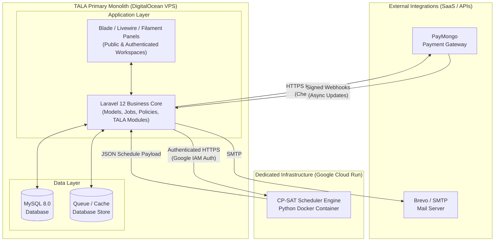
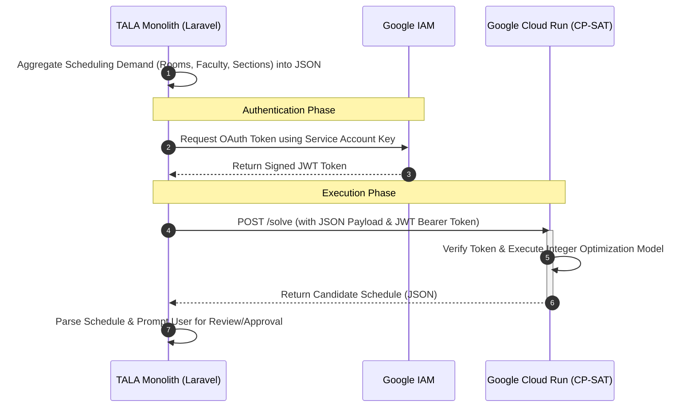
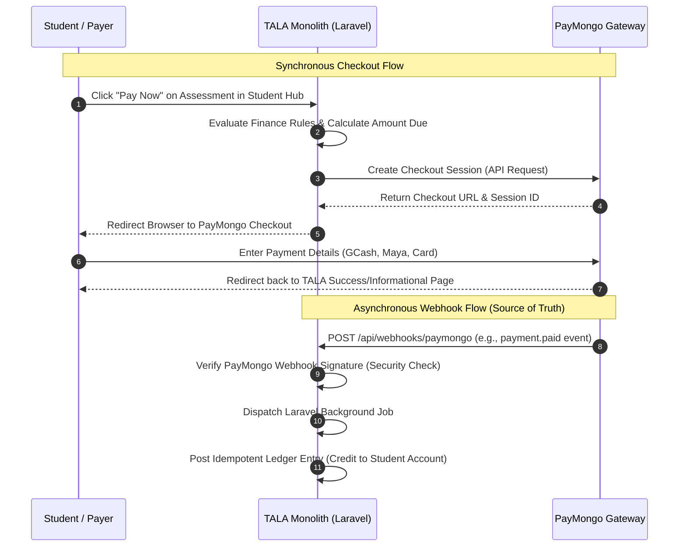

# TALA System Architecture Diagrams

> **Archived duplicate architecture presentation — not current architecture authority.** The live Architecture Specification owns system and integration boundaries.

This document contains Mermaid diagrams illustrating the system architecture based on the Product Requirements Document (PRD) modules and technical dependencies, with a special focus on external integrations as requested.

## 1. Overall System Architecture
This diagram demonstrates how the TALA monolithic application connects to its external, separated integrations. As your project manager noted, external services like PayMongo and Google Cloud Run must be depicted as distinct entities outside your main server infrastructure.

---

## 2. CP-SAT Integration (Google Cloud Run)
This sequence diagram shows exactly how the TALA system communicates with the isolated CP-SAT solver. Because it is highly resource-intensive, it runs in a separate Google Cloud Run container and is invoked via secure HTTP requests.

---

## 3. PayMongo Payment Gateway Integration
This sequence diagram illustrates the lifecycle of a payment. It emphasizes the two-part nature of modern payment gateways: the synchronous redirect for the user, and the asynchronous webhook that actually updates the accounting ledger.

