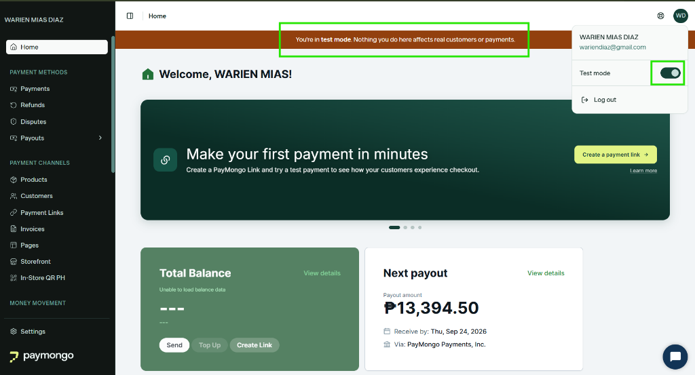
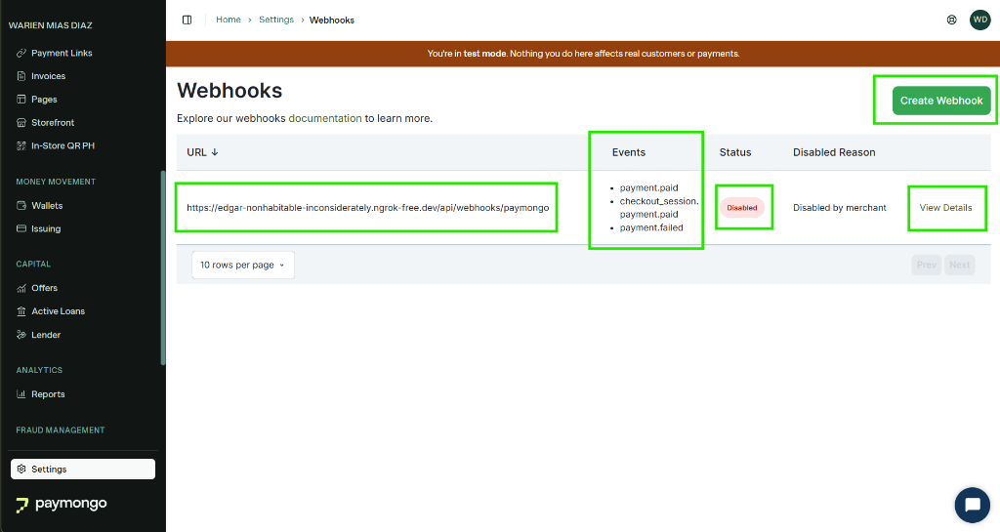
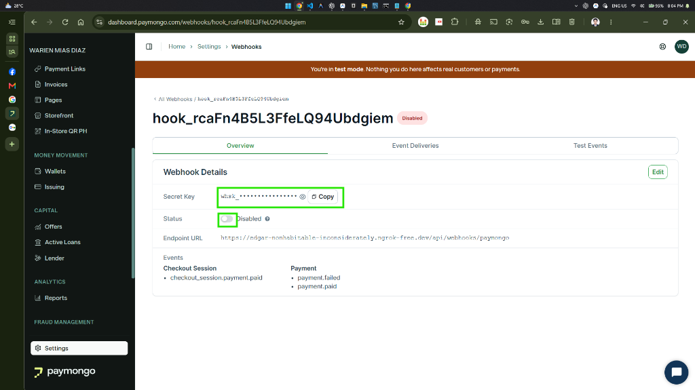

# Developer Guide: PayMongo Setup & Webhook Configuration

This guide provides the complete setup for configuring **PayMongo Hosted Checkout** and **Webhooks** with your local Laravel environment using **ngrok**.

---

## 1. Where PayMongo is Used in TALA

PayMongo is TALA's online payment gateway for student tuition and assessment payments:

* **Student Hub Assessment Checkout:** When a student has an outstanding balance on their `TermAccount`, they can click **"Pay exact current due"**.
* **Exact Current Due Rule:** Checkout sessions are strictly created for the immutable current positive due amount in Philippine Pesos (`PHP`).
* **Asynchronous Webhook Settlement:**  
  > **Crucial Rule:** The browser redirect back to the app is **not** payment proof. TALA only clears obligations and creates an immutable `PaymentPosting` record when it receives an authenticated, signed webhook (`checkout_session.payment.paid`) from PayMongo.

---

## 2. Shared Developer Credentials & 2FA Notice

To manage API keys and webhooks, team members can log in to the shared developer dashboard:

* **URL:** [https://dashboard.paymongo.com/](https://dashboard.paymongo.com/)
* **Email:** `wariendiaz@gmail.com`
* **Password:** `[REDACTED — Contact kylefbaluyot@iskolarngbayan.pup.edu.ph or Warien for shared developer credentials]`

> [!WARNING]
> **2FA / Login Verification Notice:**  
> PayMongo requires device authorization / OTP verification codes when logging in from a new computer or browser.  
> **If prompted for a verification code upon login, you must contact Warien immediately to get the code:**  
> * 💬 **Facebook:** [https://www.facebook.com/warien.diaz#](https://www.facebook.com/warien.diaz#)  
> * ✉️ **Email:** `wariendiaz@gmail.com`

### Step A: Confirm You Are in "Test Mode"
Once logged in, verify the brown notification banner and the **Test mode** toggle in the top-right profile dropdown:



* Ensure the banner states: *"You're in test mode. Nothing you do here affects real customers or payments."*
* If not, click the user profile icon (**WD**) in the top right and turn **Test mode** ON.

---

## 3. Our Webhook Configuration & Dashboard Overview

Navigate to **Settings > Webhooks** ([https://dashboard.paymongo.com/webhooks](https://dashboard.paymongo.com/webhooks)):



### Key Elements Highlighted in the Dashboard:
1. **Webhook Endpoint URL:** Shows our current ngrok address (`https://.../api/webhooks/paymongo`).
2. **Subscribed Events:**
   * `checkout_session.payment.paid` *(Primary event processed by TALA)*
   * `payment.paid`
   * `payment.failed`
3. **Current Status Badge:** Notice the red **`Disabled`** status (`Disabled by merchant`).
4. **Action Buttons:**
   * **`View Details`**: Click this on the existing webhook to view the secret key and enable it.
   * **`Create Webhook`**: Click this if you want to create your own isolated webhook instead of editing the shared one.

---

## 4. Webhook Details & Signing Secret Retrieval

Clicking **"View Details"** opens the dedicated webhook management page:



### What to Do on This Screen:
1. **Enable the Webhook:** Toggle the **Status** switch from **Disabled** to **Enabled**. *(If left disabled, PayMongo will drop all outgoing webhook calls).*
2. **Copy the Signing Secret:** Click **Copy** on the **Secret Key** field (`whsk_...`). This key is required by Laravel to verify incoming webhook signatures.
3. **Update Endpoint URL:** If your ngrok tunnel URL changed, click the **Edit** button in the top right, update the URL, and save.

---

## 5. Why ngrok is Required & The `.env` Connection

When testing locally on `http://127.0.0.1:8000`, PayMongo’s servers cannot reach your computer. This is why ngrok is used, and why line 5 of `.env` is configured:

```env
# Line 5 in .env:
# APP_URL=https://your-tunnel.ngrok-free.app (use this for testing webhooks with PayMongo)
APP_URL=http://127.0.0.1:8000
```

### When Testing Offline / Regular Coding:
Keep `APP_URL=http://127.0.0.1:8000`.

### When Testing Online Payments & Webhooks:

> [!IMPORTANT]
> **Must the system and ngrok be running when doing this?**  
> **YES, when testing payments!** While PayMongo lets you save a webhook URL without an active connection, the moment a test payment is submitted:
> 1. Your Laravel app (`composer run dev` or `php artisan serve`) **must be running**.
> 2. Your ngrok tunnel **must be actively running**.
> 3. You should **access the application using your ngrok link** (e.g., `https://your-tunnel.ngrok-free.app/student`) when testing checkout, ensuring return URLs and webhooks work together seamlessly.

---

### Step-by-Step Configuration:

1. **Start ngrok** in a terminal:
   ```powershell
   ngrok http 8000 --host-header="localhost:8000"
   ```

2. **Update `.env`**: Set `APP_URL` to your active ngrok forwarding link:
   ```env
   APP_URL=https://your-tunnel.ngrok-free.app
   ```

3. **Configure Webhook in PayMongo Dashboard:**
   Go to [https://dashboard.paymongo.com/webhooks](https://dashboard.paymongo.com/webhooks):

   * **Option A: Update the Existing Webhook**
     1. Click **View Details** on our existing webhook.
     2. Ensure the status toggle is set to **`Enabled`**.
     3. Update the endpoint URL to your active tunnel:
        `https://your-tunnel.ngrok-free.app/api/webhooks/paymongo`
     4. Click **Copy** on the **Secret Key** (`whsk_...`).

   * **Option B: Create Your Own Webhook (If multiple devs are testing simultaneously)**
     1. Click **Create Webhook**.
     2. Set URL to `https://your-tunnel.ngrok-free.app/api/webhooks/paymongo`.
     3. **Copy the exact 3 events from our existing setup:**
        * ✅ `checkout_session.payment.paid`
        * ✅ `payment.paid`
        * ✅ `payment.failed`
     4. Save, then click **View Details** on your new webhook to copy the **Secret Key** (`whsk_...`).

4. **Paste the Signing Secret into `.env`**:
   ```env
   PAYMONGO_WEBHOOK_SIG=whsk_your_copied_secret_here
   ```

5. **Clear Laravel Cache:**
   ```powershell
   php artisan config:clear
   ```

---

## 6. Environment Variables Reference (`.env`)

```env
TALA_PAYMENT_GATEWAY_DRIVER=paymongo
PAYMONGO_LIVEMODE=false
PAYMONGO_PUBLIC_KEY=[REDACTED — Contact kylefbaluyot@iskolarngbayan.pup.edu.ph]
PAYMONGO_SECRET_KEY=[REDACTED — Contact kylefbaluyot@iskolarngbayan.pup.edu.ph]
PAYMONGO_WEBHOOK_SIG=[REDACTED — Copy from Webhook Details in Dashboard]
```

* **`PAYMONGO_LIVEMODE`**: Must be `false` during development (uses Sandbox).
* **`PAYMONGO_PUBLIC_KEY`**: Client/public key starting with `pk_test_...`.
* **`PAYMONGO_SECRET_KEY`**: Secret key starting with `sk_test_...`.
* **`PAYMONGO_WEBHOOK_SIG`**: The secret used by Laravel to cryptographically verify that incoming webhooks are genuinely from PayMongo.

---

## 7. Terminal-Based Verification Suite

### Test 1: Verify API Connection to PayMongo
Runs an authenticated call using your `PAYMONGO_SECRET_KEY` via Laravel Tinker:

```powershell
php artisan tinker --execute '$res = Http::withBasicAuth(config("tala_integrations.payments.paymongo.secret_key"), "")->get(config("tala_integrations.payments.paymongo.base_url") . "/v1/payment_methods"); dump($res->status() === 200 ? "PayMongo API connected successfully!" : $res->json());'
```
* **Expected Result:** `"PayMongo API connected successfully!"`

---

### Test 2: Verify Webhook Route Registration
Verifies that your local Laravel application has the webhook receiver registered:

```powershell
php artisan route:list --name=webhooks.paymongo
```
* **Expected Result:**
  ```text
  POST  api/webhooks/paymongo ................. webhooks.paymongo › PayMongoWebhookController
  ```

---

### Test 3: Test Webhook Delivery via ngrok Web Inspector
While ngrok is running, open the built-in traffic inspector in your browser:
* **Inspector URL:** `http://127.0.0.1:4040`
* When PayMongo sends a webhook, you will see a `POST /api/webhooks/paymongo` request appear in real time with HTTP status `200 OK`.

---

## 8. Complete Working `.env` Template for the Team

Here is the complete template for local development. Redacted credentials can be requested from the project leads:

```env
APP_NAME=TALA
APP_ENV=local
APP_KEY=base64:M6OvOBJ40Po0YwunVJRA8nkNsCmKQYNprHK8KvOKWCM=
APP_DEBUG=true
# APP_URL=https://your-tunnel.ngrok-free.app (Uncomment and set during ngrok webhook testing)
APP_URL=http://127.0.0.1:8000 

APP_LOCALE=en
APP_FALLBACK_LOCALE=en
APP_FAKER_LOCALE=en_US

APP_MAINTENANCE_DRIVER=file
BCRYPT_ROUNDS=12

LOG_CHANNEL=stack
LOG_STACK=single
LOG_LEVEL=debug

DB_CONNECTION=mysql
DB_HOST=127.0.0.1
DB_PORT=3306
DB_DATABASE=tala_db
DB_USERNAME=root
DB_PASSWORD=your_local_mysql_password

SESSION_DRIVER=database
SESSION_LIFETIME=120
SESSION_ENCRYPT=false
SESSION_PATH=/
SESSION_DOMAIN=null

BROADCAST_CONNECTION=log
FILESYSTEM_DISK=local
QUEUE_CONNECTION=database
CACHE_STORE=database

MEMCACHED_HOST=127.0.0.1
REDIS_CLIENT=phpredis
REDIS_HOST=127.0.0.1
REDIS_PASSWORD=null
REDIS_PORT=6379

# --- Gmail SMTP ---
MAIL_MAILER=smtp
MAIL_SCHEME=null
MAIL_HOST=smtp.gmail.com
MAIL_PORT=587
MAIL_USERNAME=attalasys@gmail.com
MAIL_PASSWORD=[REDACTED — Contact kylefbaluyot@iskolarngbayan.pup.edu.ph for shared credentials]
MAIL_FROM_ADDRESS=attalasys@gmail.com
MAIL_FROM_NAME="${APP_NAME}"

AWS_ACCESS_KEY_ID=
AWS_SECRET_ACCESS_KEY=
AWS_DEFAULT_REGION=us-east-1
AWS_BUCKET=
AWS_USE_PATH_STYLE_ENDPOINT=false

VITE_APP_NAME="${APP_NAME}"

# --- PayMongo Payment Gateway (Sandbox/Test Mode) ---
TALA_PAYMENT_GATEWAY_DRIVER=paymongo
PAYMONGO_LIVEMODE=false
PAYMONGO_PUBLIC_KEY=[REDACTED — Contact kylefbaluyot@iskolarngbayan.pup.edu.ph]
PAYMONGO_SECRET_KEY=[REDACTED — Contact kylefbaluyot@iskolarngbayan.pup.edu.ph]
PAYMONGO_WEBHOOK_SIG=[REDACTED — Copy from Webhook Details in Dashboard]

# --- OCR / Document Processing ---
TALA_OCR_DRIVER=mock
GOOGLE_CLOUD_PROJECT_ID=tala-dev-ocr-3s
GOOGLE_APPLICATION_CREDENTIALS="storage/app/private/credentials/google-vision-dev.json"
TALA_OCR_MONTHLY_CALL_LIMIT=100

# --- CP-SAT Timetable Solver (Google Cloud Run) ---
TALA_SCHEDULING_SOLVER_DRIVER=cloud_run
TALA_SCHEDULING_SOLVER_AUTH=iam_private
TALA_SCHEDULING_SOLVER_URL=https://tala-scheduler-solver-783866300038.asia-southeast1.run.app
TALA_SCHEDULING_SOLVER_AUDIENCE=https://tala-scheduler-solver-783866300038.asia-southeast1.run.app
TALA_SCHEDULING_SOLVER_CREDENTIALS="storage/app/private/credentials/tala-dev-ocr-3s-aba571363fdf.json"
TALA_SCHEDULING_SOLVER_TIMEOUT_SECONDS=330
TALA_SCHEDULING_SOLVER_CONNECT_TIMEOUT_SECONDS=10
```

> [!TIP]
> **Accessing Credentials:**  
> For any redacted credential values, contact **`kylefbaluyot@iskolarngbayan.pup.edu.ph`** or consult the team's internal password vault.
