# TAL-51 Clean MVP ERD and Schema Contract

## 1. Scope, authority, and baseline decision

This is the implementation contract for **TAL-51 — Clean MVP ERD and Schema Contract**. It defines the relational boundary for later migration work. It does not authorize migration execution, database reset, data deletion, model or application changes, or work on TAL-52.

Authority was applied in this order:

1. `AGENTS.md` and repository instructions.
2. `00_Project_Documents/prd_modules/README.md` and PRD Modules `01`–`13`.
3. `00_Project_Documents/ui_surface_blueprint.md`.
4. `00_Project_Documents/architecture_specification.md`.
5. `00_Project_Documents/prd_modules/_working/TAL-50-backend-salvage-ledger.md`.
6. Live migrations, schema, models, services, and tests as reconciliation evidence only.

Audit date: **2026-06-28**. Laravel Boost reports Laravel 12.62.0, PHP 8.2, Filament 5.6.7, Livewire 4.3.1, and MySQL. The live database contains exactly **74 base tables**: 57 application-owned and 17 platform/foundation tables. The clean contract also contains **57 application-owned tables** and **17 platform/foundation tables**, for **74 total**. It adds the missing PRD integrity boundaries without a net table increase. Dashboards, balances, readiness, gate summaries, COR, SOA, payment acknowledgements, schedules, class rosters, reports, FAQs, and most policy vocabularies remain projections, typed rows, bounded JSON, or generated outputs.

Recommended non-blocking baseline decision: TAL-52 should build a fresh, reproducible development schema from this contract and separately decide whether any non-development data needs export/reload. The current development-sized database and non-reproducible orphan tables do not justify making the legacy 74-table shape authoritative.

### 1.1 Contract conventions

- Primary keys are unsigned `BIGINT` named `id`, except package-defined keys and UUID import batches.
- Foreign keys are unsigned `BIGINT`; all foreign-key columns are indexed.
- Money is `DECIMAL(12,2)` in PHP currency. Units/hours are `DECIMAL(5,2)`. Percentages are `DECIMAL(7,4)`.
- Timestamps are UTC `TIMESTAMP`; institutional dates are `DATE`; local recurring times are `TIME` plus an explicit day/date scope.
- Status/type fields are controlled strings backed by PHP enums or value objects. Database `ENUM` is avoided so controlled vocabularies can evolve through code and validation.
- `created_at` and `updated_at` are assumed unless a table is append-only. Actor fields reference `users.id` and are `RESTRICT` or `SET NULL` as stated.
- JSON is limited to immutable snapshots, provider payloads, diagnostics, filter summaries, and low-query metadata. Authoritative amounts, statuses, ownership, relationships, and capacity are relational columns.
- Official academic, enrollment, finance, grade, lifecycle, and audit rows are never hard-deleted through user/profile cascades.

## 2. Master MVP ERD

This is the single canonical ERD. Module views in Section 4 are projections of these same entities, not alternate models.

```mermaid
erDiagram
    users ||--o| applicant_intakes : owns
    users ||--o| student_profiles : accesses
    programs ||--o{ curriculum_versions : defines
    academic_years ||--o{ terms : contains
    terms ||--o{ calendar_events : configures
    rooms ||--o{ calendar_events : room_scope
    courses ||--o{ course_specifications : versions
    course_specifications ||--o{ course_components : contains
    course_specifications ||--o{ course_requirements : constrains
    curriculum_versions ||--o{ curriculum_entries : contains
    course_specifications ||--o{ curriculum_entries : selected_revision

    programs ||--o{ applicant_intakes : requested_program
    admission_requirement_policies ||--o{ checklist_items : instantiates
    applicant_intakes ||--o{ checklist_items : applicant_owner
    student_profiles ||--o{ checklist_items : student_owner
    checklist_items ||--o{ document_evidence : supports
    applicant_intakes ||--o| student_profiles : handed_over_to
    curriculum_versions ||--o{ student_profiles : entrance_lock
    student_profiles ||--o{ duplicate_profile_resolutions : duplicate

    users ||--o{ faculty_qualifications : faculty
    courses ||--o{ faculty_qualifications : qualified_course
    users ||--o{ faculty_term_load_overrides : faculty
    rooms ||--o{ room_features : has
    curriculum_entries ||--o{ term_offerings : realizes
    terms ||--o{ term_offerings : offers
    term_offerings ||--o{ sections : divides
    sections ||--o{ section_delivery_groups : groups

    term_offerings ||--o{ scheduling_demands : requires
    course_components ||--o{ scheduling_demands : component
    section_delivery_groups ||--o{ scheduling_demands : cohort
    terms ||--o{ schedule_runs : optimizes
    schedule_runs ||--o{ candidate_schedule_rows : stages
    scheduling_demands ||--o{ candidate_schedule_rows : assignment
    schedule_runs ||--o{ section_meetings : publishes
    scheduling_demands ||--o{ section_meetings : official_assignment
    section_meetings ||--o{ schedule_revision_events : revises

    student_profiles ||--o{ enrollments : enrolls
    terms ||--o{ enrollments : for_term
    enrollments ||--o{ course_enrollments : contains
    term_offerings ||--o{ course_enrollments : selected_offering
    course_enrollments ||--o{ student_schedule_bindings : binds
    section_meetings ||--o{ student_schedule_bindings : attends
    sections ||--o{ enrollment_seat_reservations : reserves
    enrollments ||--o{ enrollment_gate_results : evaluates
    enrollment_gate_results ||--o{ enrollment_exceptions : may_override
    enrollments ||--o{ enrollment_exceptions : scopes

    enrollments ||--o{ assessments : assessed
    assessments ||--o{ assessment_lines : charges
    assessments ||--o{ payment_schedule_rows : schedules
    assessments ||--o{ payment_attempts : initiates
    payment_attempts ||--o| payments : evidences
    payments ||--o{ payment_allocations : allocates
    assessment_lines ||--o{ payment_allocations : target
    student_profiles ||--o{ ledger_entries : account
    payments ||--o{ ledger_entries : posts
    student_profiles ||--o{ financial_accommodations : receives
    financial_accommodations ||--o{ payment_schedule_rows : schedules

    course_enrollments ||--o| grade_roster_rows : graded_once
    grade_rosters ||--o{ grade_roster_rows : contains
    grade_roster_rows ||--o{ grade_outcome_events : history
    student_profiles ||--o{ holds : blocked
    student_profiles ||--o{ student_lifecycle_changes : changes
    student_lifecycle_changes ||--o{ program_shift_credit_entries : credits
    graduation_review_batches ||--o{ graduation_review_members : includes
    graduation_review_members ||--o{ graduation_snapshots : evaluates
    enrollments ||--o{ output_access_logs : renders
    users ||--o{ output_access_logs : accesses
    users ||--o{ operational_events : receives_or_causes
```

## 3. Canonical table catalog

The `Key columns` lists the relational contract, not every display/helper column. Migration workers may add timestamps and bounded descriptive fields stated in the PRDs, but must not invent a new owner, lifecycle, amount source, or relationship.

### 3.1 Platform and foundation tables (17)

| Table | Ownership and contract |
| --- | --- |
| `migrations` | Laravel migration repository; package shape unchanged. |
| `users` | Application-extended Laravel authentication identity and account lifecycle. It is counted in the platform/foundation group because authentication depends on it, but its name/status/archive columns are TALA-owned extensions. Unique normalized `email`; nullable unique `username`; status, verified/archive timestamps. Student official identity remains owned by `student_profiles`. |
| `password_reset_tokens`, `sessions`, `passkeys` | Fortify/session/passkey infrastructure; preserve package keys and indexes. |
| `roles`, `permissions`, `model_has_roles`, `model_has_permissions`, `role_has_permissions` | Spatie Permission package tables. Seed exactly seven canonical roles; roles are fixed product vocabulary, permissions remain action-level. |
| `cache`, `cache_locks`, `jobs`, `job_batches`, `failed_jobs` | Laravel database cache/queue baseline. No domain foreign keys. |
| `activity_log` | Spatie application audit trail. It supplements, but does not replace, dedicated immutable domain/output/export records. |
| `webhook_calls` | Spatie Webhook Client raw inbound evidence. Unique provider event/idempotency key must be enforced by the payment processor or a package-compatible indexed extension; payload is immutable JSON under retention policy. |

Deletion: package tables follow package behavior, except domain users referenced by official records are archived rather than deleted. Session/reset/cache rows may expire normally. Audit and webhook evidence is retention-controlled, never cascade-deleted from a user.

### 3.2 Shared configuration, institution, and operations (6)

| Table | Key columns and lifecycle | Required constraints and indexes | History/deletion |
| --- | --- | --- | --- |
| `system_settings` | `key`, `scope_type`, `scope_id`, typed `value`, `effective_from`, `effective_until`, `version`, `status`, `changed_by`, `reason`. Owns low-cardinality policies, constraint profiles, grading formula, hold/mark vocabularies, integration secret references, and authority rules. | Unique `(key, scope_type, scope_id, version)`; index active effectivity `(key, scope_type, scope_id, status, effective_from, effective_until)`. | Effective versions append/supersede; referenced versions cannot be deleted. Secrets are secure references, never plaintext values. |
| `operational_events` | `event_domain` (`INTEGRATION`,`EMAIL`), integration/channel, direction, event/template type and version, nullable `user_id`, recipient snapshot, external/provider id, status, occurred/processed/sent/failed timestamps, related record type/id, diagnostic/payload JSON. | Unique nullable `(event_domain,external_id)`; indexes `(event_domain,status,occurred_at)`, `(user_id,occurred_at)`, and related record. | Append-only/retention-controlled. One typed event stream supports integration failures and email delivery metadata without an in-app notification center. |
| `programs` | Unique `code`, name, duration metadata, active state. | Unique `code`; index `is_active`. | Restrict deletion when referenced; deactivate instead. |
| `academic_years` | Unique label, start/end dates, state. | Unique label; check start < end. | Restrict when terms exist. |
| `terms` | `academic_year_id`, type, label, start/end, state, scheduling grid defaults and configured load/cap defaults. | Unique `(academic_year_id,type,label)`; indexes state/date; check start < end. | Restrict when operational rows exist; close/archive. |
| `calendar_events` | `term_id`, `event_type` (`WINDOW`,`HOLIDAY`,`NO_CLASS`,`MAKE_UP`,`BREAK`,`EXAM`,`UNAVAILABLE`,`PREFERRED`), `scope_type` (`INSTITUTION`,`ROOM`,`FACULTY`,`RESOURCE`,`PROCESS`), nullable `room_id`/`faculty_user_id`, process key, start/end date-time or recurring day/time, blocks_scheduling, state, authority. | Check that scope-specific FK columns are valid and start < end; indexes `(term_id,event_type,start_at,end_at)`, room/time, faculty/time, and named process windows. | Supersede/close instead of overwrite; run snapshots preserve the exact scheduling inputs. This table also owns room/faculty availability. |

### 3.3 Course, curriculum, and imports (7)

| Table | Key columns and lifecycle | Required constraints and indexes | History/deletion |
| --- | --- | --- | --- |
| `courses` | Unique normalized `code`, active state. Identity only. | Unique `code`; index state. | Retire, never delete when referenced. |
| `course_specifications` | `course_id`, revision code, title, description, credit units, grading-profile key/version, allowed modalities, same-faculty default, effective term/curriculum reference, state (`DRAFT`,`ACTIVE`,`RETIRED`). | Unique `(course_id,revision_code)`; at most one applicable active revision per effectivity scope enforced transactionally; index `(course_id,state)`. | Active referenced revisions immutable; retire instead of update/delete. |
| `course_components` | `course_specification_id`, component type (`LECTURE`,`LABORATORY`), weekly contact hours, room-type default, modality restriction, consecutive-block flag, same-faculty flag, sequence. | Unique `(course_specification_id,component_type)` for v1; check hours > 0; index room type. | Restrict when demanded/scheduled. |
| `course_requirements` | `course_specification_id`, rule type (`PREREQUISITE`,`COREQUISITE`,`EQUIVALENCY`), `group_key`, `related_course_id`, direction/equivalency scope, required outcome, minimum grade, accepted-credit flags, effectivity, authority, state, sequence. Prerequisite/corequisite groups are AND; rows within a group are OR. | Unique active rule identity per owner/type/group/related course/effectivity; indexes owner, related course, type/state; prohibit self/cycles in service validation. | Immutable with an active specification; equivalency rows are effective-dated and retired rather than deleted. Import source text belongs in import evidence, not runtime rules. |
| `curriculum_versions` | `program_id`, version code/name, effective entry term, state (`DRAFT`,`RECORDED_APPROVED`,`ACTIVE`,`SUPERSEDED`,`ARCHIVED`), approval reference/actor/date. | Unique `(program_id,version_code)`; only one `ACTIVE` per program for new handovers, enforced transactionally/locking; index state. | Approved/referenced versions immutable; supersede/archive. |
| `curriculum_entries` | `curriculum_version_id`, `course_specification_id`, year-level label, term label/type, sequence, required/elective grouping. | Unique `(curriculum_version_id,year_level,term_label,course_specification_id)`; indexes course specification and ordering. | Restrict when offering/student history references it. Units/contact hours are not duplicated. |
| `import_batches` | UUID id, type (`COURSE_SPECIFICATION`,`CURRICULUM`), template version, source file private reference/checksum, uploader, row/error/warning counts, state, bounded `validation_details_json` with row numbers/errors/warnings and proposed-record references, acknowledgement/post timestamps. | Index `(type,state,created_at)` and checksum; exact template validation; cap validation JSON by file row/size limits. | Source/evidence retention controlled; row-level preview data is transient during validation and only bounded diagnostics remain on the batch. Posting creates Draft domain rows only. |

### 3.4 Admissions and student master (6)

| Table | Key columns and lifecycle | Required constraints and indexes | History/deletion |
| --- | --- | --- | --- |
| `admission_requirement_policies` | Admission category, credential basis, requirement type, evidence method, blocking level, effective dates, state, authority. One row is one configured requirement; no header table. | Unique active combination `(admission_category,credential_basis,requirement_type,effective_from)`; index applicability/state. | Supersede/end-date; instantiated checklist rows retain source policy id. |
| `applicant_intakes` | `user_id`, target `term_id/program_id`, admission category/credential basis, applicant identity/contact/prior-school fields, identity evidence reference, status, submit/review/approve/handover timestamps and actors. | One non-withdrawn active intake per user/target term; indexes `(status,term_id,program_id)` and duplicate-match fields. | Archive after retention period; never cascade from user. Becomes immutable handover source after handover. |
| `checklist_items` | `owner_type` (`APPLICANT`,`STUDENT`), exactly one `applicant_intake_id` or `student_profile_id`, source policy, requirement type, status, blocking level, evidence method, verification status, deadline, review/waiver/undertaking metadata. | Check exactly one owner; unique current requirement per owner/source policy; indexes owner, `(status,blocking_level)`, deadline. | Preserve resolved/waived history; no owner cascade. |
| `document_evidence` | `checklist_item_id`, private disk/path, checksum, MIME/size, evidence method, status, uploaded/reviewed actors/times, replacement link. | Unique checksum within checklist item; indexes checklist/status. | Private and retention-controlled; replacement supersedes, never overwrites accepted evidence. No OCR columns/tables. |
| `student_profiles` | Unique `user_id`, unique never-reused `student_number`, official identity, prior identifier, `program_id`, entrance-locked `curriculum_version_id`, primary lifecycle status, academic standing, contact/address/emergency fields, archived/merged pointer. | Unique user/student number; indexes `(program_id,lifecycle_status)`, curriculum, standing; merged target cannot self-reference. | Archive, never hard-delete. Contact edits audit through `activity_log`; official identity edits require Registrar actor/evidence. No stored balance. |
| `duplicate_profile_resolutions` | duplicate student, primary student, resolution type, reason, resolver/time. | Unique final resolution per duplicate; indexes primary/duplicate; both FKs `RESTRICT`. | Immutable. Original academic/finance records stay on original profile. |

### 3.5 Resources, offerings, and capacity source records (7)

| Table | Key columns and lifecycle | Required constraints and indexes | History/deletion |
| --- | --- | --- | --- |
| `faculty_qualifications` | `faculty_user_id`, `course_id`, active state, recorded actor/time, notes. | Unique active `(faculty_user_id,course_id)`; indexes course/state. | End-date/deactivate, preserve used mapping in solver snapshots. |
| `faculty_term_load_overrides` | faculty, term, default max snapshot, approved overload units, authority/reason, active state. | Unique active `(faculty_user_id,term_id)`; check nonnegative; indexes term/state. | Retain as term source record. |
| `rooms` | Unique code, name/building, room type, capacity, active state, notes. | Unique code; check capacity > 0; index `(room_type,is_active,capacity)`. | Deactivate; restrict when meetings reference it. |
| `room_features` | `room_id`, controlled feature key. | Unique `(room_id,feature_key)`; index feature key. | Cascade only when an unused room is legitimately deleted; referenced rooms are restricted. |
| `term_offerings` | `term_id`, `curriculum_entry_id`, category, special reason, delivery arrangement/modality, expected count, authorized room/delivery/same-faculty overrides, state. | Unique regular offering per `(term_id,curriculum_entry_id,delivery_variant)`; indexes term/state/category; cancelled rows retained. | Restrict when enrollment/scheduling references it. |
| `sections` | `term_offering_id`, unique term-scoped code, capacity, state. | Unique `(term_id derived through offering, code)` implemented as unique `(term_offering_id,code)` plus service-wide term check; capacity > 0; index state. | Cancel/close; no mutable enrolled/reserved counter as authority. |
| `section_delivery_groups` | `section_id`, name/key, expected count, modality/override, state. | Unique `(section_id,name)`; check expected count >= 0 and <= section capacity; index state. | Restrict when demands exist. |

### 3.6 Scheduling (5)

| Table | Key columns and lifecycle | Required constraints and indexes | History/deletion |
| --- | --- | --- | --- |
| `scheduling_demands` | `term_offering_id`, `course_component_id`, `section_delivery_group_id`, stable demand key, required duration/meeting count, modality, fixed faculty/room/time fields, validation state. | Unique `(term_offering_id,course_component_id,section_delivery_group_id)` and stable demand key; indexes validation and fixed FKs. | Regenerate only before publication or create a new demand version; published references restricted. |
| `schedule_runs` | `term_id`, status, requester, immutable input snapshot/hash, solver/model version, runtime, objective/diagnostics, candidate key, publication actor/time/version/note. | Unique input hash per intended retry policy; index `(term_id,status,created_at)` and published version; only one active publication version per term transactionally. | Append-only after completion/publication. Replaces separate published-schedule header. |
| `candidate_schedule_rows` | `schedule_run_id`, `scheduling_demand_id`, faculty, nullable room, day/start/end or stable time-block key, status, scores/warnings/violations JSON, manual-override authority/reason. | Unique `(schedule_run_id,scheduling_demand_id,meeting_sequence)`; overlap indexes `(room_id,day,start,end)` and `(faculty_id,day,start,end)`; no candidate row is official. | May be retention-pruned only after run policy permits; never copied by identity into live edits. |
| `section_meetings` | published `schedule_run_id`, `scheduling_demand_id`, faculty, nullable room, day/start/end, modality, state, publication timestamps. | Unique demand/meeting sequence per active publication; overlap indexes by term/room/faculty/group/time; F2F requires room. | Current assignment may change only through validated revision transaction plus event; no cascade from source records. |
| `schedule_revision_events` | meeting, term, change type, reason, effective date, actor, immutable old/new snapshots, affected counts. | Index `(section_meeting_id,created_at)` and `(term_id,effective_date)`; snapshots required. | Append-only. |

### 3.7 Enrollment (6)

| Table | Key columns and lifecycle | Required constraints and indexes | History/deletion |
| --- | --- | --- | --- |
| `enrollments` | student, term, status, student type, registration/official/cancel/drop/withdraw timestamps, status reason. | Unique `(student_profile_id,term_id)`; indexes `(term_id,status)` and student/status. | Final states retained; official status changes only from gate transaction. |
| `course_enrollments` | enrollment, term offering, status, units snapshot only if required for immutable official history, added/dropped/withdrawn metadata. | Unique active `(enrollment_id,term_offering_id)`; indexes offering/status. | Never delete after official enrollment; status transitions preserve history. |
| `student_schedule_bindings` | course enrollment, section meeting, active/effective dates, source (`RESERVATION`,`OFFICIAL`,`LIFECYCLE_CHANGE`), release metadata. | Unique active `(course_enrollment_id,section_meeting_id)`; indexes meeting/active and course enrollment. | Release/end-date; never rewrite Master Schedule. |
| `enrollment_seat_reservations` | enrollment, section, status, reserved/released/converted times, deadline, registrar actor, lock version. | One active reservation per enrollment/course placement as applicable; index `(section_id,status,deadline)`; capacity transaction locks the section and counts active reservations plus official course enrollments. | Release/convert, never delete. No payment FK. |
| `enrollment_gate_results` | enrollment, gate type, result, responsible office, blocker code/message, source type/id, checked_at, rule/config version. | Unique current `(enrollment_id,gate_type)` with history version/sequence; indexes `(result,gate_type)` and source. | Preserve failed result when rechecked/overridden; append versions or retain prior snapshot. |
| `enrollment_exceptions` | enrollment/student/term, exception type (`GATE_OVERRIDE`,`PREREQUISITE`,`COREQUISITE`,`UNIT_LOAD`,`CONFLICT`,`BRIDGING`), nullable gate result/target offering, original failed result/rule, scope, expiry, requested/approved values JSON limited to type-specific snapshots, reason/evidence, requester/approver/times, state. | Type-specific checks require the relevant gate/offering and approved values; unique active scope per failed rule; indexes `(student_profile_id,term_id,type,state)`, gate result, offering, and expiry. | Expire/revoke; never overwrite the failed gate/rule. One typed structure replaces three approval tables while preserving relational FKs and audit history. |

### 3.8 Finance, ledger, and PayMongo (9)

| Table | Key columns and lifecycle | Required constraints and indexes | History/deletion |
| --- | --- | --- | --- |
| `fee_rules` | Unique fee code, name, ledger/display category, program/term scope, calculation type, amount/rate, effective dates, active state, authority. | Unique active code/scope/effectivity; indexes applicability, category, and state. | Supersede/end-date; assessment lines retain rule/version. A separate fee-item identity table is unnecessary for the bounded MVP matrix. |
| `assessments` | enrollment, version, state (`DRAFT`,`PENDING_REVIEW`,`ACTIVE`,`SUPERSEDED`,`CANCELLED`,`LOCKED`), currency, totals, required downpayment, activated/superseded metadata. | Unique `(enrollment_id,version)`; only one active version transactionally; indexes state/term via enrollment. | Active/locked rows immutable; supersede. |
| `assessment_lines` | assessment, fee item/rule, course enrollment nullable, description snapshot, quantity/rate/amount, line type. | Unique source line key per assessment; check amounts; indexes fee/source. | Immutable once assessment active. |
| `payment_schedule_rows` | exactly one owner: `assessment_id` or `financial_accommodation_id`; sequence, category, due date, amount, state, linked payment allocation nullable. | Check exactly one owner, amount > 0; unique `(assessment_id,sequence)` or `(financial_accommodation_id,sequence)`; indexes owner/due/state. | Retained with its owner. One structure preserves due-row integrity for normal installments and approved accommodation schedules. |
| `payment_attempts` | assessment, student, channel/provider, internal reference, provider checkout/intent IDs, amount/currency, status, expiry/paid timestamps, low-query metadata. | Unique internal reference and nullable provider IDs; indexes `(student_profile_id,status)` and assessment. | Operational history retained; no ledger FK. |
| `payments` | verified/manual payment evidence: attempt nullable, student, term, method/channel, amount/currency, evidence status, paid/verified timestamps, verifier, unique OR number nullable, OR mapped actor/time, provider reference. | Unique nullable OR number; unique nullable provider payment/event reference; indexes `(student_profile_id,term_id,status)` and pending OR mapping. | Immutable verified evidence; correction/refund uses ledger entries/events, not overwrite. |
| `payment_allocations` | payment, target assessment line/installment or prior balance ledger entry, amount. | Allocation target check; unique payment/target; sum allocations must equal applicable payment amount before posting; indexes targets. | Immutable after ledger posting; reversal uses new ledger entries. |
| `ledger_entries` | student, term/enrollment nullable, direction/category, signed amount convention, source type/id, payment/allocation nullable, reverses/adjusts entry nullable, description, posted actor/time, state. | Unique source posting key; indexes student/time, term/category, source, reversal target; check one source and nonzero amount. | Append-only. Balance is `SUM(posted signed amount)`; no authoritative running/current-balance column. |
| `financial_accommodations` | student, term, balance snapshot, covered amount, basis/certification metadata, private reference, promissory-required/maker, explicit effect flags, authority/recorder, status/effective/expiry dates. | Index `(student_profile_id,term_id,status)` and expiry; check covered amount >= 0 and required basis fields. | Status transitions preserved/audited; no direct ledger mutation. |

### 3.9 Grades (4)

| Table | Key columns and lifecycle | Required constraints and indexes | History/deletion |
| --- | --- | --- | --- |
| `grade_rosters` | term offering/section, faculty owner, state (`DRAFT`,`SUBMITTED`,`RETURNED`,`POSTED_RELEASED`,`LATE_NOT_SUBMITTED`), grading-profile snapshot, submit/review/release actors/times and return reason. | One roster per course offering/section grade unit; indexes faculty/state/term. | Posted roster immutable; corrections are events. |
| `grade_roster_rows` | roster, unique course enrollment, prelim/midterm/final equivalents, computed average, current controlled outcome code/category, released_at. | Unique `course_enrollment_id`; numeric range checks; index roster/outcome. | Posted values change only by a linked outcome event transaction. |
| `grade_outcome_events` | row, event type (`INITIAL_RELEASE`,`PENDING_REPLACEMENT`,`INC_RESOLUTION`,`POSTED_CORRECTION`,`LIFECYCLE_OUTCOME`,`TRANSFER_CREDIT`), previous/new values/categories, deadline, authority/reason/evidence, actor/time. | Index `(grade_roster_row_id,created_at)` and event type/deadline; previous/new snapshot required where applicable. | Append-only. This one history table carries pending replacement, INC resolution, and approved correction without three noun tables. |
| `late_grade_authorizations` | roster/term offering, faculty, grading period, reason, approver, opens/closes, state. | Index faculty/window/state; prevent overlapping active authorizations for same scope. | Expire/revoke; retain. |

### 3.10 Lifecycle, graduation, and output/audit (7)

| Table | Key columns and lifecycle | Required constraints and indexes | History/deletion |
| --- | --- | --- | --- |
| `holds` | student, term/enrollment nullable, type, blocking level, status, source type/id, staff/student reasons, effective/expiry, resolution/waiver actors/times. | Index student/status/blocking, term/status, source; current active checks use this table plus accommodation effects. | Resolve/waive/expire, never delete. |
| `student_lifecycle_changes` | student, term, type (`SUBJECT_DROP`,`WITHDRAWAL`,`LEAVE_OF_ABSENCE`,`PROGRAM_SHIFT`,`INSTITUTION_DROP`,`REACTIVATION`), affected enrollment/course, requested/effective/decision dates, authority/private source/reason, impact references/snapshot, recorder, state. | Index student/effective date/type and term/state; type-specific required fields checked. | Applied results immutable; reversal requires a new corrective event. |
| `program_shift_credit_entries` | program-shift lifecycle change, target curriculum entry, source course/grade reference, treatment (`EXTERNAL_TC`,`INTERNAL_NUMERIC`), accepted/deficient/rejected state, numeric grade nullable. | Unique `(student_lifecycle_change_id,curriculum_entry_id)`; treatment/grade checks; indexes target entry/state. | Retained permanently with academic history. |
| `graduation_review_batches` | academic year/term, name/state, creator, filter summary JSON, created/closed times. | Unique batch name per term; index term/state. | Archive, no delete after snapshots. |
| `graduation_review_members` | batch, student, added actor/time, active state. | Unique `(graduation_review_batch_id,student_profile_id)`; index student/state. | Remove by state, not delete after evaluation. |
| `graduation_snapshots` | review member, version, result status, immutable evaluation JSON containing categorized requirements, source IDs, remaining units, blockers; generated actor/time; student-visible actor/time/reason. | Unique `(graduation_review_member_id,version)`; indexes result/generated time and visibility. | Append-only immutable snapshot; JSON is explicitly allowed because it is a generated historical snapshot. |
| `output_access_logs` | `output_type` (`COR`,`SOA`,`PAYMENT_ACKNOWLEDGEMENT`,`SCHEDULE`,`ROSTER`,`GRADUATION_SNAPSHOT`,`REPORT`), source record type/id, owner student nullable, actor/role, action (`VIEW`,`PRINT`,`DOWNLOAD`,`EXPORT`), copy context nullable, schedule version nullable, filter summary/row count/purpose/sensitivity for reports, stored-file reference nullable, request context, status, timestamp. | Index source, output/action/time, owner/time, actor/time, sensitivity/status; COR actions require copy context and enrollment/schedule source references; sensitive report exports require purpose. | Append-only. One generalized proof table covers COR print logs, other output access, and report exports without weakening required queries. |

### 3.11 Independent-persistence justification audit

Reason codes: **RR** repeated rows; **RI** relational integrity; **LH** independent lifecycle/history; **CC** concurrency control; **SB** security/retention boundary; **RQ** required operational querying. Every application-owned table must satisfy at least one concrete reason below; a PRD label alone is insufficient.

| Surviving table | Reasons | Concrete need for independent persistence |
| --- | --- | --- |
| `system_settings` | LH, RQ | Effective configuration versions must be queried by key/scope/date and preserved after policy changes. |
| `operational_events` | LH, SB, RQ | Asynchronous integration/email outcomes outlive requests and require failure/retry/provider-id queries under retention controls. |
| `programs` | RI, RQ | Referenced institutional identity prevents free-text program drift across curricula, students, and reports. |
| `academic_years` | RI, RQ | Terms and reports require one constrained year identity and date boundary. |
| `terms` | RI, LH, RQ | Offerings, enrollment, finance, schedules, and grades require a shared historical term FK. |
| `calendar_events` | RR, RI, LH, RQ | Multiple windows/blocks with room/faculty/process scope must be overlap-queried and versioned for solver evidence. |
| `courses` | RI, LH, RQ | Stable subject codes must survive specification revisions and remain FK targets. |
| `course_specifications` | RR, RI, LH | Material academic changes require immutable revisions while old curricula/enrollments retain their exact version. |
| `course_components` | RR, RI, RQ | Lecture/lab rows are independently scheduled and room-matched but share one course grade/enrollment. |
| `course_requirements` | RR, RI, LH, RQ | Grouped prerequisite/corequisite/equivalency edges require FKs, cycle checks, and reverse-course queries. |
| `curriculum_versions` | RR, RI, LH | Cohorts retain an entrance-locked approved version while later versions supersede it. |
| `curriculum_entries` | RR, RI, RQ | Repeated course placement rows require ordering, uniqueness, prerequisite/graduation joins, and no duplicated units. |
| `import_batches` | LH, SB, RQ | One uploaded file has an independent validation/posting lifecycle and private source evidence; row diagnostics remain bounded JSON. |
| `admission_requirement_policies` | RR, LH, RQ | Requirement applicability varies by category/basis/effectivity and must instantiate consistent checklist rows. |
| `applicant_intakes` | RI, LH, SB, RQ | Applicant draft/review/handover has an independent confidential lifecycle and must remain immutable source evidence. |
| `checklist_items` | RR, RI, LH, RQ | Each requirement has an independent blocking/review/resolution state queried across applicant and student queues. |
| `document_evidence` | RR, LH, SB | Private file metadata and replacements need retention, checksum, and review history separate from checklist status. |
| `student_profiles` | RI, LH, SB, RQ | Official student identity, never-reused number, curriculum lock, status, and student-owned contact data need a protected master record. |
| `duplicate_profile_resolutions` | RI, LH | Two student FKs plus immutable resolver/reason evidence must survive profile archival without moving child histories. |
| `faculty_qualifications` | RR, RI, RQ | Solver eligibility needs indexed faculty-course mappings and cannot safely query free-text/JSON qualifications. |
| `faculty_term_load_overrides` | RI, LH, RQ | One faculty/term approved load changes solver feasibility; explicit FKs/effectivity and term-wide exception reports are required. |
| `rooms` | RI, LH, RQ | Meetings need a capacity/type-controlled room FK and historical room identity. |
| `room_features` | RR, RI, RQ | Solver suitability needs indexed many-to-many feature matching; a JSON array would make core constraint joins opaque. |
| `term_offerings` | RR, RI, LH, RQ | Actual term delivery, special reason, and overrides differ from immutable curriculum definitions and drive enrollment/scheduling. |
| `sections` | RR, RI, CC, RQ | Capacity is a lockable source record shared by reservations and official occupancy. |
| `section_delivery_groups` | RR, RI, RQ | Solver demand is generated per cohort/delivery group with its own expected count and modality. |
| `scheduling_demands` | RR, RI, LH, RQ | Stable solver IDs must bind component/group inputs to every candidate and official meeting output. |
| `schedule_runs` | LH, SB, RQ | Each external run needs immutable input hash/payload, diagnostics, solver version, and publication state. |
| `candidate_schedule_rows` | RR, RI, LH, RQ | Multiple provisional assignments need relational demand/faculty/room validation before publication. |
| `section_meetings` | RR, RI, CC, RQ | Official time/room/faculty assignments drive conflict checks, student bindings, and COR rendering. |
| `schedule_revision_events` | LH, SB | In-place meeting edits require immutable before/after proof and affected-party counts. |
| `enrollments` | RI, LH, RQ | One student/term transaction owns overall gated status and official timestamps. |
| `course_enrollments` | RR, RI, LH, RQ | Each selected offering needs independent add/drop/withdraw/grade status under one term enrollment. |
| `student_schedule_bindings` | RR, RI, LH, RQ | Irregular/lifecycle placement changes must bind students to meetings without mutating the Master Schedule. |
| `enrollment_seat_reservations` | RI, LH, CC, RQ | Pending seats require lock-safe reserve/convert/release states and deadline queries independent of payment. |
| `enrollment_gate_results` | RR, RI, LH, RQ | Each gate preserves its source result, blocker, office, and rule version for recomputation and queue queries. |
| `enrollment_exceptions` | RI, LH, RQ | Typed approved exceptions need gate/offering FKs, scope/expiry, actor/evidence, and cross-term exception reporting. |
| `fee_rules` | RR, LH, RQ | Effective fee definitions vary by program/term/calculation type and must be selected and audited during assessment. |
| `assessments` | RR, RI, LH, RQ | Versioned billing headers have draft/active/locked/superseded lifecycle independent of ledger posting. |
| `assessment_lines` | RR, RI, LH, RQ | Repeated charge lines require source/rule integrity, category totals, allocations, and audit queries. |
| `payment_schedule_rows` | RR, RI, LH, RQ | Repeated due rows need one constrained owner, due/status queries, and allocation links for both normal and accommodation schedules. |
| `payment_attempts` | RR, LH, SB, RQ | Provider checkout intents/retries expire or fail before verified evidence and require idempotency/status queries. |
| `payments` | RR, RI, LH, SB, RQ | Verified/manual evidence owns provider/OR uniqueness and review state separately from financial posting. |
| `payment_allocations` | RR, RI, LH | One payment may cover multiple assessed/prior-balance targets; allocation equality and target FKs must be enforced. |
| `ledger_entries` | RR, RI, LH, RQ | Append-only signed postings are the sole reproducible balance source and require source/reversal integrity. |
| `financial_accommodations` | RR, RI, LH, SB, RQ | Approved arrangements have independent effects, evidence, lifecycle, expiry, and Finance Gate queries. |
| `grade_rosters` | RR, RI, LH, RQ | One class submission/review/release lifecycle owns repeated student grade rows. |
| `grade_roster_rows` | RR, RI, LH, RQ | One course enrollment needs one current outcome and period equivalents under roster integrity. |
| `grade_outcome_events` | RR, RI, LH | Pending replacement, INC resolution, correction, transfer credit, and lifecycle outcomes must preserve immutable prior/new values. |
| `late_grade_authorizations` | RI, LH, RQ | Faculty/class-specific open windows require overlap checks and operational late-authorization lists; embedding them in calendar or roster obscures authority scope. |
| `holds` | RR, RI, LH, RQ | Multiple independently resolvable blockers require central status/blocking queries across workflows. |
| `student_lifecycle_changes` | RR, RI, LH, SB | Approved result records atomically drive enrollment/capacity/finance/status effects and preserve private authority evidence. |
| `program_shift_credit_entries` | RR, RI, LH, RQ | Repeated target-curriculum decisions require course/grade treatment FKs and graduation/prerequisite queries. |
| `graduation_review_batches` | RR, LH, RQ | Registrar review runs have independent term/state/filter lifecycle. |
| `graduation_review_members` | RR, RI, LH, RQ | Batch-student membership must be unique, queryable, and independently refreshable. |
| `graduation_snapshots` | RR, LH, SB | Immutable versioned evaluation evidence may safely use JSON because it is a generated snapshot with source IDs. |
| `output_access_logs` | RR, LH, SB, RQ | Official output access, COR copy context, and sensitive report exports require append-only actor/type/action/purpose queries. |

### 3.12 Consolidation decisions

| Candidate overlap | Decision | Integrity/minimization result |
| --- | --- | --- |
| `cor_print_logs` + output logs + report export logs | **Consolidated** into `output_access_logs`. | Typed `output_type`, `action`, copy/schedule context, report purpose/sensitivity/filter fields, and indexes preserve all required audits in one table. |
| Gate overrides + academic exceptions + student unit-load exceptions | **Consolidated** into `enrollment_exceptions`. | Explicit gate/offering FKs and type-specific checks preserve original failures, scope, approval, expiry, reason, and history. The gate result remains unchanged. |
| Course equivalencies + requirement rules | **Consolidated** into `course_requirements`. | `rule_type=EQUIVALENCY`, related-course FK, effectivity, authority, and reverse indexes retain relational integrity. |
| Persistent import rows | **Removed** for MVP. | Row previews are transient; bounded row-numbered diagnostic JSON is retained on `import_batches`, while posted Draft records become normal domain rows. |
| Assessment installments + accommodation installments | **Consolidated** into `payment_schedule_rows`. | Exactly-one-owner checks and owner-specific uniqueness preserve due-row integrity and allocation queries. |
| Integration events + email delivery history | **Consolidated** into `operational_events`. | A typed domain/channel and provider-id indexes support both failure queues without an in-app notification table. |
| Calendar events + room/faculty availability blocks | **Consolidated** into `calendar_events`. | Typed scope plus concrete room/faculty FKs keeps overlap and solver-source queries relational. |
| Fee identity + fee matrix rules | **Consolidated** into `fee_rules`. | The bounded MVP fee catalog does not need a reusable identity separate from its effective scoped rule. |
| FAQ rows | **Consolidated** into versioned `system_settings` JSON. | FAQ is small ordered public content with no independent workflow or relational consumers; bounded JSON is safe. |
| Faculty term load overrides | **Retained separately**. | Each faculty/term approval changes solver feasibility and needs a concrete user/term FK, uniqueness, effectivity, and Faculty Load Report queries. Folding it into enrollment exceptions would mix owners and weaken constraints. |
| Late grade authorizations | **Retained separately**. | They are faculty/class/time-window records, not enrollment exceptions; overlap checks and the required operational list justify independent persistence. |
| Room features | **Retained separately**. | They are core solver predicates with many-to-many matching and required reverse queries; JSON would make hard-constraint validation opaque. |

The correction removes eleven application tables from the first TAL-51 draft: 68 becomes **57**. The clean model now matches the current application-table count while replacing obsolete duplication with the required PRD source records.

## 4. Module views and projection-only behavior

| PRD module | Canonical tables used | Projection-only/no-new-table behavior |
| --- | --- | --- |
| 01 Product intent and architecture | Platform/foundation tables, `operational_events` | Monolith, panels, queue/cache/mail and external service boundaries create no additional domain tables. |
| 02 Identity, access, workspaces | `users`, Spatie role/permission tables, sessions/passkeys | Workspaces, dashboards, role queues, and action categories are authorization/UI projections. Faculty is a user with the Faculty role, not a separate identity table. |
| 03 Admissions and handover | `admission_requirement_policies`, `applicant_intakes`, `checklist_items`, `document_evidence`, `student_profiles`, `duplicate_profile_resolutions` | Handover summary and student preview are generated. No personal-data-correction-request table; Registrar edits locked fields with audit. |
| 04 Academic setup | `academic_years`, `terms`, `calendar_events`, course/curriculum tables, `import_batches` | Total units, contact hours, readiness, curriculum subtotals, and row previews are computed/transient. No curriculum-readiness or import-row table. |
| 05 Offerings and resources | faculty/resource tables, `term_offerings`, `sections`, `section_delivery_groups` | Capacity summary is computed from section capacity, active reservations, and official course enrollments. No mutable occupancy authority. |
| 06 CP-SAT scheduling | scheduling tables, scoped `calendar_events`, and `operational_events` | Readiness, conflict lists, timetable views, and published Master Schedule are queries over source/run/meeting rows. Constraint profiles are effective `system_settings`, not a generic builder/table family. |
| 07 Enrollment | enrollment tables, `enrollment_exceptions`, and holds | Overall status and gate summary are derived from current gate results. One typed exception table covers gate, academic-rule, and unit-load approvals. No payment-capacity link. |
| 08 Finance and PayMongo | finance tables, shared `payment_schedule_rows`, `webhook_calls`, `operational_events` | Balance, clearance, billing slip, SOA, payment acknowledgement, reconciliation, and daily turnover are generated. No balance table or running-balance authority. |
| 09 COR | enrollment/course/schedule/finance sources plus `output_access_logs` | COR is rendered dynamically; copy/view/print context uses the generalized output log. No COR content/snapshot or public verification token table. |
| 10 Grades | four grade tables | GWA, class roster display, released grade history, pending/INC labels are computed. Outcome event types avoid separate correction/INC/replacement tables. |
| 11 Lifecycle and holds | `holds`, lifecycle/shift/graduation tables | Primary status/standing are student columns; completion eligibility is a generated snapshot. No shifting-request approval workflow. |
| 12 Student Hub | All student-owned sources plus output logs | Entire hub is a read projection except allowed profile fields, evidence, checkout, and irregular selection actions. No hub-specific data table. |
| 13 Admin, reports, audit | `system_settings`, `operational_events`, `import_batches`, platform audit, and `output_access_logs` | FAQs are bounded settings content; filtered reports are queries plus CSV exports; report-export evidence uses the generalized output log. Retention categories are typed settings; disposal review/actions are activity-log events unless later policy requires a separate legal-hold workflow. |

## 5. Authoritative source-record traces

### 5.1 Applicant to student handover

`users` → `applicant_intakes` → applicable `admission_requirement_policies` → applicant `checklist_items` → optional private `document_evidence` → Registrar review/approval → duplicate search → transaction creates or reuses `student_profiles` with active `curriculum_versions` entrance lock → relevant checklist rows are copied/re-owned as student retention/enrollment requirements → `duplicate_profile_resolutions` only when needed → Applicant Workspace access ends and Student Hub access begins.

The applicant intake remains immutable handover evidence. Post-handover contact/address/emergency data is owned by `student_profiles`; official history is not read back from mutable applicant fields.

### 5.2 Scheduling input/output ownership

1. Academic source: `terms` + `calendar_events`; `courses` → active immutable `course_specifications` → `course_components`; `curriculum_versions` → `curriculum_entries`.
2. Operational source: `term_offerings` → `sections` → `section_delivery_groups`; faculty qualification/load records; `rooms`/`room_features`; scoped availability rows in `calendar_events`.
3. Canonical solver unit: one `scheduling_demands` row per offering/component/delivery group. It owns the stable ID sent to Cloud Run.
4. Run evidence: `schedule_runs` owns immutable input JSON/hash, solver/model version, diagnostics, and lifecycle. Cloud Run owns computation only.
5. Provisional output: assignments land only in `candidate_schedule_rows`, keyed back to the run and demand. Diagnostics remain JSON because they are immutable provider/solver output.
6. Publication: one validated transaction copies assignment values into official `section_meetings` and stamps publication metadata on `schedule_runs`. Candidate rows never become authoritative by status alone.
7. Post-publication: validated edits update the affected meeting and append `schedule_revision_events` with old/new snapshots. Enrollment changes update `student_schedule_bindings`, not meetings.

There is no `schedule_draft_rows` alias, no free-text room authority, and no duplicate course/component definition inside solver rows.

### 5.3 Enrollment, capacity, finance, and PayMongo

`student_profiles` + target `terms` → `enrollments` → eligible `term_offerings` → Registrar section confirmation transaction locks `sections`, creates `enrollment_seat_reservations`, and creates `course_enrollments`/provisional `student_schedule_bindings` → `assessments` + `assessment_lines`/`payment_schedule_rows` → optional `payment_attempts` → signed PayMongo event stored in `webhook_calls` → verified match creates/updates `payments` evidence → policy auto-confirm or Accounting review → `payment_allocations` → append-only `ledger_entries` → Finance Gate re-evaluation in `enrollment_gate_results` → all gates pass or a valid `enrollment_exceptions`/accommodation effect applies → reservation converts and enrollment becomes `OFFICIALLY_ENROLLED` atomically.

Stable payment ownership rules:

- PayMongo owns checkout processing; `payment_attempts` owns TALA's outbound intent/reference.
- `webhook_calls` owns the raw signed inbound payload; `operational_events` owns typed integration processing state.
- `payments` owns verified/manual payment evidence and the single physical OR mapping.
- `payment_allocations` owns how one payment is distributed across charge/due/prior-balance targets.
- `ledger_entries` alone own posted balance impact. A successful checkout, webhook receipt, OR mapping, or payment status does not itself change balance.
- OR mapping occurs on `payments` after ledger posting and is reconciliation-only unless an explicit `holds` row blocks a workflow.
- Capacity belongs to Registrar reservation/official enrollment. No payment, payment attempt, or ledger row references or secures a seat.

### 5.4 COR, SOA, and payment acknowledgement

- COR: official `enrollments` + `course_enrollments` + `student_schedule_bindings` + published `section_meetings` + referenced course specifications + active assessment/ledger projection → dynamic view; each view/print appends a `COR` row to `output_access_logs` with copy context and schedule version.
- SOA: active/superseded assessment history + append-only ledger entries + allocations/payments → generated read-only view; access appends `output_access_logs`.
- Payment acknowledgement: verified `payments` + linked posted ledger entry/entries, optionally showing mapped OR number → generated internal document; access appends `output_access_logs`.

No output stores a second authoritative amount, schedule, course title, or status.

### 5.5 Grades and academic outcome history

Official `course_enrollments` for a section/offering → one `grade_rosters` record and one `grade_roster_rows` row per course enrollment → faculty period equivalents and computed average → Registrar `POSTED_RELEASED` action → `grade_outcome_events(INITIAL_RELEASE)` and current row outcome → Student Hub projection. Pending replacement, INC resolution, lifecycle-derived outcome, transfer/internal credit, and approved posted correction each append a typed `grade_outcome_events` record and atomically update the row's current outcome. Previous values remain immutable event history.

### 5.6 Holds, lifecycle, and graduation

Source condition or authorized staff action → explicit `holds` row with blocking level and resolution condition. Approved Subject Drop/Withdrawal/LOA/Program Shift/Reactivation → `student_lifecycle_changes` transaction → releases/updates the relevant schedule bindings/reservations, enrollment state, student lifecycle status, assessment/ledger effects, and holds without changing the Master Schedule. Program Shift owns repeated accepted/deficient credits in `program_shift_credit_entries` and changes curriculum only for the future effective term.

Registrar creates `graduation_review_batches` → adds `graduation_review_members` → evaluation reads assigned curriculum, released outcomes/events, credits, current enrollment, exceptions, holds, finance/document clearance → appends immutable `graduation_snapshots` JSON with source IDs and blocker categories → staff correct source records → refresh appends a new version. Snapshot content never becomes a second source of grades, balances, or holds.

### 5.7 Reports and audit

Operational reports query canonical source tables using role-scoped filters. Each export appends a `REPORT`/`EXPORT` row to `output_access_logs`; sensitive exports require purpose. `activity_log` records high-risk domain/configuration actions, while `output_access_logs`, `schedule_revision_events`, `grade_outcome_events`, ledger rows, webhook evidence, and `operational_events` remain dedicated proof records.

## 6. State and effectivity contract

| Area | Canonical lifecycle rule |
| --- | --- |
| Course specification | `DRAFT → ACTIVE → RETIRED`; material academic/delivery change creates a revision. Active referenced rows are immutable. |
| Curriculum | `DRAFT → RECORDED_APPROVED → ACTIVE → SUPERSEDED/ARCHIVED`; activation affects new handovers only. Student entrance assignment remains locked unless a future-effective approved program shift applies. |
| Offering/section | Offering `PENDING_SCHEDULING → SCHEDULED` or `CANCELLED`; sections close/cancel but are retained. |
| Solver | `QUEUED → RUNNING → COMPLETED/INFEASIBLE/FAILED → PUBLISHED` where publication is an explicit validated action, not automatic completion. |
| Enrollment | Module 07 vocabulary; `READY_FOR_OFFICIAL_ENROLLMENT` and `OFFICIALLY_ENROLLED` are computed transitions from gates. Cancelled, dropped, withdrawn are distinct terminal results. |
| Reservation | `ACTIVE → CONVERTED/RELEASED/EXPIRED`; only ACTIVE consumes pending capacity and CONVERTED is represented by official course enrollment occupancy. |
| Enrollment exception | `ACTIVE → EXPIRED/REVOKED`; type-specific approval never replaces the original failed gate/rule and applies only within its recorded scope. |
| Assessment | `DRAFT → PENDING_REVIEW → ACTIVE/LOCKED → SUPERSEDED/CANCELLED`; active/locked changes use supersession or ledger correction. |
| Payment schedule row | `PENDING → PARTIALLY_PAID/PAID/WAIVED/CANCELLED`; owner is exactly one assessment or accommodation and state derives from valid allocations/corrections. |
| Payment | Attempt/provider processing states are separate from evidence verification, ledger posting, and OR mapping. No generic `paid` flag spans these boundaries. |
| Ledger | `POSTED` rows append only. Correction is another entry linked by `reverses_entry_id` or `adjusts_entry_id`. |
| Grade roster/outcome | Roster `DRAFT → SUBMITTED → RETURNED` or `POSTED_RELEASED`; released outcome changes append events. |
| Hold | `ACTIVE → RESOLVED/WAIVED/EXPIRED`; the most restrictive active blocking level applies. |
| Lifecycle change | `RECORDED → APPLIED/CANCELLED`; applied effects are atomic and immutable. |
| Graduation snapshot | Append-only versions; visibility is metadata on a specific version. |

## 7. Foreign-key deletion and history preservation

| Parent/source | Required behavior |
| --- | --- |
| `users`, `student_profiles`, `applicant_intakes` | Archive instead of delete once any official/admission evidence exists. Official child FKs use `RESTRICT`; actor FKs may use `SET NULL` only where the actor snapshot/identifier remains in immutable metadata. |
| Programs, terms, courses, specifications, curricula, offerings, sections, meetings | `RESTRICT` when referenced; retire, supersede, cancel, or archive. |
| Draft-only aggregates | A never-posted, never-submitted draft may cascade to its purely draft child rows only when no audit/source record references it. |
| Assessments, payments, ledger, grades, lifecycle, holds, graduation | No cascade deletion. Use supersession, reversal, resolution, cancellation, or retention-controlled archival. |
| Candidate rows/import diagnostics | Candidate rows may cascade with an unexecuted draft run before external call/publication and before audit retention attaches. Transient import preview rows are not persisted; completed batch diagnostics are retention-controlled on `import_batches`. |
| Files/provider payloads | Physical disposal may occur under retention policy, but the relational evidence row, checksum/reference, disposal actor/time, and reason remain auditable. |
| Platform audit/webhook/operational/output logs | Never cascade from the subject/actor. Retention disposal is permission-controlled and separately logged. |

## 8. Clean migration and reference-data dependency order

Migration files may group tightly coupled tables, but the foreign-key order is fixed:

1. Laravel platform foundation: application-extended users/auth, cache, queue, migrations.
2. Spatie permission and activity-log foundation tables.
3. Shared settings, programs, academic years, terms/scoped calendar events, operational events, webhook evidence.
4. Course identity/specification/components and consolidated requirement/equivalency rules.
5. Curriculum versions/entries and supported import batches with bounded diagnostics.
6. Admission policies, applicants, student profiles, checklist/evidence, duplicate resolutions.
7. Faculty qualifications/load and rooms/features; faculty/room availability already belongs to scoped calendar events.
8. Term offerings, sections, delivery groups.
9. Scheduling demands, runs, candidates, meetings, revision events.
10. Enrollment headers, reservations, course enrollments, schedule bindings, gate results, and consolidated enrollment exceptions.
11. Consolidated fee rules, assessments/lines, and shared payment schedule rows.
12. Payment attempts/evidence/allocations, ledger entries, and accommodations using shared schedule rows.
13. Grade rosters/rows/events and late authorizations.
14. Holds, lifecycle changes/shift credits, graduation batches/members/snapshots.
15. Generalized output access/export logs and remaining cross-domain indexes/check constraints.

Reference/seed order:

1. Seven canonical roles and the approved action-level permission catalog.
2. Controlled system-setting keys and enum/value-object validation lists; no student-specific policy decisions.
3. Institution defaults: term types, delivery modalities, course component types, gate types/results, hold/blocking levels, grade outcome categories, lifecycle states, offering categories, payment/ledger directions, report sensitivities.
4. Required integration-setting keys with inactive/mock-safe defaults and secure-reference placeholders only; never credentials.
5. Optional local-development reference data in dependency order: programs → academic year/term → courses/specifications → curriculum → rooms/faculty mappings → fees. Production institutional data is imported/entered and approved, not silently seeded as fact.

TAL-52 must prove both `migrate:fresh` reproducibility and FK/index presence before any domain slice adapts to this schema.

## 9. All 74 live-table dispositions

Vocabulary follows the TAL-51 work order: **retain unchanged**, **retain with adaptation**, **replace**, **exclude from clean baseline**, or **platform/foundation**. The last label is the clarified name for the original framework-owned category and includes application-extended `users`.

| # | Live table | Disposition | Clean target and reason |
| ---: | --- | --- | --- |
| 1 | `academic_years` | Retain with adaptation | Keep identity; enforce unique label/date/state contract. |
| 2 | `accounting_adjustments` | Replace | Correction becomes append-only `ledger_entries` with adjustment/reversal link. |
| 3 | `activity_log` | Platform/foundation | Retain Spatie package table. |
| 4 | `admission_capacity_plans` | Replace | Capacity belongs to `sections`; demand belongs to offerings/groups. |
| 5 | `admission_capacity_reservations` | Replace | Use payment-independent `enrollment_seat_reservations`. |
| 6 | `admission_offerings` | Replace | Admission category/credential basis stay on intake/policy; academic offerings use `term_offerings`. |
| 7 | `admission_requirement_policies` | Retain with adaptation | Flatten to one effective requirement-policy row; remove offering-header dependency. |
| 8 | `applicant_intakes` | Retain with adaptation | Preserve intake identity; align handover, category/basis, and immutable source boundary. |
| 9 | `cache` | Platform/foundation | Laravel database cache table. |
| 10 | `cache_locks` | Platform/foundation | Laravel database cache-lock table. |
| 11 | `checklist_items` | Retain with adaptation | Keep central applicant/student item; enforce one owner and effective source policy. |
| 12 | `cor_verifications` | Exclude from clean baseline | Public QR/token verification is deferred by Module 09. |
| 13 | `curriculum_readiness_scopes` | Exclude from clean baseline | Readiness is computed from canonical sources. |
| 14 | `curriculum_subjects` | Replace | Use immutable-revision `curriculum_entries`; no duplicated contact hours. |
| 15 | `curriculums` | Replace | Use versioned/effective `curriculum_versions`. |
| 16 | `delivery_patterns` | Replace | Delivery rules live on specifications, offerings, groups, settings, and demands; no parallel pattern authority. |
| 17 | `document_extracted_fields` | Exclude from clean baseline | OCR/extraction scope is outside MVP. |
| 18 | `document_ocr_results` | Exclude from clean baseline | OCR/extraction scope is outside MVP. |
| 19 | `document_requests` | Exclude from clean baseline | Credential/courier/document-request workflow is office-handled/deferred. |
| 20 | `document_requirement_items` | Replace | Merge into effective `admission_requirement_policies`. |
| 21 | `document_uploads` | Replace | Use checklist-owned private `document_evidence`; remove OCR and duplicated owner ambiguity. |
| 22 | `enrollment_subjects` | Replace | Split course identity into `course_enrollments` and meetings into `student_schedule_bindings`. |
| 23 | `enrollments` | Retain with adaptation | Keep term header; remove direct section/modality ownership and enforce gate-driven states. |
| 24 | `faculty_availability_change_requests` | Exclude from clean baseline | V1 records effective availability; no in-system approval/request routing required. |
| 25 | `faculty_availability_periods` | Replace | Windows/effectivity use scoped `calendar_events`. |
| 26 | `faculty_availability_submissions` | Replace | Effective availability rows plus audit replace submission-version workflow. |
| 27 | `faculty_availability_windows` | Replace | Use scoped `calendar_events`. |
| 28 | `faculty_subject_eligibilities` | Replace | Use course-level `faculty_qualifications`; load moves to term overrides. |
| 29 | `failed_jobs` | Platform/foundation | Laravel queue table. |
| 30 | `faq_entries` | Replace | Move bounded ordered public FAQ content into versioned `system_settings` JSON. |
| 31 | `fee_templates` | Replace | Use effective consolidated `fee_rules`. |
| 32 | `grade_corrections` | Replace | Approved corrections append `grade_outcome_events`; no in-system approval workflow. |
| 33 | `grade_submission_package_items` | Replace | Use `grade_roster_rows` keyed to one course enrollment. |
| 34 | `grade_submission_packages` | Replace | Use flattened Registrar-directed `grade_rosters`. |
| 35 | `grades` | Replace | Use current roster row plus immutable typed outcome events. |
| 36 | `holds` | Retain with adaptation | Preserve central table; align types, sources, blocking/effectivity, and no cascades. |
| 37 | `import_batches` | Retain with adaptation | Restrict to two versioned templates; retain bounded row diagnostics JSON and full state contract. |
| 38 | `installment_policies` | Replace | Policy becomes effective fee/settings rows; actual dues use shared `payment_schedule_rows`. |
| 39 | `installment_policy_milestones` | Replace | Same as above; no independent policy lifecycle table. |
| 40 | `job_batches` | Platform/foundation | Laravel queue batching table. |
| 41 | `jobs` | Platform/foundation | Laravel database queue table. |
| 42 | `ledger_entries` | Retain with adaptation | Make append-only with explicit direction/source/reversal; remove authoritative running balance. |
| 43 | `migrations` | Platform/foundation | Laravel migration repository. |
| 44 | `model_has_permissions` | Platform/foundation | Spatie Permission pivot. |
| 45 | `model_has_roles` | Platform/foundation | Spatie Permission pivot. |
| 46 | `notifications` | Replace | Product is email-first; use typed email rows in `operational_events`, not an in-app inbox table. |
| 47 | `passkeys` | Platform/foundation | Authentication factor package table. |
| 48 | `password_reset_tokens` | Platform/foundation | Laravel/Fortify reset table. |
| 49 | `payment_attempts` | Retain with adaptation | Keep checkout intent/provider references; separate verified evidence and ledger. |
| 50 | `payments` | Retain with adaptation | Make payment evidence/OR owner; remove authoritative one-ledger-entry shortcut. |
| 51 | `permissions` | Platform/foundation | Spatie Permission table. |
| 52 | `prerequisites` | Replace | Use revision-owned grouped `course_requirements` for prereq/coreq alternatives. |
| 53 | `programs` | Retain with adaptation | Keep identity; add required lifecycle/duration metadata and restrict deletion. |
| 54 | `promissory_notes` | Replace | Use full `financial_accommodations` plus shared `payment_schedule_rows` and explicit effects. |
| 55 | `role_has_permissions` | Platform/foundation | Spatie Permission pivot. |
| 56 | `roles` | Platform/foundation | Spatie roles table seeded with seven canonical roles. |
| 57 | `rooms` | Retain with adaptation | Add type and normalized features; use FK room assignments. |
| 58 | `schedule_draft_rows` | Replace | Use correctly named demand-keyed `candidate_schedule_rows`. |
| 59 | `schedule_generation_runs` | Replace | Use `schedule_runs` with full solver/publication/version contract. |
| 60 | `schedule_revision_events` | Retain with adaptation | Preserve snapshots; enforce append-only and official meeting FK. |
| 61 | `section_delivery_groups` | Retain with adaptation | Keep cohort grouping; remove mutable assignment count/free-text room authority. |
| 62 | `section_meetings` | Retain with adaptation | Key to scheduling demand/run; use room FK and validated revision history. |
| 63 | `section_teacher` | Exclude from clean baseline | Faculty assignment belongs to demand/official meeting; this pivot duplicates ownership. |
| 64 | `sections` | Retain with adaptation | Nest under term offering; capacity is source, occupancy is derived. |
| 65 | `service_requests` | Exclude from clean baseline | Generic service-request workflow is outside MVP. |
| 66 | `sessions` | Platform/foundation | Laravel session table. |
| 67 | `shifting_fee_assessments` | Exclude from clean baseline | Fee effect uses assessment/ledger source rows, not a shift-specific assessment table. |
| 68 | `shifting_requests` | Replace | Use recorded-result `student_lifecycle_changes` and shift credit entries. |
| 69 | `student_profiles` | Retain with adaptation | Add entrance curriculum and canonical contact/standing/lifecycle; remove balance/modality/hard-copy flags as authorities. |
| 70 | `subjects` | Replace | Split stable `courses` identity from immutable `course_specifications` and components. |
| 71 | `system_settings` | Retain with adaptation | Make typed, scoped, versioned, and effective-dated. |
| 72 | `terms` | Retain with adaptation | Keep identity; calendar windows move to typed events and defaults remain explicit. |
| 73 | `users` | Platform/foundation | Retain the Laravel/Fortify identity table with TALA name/status/archive extensions; archive official users. |
| 74 | `webhook_calls` | Platform/foundation | Retain Spatie raw webhook evidence and idempotent processing boundary. |

Disposition count: 0 retain unchanged, 19 retain with adaptation, 29 replace, 9 exclude from clean baseline, and 17 platform/foundation = **74**.

## 10. Migration-worker non-invention checklist

Before TAL-52 or a later migration worker is accepted, it must prove:

1. Every table and relationship comes from Sections 2–3; any deviation is an explicitly approved contract amendment.
2. All unique constraints, foreign keys, scope checks, money/unit precision, and source-record indexes above exist.
3. There is no authoritative mutable balance, occupancy count, readiness flag, output content copy, payment-capacity link, or duplicated course units/contact hours.
4. Active/effective academic and configuration history is preserved through revisions/supersession, not in-place mutation.
5. Scheduling uses demand IDs from input through candidate and official output, with candidates isolated from meetings.
6. PayMongo/webhook evidence, payment evidence, allocation, ledger posting, OR mapping, and Finance Gate are separately representable and idempotent.
7. Official records cannot cascade away with a user/student/source deletion.
8. Modules 01–13 remain represented exactly as Section 4 states, including projection-only decisions.
9. The fresh schema has a generated schema diagram/table inventory and passes migration rollback/fresh tests without relying on the current database.

## 11. TAL-51 completion evidence

- PRD `README.md` and Modules `01`–`13` were reviewed before the blueprint, architecture, TAL-50, and live schema reconciliation.
- The minimized master ERD and 57-table application catalog define ownership, PK/FK relationships, uniqueness, indexes, lifecycle, effectivity/versioning, deletion/history behavior, and an explicit persistence justification for every table.
- Scheduling and PayMongo traces identify stable input/output ownership and prevent duplicate authority.
- Applicant handover, enrollment, COR/SOA, grades, lifecycle, graduation, reports, and audit source chains are explicit.
- Migration and seed/reference order is fixed without writing migrations.
- All 74 live tables have exactly one clean-baseline disposition.
- This artifact is the only TAL-51-created repository path.
